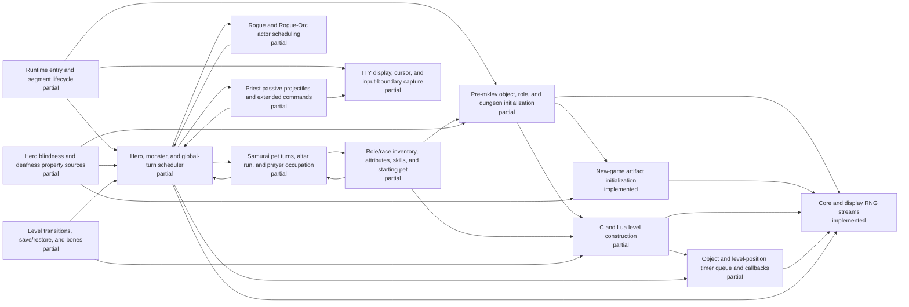

# Generated C/Lua ownership status

<!-- Generated by scripts/generate-ownership-map.mjs; edit c-lua-ownership.json. -->

Scope: Initial parity-critical ownership inventory; not yet exhaustive.

| Implemented | Partial | Stubbed | Absent | Total |
| ---: | ---: | ---: | ---: | ---: |
| 2 | 12 | 0 | 0 | 14 |

| Subsystem | Status | JavaScript owner | Bridges | Open gap |
| --- | --- | --- | --- | --- |
| Runtime entry and segment lifecycle | partial | js/jsmain.js js/allmain.js js/bridge_policy.js | top-level-fixtures session-shape.replayMoves | Save/restore, browser entry, and all role paths have not passed a sealed bridge-free gate. |
| Core and display RNG streams | implemented | js/rng.js js/isaac64.js | seeded-replay.recorded-rnl | No open gap inside the live RNG wrapper scope; seeded replay helpers remain separately forbidden. |
| Pre-mklev object, role, and dungeon initialization | partial | js/startup.js js/o_init.js js/dungeon.js js/artifacts.js js/roles.js | fastforward.pre-mklev | Object-description and artifact initialization are source-owned; remaining role_init selection/pantheon permutations, dungeon option strata, and a sealed startup gate are still open. |
| New-game artifact initialization | implemented | js/artifacts.js js/startup.js js/allmain.js js/roles.js | none | No open gap inside the new-game init_artifacts/hack_artifacts scope; artifact save/restore and unsupported runtime powers are tracked outside this entry. |
| Role/race inventory, attributes, skills, and starting pet | partial | js/u_init.js js/allmain.js js/invent.js js/windows.js js/options.js js/skills.js js/gold.js js/weight.js js/insight.js js/cmd.js js/vault.js js/end.js | fastforward.post-mklev | Role/race construction now owns substitutions, racial knowledge, Orc compensation, universal discover-mode wishing, role-money order, recursive contained gold/weight, carry-attribute boost, pauper/nudist, the complete startup reroll candidate/finalization lifecycle, and permanent blind/deaf initialization through the separate sensory-property owner. Cross-role pet state beyond pauper saddle suppression and a sealed stratified gate remain open. |
| Hero blindness and deafness property sources | partial | js/senses.js js/u_init.js js/options.js js/allmain.js js/cmd.js js/monmove.js js/polyself.js js/display.js js/insight.js | none | Permanent blind/deaf startup, aggregate property synchronization, timed-source clearing, current-form blindness, ordinary eyewear, and the Eyes blocker invariant are source-owned under focused witnesses. Light/engulfing blindness details, ball-and-chain repaint coupling, every artifact equipment message transition, unsupported deaf extrinsics, and a sealed stratified gate remain open. |
| C and Lua level construction | partial | js/mklev.js js/weight.js js/dungeon.js js/lua_des.js js/regions.js js/monmove.js js/light.js js/object_timers.js js/vision.js js/allmain.js js/mondeath.js js/monworn.js js/object_knowledge.js | fastforward.mineralize seeded room-fill compatibility paths | The ordinary-room orchestration and exact 31-name themed-room dispatch now have direct witnesses; Ghost, Cloud, Boulder, Spider, Garden, Trap, Massacre, and Statuary fills are live source callbacks. Ice now owns terrain construction, saveable TIMER_LEVEL scheduling, ordered dispatch, ordinary melt state, trap conversion, corpse thawing, unearthing, engraving cleanup, resumable boulder sink/fill/burial, splash wake-up, adjacent buried-zombie disturbance, airborne survival, common ordinary occupant death/drop/corpse, and worn-amulet life-saving including ordinary genocide-defeated reentry into death before burial. Buried treasure reaches ordered ROT_ORGANIC/ROT_CORPSE callbacks, Buried zombies reaches ordered revival/failure/fill-pit callbacks, and Light source shares that queue. Ice plus those three and Temple, Storeroom, and Teleportation hub remain partial at their explicit lifecycle gaps. Exact source ordering across all shapes, seven partial fill callbacks, many special-level operations, legacy seeded generation branches, incomplete monster/trap/special-object constructors, and a sealed gate remain open. |
| Object and level-position timer queue and callbacks | partial | js/object_timers.js js/allmain.js js/mklev.js js/light.js js/cmd.js js/mondeath.js js/monworn.js js/object_knowledge.js | none | The live queue owns saveable per-object and level-position timers, one monotonic id domain, source deadline ordering, newest-first equal-deadline ordering, claim-before-callback semantics, four object callback kinds, the ordinary MELT_ICE_AWAY core, and its resumable boulder sink/fill/burial and splash-wake continuation. The boulder-occupant branch now owns m_in_air survival, successful visible/unseen pre-detach life-saving, ordinary visible/unseen genocide-defeated life-saving followed by common death, ordinary detachment, inventory release, named and stacked corpse creation, corpse chance, G_NOCORPSE, and burial before splash. HATCH_EGG, FIG_TRANSFORM, SHRINK_GLOB, non-oil BURN_OBJECT variants, melt tame-pet life-saving recovery, shapechanging/special-death/active-mimic/pit-detachment and hero/unsafe-monster/drawbridge continuations, timer coordinate remapping and move/split/relink semantics, explicit terrain-mutation cancellation, exact pre-registry save tie reconstruction, inactive cached-level timers and catch-up, spot-time queries, complete inventory/worn corpse effects, and a sealed gate remain open. |
| Hero, monster, and global-turn scheduler | partial | js/allmain.js js/monmove.js | fastforward.turn fastforward.ranger-turn scheduler.default-replay-gap seeded role replay modules | Samurai, all five represented Rogue carriers, and the two represented Priest carriers have public bridge-free actor-rich witnesses; broader unseen actor/terrain branches and a sealed gate remain open. |
| Samurai pet turns, altar run, and prayer occupation | partial | js/allmain.js js/monmove.js js/pray.js | legacy-only samurai.altar-run-prayer legacy-only bounded Samurai compatibility cadence | The represented bridge-free Samurai path uses live dog_move and prayer turns, but wider candidate, combat, interruption, terrain, and sealed-corpus coverage is absent; legacy scoring still retains its compatibility bridge. |
| Rogue and Rogue-Orc actor scheduling | partial | js/allmain.js js/monmove.js js/cmd.js js/invent.js js/rogue_explore.js js/rogue_orc.js js/rogue_friday13.js | legacy-only rogue.explore legacy-only rogue.friday13 legacy-only rogue.orc legacy-only rogue.chargen legacy-only seeded-replay.rogue-explore legacy-only seeded-replay.rogue-orc legacy-only seeded-replay.rogue-friday13 | All represented Rogue compatibility paths now use live source-ration, actor/trap scheduling, command parsing, and persistence in bridge-free mode; alternate unseen actor, trap, command-binding, option, and sealed strata remain unverified. |
| Priest passive projectiles and extended commands | partial | js/allmain.js js/cmd.js js/monmove.js js/pray.js js/invent.js js/exper.js js/end.js js/gamelog.js js/priest_extcmd.js | legacy-only priest.passive-projectile legacy-only seeded-replay.priest-extcmd legacy-only snapshot-painter.fixture-screen | Both represented Priest carriers now use live source-ration, prayer, projectile lifecycle, command state, chronicle, overview, and naming in bridge-free mode; alternate ranged outcomes, pantheons, command histories, unseen actors/options, legacy bridge removal, and sealed strata remain unverified. |
| TTY display, cursor, and input-boundary capture | partial | js/terminal.js js/game_display.js js/display.js js/jsmain.js | snapshot-painter.fixture-screen | Snapshot painters remain in legacy mode and the full tty/window surface has no sealed bridge-free gate. |
| Level transitions, save/restore, and bones | partial | js/cmd.js js/save.js js/mklev.js | stress and ten-deaths top-level fixtures | Fresh save/restore chains and bones have not been exercised by a sealed bridge-free corpus. |

## Component ownership

| Subsystem | Component | Status | Open gap |
| --- | --- | --- | --- |
| C and Lua level construction | 31-form themeroom reservoir and named shape dispatch | partial | All exact Lua names have live constructors and five formerly collapsed rare forms have structural witnesses; exhaustive source-call ordering and a sealed stratum remain unproved. |
| C and Lua level construction | Fill: Ice room | partial | Room-wide ICE construction, the 25% timer gate, Lua row-major per-square deadlines, saveable TIMER_LEVEL state, shared timer-id ordering, ordinary ICE-to-MOAT/POOL terrain mutation, landmine/bear-trap conversion, corpse timer thawing, unearthing, engraving cleanup, conditional visible feedback, pre-RNG settling suspension, per-boulder rn2(10) sink/retry/fill behavior, remaining-pile burial, visible/audible splash and verbose sink feedback, wake messages, adjacent buried-zombie timer shortening, exact m_in_air survival including hidden versus grounded clingers, common ordinary monster detachment/inventory drop/corpse chance, gendered and named mkcorpstat state, corpse stacking, G_NOCORPSE, successful visible or unseen worn-amulet rescue, and ordinary visible or unseen genocide-defeated rescue followed by common death and burial have direct zero-bridge witnesses. Shapechanging, tame-pet wary_dog recovery, special corpse and explosion families, active mimic and pit detachment, pet/unique/special detachment, unsafe monster minliquid branches including gremlin and iron-golem effects, hero liquid and spoteffects continuation, drawbridge ice, timer coordinate remapping, explicit terrain-mutation cancellation, inactive cached-level catch-up, spot-time queries, and a sealed stratum remain open. |
| C and Lua level construction | Fill: Cloud room | implemented | No open gap inside this harmless callback scope: asleep fog population, persistent selection-backed region construction, blocker state, saveable level ownership, and per-occupant TTL extension have direct zero-bridge witnesses. |
| C and Lua level construction | Fill: Boulder room | implemented | No open gap inside this callback scope: filtered boulder versus rolling-trap construction and Lua callback order have direct zero-bridge witnesses. |
| C and Lua level construction | Fill: Spider nest | implemented | No open gap inside this callback scope: web placement and the depth-sensitive resident-spider gate have direct zero-bridge witnesses. |
| C and Lua level construction | Fill: Trap room | implemented | No open gap inside this callback scope: one shuffled source trap type is applied over the filtered selection in Lua callback order. |
| C and Lua level construction | Fill: Garden | implemented | No open gap inside this callback scope: lit-room nymph/fountain population and deferred grown-selection tree/arboreal-door transformation have a direct zero-bridge witness. |
| C and Lua level construction | Fill: Buried treasure | partial | Initialized-then-cleared chest contents, source-ordered burial draws, contained child objects and weight, retained coordinates, deferred directional engraving, ordered ROT_ORGANIC callback, contained-child burial, and ROT_CORPSE removal have direct zero-bridge witnesses. Protected contained-object impossibility handling, worn/inventory corpse side effects, inactive cached-level timing, and a sealed stratum remain open. |
| C and Lua level construction | Fill: Buried zombies | partial | Depth-sensitive construction, ordered ZOMBIFY_MON dispatch, living-to-zombie replacement, gender-preserving NO_MINVENT revival, blocked/genocided outcomes, occupied-square relocation, pit creation, visible/invisible/audible policy, and boulder fill_pit burial effects have direct zero-bridge witnesses. Hero-occupied relocation, all terrain/species and special corpse variants, full tty continuation capture, inactive cached-level timing, and a sealed stratum remain open. |
| C and Lua level construction | Fill: Massacre | implemented | No open gap inside this callback scope: the 27-entry role/guardian reservoir, 5d5 population, per-corpse reselection, and live corpse construction have direct zero-bridge witnesses. |
| C and Lua level construction | Fill: Statuary | implemented | No open gap inside this callback scope: 5d5 loose statues and 1d3 live statue traps delegate to shared source constructors under a direct zero-bridge witness. |
| C and Lua level construction | Fill: Light source | partial | The initialized lit oil lamp, source fuel breakpoints, saveable deadline state, ordered generic timer dispatch, global-turn expiration, and radius-three mobile illumination have a direct zero-bridge witness. Threshold warning text, non-oil burning objects, cleanup/reschedule variants, inactive cached-level timing, and a sealed stratum remain open. |
| C and Lua level construction | Fill: Temple of the gods | partial | Three altar callbacks exist, but source alignment ownership and complete special-object semantics remain open. |
| C and Lua level construction | Fill: Ghost of an Adventurer | implemented | No open gap inside this callback scope: live room selection, ghost state, colocated BUC-constrained equipment, and zero bridge usage have a direct witness. |
| C and Lua level construction | Fill: Storeroom | partial | Filtered chest/mimic construction exists; exhaustive source-order and sealed-stratum validation remain open. |
| C and Lua level construction | Fill: Teleportation hub | partial | Deferred trap/destination construction exists; exhaustive source-order and sealed-stratum validation remain open. |

No entry has a sealed-corpus gate yet. Public-session witnesses are retained only where the registry explicitly labels them as regressions.
