# Generated C/Lua ownership status

<!-- Generated by scripts/generate-ownership-map.mjs; edit c-lua-ownership.json. -->

Scope: Initial parity-critical ownership inventory; not yet exhaustive.

| Implemented | Partial | Stubbed | Absent | Total |
| ---: | ---: | ---: | ---: | ---: |
| 2 | 38 | 0 | 0 | 40 |

```mermaid
flowchart LR
    n_runtime_entry["Runtime entry and segment lifecycle<br/>partial"]
    n_rng_core["Core and display RNG streams<br/>implemented"]
    n_startup_pre_mklev["Pre-mklev object, role, and dungeon initialization<br/>partial"]
    n_startup_artifacts["New-game artifact initialization<br/>implemented"]
    n_startup_role_inventory["Role/race inventory, attributes, skills, and starting pet<br/>partial"]
    n_hero_sensory_properties["Hero blindness and deafness property sources<br/>partial"]
    n_level_generation["C and Lua level construction<br/>partial"]
    n_object_timer_queue["Object and level-position timer queue and callbacks<br/>partial"]
    n_floor_egg_hatching["Visible floor egg construction and hatching<br/>partial"]
    n_carried_egg_hatching["Unowned carried egg hatching<br/>partial"]
    n_floor_glob_shrinking["Ordinary floor glob construction and shrinking<br/>partial"]
    n_inventory_glob_shrinking["Hero-inventory glob shrinking<br/>partial"]
    n_floor_figurine_transform["Dropped floor figurine transformation<br/>partial"]
    n_carried_figurine_transform["Ordinary carried figurine transformation<br/>partial"]
    n_generated_monster_inventory["Generated and special-level monster inventory acquisition<br/>partial"]
    n_runtime_monster_inventory_acquisition["Live monster inventory acquisition and pet release<br/>partial"]
    n_thrown_object_detachment["Thrown object split and inventory detachment<br/>partial"]
    n_object_type_calling["Object type calling, discovery, and called-name presentation<br/>partial"]
    n_generic_swallowed_throw["Generic swallowed throw contact and acquisition<br/>partial"]
    n_monster_potion_impact["Monster potion impact and supported vapor effects<br/>partial"]
    n_physical_weapon_damage["Physical weapon damage dice, enchantment, erosion, and Strength<br/>partial"]
    n_hero_melee_two_weapon["Hero melee and two-weapon strike scheduling<br/>partial"]
    n_door_open_vision_memory["Door opening and adjacent vision memory<br/>partial"]
    n_projectile_hit_lifecycle["Projectile mulching and passive-object effects after a hit<br/>partial"]
    n_swallowed_projectile_engulfer_death["Projectile-caused ordinary engulfer death and same-square arrival<br/>partial"]
    n_object_stack_merging["Floor and monster-inventory stack merging<br/>partial"]
    n_monster_figurine_transform["Ordinary monster-carried figurine transformation<br/>partial"]
    n_timed_lamp_application["Lamp application and light transitions<br/>partial"]
    n_hero_sleep_wand_lifecycle["Self-directed sleep wand and helpless-turn lifecycle<br/>partial"]
    n_turn_scheduler["Hero, monster, and global-turn scheduler<br/>partial"]
    n_monk_actor_diet_lifecycle["Monk actor turns, command ownership, and vegetarian conduct<br/>partial"]
    n_knight_riding_scheduler["Knight actor turns, riding, chat, and prayer<br/>partial"]
    n_samurai_pet_turns["Samurai pet turns, altar run, and prayer occupation<br/>partial"]
    n_rogue_actor_scheduling["Rogue and Rogue-Orc actor scheduling<br/>partial"]
    n_priest_passive_projectiles["Priest passive projectiles and extended commands<br/>partial"]
    n_valkyrie_actor_scheduling["Valkyrie actor scheduling and generated room state<br/>partial"]
    n_caveman_actor_projectile["Caveman actor turns plus shared fireassist and projectile entry<br/>partial"]
    n_hero_gold_object_lifecycle["Canonical hero purse identity and carrier transitions<br/>partial"]
    n_tty_display["TTY display, cursor, and input-boundary capture<br/>partial"]
    n_level_transition_persistence["Level transitions, save/restore, and bones<br/>partial"]
    n_runtime_entry --> n_startup_pre_mklev
    n_runtime_entry --> n_turn_scheduler
    n_runtime_entry --> n_tty_display
    n_startup_pre_mklev --> n_rng_core
    n_startup_pre_mklev --> n_startup_artifacts
    n_startup_pre_mklev --> n_level_generation
    n_startup_artifacts --> n_rng_core
    n_startup_role_inventory --> n_startup_pre_mklev
    n_startup_role_inventory --> n_level_generation
    n_startup_role_inventory --> n_samurai_pet_turns
    n_hero_sensory_properties --> n_startup_pre_mklev
    n_hero_sensory_properties --> n_startup_artifacts
    n_hero_sensory_properties --> n_turn_scheduler
    n_level_generation --> n_rng_core
    n_level_generation --> n_object_timer_queue
    n_object_timer_queue --> n_rng_core
    n_floor_egg_hatching --> n_rng_core
    n_floor_egg_hatching --> n_level_generation
    n_floor_egg_hatching --> n_object_timer_queue
    n_floor_egg_hatching --> n_tty_display
    n_carried_egg_hatching --> n_rng_core
    n_carried_egg_hatching --> n_level_generation
    n_carried_egg_hatching --> n_object_timer_queue
    n_carried_egg_hatching --> n_tty_display
    n_floor_glob_shrinking --> n_rng_core
    n_floor_glob_shrinking --> n_level_generation
    n_floor_glob_shrinking --> n_object_timer_queue
    n_floor_glob_shrinking --> n_tty_display
    n_inventory_glob_shrinking --> n_rng_core
    n_inventory_glob_shrinking --> n_object_timer_queue
    n_inventory_glob_shrinking --> n_tty_display
    n_floor_figurine_transform --> n_rng_core
    n_floor_figurine_transform --> n_object_timer_queue
    n_floor_figurine_transform --> n_turn_scheduler
    n_floor_figurine_transform --> n_tty_display
    n_carried_figurine_transform --> n_rng_core
    n_carried_figurine_transform --> n_object_timer_queue
    n_carried_figurine_transform --> n_turn_scheduler
    n_carried_figurine_transform --> n_tty_display
    n_generated_monster_inventory --> n_rng_core
    n_generated_monster_inventory --> n_level_generation
    n_generated_monster_inventory --> n_object_timer_queue
    n_generated_monster_inventory --> n_turn_scheduler
    n_runtime_monster_inventory_acquisition --> n_rng_core
    n_runtime_monster_inventory_acquisition --> n_turn_scheduler
    n_runtime_monster_inventory_acquisition --> n_object_timer_queue
    n_runtime_monster_inventory_acquisition --> n_tty_display
    n_thrown_object_detachment --> n_rng_core
    n_object_type_calling --> n_tty_display
    n_generic_swallowed_throw --> n_rng_core
    n_generic_swallowed_throw --> n_thrown_object_detachment
    n_generic_swallowed_throw --> n_monster_potion_impact
    n_generic_swallowed_throw --> n_physical_weapon_damage
    n_generic_swallowed_throw --> n_projectile_hit_lifecycle
    n_generic_swallowed_throw --> n_turn_scheduler
    n_generic_swallowed_throw --> n_runtime_monster_inventory_acquisition
    n_generic_swallowed_throw --> n_object_stack_merging
    n_generic_swallowed_throw --> n_object_timer_queue
    n_generic_swallowed_throw --> n_tty_display
    n_monster_potion_impact --> n_rng_core
    n_monster_potion_impact --> n_thrown_object_detachment
    n_monster_potion_impact --> n_object_type_calling
    n_monster_potion_impact --> n_object_stack_merging
    n_monster_potion_impact --> n_level_generation
    n_monster_potion_impact --> n_turn_scheduler
    n_monster_potion_impact --> n_tty_display
    n_physical_weapon_damage --> n_rng_core
    n_hero_melee_two_weapon --> n_rng_core
    n_hero_melee_two_weapon --> n_physical_weapon_damage
    n_door_open_vision_memory --> n_rng_core
    n_door_open_vision_memory --> n_hero_sensory_properties
    n_door_open_vision_memory --> n_tty_display
    n_projectile_hit_lifecycle --> n_rng_core
    n_projectile_hit_lifecycle --> n_physical_weapon_damage
    n_projectile_hit_lifecycle --> n_tty_display
    n_swallowed_projectile_engulfer_death --> n_generic_swallowed_throw
    n_swallowed_projectile_engulfer_death --> n_projectile_hit_lifecycle
    n_swallowed_projectile_engulfer_death --> n_runtime_monster_inventory_acquisition
    n_swallowed_projectile_engulfer_death --> n_object_stack_merging
    n_swallowed_projectile_engulfer_death --> n_turn_scheduler
    n_swallowed_projectile_engulfer_death --> n_tty_display
    n_object_stack_merging --> n_object_timer_queue
    n_monster_figurine_transform --> n_rng_core
    n_monster_figurine_transform --> n_object_timer_queue
    n_monster_figurine_transform --> n_turn_scheduler
    n_monster_figurine_transform --> n_tty_display
    n_timed_lamp_application --> n_object_timer_queue
    n_timed_lamp_application --> n_hero_sensory_properties
    n_timed_lamp_application --> n_tty_display
    n_hero_sleep_wand_lifecycle --> n_rng_core
    n_hero_sleep_wand_lifecycle --> n_turn_scheduler
    n_hero_sleep_wand_lifecycle --> n_hero_sensory_properties
    n_turn_scheduler --> n_rng_core
    n_turn_scheduler --> n_object_timer_queue
    n_turn_scheduler --> n_samurai_pet_turns
    n_turn_scheduler --> n_rogue_actor_scheduling
    n_turn_scheduler --> n_priest_passive_projectiles
    n_turn_scheduler --> n_valkyrie_actor_scheduling
    n_turn_scheduler --> n_caveman_actor_projectile
    n_turn_scheduler --> n_monk_actor_diet_lifecycle
    n_turn_scheduler --> n_knight_riding_scheduler
    n_monk_actor_diet_lifecycle --> n_turn_scheduler
    n_monk_actor_diet_lifecycle --> n_startup_role_inventory
    n_monk_actor_diet_lifecycle --> n_tty_display
    n_knight_riding_scheduler --> n_turn_scheduler
    n_knight_riding_scheduler --> n_startup_role_inventory
    n_knight_riding_scheduler --> n_tty_display
    n_samurai_pet_turns --> n_turn_scheduler
    n_samurai_pet_turns --> n_startup_role_inventory
    n_samurai_pet_turns --> n_hero_melee_two_weapon
    n_samurai_pet_turns --> n_door_open_vision_memory
    n_rogue_actor_scheduling --> n_turn_scheduler
    n_priest_passive_projectiles --> n_turn_scheduler
    n_priest_passive_projectiles --> n_tty_display
    n_valkyrie_actor_scheduling --> n_turn_scheduler
    n_valkyrie_actor_scheduling --> n_level_generation
    n_valkyrie_actor_scheduling --> n_startup_role_inventory
    n_caveman_actor_projectile --> n_turn_scheduler
    n_caveman_actor_projectile --> n_startup_role_inventory
    n_caveman_actor_projectile --> n_projectile_hit_lifecycle
    n_caveman_actor_projectile --> n_tty_display
    n_hero_gold_object_lifecycle --> n_startup_role_inventory
    n_hero_gold_object_lifecycle --> n_caveman_actor_projectile
    n_hero_gold_object_lifecycle --> n_projectile_hit_lifecycle
    n_hero_gold_object_lifecycle --> n_tty_display
    n_level_transition_persistence --> n_level_generation
    n_level_transition_persistence --> n_turn_scheduler
```

| Subsystem | Status | JavaScript owner | Bridges | Open gap |
| --- | --- | --- | --- | --- |
| Runtime entry and segment lifecycle | partial | js/jsmain.js js/allmain.js js/bridge_policy.js | top-level-fixtures session-shape.replayMoves | Save/restore, browser entry, and all role paths have not passed a sealed bridge-free gate. |
| Core and display RNG streams | implemented | js/rng.js js/isaac64.js | seeded-replay.recorded-rnl | No open gap inside the live RNG wrapper scope; seeded replay helpers remain separately forbidden. |
| Pre-mklev object, role, and dungeon initialization | partial | js/startup.js js/o_init.js js/dungeon.js js/artifacts.js js/roles.js | none | Object-description, artifact initialization, role/pantheon initialization, dungeon initialization, and handedness/initial-power inputs are live and have one owner in normal and bridge-free modes. Alternate legal race/gender/alignment and dungeon-option strata plus a sealed startup gate remain open. |
| New-game artifact initialization | implemented | js/artifacts.js js/startup.js js/allmain.js js/roles.js | none | No open gap inside the new-game init_artifacts/hack_artifacts scope; artifact save/restore and unsupported runtime powers are tracked outside this entry. |
| Role/race inventory, attributes, skills, and starting pet | partial | js/u_init.js js/allmain.js js/invent.js js/windows.js js/options.js js/skills.js js/gold.js js/weight.js js/insight.js js/cmd.js js/vault.js js/end.js | none | All selectable roles now enter makedog, role/race inventory, attributes, discoveries, skills, equipment, and candidate finalization in both modes; the unreachable Tourist fallback graph and post-mklev replay are deleted. Substitution and racial knowledge, Orc compensation, discover-mode wishing, role-money order, recursive gold/weight, carry boost, pauper/nudist, rerolls, and permanent sensory initialization have focused witnesses. Non-human cross-role pet combinations, broader options, and a sealed stratified gate remain open. |
| Hero blindness and deafness property sources | partial | js/senses.js js/u_init.js js/options.js js/allmain.js js/cmd.js js/monmove.js js/polyself.js js/display.js js/insight.js | none | Permanent blind/deaf startup, aggregate property synchronization, timed-source clearing, current-form blindness, ordinary eyewear, and the Eyes blocker invariant are source-owned under focused witnesses. Light/engulfing blindness details, ball-and-chain repaint coupling, every artifact equipment message transition, unsupported deaf extrinsics, and a sealed stratified gate remain open. |
| C and Lua level construction | partial | js/mklev.js js/egg.js js/glob.js js/object_data.js js/monster_data.js js/weight.js js/dungeon.js js/lua_des.js js/regions.js js/monmove.js js/light.js js/object_timers.js js/vision.js js/allmain.js js/mondeath.js js/monworn.js js/object_knowledge.js js/u_init.js | seeded room-fill compatibility paths | The ordinary-room orchestration and exact 31-name themed-room dispatch now have direct witnesses; Ghost, Cloud, Boulder, Spider, Garden, Trap, Massacre, and Statuary fills are live source callbacks. Ice now owns terrain construction, saveable TIMER_LEVEL scheduling, ordered dispatch, ordinary melt state, source trap normalization including mtrapped clearing, ordinary pit destruction and undestroyable-trap retention, trap conversion, corpse thawing, unearthing, engraving cleanup, resumable boulder sink/fill/burial, splash wake-up, adjacent buried-zombie disturbance, airborne survival, common ordinary occupant death/drop/corpse, object/furniture mimic detachment with light-blocker repair, and worn-amulet life-saving including ordinary genocide-defeated reentry and simple tame-pet wary_dog recovery before burial. Buried treasure reaches ordered ROT_ORGANIC/ROT_CORPSE callbacks, Buried zombies reaches ordered revival/failure/fill-pit callbacks, Light source shares the oil-lamp/brass-lantern timed-light owner, fresh typed eggs attach a live floor-hatch deadline, and initialized globs attach a live ordinary-floor shrink deadline. Ice plus those three and Temple, Storeroom, Teleportation hub, non-floor egg carriers, and nonordinary glob carriers remain partial at their explicit lifecycle gaps. Exact source ordering across all shapes, seven partial fill callbacks, many special-level operations, legacy seeded generation branches, incomplete monster/trap/special-object constructors, and a sealed gate remain open. |
| Object and level-position timer queue and callbacks | partial | js/object_timers.js js/object_merge.js js/allmain.js js/mklev.js js/egg.js js/glob.js js/figurine.js js/figurine_timer.js js/monster_inventory.js js/swallowed_throw.js js/monmove.js js/object_data.js js/monster_data.js js/weight.js js/light.js js/cmd.js js/mondeath.js js/monworn.js js/object_knowledge.js js/u_init.js | none | The live queue owns saveable per-object and level-position timers, one monotonic id domain, source deadline ordering, newest-first equal-deadline ordering, claim-before-callback semantics, all seven enumerated object callback kinds, oil-lamp and brass-lantern exact/overdue burn state, manual cancellation with unused-time restoration, mobile illumination, visible floor and ordinary unowned female-hero inventory HATCH_EGG constructor/callback/presentation/lifecycle, ordinary non-ice floor and hero-inventory SHRINK_GLOB constructor/exact/catch-up/active-eating/presentation/deletion/capacity lifecycles, ordinary floor and monster-inventory glob absorption with averaged live shrink delays, and ordinary floor, hero-inventory, plus monster-inventory FIG_TRANSFORM attachment/acquisition/familiar/placement/retry/presentation/deletion, plus the ordinary MELT_ICE_AWAY core. Enumerated callback reachability is not complete carrier coverage. Monster-inventory, owned/male-parentage, dragon, special-locomotion, overdue-inventory, taming/cry, and broader hatch placement/extinction HATCH_EGG variants; ice, contained, buried, migrating, worn, and nested-weight SHRINK_GLOB carrier variants; broader monster object-acquisition routes, special familiar forms, unique/extinct limits, liquid death, manual application, broader object-transition timer preservation, and reattachment breadth; burn warning presentation; other BURN_OBJECT variants; complex-pet and special-death continuations; timer coordinate remapping and move/split/relink semantics; inactive cached-level timers; and a sealed gate remain open. |
| Visible floor egg construction and hatching | partial | js/mklev.js js/object_timers.js js/allmain.js js/egg.js js/monster_data.js js/weight.js | none | Fresh typed eggs and the visible, unowned floor-stack carrier are source-shaped but the subsystem is partial. Ordinary unowned female-hero inventory is owned separately. Monster inventory, owned eggs and taming, male-parentage RNG, dragon special handling, special locomotion, broader placement failure and extinction-during-batch behavior, timer preservation across corpsenm mutation, moved/split/relinked eggs, inactive cached-level catch-up, and a sealed stratum remain open. |
| Unowned carried egg hatching | partial | js/object_timers.js js/allmain.js js/egg.js js/mklev.js js/monster_data.js js/weight.js | none | The exact female-hero, spe-zero, non-dragon, ordinary-locomotion inventory carrier is source-shaped. Owned eggs, male-parentage rn2(2), taming and newborn cries, carried dragons, flyers/floaters/slithy/amorphous or immobile newborn prose, overdue carried state, monster inventory, broader placement/extinction behavior, timer moves and splits, and a sealed stratum remain open. |
| Ordinary floor glob construction and shrinking | partial | js/mklev.js js/object_data.js js/object_timers.js js/allmain.js js/glob.js js/weight.js | none | Initialized globs and the ordinary non-ice floor carrier are source-shaped but the subsystem is partial. Hero inventory and glob absorption are owned separately. Ice and buried-under-ice cadence, monster-inventory shrink callbacks, nested containers and recursive weight, migration and burial deletion, worn cleanup, save relocation, inactive-level variants beyond the direct overdue arithmetic witness, and a sealed stratum remain open. |
| Hero-inventory glob shrinking | partial | js/object_timers.js js/allmain.js js/glob.js js/weight.js | none | Ordinary unworn hero-inventory exact shrinking, active-eating deferral, threshold prose, final dissolution, deletion, rescheduling, and capacity feedback are source-shaped. Glob absorption is tracked separately. Worn cleanup, all naming/shop variants, restored-overdue inventory UI reconciliation, monster-inventory shrink callbacks, containers, ice, migration, burial, and a sealed stratum remain open. |
| Dropped floor figurine transformation | partial | js/cmd.js js/mklev.js js/figurine_timer.js js/object_timers.js js/allmain.js js/figurine.js | none | The ordinary timed wumpus floor carrier is source-shaped across command drop, exact and hero-adjacent placement, visible or overdue presentation policy, blocked-terrain retry, occupied-square construction failure, and deletion. Unseen exact transformation, boulder and pass-wall placement variants, named and alternate-locomotion prose, invisibility, mimics, hiding, minions, shapechangers, weaponed pets, unique/extinct construction limits, liquid death, throwing and forced-drop timer preservation, inactive cached-level timing, and a sealed stratum remain open. |
| Ordinary carried figurine transformation | partial | js/u_init.js js/cmd.js js/figurine_timer.js js/object_timers.js js/allmain.js js/figurine.js js/mklev.js | none | Cursed hero-inventory attachment and the ordinary walking, weaponless, nonshifting, nonminion familiar carrier are source-shaped, including whole-map enexto fallback and total-placement-failure rnd(5000) retry, but the subsystem is partial. Floor and monster-inventory ownership are tracked separately; a generic swallowed throw now owns timer replacement through mpickobj. Named forms, alternate locomotion prose, invisible or hidden spawned forms, minions, shapechangers, immediate pet weapon setup, unique/extinct birth limits, liquid death, manual figurine application, ordinary non-swallowed throw and forced-drop timer preservation, other inventory insertion paths, and a sealed stratum remain open. |
| Generated and special-level monster inventory acquisition | partial | js/monster_inventory.js js/mklev.js js/allmain.js | none | The primary makemon constructor, duplicated ambient m_initinv path, court ruler, hardcoded Lua/special inventories, shrine priests, and shop stocking now cross shared acquisition/link boundaries with live ownership metadata, source head insertion, and carrying-effect separation. Live runtime acquisitions and stack merging are tracked separately. Broader defensive/offensive item combinations, mplayer and lawful-minion normalization, knowledge loss, light snuffing and candle burn, saddle/equipment continuation, save/restore migration details, and a sealed stratum remain open. |
| Live monster inventory acquisition and pet release | partial | js/monster_inventory.js js/cmd.js js/monmove.js | none | Unicorn gem acceptance, ordinary pet pickup/release, exact-square covetous artifact pickup, bullwhip inventory snatch, clone-Wizard fake-Amulet linkage, default head insertion, represented misc/offensive scans, and ordinary death release now use the common source-shaped chain. Stack merging and the generic swallowed-throw transaction, including supported lamp snuffing, surviving physical/projectile weapons, and killing-projectile acquisition/release with ordinary prior inventory, are tracked separately. Swallowed consuming objects, special carried effects, other thrown or kicked catches, shopkeeper projectile snatches, quest-leader retention, monster container rummaging, polymorph transfers, knowledge loss, non-swallowed light snuffing and candle burn, equipment continuation, migration persistence, and a sealed stratum remain open. |
| Thrown object split and inventory detachment | partial | js/thrown_object.js js/swallowed_throw.js js/potion_throw.js js/cmd.js | throw.swallowed-weapon-unsupported throw.swallowed-special-unsupported throw.potion-impact-unsupported | One shared helper owns timerless singleton freeinv and timerless stack split for the represented swallowed and ordinary potion callers. Cursed ungreased map potions own the post-detachment rn2(7) gate whose zero branch cannot reroute a non-throwing weapon. Greased map potions own child allocation before slip, horizontal direction rewriting, and the vertical basic-ROOM hitfloor branch when every RNG-reachable direction stays inside the bounded map-potion owner. Worn and ready-state unwinding, split timer replication, unpaid and billed identities, container links, punishment objects, multishot bookkeeping, split/unsplit return paths, broader greased worlds whose alternate directions cross unsupported targets or terrain, every older duplicated caller, and a sealed stratum remain open. |
| Object type calling, discovery, and called-name presentation | partial | js/object_call.js js/query.js js/object_knowledge.js js/invent.js js/potion_hit.js js/cmd.js js/throw_state.js | throw.potion-impact-unsupported | The shared owner covers seen unknown potion trycall after live swallowed vapor and visible map impact, effect-driven potionbreathe makeknown for paralysis/sleeping and eligible invisibility/blindness, PL_PSIZ normalization, type-wide discovery storage, existing-name suppression, shuffled-appearance prompts, and called-name inventory/impact/throw presentation. Hero quaff and explicit inventory #call reuse the same prompt owner. Renaming or clearing an existing call through every #call menu carrier, floor/discovery-list calling, from-sink fluid prompts, hallucination and blindness variants, save/restore breadth, non-potion automatic trycall callers, exhaustive long-line tty wrapping, and a sealed stratum remain open. |
| Generic swallowed throw contact and acquisition | partial | js/swallowed_throw.js js/throw_state.js js/thrown_object.js js/cmd.js js/potion_hit.js js/projectile.js js/weapon_damage.js js/skills.js js/attrib.js js/monster_inventory.js js/object_merge.js js/figurine_timer.js js/light.js js/object_timers.js js/senses.js js/vision.js js/end.js js/exper.js js/display.js | throw.swallowed-weapon-unsupported throw.swallowed-special-unsupported throw.potion-impact-unsupported | The non-worn, paid, generic non-consuming object path is live from selector and persistent direction through split/free ownership, cursed or greased slip rewriting, capacity and low-stamina evaluation, hit-roll cadence, wake/contact prose, LOST_THROWN-to-LOST_STOLEN repair, carrying effects, timer replacement, source-head minvent insertion, and compatible-stack absorption. Overtaxed throws reject before selector input. Unencumbered and Burdened low-HP throws bypass the stamina branch; Stressed human and polymorphed throws publish the drop, distinguish physical exercise, rewrite direction downward, and still contact the engulfer. Lit oil lamps, brass lanterns, and magic lamps additionally own link-before-snuff and burn cleanup. Ordinary hard-material non-ammo weapons, weapon-tools, and a single weapon-class missile or ammunition identity own live damage and survivor continuations. Six inert, five healing/ability, sickness, confusion, booze, paralysis, sleeping, speed, blindness, invisibility, water, acid, and unlit oil potion types own swallowed guaranteed contact; water includes the naturally susceptible demonic engulfer survivor path and rejects unique fatality before mutation; acid owns a susceptible silent engulfer plus Constitution vapor. Ordinary map flight is tracked separately, and its low-stamina hitfloor continuation, air-level variants, terrain, breakage, shipping, altar, and shop effects remain open. The ordinary room death slice owns xkilled narration, killing-object acquisition, swallowed-state release/redraw/cooldown, head-first relobj, corpse and extra-drop suppression, same-square autopickup/look_here, experience, and alignment cleanup with empty or ordinary weapon/scroll prior inventory, including compatible stack absorption. Multishot and multigen stacks, gem/sling ammo, boomerangs/returning weapons, silver/blessed/poison/artifact and target-specific modifiers, axes, peaceful/pet/worm carriers, worn weapons, shop state, gold, food/taming, lamplit oil explosions, polymorph and the remaining potion families, eggs/pies/venom, boulders and iron balls, attached objects, unsupported lights, timed splitting, life-saving and other special deaths, special carried effects, non-room terrain/traps/shops/punishment, complete naming variants, and a sealed stratum remain open. Every unresolved swallowed class now reaches a named compatibility bridge instead of ordinary floor logic. |
| Monster potion impact and supported vapor effects | partial | js/potion_hit.js js/potion_throw.js js/object_call.js js/throw_state.js js/thrown_object.js js/swallowed_throw.js js/cmd.js js/query.js js/object_knowledge.js js/invent.js js/options.js js/were.js js/polyself.js js/do.js js/mklev.js js/object_data.js js/monmove.js js/allmain.js js/senses.js js/vision.js js/display.js | throw.potion-impact-unsupported | The shared owner covers six inert identities plus gain ability, restore ability, healing, extra healing, full healing, sickness, confusion, booze, paralysis, sleeping, speed, blindness, invisibility, water, acid, and unlit oil for swallowed guaranteed contact and ordinary sighted ROOM/CORR/open-DOOR map flight. Water owns ordinary vapor, monster taxonomy and damage/healing, iron-golem rust, monster and hero gremlin cloning, cursed you_were, blessed you_unwere, Unchanging, threat ordering, stunned/Unaware control loss, ordinary y/n input, paranoid Were-change yes-line input, global Confirm rejection, and zero-duration restoration. Live swallowed acceptance and live two-square map decline prove prompts occur after real object detachment rather than serving as fail-before acceptance. Seen unknown potions now cross real swallowed or visible-map impact before source-shaped trycall, while paralysis/sleeping and eligible invisibility/blindness vapor identify through makeknown instead. Swallowed potion throws additionally own overtaxed preflight plus unencumbered, Burdened, and Stressed low-HP outcomes; the Stressed branch rewrites direction downward but still reaches engulfer impact. Greased map potions own post-detachment horizontal rerouting and the zero-axis basic-ROOM hitfloor, breakage, and proximity-vapor path when all RNG-reachable directions remain within this bounded owner. Remaining gaps include equipped were transformations until mon_break_armor and possibly_unwield are complete; a live external blessed-beast carrier; the ordinary-map low-stamina hitfloor continuation and air-level variants; broader greased worlds with unsupported alternate targets or terrain; special fatalities and life-saving; lamplit oil; blind, levitation, underwater, trap, terrain, shop, peaceful, tame, unique, worm, individual-name and visibility variants, and unsupported potion paths; in-game paranoid-option editing; and a sealed stratum. Lua owns none of this runtime path. |
| Physical weapon damage dice, enchantment, erosion, and Strength | partial | js/weapon_damage.js js/swallowed_throw.js js/cmd.js | none | The ordinary physical damage table, enchantment, erosion, Strength bonus, weapon skill, and two-weapon skill projections are shared. Swallowed weapon/projectile callers and ordinary hero melee compose those owners, including the three-quarter dual-wield Strength adjustment and P_TWO_WEAPON_COMBAT training. Target-specific blessed, silver, wooden, artifact-light, shade, thick-hide, axe, poison, and special-monster modifiers are deliberately excluded; several map projectile callers still retain partial duplicated damage ownership, and no sealed stratum has run. |
| Hero melee and two-weapon strike scheduling | partial | js/cmd.js js/skills.js js/weapon_damage.js js/hunger.js | none | Ordinary equipped primary melee and a surviving valid two-weapon target now share hit selection, off-hand scheduling, weapon selection, conduct, damage, skill training, dual-wield Strength, survivor, kill, and passive boundaries. Unarmed double-punch, confirmation override, passive paralysis and life-saving interruption, weapon destruction between strikes, special artifact/poison/material damage, displacement, swallowed melee variants, complete peaceful/shop/guard response, save/restore, and a sealed stratum remain open. |
| Door opening and adjacent vision memory | partial | js/cmd.js js/vision.js js/display.js | none | The ordinary auto-open transaction mutates D_ISOPEN and delegates projection to shared vision/display owners without role-and-coordinate memory deletion. Locked, trapped, obstructed, secret, rogue-level, blind, tactile, manual-open, shop, pet, runmode, save/restore, and sealed strata remain open. |
| Projectile mulching and passive-object effects after a hit | partial | js/projectile.js js/swallowed_throw.js js/cmd.js | throw.swallowed-weapon-unsupported | Hero-thrown ordinary ammunition and missiles now share one source-shaped mulch/free and fire, acid, rust, corrosion, or enchantment passive-object owner across map and swallowed callers. Matching-sling map volleys select one source action-level count before splitting, apply a positive command limit after that roll, and settle each unit independently. The swallowed continuation directly owns one weapon-class identity and correctly bypasses mulch/passive after the ordinary killing continuation acquires and disposes of it. Other multishot and count-prefix families, other multigen stacks, gem/sling swallowed ammo, mid-volley interruption, boomerangs, monster-moving blessed mulch, poison, silver/blessed target damage, artifact/special projectiles, complex projectile-caused engulfer deaths, broader passive materials and carried presentation, shop billing, and a sealed stratum remain open. |
| Projectile-caused ordinary engulfer death and same-square arrival | partial | js/swallowed_throw.js js/cmd.js js/monster_inventory.js js/projectile.js js/display.js js/end.js js/exper.js | throw.swallowed-weapon-unsupported | The live source-owned slice is intentionally bounded to an ordinary hostile, nonunique, nonshifting engulfer in an untrapped ROOM with no shop, punishment, steed, explosion, life-saving, or special-death state. Empty inventory and ordinary non-worn, untimed, paid, non-artifact weapon/scroll inventory are supported. Within that slice it owns killing-object head insertion or compatible-stack absorption, attachment release, redraw/cooldown, head-first inventory drop, reverse floor order, no-corpse/no-extra-drop, same-square pickup or observation, death accounting, and post-kill exercise. Other object classes and special carried effects, life-saving and vampire revival, special monsters, shops, traps and non-room terrain, blindness/punishment breadth, hero death during spoteffects, alternate pickup filters/capacity, and a sealed stratum remain open and cross the named weapon bridge before mutation. |
| Floor and monster-inventory stack merging | partial | js/object_merge.js js/mklev.js js/monster_inventory.js js/object_timers.js | none | Ordinary compatible stacks and globs share one survivor/free boundary across floor stacking and monster add_to_minv. Quantity, ordinary and coin weight, weighted age, name and knowledge promotion, bypass propagation, incoming timer deletion, glob delay averaging, and swallowed LOST_STOLEN compatibility are live. Unpaid same-price and bill fixups, mail-command identity, lit-object light-source merging, hero addinv and worn-slot reconciliation, contained/migrating/buried chains, pudding presentation, remaining how_lost and knowledge variants, and a sealed stratum remain open. |
| Ordinary monster-carried figurine transformation | partial | js/monster_inventory.js js/swallowed_throw.js js/cmd.js js/monmove.js js/allmain.js js/figurine_timer.js js/object_timers.js js/figurine.js js/mklev.js js/display.js | none | The ordinary cursed wumpus figurine is source-shaped when it crosses the shared monster acquisition boundary and transforms from a visible or invisible leocrotta carrier, including pool attribution, overdue silence, blocked-placement retry, and post-presentation deletion. Ordinary floor pickup, deferred hero theft, primary and ambient generated inventory, hardcoded special-level transfer, shrine, court, shop, pet, covetous, unicorn-gift, bullwhip, and live swallowed generic-throw paths call that boundary in production; the swallowed route directly witnesses timer replacement. Stack merging is tracked separately; figurines themselves are nonmergeable. Other thrown or kicked catches, special swallowed objects, polymorph transfer, light snuffing, knowledge loss, named and long-worm carrier attribution, See-invisible, alternate locomotion, hidden spawned forms, special familiar state, inactive cached-level timing, and a sealed stratum remain open. |
| Lamp application and light transitions | partial | js/cmd.js js/swallowed_throw.js js/monster_inventory.js js/light.js js/object_timers.js js/shk.js js/senses.js js/vision.js | none | Oil lamps, brass lanterns, and magic lamps own the ordinary live doapply transaction, including timed or untimed start/stop, source branch order, mobile light, blind presentation, cursed RNG and glib state, normal-use shop fees, and lit magic-to-oil timer acquisition during djinni release. They also own swallowed mpickobj link-before-snuff ordering, unused-fuel restoration, and sighted/blind presentation. Alternate unpaid djinni-release billing, mute or non-speaking shopkeeper presentation, threshold warning prose, other light-source families, non-swallowed carrier/location transitions, and a sealed stratum remain open. |
| Self-directed sleep wand and helpless-turn lifecycle | partial | js/cmd.js js/allmain.js | none | Ordinary self-directed WAN_SLEEP now follows zapyourself state: charge expenditure, Wisdom exercise, type knowledge, sleep-resistance refusal, rnd(50) negative-multi duration, current-world actor/global maintenance, and timeout wakeup. Directional sleep rays have a separate partial live owner in cmd.js but are not claimed by this entry. Monster sleep-resistance observation, early combat wakeup, polymorph and other sleep sources, interruption presentation, persistence, options, and a sealed stratum remain open. |
| Hero, monster, and global-turn scheduler | partial | js/allmain.js js/monmove.js | fastforward.turn scheduler.default-replay-gap seeded role replay modules | Represented fresh bridge-free slices now have command-derived state transitions rather than role/pet-existence or bridge-ledger oracles: trap discovery, threat-sensitive wait refusal, actor position/HP/inventory changes, projectile carrier changes, prayer conduct, Healer negative-multi sleep, Monk diet/object lifecycle, and Knight riding. The removed all-role and legal-race loops were not mechanics evidence, so this entry makes no all-role or legal-strata coverage claim. fastforward.turn, scheduler.default-replay-gap, and seeded replay modules remain for explicitly classified Tourist, Wizard, and other normal-mode compatibility paths. Wider roles, races, actors, terrain, interruption, options, save/restore, and sealed strata remain open. |
| Monk actor turns, command ownership, and vegetarian conduct | partial | js/allmain.js js/monmove.js js/cmd.js js/detect.js js/display.js | none | All Monk command streams now use ordinary movement, wait, search, pickup, kick, eat, current-actor, display-color, and turn-maintenance owners. The move-prefix classifier, fixed hero/pet/goblin/corpse/turn mutations, aggregate RNG module, and trace-only display exceptions are deleted. Shared floor and carried corpse meals now own touch, conduct, Monk guilt, adjalign abuse, timed eating, completion, and object removal; ordinary and rotten flesh foods retain the same Monk-specific conduct rule. Corpse hazard/post-effect breadth, interrupted or relocated meals, partially eaten stacks, polymorph diets, worn/non-food/tin/glob paths, wider terrain/actor/run/search/pickup/kick states, tty pagination, save/restore, and a sealed stratum remain open. |
| Knight actor turns, riding, chat, and prayer | partial | js/allmain.js js/monmove.js js/cmd.js js/u_init.js js/pray.js | none | All Knight command streams now use current-state movement-ration, fmon/dog_move, global maintenance, prayer, chat, movement, search, look-here, combat, and riding owners. The two future-input classifiers, fixed hero/pet/zombie/goblin/floor/turn/search mutations, aggregate RNG routines, and dedicated mounted movement dispatcher are deleted. The represented riding slice validates a live saddle and tame non-minion, preserves one steed identity across mount/dismount, applies source mount chance and slip damage, and uses the source landing candidate order, minimum-distance policy, trap/boulder relaxation, and equal-distance reservoir selection. Hallucination, wounded legs, burden, blindness and mimic visibility, swallowing/stuck/trapped/punished states, long worms, full test_move and form rules, petrification, monster traps, underwater restrictions, armor/levitation/fumbling/slippery-saddle checks, exact fatal-slip control flow, named/hallucinated/cursed-saddle presentation, stealth and leg transitions, engulfer/water/lava/overcrowding dismounts, complete mounted combat and jousting, steed save/restore, wider roles/options/terrain, and a sealed stratum remain open. |
| Samurai pet turns, altar run, and prayer occupation | partial | js/allmain.js js/monmove.js js/pray.js | none | Samurai now uses the shared source movement-ration, live fmon/dog_move scan, once-per-turn maintenance, hero_seq, negative-multi, and prayer_done continuation in both bridge-free and normal runner modes. The aggregate Samurai RNG ranges, hard-coded hero/pet path tables, altar classifier, timed-action counter, prayer transcript, lichen combat branch, and doorway-memory branch are deleted. The lichen carrier now reaches shared primary/off-hand melee and the door carrier reaches shared door/vision ownership. Wider pet candidates, combat modifiers, terrain, interruption, divine outcomes, save/restore, and a sealed stratum remain open. |
| Rogue and Rogue-Orc actor scheduling | partial | js/allmain.js js/monmove.js js/cmd.js js/invent.js | none | All Rogue roles, races, coordinates, command streams, and normal/bridge-free modes now enter the shared source movement ration, actor/trap scheduling, command parsing, and persistence owners. The explore, Friday-13, Orc, and chargen classifiers; hard-coded hero/pet paths; command counter; maintenance bypass; elapsed-turn override; aggregate RNG tables; and three replay modules are deleted. Alternate unseen actors, trap kinds, bindings, options, dungeon branches, long save/restore histories, and a sealed stratum remain unverified. |
| Priest passive projectiles and extended commands | partial | js/allmain.js js/cmd.js js/monmove.js js/pray.js js/invent.js js/exper.js js/end.js js/gamelog.js | none | Normal and bridge-free Priest execution now share the live source-ration, prayer, projectile lifecycle, extended-command, command state, chronicle, overview, and naming owners. Both replayMoves classifiers, the command-swallow path, hard-coded pet positions, aggregate RNG, 136 stored screens, and priest_extcmd.js are deleted. Alternate ranged outcomes, pantheons, command histories, unseen actors/options, save/restore, dungeon branches, and sealed strata remain unverified. |
| Valkyrie actor scheduling and generated room state | partial | js/allmain.js js/mklev.js js/monmove.js js/cmd.js js/detect.js | none | All Valkyrie command streams now share live generated room/branch state, ordinary movement/descent/search, source actor scheduling, and current-world detection in both modes. The future-chat and pit classifiers; post-mklev boulder; fixed hero/pet paths; fabricated corpse/death/pagers; aggregate RNG; depth-two branch/room-range exceptions; counters; and valk_pit.js are deleted. Alternate races/options, wider actor and terrain states, successful fresh level transitions, save/restore histories, and a sealed stratum remain open. |
| Caveman actor turns plus shared fireassist and projectile entry | partial | js/allmain.js js/monmove.js js/cmd.js js/quiver.js js/projectile.js | none | Caveman turns now share the live movement-ration, current fmon/dog_move, floor-object, and global-maintenance owners. The turn-number RNG table, fixed pet path, fabricated food/messages, corridor repainting, role-specific fire dispatcher, forced moves, shot replay, and caveman_explore.js are deleted. Ranger now also reaches this shared dofire owner for every start: the coordinate/sink classifier, named pet/RNG continuation, dedicated pager/fire dispatcher, and fastforward Ranger exporter are deleted. Shared dofire performs fireassist through scheduler-separated canned continuations. It uses the matching alternate directly or scans live inventory in source order, skips known-cursed matches, prefers the first known-safe launcher over the first unknown fallback, and applies pushweapon's preliminary swap/wield ownership before resuming fire. Empty-quiver fire now uses a dedicated live autoquiver owner with source eligibility, four-bucket precedence, and scan overwrite policies. Q and option-off/no-candidate fire share one doquiver_core transaction: explicit clearing, direct/retried counted splits, primary/alternate split-versus-ready-all, real slot-mask rejection, cursed-loadstone non-splitting, the 52-basic-letter implicit-split boundary, welded-primary BUC discovery and time, parent slot identity, two-weapon state, and later direction cancellation all have live ownership. Matching-sling fire applies live skill, weak-multishot, Caveman/Ranger role bonuses, one pre-split volley roll, a positive command limit after that roll, per-unit identity split/detach/path/settlement, and post-shot encumbrance. Hero gold selection, partial-count refusal, direct whole-purse throw_gold()/ghitm, and the represented ordinary quivered-coin throwit/bhit/thitmonst path now depend on the separate partial hero-gold-object-lifecycle owner. Mid-volley hurtle/death interruption, Air/Levitation quivered-gold recoil, menu-supplied counts, exact multiple-overflow-identity and reassignment breadth, welded reset_remarm occupation cancellation and presentation breadth, touch/artifact and unknown-cursed launcher-wield failure continuations, polearm/whip and return-weapon fire modes, swallowed sling ammo, water/lava floor effects, holes/shipping/shop settlement and other projectile contacts/options, non-sling multishot and count-prefix families, save/restore, and a sealed stratum remain open. |
| Canonical hero purse identity and carrier transitions | partial | js/hero_gold.js js/gold_throw.js js/u_init.js js/invent.js js/cmd.js js/shk.js js/gold.js js/weight.js js/display.js js/insight.js js/end.js js/vault.js js/monmove.js js/monster_inventory.js | none | The top-level hero purse is one live COIN_CLASS identity. Startup construction, pickup and merge, whole-purse floor and bag carrier moves, hidden-gold/read/display/weight consumers, exact partial shop debit, Q partial-count refusal, whole-purse quiver ownership, and one-coin detachment have source-shaped state ownership. Direct unquivered t routes the whole identity through source strength/weight range, ordinary blockers, iron bars, webs, vertical and swallowed carriers, floor stacking, and the represented ghitm catch matrix. Quivered t/f instead split one live coin and route it through ordinary throwit/bhit/thitmonst state: parent weight/cache/quiver repair, strength or underwater range, blockers, webs, greased slip, hard-surface resistance probes, vertical self-contact, swallowed transfer, omon_adj thaw, the unconditional coin miss, and conditional wakeup are represented without ghitm catches. Air/levitation recoil and hurtle, water/lava flooreffects, holes and ship_object level transfer, shop-floor sellobj, full upward damage/death breadth, mimic/invisible/Hallucination and voice/deaf presentation, Elbereth setmangry effects, complete make_happy_shk relocation/Kops/guard pacification, other mercenary-rank direct witnesses, partial carried-bill recipient objects, restoration/materialization, nested loss/death variants, wider options, and a sealed stratum remain open. |
| TTY display, cursor, and input-boundary capture | partial | js/terminal.js js/game_display.js js/display.js js/query.js js/options.js js/cmd.js js/jsmain.js | snapshot-painter.fixture-screen | Snapshot painters remain in legacy mode and the full tty/window surface has no sealed bridge-free gate. |
| Level transitions, save/restore, and bones | partial | js/cmd.js js/save.js js/mklev.js | stress and ten-deaths top-level fixtures | Fresh save/restore chains and bones have not been exercised by a sealed bridge-free corpus. |

## Component ownership

| Subsystem | Component | Status | Open gap |
| --- | --- | --- | --- |
| C and Lua level construction | 31-form themeroom reservoir and named shape dispatch | partial | All exact Lua names have live constructors and five formerly collapsed rare forms have structural witnesses; exhaustive source-call ordering and a sealed stratum remain unproved. |
| C and Lua level construction | Fill: Ice room | partial | Room-wide ICE construction, the 25% timer gate, Lua row-major per-square deadlines, saveable TIMER_LEVEL state, shared timer-id ordering, ordinary ICE-to-MOAT/POOL terrain mutation, mtrapped clearing before liquid/death continuation, ordinary and spiked-pit destruction, magic-portal/vibrating-square retention, landmine/bear-trap conversion, corpse timer thawing, unearthing, engraving cleanup, conditional visible feedback, pre-RNG settling suspension, per-boulder rn2(10) sink/retry/fill behavior, remaining-pile burial, visible/audible splash and verbose sink feedback, wake messages, adjacent buried-zombie timer shortening, exact m_in_air survival including hidden versus grounded clingers, common ordinary monster detachment/inventory drop/corpse chance, object/furniture mimic reveal after actor removal, mcorpsenm cleanup, light-blocker repair, M_AP_MONSTER preservation, gendered and named mkcorpstat state, corpse stacking, G_NOCORPSE, successful visible or unseen worn-amulet rescue, ordinary visible or unseen genocide-defeated rescue followed by common death and burial, and simple tame-pet starvation repair, tameness/peacefulness RNG, disposition presentation, repaint, hunger/revival reset, and survival have direct zero-bridge witnesses. Shapechanging; pet genocide defeat, heavy-abuse, minion, active-eating/appearance, leash, steed, and hero-attachment recovery; special corpse and explosion families; pet/unique/special detachment; unsafe monster minliquid branches including gremlin and iron-golem effects; hero liquid and spoteffects continuation; drawbridge ice; timer coordinate remapping; explicit terrain-mutation cancellation; inactive cached-level catch-up; spot-time queries; and a sealed stratum remain open. |
| C and Lua level construction | Fill: Cloud room | implemented | No open gap inside this harmless callback scope: asleep fog population, persistent selection-backed region construction, blocker state, saveable level ownership, and per-occupant TTL extension have direct zero-bridge witnesses. |
| C and Lua level construction | Fill: Boulder room | implemented | No open gap inside this callback scope: filtered boulder versus rolling-trap construction and Lua callback order have direct zero-bridge witnesses. |
| C and Lua level construction | Fill: Spider nest | implemented | No open gap inside this callback scope: web placement and the depth-sensitive resident-spider gate have direct zero-bridge witnesses. |
| C and Lua level construction | Fill: Trap room | implemented | No open gap inside this callback scope: one shuffled source trap type is applied over the filtered selection in Lua callback order. |
| C and Lua level construction | Fill: Garden | implemented | No open gap inside this callback scope: lit-room nymph/fountain population and deferred grown-selection tree/arboreal-door transformation have a direct zero-bridge witness. |
| C and Lua level construction | Fill: Buried treasure | partial | Initialized-then-cleared chest contents, source-ordered burial draws, contained child objects and weight, retained coordinates, deferred directional engraving, ordered ROT_ORGANIC callback, contained-child burial, and ROT_CORPSE removal have direct zero-bridge witnesses. Protected contained-object impossibility handling, worn/inventory corpse side effects, inactive cached-level timing, and a sealed stratum remain open. |
| C and Lua level construction | Fill: Buried zombies | partial | Depth-sensitive construction, ordered ZOMBIFY_MON dispatch, living-to-zombie replacement, gender-preserving NO_MINVENT revival, blocked/genocided outcomes, occupied-square relocation, pit creation, visible/invisible/audible policy, and boulder fill_pit burial effects have direct zero-bridge witnesses. Hero-occupied relocation, all terrain/species and special corpse variants, full tty continuation capture, inactive cached-level timing, and a sealed stratum remain open. |
| C and Lua level construction | Fill: Massacre | implemented | No open gap inside this callback scope: the 27-entry role/guardian reservoir, 5d5 population, per-corpse reselection, and live corpse construction have direct zero-bridge witnesses. |
| C and Lua level construction | Fill: Statuary | implemented | No open gap inside this callback scope: 5d5 loose statues and 1d3 live statue traps delegate to shared source constructors under a direct zero-bridge witness. |
| C and Lua level construction | Fill: Light source | partial | The initialized lit oil lamp plus the shared oil-lamp/brass-lantern source fuel breakpoints, saveable deadline state, ordered generic timer dispatch, exact and overdue expiration, surviving-lantern identity, ordinary command activation/extinguishing, and radius-three mobile illumination shared with untimed magic lamps have direct zero-bridge witnesses. Threshold warning text, potions of oil, candles, the candelabrum, artifact light, other cleanup/reschedule variants, inactive cached-level timing, and a sealed stratum remain open. |
| C and Lua level construction | Fill: Temple of the gods | partial | Three altar callbacks exist, but source alignment ownership and complete special-object semantics remain open. |
| C and Lua level construction | Fill: Ghost of an Adventurer | implemented | No open gap inside this callback scope: live room selection, ghost state, colocated BUC-constrained equipment, and zero bridge usage have a direct witness. |
| C and Lua level construction | Fill: Storeroom | partial | Filtered chest/mimic construction exists; exhaustive source-order and sealed-stratum validation remain open. |
| C and Lua level construction | Fill: Teleportation hub | partial | Deferred trap/destination construction exists; exhaustive source-order and sealed-stratum validation remain open. |

No entry has a sealed-corpus gate yet. Public-session witnesses are retained only where the registry explicitly labels them as regressions.
