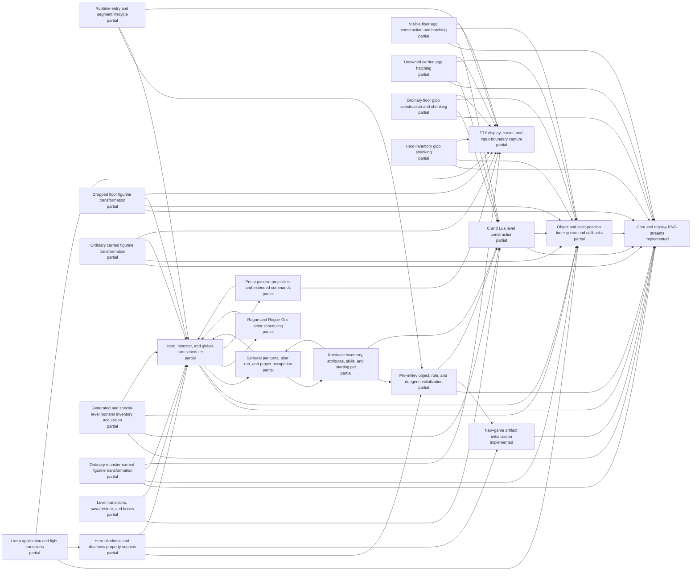

# Generated C/Lua ownership status

<!-- Generated by scripts/generate-ownership-map.mjs; edit c-lua-ownership.json. -->

Scope: Initial parity-critical ownership inventory; not yet exhaustive.

| Implemented | Partial | Stubbed | Absent | Total |
| ---: | ---: | ---: | ---: | ---: |
| 2 | 21 | 0 | 0 | 23 |

| Subsystem | Status | JavaScript owner | Bridges | Open gap |
| --- | --- | --- | --- | --- |
| Runtime entry and segment lifecycle | partial | js/jsmain.js js/allmain.js js/bridge_policy.js | top-level-fixtures session-shape.replayMoves | Save/restore, browser entry, and all role paths have not passed a sealed bridge-free gate. |
| Core and display RNG streams | implemented | js/rng.js js/isaac64.js | seeded-replay.recorded-rnl | No open gap inside the live RNG wrapper scope; seeded replay helpers remain separately forbidden. |
| Pre-mklev object, role, and dungeon initialization | partial | js/startup.js js/o_init.js js/dungeon.js js/artifacts.js js/roles.js | fastforward.pre-mklev | Object-description and artifact initialization are source-owned; remaining role_init selection/pantheon permutations, dungeon option strata, and a sealed startup gate are still open. |
| New-game artifact initialization | implemented | js/artifacts.js js/startup.js js/allmain.js js/roles.js | none | No open gap inside the new-game init_artifacts/hack_artifacts scope; artifact save/restore and unsupported runtime powers are tracked outside this entry. |
| Role/race inventory, attributes, skills, and starting pet | partial | js/u_init.js js/allmain.js js/invent.js js/windows.js js/options.js js/skills.js js/gold.js js/weight.js js/insight.js js/cmd.js js/vault.js js/end.js | fastforward.post-mklev | Role/race construction now owns substitutions, racial knowledge, Orc compensation, universal discover-mode wishing, role-money order, recursive contained gold/weight, carry-attribute boost, pauper/nudist, the complete startup reroll candidate/finalization lifecycle, and permanent blind/deaf initialization through the separate sensory-property owner. Cross-role pet state beyond pauper saddle suppression and a sealed stratified gate remain open. |
| Hero blindness and deafness property sources | partial | js/senses.js js/u_init.js js/options.js js/allmain.js js/cmd.js js/monmove.js js/polyself.js js/display.js js/insight.js | none | Permanent blind/deaf startup, aggregate property synchronization, timed-source clearing, current-form blindness, ordinary eyewear, and the Eyes blocker invariant are source-owned under focused witnesses. Light/engulfing blindness details, ball-and-chain repaint coupling, every artifact equipment message transition, unsupported deaf extrinsics, and a sealed stratified gate remain open. |
| C and Lua level construction | partial | js/mklev.js js/egg.js js/glob.js js/object_data.js js/monster_data.js js/weight.js js/dungeon.js js/lua_des.js js/regions.js js/monmove.js js/light.js js/object_timers.js js/vision.js js/allmain.js js/mondeath.js js/monworn.js js/object_knowledge.js js/u_init.js | fastforward.mineralize seeded room-fill compatibility paths | The ordinary-room orchestration and exact 31-name themed-room dispatch now have direct witnesses; Ghost, Cloud, Boulder, Spider, Garden, Trap, Massacre, and Statuary fills are live source callbacks. Ice now owns terrain construction, saveable TIMER_LEVEL scheduling, ordered dispatch, ordinary melt state, source trap normalization including mtrapped clearing, ordinary pit destruction and undestroyable-trap retention, trap conversion, corpse thawing, unearthing, engraving cleanup, resumable boulder sink/fill/burial, splash wake-up, adjacent buried-zombie disturbance, airborne survival, common ordinary occupant death/drop/corpse, object/furniture mimic detachment with light-blocker repair, and worn-amulet life-saving including ordinary genocide-defeated reentry and simple tame-pet wary_dog recovery before burial. Buried treasure reaches ordered ROT_ORGANIC/ROT_CORPSE callbacks, Buried zombies reaches ordered revival/failure/fill-pit callbacks, Light source shares the oil-lamp/brass-lantern timed-light owner, fresh typed eggs attach a live floor-hatch deadline, and initialized globs attach a live ordinary-floor shrink deadline. Ice plus those three and Temple, Storeroom, Teleportation hub, non-floor egg carriers, and nonordinary glob carriers remain partial at their explicit lifecycle gaps. Exact source ordering across all shapes, seven partial fill callbacks, many special-level operations, legacy seeded generation branches, incomplete monster/trap/special-object constructors, and a sealed gate remain open. |
| Object and level-position timer queue and callbacks | partial | js/object_timers.js js/allmain.js js/mklev.js js/egg.js js/glob.js js/figurine.js js/figurine_timer.js js/monster_inventory.js js/monmove.js js/object_data.js js/monster_data.js js/weight.js js/light.js js/cmd.js js/mondeath.js js/monworn.js js/object_knowledge.js js/u_init.js | none | The live queue owns saveable per-object and level-position timers, one monotonic id domain, source deadline ordering, newest-first equal-deadline ordering, claim-before-callback semantics, all seven enumerated object callback kinds, oil-lamp and brass-lantern exact/overdue burn state, manual cancellation with unused-time restoration, mobile illumination, visible floor and ordinary unowned female-hero inventory HATCH_EGG constructor/callback/presentation/lifecycle, ordinary non-ice floor and hero-inventory SHRINK_GLOB constructor/exact/catch-up/active-eating/presentation/deletion/capacity lifecycles, and ordinary floor, hero-inventory, plus monster-inventory FIG_TRANSFORM attachment/acquisition/familiar/placement/retry/presentation/deletion, plus the ordinary MELT_ICE_AWAY core. Enumerated callback reachability is not complete carrier coverage. Monster-inventory, owned/male-parentage, dragon, special-locomotion, overdue-inventory, taming/cry, and broader hatch placement/extinction HATCH_EGG variants; ice, contained, monster-inventory, buried, migrating, worn, nested-weight, and melding SHRINK_GLOB; broader monster object-acquisition routes, special familiar forms, unique/extinct limits, liquid death, manual application, broader object-transition timer preservation, and reattachment breadth; burn warning presentation; other BURN_OBJECT variants; complex-pet and special-death continuations; timer coordinate remapping and move/split/relink semantics; inactive cached-level timers; and a sealed gate remain open. |
| Visible floor egg construction and hatching | partial | js/mklev.js js/object_timers.js js/allmain.js js/egg.js js/monster_data.js js/weight.js | none | Fresh typed eggs and the visible, unowned floor-stack carrier are source-shaped but the subsystem is partial. Ordinary unowned female-hero inventory is owned separately. Monster inventory, owned eggs and taming, male-parentage RNG, dragon special handling, special locomotion, broader placement failure and extinction-during-batch behavior, timer preservation across corpsenm mutation, moved/split/relinked eggs, inactive cached-level catch-up, and a sealed stratum remain open. |
| Unowned carried egg hatching | partial | js/object_timers.js js/allmain.js js/egg.js js/mklev.js js/monster_data.js js/weight.js | none | The exact female-hero, spe-zero, non-dragon, ordinary-locomotion inventory carrier is source-shaped. Owned eggs, male-parentage rn2(2), taming and newborn cries, carried dragons, flyers/floaters/slithy/amorphous or immobile newborn prose, overdue carried state, monster inventory, broader placement/extinction behavior, timer moves and splits, and a sealed stratum remain open. |
| Ordinary floor glob construction and shrinking | partial | js/mklev.js js/object_data.js js/object_timers.js js/allmain.js js/glob.js js/weight.js | none | Initialized globs and the ordinary non-ice floor carrier are source-shaped but the subsystem is partial. Hero inventory is owned separately. Ice and buried-under-ice cadence, monster inventory, nested containers and recursive weight, migration and burial deletion, worn cleanup, glob absorption and timer averaging, save relocation, inactive-level variants beyond the direct overdue arithmetic witness, and a sealed stratum remain open. |
| Hero-inventory glob shrinking | partial | js/object_timers.js js/allmain.js js/glob.js js/weight.js | none | Ordinary unworn hero-inventory exact shrinking, active-eating deferral, threshold prose, final dissolution, deletion, rescheduling, and capacity feedback are source-shaped. Worn cleanup, all naming/shop variants, restored-overdue inventory UI reconciliation, monster inventory, containers, ice, migration, burial, melding, and a sealed stratum remain open. |
| Dropped floor figurine transformation | partial | js/cmd.js js/mklev.js js/figurine_timer.js js/object_timers.js js/allmain.js js/figurine.js | none | The ordinary timed wumpus floor carrier is source-shaped across command drop, exact and hero-adjacent placement, visible or overdue presentation policy, blocked-terrain retry, occupied-square construction failure, and deletion. Unseen exact transformation, boulder and pass-wall placement variants, named and alternate-locomotion prose, invisibility, mimics, hiding, minions, shapechangers, weaponed pets, unique/extinct construction limits, liquid death, throwing and forced-drop timer preservation, inactive cached-level timing, and a sealed stratum remain open. |
| Ordinary carried figurine transformation | partial | js/u_init.js js/cmd.js js/figurine_timer.js js/object_timers.js js/allmain.js js/figurine.js js/mklev.js | none | Cursed hero-inventory attachment and the ordinary walking, weaponless, nonshifting, nonminion familiar carrier are source-shaped, including whole-map enexto fallback and total-placement-failure rnd(5000) retry, but the subsystem is partial. Floor and monster-inventory ownership are tracked separately. Named forms, alternate locomotion prose, invisible or hidden spawned forms, minions, shapechangers, immediate pet weapon setup, unique/extinct birth limits, liquid death, manual figurine application, timer preservation across throwing and forced drops, all inventory insertion paths, and a sealed stratum remain open. |
| Generated and special-level monster inventory acquisition | partial | js/monster_inventory.js js/mklev.js js/allmain.js | none | The primary makemon constructor, duplicated ambient m_initinv path, court ruler, hardcoded Lua/special inventories, shrine priests, and shop stocking now cross shared acquisition/link boundaries with live ownership metadata and carrying-effect separation. Object merging/free identity, canonical minvent traversal order across all consumers, mplayer and lawful-minion normalization, knowledge loss, light snuffing and candle burn, saddle/equipment continuation, thrown/kicked/swallowed/polymorph acquisition, remaining cmd/monmove manual insertion sites, save/restore migration details, and a sealed stratum remain open. |
| Ordinary monster-carried figurine transformation | partial | js/monster_inventory.js js/monmove.js js/allmain.js js/figurine_timer.js js/object_timers.js js/figurine.js js/mklev.js js/display.js | none | The ordinary cursed wumpus figurine is source-shaped when it crosses the shared monster acquisition boundary and transforms from a visible or invisible leocrotta carrier, including pool attribution, overdue silence, blocked-placement retry, and post-presentation deletion. Ordinary floor pickup, deferred hero theft, primary and ambient generated inventory, hardcoded special-level transfer, shrine, court, and shop paths now call the shared ownership boundary in production. A generated cursed-figurine route is not yet directly witnessed. Thrown/kicked catches, swallowing, polymorph transfer, merge/free identity behavior, light snuffing, knowledge loss, named and long-worm carrier attribution, See-invisible, alternate locomotion, hidden spawned forms, special familiar state, inactive cached-level timing, and a sealed stratum remain open. |
| Lamp application and light transitions | partial | js/cmd.js js/light.js js/object_timers.js js/shk.js js/vision.js | none | Oil lamps, brass lanterns, and magic lamps own the ordinary live doapply transaction, including timed or untimed start/stop, source branch order, mobile light, blind presentation, cursed RNG and glib state, normal-use shop fees, and lit magic-to-oil timer acquisition during djinni release. Alternate unpaid djinni-release billing, mute or non-speaking shopkeeper presentation, threshold warning prose, other light-source families, every carrier/location variant, and a sealed stratum remain open. |
| Hero, monster, and global-turn scheduler | partial | js/allmain.js js/monmove.js | fastforward.turn fastforward.ranger-turn scheduler.default-replay-gap seeded role replay modules | Samurai, all five represented Rogue carriers, and the two represented Priest carriers have public bridge-free actor-rich witnesses; broader unseen actor/terrain branches and a sealed gate remain open. |
| Samurai pet turns, altar run, and prayer occupation | partial | js/allmain.js js/monmove.js js/pray.js | legacy-only samurai.altar-run-prayer legacy-only bounded Samurai compatibility cadence | The represented bridge-free Samurai path uses live dog_move and prayer turns, but wider candidate, combat, interruption, terrain, and sealed-corpus coverage is absent; legacy scoring still retains its compatibility bridge. |
| Rogue and Rogue-Orc actor scheduling | partial | js/allmain.js js/monmove.js js/cmd.js js/invent.js js/rogue_explore.js js/rogue_orc.js js/rogue_friday13.js | legacy-only rogue.explore legacy-only rogue.friday13 legacy-only rogue.orc legacy-only rogue.chargen legacy-only seeded-replay.rogue-explore legacy-only seeded-replay.rogue-orc legacy-only seeded-replay.rogue-friday13 | All represented Rogue compatibility paths now use live source-ration, actor/trap scheduling, command parsing, and persistence in bridge-free mode; alternate unseen actor, trap, command-binding, option, and sealed strata remain unverified. |
| Priest passive projectiles and extended commands | partial | js/allmain.js js/cmd.js js/monmove.js js/pray.js js/invent.js js/exper.js js/end.js js/gamelog.js js/priest_extcmd.js | legacy-only priest.passive-projectile legacy-only seeded-replay.priest-extcmd legacy-only snapshot-painter.fixture-screen | Both represented Priest carriers now use live source-ration, prayer, projectile lifecycle, command state, chronicle, overview, and naming in bridge-free mode; alternate ranged outcomes, pantheons, command histories, unseen actors/options, legacy bridge removal, and sealed strata remain unverified. |
| TTY display, cursor, and input-boundary capture | partial | js/terminal.js js/game_display.js js/display.js js/jsmain.js | snapshot-painter.fixture-screen | Snapshot painters remain in legacy mode and the full tty/window surface has no sealed bridge-free gate. |
| Level transitions, save/restore, and bones | partial | js/cmd.js js/save.js js/mklev.js | stress and ten-deaths top-level fixtures | Fresh save/restore chains and bones have not been exercised by a sealed bridge-free corpus. |

## Component ownership

| Subsystem | Component | Status | Open gap |
| --- | --- | --- | --- |
| C and Lua level construction | 31-form themeroom reservoir and named shape dispatch | partial | All exact Lua names have live constructors and five formerly collapsed rare forms have structural witnesses; exhaustive source-call ordering and a sealed stratum remain unproved. |
| C and Lua level construction | Fill: Ice room | partial | Room-wide ICE construction, the 25% timer gate, Lua row-major per-square deadlines, saveable TIMER_LEVEL state, shared timer-id ordering, ordinary ICE-to-MOAT/POOL terrain mutation, mtrapped clearing before liquid/death continuation, ordinary and spiked-pit destruction, magic-portal/vibrating-square retention, landmine/bear-trap conversion, corpse timer thawing, unearthing, engraving cleanup, conditional visible feedback, pre-RNG settling suspension, per-boulder rn2(10) sink/retry/fill behavior, remaining-pile burial, visible/audible splash and verbose sink feedback, wake messages, adjacent buried-zombie timer shortening, exact m_in_air survival including hidden versus grounded clingers, common ordinary monster detachment/inventory drop/corpse chance, object/furniture mimic reveal after actor removal, mcorpsenm cleanup, light-blocker repair, M_AP_MONSTER preservation, gendered and named mkcorpstat state, corpse stacking, G_NOCORPSE, successful visible or unseen worn-amulet rescue, ordinary visible or unseen genocide-defeated rescue followed by common death and burial, and simple tame-pet starvation repair, tameness/peacefulness RNG, disposition presentation, repaint, hunger/revival reset, and survival have direct zero-bridge witnesses. Shapechanging; pet genocide defeat, heavy-abuse, minion, active-eating/appearance, leash, steed, and hero-attachment recovery; special corpse and explosion families; pet/unique/special detachment; unsafe monster minliquid branches including gremlin and iron-golem effects; hero liquid and spoteffects continuation; drawbridge ice; timer coordinate remapping; explicit terrain-mutation cancellation; inactive cached-level catch-up; spot-time queries; and a sealed stratum remain open. |
| C and Lua level construction | Fill: Cloud room | implemented | No open gap inside this harmless callback scope: asleep fog population, persistent selection-backed region construction, blocker state, saveable level ownership, and per-occupant TTL extension have direct zero-bridge witnesses. |
| C and Lua level construction | Fill: Boulder room | implemented | No open gap inside this callback scope: filtered boulder versus rolling-trap construction and Lua callback order have direct zero-bridge witnesses. |
| C and Lua level construction | Fill: Spider nest | implemented | No open gap inside this callback scope: web placement and the depth-sensitive resident-spider gate have direct zero-bridge witnesses. |
| C and Lua level construction | Fill: Trap room | implemented | No open gap inside this callback scope: one shuffled source trap type is applied over the filtered selection in Lua callback order. |
| C and Lua level construction | Fill: Garden | implemented | No open gap inside this callback scope: lit-room nymph/fountain population and deferred grown-selection tree/arboreal-door transformation have a direct zero-bridge witness. |
| C and Lua level construction | Fill: Buried treasure | partial | Initialized-then-cleared chest contents, source-ordered burial draws, contained child objects and weight, retained coordinates, deferred directional engraving, ordered ROT_ORGANIC callback, contained-child burial, and ROT_CORPSE removal have direct zero-bridge witnesses. Protected contained-object impossibility handling, worn/inventory corpse side effects, inactive cached-level timing, and a sealed stratum remain open. |
| C and Lua level construction | Fill: Buried zombies | partial | Depth-sensitive construction, ordered ZOMBIFY_MON dispatch, living-to-zombie replacement, gender-preserving NO_MINVENT revival, blocked/genocided outcomes, occupied-square relocation, pit creation, visible/invisible/audible policy, and boulder fill_pit burial effects have direct zero-bridge witnesses. Hero-occupied relocation, all terrain/species and special corpse variants, full tty continuation capture, inactive cached-level timing, and a sealed stratum remain open. |
| C and Lua level construction | Fill: Massacre | implemented | No open gap inside this callback scope: the 27-entry role/guardian reservoir, 5d5 population, per-corpse reselection, and live corpse construction have direct zero-bridge witnesses. |
| C and Lua level construction | Fill: Statuary | implemented | No open gap inside this callback scope: 5d5 loose statues and 1d3 live statue traps delegate to shared source constructors under a direct zero-bridge witness. |
| C and Lua level construction | Fill: Light source | partial | The initialized lit oil lamp plus the shared oil-lamp/brass-lantern source fuel breakpoints, saveable deadline state, ordered generic timer dispatch, exact and overdue expiration, surviving-lantern identity, ordinary command activation/extinguishing, and radius-three mobile illumination shared with untimed magic lamps have direct zero-bridge witnesses. Threshold warning text, potions of oil, candles, the candelabrum, artifact light, other cleanup/reschedule variants, inactive cached-level timing, and a sealed stratum remain open. |
| C and Lua level construction | Fill: Temple of the gods | partial | Three altar callbacks exist, but source alignment ownership and complete special-object semantics remain open. |
| C and Lua level construction | Fill: Ghost of an Adventurer | implemented | No open gap inside this callback scope: live room selection, ghost state, colocated BUC-constrained equipment, and zero bridge usage have a direct witness. |
| C and Lua level construction | Fill: Storeroom | partial | Filtered chest/mimic construction exists; exhaustive source-order and sealed-stratum validation remain open. |
| C and Lua level construction | Fill: Teleportation hub | partial | Deferred trap/destination construction exists; exhaustive source-order and sealed-stratum validation remain open. |

No entry has a sealed-corpus gate yet. Public-session witnesses are retained only where the registry explicitly labels them as regressions.
