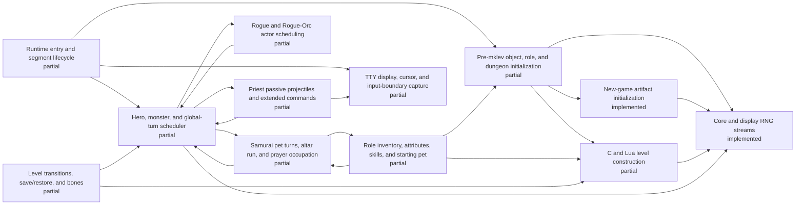

# Generated C/Lua ownership status

<!-- Generated by scripts/generate-ownership-map.mjs; edit c-lua-ownership.json. -->

Scope: Initial parity-critical ownership inventory; not yet exhaustive.

| Implemented | Partial | Stubbed | Absent | Total |
| ---: | ---: | ---: | ---: | ---: |
| 2 | 10 | 0 | 0 | 12 |

| Subsystem | Status | JavaScript owner | Bridges | Open gap |
| --- | --- | --- | --- | --- |
| Runtime entry and segment lifecycle | partial | js/jsmain.js js/allmain.js js/bridge_policy.js | top-level-fixtures session-shape.replayMoves | Save/restore, browser entry, and all role paths have not passed a sealed bridge-free gate. |
| Core and display RNG streams | implemented | js/rng.js js/isaac64.js | seeded-replay.recorded-rnl | No open gap inside the live RNG wrapper scope; seeded replay helpers remain separately forbidden. |
| Pre-mklev object, role, and dungeon initialization | partial | js/startup.js js/o_init.js js/dungeon.js js/artifacts.js js/roles.js | fastforward.pre-mklev | Artifact initialization is source-owned; remaining role_init state, fresh option/race combinations, and a sealed startup gate are still open. |
| New-game artifact initialization | implemented | js/artifacts.js js/startup.js js/allmain.js js/roles.js | none | No open gap inside the new-game init_artifacts/hack_artifacts scope; artifact save/restore and unsupported runtime powers are tracked outside this entry. |
| Role inventory, attributes, skills, and starting pet | partial | js/u_init.js js/allmain.js | fastforward.post-mklev | Role-specific inventory branches and cross-role pet state have not passed a bridge-free stratified gate. |
| C and Lua level construction | partial | js/mklev.js js/dungeon.js js/lua_des.js | fastforward.mineralize seeded room-fill compatibility paths | Special-level operations, ordinary room fill, startup objects, and unseen Lua variants remain incomplete. |
| Hero, monster, and global-turn scheduler | partial | js/allmain.js js/monmove.js | fastforward.turn fastforward.ranger-turn scheduler.default-replay-gap seeded role replay modules | Samurai, all five represented Rogue carriers, and the two represented Priest carriers have public bridge-free actor-rich witnesses; broader unseen actor/terrain branches and a sealed gate remain open. |
| Samurai pet turns, altar run, and prayer occupation | partial | js/allmain.js js/monmove.js js/pray.js | legacy-only samurai.altar-run-prayer legacy-only bounded Samurai compatibility cadence | The represented bridge-free Samurai path uses live dog_move and prayer turns, but wider candidate, combat, interruption, terrain, and sealed-corpus coverage is absent; legacy scoring still retains its compatibility bridge. |
| Rogue and Rogue-Orc actor scheduling | partial | js/allmain.js js/monmove.js js/cmd.js js/invent.js js/rogue_explore.js js/rogue_orc.js js/rogue_friday13.js | legacy-only rogue.explore legacy-only rogue.friday13 legacy-only rogue.orc legacy-only rogue.chargen legacy-only seeded-replay.rogue-explore legacy-only seeded-replay.rogue-orc legacy-only seeded-replay.rogue-friday13 | All represented Rogue compatibility paths now use live source-ration, actor/trap scheduling, command parsing, and persistence in bridge-free mode; alternate unseen actor, trap, command-binding, option, and sealed strata remain unverified. |
| Priest passive projectiles and extended commands | partial | js/allmain.js js/cmd.js js/monmove.js js/pray.js js/invent.js js/exper.js js/end.js js/gamelog.js js/priest_extcmd.js | legacy-only priest.passive-projectile legacy-only seeded-replay.priest-extcmd legacy-only snapshot-painter.fixture-screen | Both represented Priest carriers now use live source-ration, prayer, projectile lifecycle, command state, chronicle, overview, and naming in bridge-free mode; alternate ranged outcomes, pantheons, command histories, unseen actors/options, legacy bridge removal, and sealed strata remain unverified. |
| TTY display, cursor, and input-boundary capture | partial | js/terminal.js js/game_display.js js/display.js js/jsmain.js | snapshot-painter.fixture-screen | Snapshot painters remain in legacy mode and the full tty/window surface has no sealed bridge-free gate. |
| Level transitions, save/restore, and bones | partial | js/cmd.js js/save.js js/mklev.js | stress and ten-deaths top-level fixtures | Fresh save/restore chains and bones have not been exercised by a sealed bridge-free corpus. |

No entry has a sealed-corpus gate yet. Public-session witnesses are retained only where the registry explicitly labels them as regressions.
