# Original NetHack C/Lua architecture map

This is the working architecture model for the pinned NetHack 5.0 source in
`nethack-c/upstream`. It is intentionally scoped to parity-critical paths: game
startup, themed level generation, input/turn scheduling, level transitions,
and wizard/debug level commands. It is not an exhaustive map of NetHack.

Source anchors use the current pinned tree:

- C lifecycle: `src/allmain.c`, `src/cmd.c`
- hero/role startup: `src/role.c`, `src/u_init.c`, `src/dungeon.c`,
  `src/artifact.c`, `src/dog.c`
- level generation: `src/mklev.c`, `src/sp_lev.c`, `src/nhlua.c`
- Lua: `dat/themerms.lua`, `dat/nhcore.lua`, and special-level `.lua` files
- monsters: `src/mon.c`, `src/monmove.c`, `src/dogmove.c`
- transitions: `src/do.c`, `src/bones.c`, `src/save.c`
- debug commands: `src/wizcmds.c`, `src/exper.c`, `src/teleport.c`

## 1. Runtime ownership map

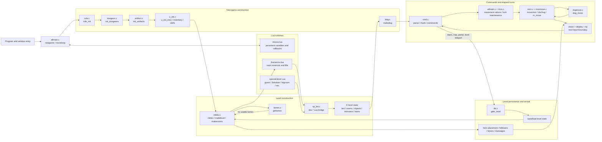

The central architectural fact is that Lua does not own a parallel map. Lua
selects and describes content, while `sp_lev.c` immediately mutates the same C
level structures later consumed by stairs, corridors, occupancy, monster AI,
vision, save/restore, and tty rendering.

## 2. New-game startup sequence

```mermaid
sequenceDiagram
    participant Main as allmain.c:newgame
    participant Role as role.c / dungeon.c
    participant Hero as u_init.c
    participant LuaCore as nhlua.c + nhcore.lua
    participant Level as mklev.c
    participant Theme as themerms.lua + sp_lev.c
    participant Pet as dog.c
    participant UI as display / tty

    Main->>Main: init_objects()
    Main->>Role: role_init()
    Main->>Role: init_dungeons()
    Main->>Role: init_artifacts()
    Main->>Hero: u_init_misc()
    Main->>LuaCore: l_nhcore_init()
    Main->>Level: mklev()
    Level->>Level: reseed_random(); getbones()
    alt no usable bones level
        Level->>Level: makelevel()
        Level->>Theme: makerooms() / themerooms_generate()
        Theme->>Level: des.* mutates live C level state
        Level->>Level: corridors, stairs, fills, topology, mineralize
    else bones accepted
        Level->>Level: restore saved level structures
    end
    Main->>Main: u_on_upstairs(); vision_reset()
    Main->>Pet: makedog()
    Main->>Hero: u_init_inventory_attrs()
    Main->>UI: docrt(); bot(); optional reroll
    Main->>Hero: u_init_skills_discoveries()
    Main->>UI: legacy pager; welcome()
    Main->>LuaCore: nhcore.start_new_game
```

### Startup ordering invariants

1. `init_objects()` precedes role and inventory work.
2. `role_init()` precedes dungeon initialization and hero initialization.
3. Dungeon/artifact state exists before random inventory can request monsters,
   tins, eggs, or artifacts.
4. The level is fully generated before the hero is placed and the pet exists.
5. Inventory/attributes are finalized after pet creation and before the first
   playable input boundary.
6. Changing a draw or linked-list insertion anywhere in this sequence changes
   later level geometry, monster order, movement candidate counts, and screens.

## 3. C ↔ Lua themed-room bridge

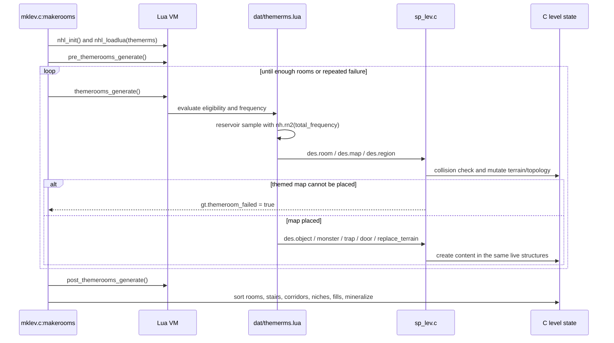

### Why this bridge is parity-critical

- `themerooms_generate()` performs weighted reservoir sampling; eligibility and
  list order determine every selection draw.
- `lspo_map()` can retry placement up to 100 times. In themed-room mode it may
  not overwrite non-stone or existing room topology, and failure changes the
  outer room-generation loop.
- `des.map()`/`des.region()` change terrain and room connectivity;
  `des.object()`/`des.monster()` add constructors and linked-list order.
- The Water-surrounded vault is a content transaction, not just a six-by-six
  terrain stamp: it shuffles chest positions, creates a guaranteed escape item
  inside a chest, preserves material-dependent lock behavior, creates three
  more chests, shuffles undead, and adds a teleport exclusion.

## 4. Command and elapsed-turn loop

NetHack's command and scheduler phases straddle consecutive calls to
`moveloop_core()`. `rhack()` sets whether the command consumed time near the end
of one iteration; the next iteration spends that time before accepting another
command.

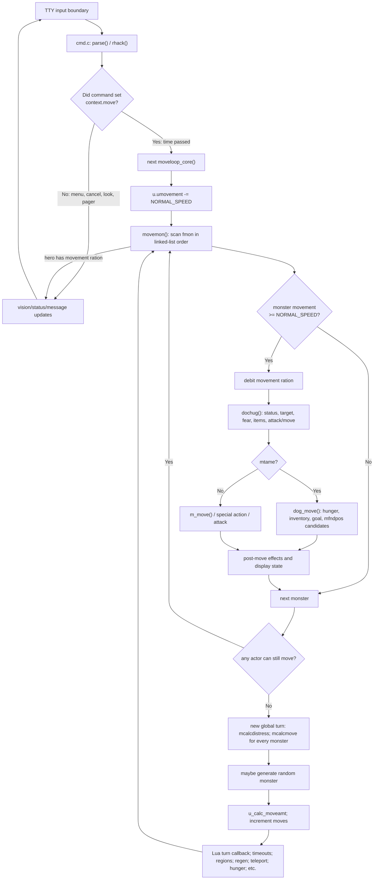

### Minimum coherent monster-movement port

The smallest useful slice spans several files and state owners:

1. `allmain.c`: debit hero movement and decide whether a new global turn is
   required.
2. `mon.c:mcalcmove()`: adjust slow/fast speed and randomly round to multiples
   of `NORMAL_SPEED`.
3. `mon.c:movemon()`: preserve `fmon` scan order, movement debits, removals, and
   deferred level change.
4. `monmove.c:dochug()`: preserve pre-move status RNG and targeting before
   selecting tame/generic movement.
5. `dogmove.c:dog_move()`: derive candidates from `mfndpos()`, live occupancy,
   objects, cursed squares, goals, hunger, and combat—not from a recorded range
   list.
6. vision/display: update actor positions, remembered terrain, messages, and
   the terminal before the next input capture.

Porting only step 5 cannot be correct because its inputs and its place in the
random stream are owned by steps 1–4.

## 5. Ordinary level transition

```mermaid
sequenceDiagram
    participant Cmd as command / movement
    participant Go as do.c:goto_level
    participant Store as level save/load
    participant Track as track.c:save_track / initrack
    participant Build as mklev.c
    participant Bones as bones.c:getbones
    participant Arrival as arrival pipeline
    participant UI as vision / display

    Cmd->>Go: stairs, fall, portal, or level teleport
    Go->>Go: validate destination and run Lua leave callbacks
    Go->>Store: rewrite/save/free current level
    Store->>Track: save_track(release_data) clears old-level utrack
    Go->>Go: clear level-local contexts; keep followers; reset vision
    alt destination level does not exist
        Go->>Build: mklev()
        Build->>Bones: getbones()
        alt bones accepted
            Bones->>Build: restore level and entity structures
        else no bones
            Build->>Build: makelevel() and finalize topology
        end
    else destination already exists
        Go->>Store: getlev()
    end
    Go->>Arrival: place hero by stairs/portal/random spot
    Arrival->>Arrival: deliver objects/followers; timers; collisions; bubbles
    Arrival->>UI: reset vision, glyph map, and full screen
    Arrival->>Arrival: special/quest/branch messages and events
    Arrival->>Arrival: pickup, room checks, annotations
    Arrival->>Track: first destination moveloop settrack()
    Arrival-->>Cmd: return to command loop
```

Ordering is observable in both parity channels. For example, `mklev()` calls
`getbones()` before new generation; a different bones roll or file decision
changes the complete new-level RNG stream. Arrival ordering also changes which
messages and map cells are present at each input boundary.

## 6. Debug level-changing commands

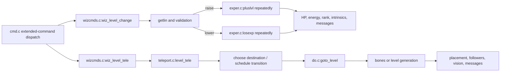

`#levelchange` is a compact, mostly hero-state subsystem and is now a useful
isolated regression. `#wizlevelport` crosses the full transition/generation
pipeline, so implementing it before ordinary `goto_level()` would hide the same
missing dependency under a debug-specific wrapper.

## 7. State ownership and parity observability

| State | Original owner | Important consumers | How a mismatch becomes visible |
| --- | --- | --- | --- |
| Hero identity, role, race, alignment, stats, movement | `role.c`, `u_init.c`, global `u` | inventory, monsters, commands, status | startup RNG, rank/AC/HP lines, monster attitude |
| Level terrain and topology | `mklev.c`, `sp_lev.c`, `levl`, room arrays | stairs, occupancy, AI, vision, save | later RNG retry counts and persistent screen cells |
| Monsters and scan order | `makemon`, linked list `fmon` | `movemon`, combat, pets, display | movement-ration calls, candidate order, glyph positions |
| Objects and inventory identity | object constructors and linked chains | pets, pickup, menus, save/restore | constructor RNG, equipment strings, object glyphs |
| Tame-animal state | `dog.c`, `dogmove.c`, `edog` | hunger, fetching, movement, combat | ordinary-turn RNG and actor positions |
| Hero pursuit track | `track.c` (`utrack`); old-level `save_track(release_data)` clears it and destination `settrack()` repopulates it | `dog_goal`, hostile pursuit, teleport traps | stale coordinates from another level can become a false nearest goal and change deterministic movement before later candidate RNG |
| Modal/input state | tty window code, `cmd.c`, command queue | time classification, nested prompts | number/order of captures and whether later keys are commands |
| Persistent Lua variables/callbacks | `nhcore.lua` via `nhlua.c` | turn, level enter/leave, save/restore | callback RNG/messages and cross-segment behavior |
| Saved levels/bones | save/load and `bones.c` | `goto_level`, restore, migrations | generation-vs-load branch and complete arrival stream |
| Terminal grid/cursor | vision/display/windowport | scorer capture | exact 80×24 cells and cursor at every input boundary |

## 8. Current JS seam map

This is a planning map, not a claim that the JS side is already equivalent.

| Original C/Lua boundary | Current JS seam | Planning implication |
| --- | --- | --- |
| `newgame`, `role_init`, `u_init` | `js/allmain.js`, `js/roles.js`, `js/u_init.js`, `js/options.js` | Keep selection, role data, inventory, and startup draw order in one contract |
| `mklev` + `themerms.lua` + `sp_lev.c` | `js/mklev.js`, `js/dungeon.js` | Model theme selection, placement failure, topology, and content separately but mutate one live level |
| `parse`/`rhack` and modal tty input | `js/cmd.js`, `js/input.js`, `js/windows.js` | A command must declare whether it consumes time; nested prompts own later keys until dismissal |
| `moveloop_core`, `mcalcmove`, `movemon`, `dochug`, `dog_move` | `js/allmain.js`, `js/monmove.js`, `js/cmd.js` | Movement balances, randomized allocation, `fmon` scans, floor/inventory goals, corpse-eating occupations, tame/hostile combat, post-move traps, coordinate mutation, and repaint requests now share live state; the current incomplete seam is full source-equivalent candidate scoring and the remaining special monster branches |
| vision, glyph mapping, tty capture | `js/vision.js`, `js/display.js`, `js/game_display.js`, `js/terminal.js` | Render from live state; serializer correctness cannot repair wrong world state |
| `goto_level`, save/load, bones | `js/save.js`, `js/storage.js`, `js/mklev.js`, command paths | Separate current-level persistence, destination construction, and arrival pipeline |
| exact public transcript modules | `js/*_fixture.js`, `js/fixture_screen.js` | Keep as regression witnesses; never count them as held-out architecture |

## 9. Planned dependency graph

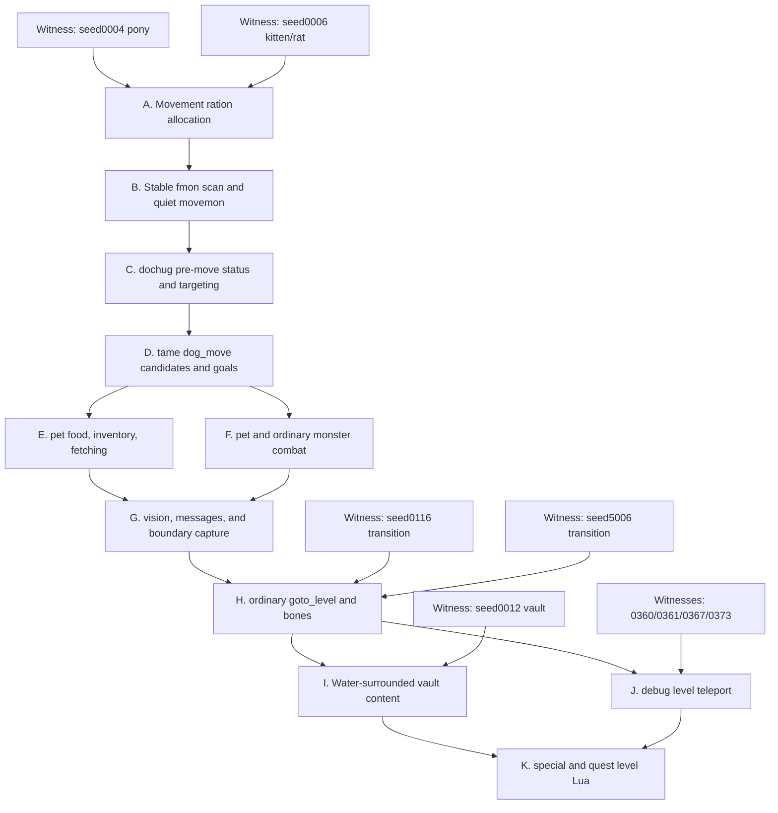

Each node should advance the earliest exact boundary for at least two witnesses
before the next node begins. A change that only improves a later symptom while
an earlier node still diverges is not evidence for that node.

## 10. Movement implementation overlay

```mermaid
flowchart LR
    metadata["monsters.h: permonst.mmove<br/>383 source-derived rates"]
    construct["makemon / makedog<br/>movement = 0"]
    allocate["mon.c:mcalcmove<br/>js/monmove.js:mcalcmove"]
    fmon["C fmon newest-first<br/>JS creation array reversed"]
    scan["movemon ration scan<br/>debit and repeat rounds"]
    quiet["quiet dochug phase<br/>distfleeck / dog_goal / distfleeck"]
    candidate["mfndpos x-major candidates<br/>live coordinate + track mutation"]
    objectgoal["dog_goal floor + inventory<br/>dogfood classification / target"]
    herotrack["track.c hero ring<br/>vision-gated fallback goal"]
    ordering["uppercase run state<br/>lookaround + interleaving"]
    doorway["test_move doorway mask<br/>diagonal terrain semantics"]
    trapvictim["mklev:mktrap_victim<br/>live cursed floor piles"]
    trapdispatch["domove post-move trap<br/>bear-trap + utrap state"]
    candidatepile["dog_move candidate piles<br/>dogfood before curse avoidance"]
    heroration["allmain hero ration loop<br/>12 debit / 9 Burdened credit"]
    montrap["postmov + mintrap<br/>monster bear-trap state"]
    combat["dochug phase four<br/>mattacku + hero melee"]
    randommon["maybe_generate_rnd_mon<br/>goodpos + rndmonnum + makemon"]
    gridbug["PM_GRID_BUG NODIAG<br/>mfndpos + monnear"]
    pettrap["dog_invent + candidate traps<br/>tseen vs mtrapseen"]
    runstop["run boundary<br/>door / furniture stop"]
    pickup["comma pickup<br/>floor → inventory + time"]
    gridcombat["grid-bug combat<br/>passive / electric / kill"]
    counted["parse count + timed occupation<br/>9s scheduler-separated searches"]
    cleararea["lost-master clear area<br/>pet-origin visible goal"]
    boulder["hack.c:dopush<br/>STR + object relocation"]
    lineup["mthrowu.c:lined_up<br/>boulder-only LOS gate"]
    jackalcombat["uhitm + mhitu<br/>long sword / jackal bite / kill"]
    goblininit["makemon PM_GOBLIN<br/>empty m_initweap branch"]
    dart["trap.c dart trap<br/>object + miss + floor link"]
    nextmfnd["NEXT: input-248 mfndpos<br/>candidate rejection set"]

    metadata --> construct --> allocate --> fmon --> scan --> quiet --> candidate
    candidate --> objectgoal --> herotrack --> ordering --> doorway
    trapvictim --> objectgoal
    doorway --> trapdispatch --> candidatepile --> heroration --> montrap --> combat --> randommon
    randommon --> gridbug --> pettrap --> runstop --> pickup --> gridcombat --> counted --> cleararea --> boulder --> lineup --> jackalcombat --> goblininit --> dart --> nextmfnd

    pony["seed0004<br/>pony → kobold → pony"] --> scan
    kitten["seed0006<br/>kitten → zombie → rat"] --> scan
```

The overlay deliberately stops before claiming full monster movement. The
quiet phase now derives actor multiplicity/order from live balances and applies
ordinary-land destinations in source candidate order. The floor and inventory
goal slice produces the two nearby objects plus seven hero inventory entries
through the first apple. Persistent Shift-direction movement now interleaves
hero squares with monster/global turns, and the vision-gated hero-track goal
handles the first pursuit around the doorway. Trap-victim possessions are now
owned by `mklev` and linked into the same floor chains that `dog_goal()` later
screens. Post-move dispatch now presents the live floor pile, triggers and
persists a bear trap, and runs wounded regeneration in the shared turn phase;
candidate piles are screened before cursed-square avoidance. The widened hero
ration loop repeats monster/global cycles while a Burdened turn supplies only
9 movement points, including the pet reluctance pager. Monster `postmov()` and
`mintrap()` ownership now catches the pony with `d(2,4)` and gates later escape
attempts with `rn2(40)`. The adjacent kobold's phase-four `mattacku()` branch
and the following hero melee transaction compose with successful
random-monster generation, the first grid bug's `NODIAG` movement, a doorway
run stop, live gem pickup, and grid-bug electric/melee combat. Count parsing
then installs a timed occupation so each `9s` performs nine complete,
scheduler-separated search turns without reading another key. That dependency
chain composes with the lost-master `do_clear_area()` fallback and now reaches
call 8,757. A live `dopush()` transaction then relocates the corridor boulder,
exercises Strength, and advances the chain to call 8,967. Hostile `m_move()`
then consumes the boulder as live line-of-sight state through `lined_up()`,
advancing the chain to call 9,178. Wielded long-sword damage, the jackal's bite,
and the following kill then carry it to call 9,286. The selected goblin's empty
but observable `m_initweap()` branch carries it to call 9,625. The resumed dart
trap transaction carries it to call 9,738. The next counterexample is a
hostile `mfndpos()` candidate-set mismatch on input 248. The independent Wizard
command/turn counterexample remains at call 2,523 and is the next witness after
this seed-4 movement boundary.

## 11. Pet movement and object-goal boundary

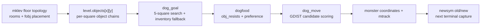

This boundary prevents a tempting but invalid shortcut. Each `rn2(100)` is
caused by `dogfood()` examining a concrete floor or inventory object. The local
C recorder proves the first two are floor objects and the next seven are the
Knight's six equipment items plus an apple. Adding calls in `dog_move()` would
align a prefix while leaving the preferred-food decision and rendered pet
position wrong.

## 12. Run scheduler boundary

```mermaid
sequenceDiagram
    participant Input as tty input boundary
    participant Cmd as cmd.c / js/cmd.js
    participant Loop as allmain moveloop_core
    participant Mon as movemon + turn maintenance
    participant Look as hack.c lookaround
    participant Move as hack.c domove

    Input->>Cmd: Shift-direction (run mode 1)
    Cmd->>Cmd: store direction, run, multi
    Cmd->>Move: first square
    loop while run remains active
        Loop->>Mon: settle elapsed hero action
        Loop->>Look: inspect live adjacent terrain/monster state
        alt safe continuation
            Look->>Move: optional corridor turn, then automatic square
        else front monster or obstacle
            Look-->>Loop: clear pending run
        end
    end
    Loop->>Input: capture the next key only after run cancellation
```

The input boundary is downstream of run cancellation, not downstream of every
hero square. That ordering makes pet movement, `mtrack` avoidance, global turn
numbers, RNG slices, and displayed positions one coupled contract. The current
JS surface implements run mode 1, front-monster stopping, obstacle stopping,
and unambiguous corridor turns. Travel, occupations, interrupt handling, and
the complete set of interesting terrain checks remain explicit later blocks.

## 13. Level-object ownership to hero and monster trap dispatch

```mermaid
flowchart LR
    generate["mklev.c:mktrap_victim<br/>create corpse + possessions"]
    link["mkobj.c:place_object<br/>level.objects square chain"]
    observe["dogmove.c:dog_goal<br/>screen each nearby object"]
    enter["hack.c:domove<br/>hero enters trap square"]
    lookup["trap.c:t_at<br/>live level trap chain"]
    effect["dotrap / trapeffect_bear_trap<br/>damage + utrap state"]
    regen["allmain.c:regen_hp<br/>wounded percentage roll"]
    turns["moveloop_core<br/>trapped movement attempts"]
    petmove["dogmove.c:dog_move<br/>pony selects destination"]
    postmov["monmove.c:postmov<br/>mintrap after coordinate mutation"]
    monheld["monmove.c:m_move<br/>mintrap before later movement"]
    attack["dochug phase four<br/>adjacent hostile attack"]
    heroattack["uhitm.c:do_attack<br/>metabolism / hit / kill"]
    generation["allmain.c<br/>maybe_generate_rnd_mon"]
    gridbug["monmove.c<br/>grid bug NODIAG"]
    petknowledge["dogmove.c<br/>dog_invent + trap knowledge"]
    runboundary["hack.c:domove<br/>doorway stops run"]
    pickup["pickup.c<br/>floor object → inventory"]
    gridcombat["mhitu.c + uhitm.c<br/>electric attack + weapon kill"]
    counted["cmd.c + allmain.c<br/>counted search occupation"]
    cleararea["vision.c:do_clear_area<br/>lost-master visible goal"]
    boulder["hack.c:dopush<br/>floor-object relocation"]
    lineup["mthrowu.c:lined_up<br/>conditional boulder LOS"]
    jackalcombat["uhitm.c + mhitu.c<br/>jackal melee transaction"]
    goblininit["makemon.c:m_initweap<br/>PM_GOBLIN decisions"]
    dart["trap.c dart trap<br/>create / miss / land"]
    nextmfnd["NEXT: mon.c:mfndpos<br/>candidate filtering"]

    generate --> link --> observe
    enter --> lookup --> effect --> turns --> regen
    observe --> petmove --> postmov --> monheld --> attack --> heroattack --> generation
    generation --> gridbug --> petknowledge --> runboundary --> pickup --> gridcombat --> counted --> cleararea --> boulder --> lineup --> jackalcombat --> goblininit --> dart --> nextmfnd
```

Objects and traps share a level-generation origin but have different later
consumers. The seed-4 counterexample first observes the restored cursed piles
through the pony, then reaches the separate trap chain through hero movement.
`domove()` now dispatches the trap after committing the hero coordinate and
before the next input boundary; `utrap` persists across later movement turns,
and each elapsed wounded turn passes through shared regeneration ordering. A
monster destination uses a parallel but separately ordered path: `postmov()`
calls `mintrap()` after `dog_move()` changes the pony's coordinates, while an
already trapped pony calls `mintrap()` at the start of its next `m_move()`.
That distinction fixes the public order `d(2,4) -> distfleeck` on entry and
`distfleeck -> rn2(40) -> distfleeck` while held. The adjacent hostile branch
now bypasses ordinary movement and composes with the hero's next melee kill.
Successful random generation then creates the live grid bug consumed by later
scheduler, run, pickup, electric-attack, and long-sword-kill paths. Three
counted searches then exercise the same scheduler without new input
boundaries. Arbitrary-origin visibility supplies the lost pony's next goal,
then `dopush()` mutates the shared floor-object chain. `lined_up()` consumes
that moved boulder as an AI sight obstruction on the later south run. The
long-sword hit and physical bite now share the combat tail correctly. The next
goblin constructor and resumed dart trap are accepted; the unresolved node is
the next hostile's legal-neighbor set.

## 14. Generated grid-bug lifecycle and counted-search boundary

```mermaid
flowchart LR
    gate["allmain.c<br/>rn2(70) generation gate"]
    goodpos["makemon_rnd_goodpos<br/>legal coordinate retry"]
    species["rndmonnum<br/>reservoir species choice"]
    make["makemon<br/>group + inventory + fmon prepend"]
    nodiag["PM_GRID_BUG<br/>NODIAG candidates and monnear"]
    run["lookaround/domove<br/>grid bug stops hero run"]
    passive["uhitm passive contact<br/>rn2(3)"]
    electric["mattacku electric bite<br/>damage / cancellation / knockback"]
    weapon["long sword rnd(8)<br/>kill + corpse"]
    count["parse 9s<br/>timed search occupation"]
    cleararea["pet-origin view_from<br/>closest visible goal"]
    boulder["dopush<br/>STR + relocate object"]
    lineup["lined_up<br/>boulder-only LOS roll"]
    melee["long sword vs jackal<br/>wound / bite / kill"]
    init["PM_GOBLIN<br/>m_initweap constructor"]
    dart["input 235 dart trap<br/>construct / miss / floor"]
    mfnd["NEXT: input 248<br/>mfndpos candidate set"]

    gate --> goodpos --> species --> make --> nodiag --> run
    run --> passive --> electric --> weapon --> count --> cleararea --> boulder --> lineup --> melee --> init --> dart --> mfnd
```

The generated monster is not an isolated constructor fixture. Its species
metadata determines movement candidates and attack eligibility; its position
changes automatic-run cancellation; the resulting input timing exposes pickup
and combat; and removal changes every later `fmon` scan. Counted searches then
repeat those scans and maintenance phases eight more times per explicit search
without accepting another key. When those turns evict old hero tracks, the pet
uses `view_from()` at its own coordinate to choose the closest exposed square.
At call 8,757 that lifecycle is coherent. The next live hero action pushes a
boulder and carries the exact stream to 8,967. A later hostile line check uses
that boulder and carries the stream to 9,178. The adjacent jackal combat then
carries it to 9,286. The goblin constructor then carries it to 9,625 and the
dart trap to 9,738. Loot and multi-pickup ownership then align the spatial
scheduler boundary; occupied-neighbor pet combat and two monster deaths carry
the exact prefix to 9,944. The next comparison is the pony's post-combat
equal-distance candidate choice.

## 15. Count parsing and timed occupation loop

```mermaid
sequenceDiagram
    participant TTY as tty input
    participant Parse as cmd.c:parse / js:rhack
    participant Search as detect.c:dosearch
    participant Loop as allmain.c:moveloop_core
    participant Mon as movemon + global maintenance

    TTY->>Parse: digit 9
    Parse->>Parse: command_count = 9
    TTY->>Parse: s
    Parse->>Parse: multi = 8; install timed occupation
    Parse->>Search: explicit search 1 of 9
    loop remaining eight searches
        Loop->>Mon: settle elapsed hero action
        Mon-->>Loop: actor scans, allocation, maintenance
        Loop->>Search: timed_occupation()
        Search-->>Loop: consume another hero action
    end
    Loop->>TTY: request next key only after occupation clears
```

This is a separate control-flow owner from both run mode and a command's local
implementation. `dosearch()` describes one action; the parser owns the count;
`moveloop_core()` owns the scheduler boundary between repetitions. Keeping the
occupation outside `dosearch()` makes the same mechanism reusable for waiting
and other countable commands while preserving interruption semantics as a
later explicit block.

## 16. Lost-master pet goal through arbitrary-origin vision

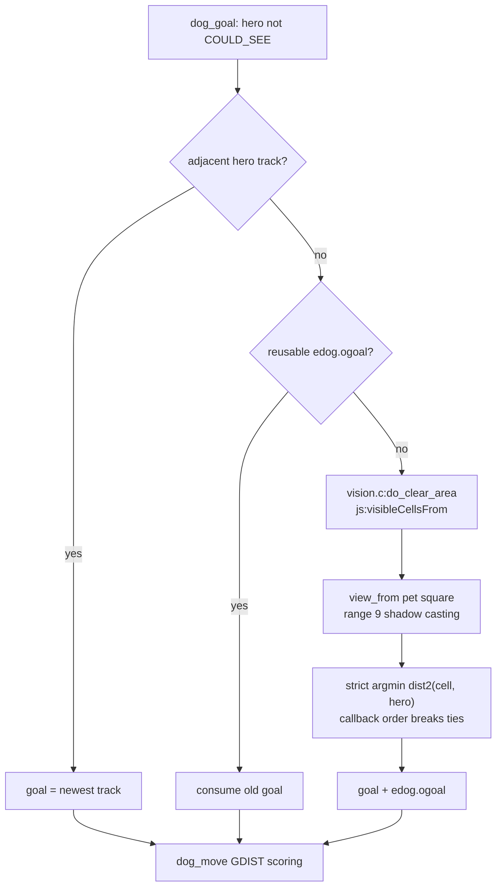

Hero `viz_array` answers whether the hero can currently see a cell. It cannot
answer which cells a distant pet can see from inside another room. The
arbitrary-origin query shares terrain blockage and shadow casting with normal
vision but keeps its result local to AI planning; rendering remains owned by
the hero-centered vision buffer. In callback mode, `view_from()` emits the
starting row first, recurses downward right/left, then upward right/left.
`wantdoor()` updates only for a strictly smaller distance, so that traversal
order is semantic whenever two visible squares are equally close to the hero.

## 17. Hero boulder-push state transaction

```mermaid
flowchart LR
    move["hack.c:domove<br/>hero targets boulder square"]
    validate["validate square beyond<br/>terrain / monster / boulder"]
    exercise["dopush<br/>exercise STR true"]
    extract["remove_object<br/>source pile chain"]
    place["place_object<br/>destination pile chain"]
    repaint["newsym source + destination"]
    hero["commit hero into vacated square"]
    lineup["m_move prelude<br/>lined_up through boulder"]
    melee["do_attack + mattacku<br/>long sword / bite / kill"]
    init["makemon PM_GOBLIN<br/>empty m_initweap branch"]
    dart["trap.c<br/>hero dart trap"]
    commands["loot + PICK_ANY<br/>three elapsed commits"]
    petcombat["dog_move ALLOW_M<br/>pony vs goblin/newt"]
    postcombat["vision callback order<br/>post-combat tie choice"]
    nextinv["NEXT: random monster<br/>m_initweap / m_initinv"]

    move --> validate --> exercise --> extract --> place --> repaint --> hero --> lineup --> melee --> init --> dart --> commands --> petcombat --> postcombat --> nextinv
```

The boulder is not terrain and is not consumed by movement. It retains object
identity while changing pile ownership and coordinates. That mutation affects
later glyphs, monster candidate blocking, Sokoban-style movement, and save
state; painting the hero over the original glyph without moving the object
would only mask the divergence for one screen.

## 18. Hostile line-of-sight prelude and next combat owner

```mermaid
flowchart LR
    hostile["monmove.c:m_move<br/>ordinary hostile"]
    alignment{"straight/diagonal<br/>distance < BOLT_LIM?"}
    clear{"clear sight path?"}
    terrain["wall / closed door / water wall<br/>reject without RNG"]
    boulders["count boulder squares<br/>rn2(2 + count) < 2"]
    items["item-search gate<br/>currently no acquisition"]
    candidates["mfndpos + recent mtrack<br/>destination selection"]
    heroattack["uhitm.c:hitum<br/>long-sword dmgval"]
    counter["mhitu.c:hitmu<br/>jackal bite + knockback"]
    kill["mon.c:xkilled<br/>jackal corpse chance"]
    nextinit["makemon.c<br/>PM_GOBLIN m_initweap"]
    dart["trap.c<br/>dart construction + impact"]
    commands["cmd.c loot + pickup<br/>Enter-time commits"]
    petcombat["dogmove.c ALLOW_M<br/>mattackm + monster death"]
    visionorder["vision.c callback order<br/>strict-minimum tie break"]
    next["NEXT: random monster<br/>inventory constructor"]

    hostile --> alignment
    alignment -->|"no"| items
    alignment -->|"yes"| clear
    clear -->|"yes"| items
    clear -->|"non-boulder blocker"| terrain --> items
    clear -->|"boulders only"| boulders --> items
    items --> candidates --> heroattack --> counter --> kill --> nextinit --> dart --> commands --> petcombat --> visionorder --> next
```

This prelude is structurally upstream of ordinary movement even when the
monster never throws anything. The current witness uses its boolean result to
suppress item search and then continues into the already-ported recent-track
avoidance. Because the boulder is a shared floor object, `dopush()`, vision,
monster targeting, movement blocking, display, and persistence must all agree
on the same coordinates. The following transaction reverses actor direction:
the hero attacks the adjacent jackal, and the wielded weapon—not monster
species or a generic melee fallback—owns the damage die. That combat tail is
now accepted. The following goblin constructor leaves its inventory empty only
after evaluating its class-specific choices; the next trap creates an actual
dart object which enters the floor chain after missing. Pet combat and the
ordered off-hero vision fallback then consume those shared actor, object, and
terrain graphs before the later random-monster constructor becomes observable.

## 19. Shared hero/monster melee tail

```mermaid
sequenceDiagram
    participant Hero as Knight do_attack
    participant Weapon as long sword dmgval
    participant Jackal as jackal state
    participant Counter as jackal mattacku
    participant Loop as scheduler + maintenance

    Hero->>Weapon: rnd(8) + enchantment
    Weapon->>Jackal: 3 HP to 1 HP
    Hero->>Jackal: knockback, flight, passive gates
    Loop->>Counter: adjacent jackal action
    Counter->>Hero: d(1,2) physical bite
    Counter->>Counter: generic knockback gates
    Hero->>Weapon: second rnd(8) + enchantment
    Weapon->>Jackal: lethal damage
    Hero->>Jackal: xkilled + rn2(2) corpse chance
    Loop->>Loop: remove actor from later fmon scans
```

Damage ownership follows the wielded object; attack dice and narration follow
the monster species; corpse probability follows the defeated species. These
three metadata axes meet in one elapsed-turn transaction and must mutate HP,
the live monster list, floor objects, hero HP, messages, and later scheduler
membership consistently. The next random actor reaches the same downstream
scheduler, so its constructor inventory cannot be represented by generic
screening calls alone.

## 20. Species-specific random monster inventory

```mermaid
flowchart LR
    select["rndmonnum<br/>mnum 70 PM_GOBLIN"]
    record["makemon<br/>identity / HP / sex"]
    attack{"has AT_WEAP?"}
    class["m_initweap S_ORC"]
    helm["rn2(2)<br/>orcish helm rejected"]
    weapon["rn2(2)<br/>orcish dagger rejected"]
    rare["level 0 > rn2(75)<br/>false"]
    generic["m_initinv<br/>defensive / misc"]
    empty["live minvent remains empty"]
    dart["floor dart trap<br/>creates a live object"]
    commands["loot + multi-pickup<br/>turn ownership"]
    petcombat["pony occupied candidate<br/>combat + corpses"]
    visionorder["off-hero visibility<br/>callback-order tie"]
    next["NEXT: random monster<br/>inventory constructor"]

    select --> record --> attack
    attack -->|"yes"| class --> helm --> weapon --> rare --> generic --> empty --> dart --> commands --> petcombat --> visionorder --> next
```

An empty inventory is an outcome, not the absence of a constructor. Species
class, attack type, level, and the individual random choices all participate
before the actor is linked into future scheduler scans. The same distinction
now becomes visible from the opposite direction: the next trap constructs a
dart even if impact handling later destroys it or leaves it on the floor. In
this witness it lands. The later post-combat vision tie is resolved before a
new random monster exposes the next inventory-construction dependency.

## 21. Pager-resumed dart trap transaction

```mermaid
sequenceDiagram
    participant Move as domove into (40,5)
    participant Pager as floor pile --More--
    participant Trap as trapeffect_dart_trap
    participant Obj as mksobj DART
    participant Hero as thitu
    participant Floor as level.objects[40][5]

    Move->>Pager: display existing four-object pile
    Pager-->>Move: space resumes same command
    Move->>Trap: dispatch live DART_TRAP
    Trap->>Obj: identity, quantity, BUC, poisonability, erosion
    Trap->>Obj: force trap missile quantity = 1
    Trap->>Hero: poison gate, rnd(3) damage, rnd(20) hit
    Hero-->>Trap: miss by one; HP unchanged
    Trap->>Floor: link same poisoned dart object
    Trap-->>Move: once/tseen + combined message
    Move->>Move: settle elapsed monster/global cycle
```

The pager is a suspension inside movement, not a turn boundary. Object
construction occurs only after its continuation key returns, and the elapsed
monster scan occurs only after trap resolution completes. This ordering keeps
screen, trap, floor pile, HP, RNG, and scheduler state on one transaction edge.

## 22. Loot and multi-pickup command ownership

```mermaid
sequenceDiagram
    participant TTY as tty input boundaries
    participant Ext as cmd.c doextcmd / doloot
    participant Menu as tty choice and PICK_ANY windows
    participant Floor as floor object chains
    participant Loop as moveloop_core

    TTY->>Ext: # l Enter
    Ext->>Menu: Do what with the bag?
    TTY->>Menu: o
    Menu-->>Ext: empty-container action committed
    Ext->>Loop: elapsed turn 1
    TTY->>Menu: comma; toggle c,d; Enter
    Menu->>Floor: transfer bag and lamp
    Menu->>Loop: elapsed turn 2
    TTY->>Menu: comma; toggle a,b; Enter
    Menu->>Floor: transfer dart stack and poisoned dart
    Menu->>Loop: elapsed turn 3
```

Opening and editing a menu are zero-time operations; the selected action or
Enter commit owns time. The scheduler therefore cannot be attached to a raw
input byte. Inventory-letter assignment is downstream of wallet handling:
gold uses `$` and leaves `k/l/m/n` available for the four later objects.

## 23. Occupied pet candidates and monster combat

```mermaid
flowchart TD
    mfnd["mfndpos in x-major order"] --> occupied{"neighbor occupied?"}
    occupied -->|"ALLOW_M absent"| reject["reject"]
    occupied -->|"ALLOW_M present"| mark["candidate info |= ALLOW_M"]
    mark --> balk{"target level >= pet balk?"}
    balk -->|"yes"| next["continue candidate scan"]
    balk -->|"no"| attacks["mattackm: kick then bite"]
    attacks --> hit["rnd(20+i), damage, knockback"]
    hit --> passive["passivemm even after a miss"]
    passive --> survive{"defender survives a hit?"}
    survive -->|"yes + rn2(4)"| returnAttack["defender mattackm return attack"]
    survive -->|"no"| death["monster death transaction"]
```

The occupied square participates in candidate count and recent-track ranges
before it becomes a combat target. Pet level and HP fraction determine whether
the target is audacious enough to attack; target armor class and pet level then
determine hit threshold. Those are distinct decisions over the same actors.

## 24. Pet kill, corpse, and post-combat planning

```mermaid
flowchart LR
    lethal["fatal kick/bite"] --> chance["corpse_chance<br/>2 + low-frequency + verysmall"]
    chance -->|"selected"| construct["mksobj CORPSE<br/>provisional species + timeout"]
    construct --> override["set defeated species"]
    override --> floor["place on death square"]
    chance -->|"rejected"| remove
    floor --> remove["remove defender from fmon"]
    remove --> grow["grow_up pet"]
    grow --> scheduler["later scans see new actor and pile graph"]
    scheduler --> visionorder["vision callback order<br/>equal-distance rn2(1)"]
    visionorder --> next["NEXT: random monster<br/>inventory constructor"]
```

Death rewrites two graphs at once: the actor leaves scheduler/occupancy state,
and a possible corpse joins floor-object state. Both feed the next pet goal and
candidate scan. Once callback-order tie breaking is preserved, this complete
post-removal state remains aligned through input 270.

## 25. Vision callback order as an AI dependency

```mermaid
sequenceDiagram
    participant Dog as dogmove.c:dog_goal
    participant Area as vision.c:do_clear_area
    participant View as vision.c:view_from
    participant Want as wantdoor callback
    participant Move as dogmove.c:candidate scoring

    Dog->>Area: origin = pony; range = 9
    Area->>View: callback mode, no hero bitmap
    View->>Want: starting-row cells, left to right
    View->>Want: downward right then left ranges
    View->>Want: upward right then left ranges
    Want->>Want: replace goal only if distu is smaller
    Note over Want: equal minima retain first callback
    Want-->>Dog: goal (63,12), not row-major (63,8)
    Dog->>Move: first candidate ties current distance
    Move->>Move: rn2(1) equal-choice gate
```

The renderer cares about the visible set, but `dog_goal()` also observes the
order in which that set is produced. A bitmap followed by sorted enumeration
is therefore not behaviorally equivalent to C even when every visible cell is
correct. JS now shares one shadow-casting implementation with two consumers:
bitmap accumulation for hero rendering and immediate ordered callbacks for
arbitrary-origin AI queries. The next dependency begins at a later random
monster's species and inventory construction on input 271.

## 26. Species-gated random-monster gender

```mermaid
flowchart LR
    identity["makemon identity + newmonhp"] --> flags{"MONSTER_FLAGS2 gender"}
    flags -->|"M2_FEMALE"| female["female = true"]
    flags -->|"M2_MALE or M2_NEUTER"| notfemale["female = false"]
    flags -->|"unrestricted"| random["rn2(2)"]
    female --> inventory["m_initweap / m_initinv"]
    notfemale --> inventory
    random --> inventory
    inventory --> actor["live actor + future corpse gender"]
    actor --> next["NEXT: dog_invent<br/>pony current floor pile"]
```

Sex is initialized between HP and inventory and survives into corpse stacking,
so a neuter cannot consume a throwaway random-sex call. The input-271 lichen
uses the fixed-neuter edge and enters generic inventory immediately. The next
observable owner is the pony's current-square object transaction on input 275.

## 27. Starting-pet creation order and fetch evaluation

```mermaid
flowchart TD
    zero["u_init_misc: attributes still zeroed"] --> makedog["makedog / initedog"]
    makedog --> acurr["ACURR(A_CHA) clamps to 3"]
    acurr --> apport["edog.apport = 3"]
    apport --> attrs["u_init_inventory_attrs: final Knight CHA = 17"]
    attrs --> turns["later dog_move scheduler turns"]
    turns --> floor["dog_invent: current floor object"]
    floor --> food["dogfood / obj_resists screening"]
    food --> carry{"fetchable, uncursed, and can carry?"}
    carry -->|"no: medium orc corpse"| goal["continue to dog_goal"]
    carry -->|"yes: small goblin corpse"| fetch["rn2(20) < apport + 3"]
    fetch -->|"false: 10 < 6"| goal
    fetch -->|"true"| pickup["pet pickup transaction"]
```

`edog.apport` is a snapshot of startup state, not a live view of the hero's
eventual attributes. `dog_invent()` is likewise a transaction pipeline rather
than a generic draw per floor object: food classification always precedes the
conditional fetch roll, and object weight/carryability can suppress that roll
entirely. With the goblin rejection aligned, the next command-state chain is
mixed gold/ring pickup -> inventory letter assignment -> put-on/ring finger ->
Conflict -> `resist_conflict()` in both monster allowance and pet movement.

## 28. Mixed pickup to Conflict-enabled pet planning

```mermaid
sequenceDiagram
    participant Input as tty input boundaries
    participant Menu as PICK_ANY floor menu
    participant Inv as wallet and inventory
    participant Wear as doputon / accessory_or_armor_on
    participant Dog as dog_move
    participant Allow as mon_allowflags / mfndpos

    Input->>Menu: comma opens Coins($) + Rings(a)
    Input->>Menu: @ selects all; a toggles ring twice
    Input->>Menu: Enter commits selected identities
    Menu->>Inv: gold 4 -> 9; ring receives invlet q
    Inv-->>Input: elapsed scheduler turn
    Input->>Wear: P, q, r nested selection
    Wear->>Inv: uright = object 186 (RIN_CONFLICT)
    Inv-->>Input: elapsed scheduler turn
    Input->>Dog: next ordinary monster cycle
    Dog->>Dog: rnd(20), pet resistance result
    Dog->>Allow: construct movement allowance flags
    Allow->>Allow: rnd(20), add ALLOW_U when not resistant
    Allow->>Dog: mfndpos includes hero square
```

Menu accelerators are state-bearing because they determine which object
identities reach inventory; inventory letters then become the input language
of later commands. Equipping Conflict adds no RNG itself, but changes the
next scheduler's source path twice before candidate scoring. The next chain
continues from the same inventory graph: `r` -> `?` object selector -> `o`
scroll -> pager -> teleport exercise and destination search.

## 29. Nested read selection and safe teleportation

```mermaid
sequenceDiagram
    participant Input as tty input boundaries
    participant Obj as getobj(read)
    participant Read as read.c / seffects
    participant Discover as discover_object
    participant Tele as safe_teleds / teleds
    participant Loop as moveloop_core

    Input->>Obj: r opens [o or ?*]
    Input->>Obj: ? displays eligible o and keeps request alive
    Input->>Read: o selects object 333
    Read->>Read: install disappearance pager message
    Read->>Read: exercise Wisdom, rn2(19)
    Read->>Discover: learn scroll type, exercise Wisdom, rn2(19)
    loop at most 40 random coordinates
        Tele->>Tele: rnd(79) x, rn2(21) y, teleok
    end
    Tele->>Tele: reject five stone cells; move hero to (14,9)
    Tele->>Input: capture pager over recalculated map
    Input->>Read: space dismisses pager and consumes scroll
    Read->>Loop: materialization message + elapsed turn
```

The pager is not the effect boundary: C has already changed attributes,
discovery state, hero coordinates, vision, and RNG by the time it requests
the space. This is why moving otherwise-correct calls across `nhgetch()` is a
scored ownership bug. The next nested state machine is `getpos()` for travel,
including its one-time tutorial, location cycling, cursor description, and
the persistent run it installs after target acceptance.

## 30. Travel modal, Lua tip, and run-mode path planning

```mermaid
sequenceDiagram
    participant TTY as tty message window
    participant Lua as nhcore.lua getpos tip
    participant Pos as getpos cursor state
    participant Path as hack.c findtravelpath
    participant Loop as moveloop_core

    TTY->>TTY: travel question, two input boundaries
    TTY->>Lua: show one-page far-look tip
    Lua-->>Pos: ordinary page dismissal
    Pos->>Pos: greater-than cycles to downstairs
    Pos->>Path: period commits target (42,7)
    Path->>Path: reverse BFS, cardinal directions first
    Path->>Loop: first hero step, run mode 8 remains live
    loop after every elapsed monster/global turn
        Loop->>Path: recompute route against current state
        Path-->>Loop: next step or stop condition
    end
```

The command is a pipeline across three input owners, not a single modal
prompt. Repeat travel skips the Lua edge and starts from the cached target.
When remembered terrain does not connect to that target, `TRAVP_GUESS`
searches outward from the hero through `couldsee` cells, selects the closest
reachable frontier in C's x-major/y-major tie order, and retries after the
next square reveals more terrain. Generic doorway run stopping does not apply
to mode 8.

## 31. TTY rush, lichen combat, and corpse construction

```mermaid
flowchart LR
    cr["recorded CR byte"] --> tty["tty ICRNL normalization"]
    tty --> rush["vi ^J rush south, run mode 3"]
    rush --> stop["lookaround sees hostile lichen"]
    stop --> attack["shared hero melee"]
    attack --> miss["miss + passive-contact gate"]
    attack --> kill["fatal hit + corpse chance"]
    kill --> make["mksobj(CORPSE): temporary species and timeout"]
    make --> override["override corpsenm/name with lichen"]
    override --> floor["link identical object into floor pile"]
```

TTY normalization changes command meaning before `rhack()`. The final corpse
cannot be created as a literal because the provisional object constructor is
observable even though its species is immediately replaced.

## 32. Floor eating as a resumable occupation

```mermaid
sequenceDiagram
    participant Cmd as doeat / floorfood
    participant Eat as eatcorpse
    participant Occ as occupation state
    participant Loop as moveloop_core
    participant Obj as floor object chain

    Cmd->>Obj: select live lichen corpse under hero
    Cmd->>Eat: y confirms; rn2(10)
    Eat->>Occ: install three remaining bites
    loop three elapsed turns
        Loop->>Loop: monster movement and global maintenance
        Loop->>Occ: continue occupation
    end
    Occ->>Obj: done_eating / useupf removes same object
    Occ-->>Cmd: combined taste and finish message
```

The final bite is not attached to another input byte. One still-unfactored
pet-side `obj_resists()` call occurs between the final occupation maintenance
and the next monster scan; the journal keeps that ownership debt explicit.

## 33. Long-travel persistent-state fan-in

```mermaid
flowchart TD
    mineral["mklev mineralize"] --> deposit{"rn2(3) result"}
    deposit -->|zero| buried["buried object list"]
    deposit -->|nonzero| floor["floor fobj chain"]
    corpse["mksobj ordinary corpse"] --> timer["age + rnz-derived rotAt"]
    timer --> timeout["nh_timeout in turn maintenance"]
    timeout --> floor
    floor --> dog["dog_goal object screening"]
    conflict["worn RIN_CONFLICT"] --> actors["pet and every hostile resistance"]
    actors --> move["candidate generation and movement"]
    dog --> move
    move --> travel["next mode-8 hero step"]
```

Repeat travel is a stress test for the whole persistent graph. Deposits made
at level creation enter pet searches hundreds of turns later; expired corpses
must leave before those searches; newly generated hostiles add their own
Conflict checks. Omitting any edge changes pet position, actor order, later
visibility, and the remainder of the route.

## 34. Quick far-look as a second getpos client

```mermaid
sequenceDiagram
    participant Cmd as semicolon dowhatis
    participant Pos as shared getpos cursor
    participant Desc as automatic description
    participant Screen as do_screen_description

    Cmd->>Pos: start at cached downstairs coordinate
    Pos->>Desc: y gives floor of a room
    Pos->>Desc: y gives seen dart trap
    Pos->>Desc: h gives wall
    Pos->>Screen: period selects wall
    Screen-->>Cmd: DEC glyph plus verbose wall text
    Cmd-->>Cmd: restore hero cursor, consume zero time
```

Travel and far-look share coordinate mechanics but have different prompt,
acceptance, and post-selection behavior. Keeping them as separate clients of
one getpos model prevents modal keys from leaking into ordinary movement.


## 35. Hostile perception is a non-random input to movement

```mermaid
flowchart LR
    hero["hero coordinate"] --> envelope{"couldsee + lighting + distance <= 6"}
    envelope -->|yes| direct["pursue apparent hero position"]
    envelope -->|no, has eyes| track["gettrack from 100-position hero ring"]
    track --> goal["local pursuit goal"]
    direct --> goal
    goal --> candidates["mfndpos candidate scoring"]
    candidates --> position["silent monster position"]
    position --> later["later candidate count and rn2 range"]
```

The goal swap itself owns no PRNG call. Its first scored symptom can occur
several turns later when terrain around the silently different position changes
the size of `mfndpos()`.

## 36. Three Conflict layers and the tty combat cut

```mermaid
sequenceDiagram
    participant Scan as movemon_singlemon
    participant Fight as fightm
    participant Dog as dog_move
    participant Flags as mon_allowflags
    participant Attack as mattacku
    participant TTY as tty message pager

    Scan->>Fight: mutually visible and within BOLT_LIM
    Fight->>Fight: resist_conflict, rnd(20)
    Scan->>Dog: dochug pet action
    Dog->>Dog: pet resistance, rnd(20)
    Dog->>Flags: construct candidate permissions
    Flags->>Flags: ALLOW_U resistance, rnd(20)
    Flags-->>Dog: hero square is a legal candidate
    Dog->>Attack: selected ALLOW_U means attack, not move
    Attack->>TTY: kick and miss messages
    TTY-->>Scan: space resumes deferred distfleeck
```

The three resistance rolls answer different questions. The pager can split one
monster action between two public input captures, so actor execution and RNG
must remain sequential.

## 37. Wallet projection and inventory consumers

```mermaid
flowchart TD
    wallet["numeric wallet authority"] --> status["status line and Coins menu"]
    wallet --> projection["logical $ gold object"]
    projection --> dogfood["dog_goal gi.invent walk"]
    lettered["lettered inventory a..z"] --> dogfood
    projection --> selector["getobj menu accelerator $"]
    lettered --> selector
```

Coins do not need a second persistent object record, but source consumers must
see the same `$`-before-`a` order as C.

## 38. Selectable inventory to thrown-food consumption

```mermaid
sequenceDiagram
    participant Cmd as throw command
    participant Menu as tty inventory pages
    participant Obj as floor object chain
    participant Goal as dog_goal
    participant Move as dog_move
    participant Eat as dog_eat

    Cmd->>Menu: ? or * opens page 1
    Menu-->>Cmd: inventory accelerator h
    Cmd->>Cmd: request direction l; split carrot stack
    Cmd->>Obj: link thrown singleton at (51,8)
    Obj->>Goal: nearby scan classifies preferred carrot
    Goal->>Move: goal=(51,8), appr=1
    Move->>Eat: enter candidate and consume identical object
    Eat-->>Cmd: pony eating message and elapsed turn
```

The menu, projectile, pet goal, and consumption are one durable transaction.
A selector window returns to its original command; it is not a standalone
inventory command.

## 39. Repeated thrown-food object and occupation lifecycle

```mermaid
flowchart TD
    select["throw getobj selects one stack unit"] --> split["split object identity and rnd(2)"]
    split --> flight["throw_obj traverses at most two squares"]
    flight --> stop{"terrain or actor blocks flight?"}
    stop --> floor["link into destination floor chain"]
    floor --> merge{"compatible stack already present?"}
    merge --> pile["one floor object with quantity"]
    pile --> goal["dog_goal classifies nearby food"]
    goal --> enter["dog_move enters food square"]
    enter --> consume["dog_eat removes one unit"]
    consume --> meal["monster.meating = 1"]
    meal --> next["next m_move decrements meal and stays still"]
    next --> current["later dog_invent checks current-square remainder"]
    current --> consume
```

The projectile command ends before the pet lifecycle does. Object identity,
quantity, position, and the pet occupation must survive independently across
later scheduler passes; chat is another read-only observer of `meating`.

## 40. Nested getobj cancellation ownership

```mermaid
stateDiagram-v2
    [*] --> EatPrompt: e
    EatPrompt --> InvalidPager: absent inventory letter
    InvalidPager --> EatPrompt: space dismisses More
    EatPrompt --> Cancelled: next space or Escape
    EatPrompt --> Selected: edible accelerator
    Cancelled --> [*]: Never mind; zero time
    Selected --> [*]: eat transaction
```

Identical bytes have different owners at adjacent boundaries. A space consumed
by `--More--` cannot also cancel the reissued prompt; the following space can.
This is why command handlers must retain explicit nested modal state instead of
globally classifying whitespace.

## 41. Seed0006 elapsed-turn control graph

```mermaid
flowchart TD
    key["tty key / rhack"] --> hero["hero command in hack.c or uhitm.c"]
    hero --> elapsed{"context.move?"}
    elapsed -->|yes| loop["allmain.c moveloop_core"]
    loop --> scan["mon.c movemon in fmon order"]
    scan --> dochug["monmove.c dochug"]
    dochug --> dog["dogmove.c dog_move for kitten"]
    dog --> goal["dog_goal: food, apport, sight, reachability"]
    dog --> candidates["mfndpos and candidate scoring"]
    candidates --> ranged["pet_ranged_attk -> best_target -> score_targ"]
    ranged --> relocate["newdogpos or stationary result"]
    candidates -->|adjacent ALLOW_M| mm["mhitm.c mattackm"]
    mm --> death["mon.c corpse_chance / make_corpse"]
    death --> grow["makemon.c grow_up"]
    relocate --> ration["mcalcmove allocations and global maintenance"]
    grow --> ration
    ration --> prompt["next tty input boundary"]
```

The ranged branch is not conditional on possessing a ranged attack. Target
discovery and `score_targ()` can consume randomness before `mattackm()` later
rejects a kitten bite for distance. Removing that apparently useless branch
changes which PRNG results are assigned to later movement rations.

## 42. C owners and Lua parity modules for the new frontier

```mermaid
flowchart LR
    subgraph C["Original C"]
        CLevel["mklev.c / makemon.c\nmonster level, HP, trap victims"]
        CDog["dogmove.c\ndog_goal, dog_move, best_target"]
        CCombat["mhitm.c / mon.c\nattack, passive, corpse"]
        CGrow["makemon.c\ngrow_up"]
        COpt["options.c + tty menus\ntwo-page options transaction"]
    end
    subgraph Lua["Lua/JS port"]
        JLevel["js/mklev.js\nadjusted level, PM identity, corpse age"]
        JDog["js/monmove.js\ngoal, candidates, ranged scan"]
        JCombat["js/monmove.js\nkitten bite, corpse, growth"]
        JSched["js/allmain.js\nactor-at-a-time scan and maintenance"]
        JOpt["js/cmd.js\noptions pages and nested selector"]
    end
    CLevel --> JLevel
    CDog --> JDog
    CCombat --> JCombat
    CGrow --> JCombat
    CDog --> JSched
    COpt --> JOpt
    JLevel --> JDog
    JDog --> JCombat
    JCombat --> JSched
```

The edges are behavioral contracts, not file-copy relationships. In
particular, level metadata becomes an AI input much later: PM identity, corpse
age, current level, HP, and floor-chain placement all influence pet decisions
and combat without necessarily changing the screen where they were created.

## 43. Options is a nested zero-time command transaction

```mermaid
stateDiagram-v2
    [*] --> Page1: O
    Page1 --> PickupTypes: o
    PickupTypes --> PickupTypes: toggle object class
    PickupTypes --> Page1: Enter
    Page1 --> Page2: Space
    Page2 --> Page1: toggle item whose source returns to page 1
    Page1 --> Page1: toggle behavior option
    Page2 --> Page2: toggle page-2 option
    Page2 --> Closed: Space on final page
    Closed --> [*]: no elapsed turn
```

The option values outlive the menu, but the command consumes no movement. A
submenu key belongs to the pickup-type editor until Enter returns it to page 1;
page-navigation spaces are not ordinary command-loop waits.

## 44. Pet death state feeds later running and terrain decisions

```mermaid
flowchart TD
    kill["mattackm kills kobold zombie"] --> corpse["make_corpse: zombie -> kobold"]
    corpse --> age["age -= TAINT_AGE + 1"]
    age --> goal["dog_goal classifies corpse as POISON"]
    goal --> apport["apport rn2(8), then can_carry"]
    apport --> heavy["kitten rejects 400-weight corpse"]
    heavy --> floor["corpse remains in floor chain"]
    floor --> run["hero Shift-run reaches corpse"]
    run --> stop["pickup/check_here stops multi and reports corpse"]
```

The corpse is not combat output that can be reduced to a glyph. Its converted
species, age, weight, floor identity, and name are read later by pet AI,
carrying rules, the run controller, and tty messages.

## 45. Monster movement commits terrain changes before the next hero run

```mermaid
sequenceDiagram
    participant S as allmain.c scheduler
    participant M as monmove.c m_move
    participant P as monmove.c postmov
    participant L as level terrain
    participant R as hack.c lookaround
    S->>M: scan zombie with movement ration
    M->>L: select and enter closed-door square
    M->>P: MMOVE_MOVED plus can_open
    P->>L: D_CLOSED -> D_ISOPEN
    S->>R: resume pending Shift-run
    R->>L: inspect updated 3x3 neighborhood
    R-->>S: follow corridor or stop at widening
```

The JS parity boundary spans `js/monmove.js` and `js/cmd.js`: monster
destination selection must commit its door mutation before `continueRun()`
recomputes the next direction. Keeping the door closed produces a plausible
screen for several turns but sends the subsequent input stream into `doopen`
instead of the level-transition path.

## 46. Next slice: ordinary downward level transition

```mermaid
flowchart TD
    key["> command"] --> valid{"hero on downstairs?"}
    valid -->|yes| goto["goto_level / schedule_goto"]
    goto --> leave["current-level departure and persistence"]
    leave --> bones["getbones eligibility and rn2(3)"]
    bones --> create["makelevel or restore level"]
    create --> place["place hero at upstairs"]
    place --> vision["vision reset, redraw, arrival effects"]
    vision --> time{"did the command consume hero time?"}
    time --> prompt["next tty input boundary"]
```

Seed0006 closes this stair-shaped edge through depth two. Seed0116 and seed5006
also reach `getbones()`, but fresh literal-input inspection shows that they do
so through wizard Ctrl-V level teleport rather than `>`; their command and
arrival edges are mapped separately in section 51. Construction and persisted
level ownership remain shared and must not be keyed to either route.

## 47. Ordinary-level construction order and the C/Lua seam

```mermaid
flowchart TD
    mklev["mklev.c: mklev / makelevel"] --> bones{"usable bones level?"}
    bones -->|yes| restored["restore the serialized C level graph"]
    bones -->|no| rooms["makerooms: ordinary rooms and corridors"]
    rooms --> special{"ordinary special-room gate"}
    special --> shop["mkshop: choose room and shop class"]
    shop --> basefill["fill ordinary rooms, excluding the shop"]
    basefill --> shopfill["fill_special_room / stock_room"]
    shopfill --> shk["shkinit: shopkeeper and inventory"]
    shopfill --> stock["objects plus stock-selected mimics"]
    stock --> vault["makevault"]
    vault --> mineral["mineralize: live and buried deposits"]
    mineral --> level["one C level graph: terrain, rooms, fobj, fmon, stairs"]
    restored --> level

    reservoir["themerms.lua reservoir"] -. "only when the themed-room branch is selected" .-> bridge["nhlua.c / sp_lev.c bridge"]
    bridge -. "mutates the same C level graph" .-> level
```

Ordinary shop generation is owned by C; Lua is not a second level generator
and is not consulted merely because a room is special. The themed-room
reservoir crosses the dotted bridge only on its own branch, then writes into
the same C structures. Consequently, the JS parity layer must preserve one
ordered construction transaction in `js/mklev.js`; producing the same final
glyphs with stock, mimics, or minerals created in a different order still
assigns different PRNG results and later actor identities.

## 48. Downward construction versus upward cached restoration

```mermaid
sequenceDiagram
    participant Cmd as cmd.c stair command
    participant Go as do.c goto_level
    participant Cache as saved-level state
    participant Build as bones.c + mklev.c
    participant Mon as mon.c migration/arrival
    participant TTY as vision + tty

    Cmd->>Go: validate hero on matching stair
    Go->>Cache: persist departing level graph
    alt destination has never been visited
        Go->>Build: getbones, then mklev if unavailable
        Build-->>Go: new destination graph
        Go->>Go: place hero at destination upstairs
    else destination is cached
        Go->>Cache: restore destination graph
        Cache-->>Go: original objects, monsters, timers, stairs
        Go->>Go: run restored-monster hider checks
    end
    Go->>Mon: select eligible adjacent followers
    Mon->>Mon: mon_arrive / enexto placement rings
    Go->>TTY: departure or climb pager on the old screen
    TTY->>TTY: acknowledge, recalculate vision, draw destination
    TTY-->>Cmd: resume elapsed-turn scheduler
```

The cache owns object and monster identity, not a regenerated approximation.
Follower placement is part of arrival and must see the destination geometry;
near a top edge, successive rings have clipped sizes, so their shuffle ranges
are parity-visible. The old-screen pager and new-screen redraw are two phases
of the same transition and cannot be collapsed into a single capture.

## 49. Fountain demon from creation to fatal return attack

```mermaid
flowchart TD
    quaff["drinkfountain at hero square"] --> fate["rnd(30) water-demon fate"]
    fate --> near["enexto candidate rings and makemon"]
    near --> kit["water-demon HP, weapon quantity, defensive inventory"]
    kit --> wish["low-level wish check"]
    wish --> dry["dryup rn2(3), terrain and fountain count"]
    dry --> sched["allmain movement allocation and newest-first fmon scan"]
    sched --> mimic{"actor is a disguised mimic?"}
    mimic -->|yes| debit["debit movement; skip dochug and RNG"]
    mimic -->|no| ai["dochug / m_move / mattacku"]
    ai --> return["adjacent demon follows during cached-level ascent"]
    return --> attack["weapon, claw, bite, knockback, and damage in C order"]
    attack --> pager{"tty message needs More?"}
    pager -->|yes| suspend["capture state; wait for acknowledgement"]
    suspend --> attack
    pager -->|no| death["done / bones roll / gameover"]
    death --> stop["stop actor scan and global maintenance"]
```

This graph deliberately crosses command, level, scheduler, AI, combat, display,
and death modules. The demon is not a fountain-local effect. Likewise, a mimic
is not inert state: it receives and spends a movement ration, but its disguise
cuts the call graph before the random branches in `dochug()`.

## 50. Source ownership and current parity seams

| Behavioral owner | Original C/Lua source | Current JS parity seam | State that must survive the seam |
| --- | --- | --- | --- |
| Ordinary rooms, shops, stock, vault, minerals | `mklev.c`, `mkroom.c`, `shknam.c`, `mimic.c` | `js/mklev.js` | room type/order, floor chains, buried objects, `fmon` creation order |
| Optional themed-room content | `dat/themerms.lua` through `nhlua.c`/`sp_lev.c` | `js/mklev.js`, `js/dungeon.js` | selection result and mutations to the same live level |
| Stair validation and departure | `cmd.c`, `do.c` | `js/cmd.js` | direction, elapsed-turn ownership, departing-level identity |
| Save/restore and bones branch | `save.c`, `bones.c`, `do.c` | level cache plus `js/mklev.js` | visited level graph, timers, monster/object identity |
| Follower migration and placement | `do.c`, `mon.c` | `js/cmd.js`, `js/u_init.js` | eligibility, ring order, clipped coordinates, actor linkage |
| Movement allocation and actor scan | `allmain.c`, `mon.c` | `js/allmain.js` | movement balance, newest-first order, immediate gameover cut |
| Disguise and hostile AI | `mon.c`, `monmove.c` | `js/monmove.js`, `js/allmain.js` | mimic pre-AI return, location, peaceful/tame state |
| Fountain and water-demon construction | `fountain.c`, `makemon.c`, `muse.c` | `js/cmd.js`, `js/mklev.js` | terrain, inventory, weapon quantity/readiness, wish result |
| Combat and tty suspension | `mhitu.c`, `hack.c`, tty window code | `js/allmain.js`, `js/display.js`, `js/windows.js` | HP commit point, pending attacks, exact pager owner |

Planning rule: add parity at an ownership boundary, then pin both the immediate
PRNG slice and a later state consumer. A generation-only assertion would not
have caught the mimic's scheduler behavior; an attack-only assertion would not
have caught follower placement or cached-level restoration.

## 51. Numeric wizard level teleport into the shared lifecycle

```mermaid
sequenceDiagram
    participant Key as cmd.c Ctrl-V binding
    participant Wiz as wizcmds.c wiz_level_tele
    participant Tele as teleport.c level_tele
    participant Loop as allmain.c end-of-command loop
    participant Go as do.c deferred_goto / goto_level
    participant Build as bones.c + mklev.c + optional Lua theme
    participant Arrive as dungeon.c u_on_rndspot
    participant TTY as vision / tty

    Key->>Wiz: wizard-only command
    Wiz->>Tele: level_tele()
    Tele->>TTY: numeric get-line prompt
    TTY-->>Tele: destination depth and newline
    Tele->>Loop: schedule_goto(destination, post-message)
    Loop->>Go: deferred_goto before next command input
    Go->>Go: persist departing level and detach followers
    Go->>Build: getbones, then mklev if no bones
    Build-->>Go: one live destination graph
    Go->>Arrive: random region placement, not a stair
    Arrive->>Arrive: deliver followers and resolve collisions
    Arrive->>TTY: redraw, then materialization feedback
    TTY-->>Key: next input boundary
```

The public inputs make the control distinction observable. Seed0116 enters
depth two after 2,978 exact calls; seed5006 enters depth two after 4,182 and its
second segment enters depth three after 2,671. All three next expect
`getbones()`. Their prior classification as ordinary stair transitions was
therefore wrong: they reuse `goto_level()` and `mklev()`, but not stair
validation, the stair arrival coordinate, or the old-screen descent pager.

```mermaid
flowchart LR
    stair["> on downstairs"] --> shared["persist / getbones / build-or-load"]
    ctrlv["Ctrl-V plus numeric get-line"] --> scheduled["schedule_goto / deferred_goto"]
    scheduled --> shared
    shared --> stairplace["stair route: u_on_upstairs"]
    shared --> randomplace["teleport route: place_lregion / u_on_rndspot"]
    stairplace --> migrate["followers, timers, collision, vision"]
    randomplace --> migrate
```

Current JS ownership should converge on one route-parameterized transition
transaction in `js/cmd.js` plus the existing generation owner in
`js/mklev.js`. Numeric prompt capture, deferred execution, and random arrival
belong to the Ctrl-V route; bones, level identity, follower migration, and
redraw belong to the shared lifecycle.

The implemented slice now proves that boundary end to end for seed0116:
the 2,538-call destination build and arrival transaction is exact, including
nine rejected `place_lregion()` pairs and the pet's 8-, 16-, and 24-cell ring
shuffles. Seed5006's first game now proves the same boundary through all
**8,315** calls before its next command. Its former `mkgrave/somey` mismatch
was random epitaph selection with a stale recorder callsite, mapped in section
52. The remaining second-game bones restore is not a reason to reopen the
Ctrl-V, construction, or random-arrival edges.

## 52. Graves cross from map construction into file-backed random text

```mermaid
flowchart LR
    ordinary["mklev.c fill_ordinary_room"] --> mkgrave["mklev.c mkgrave"]
    morgue["mkroom.c fill_zoo: MORGUE"] --> makegrave["engrave.c make_grave"]
    mkgrave --> position["find_okay_roompos / somexyspace"]
    position --> makegrave
    makegrave --> explicit{"explicit epitaph?"}
    explicit -->|yes| headstone["make_engr_at HEADSTONE"]
    explicit -->|no| text["rumors.c get_rnd_text EPITAPHFILE"]
    text --> skip["skip 60-byte generated header"]
    skip --> select["get_rnd_line: rn2(24,075)"]
    select --> headstone
```

The `rn2(24075)` call belongs to `make_grave()`, not to room-coordinate
selection. NetHack supplies `rn2` to `get_rnd_text()` as a function pointer;
the contest recorder's macro therefore does not install a new source label and
the log retains whichever macro-wrapped call preceded it. Ordinary graves are
usually labeled `somey(mkroom.c:674)` and morgue graves retain
`fill_zoo(mkroom.c:389)`, even though both consume the same 24,075-byte
post-header epitaph range.

JS owns this boundary in generic `make_grave()`: explicit text such as
"Saved by the bell!" bypasses random selection, while a missing text argument
consumes exactly one file-selection draw before headstone engraving. This
removes the former Knight replay condition and covers eight independent public
ordinary-grave witnesses plus morgue creation through one source-shaped edge.

## 53. Wizard wishes join command input to the live shuffled object table

```mermaid
flowchart TD
    objects["include/objects.h configured with MAIL_STRUCTURES"] --> generated["generated OBJECT_NAMES / OBJECT_DESCRIPTIONS / OBJECT_PROB"]
    generated --> init["o_init.c init_objects"]
    init --> shuffle["shuffle_all: class and armor Fisher-Yates"]
    shuffle --> live["live description-index permutation"]

    key["cmd.c Ctrl-W / wiz_wish"] --> line["tty getlin: For what do you wish?"]
    line --> parse["objnam.c readobjnam qualifiers and class wrappers"]
    parse --> lookup["rnd_otyp_by_namedesc: sum oc_prob + 1"]
    live --> lookup
    generated --> lookup
    lookup --> create["mkobj.c mksobj and type-specific initialization"]
    create --> override["apply requested count, enchantment, BUC, charges"]
    override --> hold["invent.c hold_another_object / addinv"]
    live --> visible["xname / doname uses unidentified appearance"]
    hold --> visible
    visible --> cooldown["makewish: rn1(100, 50) gods-notice cooldown"]
    cooldown --> zero["ECMD_OK: zero elapsed turns"]
```

This is a C-owned object transaction; Lua does not participate. Its data seam
is nevertheless global: startup description shuffling determines later wish
matching and the visible inventory name. Merely consuming the startup RNG was
insufficient because it discarded the permutation that `readobjnam()` and
`doname()` later share.

The JS port now generates the base name/description arrays from configured
`objects.h`, preserves the shuffle in `game.objectDescriptionIndex`, and routes
Ctrl-W through `js/objnam.js`, generic `mksobj()`, and the ordinary inventory
owner. For seed5006, `leather gloves` has `oc_prob=15`; `readobjnam()` adds its
one-point wish allowance, so the single match correctly draws `rn2(16)`.
Creation then consumes the four armor decisions and the final cooldown draw,
while presentation uses the shuffled `fencing gloves` description.

The verified boundary spans five consecutive wishes—armor, ring, tool,
scroll, and container—and stays exact through **8,353** calls. The next call
belongs to finishing the glove-wearing occupation and its elapsed-turn actor
scheduler, so that later ownership must remain separate from object-name
resolution.

## 54. Delayed wear crosses negative multi into the live turn scheduler

```mermaid
sequenceDiagram
    participant Key as cmd.c W binding
    participant Wear as do_wear.c dowear
    participant Multi as cmd.c nomul / afternmv
    participant Loop as allmain.c moveloop_core
    participant Actors as mon.c / dogmove.c / monmove.c
    participant Global as timeout / regions / movement allocation
    participant TTY as vision and tty messages

    Key->>Wear: select armor object
    Wear->>Wear: setworn immediately
    Wear->>Multi: negative multi plus Armor_on callback
    Multi-->>Loop: command consumes a turn
    Loop->>Actors: spend movement for live fmon actors
    Actors->>TTY: visible kitten misses sewer rat
    Loop->>Global: complete per-turn maintenance
    Global-->>Multi: increment multi to zero
    Multi->>Wear: invoke delayed callback
    Wear->>Wear: identify worn gloves and update effects
    Wear->>TTY: append nomovemsg after combat
    TTY-->>Key: next input boundary
```

This transaction is C-owned; Lua does not participate. It is not a counted
occupation: armor state is installed before the delay and no second hero
action occurs when the callback fires. The calls observed at completion belong
to the intervening live actor/global round, not to `Armor_on()` or its finish
message.

The JS seam is `cmd.js:dowear()` into `allmain.js`'s ordinary scheduler. A
pending `_delayedAction` temporarily opts the Tourist witness into the live
generated-level actor scan; after that scan and global maintenance,
`allmain.js` commits the callback and combines its finish text with any visible
combat already held by the tty. Seed5006 proves the boundary with the exact
20-call kitten/goblin/sewer-rat slice and an exact combined line at input 113.

The next related, but distinct, cone is accessory ownership: cursed armor
refusal, blindfold blindness, take-off delay, vision restoration, and pager
resume. Those operations should reuse the same scheduler seam without turning
the glove witness into a transcript-specific branch.

## 55. Accessory commands join worn state, vision, and elapsed time

```mermaid
flowchart TD
    takeoff["cmd.c T / do_wear.c dotakeoff"] --> select["getobj take off"]
    select --> cursed{"cursed selected armor?"}
    cursed -->|yes| known["set bknown; plural refusal; ECMD_OK"]
    cursed -->|no| off["armor_or_accessory_off; ECMD_TIME"]

    puton["cmd.c P / do_wear.c doputon"] --> accessory["accessory_or_armor_on"]
    accessory --> eyewear{"blindfold, towel, or lenses?"}
    eyewear --> blindfon["Blindf_on: setworn W_TOOL / ublindf"]
    blindfon --> toggle["toggle_blindness: immediate vision_recalc"]
    toggle --> memory["remember terrain; erase visible actors; Blind status"]
    memory --> elapsed["ECMD_TIME into live actor/global scheduler"]
    elapsed --> unseen["unseen adjacent sewer-rat bite: It bites! plus I"]
```

All nodes here are C-owned; Lua does not participate. `T` and `P` share object
selection and `armor_or_accessory` state, but their time results are explicit:
a known-or-newly-known cursed glove refusal is zero-time, while wearing a
blindfold takes time even though vision changes immediately before monsters
act.

The JS port now keeps `ublindf` separate from ring hands, recomputes sight at
the toggle, retains dark-gray tty memory for unseen room cells, and routes the
elapsed command into the same live generated-level scheduler mapped in section
54. Sewer-rat AC 7 is a downstream state consumer: with default AC 10 the
kitten incorrectly hits on roll 10 and destroys the later call stream; with
the source value, all 32 input-121 calls and the terminal state agree.

`_liveQuietTurnRequested` is a bounded routing bridge, not a claimed final
movement-ration architecture. It isolates newly source-ported Tourist timed
commands from older compatibility replays until the generic loop owns every
Tourist turn. Blindfold removal next adds a tty suspension boundary inside
that elapsed transaction; it must preserve the live actor continuation rather
than rerun a completed scan.

## 56. Tty overflow suspends contact combat before side effects

```mermaid
sequenceDiagram
    participant Off as Blindf_off
    participant TTY as tty message line
    participant Pet as kitten mattackm
    participant Rat as sewer-rat mattacku
    participant Death as damage / corpse / grow_up
    participant Global as turn maintenance

    Off->>TTY: were wearing blindfold + can see again
    Pet->>Pet: movement, goal, to-hit roll
    Pet->>TTY: attempt kitten-miss message
    TTY-->>Pet: overflow: show old line with --More--
    Note over TTY,Pet: input 125; passive and post-flee are not committed
    TTY->>Pet: acknowledgement; install kitten-miss line
    Pet->>Pet: passive contact + post-flee
    Rat->>TTY: append sewer-rat bite
    Pet->>Pet: later to-hit roll
    Pet->>TTY: attempt kitten-bite message
    TTY-->>Pet: overflow: show current line with --More--
    Note over TTY,Pet: input 126; damage and death are not committed
    TTY->>Pet: acknowledgement; install kitten-bite line
    Pet->>Death: damage, knockback, corpse chance, growth
    Death->>TTY: append sewer-rat death
    Death->>Global: remaining actors and maintenance
    Global-->>TTY: input 127 with HP and map final state
```

The pager and combat are C-owned; Lua does not participate. The significant
boundary is earlier than an actor result: `mattackm()` emits hit/miss feedback
before passive contact on a miss and before damage on a hit. A port that
calculates the complete result and only then renders `--More--` can match the
text but will assign RNG and mutations to the wrong input boundary.

JS now exposes deferred contact state from `monmove.js` and resumes it from
`allmain.js` after the tty acknowledgement. Message overflow is determined by
the pending and incoming line lengths, so the same mechanism explains both
pagers without input indices: blindfold-off text plus kitten miss exceeds the
line; kitten miss plus rat bite fits, but adding the next kitten bite does not.
The source-turn projection correction is independently verified by the exact
33-call unsuspended aggregate.

The post-pager state also crosses two non-message owners. Vision restoration
must repaint current live actors instead of replaying remembered terrain, and
global regeneration must observe the previously worn ring after consuming its
normal percentage roll. Together those consumers close the full input-127
screen, cursor, PRNG, HP, and actor-state contract.

## 57. Inventory quaff connects object identity to status and pet goals

```mermaid
flowchart LR
    wish["objnam.c wished POT_CONFUSION"] --> inventory["live inventory object r / puce appearance"]
    q["potion.c dodrink q"] --> select["getobj drink: potion letters"]
    inventory --> select
    select --> effect["peffect_confusion: cursed rn1 duration"]
    effect --> discover["makeknown / discover_object / Wisdom exercise"]
    discover --> useup["useup selected object identity"]
    useup --> time["ECMD_TIME"]
    time --> pet["dog_goal scans remaining hero inventory"]
    pet --> tripe["PM_KITTEN + tripe ration = DOGFOOD; stop scan"]
    tripe --> global["actor movement and global maintenance"]
    effect --> status["HConfusion -> Conf status"]
```

The whole path is C-owned; Lua does not participate. The shuffled `puce`
description is presentation only. Effect dispatch, removal, later confused
commands, and pet inventory screening all depend on the retained object type
and state produced by the generic wish owner.

JS now separates fountain terrain quaffing from inventory selection, then
joins both at an elapsed-turn result. For this first inventory witness,
`POT_CONFUSION` owns its cursed duration draw, first identification owns the
Wisdom exercise draw, and `useup` removes the same object before actors move.
The following eight `obj_resists()` calls are not part of the potion; they are
the kitten walking logical carried gold plus letters `a` through `g` until its
carnivorous `dogfood()` accepts the tripe ration.

This state survives into the next scroll command. Confused reading of a
teleportation scroll must branch before ordinary same-level teleport RNG, then
resume through tty pagers and the numeric level-teleport owner. That downstream
consumer is the next proof that confusion is persistent state rather than a
one-screen effect.

## 58. Confused scroll reading suspends across C, Lua generation, and arrival

```mermaid
sequenceDiagram
    participant Read as read.c doread / seffects
    participant TTY as tty message and getlin
    participant Tele as teleport.c level_tele
    participant Goto as do.c deferred_goto
    participant Build as mklev.c plus themerms.lua
    participant Arrive as teleport.c and dog.c arrival
    participant Loop as allmain.c moveloop_core

    Read->>TTY: scroll disappears; pause
    TTY-->>Read: acknowledge input 161
    Read->>Read: magical-scroll Wisdom exercise
    Read->>TTY: confused mispronunciation; pause
    TTY-->>Tele: acknowledge input 162
    Tele->>TTY: numeric level getlin
    TTY-->>Tele: empty line input 163
    Tele->>Tele: rnl confusion check plus random depth
    Read->>Read: discovery Wisdom exercise and useup
    Read->>Goto: schedule depth three
    Goto->>Build: bones rejection and ordinary level construction
    Build->>Build: themed-room Lua callbacks
    Build->>Arrive: random hero cell and follower ring shuffle
    Arrive->>TTY: expose old graph with Oops pager
    TTY-->>Goto: acknowledge input 164
    Goto->>TTY: draw destination and materialization message
    Goto->>Loop: ECMD_TIME
    Loop->>Loop: live actors, allocations, and maintenance
```

Message suspension and effect dispatch are C-owned. Lua participates only
inside the already-shared destination builder: themed-room selection and room
construction consume callbacks during `mklev()`, then control returns to C for
level population, random arrival, follower migration, tty transition, and the
ordinary scheduler. This is the first mapped command whose single observable
transaction crosses C command code, C/Lua generation, C arrival code, and C
turn maintenance while retaining three separate input continuations.

JS represents the same ownership with `cmd.js:readTeleportationScroll()` and
the generic `gotoLevel()` transaction. `preArrivalPager` does not defer or
replay generation: it snapshots both live graphs after destination arrival,
temporarily presents the cached source graph for the pager, then restores the
destination before vision and display rebuild. Consequently all 2,433 build
and arrival calls remain before input 164 while the old depth-two map and
status are still visible.

The depth-three actor round is a separate downstream consumer. The scroll's
`ECMD_TIME` result selects the live Tourist scheduler, which reads the newly
generated monster graph and reproduces the 39-call kitten/hostile/allocation
round at input 165. This boundary rules out both transcript call replay and a
special scroll-only level builder.

## 59. Death splits command effect, bones mutation, and tty end windows

```mermaid
flowchart TD
    wish["objnam.c wish: WAN_DEATH"] --> invlet["invent.c assigninvlet: rotating lastinvnr"]
    invlet --> zap["zap.c dozap: charge and cursed backfire gate"]
    zap --> dir["getdir plus confused u_maybe_impaired"]
    dir --> effect["zapyourself: irradiation and death urgent lines"]
    effect --> confirm["end.c done: wizard Die? query"]
    confirm --> feasible["bones.c can_make_bones"]
    feasible --> corpse["end.c mk_named_object CORPSE plus grave"]
    corpse --> score["urexp plus gold plus deepest-level score"]
    score --> bonesq["wizard Save bones? query"]
    bonesq --> drop["bones.c drop_upon_death over gold and inventory"]
    drop --> ghost["makemon.c PM_GHOST on hero square"]
    ghost --> save["clear memory and serialize bones graph"]
    save --> endwin["end.c / tty tombstone and score notice"]

    visit["do.c first Tourist level visit"] --> score
    identify["potion.c and read.c first identification"] --> score
    container["hidden_gold recursively walks bag contents"] --> score
```

This path is C-owned; Lua is not involved after the depth-three level has
already been built. The significant architecture boundary is that death does
not enter ordinary monster/global maintenance: `done()` takes control inside
the self-zap effect and does not return to an `ECMD_TIME` actor round after
`program_state.gameover` commits.

JS now keeps `lastinvnr` as persistent state, so removed inventory letters do
not redirect later recorded input. The generic wished wand retains two views:
type and charge drive `dozap()`, while the shuffled `marble wand` appearance
drives tty selection. The same identity survives until `drop_upon_death()`;
there is no death-specific replacement object.

The two bones RNG blocks are produced by live constructors. Before the bones
query, `mksobj(CORPSE)` performs random provisional species selection and its
decay timeout, then the named corpse overrides species to the human race. On
acceptance, each logical inventory object owns curse and nearby-recipient
reservoir gates, after which direct-coordinate `makemon(PM_GHOST)` owns HP,
gender, and inventory-reservoir calls. The outstanding boundary is durable
serialization: these mutations are exact in the dying segment but
`getbones()` does not yet restore them in a new game.

Score is accumulated upstream. New Tourist levels contribute four times their
difficulty to `urexp`; first potion and scroll identification contribute ten
each; end.c then adds net gold and deepest-level score while recursively
including container gold. The tty end window consumes that state to produce
the tombstone. Its current painter is deliberately bounded to the ordinary
death-ray layout and must be generalized by death cause rather than by session.

## 60. Bones persistence crosses process storage but not hero ownership

```mermaid
sequenceDiagram
    participant Done as end.c / bones.c savebones
    participant Graph as level graph
    participant Store as segment storage
    participant Build as mklev.c getbones / restore.c getlev
    participant TTY as tty prompts
    participant Goto as do.c goto_level

    Done->>Graph: drop gold and inventory; create corpse and ghost
    Done->>Graph: clear memory; neutralize pets; mark ghostly objects
    Graph->>Store: save level plus stair chain by dungeon/depth
    Build->>Store: probe bones after rn2(3)
    Build->>TTY: Get bones? on unchanged source display
    TTY-->>Build: accept
    Build->>Graph: restore 3 monsters plus 46 objects
    Build->>Build: next_ident for each restored identity
    Build->>TTY: Unlink bones? while destination stays hidden
    TTY-->>Goto: retain file and continue
    Goto->>Graph: random hero placement plus pony arrival
    Goto->>TTY: materialization pager, then familiar-level message
```

The serialized ownership boundary is narrower than a saved game. `savebones`
persists the current level, stair links, monsters, floor and buried object
chains, container contents, and death-created entities. It deliberately does
not persist the dead hero, command context, RNG, terminal, or display history;
those belong to the new segment. JS reflects that boundary with a versioned
depth key in the provided Web-Storage handle and restores only `GameMap` plus
stairs.

Identity renewal is structural. `restore.c:restmonchn()` renews each monster
and recursively restores its inventory; floor and buried chains follow. In the
seed5006 graph, 3 monsters plus 46 objects explain the 49 consecutive
`next_ident()` draws without a replay counter. The generic destination-arrival
owner then consumes the same random coordinate search and all three pony
shuffle rings it uses for newly generated levels.

TTY state is orthogonal to graph state. `getlev()` can replace the live level
pointer while the source map remains painted until `goto_level()` performs its
screen reset. Therefore `Get bones?` and `Unlink bones?` must not infer which
map to show from the current graph alone. After arrival, a bones restore sets
the ordinary `familiar` flag; `familiar_level_msg()` owns its independent
`rn2(4)` and is delivered after the deferred materialization message.

## 61. Restored prayer is an occupation over the saved actor graph

```mermaid
sequenceDiagram
    participant Cmd as pray.c dopray
    participant TTY as tty prompts and pagers
    participant Loop as allmain.c moveloop_core
    participant Actors as mon.c movemon
    participant Pray as pray.c prayer_done / angrygods
    participant Bones as bones.c savebones
    participant End as end.c and rip.c

    Cmd->>TTY: paranoid confirmation and begin-prayer pager
    TTY-->>Cmd: acknowledge; optional wizard-force answer
    Cmd->>TTY: favorable prayer emits shimmering-light topline
    Cmd->>Loop: nomul(-3), reason praying
    loop three elapsed turns
        Loop->>Actors: spend restored movement credit
        Actors->>Actors: use saved mux/muy; sleepers stop before AI
        Actors-->>Loop: mutations and messages
        Loop->>Loop: global maintenance
    end
    Loop->>TTY: unmul emits completion nomovemsg after retained topline
    Loop->>Pray: occupation reaches zero; invoke afternmv callback
    Pray->>Pray: rnz(250), anger selection, rn2 branches
    Pray->>TTY: god voice and relearning pagers
    TTY-->>Pray: acknowledgements
    Pray->>Pray: rnz(300) timeout and final foolish message
    End->>Bones: Save bones accepted
    Bones->>TTY: existing file; Replace? default no
    TTY-->>Bones: return before drops, ghost, or write
    End->>End: Goodbye() plus rip.c center()
    End->>TTY: tombstone, blank pager, score notice
```

This path is C-owned after restore; Lua does not participate. Lua's earlier
themed-level construction is now observed only through the persisted graph.
The critical boundary is temporal: `dopray()` produces an occupation, while
`moveloop_core()` owns the three turns and invokes `prayer_done()` only after
the same restored actors and global maintenance have run at each turn.
The favorable shimmering-light line belongs to `dopray()`, before those turns.
When the occupation expires, `unmul()` emits `gn.nomovemsg` before invoking
`prayer_done()`, and tty appends that completion after the retained topline.
`cmd.js` therefore owns the opening clause while `pray.js` owns completion;
reversing those owners is simulation-neutral but changes the captured pager.

Bones restores behavior-bearing actor state rather than merely coordinates.
Movement credit can make one actor act twice; `mux` and `muy` preserve the
last apparent hero position until visibility permits an update; sleeping
actors still spend their available movement but leave before flee and movement
selection. These are graph semantics consumed by prayer timing, not
prayer-specific corrections.

The later death re-enters bones through a separate collision boundary.
`savebones()` discovers the existing depth key and, in wizard mode, asks for
replacement before `drop_upon_death()` or ghost construction. Declining keeps
both storage and the live graph unchanged. End presentation then delegates
role language to `role.c:Goodbye()` and face placement to `rip.c:center()`;
the Knight witness distinguishes both from startup `Hello()` and generic
padding.

## 62. Wizard destination menus are the control boundary for C/Lua generation

```mermaid
sequenceDiagram
    participant Key as cmd.c Ctrl-V
    participant Tele as teleport.c level_tele
    participant Dgn as dungeon.c print_dungeon
    participant Menu as tty three-page PICK_ONE menu
    participant Go as do.c deferred_goto / goto_level
    participant Mk as mklev.c / mkmaze.c
    participant Sp as sp_lev.c Lua API
    participant Lua as bigrm-N.lua or soko1-N.lua
    participant Arr as arrival / vision / tty

    Key->>Tele: wiz_level_tele()
    Tele->>Menu: getlin destination
    Menu-->>Tele: "?" and newline
    Tele->>Dgn: print_dungeon(TRUE)
    Dgn->>Menu: headings, branches, specials, menu letters
    Menu-->>Dgn: e selects bigrm at Doom depth 10
    Dgn-->>Tele: dnum 0, dlevel 10, forced destination
    Tele->>Go: schedule_goto with materialization message
    Go->>Mk: getbones, then make special level
    Mk->>Mk: makemaz variant selection and special-level init
    Mk->>Sp: load/finalize selected Lua definition
    Sp->>Lua: level_init, map/regions, stairs, objects, monsters
    Lua-->>Sp: declarative operations mutate one live level graph
    Sp-->>Mk: finalize topology, lighting, accessibility, flags
    Mk-->>Go: destination graph
    Go->>Arr: random hero/follower placement; initrack; redraw
```

The menu is stateful UI over the dungeon graph, not merely a string-to-depth
shortcut. `print_dungeon(TRUE)` assigns letters while walking branch and
special-level chains. In seed0116, `e` resolves to `bigrm` at Doom depth 10;
after that level is current, the next menu marks it with `*`, a space advances
to page two, and `B` resolves to `soko1` at Sokoban depth 2. The destination
therefore carries `{dnum,dlevel,prototype}`, not just the player-facing depth.

```mermaid
flowchart TD
    graph["dungeon.lua compiled dungeon graph"] --> print["dungeon.c print_dungeon"]
    print --> letter["menu letter plus dnum/dlevel/prototype"]
    letter --> cache{"destination graph cached?"}
    cache -->|yes| restore["getlev restores graph"]
    cache -->|no| bones["bones.c getbones"]
    bones -->|miss| kind{"ordinary or special?"}
    kind -->|ordinary| rooms["mklev.c rooms + themerms.lua"]
    kind -->|special| maze["mkmaze.c chooses prototype variant"]
    maze --> api["sp_lev.c exposes des Lua operations"]
    api --> file["bigrm-N.lua / soko1-N.lua"]
    file --> finalize["lspo_finalize_level + fixup_special"]
    rooms --> arrival["do.c common arrival"]
    finalize --> arrival
    restore --> arrival
    arrival --> track["track.c initrack"]
```

This is the first current cone where C and Lua jointly own one observable RNG
slice. C owns bones probing, variant choice, Lua API calls, constructors,
finalization, and arrival. Lua owns operation order and arguments; `nhlib.lua`
adds its own shuffle/random wrappers while still consuming the core recorder
stream. A viable JS seam must therefore interpret or faithfully transcribe
Lua operations into the existing live constructors. Replaying the 2,976-call
seed0116 slice would leave `seed0360`, quest tours, and the second `soko1`
transition structurally unsupported.

The arrival contract includes a subtle non-map owner: `goto_level()` calls
`initrack()` after placing the hero and followers. Without it, a distant
monster on the new level can follow an adjacent coordinate left on the old
level. Seed0116's forced-prayer witness observes that bug three subsystems
later as `m_move()` changing its track-avoidance range from 20 to 32.

## 63. The special-level seam separates Lua data from C operations

```mermaid
sequenceDiagram
    participant Lua as bigrm-2.lua
    participant Run as file runner / operation order
    participant Coord as sp_lev coordinate context
    participant Core as shared engine constructors
    participant Graph as live level graph

    Lua->>Run: level_init, flags, 75x18 map
    Run->>Coord: center on odd origin (3,3)
    Coord->>Graph: walls, lit ROOM cells, maze/special flags
    Lua->>Run: math.random(0,3)
    Run->>Core: rn2(4), retain darkness selection
    loop up and down
        Lua->>Run: des.stair(direction)
        Run->>Coord: rn2(width), rn2(height), reject non-ROOM
        Coord->>Core: mkstairs and stairway_add
        Core->>Graph: terrain plus stair chain
    end
    Lua->>Run: des.non_diggable
    Run->>Graph: W_NONDIGGABLE on map walls
    loop 15 objects
        Run->>Coord: random DRY location
        Coord->>Core: mkobj_at(RANDOM_CLASS)
        Core->>Graph: live floor object
    end
    loop 6 traps
        Run->>Coord: random DRY non-stair location
        Coord->>Core: traptype_rnd then maketrap
        Core->>Graph: live trap and type state
    end
    loop 28 monsters
        Run->>Core: induced_align(80)
        Run->>Coord: random DRY location
        Coord->>Core: makemon or enexto collision path
        Core->>Graph: live actor
    end
```

The file runner is intentionally thin. It owns only the Lua file's data and
operation sequence. Coordinate context reproduces `sp_lev.c:get_location()`:
map-relative bounds, both-axis draws on every attempt, humidity acceptance,
and deterministic fallback. Constructors remain the same owners used by
ordinary levels, bones, wishing, and runtime generation. This makes a missing
monster attitude call a `makemon.c` defect instead of a `bigrm-2` exception.

```mermaid
flowchart LR
    menu["dungeon.c menu row"] --> target["dnum / dlevel / prototype"]
    target --> pre["mkmaze.c variant + nhlib shuffle + splev_initlev"]
    pre --> lua["Lua file data and operation order"]
    lua --> ops["sp_lev coordinate and property operations"]
    ops --> stairs["stairs.c stair chain"]
    ops --> objects["mkobj.c constructors"]
    ops --> traps["mklev.c / trap.c constructors"]
    ops --> monsters["makemon.c constructor"]
    stairs --> graph["one live level graph"]
    objects --> graph
    traps --> graph
    monsters --> graph
    graph --> fixup["wallification / fixup_special / topology"]
    fixup --> arrival["goto_level common arrival"]
```

Current coverage is deliberately asymmetric. The seed0116 branch proves the
control menu, common special preamble, `bigrm-2` choice 3, map/stairs, all
objects and traps, and the first monster through gender. Darkness choices
0--2, monster attitude/collision completion, wallification, fixup, and arrival
remain open. The next architecture gate is shared `peace_minded()` observing
the hero's real alignment record; once that is repaired, the same monster
operation can serve ordinary levels, every Big Room variant, and Sokoban.

The next observed slice confirms that ownership. Wizard forcing changes a
non-positive alignment record to 1 in `dopray()`; trouble-free `pleased()`
raises it to 2. The first neutral Big Room actor therefore consumes
`rn2(18)` and `rn2(2)` inside the ordinary attitude owner. Group generation
then stays inside `makemon.c`: the primary actor is linked before the group
gate, `m_initgrp()` chooses a level-scaled count, `enexto()` shuffles three
coordinate rings, and recursive members carry `MM_NOGRP`.

```mermaid
flowchart TD
    directive["Lua des.monster"] --> align["sp_lev induced_align"]
    align --> coord["sp_lev random DRY coordinate"]
    coord --> primary["makemon links primary actor"]
    primary --> attitude["peace_minded reads race, alignment, record"]
    attitude --> gate{"G_SGROUP / G_LGROUP?"}
    gate -->|yes| count["m_initgrp level-scaled count"]
    count --> rings["enexto three shuffled rings"]
    rings --> recursive["makemon member with MM_NOGRP"]
    gate -->|no| weapons["m_initweap"]
    recursive --> weapons
    weapons --> inventory["m_initinv and saddle gate"]
```

The exact cone now reaches `m_initweap()` for grouped monster 73. That routine,
not Lua or group placement, owns the next missing `rn2(2)` weapon decision.

## 64. Monster construction closes Big Room and hands off to Sokoban data

The monster boundary is now represented as shared metadata plus successive C
owners rather than as per-level RNG. `MONSTER_HAS_WEAPON_ATTACK` is generated
from the configured `monsters.h` attack table, so the common weapon tail is
decided by `AT_WEAP` state instead of a growing list of witnessed species.
Class branches then add their own equipment before the common inventory
reservoirs.

```mermaid
flowchart TD
    directive["Lua des.monster operation"] --> identity["rndmonst and newmonhp"]
    identity --> typeinit["type init: sleep, disguise, invisibility"]
    typeinit --> attitude["peace_minded and set_malign"]
    attitude --> group{"G_SGROUP or G_LGROUP?"}
    group -->|yes| nearby["enexto rings and recursive MM_NOGRP members"]
    group -->|no| armed{"AT_WEAP metadata?"}
    nearby --> armed
    armed -->|yes| classweap["m_initweap class dispatch"]
    classweap --> weaptail["universal rn2(75) offensive gate"]
    armed -->|no| classinv["m_initinv class dispatch"]
    weaptail --> classinv
    classinv --> reservoirs["defensive and miscellaneous reservoirs"]
    reservoirs --> greedy{"M2_GREEDY and no gold?"}
    greedy -->|yes| gold["depth dice and monster gold object"]
    greedy -->|no| saddle["domestic saddle gate"]
    gold --> saddle
    saddle --> actor["live actor plus retained minvent"]
```

The exact seed0116 path exercises hill-orc equipment, the inventory-dependent
greedy-gold dice, the full dwarf equipment tree, the configured `is_armed`
tail for a bugbear, and nymph sleep/mirror/potion initialization. Those calls
remain owned by `makemon.c`; `bigrm-2.lua` still supplies only monster
operation order. Input 109 is consequently exact for all 2,976 RNG calls,
including level fixup, hero placement, follower arrival, and `initrack()`.

```mermaid
sequenceDiagram
    participant Menu as wizard destination menu
    participant Maze as mkmaze.c
    participant Ops as sp_lev operation seam
    participant Core as shared constructors
    participant Arr as common arrival

    Menu->>Maze: e selects bigrm at Doom 10
    Maze->>Ops: choose and load bigrm-2.lua
    Ops->>Core: map, stairs, objects, traps, 28 monsters
    Core->>Arr: finalized Big Room graph
    Arr-->>Menu: materialize hero and follower; reset trail
    Menu->>Maze: B page, then i selects soko1 at Sokoban 2
    Maze->>Ops: choose and initialize soko1-1.lua
    Ops->>Core: next boundary is first fixed boulder
```

This establishes the next data boundary without changing ownership. The first
18 calls after the `soko1-1` preamble are `next_ident()` for 18 fixed
boulders, followed by hole/rolling-boulder traps, two giant mimics disguised
as boulders, random rewards, and Sokoban-specific finalization. Extending the
operation runner to that file should reuse the same map, stair, object, trap,
monster, and arrival constructors; Sokoban rules and explicit trap/object
properties are the new semantics to map.

## 65. Sokoban level data reaches the explicit monster boundary

`soko1-1.lua` now reuses the special-operation seam through its fixed traps.
The Lua-facing side owns the ASCII map, coordinate order, level flags, and
operation sequence. Shared C-model constructors continue to own object
identity and trap semantics: every explicit boulder enters `mksobj_at()`, and
each hole reaches the generic `hole_destination()` loop rather than a
level-specific arithmetic shortcut.

```mermaid
flowchart LR
    preamble["special preamble and variant selection"] --> map["26 x 18 ASCII map and level flags"]
    map --> stair["fixed down stair"]
    stair --> walls["non-diggable and non-passwall walls"]
    walls --> boulders["18 des.object boulders"]
    boulders --> traps["1 hole, 1 rolling-boulder trap, 15 holes"]
    traps --> lookup["next: find_montype for giant mimic"]
    lookup --> mimics["two mimics, random positions, boulder disguise"]
    mimics --> contents["random objects, reward, and zoo fill"]
    contents --> fixup["Sokoban fixup and common arrival"]
```

The trap boundary exposed a reusable `trap.c` correction. A hole advances one
level at a time, tests `rn2(4)` after every advance, and repeats only on zero
until the branch bottom; it is not `depth + 1 + rn2(4)`. The fixed rolling-
boulder trap does not call that destination routine. All 17 scripted traps
then evaluate the shallow-victim `rnd(4)` gate after construction, matching
the C operation path even though Sokoban depth makes the victim condition
false.

The exact seed0116 boundary is now flat RNG call **9,408**, input 114. The next
expected call is `find_montype():rn2(2)` for the first giant mimic. Its
dependency cone is species resolution -> induced alignment -> repeated
26-by-18 random-location sampling -> `makemon()` -> `appear_as =
"obj:boulder"`; the same sequence then repeats for the second mimic. This is a
monster-operation extension, not new map or trap ownership.

## 66. Explicit special monsters reuse `makemon()` and branch difficulty

The two giant mimics close the next special-operation boundary without a new
monster constructor. A named Lua monster adds parser-side species/gender
resolution and special-level alignment before selecting a location; it then
enters the same `makemon()` identity, HP, gender, attitude, type setup,
inventory, and saddle owners used by ordinary and Big Room monsters. After
construction, `create_monster()` restores the parser-selected gender and
applies the requested boulder appearance.

```mermaid
sequenceDiagram
    participant Lua as "des.monster table"
    participant Sp as "sp_lev.c"
    participant Mk as "makemon.c"
    participant Mimic as "mimic appearance"

    Lua->>Sp: "id=giant mimic, appear_as=obj:boulder"
    Sp->>Sp: "find_montype gender; induced_align; DRY coordinate retries"
    Sp->>Mk: "makemon(PM_GIANT_MIMIC, x, y)"
    Mk->>Mk: "identity; 9d8 HP; independent gender; inventories"
    Mk->>Mimic: "Sokoban roomless default is boulder (no RNG)"
    Mimic-->>Sp: "live hidden actor"
    Sp->>Mimic: "restore parsed gender and force BOULDER appearance"
```

This block also makes `dungeon.c:level_difficulty()` a branch-aware owner.
Raw absolute depth is insufficient in an upward-building dungeon: Sokoban
level 1 has raw depth 2 but effective difficulty 10 because its entrance is
local level 4. `adj_lev()` therefore leaves a base-level-9 giant mimic at level
9 and `newmonhp()` rolls 9d8. The correction is shared by Sokoban, Vlad's
Tower, and other upward-building branches rather than attached to the mimic.

The exact boundary advances to flat call **9,438**. Both mimics retain live
coordinates, HP, gender, Sokoban trap knowledge, and `M_AP_OBJECT/BOULDER`
state. The next call is `rn2(26)` for the first random food object's DRY
coordinate selection, followed by its ordinary class-weighted object
constructor.

## 67. Random special objects are ordinary class constructors

The six unpositioned `des.object()` calls do not form a Sokoban object table.
Each first uses the shared DRY coordinate retry loop, then invokes
`mkobj(class)` with the current depth-adjusted object probability table. The
four food declarations consequently exercise more than simple placement: the
fourth selected type is a tin, whose constructor runs the full random-monster
reservoir, assigns a preparation, applies BUC, and finally evaluates food
quantity. The ring and wand then enter their own charged/BUC initialization
branches.

```mermaid
flowchart LR
    lua["Lua class declaration"] --> coord["DRY coordinate retries"]
    coord --> weights["object class probability weights"]
    weights --> type["selected real object type"]
    type --> identity["next_ident"]
    identity --> init{"type-specific initialization"}
    init -->|"food ration"| quantity["food quantity gate"]
    init -->|"tin"| species["rndmonst reservoir, preparation, BUC"]
    init -->|"ring"| ring["charged or cursed ring branch"]
    init -->|"wand"| wand["charges and BUC"]
    quantity --> floor["live floor chain"]
    species --> floor
    ring --> floor
    wand --> floor
```

The exact boundary advances to flat call **9,557**. The live results are three
food rations (one quantity two), one monster-filled tin, one ring, and one
wand at the six source-selected coordinates. The next RNG call belongs to
`selection.rndcoord(place)` for the three reward squares; the four intervening
door declarations are state changes and own no random calls.

## 68. Reward construction precedes the level transform and deferred zoo

The reward corridor closes a distinct source phase. Lua first fixes four door
states and registers the right-hand chamber as an irregular, filled zoo. It
then selects one of three corridor squares, creates the Sokoban prize, burns
`Elbereth`, and places a cursed scare-monster scroll on the same square. Only
after the Lua chunk finishes does `lspo_finalize_level()` choose orientation
and transform the complete world graph; `fill_special_room()` is later.

```mermaid
sequenceDiagram
    participant Lua as "soko1-1.lua"
    participant Region as "sp_lev room/door ownership"
    participant Obj as "shared object constructors"
    participant Final as "lspo_finalize_level"
    participant Zoo as "fill_special_room / fill_zoo"

    Lua->>Region: "locked east door; three closed west doors"
    Lua->>Region: "irregular ZOO, needfill=1"
    Lua->>Lua: "selection.rndcoord; percent(75)"
    Lua->>Obj: "amulet or bag; explicit not-cursed"
    Lua->>Region: "burned Elbereth engraving"
    Lua->>Obj: "scare-monster scroll; explicit cursed"
    Final->>Final: "compute live extents; choose vertical/horizontal flips"
    Final->>Region: "move map, stair, traps, rooms, doors, engraving"
    Final->>Obj: "move every floor object and monster"
    Final->>Zoo: "next boundary: first random zoo monster"
```

For seed0116 the live extent is `x=27..52, y=3..20`: C's scanning loops
post-increment or post-decrement their cursor on the iteration which finds the
wall-only edge, then apply the one-cell wall adjustment. The
orientation rolls choose vertical but not horizontal. The reward therefore
moves from absolute `(43,16)` to `(43,7)`, the zoo room from
`(45,13)..(49,19)` to `(45,4)..(49,10)`, and the down stair from `(28,4)` to
`(28,19)`. Door list order is also preserved: the eastern locked door is the
room's first door after the region scan and becomes the distance origin for
zoo gold.

The exact boundary is now flat call **9,567**, after both
`flip_level_rnd()` decisions. The next call is the first 76-entry
`rndmonst_adj()` reservoir inside `fill_zoo()`. This makes the next ownership
chain explicit: transformed irregular-room traversal -> generic `makemon()`
-> zoo sleep state -> distance-capped `rn1()` gold -> generic `mkgold()`.

## 69. Deferred zoo fill is a room policy over shared constructors

The transformed zoo contains 35 floor cells, but its first linked door is the
eastern locked door at `(50,7)`. `fill_zoo()` excludes the three cells within
Chebyshev distance one of that entrance, leaving 32 cells in x-major/y-minor
order. The room layer decides only eligibility, sleep policy, and gold; every
actor and object still enters a shared constructor.

```mermaid
flowchart LR
    room["irregular zoo room 45..49 x 4..10"] --> membership{"roomno matches; not edge?"}
    membership -->|no| skip["skip cell"]
    membership -->|yes| entrance{"distance from first door > 1?"}
    entrance -->|no| skip
    entrance -->|yes| actor["makemon NULL, ASLEEP and NOGRP"]
    actor --> typecase{"generic monster type setup"}
    typecase -->|"leprechaun"| money["initial 10d30 monster gold"]
    typecase -->|"snake or spider"| cover["random floor object; hide under it"]
    typecase --> inventory["weapon, defensive, misc, greedy, saddle owners"]
    money --> inventory
    cover --> inventory
    inventory --> range["distance-squared squared; cap after goldlim"]
    range --> floor["rn1 range,10; mkgold at cell"]
```

This block exercised `muse.c` ownership that earlier random monsters did not:
a successful defensive gate chooses among teleport/create/healing/digging
items, and a successful miscellaneous gate chooses polymorph, life-saving,
speed, invisibility, or gain-level items. Species exclusions remain part of
those shared selectors; in particular ghosts and Kops return before consuming
selector RNG. That exclusion preserves the seed5006 bones ghost while the zoo
uses the same implementation.

The zoo ends exactly at flat call **12,294** after 32 monsters and 32 gold
piles. The next phase is common special-level arrival. `place_lregion()`
samples full-map `(rn2(79), rn2(21))` pairs and applies the finalized topology
predicate; with the corrected live extent, both engines reject 25 pairs and
accept `(32,10)`, then place the follower at `(32,9)`. Input 114 is exact for
all 3,043 calls. The next architecture boundary is later movement/combat, not
Sokoban room content or arrival.

## 70. C loop-cursor semantics close special-level arrival

`get_level_extends()` does not subtract padding directly from the coordinate
where it found terrain. Its four `for` loops first execute their update
expression, leaving the left/top cursors one past the edge and right/bottom
cursors one before it. Applying the wall-only adjustment to those cursors
yields the actual `27..52 x 3..20` transform. This is why two candidates which
looked like floor in the off-by-one JS map are walls in the reference.

```mermaid
flowchart LR
    scan["scan until first/last non-STONE"] --> cursor["apply for-loop post step"]
    cursor --> adjust["wall edge: adjust by one"]
    adjust --> extent["x 27..52; y 3..20"]
    extent --> flip["vertical mapping y' = 23 - y"]
    flip --> topology["map and every entity agree"]
    topology --> reject["place_lregion rejects 25 candidates"]
    reject --> hero["hero 32,10"]
    hero --> follower["mon_arrive and collect_coords -> pet 32,9"]
```

The exact stream continues beyond this transaction to flat call **12,461**.
The next mismatch is input 124, a south move, after 69 exact calls within that
input. It begins with `rn2(50)` in monster inventory/movement work versus the
port's `rn2(12)`, so the next map should start from the acting monster and its
turn owner rather than reopening finalization.

## 71. Monster distress is a scheduler phase before movement allocation

The input-124 `rn2(50)` belongs to `were_change()`, not monster inventory.
`allmain.c` invokes `mcalcdistress()` once after both hero and monsters exhaust
their movement, then allocates the next ration to every actor. `iter_mons()`
and the allocation loop both use `fmon` order; because JS appends actors while
C prepends them, both JS phases must traverse reverse creation order.

```mermaid
sequenceDiagram
    participant Loop as "allmain.c moveloop_core"
    participant Distress as "mon.c mcalcdistress"
    participant Were as "were.c were_change/new_were"
    participant Move as "mon.c mcalcmove"
    participant Spawn as "maybe_generate_rnd_mon"

    Loop->>Distress: "once per exhausted global turn"
    loop "each actor in fmon order"
        Distress->>Distress: "mon_regen; shapechanger seam"
        Distress->>Were: "calendar/protection-gated were check"
        Distress->>Distress: "blind/frozen/flee timeout"
    end
    loop "same fmon order"
        Loop->>Move: "randomized movement-ration rounding"
    end
    Loop->>Spawn: "rn2(70) generation gate"
```

The were subgraph maps six source identities as three reversible pairs:
wererat `91` <-> human wererat `261`, werejackal `15` <-> human werejackal
`262`, and werewolf `21` <-> human werewolf `263`. Human forms skip the draw
under protection from shape changers; otherwise the denominator is selected
by session hour and moon phase (`3/30` at night, `10/50` by day). Animal forms
always evaluate `rn2(30)` before protection can force reversion. A successful
change updates live identity/movement/display class, wakes a helpless actor,
and heals one quarter of lost HP.

For seed0116 the timestamp is 09:00 and the moon is not full, so human wererat
261 consumes `rn2(50)=12`, does not transform, and the following 35 movement
allocations remain aligned. Input 124 closes and the exact boundary advances
to flat call **12,521**, input 125 offset 20. That next boundary starts with
C `rn2(5)` versus JS `rn2(3)`; it is downstream actor behavior, not special
level construction or distress-phase ordering.

## 72. Sokoban push lanes filter pet candidates after `mfndpos()`

`mfndpos()` correctly returns the kitten's four traversable neighbours, but
that is not the final candidate set. `dog_move()` applies C-owned policy
filters before trap, object, track, and distance scoring. In Sokoban, a tame
or peaceful actor may not stand exactly two squares from the hero when the
intervening square contains a boulder, because that location is the stance the
hero needs to push it.

```mermaid
flowchart LR
    topology["Lua-created floor and boulders"] --> mfndpos["mfndpos: four traversable neighbours"]
    mfndpos --> candidate{"candidate distance² from hero = 4?"}
    candidate -->|"no"| score["dog_move distance scoring"]
    candidate -->|"yes"| between{"one sign-step toward hero has boulder?"}
    between -->|"no"| score
    between -->|"yes; actor peaceful/tame and unconflicted"| skip["preserve push lane; skip candidate"]
    score --> choice["rn2(chcnt) or rn2(3)/rn2(12)"]
```

For the closing seed0116 action, hero `(32,10)` and kitten `(31,9)` produce
four candidates. `(30,9)` and `(31,8)` are distance-squared five and each own
an away-choice pair. `(30,10)` is distance-squared four with a boulder at
`(31,10)`, so C skips it before RNG. `(32,9)` is closer and wins without a
draw. Removing JS's extra pair aligns the final `distfleeck`, the successful
human-wererat change, all 35 allocations, and the remaining global gates.

The seed0116 engine stream is therefore closed at **12,562/12,562 calls**.
The ownership split is explicit: Lua defines Sokoban terrain/boulder state;
`mfndpos()` supplies physical neighbours; `monmove.c` protects push lanes;
`dogmove.c` scores the survivors; and `allmain.c` follows with distress and
allocation. The next map for this witness is the independent tty/rendering
channel, beginning with welcome pager placement at boundary 1.

## 73. Welcome paging and tutorial preservation are independent tty policies

The startup greeting does not have a role-specific layout. Its pager marker is
placed from the concrete tty width, while the subsequent tutorial chooses a
window family which determines whether the already-rendered map survives.

```mermaid
flowchart TD
    greeting["role supplies greeting text"] --> width{"message length + 8 <= 80?"}
    width -->|yes| inline["row 0: greeting + --More--; cursor at combined end"]
    width -->|no| overflow["row 0: greeting; row 1: --More--; cursor 8,1"]
    inline --> input["nhgetch acknowledges pager"]
    overflow --> input
    input --> tutorial{"map-preserving tutorial family?"}
    tutorial -->|Wizard| preserve["clear rows 0..6; retain map below"]
    tutorial -->|other layout| boxed["render standalone DEC window"]
    preserve --> invalid["invalid key: message row 6; cursor 27,7"]
```

Seed0116 exercises the fitting branch because its 71-character greeting plus
the eight marker cells totals 79; seed5006 exercises overflow with its longer
Tourist greetings. This two-sided witness prevents a role-correlated shortcut.
The rendering owner is `showWelcomeMore()` for marker placement and the
tutorial text-window policy for clearing and cursor placement; neither belongs
to role initialization or the C/Lua level graph. After this block seed0116 has
**19/127 exact screens** and **124/127 exact cursors**, with its engine stream
still exact. The next terminal ownership boundary is status projection after
delayed cloak removal, specifically C `find_ac()` versus stale JS `u.uac`.

## 74. Armor class is a projection, not a command-local delta

C does not increment or decrement cached AC based on the item a command just
touched. Every equipment transaction converges on `find_ac()`, whose inputs
are the current form, the complete worn graph, and protection sources.

```mermaid
flowchart LR
    object["objects.h a_ac + object spe + erosion"] --> bonus["ARM_BONUS"]
    form["mons[u.umonnum].ac"] --> project["find_ac"]
    slots["uarm, uarmc, uarmh, uarmf, uarms, uarmg, uarmu"] --> bonus
    bonus --> project
    rings["protection rings"] --> project
    amulet["guarding amulet"] --> project
    divine["intrinsic protection and ublessed"] --> project
    spell["uspellprot"] --> project
    takeoff["armor_or_accessory_off"] --> project
    wear["delayed afternmv completion"] --> project
    startup["u_init equipped inventory"] --> project
    project --> cap["clamp to +/-99"]
    cap --> status["u.uac and bottom line"]
```

The JS owner is now `armor.js`. Its complete source bonus table covers armor
IDs 89--172, so callers do not infer protection from item names or roles. This
also exposed three handwritten identity errors that presentation had hidden:
Hawaiian shirt is 136, cloak of magic resistance 148, and cloak of displacement
149. With those IDs repaired, the Wizard's +0 cloak contributes one point and
removal recomputes 9 -> 10; multi-piece starter roles reproduce their previous
correct totals from their live slots. Seed0116 advances to **33/127 exact
screens** without changing its closed RNG stream. The next terminal boundary
is screen 34 and must be mapped independently.

## 75. Object display color travels with initialized object metadata

The map glyph symbol comes from the object's class, but its color comes from
the live `objects[otyp].oc_color` record. During initialization C copies or
swaps that color alongside unidentified descriptions, so display cannot safely
derive color from the broad class or from the unshuffled source row.

```mermaid
flowchart LR
    source["objects.h OBJECTS_INIT: 481 oc_color values"] --> generated["object_data.js OBJECT_COLOR"]
    sourceDescr["OBJECTS_DESCR_INIT"] --> init["o_init initialize objects"]
    generated --> init
    gem["randomize_gem_colors"] --> copy["copy description index + color"]
    shuffle["shuffle class/subclass"] --> swap["swap description index + color"]
    copy --> live["game.objectDescriptions + game.objectColors"]
    swap --> live
    live --> newsym["newsym / objectColor"]
    class["object class"] --> symbol["OBJECT_SYMBOLS glyph"]
    symbol --> cell["terminal map cell"]
    newsym --> cell
```

The step-28 quarterstaff is the minimal witness: otyp 79 is `WOOD` and
`HI_WOOD`, so its `)` glyph must be brown rather than the previous generic
weapon cyan. Because the map survives many prompts, repairing this one shared
owner advances seed0116 to **110/127 exact screens**. True alternate color
owners remain earlier in `objectColor()`—notably corpse color from its depicted
monster—while ordinary objects now flow through initialized metadata. The next
architecture block is the set of late modal/debug windows responsible for the
remaining 17 screens and three cursor differences.

## 76. Nested command input is a visible tty transaction boundary

`F` is a two-input interaction: the top-level key selects force-fight and the
nested key selects a direction. C clears the previous message window before
waiting at the second boundary, so semantic message state and the terminal
grid must converge before that `nhgetch()` is observable.

```mermaid
sequenceDiagram
    participant Actor as "pet actor round"
    participant Cmd as "doforcefight"
    participant Tty as "tty display"
    participant Input as "nhgetch capture"
    Actor->>Tty: "paint quarterstaff drop"
    Input-->>Cmd: "F"
    Cmd->>Cmd: "clear pending message"
    Cmd->>Tty: "flush cleared row"
    Tty->>Input: "capture blank direction boundary"
    Input-->>Cmd: "direction key"
    Cmd->>Tty: "paint forced-attack result"
```

The local owner is `cmd.js:doforcefight()`, not pet messaging or a global
message-lifetime rule. Its explicit clear/flush advances seed0116 to **111/127
exact screens** while retaining the closed RNG stream and all seed5006 cells.
The next ownership boundary is source-backed color metadata for monsters and
objects on the correctly constructed Big Room map at steps 109--111.

## 77. Glyph color has metadata, observation, and tty layers

A concrete object or monster color cannot be written straight to an ANSI
cell. C first selects the glyph identity—including generic objects whose
appearance is still unknown—then the tty maps source colors onto terminal
capabilities. Gray and no-color use the ordinary foreground in the recorded
tty; with `wc2_darkgray`, source black uses ANSI bright black.

```mermaid
flowchart LR
    monsters["monsters.h: 383 mcolor values"] --> monid["live monster mnum"]
    objects["objects.h: shuffled oc_color"] --> objid["live object otyp"]
    dknown{"potion, gem, or spellbook dknown?"}
    objid --> dknown
    near["visible and within near-distance"] --> observe["observe_object: set dknown"]
    observe --> dknown
    dknown -->|no| generic["generic class glyph + class color"]
    dknown -->|yes| concrete["concrete object glyph + live color"]
    monid --> glyph["monster glyph + mcolor"]
    generic --> tty["tty color projection"]
    concrete --> tty
    glyph --> tty
    tty --> normalize["black -> ANSI 90; gray/no-color -> default; other colors -> ANSI"]
    normalize --> cell["serialized terminal cell"]
```

The monster table is generated by
`scripts/generate-monster-color-data.mjs`; object observation and color
selection live in `display.js`, and terminal capability normalization lives in
`jsmain.js:serializeCapture()`. This closes Big Room steps 109--111 and advances
seed0116 to **114/127 exact screens**. The C/Lua level graph was already exact;
the next boundary is the committed `soko1` level's arrival redraw at step 114,
followed by modal windows which must preserve that map between pages.

## 78. A premapped Lua level crosses generation, detection, vision, and display

`premapped` is not a renderer shortcut. The Lua flag schedules a semantic map
memory pass at a precise point in C's special-level finalization. Current
line-of-sight then overlays that memory, including objects whose apparent form
also participates in vision blockage.

```mermaid
flowchart TD
    lua["soko1-1.lua: premapped + map operations"] --> build["sp_lev / mklev: build topology and entities"]
    build --> walls["wallification: derive corners and junctions"]
    walls --> flip["flip_level: geometry plus oriented wall remap"]
    flip --> detect["premap_detect: map background, boulders, traps"]
    detect --> zoo["fill_zoo: deferred monsters and gold stay undiscovered"]
    zoo --> arrive["goto_level: place hero and follower"]
    arrive --> reset["vision_reset_new_level: clear both old visibility buffers"]
    boulder["real boulder or M_AP_OBJECT boulder mimic"] --> blocks["does_block / vision blocker"]
    reset --> vision["vision_recalc: current visible overlay"]
    blocks --> vision
    vision --> newsym["newsym: hero, apparent mimic object, object, terrain/memory"]
    detect --> memory["remembered glyph kind and color"]
    memory --> newsym
    dungeon["dungeon graph: depth_start + dlevel"] --> status["shared depth() status projection"]
    newsym --> tty["tty cells and decoded contest frame"]
    status --> tty
```

The corresponding JS ownership is split across `mklev.js`, `detect.js`,
`vision.js`, `display.js`, `cmd.js`, and `hacklib.js`. This closes the arrival
and every intervening Sokoban map redisplay, advancing seed0116 to **122/127
exact screens** without changing its exact engine stream. The five remaining
frames are modal windows; they now form a separate terminal-layout boundary
rather than part of the C/Lua map pipeline.

## 79. Modal state crosses generated object metadata and one tty owner

Inventory, spells, discoveries, and enlightenment are not independent screen
templates. They project a shared object/role state graph, and only the last
stage owns menu width, overlay-vs-page choice, paging, and cursor placement.

```mermaid
flowchart TD
    objects["objects.h: uses_known, charged, weight, spell level/school, armor a_can"] --> generated["generated object_data semantic arrays"]
    role["u_init.c role inventory + skill table"] --> adjust["ini_inv_adjust_obj: known facets, quantity, spe, BUC, weight"]
    generated --> adjust
    constructor["mkobj/mksobj initial spe"] --> adjust
    adjust --> charged{"random charged ring with spe <= 0?"}
    charged -->|"yes"| positive["rne(3): force positive starting enchantment"]
    charged -->|"no"| use
    positive --> use
    use["ini_inv_use_obj: wear/wield/quiver + discover_object + initialspell"]
    skill["weapon.c/spell.c: P_SKILL + skill_based_spellbook_id"] --> use
    use --> state["live inventory, equipment, spell memory, discoveries"]
    state --> inv["invent.c: compound/racial nouns and known type vs charges"]
    state --> spells["spell.c: retention range and debug turns"]
    state --> disco["o_init/spell: encountered vs preknown discovery order"]
    dungeon["dungeon.c depth + allmain gethungry phase"] --> insight["insight.c: background, status, attributes, miscellany"]
    state --> insight
    inv --> tty["wintty: right overlay or full page, width, separator, cursor"]
    spells --> tty
    disco --> tty
    insight --> tty
```

The concrete JS owners are `object_data.js` (generated metadata), `mklev.js`
and `u_init.js` (construction/initial use), `invent.js`, `spell.js`, and
`insight.js` (semantic rows), then `windows.js` (tty transaction). Source
distinctions matter across modes: the next-experience delta and numeric values
are wizard-only; spell retention precision follows school skill; armor magic
cancellation independently yields warded/guarded/protected; and an emitted
nudity line shifts the following attributes section. This closes seed0116 at
**127/127 screens/cursors and 12,562/12,562 RNG calls** while preserving the
ordinary-role regression set, producing a full engine-only checkpoint of
**20/44 exact**.

The adjuster also owns a constructor correction which cannot be inferred from
the role template alone: when a random charged starting ring arrives with
`spe <= 0`, `ini_inv_adjust_obj()` replaces it with positive `rne(3)` before
weight, merging, or the next template object.  `u_init.js` reads the generated
`OBJECT_CHARGED` metadata at this edge.  Omitting it shifts every later startup
call even though the initial inventory screen may still look plausible.

## 80. Monster-combat messages can split an actor transaction

Monster-vs-monster presentation is not downstream decoration. `mattackm()`
emits its hit or miss before applying damage and death, and tty may suspend at
that precise `pline()` boundary. Whether a sound, pronoun, or death line exists
therefore controls whether the rest of the scheduler runs before the next
input capture.

```mermaid
sequenceDiagram
    participant Scan as "movemon actor scan"
    participant Fight as "mhitm: mattackm / hitmm"
    participant Vision as "cansee / canspotmon / mdistu"
    participant Msg as "noises / mon_nam / monkilled"
    participant Tty as "pline and message window"
    participant Input as "nhgetch boundary"
    Scan->>Fight: pet attacks adjacent monster
    Fight->>Vision: classify visible actor(s) and squared distance
    Vision-->>Msg: visible name or it; nearby or distant
    Msg->>Tty: hit/noise line before deferred damage
    alt row overflows
        Tty->>Input: --More-- suspends this actor
        Input-->>Fight: acknowledgement resumes damage/death
    else row fits
        Fight->>Fight: damage, corpse, grow_up, post-flee RNG
    end
    Fight->>Vision: is dead defender square visible?
    Vision-->>Msg: gate killed/destroyed line
    Fight-->>Scan: continue remaining actors
```

The JS boundary is `allmain.js:visibleMonsterCombatMessage()`,
`reportUnseenMonsterCombat()`, `queueTurnMessage()`, and
`monmove.js:resumeDeferredMonsterContact()`. Seed0006 input 77 is the minimal
witness: the correct row is `You hear some noises.  The kitten bites it.` and
does not pause. An unconditional unseen death message created a false pager,
truncating the run at 3,224 calls. Restoring C's distance/time sound state,
unseen pronoun, and visible-square death gate re-closes all **6,736** calls and
leaves the terminal/post-death cone as an independent next block.

## 81. Wall topology mode is an input to visible glyph selection

A wall's `typ` is not enough to select its displayed junction. Level
finalization classifies whether surrounding rock is an unfinished exterior,
and every later observation combines that persistent mode with the octants
from which the wall has actually been seen.

```mermaid
flowchart LR
    terrain["ordinary mklev or Lua topology"] --> finalize["level_finalize_topology"]
    finalize --> classify["set_wall_state / xy_set_wall_state"]
    neighbor["adjacent STONE, corridor, or secret door"] --> classify
    classify --> mode["wall_info low bits: straight, corner, T, cross mode"]
    vision["Algorithm C vision_recalc"] --> seenv["seenv octant mask"]
    mode --> angle["back_to_glyph / wall_angle"]
    seenv --> angle
    typ["nominal wall or junction type"] --> angle
    angle -->|finished face seen| glyph["DEC wall glyph"]
    angle -->|only unfinished rock side seen| stone["unexplored blank"]
    premap["premap_detect sets SVALL"] --> seenv
    glyph --> tty["terminal cell"]
    stone --> tty
```

The JS owners are `mklev.js:set_wall_state()` and
`display.js:simpleWallVisible()/terrain_glyph()`. Seed0006's doorway is the
minimal ordinary witness: the vertical wall has unfinished rock to its left,
and the bottom-left corner has an unfinished exterior, so their initial
`seenv` masks project stone. After the hero crosses the doorway, new octants
make the same stored terrain visible. Seed0116 proves that premapped Lua walls
still render through `SVALL`. This block raises seed0006 from **54/123 to
56/123 cells** without changing its **6,736** engine calls or either exact
long-transition witness.

## 82. Styled blanks are semantic terminal cells

Row trimming cannot use `cell.ch !== ' '` as its only bound. Inverse-video
and underlined spaces visibly paint the terminal, so their presence and their
producer-assigned attribute are part of the scored screen.

```mermaid
flowchart LR
    producer["menu/window producer"] --> grid["80x24 cells: ch, color, attr"]
    picker["character picker: normal margin + inverse title"] --> producer
    options["options category: inverse leading blank + title"] --> producer
    grid --> bound{"first visible cell"}
    glyph["non-space glyph"] --> bound
    styled["inverse or underlined blank"] --> bound
    bound --> serialize["serializeCapture SGR + cursor-forward"]
    serialize --> decode["contest decoder"]
    decode --> pixels["semantic terminal pixels"]
```

The shared owner is `jsmain.js:serializeCapture()`. It now always includes
leading styled blanks. `_drawCharacterMenu()` separately emits its ordinary
indentation cell, while the options producer retains its intentionally styled
category blank. This closes fifteen seed0006 modal frames and advances it to
**71/123 exact screens** without changing any engine call or either exact
long-transition witness.

## 83. A post-modal frame joins live map reconstruction and persistent rewards

Clearing a modal window destroys terminal cells, not game state. Rebuilding
that frame must choose live projection for visible squares and memory only for
unseen squares. Independently, status is a view of combat-owned persistent
state; a correct glyph cannot make a frame exact if the earlier kill omitted
its experience award.

```mermaid
flowchart TD
    option["options page toggles hilite_pet and showexp"] --> close["destroy modal / docrt"]
    vision["couldsee/cansee current cell"] --> redraw{"docrt cell owner"}
    close --> redraw
    redraw -->|visible| newsym["newsym live monster/object/trap/terrain"]
    redraw -->|outside sight| memory["remembered_glyph"]
    pet["live tame monster"] --> mapglyph["mapglyph pet projection"]
    option --> mapglyph
    mapglyph -->|hilite_pet| inverse["inverse tty attribute"]
    newsym --> mapglyph
    kill["hero fatal hit / xkilled"] --> value["experience monster base value"]
    value --> more["more_experienced"]
    more --> uexp["u.uexp + u.urexp"]
    option --> status["status showexp projection"]
    uexp --> status
    memory --> frame["captured 80x24 frame"]
    inverse --> frame
    status --> frame
```

The JS map owners are `display.js:docrt()`, `newsym()`, and
`show_glyph_cell()`; options only mutate flags and request the redraw. The
combat owner is the ordinary fatal-hit path in `cmd.js`, which currently ports
the exact level-zero award witnessed by seed0006. Seed0006 input 71 is the
minimal joined witness: the kitten is visible and inverse after the modal, and
the newly exposed status row reads `Xp:1/1`. Together these boundaries advance
the session from **71/123 to 90/123 exact screens** without changing its exact
**6,736-call** engine stream.

## 84. Floor observation and actor feedback share the tty message row

Object arrival, explicit pickup, object naming, and a later monster action are
separate semantic owners, but their output can occupy one terminal row at the
same input boundary. The row must retain earlier command feedback while the
elapsed-turn scheduler appends later actor feedback.

```mermaid
flowchart TD
    move["hero movement / spoteffects"] --> auto["pickup(1) automatic path"]
    pickupflag["flags.pickup + pickup_types"] --> auto
    auto -->|autopickup off| check["check_here / look_here"]
    floor["level.objects at hero"] --> check
    shuffle["o_init shuffled description table"] --> doname["doname_with_price / visible noun"]
    floor --> doname
    check --> doname
    comma["explicit comma / dopickup"] --> pick["pickup_object + inventory letter"]
    doname --> pick
    toggle["@ / dotogglepickup"] --> pickupflag
    check --> row["tty message row"]
    pick --> row
    toggle --> row
    actor["movemon / postmov closed door"] --> unblock["UnblockDoor + vision_recalc"]
    unblock --> classify["see monster, see door, or hear door"]
    classify --> append["pline append / pager decision"]
    row --> append
```

The JS semantic owners are `cmd.js:domove()`, `pickupFloorObject()`, and
`floorObjectDescription()`, plus `allmain.js:executeLiveQuietMonsterScan()` and
`queueTurnMessage()`. Seed0006 inputs 72--73 prove both halves: disabled
autopickup observes a blue gem on arrival, comma moves that same object into
inventory, and an unseen door opening appends after the pickup line. Inputs
92--96 prove that the runtime ring shuffle (`ruby`) and pickup type string are
state, not hard-coded transcript text. The block advances seed0006 to
**92/123 exact screens**; four additional text-correct frames remain masked by
the independently wrong staircase color.

## 85. Infravision overlays actors without lighting terrain

The vision grid answers two different questions: whether geometry is open
(`COULD_SEE`) and whether ordinary illumination puts the cell in sight
(`IN_SIGHT`). Racial infravision uses the first answer only for compatible
monster species; it does not promote the terrain or objects into normal sight.

```mermaid
flowchart LR
    race["attrib.c racial ability table"] --> hero["HInfravision at level 1"]
    topology["vision.c Algorithm C blockers"] --> could["COULD_SEE geometry"]
    light["permanent/temporary light + night range"] --> sight["IN_SIGHT / cansee"]
    species["permonst mflags3"] --> warm{"M3_INFRAVISIBLE?"}
    hero --> infra["see_with_infrared"]
    could --> infra
    warm --> infra
    sight --> monster["canseemon / newsym actor projection"]
    infra --> monster
    sight --> terrain["terrain/object projection and memory"]
    monster --> tty["temporary monster glyph"]
    terrain --> tty
```

The JS state owner is `u_init.js:uInitMisc()`; `display.js:canProjectMonster()`
owns the physical display predicate, and both incremental `newsym()` and full
`docrt()` reuse it. Seed0006's gnomish Wizard and warm-blooded kitten are the
minimal witness: at inputs 76 and 81 the dark corridor is only geometrically
visible, so C and JS now show the inverse pet glyph while leaving the corridor
itself dark. This raises seed0006 from **92/123 to 94/123 exact screens**.

## 86. Stair direction and stair glyph class are independent axes

The original engine has ordinary up/down stairs and branch up/down
stairs/ladders as distinct cmap symbols. Direction chooses the character;
connection kind chooses ordinary gray versus branch yellow. The JS level model
collapses both kinds into one `STAIRS` terrain type and an untyped `{x,y}`
endpoint, but its authoritative linked stairway node retains the destination
needed to recover the connection kind.

```mermaid
flowchart TD
    ordinary["mklev.c mkstairs: ordinary level edge"] --> okind["S_upstair / S_dnstair"]
    branch["dungeon branch placement / sstairs"] --> bkind["S_brupstair / S_brdnstair"]
    lua["Lua stair or branch operation"] --> classify["construction-time connection kind"]
    okind --> record["level stair endpoint + glyph kind"]
    bkind --> record
    classify --> record
    record --> direction{"up or down?"}
    record --> kind{"ordinary or branch?"}
    direction --> char["< or >"]
    kind --> color["CLR_GRAY or CLR_YELLOW"]
    char --> mapglyph["back_to_glyph / mapglyph"]
    color --> mapglyph
    mapglyph --> tty["terminal cell"]
```

`mklev.js:mkstairs()` and Lua ordinary stair operations create same-dungeon
destinations; `place_branch()` creates a cross-dungeon destination. Both flow
through `stairway_add()`, and cached levels preserve the linked list.
`display.js:stairColor()` now resolves that record: same-dungeon edges use
ordinary gray and cross-dungeon edges branch yellow. A failed all-gray
experiment regressed seed0006 by thirty screens, while destination-driven
projection preserves those frames and closes seven later ones, advancing the
session to **101/123 exact screens**.

## 87. Monster-owned pagers precede the global turn counter

A time-taking hero command does not make the new turn number immediately
visible. C first lets already-funded monsters act; only after their scan is
exhausted does it allocate movement, perform global maintenance, and increment
`moves`. A tty pager can suspend anywhere inside that earlier actor phase.

```mermaid
sequenceDiagram
    participant Hero as "hero command"
    participant Loop as "allmain movement loop"
    participant Mon as "movemon actor scan"
    participant Tty as "message/status capture"
    participant Global as "global maintenance"
    Hero->>Loop: consume 12 movement
    Loop->>Mon: act with existing monster movement
    Mon->>Tty: hit/death message may request --More--
    Note over Tty: status still projects previous moves
    Tty-->>Mon: acknowledgement resumes same actor transaction
    alt hero survives and scan completes
        Mon-->>Loop: no funded actor remains
        Loop->>Global: distress, allocation, timeouts, hunger
        Global->>Global: moves++
    else hero dies inside scan
        Mon->>Tty: disclosure begins
        Note over Tty: moves never advances
    end
```

JS detects pending maintenance by pre-incrementing `game.moves`, so
`allmain.js:executeSourceTurnMonsterScan()` projects the prior
`_maintenanceMove` through actor-owned input boundaries. `display.js` consumes
that status-only override; RNG and scheduler state continue to use their
existing keys. The same block also maps fountain creation into presentation:
`cmd.js:drinkFountain()` commits `makemonNear()` and immediately `newsym()`s
the actor, while tty yes/no owns its cursor cell. Together these boundaries
close seed0006 inputs 101--109 and advance it to **110/123 exact screens and
cursors**.

## 88. Fatal disclosure is a retained-history transaction, not a terminal epilogue

The fatal combat owner stops scheduling, but it does not own the disclosure
pages. In the original engine, `end.c:really_done()` freezes time, identifies
inventory, and hands a stable snapshot to several independent semantic
renderers before grave creation, bones writing, and score output. Lua level
construction is no longer executing here; its lasting contribution is the
visited-level graph and objects retained by the C level/save owners.

```mermaid
flowchart TD
    fatal["mhitu.c fatal monster attack"] --> done["end.c done / really_done"]
    done --> freeze["freeze gameover time and death reason"]
    freeze --> identify["discover and identify carried objects"]
    identify --> disclose["end.c disclose query controller"]

    disclose --> inv["invent.c display_inventory"]
    disclose --> attr["insight.c enlightenment final tense"]
    disclose --> vanq["insight.c list_vanquished from mvitals"]
    disclose --> conduct["insight.c show_conduct from uconduct"]
    disclose --> overview["dungeon.c show_overview from mapseen"]

    combat["xkilled / monkilled"] --> mvitals["retained death counts"]
    combat --> uconduct["hero conduct counters"]
    lua["Lua and C level construction"] --> levels["cached visited levels and stair graph"]
    mvitals --> vanq
    uconduct --> conduct
    levels --> overview

    inv --> join["disclosure transaction complete"]
    attr --> join
    vanq --> join
    conduct --> join
    overview --> join
    join --> score["deepest-level score calculation"]
    score --> rip["outrip tombstone and end text window"]
    rip --> top["wizard notice or topten"]
```

The JS boundary now mirrors that ownership. `cmd.js` and `monmove.js` retain
vanquished/conduct state when an actor leaves the live chain. `end.js` owns the
query order, consumes those histories, reads visited depths from `_levelCache`,
and emits the tombstone/score tail without random calls. `invent.js`,
`insight.js`, and `windows.js` remain the semantic and tty layout owners for
their respective pages. `allmain.js` passes control from the fatal water-demon
actor transaction into `end.js` while the source-turn status override remains
active. This closes seed0006 at **6,736/6,736 RNG and 123/123 screens/cursors**
without moving the fatal actor or global-maintenance boundary.

## 89. Unseen hostile pursuit has two coordinate owners

An ordinary hostile does not choose candidates against one persistent hero
coordinate. `set_apparxy()` owns the monster's retained belief, while
`gettrack()` can replace only the current `m_move()` transaction's goal.

```mermaid
flowchart TD
    apparent["set_apparxy(): retained mux/muy"] --> sight{"couldsee + lighting + distance"}
    sight -->|"direct sight"| local["local goal ggx/ggy = mux/muy"]
    sight -->|"no direct sight"| trackable{"can_track(species)"}
    trackable -->|"no"| local
    trackable -->|"yes"| trail["track.c:gettrack(monster square)"]
    trail -->|"no adjacent entry"| local
    trail -->|"newest adjacent entry"| replace["replace local ggx/ggy only"]
    local --> choose["mfndpos candidate scan"]
    replace --> choose
    history["monster mtrack[4]"] --> avoid["probabilistic recent-square avoidance"]
    candidates["fixed mfndpos count/order"] --> avoid
    avoid --> choose
    choose --> commit["movement commit + mon_track_add(old square)"]
```

The two track structures are independent. The global hero trail answers
“where should an unseen eyed monster pursue for this action?”; the monster's
four-entry `mtrack` answers “which of my own recent squares should I
probabilistically avoid?” Candidate construction and the `rn2(4 * (cnt-j))`
screening ranges do not own the pursuit goal. Seed0004 move 305 demonstrates
the separation: C and JS have identical candidates, `mtrack`, and `rn2(24)`,
but a stale JS `mux/muy` changes the chosen square unless the local goal is
replaced by the newest adjacent hero-trail entry `(40,13)`.

## 90. Floor observation is downstream of the global pickup option

The floor pile at seed0004 input 234 is not a movement special case. It is the
blocking tail of C's ordinary pickup transaction.

```mermaid
flowchart TD
    defaults["options.c / optlist.h defaults"] --> flag["flags.pickup (default Off)"]
    rc["OPTIONS=autopickup or !autopickup"] --> flag
    toggle["@ / options menu"] --> flag
    move["hack.c:domove commits destination"] --> pickup["pickup.c:pickup(autopickup=1)"]
    flag --> enabled{"autopickup enabled?"}
    pickup --> enabled
    enabled -->|"yes"| filter["autopick_testobj + pickup_object"]
    enabled -->|"no"| check["check_here(FALSE)"]
    filter --> check["check_here(any picked)"]
    check --> count{"objects remain?"}
    count -->|"multiple"| look["invent.c:look_here -> blocking tty menu"]
    count -->|"none/one"| prose["engraving or one-object message"]
    look --> resume["resume domove after acknowledgement"]
    prose --> resume
    resume --> trap["trap.c destination effect"]
```

This boundary explains why a zero-RNG page can move an otherwise exact random
transaction between public input slices: the page is inside `domove()`, before
the destination trap and before the elapsed-turn monster scan. Startup owns
the default, command/options code owns later toggles, pickup owns eligibility,
and the floor window owns the blocking input. A role/session bridge must not
stand in for the global option state.

## 91. Static map terrain carries orientation metadata across the Lua seam

Lua map characters do not stop at `levl.typ`. C's `lspo_map()` clears the
destination record and delegates each concrete terrain value to
`sel_set_ter()`, which derives secondary fields used by later operations.

```mermaid
sequenceDiagram
    participant Lua as "themerms.lua des.map"
    participant Map as "sp_lev.c lspo_map"
    participant Terrain as "sel_set_ter"
    participant Door as "mklev.c dosdoor"
    participant Display as "display.c wall_angle"
    Lua->>Map: map fragment '-' at (x,y)
    Map->>Map: clear flags/horizontal/roomno/edge
    Map->>Terrain: set HWALL
    Terrain->>Terrain: horizontal = 1
    Door->>Terrain: replace HWALL with SDOOR
    Note over Door,Terrain: orientation is retained
    Display->>Terrain: read SDOOR + horizontal + seenv/wall mode
    Display-->>Lua: horizontal wall glyph
```

The JS equivalent must therefore treat `{typ, horizontal}` as one operation
result during static themed-map placement. Door construction owns door kind
and mask but not orientation; display consumes the retained bit and must not
reconstruct it from current neighbors. Seed0004's level `(65,6)` is the
minimal witness: all later state is exact, while dropping this one map-loader
bit makes 387 terminal frames render `x` instead of `q`.

## 92. Nonliving glyph precedence is one memory-aware display operation

Objects, traps, and terrain are not independent repaint requests. C resolves
them through `_map_location()` both for a visible empty square and for the
remembered layer hidden beneath an actor.

```mermaid
flowchart TD
    request["display.c:_map_location(x,y,show)"] --> cover{"pool above water or lava?"}
    cover -->|"no"| object{"visible floor object?"}
    cover -->|"yes"| terrain["map_background"]
    object -->|"yes"| objectmap["map_object"]
    object -->|"no"| trap{"trap exists and tseen?"}
    trap -->|"yes"| trapmap["map_trap"]
    trap -->|"no"| engraving["revealed engraving layer"]
    engraving -->|"not represented yet"| terrain
    objectmap --> memory["update hero memory"]
    trapmap --> memory
    terrain --> memory
    memory --> show{"show?"}
    show -->|"yes"| screen["project nonliving glyph"]
    show -->|"no"| actor["draw hero or monster overlay"]
```

The JS `mapNonlivingLocation()` boundary owns the implemented precedence
`object -> seen trap -> background`, cover semantics, and memory-only actor
underlays. Callers own visibility and living overlays. Engravings remain an
explicit missing model layer rather than being confused with terrain. This
separation lets a trap triggered under the hero reappear after the hero leaves
without trap code having to repaint a later display event; seed0004 `(40,5)`
is the minimal witness.

## 93. Ordinary graffiti crosses construction, revelation, and memory owners

A random engraving is not just random prose. Room fill constructs durable
level state, sight reveals its map symbol independently of overlays, and the
display layer remembers that revealed symbol after it leaves view.

```mermaid
sequenceDiagram
    participant Fill as "mklev.c fill_ordinary_room"
    participant Text as "engrave.c random_engraving"
    participant State as "make_engr_at / level engravings"
    participant Sight as "display.c newsym"
    participant Layer as "_map_location"
    participant Memory as "rm.glyph / remembered_glyph"

    Fill->>Text: choose pristine text and worn text
    Fill->>Fill: choose an ordinary ROOM coordinate
    Fill->>State: retain MARK engraving at (x,y)
    Sight->>State: physical sight sets erevealed
    Sight->>Layer: resolve nonliving layers
    Layer->>Layer: object > seen trap > revealed engraving > terrain
    Layer->>Memory: map_engraving(show or memory-only)
```

In JS, `mklev.js` owns text, coordinate, and durable engraving creation;
`display.js` owns revelation and the bright-blue room/corridor engraving
glyphs. Objects or actors may temporarily cover the symbol but must not prevent
revelation. This completes the engraving node deliberately left open in
section 92. Seed0004 `(75,4)` proves the entire chain without changing any RNG
or input boundary.

## 94. Corpse chance and corpse construction are separate kill gates

An ordinary hero kill can consume the complete corpse-chance random contract
without producing a floor object. Species generation flags are evaluated by
the later constructor.

```mermaid
flowchart TD
    death["xkilled: monster HP reaches zero"] --> extra["rn2(6) extra-drop gate"]
    extra --> chance["corpse_chance: species size/frequency roll"]
    chance --> won{"chance succeeds?"}
    won -->|"no"| detach["remove actor; reveal underlayer"]
    won -->|"yes"| construct["make_corpse / make_corpse special cases"]
    construct --> noCorpse{"mvitals/species has G_NOCORPSE?"}
    noCorpse -->|"ordinary no-corpse species"| detach
    noCorpse -->|"corpse or special death drop"| floor["link object to floor chain"]
    floor --> detach
```

`cmd.js:attackHostileMonster()` currently owns the bounded ordinary-melee
slice, but its random calls and floor mutation must remain separate decisions.
`monster_data.js:MONSTER_GENO` supplies the static species flag; runtime
`mvitals` can later strengthen the same gate for genocide/extinction and
level-specific rules. Seed0004's grid bug at `(25,7)` is the minimal witness:
both random calls occur and remain exact, but no corpse may enter display,
pet-goal, pickup, or timer ownership.

## 95. A corpse glyph has object identity but species presentation

Corpse construction changes the object chain; corpse projection does not use
the generic food-class color. The retained `corpsenm` is a display dependency.

```mermaid
flowchart LR
    death["monster death"] --> gate["corpse creation gates"]
    gate --> corpse["CORPSE object + corpsenm"]
    species["mons / MONSTER_COLOR"] --> color["species color"]
    corpse --> glyph["object glyph %"]
    corpse --> color
    glyph --> display["map_object / remembered glyph"]
    color --> display
```

This is distinct from section 94: `G_NOCORPSE` determines whether the object
exists, while `corpsenm` determines how an existing object is colored. The
same object remains food for inventory, pet, and eating semantics. Seed0004's
lichen corpse is the minimal presentation witness; its bright-green color is
owned by the lichen species even though the object class is food.

## 96. Pet occupancy can advance ahead of its projected glyph

`dog_move()` and `postmov()` split one monster action across world state,
message buffering, trap handling, and display. A tty pager can suspend the
transaction while those layers intentionally disagree.

```mermaid
sequenceDiagram
    participant Dog as "dogmove.c dog_move"
    participant World as "monster occupancy"
    participant TTY as "pline message queue"
    participant Post as "monmove.c postmov"
    participant Map as "display.c newsym"
    participant Trap as "trap.c mintrap"

    Dog->>World: remove old / place new
    Dog->>TTY: pending reluctant-step message
    Dog-->>Post: MMOVE_MOVED
    Post->>Map: repaint old square
    Post->>Trap: evaluate destination trap
    Trap->>TTY: submit bear-trap message
    TTY-->>TTY: prior line becomes --More--
    Note over World,Map: live pony is at destination; screen still shows corpse
    TTY-->>Post: acknowledgement returns
    Post->>Map: repaint destination with pony
```

In JS, `monmove.js` owns coordinate selection, commitment, and trap state;
`allmain.js` owns source-order presentation and repaint boundaries; the tty
queue owns whether a second message creates a blocking read. A movement result
therefore cannot imply that both coordinates should be repainted immediately.
Seed0004 inputs 34--45 are the minimal witness: RNG, cursor, object state, and
live pony coordinate are already exact, while only the buffered destination
glyph and the next queued message expose the boundary.

## 97. A tty corner menu owns a rectangle, not just its strings

The core builds semantic menu rows, but the tty backend derives their screen
footprint and style. That footprint includes one clearing column west of the
first visible text.

```mermaid
flowchart LR
    caller["pickup.c / container caller"] --> rows["start_menu + add_menu + end_menu"]
    style["iflags.menu_headings"] --> adjust["adjust_menu_promptstyle"]
    rows --> size["tty_end_menu: maxcol / maxrow"]
    adjust --> size
    size --> offset["tty_display_nhwindow: offx"]
    offset --> clear["process_menu_window: cursor column 1 + cl_end"]
    clear --> separator["blank separator boundary"]
    clear --> text["leading margin + styled prompt/items"]
    input["PICK_ANY key"] --> redraw["in-place selection redraw"]
    redraw --> clear
```

`cmd.js` supplies object grouping and selection semantics. `windows.js` owns
the equivalent corner offset, rectangle erasure, inherited prompt attributes,
cursor, and input loop. Map display remains the underlay owner and must not be
asked to repaint around each toggle. Seed0004's two pickup window heights prove
that the cleared column's row extent follows menu rows, while the bag action
proves the same prompt-style inheritance applies to a different caller.

## 98. Object presentation crosses shuffle, observation, and projection

An object's numeric type does not directly determine what the hero sees or
names. Startup can shuffle appearances; proximity changes per-instance
observation; glyph and prose consumers then choose generic, appearance, or
real-name forms.

```mermaid
flowchart TD
    init["o_init: shuffle descriptions and colors"] --> table["runtime objects[otyp] metadata"]
    create["mksobj: instance otyp + class"] --> instance["object state"]
    move["u_on_newpos: same-level relocation"] --> nearby["see_nearby_objects"]
    sight["cansee + rounded near distance"] --> nearby
    instance --> nearby
    nearby --> observe["observe_object: dknown / encountered"]
    table --> glyph{"obj_to_glyph"}
    observe --> glyph
    glyph -->|"not dknown, generic class"| generic["generic class glyph"]
    glyph -->|"dknown"| specific["appearance-specific glyph/color"]
    table --> name{"objnam xname/doname"}
    observe --> name
    identity["global type knowledge"] --> name
    name -->|"unidentified"| appearance["shuffled label/color/material prose"]
    name -->|"identified"| real["class-qualified real name"]
```

`o_init.js` owns the shuffled tables; level/inventory objects retain otyp and
observation flags; `display.js` owns generic-versus-specific glyphs and the
relocation scan; `cmd.js` currently owns the bounded floor/pickup prose path.
Seed0004's continuously visible gems prove that vision transitions cannot
substitute for `see_nearby_objects()`. Its teleport scroll and sleeping potion
prove that a placeholder instance name cannot substitute for the shuffled
description or for global type knowledge.

## 99. Monster events and monster messages have different predicates

A pet can move, escape, or trigger a trap without the hero receiving prose.
The source gates presentation at the event's exact before/after visibility
boundary.

```mermaid
flowchart TD
    before["canseemon before dog_move"] --> move["pet selection and coordinate commit"]
    move --> event["reluctant / trap escape / trap caught state"]
    move --> after["canseemon after placement"]
    before --> reluctant{"wasseen OR canseemon after?"}
    after --> reluctant
    event --> reluctant
    reluctant -->|"yes"| prose["queue reluctant prose + deferred repaint"]
    reluctant -->|"no"| silent["ordinary postmov, no message"]
    event --> trap{"canseemon now?"}
    after --> trap
    trap -->|"yes"| trapprose["queue mintrap prose"]
    trap -->|"no"| silenttrap["retain trap outcome silently"]
```

This boundary is broader than pets: event generation belongs to monster/trap
logic, while message admission consumes vision, invisibility, and sensory
state. In JS, `monmove.js` must not encode prose visibility into the movement
result; `allmain.js` applies `display.js`'s projection predicate when the
source would call `pline`. Seed0004 proves both halves: the visible reluctant
step pages and defers its glyph, while later unseen escape and reluctance
events remain fully stateful but silent.

## 100. Message history, pending composition, and retained rows are separate

The tty message window has more state than one string. Source helpers can
suppress repeats, append several lines inside one action, and retain the final
row across later input boundaries.

```mermaid
flowchart LR
    event1["first pline / Norep"] --> history["last emitted message history"]
    event1 --> pending["current pending topline"]
    history --> suppress{"same Norep text?"}
    suppress -->|"yes"| silent["no new text"]
    suppress -->|"no"| pending
    callback["downstream message in same action"] --> compose["append or page by tty width"]
    pending --> compose
    compose --> flush["flush_screen / blocking read"]
    flush --> retained["terminal row after flush"]
    retained --> next["next command clear/retain policy"]
```

Seed0004's bear-trap escape exercises history plus same-action composition:
intervening pet prose makes the predicament non-repetitive, then the escape
line appends. Wounded-leg healing exercises callback composition: healing
restores carrying capacity and synchronously invokes encumbrance feedback.
`display.js` owns message history and terminal serialization; action owners
must preserve source order; the main loop decides when a retained row is
cleared on a later boundary.

## 101. Closed-door handling precedes diagonal doorway rejection

One destination can satisfy both “closed door” and “diagonal doorway,” but C's
branch order determines which operation owns the attempt.

```mermaid
flowchart TD
    attempt["test_move toward DOOR"] --> closed{"closed_door?"}
    closed -->|"yes"| auto{"autoopen and ordinary move?"}
    auto -->|"yes"| open["doopen_indir"]
    open --> locked{"D_LOCKED?"}
    locked -->|"yes"| msg["This door is locked; zero time/RNG"]
    locked -->|"no"| strength["closed-door open/resist roll"]
    closed -->|"no"| diagonal{"diagonal intact doorway?"}
    auto -->|"no"| stop["closed-door stop/bump policy"]
    diagonal -->|"yes"| reject["reject diagonal entry"]
    diagonal -->|"no"| move["ordinary terrain movement"]
```

Map state owns door type/mask; options own autoopen; lock code owns lock versus
closed classification; movement owns later diagonal geometry. Reordering these
as independent predicates changes messages, time, and RNG even when the hero
never moves. Seed0004's `(72,5)->(73,4)` attempts are the minimal witness.

## 102. Boulder feedback has object-and-time memory

`dopush()` separates physical effects from its anti-spam message gate.

```mermaid
flowchart LR
    push["valid boulder push"] --> gate{"different object OR >2 turns since its last push?"}
    identity["boulder o_id / object identity"] --> gate
    time["svm.moves + bldrpushtime"] --> gate
    gate -->|"yes"| prose["With great effort..."]
    gate -->|"no"| silent["no prose"]
    prose --> update["record object + current move"]
    silent --> update
    update --> effects["exercise STR + move object + newsym"]
```

This state is not `Norep`: intervening messages do not re-enable feedback, and
every silent push refreshes the time baseline. `cmd.js` owns the bounded push
transaction; display only renders the object locations and any admitted prose.
Seed0004's eastward push chain proves eight silent physical pushes after the
first reported one.

## 103. Character confirmation composes two tty window owners

The startup confirmation is a corner menu painted over the base/title window,
but row 0 is first owned and cleared by the message window.

```mermaid
flowchart TD
    base["base/title underlay"] --> msgclear["clear WIN_MESSAGE row 0"]
    menu["confirmation NHW_MENU at left"] --> boundary["clear corner rectangle from left - 1"]
    msgclear --> paint["paint inverse prompt and choices"]
    boundary --> paint
    base --> preserve["preserve lower-row underlay west of boundary"]
    preserve --> paint
```

Consequently this is neither a full-screen redraw nor a simple `[left,80)`
overlay.  `jsmain.js` preserves the title underlay below row 0, clears the
corner window's west boundary cell on those rows, and erases the entire prior
message row before drawing the inverse confirmation prompt.

## 104. Lua `nh.text` crosses into a tty menu, not a text page

The API name hides the concrete window class used by the C bridge.

```mermaid
flowchart LR
    lua["nhcore.lua: nh.text(multiline)"] --> bridge["nhlua.c: nhl_text"]
    bridge --> menu["create NHW_MENU + PICK_NONE"]
    menu --> offset["tty computes offx from widest row + margins"]
    map["live map/status underlay"] --> overlay["clear message row + right-side menu rows"]
    offset --> overlay
    overlay --> paint["paint sparse lines + (end)"]
```

Blank Lua lines still own and clear their portion of the menu rectangle, while
rows below `(end)` retain the map and status underlay.  `windows.js` therefore
keeps a dedicated text-menu overlay primitive; ordinary NHW_TEXT disclosures
continue to use full-screen text-page rendering.

## 105. Monster death feeds generated metadata into live experience state

The kill path owns experience before any status or attribute disclosure reads
it.  Static `permonst` facts are generated from the pinned C table; dynamic
combat state remains in JS.

```mermaid
flowchart LR
    table["monsters.h: AC, speed, attacks, flags"] --> generator["generate-monster-experience-data.mjs"]
    generator --> meta["monster_data.js coefficients"]
    kill["mon.c xkilled / JS kill transaction"] --> history["mvitals-style vanquished count"]
    live["live m_lev, armor, revived/cloned, hero amphibious"] --> xp["exper.js: experience()"]
    meta --> xp
    history --> xp
    xp --> award["more_experienced: uexp + 4x urexp"]
    award --> consumers["status, attributes, score"]
```

The generated row does not precompute one immutable XP value.  It stores the
attack-type constant, damage-level coefficient, flat exceptional damage, base
AC, and eel-wrap marker so runtime monster level and armor can still affect
the source formula.  Revived/cloned throttling consumes the already-incremented
species kill count, matching `xkilled()` ordering.

## 106. Tty menu placement and marker semantics are orthogonal

A menu can consume the full terminal height without having more than one page.

```mermaid
flowchart TD
    items["menu item count"] --> capacity{"items > rows - 1?"}
    capacity -->|"yes"| pages["multiple pages: (x of y)"]
    capacity -->|"no"| end["single page: (end) + trailing cursor cell"]
    height["items + marker reaches row 23"] --> placement["full-screen placement"]
    placement --> pages
    placement --> end
```

`showInventoryWindow()` therefore decides full-screen versus corner-overlay
placement separately from `npages`.  The seed0900 Tourist inventory is the
boundary witness: 23 items fill rows 0--22 and `(end)` occupies row 23.

## 107. Successful save exits through the window port before generic game-over handling

Saving is a terminal shutdown transaction, not an ordinary game-over input
loop and not part of restore deserialization.

```mermaid
flowchart TD
    confirm["save.c:dosave -> y_n Really save?"] --> write["dosave0: persist game"]
    write --> exitwin["exit_nhwindows: tty_suspend_nhwindows"]
    exitwin --> endscr["settty -> term_end_screen: clear terminal"]
    endscr --> lastgasp["raw_print: Be seeing you..."]
    lastgasp --> terminate["nh_terminate: no generic game-over read"]
    restore["next segment: restoreGame from shared storage"] --> ordinary["normal startup and command boundaries"]
```

The replay harness needs one final capture boundary after the last supplied
`y`, so JS models `exit_nhwindows()` with `_saveExitPending`.  That guard must
run before `program_state.gameover`; otherwise the generic guard reads again
from the stale confirmation screen and the tty shutdown projection is never
rendered.  Snapshot ownership remains in `save.js`; `allmain.js` owns the
save-specific clear/farewell/cursor boundary.

## 108. First-use getpos is two validated modal loops, not a fixed read count

The message window and Lua PICK_NONE menu each own a different accepted-key
set.  Repeated captures arise from invalid input inside the current owner.

```mermaid
flowchart TD
    travel["cmd.c: dotravel -> pline destination question"] --> more["tty more: xwaitforspace(Esc or space)"]
    more -->|"invalid key"| more
    more -->|"valid dismissal"| tip["getpos -> handle_tip(TIP_GETPOS)"]
    tip --> lua["nhcore.lua: show_getpos_tip -> nh.text"]
    lua --> menu["NHW_MENU / PICK_NONE"]
    menu -->|"invalid key"| menu
    menu -->|"Esc, space, newline, or return"| cursor["getpos paints goal and map cursor"]
```

Seed0004 proves repetition in the message owner: `>` is rejected, then space
dismisses `--More--`.  Seed0101 proves repetition in the menu owner: `E` and
`-` are rejected, then escape dismisses the tutorial.  Counting a hard-coded
number of reads conflates these owners and shifts every following command even
when the visible menu content is correct.

## 109. Global-turn maintenance straddles the `moves` increment

The scheduler has pre-increment and post-increment phases; one ambiguous
“maintenance turn” value cannot represent both.

```mermaid
flowchart TD
    exhausted["hero and monsters out of movement"] --> distress["mcalcdistress using old svm.moves"]
    distress --> allocation["mcalcmove for fmon"]
    allocation --> randommon["maybe generate random monster"]
    randommon --> hero["u_calc_moveamt and settrack"]
    hero --> increment["svm.moves++"]
    increment --> callbacks["timeouts, regen, sounds, hunger"]
    callbacks --> exercise{"new moves % 10 == 0?"}
    exercise -->|"yes, not hungry"| con["exercise Constitution: rn2(19)"]
    exercise --> engraving["engraving wear check"]
    con --> engraving
```

`initialTurnMaintenanceRng()` therefore distinguishes the live pre-increment
state used by monster distress from an explicit completed-turn number used by
post-increment object timers, exercise, and engraving gates.  Seed0700 is the
boundary witness: old turn 9 becomes completed turn 10 between allocation and
`exerchk()`.

## 110. Tty menu margins are outside row attributes

Menu layout introduces a structural leading blank before rendering the
semantic row string.

```mermaid
flowchart LR
    row["menu row and attr"] --> cursor["tty_curs column 1"]
    cursor --> margin["putchar plain space"]
    margin --> activate["activate attr/color at curr->str[0]"]
    activate --> text["render title, heading, or item text"]
```

For #enhance, `Current skills:` and each category heading begin at terminal
column 1 in inverse video; column 0 remains a plain blank.  Page data therefore
stores text origin separately from text attribute.  Folding the margin into an
inverse-prefixed string is visually similar but fails semantic cell capture.

## 111. Every coordinate-commit path must apply post-move run cancellation

Run state is cleared after the hero has entered certain destination terrain,
not only while selecting the next direction.

```mermaid
flowchart LR
    choose["run chooses next step"] --> commit["commit u.ux/u.uy"]
    commit --> redraw["vision/newsym and pet swap effects"]
    commit --> classify{"run < travel and destination is door, obstruction, or furniture?"}
    classify -->|"yes"| stop["nomul(0) / stopRun"]
    classify -->|"no"| pending["retain automatic run"]
    stop --> input["next tty command boundary"]
    pending --> next["next scheduler-separated automatic step"]
```

Ordinary JS `domove()` already owns this invariant.  Any bounded path bridge
that commits coordinates directly must pass through the same boundary or it
can execute a later automatic action before C asks for input.  Seed0017's
first east run entering the doorless doorway at `(29,15)` is the witness.

## 112. Run direction includes cumulative corridor-turn memory

The run state is more than “still running.”  Accepted corridor bends update
both heading and a signed turn accumulator.

```mermaid
flowchart TD
    heading["current dx/dy + last_str_turn"] --> candidate["lookaround chooses corridor bend"]
    candidate --> delta["signed turn: 45 degrees = 1, 90 degrees = 2"]
    delta --> bound{"last + delta within -2..2?"}
    bound -->|"yes"| accept["update dx/dy and last_str_turn; commit step"]
    bound -->|"no"| straight["retain heading; blocked straight step ends run"]
```

A bridge which commits several visible steps at once must reproduce the
accepted heading changes between them.  Seed0017's west-to-north bend reaches
`last_str_turn = +2`; this prevents an immediate north-to-east bend at the next
corridor endpoint and preserves the input boundary at `(29,5)`.

## 113. Extended-command completion is uniqueness over available autocomplete entries

Typed length is not the completion threshold.

```mermaid
flowchart LR
    prefix["typed # prefix"] --> filter["commands available in current mode and marked AUTOCOMPLETE"]
    filter --> matches["case-insensitive prefix matches"]
    matches --> unique{"exactly one?"}
    unique -->|"yes"| expand["render full command; keep cursor after typed prefix"]
    unique -->|"no"| literal["render typed prefix only"]
```

For a normal Samurai, `p` uniquely matches available autocomplete command
`pray`; wizard-only `panic` and `polyself` are excluded.  C therefore renders
`# pray` immediately after the first letter even though the edit cursor still
tracks the one typed character.

## 114. Ordinary branch placement has one room draw before coordinate draws

On a regular branch level, special-room selection, branch placement, and room
population are consecutive but separately owned generation phases.

```mermaid
flowchart LR
    special["makelevel: depth-two special-room gate"] --> branch["place_branch"]
    branch --> room["find_branch_room: generate_stairs_find_room"]
    room --> pick["one rn2(eligible rooms)"]
    pick --> xy["somexyspace: somex then somey"]
    xy --> stair["stairway_add + branch terrain"]
    stair --> bonus["rn2(fillable rooms)"]
    bonus --> fill["fill_ordinary_room in room order"]
```

The branch room is not selected twice.  In seed0015's depth-two graph the
source sequence after the special-room gate is `rn2(2)`, `rn2(4)`, `rn2(6)`,
then `rn2(4)`: one eligible-room choice, x/y within that room, and the later
bonus-item-room countdown.  A duplicated room draw shifts object and monster
construction even when terminal cursors and later RNG values happen to match
positionally.  The first visible downstream witness is a gold object covering
water at `(68,10)`.

## 115. Tutorial acceptance is a cross-dungeon special-level transaction

The tutorial menu does not merely toggle a flag.  Accepting it immediately
leaves the initial level, constructs `tut-1`, and arrives there before the next
ordinary command boundary.

```mermaid
sequenceDiagram
    participant Menu as options.c ask_do_tutorial
    participant Main as allmain.c maybe_do_tutorial
    participant Goto as do.c schedule_goto / goto_level
    participant State as nhlua.c tutorial(TRUE)
    participant Build as mklev.c / mkmaze.c special preamble
    participant Lua as tut-1.lua
    participant Core as shared constructors
    participant TTY as arrival pager + map

    Menu-->>Main: y
    Main->>Main: u.ucamefrom = u.uz; nofollowers = true
    Main->>Goto: schedule tut-1 and deferred_goto
    Goto->>State: enter tutorial branch
    Goto->>Build: bones rejection, nhlib shuffle, splev_initlev
    Build->>Lua: execute source-ordered des.* operations
    Lua->>Core: engravings, doors, traps, objects, monsters, stair
    Core-->>Build: live graph identities and RNG effects
    Build-->>Goto: finalized tutorial level
    Goto->>TTY: "Entering the tutorial." pager and destination map
    TTY-->>Main: next input boundary
```

`tut-1.lua` owns declarative content and operation order: a solid-fill map,
maze/no-generation flags, lit region, non-diggable walls, tutorial options,
then fixed and randomized interactive stations.  C retains bones policy,
special-level initialization, object/monster constructors, trap notes, linked
stairs/portals, arrival, and saved return-level state.  `iflags.nofollowers`
is scoped around the transition so the original pet does not enter the
tutorial graph.  Seed0009's first 165-call slice is the minimal witness for
this boundary.

## 116. Tutorial entry has three simultaneous ownership planes

The transition cannot be represented by swapping only `u.uz`. It preserves
three different views at once until the entry pager is acknowledged.

```mermaid
flowchart TD
    accept["tutorial menu accepts y"] --> state["nh.gamestate saves hero state"]
    state --> inventory["inventory and worn slots sequestered"]
    state --> source["source level, stairs, hero position cached"]
    source --> build["switch logical u.uz; getbones; build tut-1"]

    subgraph script["Lua operation plane"]
        map["75x18 ASCII map and regions"] --> ordered["doors, traps, engravings, entities in statement order"]
        ordered --> final["wall spines, kelp, topology"]
    end

    build --> map
    ordered --> constructors["shared C constructors"]
    constructors --> rng["identities, BUC, contents, HP, gender, trap notes"]
    final --> arrival["place_lregion at tutorial teleport region"]

    arrival --> pager["entry pager renders cached source graph"]
    pager --> swap["ack swaps physical display to tutorial graph"]
    swap --> engrave1["engraving presence pager"]
    engrave1 --> engrave2["engraving text pager"]
    engrave2 --> ac["next command boundary recalculates AC without saved gear"]
```

The special-level alignment is an input to `rndmonst_adj()`'s weighted
reservoir even for an object whose random corpse species is later overwritten
by Lua. Post-script kelp remains owned by `level_finalize_topology()`, not the
Lua runner. The initial tutorial witness therefore closes only when all of
these are true together: **165 exact construction/arrival calls**, the cached
source map behind `Entering the tutorial.--More--`, two destination engraving
pagers, and the delayed AC transition from 7 to 10.

## 117. Tutorial movement joins engraving, decor, liquids, vision, and tty

The post-entry tutorial is ordinary command architecture over unusual terrain;
Lua owns its data and flags, while C subsystems own every interaction.

```mermaid
flowchart TD
    lua["tut-1.lua: engravings degrade=false; doors; pools; liquid walls"] --> bridge["sp_lev.c: terrain, nowipeout, orientation"]
    bridge --> display["display.c: back_to_glyph + wall_angle"]
    bridge --> vision["vision.c: does_block"]
    display --> dec["DEC diamond/color and seenv-projected walls"]
    vision --> opaque["rock, tree, cloud, water wall, lava wall, closed door"]

    input["cmd.c: rhack / movement or m-prefix"] --> move["hack.c: domove"]
    move --> smudge["engrave.c: maybe_smudge_engr evaluates rnd before nowipeout"]
    move --> spot["hack.c: spoteffects"]
    spot --> pickup["pickup.c: check_here"]
    pickup --> decor["describe_decor: broken doorway / changed feature"]
    pickup --> read["read_engr_at: pager and run cancellation"]
    spot --> liquid["swim_move_danger / pooleffects"]
    liquid --> avoid["paranoid warning + one-time TIP_SWIM"]
    liquid --> drown["drown: eight-draw adjacent crawl shuffle"]
    liquid --> lava["lava_effects: d(6,6), fatal pager, done(BURNING)"]
```

Key ownership rules:

1. `degrade=false` prevents engraving mutation but not the already-evaluated
   smudge amount. Explicit walking owns that attempt; scheduler-resumed run
   squares do not receive a new explicit-move classification.
2. An automatic run stops after entering an engraving square because
   `pickup()/check_here()` transfers control to its reader, not because the Lua
   map contains a coordinate-specific stop marker.
3. Terrain numeric ordering is insufficient for visibility. `LAVAWALL` and
   `WATER` lie above `POOL` but are explicit `does_block()` cases.
4. Wall terrain type is stored topology; the displayed wall type is a
   projection of `seenv` and `wall_info`. The earlier three tutorial
   “wall-spine corrections” are therefore removed from generation.
5. `m` reads and dispatches the next movement key within the same `rhack()`
   transaction. Its intermediate tty capture is an input boundary, not a
   completed command or elapsed turn.

## 118. Tutorial death keeps source state, active state, and disclosure state separate


Tutorial inventory replacement and fatal disclosure observe different phases
of the same transition. Stale source-level equipment must not leak into the
active tutorial hero, and fatal effect state must not reach the status line
before tty has exposed the death pager.

```mermaid
sequenceDiagram
    participant Source as source hero state
    participant Tut as active tutorial state
    participant Move as domove / lava_effects
    participant TTY as tty windows
    participant End as done / disclose / score

    Source->>Tut: sequester inventory, worn slots, and wielded weapon
    Tut->>Move: m-prefix movement enters LAVAWALL
    Move->>Move: d(6,6) before survival classification
    Move->>TTY: fatal lava pager while HP display remains pre-death
    TTY-->>Move: dismissal
    Move->>Tut: commit HP=0 and game-over state
    Move->>End: done(BURNING), killer=molten lava
    End->>TTY: attributes pages compacted from emitted records
    End->>TTY: conduct and two-branch dungeon overview
    End->>TTY: burned tombstone, blank more page, tutorial score row
```

The shared end layer carries a death verb independently from the killer noun.
That distinction controls `burned` versus `died` in overview and tombstone
sentences without changing the random effect owner. Non-tutorial disclosure
retains its established exact layout until its dynamic paginator is separately
validated against the ordinary water-demon witness.

## 119. Character selection is a resumable four-facet state machine

Seed0012 reaches the themed-room pipeline only after a non-role-first tty
selection path.  `role.c:genl_player_setup()` does not implement four nested
prompts; it carries `nextpick` and lets every menu redirect to any other
unresolved facet.  The selected facets constrain the candidates shown when
control returns to a prior menu.

```mermaid
stateDiagram-v2
    [*] --> Role
    Role --> Alignment: "[ clears role/alignment"
    Alignment --> Role: "choose lawful; role unresolved"
    Role --> Gender: "\" clears role/gender"
    Gender --> Role: "choose male; role unresolved"
    Role --> Race: "/ clears role/race"
    Race --> Role: "choose human; role unresolved"
    Role --> RaceCheck: "choose Monk"
    RaceCheck --> GenderCheck
    GenderCheck --> AlignmentCheck
    AlignmentCheck --> Confirm: "all facets valid"
    Confirm --> Role: "n: choose again"
    Confirm --> [*]: "y/Enter/Space"
```

```mermaid
flowchart LR
    cstate["C role.c<br/>ROLE/RACE/GEND/ALGN + nextpick"]
    tty["tty PICK_ONE menu<br/>role_menu_extra redirects"]
    compat["ok_* compatibility filters<br/>fallback valid_*"]
    jsstate["JS jsmain.js<br/>facet values + nextFacet"]
    rng["PRNG boundary"]
    startup["allmain.c:newgame<br/>init_objects onward"]

    cstate --> tty --> cstate
    cstate --> compat --> tty
    cstate -. "port ownership" .-> jsstate
    compat -. "candidate projection" .-> jsstate
    jsstate --> explicit{"How was the facet reached?"}
    explicit -->|"explicit random / auto-pick"| rng
    explicit -->|"plsel_startmenu then rigid_role_checks"| rigid["PICK_RIGID: reject many; rn2(1) for sole choice"]
    explicit -->|"facet block already has one candidate; no menu"| nodraw["assign sole choice without RNG"]
    rng --> jsstate
    rigid --> jsstate
    nodraw --> jsstate
    jsstate --> startup
```

The parity boundary has two independent contracts:

- menu routing and candidate projection determine which replay byte owns each
  tty boundary;
- the same sole compatible value has two distinct RNG contracts.  A facet
  block which skips its menu assigns without a draw, while
  `plsel_startmenu()` first calls `rigid_role_checks()` and its sole-candidate
  picker deliberately consumes `rn2(1)`.  Explicit random/auto-pick choices
  use the ordinary candidate count.

This startup owner precedes the C/Lua themed-room bridge in sections 2--3.  A
zero scorer prefix from a pre-return exception therefore cannot be assigned to
the vault until the picker has returned a complete role tuple.

## 120. Floor objects have two simultaneous orderings

Level generation does not only place an object at `(x,y)`.  C links the same
identity into a square-local pile and the global `fobj` chain.  `dog_goal()`
walks the latter newest-first, so replacing it with coordinate traversal
changes both goal priority and PRNG control flow even when the displayed map
and every pile are otherwise correct.

```mermaid
flowchart LR
    make["mklev.c room fill / Lua des.object / mksobj_at"] --> place["place_object"]
    death["mon.c make_corpse / xkilled"] --> corpse["mkcorpstat(CORPSE)"]
    corpse --> provisional["mksobj: provisional random species + timers"]
    provisional --> transition["stop/restart special corpse timers; install final species"]
    transition --> place
    place --> pile["nexthere: square-local pile"]
    place --> global["nobj: global fobj head"]
    pile --> display["map glyph / pickup / same-square object order"]
    global --> scan["dogmove.c dog_goal: newest-first scan"]
    scan --> food["dogfood: obj_resists rn2(100) + diet class"]
    food --> preferred["preferred food lowers gg.gtyp"]
    food --> fetch["only first still-eligible apport candidate may rn2(8)"]
    preferred --> suppress["later inferior objects still screen, then skip"]
```

Seed0012's first actor turn is the minimal cross-owner witness.  The nearby
graph contains a corpse and cursed ice box at `(3,5)`, a chest at `(3,9)`, a
boulder at `(4,5)`, and tripe ration at `(5,6)`.  Coordinate order reaches the
chest before the ration and spends `rn2(8)`.  C global order reaches the newer
ration first, sets `DOGFOOD`, then performs all remaining `obj_resists()` calls
without considering the chest for apport.

The JS port therefore needs one placement owner with two projections:

1. unshift into the square pile for `nexthere`-like consumers;
2. assign a monotonic floor-link serial and scan descending for `fobj`-like
   consumers.

Runtime drops, corpse creation, boulder moves, container extraction, burial,
and level migration must eventually preserve or deliberately replace that
global link just as C's `obj_extract_self()` and `place_object()` do.  The
current boundary begins with generated floor objects because they are the
earliest shared witness; it must not be encoded as a Monk or vault rule.

The consumer also has one shared priority register, not independent food and
fetch slots.  `gg.gtyp` begins at `UNDEF`; preferred food lowers it below
`MANFOOD`, making every later `APPORT` object inferior after its mandatory
`dogfood()` screen.  In parallel, `dog_move()` computes `whappr` before calling
`dog_goal()` and reuses that same value during candidate scoring.  A food goal
changes `(gx,gy,gtyp)` but does not reset the recent-whistle state.  Preserving
both cross-call values is what removes the false apport `rn2(8)` and the later
away-from-goal `rn2(12)` calls.

## 121. A floor pager resumes `postmov()` into live trap dispatch

Persistent run state crosses three independently suspended loops.  The input
which dismisses monster combat resumes the interrupted source transaction; it
does not authorize another global turn when the hero already owns a complete
movement ration.

```mermaid
sequenceDiagram
    participant Run as cmd.c rhack / context.multi
    participant Loop as allmain.c moveloop_core
    participant Mon as mon.c movemon
    participant Dog as dogmove.c / mhitm.c
    participant TTY as tty --More--
    participant Move as hack.c domove / postmov
    participant Trap as trap.c dotrap

    Run->>Move: commit automatic north square
    Move-->>Loop: hero action spent; run remains pending
    Loop->>Mon: scan current monster ration
    Mon->>Dog: little dog misses lichen twice
    Dog->>TTY: combined combat --More--
    TTY-->>Dog: Space resumes interrupted scan
    Dog-->>Mon: finish remaining actors
    Mon-->>Loop: hero has NORMAL_SPEED
    Loop-->>Run: yield before new allocation
    Run->>Move: next automatic square
    Move->>TTY: floor-pile pager; run stops at object
    TTY-->>Move: Space resumes postmov
    Move->>Trap: live magic trap under destination
    Trap->>Trap: rn2(30), then rnd(20)
```

The apparent scheduler overrun was a downstream symptom, not the root cause.
JS reached the same floor-pile pager and resumed the same automatic move, but
its `postmov()` path omitted the live `MAGIC_TRAP` dispatch.  C resumes
`postmov()` after the pager, calls `dotrap()`, and spends `rn2(30)` plus the
selected effect's calls before control returns to the scheduler.  The closed
invariant is therefore: a tty pause resumes its suspended coordinate-commit
owner, and every floor/trap effect after that pause must finish before the
hero/monster ration loop can be compared.

## 122. Nested container reveal is a time-owned command transaction

```mermaid
sequenceDiagram
    participant Input as tty bytes
    participant Loot as pickup.c:doloot
    participant Menu as container action menu
    participant Obj as live container + cobj
    participant Loop as moveloop_core

    Input->>Loot: #loot selects adjacent/current container
    Loot->>Menu: action menu; ':' requests contents
    Menu->>Obj: set cknown and enumerate cobj in object order
    Obj->>Input: contents page and cursor boundary
    Input-->>Loot: dismiss/exit nested transaction
    Loot->>Loop: ECMD_TIME belongs to the committed container action
```

An unopened sack remains `a bag` until `cknown` is set; empty is a knowledge
projection, not a structural claim.  Lua `des.object({ id="chest", contents })`
creates the original C identities and containment order, but C `doloot()` owns
knowledge, tty suspension, extraction, and elapsed time.  The JS port must
retain those as separate fields and resumable owners.

## 123. Fatal combat hands corpse construction to the shared object graph

```mermaid
flowchart LR
    hit["uhitm / hero attack: damage, martial effects, stagger"] --> kill["xkilled / mondead"]
    kill --> extra["extra-drop and corpse_chance gates"]
    extra --> mkcorp["mkobj.c:mkcorpstat(CORPSE, monster, species, square)"]
    mkcorp --> init["mksobj(CORPSE): provisional species, age, decay timer"]
    init --> special["special corpse conversion / timer transition / final corpsenm"]
    special --> square["place_object: square-local nexthere"]
    square --> global["global fobj newest-first link"]
    global --> consumers["display, pickup, dog_goal, eating, save/restore"]
```

The constructor is not a combat-local `%` glyph.  The same identity must reach
both floor orderings from section 120, retain its final species for naming and
meal duration, and participate in timers.  Lua-generated corpses and C combat
corpses converge at this constructor/placement boundary.

## 124. Pickup order and pet nutrition share one persistent object identity

```mermaid
flowchart TD
    pile["floor pile / fobj"] --> query["pickup.c:query_objlist using flags.inv_order"]
    query --> extract["obj_extract_self; assign inventory letter; retain cknown/corpsenm"]
    extract --> time["elapsed command enters moveloop"]
    time --> goal["dogmove.c:dog_goal scans fobj, then hero inventory"]
    goal --> hunger{"pet hungry enough for this food class?"}
    hunger -->|"no"| carry["fetch/carry candidate scoring"]
    hunger -->|"yes"| eat["dog_eat / dog_nutrition"]
    eat --> duration["corpse: 3 + (mons[corpsenm].cwt >> 6)"]
    duration --> meating["persistent meating actions suppress later movement"]
```

`options.c:def_inv_order` determines menu accelerators before any pet logic.
`dog_goal()` applies its food/hunger gate before falling back to the hero's
inventory, and `dog_nutrition()` derives corpse duration from source body
weight.  These edges explain why an apparently cosmetic pickup or species
field can move a later tame actor and change a hostile encounter.

## 125. Generated source metadata is an architectural boundary

```mermaid
flowchart LR
    monsters["include/monsters.h + configured C preprocessor"] --> generators["scripts/generate-monster-*-data.mjs"]
    generators --> xp["MONSTER_EXPERIENCE_META"]
    generators --> body["MONSTER_BODY_META: weight/size/geno"]
    generators --> names["MONSTER_NAME: neutral configured name"]
    xp --> combat["experience award and AC/level rules"]
    body --> corpse["corpse chance, carryability, pet meal duration"]
    names --> tty["combat, corpse, and monster-action presentation"]
```

The table projection must be mechanical and configuration-equivalent to the
pinned C build; encounter-local name or weight ladders are not a held-out
boundary.  Generated facts remain static, while HP, age, timers, knowledge,
and linked-list position remain runtime state.

## 126. Pursuit history is serialized per level

```mermaid
sequenceDiagram
    participant Hero as hero movement / stairs
    participant Go as do.c:goto_level
    participant Save as save.c:savelev
    participant Track as track.c
    participant Build as mklev/getlev + Lua special generation
    participant Loop as allmain.c:moveloop_core
    participant AI as dog_goal / m_move

    Hero->>Go: descend, return, portal, or teleport
    Go->>Save: persist and release old level graph
    Save->>Track: save_track writes ring, then release_data -> initrack
    alt first visit
        Go->>Build: mklev constructs destination with empty ring
    else revisited level
        Go->>Build: getlev restores destination graph
        Build->>Track: rest_track restores that level's saved ring
    end
    Build-->>Go: place hero and followers
    Go-->>Loop: destination becomes live
    Loop->>Track: settrack() records only destination coordinates
    Track-->>AI: gettrack() supplies same-level pursuit goals
```

JS caches old levels rather than running C serialization, so each cache entry
must own `{ level, stairs, heroTrack }`.  `ordinaryDescend()` snapshots the
level-one ring before clearing it for a first-visit destination;
`ordinaryAscend()` restores that exact snapshot when level one becomes live
again.  Seed0012 supplies both halves of the contract.  Clearing the ring on
descent prevents the stale level-one coordinate `(53,4)` from steering a
level-two newt, while restoring it on ascent makes `getTrack(55,16)` return the
saved `(56,17)` instead of falling through to an omniscient pet goal.

## 127. Closed frontier: `dog_move()` candidate scoring at input 103

```mermaid
flowchart LR
    actor["movemon fmon actor + movement ration"] --> pre["dochug status / distfleeck"]
    pre --> whappr["dog_move computes whappr"]
    whappr --> goal["dog_goal: food, hunger, fobj/inventory, track"]
    goal --> candidates["mfndpos ordered coordinates + allow flags"]
    candidates --> score["nearer/equal/away buckets; cursed/occupied/goal gates"]
    score --> choose["chcnt and source rn2 range"]
    choose --> post["coordinate mutation, combat, postmov, meal state"]
```

The old 6,952-call prefix ended here because C restored the level-one hero
track and JS discarded it.  C's `(56,17)` goal made the next candidate closer;
JS's fallback goal made it tied and exposed `rn2(1)` instead of `rn2(12)`.
Serializing the pursuit ring with the cached level closes the boundary and
extends the exact seed0012 prefix to 7,227 calls without changing chooser
logic.

## 128. Closed frontier: returned-level `fobj` scan at input 118

```mermaid
flowchart LR
    return["getlev / cached level restore"] --> graph["restored floor-object graph"]
    graph --> pile["square-local object piles"]
    graph --> fobj["global fobj order and membership"]
    fobj --> dogfood["dog_goal -> dogfood -> obj_resists"]
    dogfood --> classify["shared first two objects"]
    classify --> split{"next owner"}
    split -->|"C"| candidates["mfndpos candidate scoring: rn2(3)"]
    split -->|"JS"| extra["additional obj_resists rn2(100) scans"]
```

At input 118 both engines share `distfleeck rn2(5)` and the same two floor
objects.  JS then walked the hero inventory because its content pet had no
approach direction.  C's `On_stairs()` branch forces `appr=1` before that
inventory loop; nearby magic portals provide the same cue after the inventory
check.  Porting those general goal-selection gates closes the apparent
`fobj` split.

## 129. Closed frontier: pickup identity survives a level round trip

```mermaid
sequenceDiagram
    participant Move as hack.c:domove/postmov
    participant Pickup as pickup.c:pickup
    participant Object as gold identity in nexthere + fobj
    participant Cache as savelev/getlev
    participant Pet as dog_goal

    Move->>Pickup: input 98 enters gold square with autopickup enabled
    Pickup->>Object: obj_extract_self; add quantity to wallet
    Object-->>Move: removed from square pile and global fobj
    Move->>Cache: ascend, then revisit level two
    Cache-->>Pet: restored graph excludes collected gold
    Pet->>Pet: scan corpse only, then candidate scoring
```

Movement now routes enabled pickup classes through `commitFloorPickup()`, and
the options menu preserves the live pickup flag rather than resetting it.
Input 98 removes the five-gold identity before the level is saved, so the
returned graph and turn-102 pet scan match C.

## 130. Closed frontier: trap-niche text survives until monster erosion

```mermaid
flowchart LR
    niche["mklev.c:makeniche trap warning"] --> create["make_engr_at entrance square, DUST"]
    create --> initial["wipe_engr_at count 5 during generation"]
    initial --> cache["live engraving identity in level graph / save restore"]
    cache --> actor["movemon_singlemon -> dochug awake actor"]
    actor --> square["wipe_engr_at actor square, count 1"]
    square --> text["wipeout_text -> rn2(length), rn2(4)"]
    text --> flee["distfleeck and actor-specific movement"]
```

The generation port previously spent the initial five wipe attempts but
discarded their resulting text.  It now stores the worn warning on the niche
entrance square as a DUST engraving.  Much later, after the level round trip,
the pet crosses that same square and `dochug()` erodes it before confusion,
fleeing, and `distfleeck()`.  This is per-awake-actor movement ownership, not
global turn maintenance.

## 131. Shopkeeper movement is a special actor transaction

```mermaid
flowchart LR
    actor["dochug phase three"] --> mmove["m_move special-actor dispatch"]
    mmove --> shk["shk.c:shk_move debt, door, hero-line tests"]
    shk --> special["priest.c:move_special shared with priests"]
    special --> candidates["mfndpos ordered neighbours"]
    candidates --> room["retain shop-room squares / avoidance flags"]
    room --> choose{"approach home or mill?"}
    choose -->|"approach"| closer["deterministic decreasing GDIST"]
    choose -->|"mill"| reservoir["rn2(1), rn2(2), ... reservoir sampling"]
    closer --> post["postmov then second distfleeck"]
    reservoir --> post
```

A peaceful debt-free shopkeeper at its home square ordinarily stays put, but
`shk_move()` deliberately enters the shared `move_special()` path whenever
the hero is on a horizontal, vertical, or diagonal line through it.  Long
travel can therefore exercise shop movement while the shop is off-screen.
Treating every peaceful shopkeeper as stationary loses both its coordinate
history and the candidate-count RNG ranges.

## 132. Fountain detection is a resumable modal command transaction

```mermaid
sequenceDiagram
    participant Input as tty input
    participant Quaff as potion.c:dodrink / fountain.c:drinkfountain
    participant Detect as detect.c:monster_detect
    participant Map as temporary detected-monster projection
    participant Browse as getpos.c:browse_map
    participant Fountain as exercise + dryup
    participant Loop as allmain.c:moveloop_core

    Input->>Quaff: q, then confirm fountain use
    Quaff->>Detect: fate 26
    Detect->>Map: replace ordinary projection with detectable actors
    Map->>Input: presence pager
    Input-->>Browse: dismiss pager and farlook tip
    loop cursor keys
        Browse->>Map: move cursor and describe selected actor
        Map->>Input: next cursor boundary
    end
    Input-->>Browse: commit/dismiss
    Browse->>Input: Done pager
    Browse->>Map: restore ordinary remembered/visible projection
    Detect-->>Fountain: exercise Wisdom
    Fountain->>Fountain: dryup roll and terrain mutation
    Fountain-->>Loop: one elapsed command
```

The detection map is a temporary presentation of the live actor graph, not a
replacement level.  Its pager and cursor inputs remain inside the fountain
command, so neither `exercise()` nor `dryup()` can move ahead of that modal
owner.  `js/cmd.js:fountainMonsterDetection()` mirrors the suspension and map
restore; normal elapsed-turn scheduling begins only after it returns.

## 133. Feature sounds and helplessness meet at the global-turn boundary

```mermaid
flowchart TD
    command["rhack command sets context.move; an effect may set multi negative"] --> ration["spend hero movement; run movemon rounds"]
    ration --> global["allocate a new global turn"]
    global --> phases["timeouts, regeneration, dosounds, hunger, exercise, engraving wear"]
    phases --> sound{"first eligible dosounds branch?"}
    sound -->|"yes"| emit["emit one sound and return from dosounds"]
    sound -->|"no"| later["continue source-ordered feature gates"]
    emit --> multi["increment negative multi once"]
    later --> multi
    multi --> still{"multi still negative?"}
    still -->|"yes"| suppress["suppress rhack; return with context.move"]
    still -->|"no"| recover["unmul: emit recovery message, then accept input"]
    suppress --> ration
```

`dosounds()` is not an unordered collection of independent room rolls: the
first emitting branch returns, so a vault guard sound prevents later shop and
temple sampling that turn.  Negative `multi` is advanced after this complete
phase list.  The JS equivalents therefore live in
`allmain.js:initialTurnMaintenanceRng()` and the pre-input scheduler gate,
while `drinkFountain()` only establishes the two-turn vomiting state and its
completion message.

## 134. Counted search crosses tty composition, map mutation, and movement rations

```mermaid
sequenceDiagram
    participant Engraving as engrave.c:read_engr_at
    participant Input as tty command parser
    participant Search as detect.c:dosearch0
    participant Level as shared levl secret terrain
    participant Loop as allmain.c:moveloop_core
    participant Actors as movemon + global maintenance

    Engraving->>Input: two short plines compose without consuming a key
    Input->>Search: numeric prefix 9, command s
    Search->>Level: x-major/y-minor adjacent scan; rnl(7) fails
    Search-->>Loop: timed action, count remains
    Loop->>Actors: spend Monk movement; actor/global phase as required
    Actors-->>Search: resume occupation without tty input
    Search->>Level: second rnl(7) fails
    Search-->>Loop: timed action, count remains
    Loop->>Actors: Fast-aware movement replenishment
    Actors-->>Search: resume occupation without tty input
    Search->>Level: third rnl(7) succeeds; SDOOR becomes closed DOOR
    Level->>Level: rebuild block point, exercise Wisdom, repaint square
    Search->>Loop: nomul(0) cancels remaining count
    Loop->>Input: expose discovery message, then accept next command
```

The count prefix belongs to command parsing, so a spurious pager before it
changes both the input stream and the eventual terrain coordinate.  Each
repeated search is still a real hero action and must spend the Monk's movement
ration; incrementing only the turn number loses intrinsic-Fast boundaries.
The discovered door remains the same level identity later consumed by
auto-open, vision, pet movement, and save/restore.

## 135. Destination actors precede destination terrain in hero movement

```mermaid
flowchart TD
    command["rhack direction command"] --> target["domove_core computes destination and calls m_at"]
    target --> occupied{"live actor occupies destination?"}
    occupied -->|"hostile or force-fight"| attack["domove_attackmon_at -> do_attack / hitum"]
    occupied -->|"safe or tame"| displace["bump, decline, or displacement transaction"]
    attack --> used{"attack consumed the action?"}
    displace --> used
    used -->|"yes"| loop["return to movement-ration and actor/global scheduler"]
    used -->|"no"| terrain["test_move: door, diagonal, rock, boulder, trap/liquid gates"]
    occupied -->|"no"| terrain
    terrain --> allowed{"movement allowed?"}
    allowed -->|"no"| stop["reject movement without entering destination"]
    allowed -->|"yes"| commit["commit hero coordinate"]
    commit --> spot["spoteffects: floor objects, terrain features, traps"]
    spot --> loop
```

The destination actor is not a subcase of traversable terrain.  C deliberately
permits a melee attack across an intact diagonal doorway even though
`test_move()` would reject stepping through that doorway after the actor is
gone.  `js/cmd.js:domove()` must therefore keep target lookup and combat ahead
of its door, diagonal, boulder, and trap checks.  A successful coordinate
commit then hands ownership to `spoteffects()`; the teleport-trap frontier is
the first held-out witness of that downstream boundary.

## 136. A once-only teleport trap nests destination spoteffects inside teleds

```mermaid
sequenceDiagram
    participant Move as hack.c:domove_core
    participant Spot as spoteffects at trap square
    participant Trap as trap.c:dotrap / tele_trap
    participant Room as mkroom.c:somexyspace
    participant Tele as teleport.c:teleds
    participant Dest as destination spoteffects / pickup
    participant TTY as tty message pager

    Move->>Spot: commit hero onto unseen niche trap
    Spot->>Trap: once-only TELEP_TRAP; mark seen, then delete
    Trap->>Room: locate VAULT and sample x/y inside room
    Room-->>Trap: valid unoccupied destination
    Trap->>Tele: relocate hero and rebuild vision/map
    Tele->>TTY: queue materialization message
    Tele->>Dest: recursively process destination square
    Dest->>Dest: remove selected gold and update status
    Dest->>TTY: second pline collides with pending message
    TTY->>TTY: expose materialization --More-- until valid dismissal
    TTY-->>Dest: publish gold-pickup message
    Dest-->>Move: finish the original elapsed action
```

The destination is selected by the same `somexyspace()` owner used during
generation, so JS exports that helper from `mklev.js` instead of recreating
room bounds in command code.  Pickup mutation occurs before the pager, while
pickup prose occurs after it; this split explains why the pager already shows
the increased gold status.  The non-once branch still belongs to the general
whole-level `tele()` candidate selector and is intentionally outside this
implemented boundary.

## 137. Monster off-map identity is x-only; the north row remains schedulable

```mermaid
flowchart LR
    fmon["fmon actor identity"] --> alive{"HP positive and mx nonzero?"}
    alive -->|"no"| skip["off-map/dead: skip scheduler"]
    alive -->|"yes"| coord["coordinate is on-map even when my = 0"]
    coord --> ration{"movement at least NORMAL_SPEED?"}
    ration -->|"no"| retain["retain actor for later allocation"]
    ration -->|"yes"| debit["debit 12 and run dochug/dog_move"]
    debit --> repeat{"movement still at least 12?"}
    repeat -->|"yes"| debit
    repeat -->|"no"| global["continue actor scan / global maintenance"]
```

NetHack columns start at 1, so `mx == 0` is sufficient to represent an actor
temporarily removed from the level.  Rows start at 0; rejecting `my == 0`
silently removes every actor standing along the north edge from movement,
distress, and future goal selection.  `js/monmove.js:schedulable()` owns this
identity boundary independently of pathfinding and display projection.

## 138. Vault residence is an interruptible global-turn owner

```mermaid
sequenceDiagram
    participant Loop as allmain.c global maintenance
    participant Vault as vault.c:invault
    participant Make as makemon.c:makemon PM_GUARD
    participant TTY as tty pager/getlin
    participant Tail as engraving/seer/negative multi

    Loop->>Vault: after hunger, age_spells, exerchk
    Vault->>Vault: increment uinvault and find exterior corridor
    Vault->>Make: construct guard, mercenary kit, cursed whistle
    Make-->>Vault: persistent guard at chosen wall breach
    Vault->>TTY: arrival pager and editable identity prompt
    TTY-->>Vault: supplied name
    Vault->>TTY: recognize wallet gold or recursively hidden gold
    TTY-->>Vault: accusation transaction completes
    Vault->>Vault: record fake corridor and open doorless breach
    Vault-->>Loop: return on the same maintenance stack
    Loop->>Tail: engraving wear, seer timer, helplessness completion
```

`js/vault.js` owns vault occupancy, destination/breach selection, the guard's
extended state, and interrogation.  `js/allmain.js` owns its exact position in
the once-per-global-turn call order.  Because the JS tty API is asynchronous,
the loop explicitly stores the post-`invault()` continuation while the modal
interaction is active, then resumes that same turn's tail.  Neither the guard
constructor RNG nor the final engraving roll belongs to the next hero command.
Contained gold remains an object-tree concern: the vault owner recursively
observes it but does not synthesize or transfer it.

## 139. A vault escort is reversible terrain, not ordinary monster pursuit

```mermaid
flowchart TD
    actor["monmove.c:m_move sees isgd"] --> gd["vault.c:gd_move"]
    gd --> status{"peaceful, hero nearby, and no carried gold?"}
    status -->|"no; hero lags"| pace["wait; optionally rn2(10) -> Move along"]
    status -->|"yes"| target["step toward stored exterior corridor destination"]
    target --> save["append original typ/flags to fakecorr"]
    save --> carve["turn wall/stone into doorway or corridor"]
    carve --> move["move guard; hero follows through live terrain"]
    move --> sight{"old fake prefix still visible or occupied?"}
    sight -->|"yes"| retain["retain reversible cells"]
    sight -->|"no"| restore["restore ordered prefix and remembered glyphs"]
    retain --> endpoint{"natural accessible endpoint reached?"}
    restore --> endpoint
    endpoint -->|"no"| actor
    endpoint -->|"yes"| park["park guard off-map; preserve occupied tail"]
    park --> pager["guard disappearance pager suspends later actors"]
```

The guard's goal is `EGD.gdx/gdy`, not the hero coordinate used by ordinary
hostile movement.  Each carved square is a transaction with an inverse stored
in `fakecorr`; traversability, hero memory, guard pacing, and eventual cleanup
all consume that one ordered ledger.  `js/vault.js` owns the ledger and route,
`js/monmove.js` owns special-monster dispatch plus the surrounding pre/post
`distfleeck()` calls, and `js/allmain.js` owns message suspension.  The final
pager must occur inside the guard actor action so subsequent monsters and the
global turn cannot run before tty acknowledgement.

The current JS generic FOV disagrees with C at tight freshly carved turns.
Vault cleanup therefore contains a labeled bounded visibility bridge derived
from the actual corridor geometry.  General corridor vision remains a separate
owner and must not be inferred from this exact escort witness.

## 140. Engraving semantics emit lines; the tty owns whether they compose

```mermaid
flowchart LR
    lua["Lua engraving text and degrade flag"] --> engrave["engrave.c:read_engr_at"]
    engrave --> first["pline: presence clause"]
    engrave --> second["pline: quoted text clause"]
    first --> topl["tty topl.c:update_topl"]
    second --> capacity{"new + old + 3 < CO - 8?"}
    capacity -->|"yes; joined row <= 70 at CO=80"| append["append with two spaces"]
    capacity -->|"no"| pager["first line + --More--"]
    pager --> input["dismissal is a recorded input boundary"]
    input --> secondrow["second clause becomes retained message row"]
```

`read_engr_at()` does not classify an engraving as intrinsically paged or
single-line.  It emits two semantic messages in order.  The tty reserves eight
columns for `--More--` plus its internal separator allowance before deciding
whether the second can share the current topline.  On the contest's 80-column
terminal that means a two-space-joined row of 71 or more columns pages, even
though the prose itself would visibly fit within column 79.  `js/engrave.js`
currently mediates this boundary through the generic message callbacks; its
decision must use the tty capacity formula so the pager—not the engraving or
Lua layer—owns the extra input and cursor state.

## 141. A tutorial prompt is a corner window over a live backing screen

```mermaid
flowchart LR
    semantic["options.c:ask_do_tutorial rows"] --> menu["NHW_MENU / PICK_ONE"]
    map["source-level map + status backing cells"] --> tty["tty process_menu_window"]
    menu --> width["widest row + leading/trailing margins"]
    width --> offset["offx and corner rectangle"]
    offset --> overlay["clear/write only x >= offx"]
    tty --> overlay
    map --> preserve["cells west of offx remain visible"]
    overlay --> frame["recorded input frame"]
    preserve --> frame
```

The tutorial question's role-independent semantics do not authorize a
full-row clear.  The tty places the widest menu row against the right edge,
clears the resulting rectangle, and leaves the map visible to its west.
Message rows 0--1 may be cleared by their own window transition, while menu
rows 2--6 preserve backing cells outside the corner.  `js/allmain.js` currently
draws this startup-specific window; its preserve-map branch must use the same
rectangle for every role and picker path, not infer clearing policy from the
role name.

## 142. Displaying a menu drains a pending message before claiming the tty

```mermaid
sequenceDiagram
    participant Actor as monster actor phase
    participant Msg as tty WIN_MESSAGE
    participant Spot as pickup.c:check_here
    participant Menu as look_here NHW_MENU
    participant Input as recorded tty input

    Actor->>Msg: pline pet miss
    Actor->>Msg: second pline composes on pending topline
    Spot->>Menu: construct floor-object rows
    Menu->>Msg: display_nhwindow sees TOPLINE_NEED_MORE
    Msg->>Input: combined topline + --More--
    Input-->>Msg: valid dismissal
    Msg-->>Menu: message window empty
    Menu->>Input: draw overlay and wait for its dismissal
```

An NHW_MENU does not simply overwrite row zero.  Its display transaction first
drains a pending tty topline, potentially adding an entire input boundary, and
only then clears/draws its own rectangle.  The semantic owner of the pending
message may be a monster earlier in the same elapsed hero action; the menu
must not discard it just because the action has crossed into `check_here()`.
`js/cmd.js:showFloorPile()` is the current concrete boundary, while the same
ordering should ultimately be centralized for every JS menu helper.

## 143. Menu title emphasis depends on interaction mode

```mermaid
flowchart TD
    title["semantic title string"] --> mode{"selection mode"}
    mode -->|"PICK_ONE / PICK_ANY"| interactive["interactive menu prompt"]
    interactive --> inverse["tty heading/prompt emphasis"]
    mode -->|"PICK_NONE disclosure"| disclosure["read-only object list"]
    disclosure --> plain["ordinary text attribute"]
```

The same corner-window geometry does not imply the same row attribute.  An
interactive action menu emphasizes its prompt, while
`display_cinventory()->query_objlist(..., PICK_NONE)` presents `Contents of
...:` as plain disclosure text.  JS container rendering owns this selection
mode explicitly; it must not reuse the PICK_ONE title attribute merely because
both paths use an NHW_MENU window.

## 144. A statue's noun crosses the object/monster table boundary

```mermaid
flowchart LR
    object["STATUE object identity"] --> corpse["corpsenm monster index"]
    corpse --> mon["mons / MONSTER_NAME metadata"]
    object --> base["object base name: statue"]
    mon --> article["monster proper/unique/indefinite article"]
    base --> xname["objnam.c:xname rock-class branch"]
    article --> xname
    xname --> floor["floor observation: a statue of a sewer rat"]
```

STATUE is not a generic unnamed rock.  Its persistent `corpsenm` field points
across to monster metadata, and `xname()` combines both tables even when the
object type has not been identified.  JS floor observation must project this
relation from the live object rather than require a preformatted `name` or a
room-specific label.

## 145. Option state can change tty menu geometry

```mermaid
flowchart LR
    state{"autopickup on?"} -->|"yes"| off["Toggle off ..."]
    state -->|"no"| on["Toggle on ..."]
    off --> rows["PICK_ANY semantic rows"]
    on --> rows
    rows --> widest["widest rendered row"]
    widest --> maxcol["maxcol = width + margins"]
    maxcol --> offx["tty corner offx"]
    offx --> rect["clear overlay rectangle only"]
    offx --> cursor["(end) cursor position"]
```

Layout is downstream of semantics.  A different state-dependent help sentence
can become—or cease to be—the widest row, shifting the entire tty corner menu.
The autopickup editor must therefore construct its current rows before deriving
the left edge, and it must preserve backing map cells west of that edge instead
of clearing the full screen.

## 146. A nested corner menu does not inherit a full-screen menu's backing

```mermaid
sequenceDiagram
    participant Outer as full-screen Options menu
    participant TTY as tty window manager
    participant Map as live map window
    participant Inner as pickup_types corner menu

    Outer->>TTY: select pickup_types
    TTY->>Outer: dismiss/destroy outer menu
    TTY->>Map: restore/redraw live backing windows
    Map-->>TTY: current map cells; status remains blank
    TTY->>Inner: compute offx and draw corner rectangle
    Inner->>Inner: toggle rows in place on later inputs
```

“Preserve the backing screen” is meaningful only after identifying which
window owns that backing.  The pickup-types submenu is nested semantically but
is displayed after the outer full-screen Options menu gives the terminal back
to the live map.  JS must reconstruct that live backing once on entry, then
preserve it across the inner PICK_ANY redraws.

At this transition “live backing” is specifically the map window, not an
unconditional `bot()` refresh.  The outer full-screen menu left status rows
22--23 cleared, and the nested menu transition restores map cells without
requesting a status redraw.  Status returns when the outer options transaction
finally exits through its normal display path.

The current JS backend separates map-state recomputation from terminal-grid
serialization: `docrt()` updates the level display glyphs, but after `cls()` it
does not by itself repopulate the cleared terminal cells.  The equivalent
ownership transfer is therefore `cls()` -> `docrt()` -> `flush_screen(1)`,
followed by explicit clearing of terminal rows 22--23 before drawing the corner
window.  The flush projects the live map; clearing the status rows restores the
outer full-screen menu's blank status backing until the Options transaction
exits through its ordinary final redraw.

## 147. Object-pile identity survives hero memory; tty chooses its highlight

```mermaid
flowchart LR
    pile["floor objects at x,y: top plus nexthere"] --> classify["display.h: obj_is_piletop"]
    classify --> glyph["pile-top object/body/statue glyph"]
    glyph --> memory["levl[x][y].glyph hero memory"]
    glyph --> flags["glyphmap: MG_OBJPILE"]
    memory --> flags
    option["iflags.hilite_pile and use_inverse"] --> tty["tty print_glyph"]
    flags --> tty
    tty --> inverse["ATR_INVERSE on the visible pile-top cell"]
```

Pile highlighting is not a property of the corpse color and is not frozen at
the time the object is first seen.  The original remembered glyph preserves a
pile-top category; tty combines that category with the current `hilite_pile`
option each time it projects the cell.  Consequently, toggling the option can
change a far-away remembered `%` without remapping or regenerating the pile.

The JS equivalent belongs across two boundaries.  `display.js:objectGlyph()`
must retain `piletop` on remembered object glyphs using the floor pile's top
and continuation semantics, including the boulder exception.  Visible and
remembered projection then derive `ATR_INVERSE` from that metadata and the
current display options.  Object creation, pile order, corpse monster color,
and Lua level generation remain upstream inputs rather than highlight owners.

## 148. Autopickup filtering is followed by an unconditional remainder scan

```mermaid
flowchart LR
    arrive["hero arrives on floor pile"] --> filter["pickup_types and exceptions filter"]
    filter --> picked["pickup_object for accepted objects"]
    filter --> rejected["rejected objects remain on floor"]
    picked --> check["pickup.c: check_here(n_picked > 0)"]
    rejected --> check
    check --> none["no remainder: no object description"]
    check --> one["look_here: You see here one object"]
    check --> many["look_here: Things / Other things menu"]
```

`pickup_types` determines transfer eligibility, not whether the hero observes
what remains underfoot.  The original `pickup()` converges accepted and
rejected paths at `check_here()` after every autopickup attempt.  A successful
partial pickup changes the multi-object heading to `Other things that are
here:`; a rejected singleton still produces the ordinary `You see here ...`
line.  In JS this convergence belongs after `autopickupAllows()` and
`commitFloorPickup()`, reusing the ordinary floor-description functions rather
than treating the configured class filter as an early return.

## 149. Pet eating mutates state unconditionally but narrates by observation

```mermaid
flowchart LR
    eat["dog_eat mutates food, nutrition, meating"] --> old["old pet square visible and pet visible?"]
    eat --> food["current food square visible?"]
    old -->|yes| named["Your pet eats ..."]
    food -->|yes; pet spotable| named
    food -->|yes; pet not spotable| it["It eats ..."]
    old -->|no| silent["no message"]
    food -->|no| silent
```

The visibility gate in `dogmove.c:dog_eat()` controls narration, not the
action.  Nutrition, the object's removal, and the pet's eating delay happen
before the source evaluates `seeobj` and `sawpet`.  JS must therefore preserve
`movement.ateFood` and all scheduler state even when it suppresses prose.  The
old coordinates matter because a visible pet can move into an unseen square
and still be named; conversely, eating wholly outside both sight predicates is
silent, as seed0012 input 133 demonstrates.

When narration names the visible actor, `noit_Monnam()` remains the naming
owner rather than the visibility branch.  Its projection includes live actor
adjectives such as `saddled`, so an observed starting pony is `Your saddled
pony` while an unspotted eater at visible food is still the pronoun `It`.

## 150. Shopkeeper names join identity history, ledger, and fixed wall clock

```mermaid
flowchart LR
    ident["context.ident starts at 2"] --> next["ident.js: nextIdent; return id; add rnd(2)"]
    objects["objects and splitobj"] --> next
    monsters["pets, level actors, and runtime actors"] --> next
    next --> mid["shopkeeper m_id"]
    datetime["fixed datetime in recorder TZ"] --> birthday["ubirthday / 257"]
    level["dungeon ledger_start + dlevel"] --> ledger["ledger_no"]
    mid --> nameshk["shknam.c: nameshk"]
    birthday --> nameshk
    ledger --> nameshk
    list["shop-type name list"] --> nameshk
    nameshk --> eshk["eshk.shknam"]
    eshk --> farlook["monster naming and far-look"]
```

`nameshk()` is deterministic without being PRNG-independent.  Earlier
`next_ident()` calls consume `rnd(2)` and advance the shared object/monster
identity counter; the selected shopkeeper id is then combined with the level
ledger and `ubirthday`.  The contest recorder parses fixed local datetimes in
`America/New_York`, so treating the fourteen digits as UTC changes the name
even when every PRNG call is exact.

The JS counter cannot belong to `mklev.js`: source calls cross initialization,
pet creation, runtime monster creation, object construction, `splitobj()`, and
themed-level slices.  `ident.js` is the dependency-light owner; `u_init.js`,
`allmain.js`, `cmd.js`, and `mklev.js` all route their represented calls
through it.  Callers retain `m_id` when they construct an actor, while
side-effect-only bridges still update the same counter and preserve the same
`rnd(2)` call.

The resident-creation boundary preserves `m_id` at `makemon()` and writes the
selected proper name to `eshk.shknam`.  Far-look, shop dialogue, billing, and
later monster naming all consume that shop extension.  Level generation owns
the shop type and resident creation; tty only renders the resulting proper
name.

## 151. Hero-kill narration consumes the species nonliving predicate

```mermaid
flowchart LR
    flags["MONSTER_FLAGS2: M2_UNDEAD"] --> nonliving["monster_data.js: monsterIsNonliving"]
    manes["PM_MANES"] --> nonliving
    symbol["S_VORTEX or S_GOLEM"] --> nonliving
    nonliving --> verb{"xkilled death verb"}
    verb -->|true| destroy["You destroy the monster!"]
    verb -->|false| kill["You kill the monster!"]
```

The original `mondata.h:nonliving()` is a species predicate, not a combat or
name special case.  Undead status comes from `M2_UNDEAD`; manes and the vortex
and golem symbol classes complete the predicate.  Ordinary melee owns damage,
death mutation, corpse creation, and experience, but it delegates the verb
choice to this metadata boundary immediately before `xkilled()` narration.

## 152. Ambient shop sounds join the global-turn scheduler to room state

```mermaid
flowchart LR
    turn["allmain global-turn maintenance"] --> sounds["sounds.c: dosounds"]
    flags["level.flags.has_shop"] --> trigger["rn2(200) trigger"]
    trigger --> sounds
    room["search_special: ANY_SHOP"] --> tended["resident remains in own shop"]
    resident["room.resident + eshk.shoproom"] --> tended
    hero["hero current room"] --> outside["hero is outside this shop"]
    sounds --> gate{"tended and outside?"}
    tended --> gate
    outside --> gate
    gate -->|yes| choice["rn2(2): curse or cash register"]
    choice --> message["append ambient turn message"]
    choice --> noise["noisy_shop: wake within dist2 < 121"]
```

Ambient shop prose does not belong to shopkeeper movement or tty projection.
The once-per-global-turn sound phase owns the trigger order; level generation
owns `has_shop`, room type, resident, and `eshk.shoproom`; live coordinates
establish `tended_shop()` and hero exclusion.  A successful ordinary message
also wakes nearby actors around the resident, so the branch has a state effect
even when its immediate public witness is only one line of prose.

## 153. Secret-corridor projection and occupation interruption are separate boundaries

```mermaid
flowchart LR
    scorr["level tile: SCORR"] --> terrain["display terrain_glyph"]
    terrain --> hidden["undiscovered projection: blank stone"]
    search["dosearch0 success"] --> corr["SCORR becomes CORR"]
    corr --> visible["discovered projection: #"]

    occupation["timed search occupation"] --> before["dochugw captures actor visibility and distance"]
    actor["one live monster action"] --> after["actor post-action state"]
    before --> interrupt{"new hostile threat visible within (BOLT_LIM+1)^2?"}
    after --> interrupt
    interrupt -->|yes| stop["stop occupation and clear queued count"]
    stop --> message["You stop searching."]
    interrupt -->|no| adjacent["later monster_nearby check"]
```

An `SCORR` is structurally real but visually indistinguishable from stone
until `dosearch0()` converts it to `CORR`; display must never leak that hidden
structure as an unknown `?` glyph.  Independently, a counted occupation can
end during an actor scan rather than only after another repeated command.
`dochugw()` compares that actor's pre-action spot/could-see/distance state with
its post-action state and stops the busy hero when a capable hostile newly
enters the wider bolt-radius visibility envelope.  The eight-neighbour
`monster_nearby()` check remains a later guard; it does not own this transition.

## 154. Auto-pick confirmation rejoins the resumable character picker

```mermaid
stateDiagram-v2
    [*] --> AutoPick: "startup y"
    AutoPick --> Confirm: "pick role/race/gender/alignment"
    Confirm --> Startup: "y, Enter, or Space"
    Confirm --> ManualRole: "n; clear all four facets"
    Confirm --> Rename: "a"
    Rename --> Confirm: "same tuple, new name"
    ManualRole --> Rigid: "choose role"
    Rigid --> ManualFacet: "plsel_startmenu + rigid_role_checks"
    ManualFacet --> Confirm: "tuple complete"
```

`role.c:genl_player_setup()` owns one confirmation transition regardless of
whether the tuple came from the initial automatic picker or the manual facet
menus.  Rejecting an automatic tuple is not an acceptance followed by an
ordinary game command: it clears `ROLE`, `RACE`, `GEND`, and `ALGN`, sets the
next picker to role, and keeps consuming replay bytes inside character setup.

That distinction is a PRNG boundary.  In seed0007 the rejected auto tuple ends
after `pick_align(1)`.  The subsequent explicit Rogue choice enters
`plsel_startmenu()`, where `rigid_role_checks()` consumes another `pick_align(1)`
for the sole chaotic alignment before displaying the race menu.  Only an
affirmative confirmation crosses into `newgame() -> init_objects()`.  JS must
therefore share confirmation handling between both picker entry paths rather
than returning from the automatic branch after an unexamined `nhgetch()`.

## 155. The `m` request-menu prefix owns command dispatch, not just movement

```mermaid
flowchart LR
    m["cmd.c: m prefix"] --> next["read one nested command byte"]
    next --> move{"movement key?"}
    move -->|yes| nopick["domove with nopick"]
    move -->|no| command["dispatch command with CMD_REQUESTMENU"]
    command --> O{"Options command O"}
    O -->|plain O| compact["traditional two-page editor"]
    O -->|mO| full["doset PICK_ANY: seven pages"]
    full --> selected["selected options in menu order"]
    selected --> booleans["toggle booleans and emit messages"]
    selected --> compound["pickup_types nested menu"]
    booleans --> redraw["docrt + bot; zero time"]
    compound --> redraw
```

`m` is overloaded: before a direction it suppresses pickup, but before an
extensible command it requests that command's menu-oriented variant.  The
parser must retain the nested byte inside the same top-level transaction and
must not reject every non-direction as a malformed movement prefix.

For Options this bit selects a separate presentation and input graph.  Plain
`O` uses the compact traditional editor already covered by exact sessions;
`mO` uses `doset()`'s seven-page PICK_ANY list, accumulates selections across
pages, applies boolean toggles in source option-list order, then invokes
compound special handling such as the `pickup_types` class menu.  Both paths
mutate the same live flags and return without consuming a game turn.

## 156. A running hero alternates automatic squares with source monster scans

```mermaid
sequenceDiagram
    participant Hero as "Shift-direction run"
    participant Loop as "allmain.c:moveloop_core"
    participant Mons as "mon.c:movemon"
    participant Turn as "global-turn allocation"

    Hero->>Loop: "first domove; context.move = 1"
    Loop->>Mons: "debit old monster rations"
    Mons-->>Loop: "nobody can move"
    Loop->>Turn: "distress, mcalcmove, maintenance, moves++"
    Loop->>Hero: "automatic domove while multi > 0"
    Hero->>Loop: "next core; spend hero ration"
    Loop->>Mons: "actors use newly allocated rations"
    Mons-->>Loop: "dochug / dog_move and live state mutation"
    Loop->>Hero: "only then resume another automatic square"
```

The run itself does not own a bulk movement transaction.  Each automatic
square ends one `moveloop_core()` invocation, and the next invocation spends
that action's hero ration before deciding whether monsters act, a new global
turn is allocated, or the run can resume.  Monster movement allocated on one
core is therefore consumed on a later pre-run scan, after the intervening hero
square has changed distance, visibility, and candidate goals.

The JS scheduler preserves this boundary only when a role enters the shared
live-monster path.  A role-specific RNG replay can have the same initial
denominators while representing a different map and cannot substitute for
`movemon()`: it neither observes the current hero square nor mutates actor
position, inventory, track, trap, or combat state.  Ordinary Rogue play must
use the same `scanMonsterMovement() -> executeSourceTurnMonsterScan()` owner as
ordinary Monk/Knight play; narrowly identified compatibility bridges remain
separate leaves rather than defining the role's scheduler.

## 157. Lit-corridor identity is a terrain glyph choice

```mermaid
flowchart LR
    corr["levl cell: CORR"] --> lit{"waslit or flags.lit_corridor?"}
    lit -->|yes| bright["S_litcorr: # with bright tty foreground"]
    lit -->|no| dark["S_corr: # with default foreground"]
    bright --> memory["map_background stores the selected terrain glyph"]
    dark --> memory
    memory --> newsym["newsym/docrt project live or remembered layer"]
```

`lit_corridor` changes the cmap identity selected by `back_to_glyph()`; it is
not a terminal-wide style toggle and not a property of the `#` character
itself.  A newly visible corridor must therefore choose the lit glyph before
memory and actor overlays are applied.  In the JS serializer, `CLR_WHITE`
corresponds to tty's bright treatment of `S_litcorr`, while `NO_COLOR`
preserves the ordinary dark-corridor foreground.

## 158. Autounlock creates a resumable occupation before time passes

```mermaid
sequenceDiagram
    participant Move as "movement into locked door"
    participant Open as "doopen_indir"
    participant Tool as "autokey and pick_lock"
    participant Loop as "moveloop_core"
    participant Lock as "picklock occupation"
    participant Mons as "monster/global maintenance"

    Move->>Open: "classify D_LOCKED"
    Open-->>Move: "This door is locked.--More--"
    Open->>Tool: "default AUTOUNLOCK_APPLY_KEY"
    Tool-->>Move: "Unlock it with your lock pick?"
    Move->>Tool: "yes: store door/tool/chance; context.move = 0"
    Tool->>Loop: "set_occupation(picklock)"
    Loop->>Lock: "next core, before another command"
    Lock->>Lock: "rn2(100) against chance"
    Lock->>Open: "D_LOCKED becomes D_CLOSED on success"
    Lock->>Lock: "exercise Dexterity"
    Lock->>Mons: "completed attempt now consumes one action"
```

The locked-door message, pager, confirmation prompt, and timed attempt are a
single command graph even though three recorded input boundaries expose it.
Accepting the confirmation does not itself advance the global turn: it
installs `picklock()` and returns with `context.move` clear.  The occupation
callback owns the first `rn2(100)` on the next core, and only its time-taking
result makes later monster and maintenance phases eligible.

`autokey(TRUE)` is policy, not an inventory-menu shortcut.  It prefers a
skeleton key, then a lock pick, then a credit card, with special fallback rules
for another role's quest artifact.  The selected tool determines both the
prompt wording and chance formula.  Ordinary door opening remains a later
transaction: a successful unlock yields `D_CLOSED`, so the next direction
command reaches `doopen()` and its independent Luck/attribute check.

## 159. Lit-corridor projection is temporary unless the cell was actually lit

```mermaid
stateDiagram-v2
    [*] --> DarkMemory: "remembered S_corr"
    DarkMemory --> BrightLive: "in sight and lit_corridor"
    BrightLive --> LitMemory: "leaves sight with waslit"
    BrightLive --> DarkMemory: "leaves sight without waslit"
    LitMemory --> BrightLive: "seen again"
```

Section 157's glyph selection applies to the live `back_to_glyph()` result,
not an unconditional permanent recoloring of hero memory.  An unlit corridor
can be displayed as `S_litcorr` while it is in sight because the option makes
dark corridors visually distinct there.  Once it leaves sight, the map update
demotes that remembered glyph to `S_corr` unless the location's own `waslit`
bit justifies retaining the lit identity.

This transition must occur when `newsym()` handles an out-of-sight corridor,
before the remembered layer is copied to the terminal.  Recomputing every
remembered corridor from the current option is too broad; preserving every
last live glyph is too sticky.  The location's visibility transition and
`waslit` bit own the choice.

## 160. Starting race substitution changes object identity before equipment

```mermaid
flowchart LR
    role["role inventory template"] --> make["mksobj or mkobj"]
    make --> substitute{"ini_inv_obj_substitution by race"}
    substitute -->|Orc example| concrete["SHORT_SWORD 46 -> ORCISH_SHORT_SWORD 48"]
    substitute -->|no match| original["retain original otyp"]
    concrete --> adjust["quantity, enchantment, blessing, knowledge"]
    original --> adjust
    adjust --> equip["inventory links and wield/quiver/wear slots"]
    equip --> combat["dmgval reads concrete oc_wsdam/oc_wldam"]
    equip --> display["name and appearance derive from same otyp"]
```

Race substitution is not a naming layer.  It mutates `obj->otyp` before the
starting object is adjusted, inserted, and equipped, so every downstream
consumer sees the substituted material, damage dice, weight, discovery, and
appearance.  A view object that says “orcish short sword” while retaining the
ordinary short-sword ID violates that ownership boundary even if inventory
text happens to match.

The JS object metadata generator is the corresponding table boundary.  Along
with name, color, weight, and other `struct objclass` fields, it must expose
`oc_wsdam` and `oc_wldam`; melee chooses between them from target size before
applying `dmgval()`'s exceptional per-type additions.  Hard-coded categories
such as long sword, quarterstaff, and “all other weapons” cannot preserve
racial variants or held-out equipment.

An actor's display overlay is separately non-persistent.  When live movement
vacates an out-of-sight cell, `newsym(oldx, oldy)` must restore its remembered
nonliving glyph, or unexplored space when no memory exists.  Leaving the old
actor character in the terminal grid invents a second, presentation-only
monster even though the live monster list is correct.

## 161. Corpse identity fans into effects, flavor, and occupation length

```mermaid
flowchart TD
    corpse["live CORPSE object"] --> species["corpsenm -> monster metadata"]
    corpse --> freshness["age, blessed, cursed, orotten"]
    species --> body["cwt and cnutrit"]
    species --> foodclass["nonrotting, vegan, vegetarian, poison/acid"]
    freshness --> rot["moves and rn2(20) -> rotted"]
    foodclass --> gate["rotten/effect gates"]
    rot --> gate
    foodclass --> flavor["hero diet + rn2(10) + flavor index"]
    rot --> flavor
    body --> delay["reqtime = 3 + (cwt >> 6)"]
    gate --> first["start_eating: first bite now"]
    flavor --> first
    delay --> first
    first --> occupation["eatfood occupation while ++usedtime <= reqtime"]
    occupation --> rounds["one complete scheduler round per timed action"]
    rounds --> done["done_eating removes the same floor object"]
```

The object name is only presentation; `corpsenm` owns the semantic branch.
In particular, lichen and jackal corpses cannot share a literal taste message
or delay.  Nonrotting classification decides whether freshness consumes the
`rn2(20)` and `rn2(7)` gates, monster diet classification selects the flavor
table, and `cwt` determines how many times the occupation is resumed.

`reqtime` is not the number of scheduler rounds after confirmation.  The
first bite increments `usedtime` during `start_eating()`.  Subsequent
`eatfood()` calls still return busy for `usedtime <= reqtime`; completion
occurs on the call which advances beyond it.  A full corpse therefore consumes
one initial timed action plus `reqtime` occupation actions.  For a weight-300
jackal, `reqtime=7` and the recorded input contains eight complete maintenance
rounds.  This off-by-one-looking source contract must remain in the occupation
state rather than being hidden in a session-length special case.

## 162. Nutrition is a scheduler input, not only a status label

```mermaid
flowchart LR
    bite["bite / lesshungry"] --> hunger["u.uhunger"]
    turn["global gethungry"] --> hunger
    hunger --> display["botl hunger text"]
    hunger --> ten{"moves modulo 10"}
    ten --> state{"Satiated / normal / Hungry / Weak / Fainting"}
    state --> exercise["exercise attribute and direction"]
    exercise --> rng["rn2(2) abuse or rn2(19) improvement"]
```

`u.uhunger` is shared semantic state.  Rendering derives `Satiated`, `Hungry`,
`Weak`, or `Fainting` from it, but `attrib.c:exerper()` also consumes it every
tenth global turn.  Satiation abuses Dexterity; normal hunger exercises
Constitution; Weak abuses Strength; Fainting abuses Constitution; Hungry has
no hunger exercise.  Monk-specific Wisdom calls are additional branches.

Consequently, adding correct meal nutrition can reveal an earlier periodic
scheduler shortcut several inputs later even when every monster action still
matches.  The exercise branch belongs in the once-per-turn maintenance owner,
after `gethungry()`, and must read the same post-decrement hunger value shown
by the status line.

## 163. Monster attack slots own combat syntax and RNG shape

```mermaid
flowchart LR
    species["monster mnum"] --> slots["six permonst mattk slots"]
    slots --> method["aatyp: bite, claw, kick, weapon, spell"]
    slots --> effect["adtyp: physical, elemental, status"]
    slots --> dice["damn x damd"]
    method --> hit["mattacku to-hit die and message verb"]
    effect --> damage["hitmu effect branch"]
    dice --> damage
    damage --> post["shared post-hit knockback/effect gates"]
```

Monster name and level are insufficient for a reusable combat port.  Each
`struct permonst` owns six ordered attack records; even a one-slot fox needs
that record to say “bites,” roll `1d3`, and enter the physical post-hit path.
Hard-coded species cases can accidentally preserve to-hit while silently
dropping damage, effects, later slots, and their RNG calls.

The generated monster-data boundary should therefore preserve the complete
four-field attack matrix.  Runtime combat may still route weapon and special
damage types to dedicated implementations, but slot order, attack method,
base dice, and message vocabulary must begin with metadata rather than a
species-name switch.

## 164. A tty pager can split one monster hit after its damage roll

```mermaid
sequenceDiagram
    participant Actor as "mattacku / hitmu"
    participant RNG as "damage RNG"
    participant TTY as "update_topl"
    participant Input as "nhgetch"
    participant Post as "knockback and HP"
    Actor->>RNG: "roll physical damage"
    RNG-->>Actor: "retain pending damage"
    Actor->>TTY: "pline hit message"
    alt "pending + new message fits source inequality"
        TTY-->>Actor: "append immediately"
    else "topline needs --More--"
        TTY->>Input: "show old topline + --More--"
        Input-->>TTY: "acknowledgement in next recorded input"
        TTY-->>Actor: "install hit message"
    end
    Actor->>Post: "rn2(3), rn2(6), then subtract retained damage"
    Post-->>Actor: "continue same monster transaction"
```

An input boundary is not necessarily a command or turn boundary.  The tty
backend can suspend the active C call stack while a monster action is only
partly committed.  For an 80-column terminal, `update_topl()` appends `bp`
only when `strlen(bp) + strlen(gt.toplines) + 3 < 72`; it deliberately reserves
eight columns for a potential `--More--`.  A generic 79-column concatenation
test therefore resumes too much work before the visible pager.

Ordinary physical hero contact has an especially important split point:
`hitmu()` rolls damage before emitting the hit message, while shared
knockback checks and HP subtraction occur after it.  A resumable JS action
must retain the rolled damage, let message policy await acknowledgement, and
then finish post-hit work before advancing to the next actor.  This is a
scheduler/terminal boundary shared by every visible natural physical attack,
not a fox- or transcript-specific bridge.

## 165. Container autounlock wraps an occupation in a timed loot command

```mermaid
sequenceDiagram
    participant Loot as "pickup.c do_loot_cont"
    participant TTY as "tty topline"
    participant Key as "autokey / pick_lock"
    participant Loop as "moveloop_core"
    participant Pick as "picklock occupation"
    Loot->>TTY: "report newly discovered locked box"
    Loot->>Key: "default AUTOUNLOCK_APPLY_KEY"
    TTY-->>Loot: "old message + --More--"
    Key-->>Loot: "Unlock it with your lock pick?"
    Loot->>Key: "yes: retain exact box and chance 4*DEX+25 for Rogue"
    Loot->>Loop: "ECMD_TIME for the enclosing loot command"
    Loop->>Loop: "monster and global maintenance"
    Loop->>Pick: "rn2(100) attempt"
    alt "roll is at least chance"
        Pick->>Loop: "remain occupied; spend another action"
    else "roll is below chance"
        Pick->>Pick: "toggle box olocked; set lknown; exercise DEX"
        Pick->>Loop: "final action and maintenance"
    end
```

Door and container autounlock share tool priority, confirmation policy, and
the resumable `picklock()` callback, but they do not share every contract.
A lock pick uses `3*DEX + 30` for a Rogue at a door and `4*DEX + 25` for a
Rogue's floor box; skeleton-key and credit-card formulas also differ.  The
occupation must retain a typed target rather than encoding every lock as a
door-shaped map cell.

`do_loot_cont()` also converts a successfully initiated container unlock into
`ECMD_TIME`.  Thus maintenance for the enclosing `#loot` happens before the
first occupation callback.  Each failed callback spends another action, and
the successful callback spends the final action after toggling the same live
container.  The tty pager and ynq prompt occur before any of those timed
rounds, so consuming their keys in ordinary command dispatch destroys the
whole schedule.

## 166. `use_container` is a nested menu transaction over live object identity

```mermaid
flowchart TD
    box["unlocked live container.contents"] --> action["action menu"]
    option["flags.lootabc"] --> action
    action -->|":"| disclose["class-sorted contents disclosure"]
    disclose --> action
    action -->|"take out"| classes["PICK_ANY object-class menu"]
    classes --> objects["PICK_ANY objects grouped by class"]
    objects --> transfer["remove exact contained objects"]
    transfer --> wallet["coin stacks aggregate into wallet"]
    transfer --> inventory["other objects receive inventory letters"]
    wallet --> messages["one message per transferred stack"]
    inventory --> messages
    messages --> pager{"tty append inequality"}
    pager -->|"overflow"| more["--More-- and resume"]
    pager -->|"fits"| finish["commit one timed loot action"]
    more --> finish
```

`lootabc` changes both labels and accepted semantics: the traditional
`o/i/b/r/s` action keys become `a/b/c/d/e`.  A renderer which changes labels
without changing dispatch, or dispatch without labels, shifts every nested
input.  Looking inside marks `cknown` and returns to the same action menu; it
does not flatten the later selection steps into a single prompt.

Contained objects remain full object identities throughout disclosure and
transfer.  Presentation aggregates compatible coin stacks and sorts by object
class, but selection ultimately removes the exact objects.  Coins enter the
wallet without consuming an inventory letter, while scrolls, spellbooks,
gems, and other objects retain their shuffled appearance and receive letters
through the normal inventory allocator.  Each resulting `prinv()` line then
passes through tty topline policy, so a pager can suspend midway through the
transfer report before the enclosing loot command spends time.

## 167. A scroll effect can page between message delivery and state mutation

```mermaid
sequenceDiagram
    participant Read as "read.c doread / seffects"
    participant Armor as "do_wear.c destroy_arm"
    participant Erode as "trap.c erode_obj"
    participant TTY as "tty update_topl / more"
    participant Know as "learnscrolltyp / discover_object"
    Read->>Read: "pline disappearance; exercise Wisdom"
    Read->>Armor: "dispatch concrete type 324"
    Armor->>Armor: "rn2(4)+1 hits; gather worn slots in source order"
    loop "each selected armor target"
        Armor->>Armor: "rn2(worn count)"
        Armor->>Erode: "derive erosion from material"
        Erode->>TTY: "pline smoulder/rust/rot/..."
        alt "message fits current topline"
            TTY-->>Erode: "append"
        else "message does not fit"
            TTY-->>Read: "suspend active effect at --More--"
            Read-->>TTY: "next recorded input acknowledges"
            TTY-->>Erode: "install new message"
        end
        Erode->>Erode: "only now increment erosion or destroy armor"
    end
    Armor-->>Read: "effect known"
    Read->>Know: "identify type; exercise Wisdom; consume scroll"
    Know-->>Read: "ECMD_TIME"
```

The concrete `otyp` owns scroll semantics; its shuffled description owns only
the unidentified label.  A type-324 scroll can be labeled “FOOBIE BLETCH” in
one run and something else in another without changing its destroy-armor
effect.  Dispatching from the appearance, stored presentation class, or a
neighboring spellbook type breaks this ownership boundary.

`erode_obj()` deliberately emits its message before mutating `oeroded` or
`oeroded2`.  Because `pline()` may call tty `more()`, an input boundary can
expose the old AC even though the hit count and target-selection RNG have
already happened.  The continuation must retain the same target and resume at
the mutation, not reroll the effect or advance to a new command.  Scroll
identification follows the completed effect and may itself exercise Wisdom,
placing that draw after the pager but before elapsed-turn maintenance.

## 168. Moving one boulder updates three indexes of the same identity

```mermaid
flowchart LR
    move["hack.c dopush / movobj"] --> live["one live boulder identity"]
    live --> square["level.objects[x][y] / nexthere"]
    live --> global["global fobj head order"]
    live --> blocker["vision block point"]
    square --> draw["newsym and floor interaction"]
    blocker --> vision["vision_recalc projection"]
    global --> pet["dog_goal object scan"]
```

The level square, global object chain, and vision blocker are independent
indexes over the same boulder.  `movobj()` removes and relinks the object in
both object chains and transfers the block point; changing only the square
array produces a correct-looking local destination with stale distant vision
and stale later AI iteration.  JS models C's head relink with a monotonic
object-order serial so consumers of `fobj` encounter a just-moved boulder
first.

The blocked and successful paths also have different message/state contracts.
The generic rejected destination reports “You try to move the boulder, but in
vain.” without changing any index.  A successful push commits all three
indexes before the hero enters the vacated square and before the ensuing
`vision_recalc()`.  Pet-RNG parity after a push is consequently evidence about
global object ownership, not just monster movement code.

## 169. Special movement helpers rejoin `domove_core` before `spoteffects`

```mermaid
flowchart TD
    ordinary["ordinary coordinate move"] --> converge["domove_core common tail"]
    pet["domove_swap_with_pet succeeds"] --> converge
    converge --> vision["newsym + vision_recalc"]
    vision --> spot["spoteffects(TRUE)"]
    spot --> liquid["pool and terrain effects"]
    liquid --> pickup["pickup(1) / check_here"]
    pickup --> look["look_here and floor prose"]
    look --> trap["destination trap effects"]
    trap --> turn["return one movement result"]
```

The pet helper owns actor displacement, safety checks, and its swap message;
it does not own completion of the movement command.  Returning directly after
the swap drops all destination behavior which C deliberately shares with an
ordinary move.  JS therefore converges those paths at a common destination
effect function rather than duplicating a large-box observation in the pet
branch.

`look_here()` is a prose producer while tty `update_topl()` owns how that prose
joins an earlier swap message.  If the strict `new + old + 3 < columns - 8`
inequality holds, the terminal joins the clauses with two spaces.  Otherwise
it pages the old topline and installs the new one after acknowledgement.  This
terminal boundary is shared by movement, turn messages, scroll effects, and
other sequential `pline()` producers; object naming does not decide it.

## 170. Container selection is category routing followed by sorted identity selection

```mermaid
flowchart TD
    contents["current_container.cobj identities"] --> count["query_category: count concrete classes"]
    count -->|"one class"| direct["return sole oclass without a window"]
    count -->|"multiple classes"| category["PICK_ANY category window"]
    direct --> filter["valid class filter"]
    category --> filter
    filter --> sort["sortloot(SORTLOOT_LOOT)"]
    sort --> items["query_objlist: assign a/b/c after sorting"]
    items --> exact["transfer selected live identities"]
    exact --> inventory["allocate l/m/n inventory letters"]
```

The category menu is conditional routing, not a mandatory level in every
container transaction.  A single concrete object class with no conflicting
BUC categories goes directly to the object menu, so consuming a key in a
redundant category window shifts every later selection and elapsed turn.

Object-chain order also does not directly own menu accelerators.  The full
menu path sorts same-class objects by their presentation name with leading
articles ignored, then binds selection letters to those identities.  Transfer
and inventory allocation preserve that selected order.  Instance state can be
richer than the legal presentation: a tin may already carry its concrete
contents internally while `doname()` still exposes only “a tin.”

Corner-menu geometry includes a cleared separator cell west of the first text
column.  This belongs to the tty window layer; leaving the underlying map
glyph visible produces a screen mismatch even when every menu string and
attribute is otherwise exact.

## 171. Coordinate commit is followed by one common movement completion tail

```mermaid
sequenceDiagram
    participant Move as "ordinary move or pet displacement"
    participant Pos as "u_on_newpos / nearby observation"
    participant Run as "reset occupations / run terrain gate"
    participant Vision as "newsym / vision_recalc"
    participant Liquid as "pool and lava effects"
    participant Spot as "pickup / look_here / engraving / traps"
    Move->>Move: "commit hero destination and any actor swap"
    Move->>Pos: "publish the new coordinate"
    Pos->>Run: "inspect actual destination terrain"
    alt "non-travel run entered door, obstruction, or furniture"
        Run->>Run: "nomul(0) / stopRun"
    end
    Run->>Vision: "repaint from committed geometry"
    Vision->>Liquid: "resolve fatal or displaced liquid entry"
    Liquid->>Spot: "finish spoteffects(TRUE)"
```

The convergence point is earlier than `spoteffects()`.  A special movement
helper which rejoins only at pickup/traps still bypasses source behavior
between coordinate commit and destination effects, notably the run terrain
gate.  That error can consume a complete extra scheduler turn while leaving
the first turn's RNG perfectly exact.

Run termination is derived from the destination square, not from the fact
that a pet was swapped.  Entering an ordinary room square through a pet can
continue under the usual rules; entering a doorway ends a non-travel run.
Actor displacement, vision, liquid handling, floor prose, and traps remain
ordered consumers of the same committed coordinate transaction.

## 172. Object state and legal presentation knowledge are separate axes

```mermaid
flowchart LR
    live["live object state"] --> buc["blessed / cursed bits"]
    live --> tin["tin corpsenm / contents"]
    live --> erosion["oeroded / oeroded2"]
    know["instance knowledge bits"] --> bknown["bknown gates BUC words"]
    know --> known["known gates tin_details"]
    know --> rknown["rknown gates proof suffix"]
    buc --> doname["doname projection"]
    bknown --> doname
    tin --> doname
    known --> doname
    erosion --> doname
    rknown --> doname
```

Carrying an object does not flatten all of its internal truth into visible
text.  A container-generated food can be objectively uncursed while its BUC
status remains unknown; an unopened tin can retain the exact monster contents
needed by eating while being presented only as “a tin.”  Mutating or deleting
that hidden state to match a screen would break later effects.

Erosion is different: visible physical damage is projected from the live
degree and material independently of BUC and type knowledge.  Degree 2 adds
“very,” then the material selects “burnt,” “rusty,” “cracked,” “rotted,” or
“corroded.”  Prefix assembly orders BUC, poisoning, erosion, proof status, and
enchantment before the noun; each contributor retains its own ownership.

## 173. Closed-door feedback depends on attempted geometry

```mermaid
flowchart TD
    run["continued non-travel run"] --> target["next target is a closed door"]
    target --> orth{"orthogonal delta?"}
    orth -->|"yes"| message["That door is closed."]
    orth -->|"no, diagonal"| silent["reject silently"]
    message --> stop["stop run; no extra timed move"]
    silent --> stop
```

The same closed object and same run state can legally produce different tty
output.  `test_move(DO_MOVE)` only reaches its feedback clause when the target
shares the hero's row or column.  A diagonal attempt is rejected before the
later intact-door diagonal diagnostic and remains silent unless another
condition such as blindness supplies feedback.

This distinction is observable even when every durable state value is
identical: position, turn, RNG, vision, and cursor can all match while a single
topline differs.  The movement layer therefore owns the geometry predicate;
the generic door renderer must not decide whether to print.

## 174. Random monster creation publishes attitude before later initialization

```mermaid
sequenceDiagram
    participant Make as "makemon"
    participant Identity as "next_ident / newmonhp"
    participant Sex as "sex selection"
    participant Peace as "peace_minded"
    participant Group as "group creation"
    participant Gear as "m_initweap / m_initinv"
    Make->>Identity: "allocate identity and hit points"
    Identity->>Sex: "resolve fixed or random sex"
    Sex->>Peace: "race, alignment, record, special flags"
    Peace-->>Make: "publish mpeaceful"
    Make->>Group: "screen group behavior using attitude"
    Group->>Gear: "construct inventory in source order"
```

Attitude is not a cosmetic default that can be filled in after inventory.
`peace_minded()` is both an RNG boundary and a state publication boundary.  A
generated monster can be off-screen while its alignment rolls remain visible
in the public stream, and its resulting attitude changes the very next
`m_move()` branch.

Ordinary peaceful movement sets `appr=0`, evaluates the item-search gate, and
reservoir-samples legal neighbours.  Hostile movement instead preserves an
approach goal, recent-track avoidance, and line-of-fire item policy.  Both
paths share `mfndpos()` and final coordinate commit, but they must diverge
before candidate scoring; routing all non-pets through a function named or
shaped as hostile pursuit loses the published `mpeaceful` contract.

## 175. Pet object visitors have independent eligibility gates

```mermaid
flowchart TD
    floor["floor object identity in level.objects and fobj"] --> current{"dog_invent: object at current square?"}
    current --> nofetch{"class in nofetch: ball, chain, rock?"}
    nofetch -->|"yes"| skip["skip before dogfood; no RNG"]
    nofetch -->|"no"| currentFood["dogfood / eat / carry checks"]
    floor --> nearby["dog_goal: nearby fobj scan"]
    nearby --> goalFood["dogfood first"]
    goalFood --> reachable["cursed, reachability, visibility, capacity gates"]
    floor --> candidate["dog_move: candidate-square pile"]
    candidate --> reach["could_reach_item gate"]
    reach --> candidateFood["dogfood eligible objects"]
```

One live object can be visited more than once in a pet action without those
visits being duplicates.  Each visitor answers a different question and has
a different ordering of class, food, reachability, and capacity checks.  A
statue under the pet is rejected by `dog_invent()`'s nofetch class gate but is
still examined by `dog_goal()` through the global floor chain.

The architectural owner is therefore the visitor-specific predicate, not an
object-wide “pet relevant” flag.  Removing the statue from `fobj` would make
the first visitor appear correct while corrupting the goal scan; calling
`dogfood()` before nofetch would preserve state but consume one extra RNG draw.
Exact parity requires both the shared identity graph and the distinct call
boundaries.

## 580. FAST provenance has a source-specific reporting exception

Native `from_what(FAST)` does not use the general property-to-object lookup
when the hero is Very-fast:

```mermaid
flowchart TD
    Fast["hero is Very-fast"] --> Timed{"FAST timeout active"}
    Timed -->|"yes"| Potion["because of a potion or spell"]
    Timed -->|"no"| Feet{"extrinsic FAST includes feet slot"}
    Feet -->|"yes"| Known{"boots description and type known"}
    Known -->|"yes"| Boots["because of your speed boots"]
    Known -->|"no"| Generic["because of worn equipment"]
    Feet -->|"no, but another extrinsic source exists"| Generic
    Feet -->|"no extrinsic"| Unknown["unspecified source"]
```

Blue dragon armor grants speed as a secondary armor effect while its primary
`oc_oprop` is shock resistance.  It therefore reaches the generic worn
equipment branch even when the mail itself is known.  Speed boots occupy the
feet slot with primary FAST and may be named only after both per-instance
description knowledge and global type knowledge agree.  Seed0360 input828
and seed0367 input319 jointly pin this distinction.

## 176. Pickup preserves object identity across three independent projections

```mermaid
flowchart LR
    floor["floor object: otyp, class, appearance, knowledge"] --> carry["pickup / addinv"]
    carry --> letter["persistent lastinvnr allocator"]
    carry --> live["same live object in hero inventory"]
    live --> noun{"type known?"}
    noun -->|"no"| appearance["silver wand"]
    noun -->|"yes"| typename["wand of nothing"]
    live --> section["class 11 -> Wands menu section"]
```

Picking up an object must not recompute identity from its visible noun.  C's
`addinv()` continues the persistent inventory-letter ring, object naming
projects appearance and knowledge, and the inventory menu groups by `oclass`.
The same unknown wand can therefore be letter `o`, display as “a silver wand,”
and sort under Wands.  None of those facts implies that its true type is known.

Corpse completion has a similar separation.  `eatcorpse()` establishes the
finish message, species post-effects such as `eye_of_newt_buzz()` mutate energy
and consume their own RNG, and only then does `useupf()` unlink the corpse.  A
generic “remove eaten object” owner cannot absorb species effects without
moving RNG across the scheduler boundary.

## 177. TTY location text can remain painted after logical ownership ends

```mermaid
sequenceDiagram
    participant Pos as "getpos / travel"
    participant Top as "logical topline"
    participant Grid as "physical tty row 0"
    participant Move as "silent travel movement"
    participant Msg as "next pline"
    Pos->>Top: "publish staircase down"
    Top->>Grid: "paint location description"
    Pos->>Top: "period commits; release logical text"
    Note over Grid: "pixels remain visible"
    Move->>Grid: "redraw map; retain row 0"
    Msg->>Grid: "replace row with The newt bites!"
```

`_pending_message` is an ownership claim, not merely the string currently
visible in row zero.  Travel confirmation ends the former without erasing the
latter.  The JS display therefore carries a narrow retained-message projection
which participates in rendering but not in `plineWithContinuation()` append or
pager decisions; the next actual message clears it.

## 178. Ordinary hero melee is a shared state reduction

```mermaid
flowchart TD
    hero["hero attributes, level, Luck, uhitinc"] --> base["find_roll_to_hit"]
    target["monster AC and state"] --> base
    role["role/race bonuses"] --> base
    burden["near_capacity and trap"] --> base
    weapon["hitval + weapon_hit_bonus"] --> base
    base --> roll{"threshold > rnd(20)?"}
    roll -->|"no"| miss["miss + passive"]
    roll -->|"yes"| damage["dmgval + bonuses"]
    damage --> knock{"armed, final damage > 1?"}
    knock -->|"yes"| kb["mhitm_knockback gates"]
    knock -->|"no"| flee["known_hitum flee gate"]
    kb --> flee
    flee --> passive["passive contact"]
```

Monster species indices do not own hit thresholds.  The target contributes
through `find_mac()` while hero and equipment state supply the remaining
terms.  This boundary lets a Rogue/newt, Knight/kobold, and Monk/bare-handed
strike share one calculation and makes later additions—skill metadata,
blessed-versus-undead bonuses, riding, polymorph—explicit inputs instead of
new witness cutoffs.

Knockback is downstream of final damage recalculation.  A surviving monster
does not by itself justify `rn2(3)` and `rn2(6)`; `hmon_hitmon()` only sets
`maybe_knockback` for a qualifying armed strike with damage above one.  The
flee and passive consumers retain their source order after that conditional
subgraph.

## 179. Inventory pagination is derived from canonical class identity

```mermaid
flowchart LR
    objects["live inventory records"] --> group["group by oclass"]
    group --> order["canonical class order"]
    order --> rows["heading + item rows"]
    rows --> pages["tty menu pagination"]
    pages --> keys["space advances; item key selects"]
```

Pagination is not an independent compatibility layer.  A missing Wands class
or mismatched `Gems`/`Gems/Stones` key changes the row graph first and page
breaks second.  Class normalization must happen before row construction so
selection keys, headings, and page boundaries remain consequences of the same
ordered inventory model.

## 180. Level arrival has a post-follower collision phase

```mermaid
sequenceDiagram
    participant Restore as "getlev / mklev"
    participant Hero as "u_on_upstairs"
    participant Pet as "mon_arrive(With_you)"
    participant Collide as "u_collide_m"
    participant Near as "enexto / collect_coords"
    Restore->>Hero: "destination graph becomes live"
    Hero->>Pet: "place followers after destination setup"
    Pet-->>Hero: "zero roll may share hero square"
    Hero->>Collide: "m_at(u.ux,u.uy) overlap"
    Collide->>Collide: "rn2(2): move hero or monster"
    Collide->>Near: "collect and shuffle radius 1..3"
    Near-->>Collide: "first eligible coordinate"
    Collide-->>Hero: "publish non-overlapping arrival state"
```

Follower placement is not the final arrival coordinate decision.  C allows a
tame companion to land directly on the intended stair, then resolves the
overlap only after all arriving actors and objects are present.  This ordering
means the same three-ring shuffle owner used by monster placement can instead
move the hero; routing the follower directly to an adjacent free cell loses
`u_collide_m()`'s coin flip and publishes the wrong starting geometry.

The collision phase belongs to both cached restores and first visits.  It must
sit after `u_on_upstairs()`/random arrival and `mon_arrive()`, but before the
destination snapshot is exposed to the pager, vision reset, or next monster
scan.

## 181. Accessory class selects both the wear slot and activation graph

```mermaid
flowchart TD
    pick["selected accessory object"] --> class{"oclass / special eyewear"}
    class -->|"ring"| hand["choose left/right ring finger"]
    class -->|"amulet"| neck["install W_AMUL / uamul"]
    class -->|"eyewear"| face["install ublindf"]
    hand --> ringon["Ring_on effects + on_msg"]
    neck --> amuleton["Amulet_on type switch"]
    amuleton --> sleepy["restful sleep: rnd(98)+2 timeout"]
    ringon --> time["ECMD_TIME"]
    sleepy --> time
    face --> time
```

“Accessory” is a menu eligibility category, not a storage slot.  Unknown
amulets still project their shuffled description (`cubical amulet`) while the
live class sends them to `uamul`; only rings ask for a hand.  Type-specific
activation occurs after the slot is installed because effects query the newly
active extrinsic state.  Presentation, slot ownership, and activation must
therefore share object identity without collapsing into one generic wear path.

## 182. Fountain outcomes construct actors before ordinary scheduling resumes

```mermaid
sequenceDiagram
    participant Drink as "drinkfountain"
    participant Fate as "rnd(30) outcome"
    participant Make as "makemon"
    participant Near as "enexto / collect_coords"
    participant Level as "level actor graph"
    participant Move as "dochug / postmov"
    Drink->>Fate: "select case 22"
    Fate->>Fate: "rn2(5)+2 snake count"
    loop "each water moccasin"
        Fate->>Make: "PM_WATER_MOCCASIN, MM_ADJACENTOK"
        Make->>Near: "construct and choose adjacent cell"
        Near->>Level: "link live actor"
    end
    Fate->>Drink: "dry fountain and publish message"
    Level->>Move: "later ordinary actor schedule"
    Move->>Move: "moved concealment actor owns rn2(5)"
```

A fountain effect is not a message followed by a synthetic RNG block.  Its
new monsters become ordinary members of the level graph before the command
returns.  Their construction consumes the shared monster/object/placement
owners, and later movement reaches generic `postmov()` rules such as
hide-under concealment even when the attempted destination has no object.

The fountain owns only outcome selection, count, species, effect text, and
terrain mutation.  `makemon()` owns actor identity and placement;
`dochug()`/`postmov()` own later scheduling; generated attack metadata owns
the eventual poisonous bite.  Keeping those boundaries separate lets the
same water moccasins participate in collision, visibility, death accounting,
and disclosure without a fountain-specific replay path.

## 183. Fatal combat has separate logical-state and tty-projection commits

```mermaid
sequenceDiagram
    participant Attack as "mattacku / hitmu"
    participant State as "hero state"
    participant TTY as "topline and status backing rows"
    participant End as "really_done / disclose"
    Attack->>Attack: "roll hit, damage, poison, knockback gates"
    alt "contact owns a pending pager"
        Attack->>TTY: "attack text + --More--; project pre-hit HP"
        TTY-->>Attack: "pager dismissed; status rows remain stale"
    else "WIN_STOP suppressed contact output"
        Attack->>TTY: "no contact pager; no stale projection"
    end
    Attack->>State: "commit fatal HP"
    Attack->>TTY: "You die... + --More--; retain stale botl only if contact paged"
    TTY-->>Attack: "pager dismissed"
    State->>TTY: "possession prompt redraw exposes HP 0"
    State->>End: "live hero and inventory identity"
    End->>TTY: "identified inventory and attribute record stream"
```

Random-call completion, logical HP mutation, and visible status repaint are
three different boundaries.  The contact transaction can have consumed every
source draw while tty still displays the pre-hit status.  A display flush must
therefore not be treated as an unconditional status recomputation, especially
inside a pager chain.  The stale projection is conditional on that chain
existing: if `WIN_STOP` suppressed the contact line and its pager, fatal output
overrides stopped prose with committed HP zero instead.

End disclosure is a projection of retained state, not a second simulation.
Object generation must preserve facts which ordinary naming hides—tin
preparation and corpse identity, true type, charge count, BUC knowledge—and
hero initialization must retain role/race intrinsics.  `really_done()` may
raise knowledge bits, but it does not invent discarded identity.  `insight.c`
then emits a conditional record stream whose tty page count follows from the
active properties, including a worn restful-sleep amulet, poison resistance,
stealth, infravision, magic cancellation, and Luck.

## 184. Object identity and object knowledge are orthogonal state graphs

```mermaid
flowchart LR
    generation["generation identity: otyp, corpsenm, spe, charges"] --> ordinary{"ordinary knowledge"}
    ordinary -->|"dknown only"| appearance["appearance noun"]
    ordinary -->|"known"| type["true type and corpse contents"]
    ordinary -->|"cknown"| contents["container contents / tin preparation"]
    ordinary -->|"bknown"| buc["BUC prefix under implicit-uncursed policy"]
    generation --> override["end-game override_ID"]
    override --> full["all legal identity projections"]
```

Knowledge bits authorize projections; they do not replace the underlying
fields.  A meat tin can be known as a tin of newt meat while its deep-fried
preparation remains hidden until `cknown`.  End-game `override_ID` can reveal
that same stored preparation without mutating it.  A spinach tin uses
`corpsenm=NON_PM` like an empty tin but differs by `spe=1`, so JavaScript
`undefined` cannot stand in for every C sentinel state.

The same separation governs shuffled amulet and wand appearances, true
spellbook names, charge suffixes, and implicit-uncursed formatting.  Menu
rendering should receive one live object plus a knowledge context; it should
not copy an ordinary-play display string into the object and later attempt to
reverse it during disclosure.

## 185. Equipment slot and menu sort keys precede presentation

```mermaid
flowchart TD
    otyp["concrete otyp after race substitution"] --> slot["armor range -> worn slot"]
    slot --> equip["authoritative uarm/uarmc/etc reference"]
    equip --> ac["find_ac reduction"]
    object["container object identity"] --> sort["class + base noun sort key"]
    sort --> quantity["merge/group and quantity projection"]
    quantity --> article["article, adjective, final display text"]
```

Race substitution occurs before starter equipment is installed.  Wear dispatch
must therefore classify the substituted concrete armor type, not compare only
against the role table's pre-substitution constants.  The complete contiguous
armor ranges are the shared owner for both slot selection and AC reduction.

Likewise, `sortloot()` compares object semantics before `doname()` adds an
article, quantity, BUC prefix, or corpse suffix.  Sorting final strings makes
digits and `a`/`an` control species order.  Container menus should carry an
identity-derived sort key through grouping, then render only after order has
been fixed.

When two records share the same semantic noun—such as male and female corpses
whose species name is identical—the comparator remains stable in source
object-chain order.  The C container chain is visited newest-first, represented
by descending content index in the JS level model.  Quantity is not a valid
tie-breaker because it is computed only after grouping and can reverse equal
nouns from different identity groups.

## 186. An elapsed global turn is an ordered state reduction

```mermaid
flowchart TD
    command["rhack/domove: hero command consumes time"] --> ration["subtract hero movement ration"]
    ration --> initialized{"monster movement already allocated?"}
    initialized -->|"no: first elapsed turn"| maintenance
    initialized -->|yes| scan["movemon: scan stored monster movement"]
    scan --> actors["dochug/dog_move: execute actors in chain order"]
    actors --> exhausted{"some actor can still move?"}
    exhausted -->|yes| scan
    exhausted -->|no| maintenance["allmain global maintenance"]
    maintenance --> distress["mcalcdistress + movement allocation"]
    distress --> random["maybe generate random monster"]
    random --> track["settrack + timeouts/object timers"]
    track --> regen["regeneration + dosounds"]
    regen --> hunger["hunger + periodic exercise"]
    hunger --> engraving["engraving gate: 40 + 3 * live Dexterity"]
    engraving --> display["vision/status/tty boundary"]
```

The first ordinary Healer witness proves that `fastforward_step()` is not a
drop-in implementation of this graph.  A fixed `rn2(82)` happens to equal the
engraving denominator only at Dexterity 14; it also discards actor occupancy,
goal selection, messages, HP, objects, and movement credit.  A role may use a
bounded compatibility bridge only when explicitly labelled; otherwise its
generated level and actors enter this shared reducer.

The corresponding ownership map is:

| source boundary | live JS owner | retained output/state |
|---|---|---|
| `allmain.c:moveloop_core` | `allmain.js:moveloop_core` | turn number, hero ration, phase order |
| `mon.c:mcalcmove` | `monmove.js:allocateMonsterMovement` | per-monster movement ration |
| `monmove.c:movemon/dochug` | `scanMonsterMovement` + `executeSourceTurnMonsterScan` | actor order and committed position |
| `dogmove.c:dog_move/dog_goal` | `runQuietMonsterActions` | pet goal, carried/floor objects, track use |
| `sounds.c:dosounds` | `ambientFeatureSounds` | selected sound and pending tty message |
| `attrib.c:exercise` | trap/combat effect package | latent exercise score as well as RNG |
| `worn.c:magic_negation` | `armor.js:magicNegation` | strongest live worn `a_can` value |
| `eat.c:eatcorpse/start_eating` | `normalCorpseMeal` + eating occupation | retained corpse age, first-bite effect, later callbacks |

Lua does not own ordinary turn scheduling.  Its level operations may create
the level graph before play, but once construction returns, the C owners above
consume those actors, objects, flags, rooms, and terrain.  A Lua-originated
object is therefore indistinguishable from a C-generated one at `dog_goal`,
`dosounds`, corpse-age, or tty projection boundaries.

## 187. Effect packages carry RNG, mutation, and prose together

```mermaid
flowchart LR
    identity["live identity and properties"] --> gate["source-ordered random gates"]
    gate --> mutation["HP, exercise, knowledge, timers"]
    gate --> prose["pending message / pager"]
    mutation --> later["later scheduler and disclosure"]
    prose --> tty["current input boundary"]
```

The sink trigger is not just two RNG calls; it also appends the selected line.
A grid-bug bite is not just hit damage; it reads worn magic cancellation and
may reach inventory-destruction selection.  A dart hit is not just HP loss; it
also abuses Strength and chooses punctuation from damage.  A corpse is not
just a species noun; its retained age controls illness, damage, meal timing,
pet desirability, and eventual removal.  Supplying only the observed random
calls or only the visible prose breaks the next owner of that state.

## 188. A command is a nested continuation, not one input key

```mermaid
flowchart TD
    command["hero command: quaff or read"] --> getobj["getobj prompt"]
    getobj -->|"? or *"| menu["filtered inventory menu"]
    menu --> selected["selected live object"]
    getobj -->|"direct letter"| selected
    selected --> effect["effect RNG + state + prose"]
    effect --> pager{"tty needs --More--?"}
    pager -->|"yes"| acknowledge["acknowledgement key; zero time"]
    acknowledge --> call{"unknown type and callable?"}
    pager -->|"no"| call
    call -->|"yes"| getlin["editable docall/getlin; zero time"]
    call -->|"no"| consume
    getlin --> consume["consume one object / persist type call-name"]
    consume --> scheduler["return ECMD_TIME to shared global turn"]
```

The continuation remains inside one C call stack even though the tty records
many separate screens and keys.  Prompt compaction belongs to `getobj()`, menu
projection belongs to inventory, effect knowledge belongs to `dopotion()` or
`doread()`, and a call name belongs to the object type.  JavaScript must not
return to `rhack()` between these boundaries: doing so interprets typed call
text as commands and advances actors before the object transaction commits.

The same rule applies to consecutive source `pline()` calls.  A later line can
force the preceding top line through `--More--`, suspending the effect before
the mutation, discovery, call-name, or consumption which follows it.  Pager
acknowledgement therefore resumes a continuation; it is not a new action.

Hero death-object cleanup is another continuation boundary:

```mermaid
flowchart LR
    death["xkilled"] --> treasure{"rn2(6) treasure?"}
    treasure --> generated["mkobj full initialization"]
    generated --> retain{"legal size/class?"}
    retain -->|"no"| delete["delobj -> obj_resists"]
    retain -->|"yes"| place["place_object -> stackobj"]
    place -->|"same-type candidate"| merge["mergable -> obj_resists"]
    delete --> corpse["corpse_chance"]
    place --> corpse
    merge --> corpse
```

An object which is never shown can still change the next corpse and scheduler
draw through deletion policy.  Conversely, a retained object on an occupied
square does not enter merge resistance unless an earlier object has the same
type.

## 189. Running is a scheduler continuation with explicit stop owners

```mermaid
flowchart TD
    key["Shift-direction key"] --> start["set_move_cmd: direction + multi"]
    start --> move["domove one square"]
    move --> turn["monster actors + global maintenance"]
    turn --> look["lookaround chooses next direction"]
    look --> obstacle{"next boundary"}
    obstacle -->|"ordinary corridor"| move
    obstacle -->|"successful boulder push"| push["dopush + Strength exercise"]
    push --> cancelPush["nomul(0); hero enters vacated square"]
    obstacle -->|"closed door; Dex < 10 or impaired"| bump["Ouch + Dexterity abuse"]
    bump --> consume["context.move=true; nomul(0)"]
    obstacle -->|"closed door; unimpaired"| closed["That door is closed; zero time"]
    cancelPush --> input["next real input"]
    consume --> finalTurn["one final elapsed global turn"]
    finalTurn --> input
    closed --> input
```

`multi` is not a promise to keep replaying the same displacement until terrain
becomes physically impossible.  Source callees can cancel it while still
returning a time-consuming result.  In particular, boulder movement commits a
real hero square and then stops, while a low-Dexterity door bump commits no
coordinate change but still owns exercise, actor scheduling, hunger, and other
global maintenance.  The JS return value at this seam therefore means
"elapsed action", not necessarily "hero coordinate changed".

## 190. Tty can bisect monster combat before death construction

```mermaid
sequenceDiagram
    participant Hero as "hero command"
    participant Dog as "dog_move / mattackm"
    participant Tty as "tty topline"
    participant Death as "monkilled / corpse_chance"
    participant Loop as "global turn remainder"
    Hero->>Dog: "miss target; monster scan continues"
    Dog->>Dog: "attack roll, damage, knockback"
    Dog->>Tty: "pet bites target"
    Dog->>Tty: "target is killed"
    Tty-->>Dog: "--More-- suspends pline"
    Note over Dog,Death: "target still owns deferred death continuation"
    Tty->>Dog: "acknowledgement key (zero time)"
    Dog->>Death: "corpse chance and pet growth"
    Death->>Dog: "remove target and repaint"
    Dog->>Loop: "second distfleeck, later actors, maintenance"
```

Fatal damage and death cleanup are not atomic with respect to the terminal.
The monster is logically at zero HP before the pager, but its corpse, removal,
pet growth, and later actor/global RNG do not exist until the suspended death
line resumes.  This is the monster-side analogue of read/quaff call-name
continuations: screen capacity is a control-flow boundary, not merely a final
formatting concern.

The next constructor seam begins after ordinary maintenance decides to create
a random monster:

```mermaid
flowchart LR
    alloc["maybe_generate_rnd_mon"] --> position["random legal position"]
    position --> species["rndmonst adjusted species scan"]
    species --> monster["next_ident + newmonhp + sex"]
    monster --> weapon["m_initweap class/species choices"]
    weapon --> object["mksobj identity + properties + erosion"]
    object --> inventory["link into minvent / m_initinv"]
    inventory --> finish["strategy, malign, scheduler-visible actor"]
```

Lua may have created the surrounding level, but random actor allocation and
equipment are C-owned after play begins.  Equipment constructors must retain
full object identity and property state even when the item is not yet visible;
their RNG cannot be replaced by an actor-only shortcut.

## 191. Pickup crosses inventory, capacity, tty, and scheduler ownership

```mermaid
sequenceDiagram
    participant Cmd as "pickup command"
    participant Obj as "pick_obj / addinv"
    participant Wt as "inv_weight / weight_cap"
    participant Tty as "pickup_prinv / tty"
    participant Loop as "moveloop / encumber_msg"
    Cmd->>Wt: "carry_count and lift_object preflight"
    Cmd->>Obj: "remove floor object; add to inventory"
    Obj->>Wt: "near_capacity after live inventory change"
    Wt->>Tty: "new burden prefix + inventory letter line"
    Tty-->>Cmd: "--More-- may suspend the command"
    Tty->>Cmd: "acknowledgement key (zero time)"
    Cmd->>Loop: "return ECMD_TIME"
    Loop->>Wt: "encumber_msg compares old and current tier"
    Wt->>Loop: "status label, movement ration, message"
```

The burden prefix and the persistent encumbrance message are different source
owners.  `pickup_prinv()` derives its one-command verbosity from the current
inventory, while `encumber_msg()` compares the persistent old capacity tier
at the scheduler boundary.  A long prefix line can therefore suspend the
pickup after inventory mutation but before the first burdened movement
allocation.  Lua is not involved in this post-generation transaction; it
ends once the floor object has been created and placed.

After the acknowledgement, encumbrance also changes scheduler topology:
`u_calc_moveamt()` reduces a Burdened 12-point allocation to 9.  The hero-action
loop must continue through another `movemon()` scan and, if every actor is out
of movement, another global allocation.  Treating each elapsed command as
exactly one global turn is only equivalent while the hero receives at least a
full action ration.

## 192. Negative multi advances on global allocation, exposing silent AI drift

```mermaid
sequenceDiagram
    participant Wear as "do_wear: start chain mail"
    participant Loop as "moveloop_core"
    participant Scan as "movemon / fmon scan"
    participant Alloc as "global allocation + maintenance"
    participant Pet as "dog_move: dog_goal + mfndpos"
    participant Goblin as "m_move: set_apparxy + mfndpos"
    participant Done as "afternmv: finish dressing"
    Wear->>Loop: "multi = -oc_delay; elapsed action"
    loop "until five global allocations complete"
        Loop->>Scan: "spend existing monster movement"
        Scan->>Goblin: "phase-two action dispatch"
        Goblin->>Goblin: "first close turn: wield carried dagger"
        Note over Goblin: "no movement and no additional RNG"
        Scan->>Pet: "choose and commit a square"
        Note over Pet: "path depends on shared stream after goblin"
        Scan-->>Loop: "actors exhausted"
        Loop->>Alloc: "mcalcmove; multi++"
        Alloc-->>Loop: "hero gains 9 while Burdened"
    end
    Loop->>Done: "completion continuation and message"
```

The occupation clock, hero movement ration, and monster candidate state are
one coupled boundary.  Matching allocation RNG and the final dressing message
does not prove the intervening world state is equal: an actor can choose a
different legal square without consuming randomness, then expose the error
only in a later `distfleeck()` or candidate branch.  The canonical replay
exonerates the random goblin's earlier coordinate choices, but not its action
dispatch.  On the first close turn C diverts from `m_move()` into
`mon_wield_item()` and spends the action equipping the orcish dagger created by
`m_initweap()`.  Skipping that RNG-free transition sends JS into a track roll,
then changes the little dog's later reservoir outcomes.  The repair order is
therefore carried monster object -> weapon readiness -> phase-two wield action
first, downstream pet position and RNG symptoms second.  Lua has no owner
inside this post-generation loop; its role is limited to the topology and
objects that those C predicates inspect.

## 193. Timed status and potion call ownership cross a tty suspension

```mermaid
sequenceDiagram
    participant Quaff as "dodrink / peffect_booze"
    participant Status as "hero timed properties"
    participant Attr as "exercise / exerper"
    participant Tty as "tty topline + docall"
    participant Loop as "global maintenance"
    Quaff->>Status: "add d(2 + hunger-state, 8) confusion"
    Quaff->>Status: "heal and add nutrition"
    Quaff->>Attr: "abuse Wisdom"
    Quaff->>Tty: "unknown appearance needs a call name"
    Tty-->>Quaff: "effect prose becomes --More-- boundary"
    Tty->>Quaff: "resume editable call-name transaction"
    Quaff->>Loop: "elapsed command commits"
    Loop->>Status: "nh_timeout before exerchk"
    Loop->>Attr: "every fifth turn, each active status acts in source order"
```

Potion effect RNG and its visible pager are not ordered by input boundaries:
the complete effect mutates state and consumes its draws before `docall()`
tries to replace the topline and forces `--More--`.  The acknowledgement and
name characters are nested, zero-time continuations of that same command.
Later, `exerper()` reads the live timed properties after `nh_timeout()` and
can consume multiple independent exercise draws on the same fifth turn.
Lua owns none of this runtime path; it can determine which potion appearance
was generated, while C-owned object identity selects the effect and C-owned
timed state controls later maintenance.

## 194. Movement intent is committed across four ordered C predicates

```mermaid
flowchart TD
    key["command key / run continuation"] --> impaired["u_maybe_impaired: possibly replace direction"]
    impaired --> safe["is_safemon: status-sensitive tame/peaceful safety"]
    safe -->|"safe while running"| stop["stop run before attack"]
    safe -->|"unsafe"| origin["snapshot u.ux0/u.uy0"]
    origin --> occupied["monster square: attack or stop"]
    origin --> terrain["test_move / door / boulder / wall"]
    terrain -->|"blocked"| retained["origin snapshot remains observable"]
    terrain -->|"legal"| commit["commit u.ux/u.uy"]
    retained --> ranged["later URETREATING reads ux0/uy0"]
    commit --> ranged
```

The JS command owner must preserve this order even when no coordinate changes.
Confusion, hallucination, or stun makes tame/peaceful monsters unsafe for the
run-safety shortcut, and a final blocked step still writes the attempted
origin before `test_move()`.  A later monster throw therefore observes command
intent, not only the hero's final tile.  Lua supplies map topology and monster
placement at level construction; it does not own the runtime safe-monster or
origin-snapshot predicates.

## 195. One projectile crosses four ownership domains

```mermaid
sequenceDiagram
    participant Hero as "hero throw / floor placement"
    participant Floor as "level fobj chain"
    participant Mon as "m_move M2_COLLECT / minvent"
    participant Throw as "thrwmu / m_throw"
    participant Tty as "visibility-aware messages"
    participant Loop as "nomul / moveloop_core"
    participant Pet as "dog_invent"
    Hero->>Floor: "orcish dagger lands with object identity + order"
    Floor->>Mon: "pickup unlinks same object; action is consumed"
    Mon->>Mon: "NEED_WEAPON -> wielded minvent object"
    Mon->>Throw: "select and launch carried dagger"
    Throw->>Tty: "thrower/target/projectile knowledge depend on visibility"
    Throw->>Floor: "miss or impact relinks surviving object"
    Throw->>Loop: "nomul(0) interrupts occupation/run"
    Loop->>Loop: "context.move can require one deferred hero debit"
    Floor->>Pet: "pickup/drop reuses same object and pre-move visibility"
```

The dagger is not a succession of equivalent names.  Its floor order,
knowledge bits, inventory ownership, weapon readiness, and later pet handling
remain attached to one object lifecycle.  `nomul(0)` also crosses from monster
combat into scheduler state: during an interrupted multi-action C can re-enter
`moveloop_core()` with `context.move` still set, spend the newly completed hero
ration, and require another allocation before accepting input.  Lua's role is
limited to creating the level and any initial object; runtime collection,
throwing, terminal knowledge, and action debt are C-owned.

## 196. Pet goal selection is a single overwritten slot

```mermaid
flowchart LR
    scan["dog_goal scans visible/reachable floor objects"] --> classify["dogfood classification"]
    classify --> compare["compare against current gtyp"]
    compare -->|"better food/cadaver"| food["overwrite gx, gy, gtyp"]
    compare -->|"eligible apport while no better food"| apport["store apport goal"]
    food --> appetite{"pet hungry enough for winning food?"}
    appetite -->|"yes"| pursue["pursue/eat winning object"]
    appetite -->|"no"| follow["follow hero; do not restore older apport"]
    apport --> fetch["fetch/carry/drop object"]
```

`dog_goal()` does not maintain independent food and apport plans with a later
fallback.  Its scan resolves one source `gtyp` winner.  A fresh cadaver can
replace a dagger even when the content pet will not pursue that cadaver; the
result is follow-the-hero behavior, not resumption of the displaced fetch
goal.  Pet pickup/drop prose is evaluated from the pet's pre-move visible
square.  The following corpse-eating boundary remains separate: after the
hero chooses that corpse, `doeat()`/`eatcorpse()` owns age and rotten-food RNG;
neither Lua generation nor dog-goal policy determines its `rn2()` range.

## 197. Property storage is split even when gameplay exposes one predicate

```mermaid
flowchart LR
    ring["ring of regeneration"] --> extrinsic["ERegeneration / worn source"]
    innate["innate or timed source"] --> intrinsic["HRegeneration"]
    extrinsic --> combined["Regeneration = H or E"]
    intrinsic --> combined
    combined --> healing["regen_hp and gethungry behavior"]
    intrinsic --> exercise["exerper: exercise Strength"]
```

The convenient combined predicate cannot replace the underlying source bits.
An extrinsic ring participates in healing and metabolism but does not enter
the `HRegeneration`-only fifth-turn exercise branch.  JS should expose the
combined gameplay property while retaining intrinsic/extrinsic provenance for
source consumers.  Lua does not own this distinction; it may place or name the
ring, while C wear-state and property masks determine runtime behavior.

## 198. A corpse meal is a persistent object-and-occupation lifecycle

```mermaid
flowchart TD
    select["doeat: select floor corpse"] --> touch["touchfood: initialize persistent oeaten"]
    touch --> age["eatcorpse: age / BUC / species checks"]
    age --> gate{"orotten or rn2(7) == 0?"}
    gate -->|"no"| taste["ordinary taste policy"]
    gate -->|"yes"| rotten["rottenfood: rn2(4), rn2(4), rn2(3)"]
    rotten -->|"faint"| pause["orotten + negative multi; do not start meal"]
    rotten -->|"no faint"| quarter["consume_oeaten: oeaten >>= 2"]
    taste --> timing["rounddiv(base delay * oeaten, base nutrition)"]
    quarter --> timing
    timing --> nmod["derive nmod from remaining nutrition / delay"]
    nmod --> start["start_eating: immediate first bite"]
    start --> occupation["eatfood occupation: scheduler-separated bites"]
    occupation --> object["each bite decrements the same object's oeaten"]
    object --> done["done_eating: post-effects and object deletion"]
```

The rotten-food draws are not an isolated RNG shim.  `touchfood()` first turns
nutrition into persistent object state; a non-fainting rotten result quarters
that state, and only then does `doeat()` recalculate both occupation length and
nutrition-per-bite.  For the input-278 goblin, 100 nutrition becomes 25 and a
nine-turn weight-derived delay rounds to two, which changes every intervening
monster and global-maintenance scan.  Lua can create the corpse's species,
age, and initial placement, but the age gate, rotten effect, `oeaten`, eating
occupation, post-effects, and deletion are C runtime owners.

## 199. Vomiting is a shared negative-multi producer, not feature policy

```mermaid
sequenceDiagram
    participant Feature as "sink or fountain result"
    participant Vomit as "eat.c:vomit"
    participant Loop as "moveloop_core"
    participant Actors as "monster scan + global maintenance"
    participant Tty as "message/input boundary"
    Feature->>Feature: "apply source-specific hunger loss"
    Feature->>Vomit: "enter common effect"
    Vomit->>Loop: "multi = -2; reason = vomiting"
    Vomit->>Tty: "nomovemsg = You can move again"
    Loop->>Actors: "elapsed command's global turn"
    Actors-->>Loop: "multi advances -2 to -1"
    Loop->>Loop: "suppress rhack; spend another hero action"
    Loop->>Actors: "second global actor/maintenance pass"
    Actors-->>Loop: "multi advances -1 to 0"
    Loop->>Tty: "append recovery message, then accept input"
```

Sink result 9 and fountain result 20 choose different hunger-loss ranges and
different leading prose, but both delegate immobilization to `vomit()`.  The
negative `multi` value crosses two complete scheduler rounds, including actor
movement, timeouts, ambient sounds, hunger, exercise, and engraving wear.  A
feature implementation that copies only the text and hunger mutation silently
removes the second world turn.  Lua owns initial sink/fountain placement and
level flags; the effect dispatch, negative multi, scheduler continuation, and
recovery message are C runtime boundaries.

## 200. Potion appearance, identity, effect, and discovery are distinct owners

```mermaid
flowchart LR
    appearance["shuffled potion appearance"] --> object["inventory object: otyp + BUC + knowledge"]
    object --> select["dodrink/getobj selection"]
    select --> dispatch["dopotion/peffects dispatch by otyp"]
    dispatch --> effect["peffect_healing: BUC-derived dice"]
    effect --> heal["healup: HP cap growth and condition cures"]
    heal --> exercise["exercise Constitution"]
    exercise --> discovery{"description known but type unknown?"}
    discovery -->|"identifiable"| makeknown["makeknown + experience/Wisdom"]
    discovery -->|"ambiguous"| trycall["tty call-name transaction"]
    discovery -->|"already known"| useup["consume selected object"]
    makeknown --> useup
    trycall --> useup
    useup --> scheduler["elapsed command enters actor/global turn"]
```

An inventory letter selecting the correct object does not prove its effect was
executed.  Ordinary healing prints before its dice roll, grows maximum HP only
when noncursed healing crosses the cap, applies BUC-dependent cures, and then
exercises Constitution before discovery policy or object consumption.  The
input-315 potion is already type-known, so no call-name or discovery exercise
belongs to that witness.  Lua/object initialization can shuffle the visible
appearance; C runtime object identity, BUC, effect state, knowledge, tty
continuation, and scheduler commit remain separate boundaries.

## 201. A stair transition mutates the destination behind an old-map pager

```mermaid
sequenceDiagram
    participant Cmd as "downdown / goto_level"
    participant Lua as "mklev + Lua level content"
    participant Transit as "arrival square + transit effects"
    participant Pet as "mon_arrive followers"
    participant Old as "postponed old display"
    participant New as "destination display"
    Cmd->>Lua: "construct or restore destination"
    Lua-->>Transit: "complete generation/mineralization RNG"
    Transit->>Transit: "u_on_upstairs"
    alt "Flying"
        Transit->>Transit: "no damage; fly-down prose"
    else "encumbered / punished / fumbling"
        Transit->>Transit: "rnd(3) fall damage"
    else "ordinary"
        Transit->>Transit: "ordinary descent prose"
    end
    Transit->>Pet: "followers arrive using post-transit PRNG/state"
    Pet-->>Old: "destination is live, flushing remains postponed"
    Old->>Old: "show transition pager with pre-transition rendered status"
    Old-->>New: "dismiss pager"
    New->>New: "swap destination map and redraw damaged/current status"
```

Construction order and presentation order are intentionally different.  The
input-318 destination and Lua-authored content consume 2,310 exact calls before
C evaluates the Burdened fall; `rnd(3)` then precedes `mon_arrive()`.  Although
HP is already reduced for destination/follower logic, `flush_screen(-1)` keeps
the old level and its 14/14 status visible under the fall pager.  Only the
post-dismissal destination redraw shows 12/14.  Lua owns destination content;
C owns transit predicates, damage, follower arrival, postponed-display policy,
and the final state/display swap.

## 202. Tty can suspend inside an actor or a global-turn callback

```mermaid
sequenceDiagram
    participant Pet as "dog_invent / dog_move"
    participant Tty as "pline + --More--"
    participant Goal as "dog_goal + postmov"
    participant Turn as "global maintenance"
    participant Hunger as "gethungry + exercise"
    Pet->>Pet: "classify and commit pickup/drop"
    Pet->>Tty: "visible inventory message"
    Tty-->>Pet: "acknowledgement resumes same actor"
    Pet->>Goal: "goal scan, destination, traps, post-flee"
    Turn->>Turn: "allocation, timeouts, regen, dosounds"
    Turn->>Tty: "audible feature message"
    Tty-->>Turn: "acknowledgement resumes same global turn"
    Turn->>Hunger: "hunger, periodic exercise, remaining callbacks"
```

An input prompt is not necessarily a command boundary.  `dog_invent()` can
mutate the pet's inventory and consume its pickup rolls, then block on tty
before `dog_goal()` consumes any floor, inventory, or destination-selection
RNG.  Likewise, `dosounds()` runs after movement allocation/timeouts/regen but
can block before `gethungry()` and exercise.  A JS port which computes a whole
actor or whole maintenance pass and narrates afterward cannot recover parity
with message text alone: state and future RNG have already crossed the pager.

The port therefore treats pickup/drop and ambient sound as resumable source
transactions.  Inventory or timeout mutations before the message remain
committed; only the unexecuted suffix is deferred.  Lua owns the level flags,
room geometry, and initially placed objects which make these branches eligible.
C runtime owns food classification, pet inventory mutation, actor continuation,
feature-sound selection, hunger/exercise, and tty suspension order.

## 203. Shop floor stock has three distinct runtime views

```mermaid
flowchart LR
    Lua["Lua/mklev room geometry"] --> Stock["shknam.c stock_room: floor objects"]
    Lua --> Resident["shkinit: resident + eshk identity"]
    Resident --> Guard{"mon.c mpickstuff: resident in own shop?"}
    Stock --> Guard
    Guard -->|"yes"| Floor["keep merchandise on fobj chain"]
    Guard -->|"no"| Minvent["ordinary monster minvent"]
    Floor --> Pet["dog_goal observes complete floor chain"]
    Lua --> Boundary["door edge carries shop room membership"]
    Boundary --> Entry["hack.c move_update/check_special_room"]
    Resident --> Entry
    Entry --> Welcome["shk.c u_entered_shop: customer, visit, greeting"]
    Floor --> Price["next boundary: costly_spot/get_cost/addtobill"]
```

Shop generation does not transfer displayed merchandise to the resident.  Lua
and `mklev` establish the room, boundary metadata, resident identity, and floor
stock.  C runtime then exposes that same floor chain to pets and customers:
`mpickstuff()` protects it from the resident, while later pricing and billing
interpret it as merchandise.

Entry and strict interior are different views.  `move_update()` uses
`in_rooms()` and can welcome the hero on the doorway accounting boundary;
`inside_shop()` excludes the edge for later merchandise and door-blocking
policy.  The port therefore centralizes live shop membership, resident-level
validation, customer/visit state, and greetings in `js/shk.js`, while leaving
stock creation and deterministic `nameshk()` identity in `js/mklev.js`.

## 204. A hero action can span several global turns but has one Seer tail

```mermaid
flowchart TD
    action["timed hero action: subtract 12 movement"] --> scan["movemon actor scan"]
    scan --> ready{"hero movement at least 12?"}
    ready -->|"no actors can move; still short"| allocate["allocate monster and hero movement"]
    allocate --> move["increment moves"]
    move --> turn["once-per-global-turn callbacks"]
    turn --> wipe["hunger, exercise, engraving wear, negative multi"]
    wipe --> scan
    ready -->|"yes"| hero["once-per-hero-took-time tail"]
    hero --> seer{"moves at least seer_turn?"}
    seer -->|"yes"| reschedule["seer_turn = moves + rn1(31, 15)"]
    seer -->|"no"| input["next player-input boundary"]
    reschedule --> input
```

`allmain.c` deliberately places `seer_turn` after its movement-ration
`do ... while` loop, not among the callbacks executed for every newly
allocated global turn.  A Burdened hero can need two allocations to recover a
12-point action: hunger, engraving wear, and negative `multi` advance twice,
but clairvoyance/Seer policy is checked once against the final `moves` value.
Intrinsic Fast exposes the converse boundary—a complete follow-up hero action
can reach the same post-action tail without allocating a new global turn.

The live JS movement-ration path therefore keeps global callbacks in
`initialTurnMaintenanceRng()` and owns the post-loop threshold in
`finishHeroTookTimeRng()`.  Older bounded compatibility paths still collapse
one allocation and one action and retain their combined boundary; that is a
recorded migration limit, not a claim that Lua or level generation owns Seer
timing.  Lua supplies no runtime behavior here: actor movement, global
maintenance, final movement sufficiency, and the Seer tail are all original-C
scheduler responsibilities.

## 205. Shop pricing binds generated identity to a persistent bill

```mermaid
flowchart TD
    generate["mkobj: next_ident returns o_id"] --> floor["Lua/mklev places object on shop floor"]
    metadata["objects table: oc_cost, class, material"] --> price["shk.c get_cost"]
    floor --> observe["objnam.c doname_with_price sets dknown"]
    observe --> costly{"costly_spot and resident in own shop?"}
    costly -->|"yes"| price
    generate --> idadjust["unknown and o_id mod 4 equals 0: multiply 4/3"]
    idadjust --> price
    hero["role, visible gear, Charisma"] --> price
    price --> suffix["for-sale suffix on floor description"]
    floor --> pickup["pickup.c pick_obj removes floor link"]
    pickup --> bill["addtobill before addinv"]
    price --> bill
    bill --> state["eshk bill entry plus object unpaid flag"]
    state --> quote["append_honorific RNG and shopkeeper quote"]
    quote --> pager1["tty quote --More--"]
    pager1 --> inventory["pickup_prinv uses unpaid bill price"]
    inventory --> pager2["wrapped pickup --More--"]
```

An object's random identity is durable gameplay state, not just the RNG call
made during construction.  `oid_price_adjustment()` consumes its low bits for
an unknown object's stable per-game markup.  `dknown` only says that this
instance's appearance was observed; global type knowledge remains separate.
`get_cost()` combines base cost, enchantment, knowledge/id, role or visible
shirt, Charisma, and shopkeeper surcharge as one rational expression, then
applies C's integer decimal-rounding tweak once.

Floor description and acquisition are two views of the same price.  Strict
`costly_spot()` excludes the doorway edge and resident home square; when the
object is picked up, `pick_obj()` removes it from the floor but calls
`addtobill()` before `addinv()` can merge it.  The resident's bill stores the
object id, billed quantity, and unit price while the object carries `unpaid`.
Only then does `append_honorific()` consume RNG and tty suspend on the quote;
the following inventory message reads the persistent bill and can suspend
again after word wrapping.  Lua owns initial room and merchandise placement,
but identity allocation, price policy, billing, inventory transfer, and tty
continuations are C runtime boundaries.

## 206. A live bill changes the shopkeeper's home-square movement mode

```mermaid
flowchart TD
    enter["shk_move at resident position"] --> close{"adjacent to hero and hostile or following?"}
    close -->|"handled or no"| goal["default goal is shopkeeper home; appr = 1"]
    goal --> debt{"robbed, billct, or debit?"}
    debt -->|"yes"| approach["keep appr = 1 toward home"]
    approach --> home["already at home: no closer candidate, no reservoir RNG"]
    debt -->|"no"| line{"near home and online with hero?"}
    line -->|"no"| wait["return without movement"]
    line -->|"yes, at home"| mill["set appr = 0; move_special reservoir samples room neighbours"]
```

`shk.c:shk_move()` treats an ordinary unpaid bill as movement policy even
before robbery or explicit following begins.  The important conditional is
not simply “resident is at home and lined up with the hero”: random milling is
nested under the debt-free-or-avoid branch.  When `billct` is nonzero, the
resident instead retains home as an approach goal.  If already there, no
candidate can improve the distance and `move_special()` consumes no selection
RNG.

Lua still owns only initial resident/home placement.  Persistent bill state
from `shk.c:addtobill()` feeds later actor policy in `shk.c:shk_move()`, while
`priest.c:move_special()` owns candidate filtering and reservoir draws only
when the selected approach mode reaches it.  The JS port mirrors that boundary
by deriving debt before the home/online milling branch rather than correcting
the later candidate list.

## 207. Paying is one nested tty transaction followed by one timed action

```mermaid
flowchart TD
    command["cmd.c dispatch p"] --> resident["shk.c dopay selects resident of hero's tended shop"]
    resident --> bill["make_itemized_bill maps bill ids to carried objects"]
    bill --> menu["tty PICK_ANY: title, item price rows, selected +/- state"]
    menu -->|"cancel or empty Enter"| zero["ECMD_OK; no elapsed turn"]
    menu -->|"selected item"| funds["pay checks wallet and credit"]
    funds --> split{"coin stack larger than price?"}
    split -->|"yes"| ident["splitobj calls next_ident"]
    split -->|"no"| transfer["transfer whole coin stack"]
    ident --> transfer
    transfer --> update["update_bill clears unpaid and bill entry"]
    update --> bought["purchase pline and tty --More--"]
    bought --> thanks["shopkeeper thank-you remains on topline"]
    thanks --> timed["ECMD_TIME enters actor/global scheduler"]
```

The payment menu is not a sequence of ordinary commands.  `select_menu()`
calls `nhgetch()` repeatedly while the same command is active, repainting the
selected marker after each valid accelerator and returning only on Enter or
cancel.  Destroying the menu restores the live map; payment state is committed
before the purchase pager so its status line already shows the reduced wallet.

C represents wallet gold as an inventory object.  A partial payment therefore
splits the coin stack and consumes the same shared identity allocator used by
level objects and monsters.  The JS scalar wallet explicitly crosses that
identity boundary in the shop transaction.  Lua has no payment ownership: it
created the resident and room, but `shk.c` owns selection, price settlement,
bill removal, speech, and whether the command becomes timed.

## 208. Object metadata chooses immediate versus delayed armor completion

```mermaid
flowchart TD
    wear["do_wear.c dowear selects armor"] --> setworn["setworn installs slot"]
    setworn --> delay{"objects[otyp].oc_delay"}
    delay -->|"zero"| callback["run slot afternmv callback immediately"]
    callback --> onmsg["on_msg: You are now wearing object"]
    delay -->|"positive"| multi["nomul(-delay), reason dressing up"]
    multi --> rounds["actor/global rounds advance negative multi"]
    rounds --> done["afternmv callback plus generic dressing-complete message"]
```

Armor delay is configured data, not a property inferred from an English name
or from the fact that an item occupies an armor slot.  Shields and several
light armor pieces have `oc_delay=0`; suits such as chain mail have positive
delay.  The generated JS object table now carries `oc_delay` alongside cost,
weight, and damage, so command scheduling follows the configured original-C
boundary for every armor type.

The slot callback owns known state and armor effects.  Zero-delay armor runs it
inside `dowear()` and uses the object-specific `on_msg()`; positive-delay armor
defers it to the post-maintenance negative-`multi` tail.  Lua supplies neither
the delay nor runtime wear behavior.  Pair grammar for gloves, boots, and shoes
belongs to the shared object-name presentation layer consumed by floor views,
menus, shop prose, and wear messages.

## 209. Cached-level ascent migrates followers before arrival presentation

```mermaid
flowchart TD
    ascend["dungeon.c: doup chooses the target level"] --> goto["do.c: goto_level"]
    goto --> keep["dog.c: keepdogs removes adjacent tame followers"]
    keep --> save["save current level and restore cached target"]
    save --> hero["place hero at the target stair"]
    hero --> arrive["dog.c: mon_arrive with With_you"]
    arrive --> place["arrival placement and collision resolution"]
    place --> vision["recalculate vision and redraw target level"]
    vision --> pager["climb message / tty continuation"]
```

A follower is not part of either level's static object graph during the
transition.  `keepdogs()` selects eligible adjacent tame monsters while the
source level is still live and moves them to migration state.  Only after the
target level has been restored does `mon_arrive()` attach each follower to its
monster chain and resolve occupied arrival squares.  Consequently a matching
climb pager with a missing pet is a late symptom of transition ownership, not
evidence that the cached level or Lua map was generated incorrectly.

The JS ascent path mirrors this order with `arriveWithHero()` and the shared
arrival-collision resolver.  Lua owns initial level content and special-level
construction; it does not own the runtime follower set, migration interval,
arrival collision, or the ordering of those mutations before presentation.

## 210. Hero visibility and monster clear-path are separate algorithms

```mermaid
flowchart LR
    terrain["level cells: opaque / transparent"] --> hero["vision.c hero FOV and seenv"]
    terrain --> path["vision.c clear_path Bresenham"]
    hero --> display["map visibility, memory, rendering"]
    path --> mcansee["m_cansee monster-to-square predicate"]
    mcansee --> doggoal["dogmove.c dog_goal object evaluation"]
    mcansee --> ranged["ranged attacks and light/path consumers"]
```

Hero field of view is a region computation with memory and display side
effects.  `clear_path()` is a directional point-to-point predicate: it walks
the intermediate Bresenham cells and rejects an opaque blocker without
consulting whether the hero currently sees either endpoint.  Reusing the hero
shadow-casting set for `m_cansee()` changes which floor objects a pet considers
and therefore changes apport RNG even when all actor and object positions
match.

`js/vision.js` now exposes both boundaries.  Runtime consumers choose the
algorithm their original C call site used; Lua supplies cell topology but no
visibility policy or actor decision.

## 211. Exercise accumulation and attribute checks have distinct clocks

```mermaid
flowchart TD
    event["combat, traps, hunger, actions"] --> exercise["attrib.c exercise or abuse one attribute"]
    exercise --> accumulator["six signed accumulators"]
    global["allmain global-turn maintenance"] --> periodic["exerper periodic exercise/abuse"]
    periodic --> accumulator
    global --> due{"moves reaches next attribute check?"}
    due -->|"yes"| order["exerchk: Str, Int, Wis, Dex, Con, Cha"]
    accumulator --> order
    order --> rolls["attribute-specific rn2(50) gates"]
    rolls --> halve["halve every accumulator toward zero"]
    halve --> schedule["next check = moves + 800 + rn2(200)"]
```

The accumulator is persistent causal state even on turns where no attribute
changes and no message is printed.  Event sites must call the common exercise
API when they abuse or train an attribute; reproducing only the random call at
the later checkpoint cannot recover the correct threshold.  `exerchk()` also
uses original attribute order, which differs from the port's status-display
array order, and halves each value after testing it.

The first checkpoint is initialized for move 600 and subsequent checkpoints
are self-scheduled.  Lua owns neither accumulation nor timing.  Trap effects,
ordinary runtime events, `allmain.c`, and `attrib.c` form one C-owned state
machine now represented in the JS scheduler and shared exercise helper.

## 212. Object knowledge feeds names before command-specific prose

```mermaid
flowchart LR
    object["persistent object: lknown, olocked, obroken"] --> doname["objnam.c doname prefix policy"]
    global["global object-type knowledge"] --> doname
    doname --> floor["look-here / floor description"]
    doname --> inventory["inventory and filtered getobj menu"]
    doname --> shop["shop quote and bill prose"]
    doname --> command["loot, unlock, wear, drop messages"]
```

Lock knowledge is per object and survives cached-level save/restore.  For a
large box or chest with `lknown`, `doname()` prefixes `broken`, `locked`, or
`unlocked`; without it, the same object remains simply a box or chest.  This
state must pass through the shared name layer so every floor, menu, and command
view agrees.  It is independent from global type identification and from Lua's
initial choice of container contents or lock state.

## 213. `getobj()` selection is a nested tty boundary

```mermaid
sequenceDiagram
    participant Cmd as "dozap / command"
    participant Get as "invent.c getobj"
    participant Tty as "tty menu window"
    participant Input as "nhgetch"
    Cmd->>Input: prompt for inventory letter or ?*
    Input-->>Cmd: ? or *
    Cmd->>Get: filtered eligible-object list
    Get->>Tty: render grouped inventory in corner window
    Tty->>Input: wait inside the same command
    Input-->>Tty: eligible accelerator
    Tty-->>Get: selected inventory letter
    Get-->>Cmd: object; continue command transaction
```

`?` and `*` do not cancel a command or become later top-level inputs.  They
open a filtered inventory menu which owns subsequent input boundaries until a
valid item or Escape is returned.  The tty corner reserves a minimum 39-column
window, so a short two-wand list begins at the same column as wider inventory
overlays rather than shrinking to its content width.  The JS command layer
selects eligibility, the inventory layer supplies shared names/grouping, and
the tty layer owns geometry and nested input; Lua owns none of this runtime
transaction.

## 214. A ray is a command-owned spatial state machine before turn scheduling

```mermaid
flowchart TD
    zap["zap.c dozap selects and charges wand"] --> direction["getdir nested input"]
    direction --> effects["weffects exercises Wisdom"]
    effects --> range["ubuzz / dobuzz chooses range 7 + rn2(7)"]
    range --> square["advance one square and apply floor effect"]
    square --> target{"monster or hero on square?"}
    target -->|"monster"| hit["zap_hit: AC and ordered RNG"]
    hit --> resist["inherent defense then class magic resistance"]
    resist --> sleep["6d25 duration; mcanmove / mfrozen state"]
    target -->|"none"| obstacle{"wall, stone, or closed door?"}
    sleep --> obstacle
    obstacle -->|"yes"| bounce["range penalty and bounce_dir"]
    obstacle -->|"no"| remaining{"range remains?"}
    bounce --> remaining
    remaining -->|"yes"| square
    remaining -->|"no"| discover["learnwand preserves charge knowledge boundary"]
    discover --> timed["ECMD_TIME enters actor/global scheduler"]
```

The ray consumes its full command-owned RNG and mutates every affected square
before `dozap()` returns a timed result.  Actor movement observed in the same
public input boundary happens later, after the command has committed.  This
ordering distinguishes a missing beam from an apparently different pet scan:
an omitted exercise or range call shifts every actor result even when the ray
crosses only empty terrain.

Sleep is not a generic damage event.  `zhitm()` rolls duration before
`sleep_monst()` checks intrinsic sleep resistance, defended state, and
`resist(WAND_CLASS)`, then stores the surviving duration in `mfrozen` while
clearing movement and eating.  `zap_hit()` has its own negative-AC RNG rule,
and every successful hit reduces remaining beam range.  Mechanically generated
per-species magic resistance keeps this policy tied to the original monster
table rather than English species names.

Lua supplies the level cells and initially placed monsters.  C runtime owns
wand charging, direction input, exercise, range, traversal, collision,
resistance, bounce, knowledge, and the eventual handoff to the global
scheduler.  The JS path follows those ownership boundaries in the same order.

## 215. Terrain reveal borrows `getpos()` instead of opening a pager

```mermaid
sequenceDiagram
    participant Cmd as "detect.c reveal_terrain"
    participant Map as "temporary terrain projection"
    participant Pos as "browse_map / getpos"
    participant Tty as "tty input and cursor"
    Cmd->>Map: hide selected monsters, objects, and traps
    Cmd->>Tty: Showing known terrain only...
    Cmd->>Pos: browse anything of interest
    Pos->>Tty: append instruction hint and place map cursor
    loop movement keys
        Tty-->>Pos: direction
        Pos->>Tty: move cursor and autodescribe square
    end
    Tty-->>Pos: selection key or Escape
    Pos->>Tty: Done --More-- after selection
    Pos-->>Cmd: browsing complete
    Cmd->>Map: restore live display
```

The announcement and browse prompt share one logical top-line transaction.
`pline("Showing ...")` does not suspend; `browse_map()` immediately extends
that line through `getpos()` and moves the terminal cursor to the hero's map
coordinate.  A selection key ends position browsing and can create a later
Done pager.  Treating the announcement itself as `--More--` consumes the next
recorded key at the wrong owner even though the underlying terrain grid is
already correct.

The temporary display must survive cursor movement without a normal `docrt()`
redraw reintroducing monsters and objects.  Lua owns no part of this command:
level generation supplied remembered terrain, while `detect.c`, `getpos.c`,
and tty own projection, nested input, cursor geometry, and restoration.  The
JS overview path therefore reuses getpos-style input semantics over a captured
display snapshot.

## 216. Direction acquisition is a nested command transaction

```mermaid
sequenceDiagram
    participant Loot as "pickup.c doloot_core"
    participant Adj as "cmd.c get_adjacent_loc"
    participant Dir as "cmd.c getdir"
    participant Help as "help_dir / tty text window"
    participant Turn as "command scheduler"
    Loot->>Loot: no underfoot container; mon_beside scan
    Loot->>Adj: Loot in what direction?
    Adj->>Dir: acquire relative dx, dy, dz
    Dir->>Help: invalid non-quitchar with cmdassist
    Help->>Help: retain full-screen page until More dismissal
    Help-->>Dir: assistance closed; invalid direction remains invalid
    Dir-->>Adj: failure
    Adj-->>Loot: print Never mind
    Loot-->>Turn: ECMD_OK; consume no turn
```

The decision to ask for a direction belongs to `doloot_core()`, not to the
container lookup itself.  `mon_beside()` scans the complete 3-by-3 area,
including the hero square for a steed, so a tame dog beside a container-free
hero still enters `get_adjacent_loc()`.  That helper does not own tty help: it
delegates to `getdir()`, which distinguishes movement, self, vertical,
quitchar, and invalid keys.  With `cmdassist` enabled, an invalid non-quitchar
opens `help_dir()` and remains invalid after the text window closes; only then
does `get_adjacent_loc()` append `Never mind.`

This separation matters at public input boundaries.  A key typed while the
help page is visible belongs to the tty More loop and cannot become a later
top-level command.  Cancellation returns `ECMD_OK`, leaving the next recorded
movement key to start its own scheduler turn.  JS now exposes the same shared
direction-assistance page and adjacent-location transaction for loot and
future apply/force callers.  Lua supplies monster placement but owns none of
the prompt, direction validation, modal lifetime, cancellation, or turn
result.

## 217. Extended-command completion precedes command-specific turn policy

```mermaid
flowchart LR
    key["# then typed prefix"] --> editor["tty extended-command editor"]
    table["cmd.c extcmdlist AUTOCOMPLETE flags"] --> editor
    editor --> shown["show completed word; cursor follows typed prefix"]
    shown --> dispatch["dispatch extcmd function"]
    dispatch --> force["lock.c doforce"]
    force --> weapon{"forceable wielded weapon?"}
    weapon -->|"no"| refuseWeapon["diagnostic; ECMD_OK"]
    weapon -->|"yes"| floor["scan floor boxes"]
    floor -->|"no locked box"| noIssue["decide not to force; ECMD_TIME"]
    floor -->|"locked box"| occupation["ynq then forcelock occupation"]
    noIssue --> scheduler["actor and global scheduler"]
```

Autocomplete changes presentation but not input ownership.  `force` carries
the `AUTOCOMPLETE` flag, so typing only `f` displays `# force` while the cursor
remains after the one character actually entered.  Return dispatches
`doforce()`; Return on an empty editor instead clears the message window and
returns `ECMD_OK` without dispatch, prose, or time.

`doforce()` has its own result policy.  A missing or unsuitable weapon is a
zero-time rejection, but a valid forcing weapon followed by a floor scan with
no eligible locked box says `You decide not to force the issue.` and still
returns `ECMD_TIME`.  That result hands control to actor and global maintenance
before the next top-level `#`.  Generated object subtype metadata provides the
same `oc_skill` classification used by `u_have_forceable_weapon()`; Lua only
supplies the floor objects and has no role in completion, weapon eligibility,
message ownership, or scheduling.  The locked-box prompt and `forcelock`
occupation remain a distinct downstream transaction rather than part of this
no-box witness.

## 218. `getobj()` separates eligibility, prompt compression, and cancellation

```mermaid
flowchart LR
    inventory["ordered carried objects"] --> predicate["apply.c apply_ok callback"]
    predicate --> suggested["suggested letters c h i j k o p"]
    suggested --> compact{"more than five letters?"}
    compact -->|"yes"| ranges["compress runs of 3+: hijk becomes h-k"]
    compact -->|"no"| literal["keep literal letters"]
    ranges --> prompt["getobj prompt ch-kop or ?*"]
    literal --> prompt
    prompt --> input{"selection key"}
    input -->|"inventory letter"| object["return selected object"]
    input -->|"? or *"| menu["nested filtered inventory menu"]
    input -->|"Space, Return, Escape"| cancel["null object / ECMD_CANCEL"]
    cancel --> nevermind["Never mind; no scheduler turn"]
```

Eligibility and presentation are distinct evidence.  At this boundary both
engines select the same seven inventory letters; C's shorter prompt is not an
item-filter difference.  `invent.c:getobj()` performs range compression only
when the suggested set contains more than five letters, replacing each run of
at least three consecutive letters by its endpoints.  The command cursor
therefore moves with the compressed text.

Space, Return, newline, and Escape are `quitchars`, not invalid object
letters.  They return no object to `doapply()`, which follows the cancellation
path and consumes no time.  `?` and `*` instead preserve command ownership by
opening the nested eligible-object menu.  Lua owns only initial inventory
contents; C/JS inventory order, the callback, compact prompt projection,
nested input, and scheduler result form the runtime boundary.

## 219. Ordinary inventory is a selector into `itemactions()`

```mermaid
sequenceDiagram
    participant Cmd as "invent.c ddoinv"
    participant Inv as "display_inventory PICK_ONE"
    participant Map as "live map/status display"
    participant Act as "iactions.c itemactions"
    participant Input as "tty input"
    Cmd->>Inv: render paged inventory with selectable invlets
    Inv->>Input: wait on page 1
    Input-->>Inv: carried item letter k
    Inv->>Map: destroy inventory window; restore map
    Inv->>Act: selected spellbook identity
    Act->>Act: derive context-sensitive action rows
    Act->>Input: show PICK_ONE corner menu
    Input-->>Act: invalid e; remain in menu
    Input-->>Act: Return; cancel
    Act->>Map: destroy action window; restore map
    Act-->>Cmd: ECMD_OK
```

The inventory menu's item letters are accelerators even when its content spans
multiple pages.  Selecting one must return the object immediately; treating
the letter as a generic page-advance key loses identity and displays page two
instead.  C destroys the inventory window before constructing
`itemactions()`, so the context menu overlays the live map rather than the old
full-page inventory.

`itemactions()` derives its title and rows from the selected object.  A known
spellbook offers naming, dropping, inventory-letter adjustment, studying,
throwing, wielding, and database lookup.  Its PICK_ONE loop retains invalid
keys; cancellation destroys the window and returns `ECMD_OK` without queuing
an action or consuming time.  Lua supplied the initial spellbook, but runtime
object identity, action classification, modal replacement, input retention,
and command result belong to C/JS inventory and tty layers.

## 220. Reflected rays collide with the hero inside the shared beam loop

```mermaid
sequenceDiagram
    participant Ray as "zap.c dobuzz sleep ray"
    participant Wall as "level terrain"
    participant Hero as "hero collision / zap_hit"
    participant Shield as "ureflects / object discovery"
    participant Tty as "topline pager"
    Ray->>Wall: step east into non-ZAP_POS wall
    Wall-->>Ray: bounce west; reduce range
    Ray->>Hero: re-enter hero square; rn2(20) hit
    Hero->>Tty: sleep ray hits you
    Hero->>Shield: reflection source check
    Shield->>Tty: But it reflects from your shield
    Tty-->>Ray: third message suspends before discovery
    Shield->>Shield: discover shield; Wisdom exercise
    Shield-->>Ray: reverse east
    Ray->>Wall: hit same wall; bounce west
    Ray->>Hero: second rn2(20) hit and reflection
    Ray-->>Tty: finish command; actor/global scheduler follows
```

Hero and monster collisions are parallel branches of `dobuzz()`.  After a
wall reverses a beam, the hero can occupy a later square in the same traversal;
omitting `u_at()` lets the ray pass through the hero and incorrectly reach an
actor farther behind.  The hero branch uses `zap_hit(u.uac)`, applies the same
two-square range penalty on a hit, and reverses direction again when equipment
grants reflection.

Message submission is part of the state machine.  Bounce and hit prose can
share one pending topline, while the following reflection prose forces a
`--More--` boundary before `ureflects()` completes its new shield discovery.
That discovery exercises Wisdom, so its RNG occurs only after pager dismissal.
The next wall, hit, and reflection form a second pager boundary; the final two
messages fit together and remain visible while the timed scheduler runs.

Lua determines that `(35,7)` is a wall.  C/JS ray traversal owns range,
topology, hero armor hit rolls, equipment reflection, object discovery,
topline suspension, and scheduler handoff.  These boundaries extend the
shared ray map from section 214 rather than creating a special self-zap path.

## 221. Travel destinations are level-local state, and the hero square is terminal

```mermaid
flowchart LR
    transition["goto_level / ordinary ascent"] --> clear["clear iflags.travelcc / _travelTarget"]
    clear --> command["dotravel starts getpos"]
    command --> origin["cursor begins at the hero"]
    origin --> select["player selects the hero square"]
    select --> target["dotravel_target receives u_at target"]
    target --> message["You are already here."]
    message --> discard["clear target; ECMD_OK; no scheduler turn"]
```

The remembered travel coordinate is not a cross-level user preference.  C
resets `iflags.travelcc` when changing levels because its coordinate belongs
to the old map.  The next `_` command therefore initializes `getpos()` at the
hero rather than projecting a stale destination from another level into the
new map.

Selecting the current hero square is a completed no-time command, not a
request to start run/travel scheduling.  `dotravel_target()` reports
`You are already here.`, discards the destination, and returns without an
actor turn.  Lua supplies the new level and its coordinates; C/JS owns the
level-transition reset, getpos origin, self-target terminal, and scheduler
result.  A future travel implementation must also clear the target when an
ordinary run reaches its destination, but that downstream lifecycle is not
needed by this witness.

## 222. Leather-drum play suspends inside `monflee()`, before the scheduler

```mermaid
sequenceDiagram
    participant Apply as "apply.c doapply"
    participant Music as "music.c do_improvisation"
    participant Actor as "awaken_monsters / monflee"
    participant Tty as "tty topline"
    participant Loop as "moveloop / dochug"
    Apply->>Music: selected LEATHER_DRUM
    Music->>Music: mode roll; generate 1-5 notes
    Music->>Tty: You start playing your drum
    Music->>Tty: You beat a deafening row
    Music->>Music: add Deaf timeout; abuse Wisdom
    Music->>Actor: fmon-order wake and tool resistance
    Actor->>Tty: The little dog turns to flee
    Tty-->>Actor: first two lines do not fit; show More and suspend
    Tty-->>Actor: invalid keys remain tty-owned; Space resumes
    Actor->>Actor: commit untimed mflee and clear track
    Actor-->>Apply: ECMD_TIME
    Apply->>Loop: ordinary timed scheduler
    Loop->>Loop: flee teleport roll; regain-courage roll; distfleeck
    Loop->>Loop: decrement Deaf; dosounds returns without RNG
```

The instrument transaction owns more than a special message.  Its generated
improvisation consumes mode and note RNG before the leather-drum effect adds a
30--49 turn Deaf timeout, exercises Wisdom negatively, and traverses monsters
in C's `fmon` order.  JS stores monsters in creation order, so this traversal
is reversed.  Nearby non-mindless actors perform `resist(TOOL_CLASS)` before
auditory-scaring policy can call `monflee()`.

Topline capacity splits the transaction inside `monflee()`: the first two
messages compose, but the dog's third message forces them into a `--More--`
window.  Flight is not committed and the scheduler is not entered until a
valid dismissal resumes that call.  Deafness is already live in game state,
but the tty status line is not refreshed while the older topline is suspended;
the next ordinary frame displays `Deaf`.

Once scheduled, every untimed, fully healed fleeing actor owns a shared
`rn2(25)` regain-courage check after its `rn2(40)` teleport opportunity and
before `distfleeck()`.  The same global turn decrements the Deaf timeout, and
`sounds.c:dosounds()` returns before sampling any feature-sound RNG while the
hero is Deaf.  Lua supplied the level, drum, and dog; C/JS owns instrument
mode, note state, timed property, actor traversal/resistance/flight, tty
suspension, and all subsequent scheduler gates.

## 223. Inventory naming keeps instance knowledge separate from type knowledge

```mermaid
flowchart LR
    object["carried object instance"] --> known{"obj.known?"}
    known -->|"yes, weapon/armor"| enchant["prefix signed spe, including +0"]
    known -->|"no"| no_enchant["hide enchantment"]
    registry["shared oc_name_known / _knownObjectTypes"] --> noun{"type discovered?"}
    noun -->|"yes"| actual["actual armor noun"]
    noun -->|"no"| appearance["shuffled appearance noun"]
    bknown["obj.bknown"] --> buc["blessed / uncursed / cursed prefix"]
    enchant --> compose["doname inventory row"]
    no_enchant --> compose
    actual --> compose
    appearance --> compose
    buc --> compose
```

`obj->known`, `obj->bknown`, and `objects[otyp].oc_name_known` answer different
questions.  Individual weapon/armor knowledge reveals the signed enchantment
and does not omit zero.  BUC prose remains controlled by `bknown`.  Actual
versus shuffled type naming is global: once `makeknown()` discovers shield of
reflection, every observed instance uses that true noun even if its own
per-object projection did not initiate discovery.

Armor grammar belongs after type selection.  Gloves, boots, and shoes use
`pair of`; dragon scales use `set of`; other armor uses its ordinary noun.
Lua supplies raw object fields and the shuffled descriptions, while C/JS
object naming owns knowledge-bit interpretation, shared discovery state,
grammar, enchantment prefixes, and worn suffixes.

## 224. Spell failure is a live role/equipment projection, not spell state

```mermaid
flowchart LR
    role["role.c spell coefficients"] --> intrinsic["spelbase + armor/shield/weapon + special/healing bonuses"]
    worn["live worn slots and object material/weight"] --> intrinsic
    stat["current Int or Wis"] --> learned["11 * stat / 2"]
    skill["spell skill + hero level + spell level"] --> difficulty["difficulty and integer sqrt/learning adjustment"]
    learned --> difficulty
    difficulty --> heavy{"shield heavier than small shield?"}
    special["role-specific spell identity"] --> heavy
    heavy -->|"yes"| divide["divide chance by 2 special / 4 ordinary"]
    heavy -->|"no"| combine["combine learned chance with intrinsic ability"]
    divide --> combine
    intrinsic --> combine
    combine --> success["clamp success 0..100"]
    success --> fail["menu failure = 100 - success"]
    fail --> tty["right-aligned field in stable tty window"]
```

The learned spell record stores identity, level, category, retention, and
skill, but not an authoritative permanent failure percentage.  Each menu
render calls `spell.c:percent_success()` against current role coefficients,
attributes, experience level, and worn equipment.  Metallic body armor and
extremity pieces modify intrinsic casting ability; robes, quarterstaffs, and
shields have their own gates.  A shield heavier than `SMALL_SHIELD` then
divides the learned chance before the final intrinsic combination.  Every
division truncates as C integer arithmetic does.

For the input-585 Healer witness, Wisdom 18, basic skill, iron chain mail, and
the 50-weight reflection shield yield 3% success for level-1 healing and zero
for both level-3 spells.  The displayed failures are therefore `97%`, `100%`,
and `100%`; the earlier startup snapshots are no longer relevant after the
equipment changes.

Menu geometry is a separate tty boundary.  The category occupies thirteen
columns and the complete percent string is right-aligned in four, so `100%`
extends one column left of `97%`.  The selectable-row gutter can absorb that
extra column without shifting the right-aligned window, and the window clears
the one-column map gutter immediately to its left.  Lua supplies the starting
spellbooks and role selection; C/JS owns live casting probability, field
projection, menu placement, and modal restoration.

## 225. Discoveries are a class-local event ledger projected through live metadata

```mermaid
flowchart LR
    lua["Lua/startup inventory and role pre-discoveries"] --> disco["class-local disco order"]
    map["map_object / floor observation"] --> encounter["mark type encountered; append once"]
    identify["discover_object / makeknown"] --> known["mark type known; append if absent"]
    call["docall assigns oc_uname"] --> named["called name; append if absent"]
    quote["printed shop buy/sell quote"] --> prices["remember per-type min/max"]
    encounter --> disco
    known --> disco
    named --> disco
    disco --> interesting{"description and known, encountered, or called?"}
    interesting --> typename["obj_typename from current shuffled description"]
    prices --> typename
    typename --> group["flags.inv_order class headings"]
    group --> page["dodiscovered text page"]
```

The discovery list does not store rendered prose.  `svd.disco[]` stores object
type ids in first-insertion order inside each class.  Encountering an object,
identifying its type, or assigning a call name can insert it; later changes to
the same type update knowledge without moving the entry.  This distinction is
why an encountered enchant-weapon scroll remains before light even when the
two types become known in the opposite order.

At display time `interesting_to_discover()` filters the ledger, and
`obj_typename()` derives true names, unidentified appearances, call names, and
the current shuffled description.  Shop buy/sell extrema are type-level
memory and append independently from whether the current object is still
unpaid or even on the current level.  Role pre-discoveries use the same object
ids; a known but never encountered type receives the `* ` prefix.

The JS bridge keeps `_encounteredObjectTypes` separate from the older
instance-level `dknown` projection for ordinary non-generic map objects.
Setting both during this slice changed three already-exact pet/object frames,
showing that the full `dknown` consumer set is not ported yet.  This is a
bounded behavior bridge: map observation records the source-owned type event,
while existing instance presentation remains unchanged until that wider
object-knowledge boundary is translated.  Generic potions, gems, and
spellbooks retain their existing near-observation `dknown` gate.  Lua supplies
initial inventory and level objects; C/JS owns observation, identity/call
updates, quote memory, ordering, naming, paging, and teardown.

## 226. Monster door feedback preserves door sight independently from actor sight

```mermaid
flowchart LR
    move["monster moves onto closed door"] --> pre["postmov captures cansee(destination) as didseeit"]
    pre --> unblock["set D_ISOPEN + recalc_block_point"]
    unblock --> recalc["vision_recalc(0)"]
    recalc --> door{"didseeit OR cansee(destination)?"}
    door -->|"yes"| actor{"canspotmon after rebuild?"}
    actor -->|"yes"| named["The monster opens a door"]
    actor -->|"no"| seen["You see a door open"]
    door -->|"no, and not Deaf"| heard["You hear a door open"]
    door -->|"no, and Deaf"| silent["no feedback"]
```

`monmove.c:postmov()` deliberately carries a destination sighting across the
door-state and vision transaction.  This is not merely an optimization: the
new visibility buffer can stop seeing the coordinate even though the action
was visible before the rebuild.  `canseeit` therefore classifies the door
event, while the later `canspotmon(mtmp)` independently decides whether naming
the actor is valid.

In JS, `runQuietMonsterActions()` returns after `handleMonsterDoor()` has
changed terrain but before the shared vision owner rebuilds its buffers.  That
boundary is the faithful point to capture `didSeeOpenedDoor`.  After
`vision_reset()` and `vision_recalc(0)`, the result is OR-ed with current door
sight and current monster projection is evaluated separately.  Lua supplies
the door and monster placement; C/JS owns movement, terrain mutation, vision
recalculation, sensory classification, naming, and tty message ordering.

## 227. Temporary projectile state can outlive animation and enter a pager screen

```mermaid
sequenceDiagram
    participant M as monshoot / ranged owner
    participant T as tmp_at display state
    participant P as tty topline
    participant I as input
    M->>P: print "monster throws missile"
    M->>T: advance glyph through clear flight cells
    M->>P: print hit or miss at target
    P->>I: pending throw line requires --More--
    Note over T,I: last clear-cell glyph remains painted in scored screen
    I-->>P: Space resumes nested pline
    P-->>M: hit/miss line completes
    M->>T: advance/end flight and restore background
```

`m_throw()` owns both the semantic missile and `tmp_at()`'s independent
temporary display state.  The semantic object can already have a predicted
target and outcome while the display still shows the preceding clear flight
cell.  If `ohitmon()` emits a second message, tty can suspend before that call
returns and before `DISP_END`, making animation lifetime part of the ordinary
screen contract.

The JS movement owner returns clear `flightPath` cells alongside the already
computed target and damage.  The scheduler/message owner paints those cells
only after the throw line has completed, awaits the hit/miss continuation, and
restores the last temporary cell afterward.  This ordering preserves C's
modal boundary even though the JS semantic calculation is eager.  Lua supplies
monster, weapon, and target placement; C/JS owns line-up, flight path, damage,
temporary projection, pager suspension, cleanup, and final object placement.

## 228. Extended-command completion has two lengths and three erase operations

```mermaid
stateDiagram-v2
    [*] --> Empty: print #, cursor after prompt
    Empty --> Prefix: printable byte
    Prefix --> Prefix: printable byte / append typed prefix
    Prefix --> Prefix: unique AUTOCOMPLETE / show suffix, keep cursor at prefix
    Prefix --> Prefix: Backspace / remove one typed byte and recompute suffix
    Prefix --> Empty: DEL kill character / erase prefix plus suffix
    Prefix --> Empty: Escape / clear input, continue reading
    Empty --> Empty: DEL / bell only
    Empty --> Cancelled: Escape
    Prefix --> Accepted: Return
```

TTY `hooked_tty_getlin()` owns an actual input pointer and a longer displayed
buffer.  `ext_cmd_getlin_hook()` may fill the buffer with the sole
AUTOCOMPLETE match, but `NEWAUTOCOMP` moves the cursor back over that generated
suffix so subsequent editing remains anchored to bytes the player typed.
Backspace removes one typed byte, the configured DEL kill character clears the
entire buffer and suffix, and Escape clears a non-empty buffer before it can
cancel an already empty prompt.

The JS editor therefore stores only the typed prefix, derives the displayed
completion on redraw, and sets the cursor from prefix length.  Command metadata
decides which candidates participate in completion—`quit` is eligible while
`quaff` and `quiver` are not—so `q` is unique.  Lua has no ownership in this
line editor; C/JS owns command metadata, filtering, typed state, generated
suffix, cursor geometry, erase/kill policy, acceptance, and cancellation.

## 229. Branch-stair appearance is acquired knowledge, with one startup exception

```mermaid
flowchart LR
    stair["stairway destination"] --> cross{"destination dungeon differs?"}
    cross -->|"no"| ordinary["ordinary stair glyph / gray-default"]
    cross -->|"yes"| used{"u_traversed?"}
    used -->|"no"| ordinary
    used -->|"yes"| branch["known branch stair / yellow"]
    start["main dungeon level 1 upward entrance"] --> conceptual["hero conceptually arrived through it"]
    conceptual --> init["initialize u_traversed = true"]
    init --> used
    traverse["next_level / prev_level through stair"] --> mark["mark source and destination counterparts traversed"]
    mark --> used
```

`stairway.tolev` is topology, not player knowledge.  `display.c` calls
`known_branch_stairs()`, so a cross-dungeon stair retains the ordinary symbol
color until the hero has used that connection.  Traversal changes how the
same live or remembered terrain is named and colored without changing its
map character.

`mklev.c` supplies one deliberate exception: the upward branch entrance on
main-dungeon level one starts traversed because the hero is treated as having
arrived through it.  JS now records that fact in the stair node at creation
and gates color on the stored knowledge bit.  Source and destination
`u_traversed` updates during general branch travel remain part of the broader
linked-stair transition port; destination-only level arithmetic must not
substitute for that topology.  Lua can place branch connections; C/JS owns
stair nodes, conceptual startup traversal, later traversal knowledge,
description, glyph class, color, and persistence with the cached level.

## 230. A short tty menu owns a rectangle, not every row it touches

```mermaid
flowchart LR
    map["existing map cells"] --> compose["tty overlay composition"]
    message["row 0 prior message"] --> clearMessage["clear full message row"]
    geometry["menu left edge + blank separator"] --> rect["clear separator through right edge on menu rows"]
    clearMessage --> compose
    rect --> compose
    items["heading, choices, (end)"] --> paint["paint at content left edge"]
    paint --> compose
    map --> west["preserve cells west of separator on rows 1..N"]
    west --> compose
```

TTY's right-side NHW_MENU overlay has asymmetric ownership.  The message row
is cleared completely so an earlier topline cannot survive to the left of the
new heading.  Lower occupied rows clear only the window rectangle, including
its one-column separator; map glyphs farther west remain untouched even on the
row containing `(end)`.

The overview menu at seed0002 step 501 begins content at terminal column 28
and its separator at 27.  Two room-border fragments on row 5 are outside that
rectangle and therefore survive.  JS now composes this overlay directly over
the terminal underlay; dismissal restores through the ordinary map owner.
Lua supplies level geometry; C/JS tty owns menu width, placement, separator,
message-row policy, retained underlay, cursor, selection, and teardown.

## 231. Nested inventory actions defer status restoration across the child window

```mermaid
sequenceDiagram
    participant I as Full-height inventory
    participant M as Map display
    participant B as Status bot
    participant A as Item-action menu
    I->>I: select inventory object
    I->>M: destroy inventory and redraw map
    Note over M,B: status rows remain blank; bot not scheduled
    M->>A: open short nested action window
    A->>A: invalid keys stay in child input loop
    A-->>M: dismiss child window
    M->>M: redraw map
    M->>B: restore both status rows
```

Window geometry alone does not explain every visible row.  The short action
menu occupies only the upper map, but it is nested beneath a full-height
inventory window that displaced status.  C restores the map before opening
the child without running `bot()`, so rows 22--23 stay blank for the child's
entire input lifetime, including rejected keys.  Status returns only with the
post-child redraw.

The JS inventory owner now preserves those lifecycle phases explicitly rather
than assigning status suppression to every short choice window.  Lua supplies
no state here; C/JS owns inventory pagination, item selection, parent-window
destruction, map-only restoration, child menu input, final status scheduling,
and cursor restoration.

## 232. Beam display state accumulates across bounces and nested messages

```mermaid
sequenceDiagram
    participant Z as dobuzz / ray loop
    participant T as tmp_at DISP_BEAM
    participant P as tty messages
    participant I as input
    Z->>T: open beam with directional glyph
    loop each visible ray coordinate
        Z->>T: paint coordinate and retain earlier cells
        Z->>P: collision/bounce/reflection prose if applicable
        P->>I: nested --More-- may suspend
        Note over T,I: all saved beam cells remain visible
        I-->>P: valid dismissal resumes ray loop
        Z->>T: DISP_CHANGE after bounce affects future cells
    end
    Z->>T: DISP_END restores every saved coordinate
```

`DISP_BEAM` differs fundamentally from a projectile's `DISP_FLASH`: it keeps
the whole visible path until the effect closes.  `dobuzz()` paints a coordinate
before resolving its collision prose, so a `pline()` at a monster or hero can
suspend with the newest coordinate and all prior beam cells still live.  A
bounce changes only the glyph used for later coordinates.

The JS sleep-ray owner now stores the painted coordinate set alongside—but
separate from—range, direction, hit, and reflection state.  A visible obstacle
is painted when the preceding visible square leads into it, matching C's
`ZAP_POS(current) || cansee(previous)` gate.  All saved cells are restored only
after the asynchronous semantic loop returns.  Lua supplies terrain and actor
placement; C/JS owns ray range, glyph direction/color, visibility gate,
collision ordering, tty suspension, accumulated temporary state, and cleanup.

## 233. Enlightenment is a variable-length projection of live status

```mermaid
flowchart TD
    state["live hero state"] --> troubles["optional obvious troubles<br/>Blind, Deaf, trapped, etc."]
    state --> nutrition["always-present hunger phrase"]
    state --> capacity["near_capacity + inv_weight"]
    troubles --> sequence["ordered Status rows"]
    nutrition --> sequence
    capacity --> sequence
    sequence --> combat["weapon and skill rows"]
    combat --> armor["optional nudity row"]
    armor --> attributes["optional debug/explore Attributes"]
    attributes --> misc["Miscellaneous + elapsed time"]
    misc --> marker["page marker and cursor row"]
```

`insight.c:status_enlightenment()` does not reserve fixed terminal rows for
hunger, encumbrance, or weapon state.  It emits a source-ordered stream:
optional obvious troubles, one hunger row, one carrying-capacity row, then
combat and armor observations.  Every later section and the tty cursor are a
function of how many earlier observations were present.

The JS attributes owner now constructs this semantic row stream once and
lays it into either calendar-shaped or ordinary two-page geometry.  It reads
live Deafness, nutrition, inventory weight, strength/constitution capacity,
equipment, and debug mode without mutating any of them.  Lua has no ownership
of this window; C/JS owns status observation order, wording, optional-row
inclusion, page packing, marker placement, cursor placement, and dismissal.

## 234. Far-look help has one semantic boundary and one tty/Lua renderer

```mermaid
flowchart LR
    travel["first-use travel"] --> tip["farlookTipUntilDismissed"]
    detect["fountain monster detection"] --> tip
    tip --> lines["nhcore.lua far-look tip lines"]
    lines --> overlay["NHW_MENU / PICK_NONE overlay"]
    overlay --> input["ESC, Space, LF, or CR dismissal"]
    input --> travelCursor["travel getpos cursor"]
    input --> detectionCursor["temporary monster-map browse cursor"]
```

Travel and detection enter far-look for different semantic purposes, but the
Lua `nh.text()` tutorial is the same modal boundary.  The JS owner therefore
keeps one wrapper that supplies the canonical lines, delegates placement and
input filtering to the shared menu-overlay primitive, and returns control to
the caller-specific getpos loop.  Lua owns the help text; C/JS owns when the
tip appears, temporary map lifetime, accepted dismissals, cursor continuation,
and elapsed-time suppression.

## 235. A long effect topline can page only when delayed recovery replaces it

```mermaid
sequenceDiagram
    participant F as drinkfountain
    participant L as moveloop_core
    participant M as negative multi
    participant T as tty topline
    participant I as input
    F->>T: queue foul-water + dry-up prose
    F->>M: nomul(-2)
    loop two automatic global turns
        L->>L: monster movement and maintenance RNG
        L->>M: increment toward zero
    end
    M->>T: pline("You can move again.")
    T->>I: old long topline --More--
    I-->>T: dismiss
    T->>T: replace with recovery prose
    T->>I: next real command boundary
```

An effect can fill the topline without synchronously asking for input.  In C,
the foul-fountain message remains pending while `nomul(-2)` suppresses commands
and the global scheduler completes.  The pager is caused later by recovery
prose trying to replace an occupied line, not by `drinkfountain()` itself.

The JS scheduler therefore queues helplessness completion in its synchronous
maintenance tail and lets the asynchronous tty continuation owner combine or
page it.  Short sink-sewage prose and recovery fit together; the longer
fountain/dry-up line pages first.  Lua has no ownership here; C/JS owns effect
state, global-turn timing, topline capacity, pager suspension, recovery
replacement, and the next command boundary.

## 236. Pickup collection returns one transaction with two prose channels

```mermaid
flowchart LR
    pile["selected floor objects"] --> commit["commit object/gold state"]
    commit --> result["{ shopQuotes, messages }"]
    result --> ordinary["ordinary movement pickup"]
    result --> teleport["teleport destination pickup"]
    ordinary --> quotes1["shop quotes via continuation"]
    teleport --> pager["materialization pager"]
    pager --> quotes2["shop quotes via continuation"]
    quotes1 --> summary1["pickup summary"]
    quotes2 --> summary2["pickup summary"]
```

Floor pickup has a semantic commit and two ordered presentation streams.
Coins update the wallet and objects leave the pile immediately; shopkeeper
quotes must precede the player's consolidated pickup summary.  A teleport trap
performs that commit before its materialization pager so the covered status is
already current, then reveals the returned prose after dismissal.

The collector's object return value is therefore a cross-owner contract, not
an incidental array.  All callers destructure both channels and decide only
when to deliver them.  Lua supplies level placement but does not participate
in pickup; C/JS owns selection, transfer, billing, wallet totals, pager order,
message continuation, and map/status repaint.

## 237. A modal global callback also suspends the post-action tail

```mermaid
sequenceDiagram
    participant R as movement-ration loop
    participant G as global maintenance
    participant V as invault
    participant I as tty interrogation
    participant S as hero-took-time / Seer tail
    R->>G: final global allocation reaches full hero ration
    G->>V: vault residence reaches guard threshold
    V->>I: construct guard and suspend for dialogue
    Note over R,S: movement is sufficient, but the action stack is incomplete
    I-->>V: final dialogue dismissal
    V-->>G: resume engraving and negative-multi tail
    G-->>R: global maintenance complete
    R->>S: check/reschedule Seer once
```

The once-per-hero-action tail is after the complete movement-ration loop, but
“hero has enough movement” is not sufficient when a synchronous global
callback has opened a modal window.  `invault()` suspends inside maintenance;
guard construction and interrogation happen before the remaining engraving
work and before the action-level Seer policy.

The JS vault continuation now carries both the incomplete global-maintenance
tail and the final turn needed by `finishHeroTookTimeRng()`.  It resumes them
in that order after dialogue.  Lua supplies no guard runtime behavior; C/JS
owns residence timing, construction, tty suspension, maintenance resumption,
movement/action completion, and Seer scheduling.

## 238. Persistent graph codecs must preserve collection semantics

```mermaid
flowchart LR
    live["live game graph"] --> map["Map -> tagged entries"]
    live --> set["Set -> tagged values"]
    live --> arrays["typed arrays -> arrays"]
    map --> json["JSON save payload"]
    set --> json
    arrays --> json
    json --> revive["tag-aware reviver"]
    revive --> consumers[".entries / .has / .add / iteration"]
```

Save/restore cannot treat collection shape as presentation detail.  Object
knowledge uses Sets for uniqueness and insertion-order discovery output;
serializing a Set as ordinary JSON `{}` silently succeeds but destroys every
post-restore iterator and membership operation.  Maps have the analogous key
semantics.

The save codec now tags and reconstructs both types at the graph boundary,
before relinking equipment, pets, and level prototypes.  Lua does not own
browser storage; C/JS owns persistent graph shape, collection identity,
insertion order, relinking, one-shot save consumption, and restored runtime
contracts.

## 239. Getpos tutorial state is shared across callers and persists in saves

```mermaid
stateDiagram-v2
    [*] --> Untaught
    Untaught --> IntroPager: overview known-terrain selection
    IntroPager --> Tip: valid dismissal
    Tip --> Taught: tip displayed
    Untaught --> Tip: first-use travel pager dismissed
    Taught --> Cursor: travel or overview getpos
    Taught --> Saved: save game
    Saved --> Taught: restore game
    Cursor --> Done: caller selection/dismissal
```

Travel and overview have different introductory prose and cursor purposes,
but Lua's far-look tutorial is a single process/game-state tip.  Once shown,
later getpos callers must not insert its pager boundaries.  Because tip state
affects input topology, it is persistent gameplay state and survives save/
restore alongside the level and object-knowledge graph.

The JS overview owner now preserves both branches: first use pages the known-
terrain announcement and Lua help before its cursor prompt; taught use enters
the cursor immediately.  Lua owns tutorial text, while C/JS owns first-use
policy, persistent flag, caller-specific prose, input filtering, window
teardown, cursor browsing, and Done pager.

## 240. Object discovery admission is event-owned; projection follows inventory order

```mermaid
flowchart TD
    map["map_object projects a floor glyph"] --> generic{"obj_is_generic?"}
    generic -->|"no"| render["render only; no encounter"]
    generic -->|"yes + visible + near"| observe["observe_object"]
    distant["distant_name for monster inventory"] --> near{"visible and rounded-near?"}
    near -->|"yes"| observe
    near -->|"no"| nameonly["format without observation"]
    missile["visible mthrowu flight cell"] --> observe
    explicit["inventory, pickup, floor examination"] --> observe
    observe --> axes["dknown + type encounter"]
    axes --> lattice{"independent knowledge axes"}
    lattice --> descr["dknown: shuffled description"]
    lattice --> type["oc_name_known: true type"]
    lattice --> buc["bknown: BUC"]
    lattice --> spe["known: weapon/armor enchantment"]
    axes --> ledger["class-local insertion order"]
    ledger --> classorder["flags.inv_order class traversal"]
    classorder --> page["dodiscovered tty page"]
```

An ordinary type-specific map glyph is presentation, not an encounter event.
Only generic potion/gem/spellbook projection uses the close-observation branch.
Other objects enter the ledger when an explicit owner names, handles, or
observes them: nearby `distant_name()`, visible missile flight, inventory,
pickup, or floor examination.  This corrects the bounded renderer-wide bridge
recorded in architecture block 225; that earlier conclusion remains as history.

Observation also does not collapse the naming lattice.  `dknown` discloses an
instance's shuffled description, while global type knowledge, beatitude
knowledge, and instance enchantment knowledge independently control later
prose.  Finally, `dodiscovered()` preserves insertion order within each class
but traverses classes through `flags.inv_order` (default Coins, Amulets,
Weapons, Armor, Food, Scrolls, Spellbooks, Potions, Rings, Wands, Tools, Gems,
Rocks, Balls, Chains).  Lua supplies starting objects and level placement;
C/JS owns observation gates, knowledge transitions, event insertion, class
projection, and tty pagination.

## 241. The remaining public failures split before Lua; six share the command frontend

```mermaid
flowchart LR
    input["tty input byte"] --> bind["cmd.c key binding / extcmd table"]
    bind --> flags{"command flags"}
    flags --> complete["AUTOCOMPLETE editor suffix"]
    flags --> route["handler selection"]
    flags --> time["ECMD_OK vs ECMD_TIME"]
    complete --> screen["tty text + cursor"]
    route --> debug{"wizard/debug command"}
    debug --> where["wizwhere / levelport"]
    debug --> create["Ctrl-G create monster"]
    where --> special["mklev / sp_lev"]
    create --> turns["placement / turn continuation"]
    special --> lua["Lua special/quest level data"]
    time --> turns
    turns --> rng["movement + monster RNG"]

    s0108["seed0108"] --> complete
    tours["seed0361 / 0367 / 0373 / 0383"] --> complete
    s5002["seed5002"] --> create
```

The earliest shared boundary for six of the 11 remaining sessions is upstream
of special-level Lua.  The command table owns whether a unique visible suffix
may autocomplete, what the editor paints while input is incomplete, which
handler receives a raw wizard key, and whether its result advances the hero
action scheduler.  Only after that frontend commits do debug level selection,
C special-level construction, and Lua content become relevant.

Current independent roots remain outside this cone: seed0014 reaches a
dog-goal allocation mismatch after character selection; seed0030 reaches
object-resistance scheduling; seed0360 and seed0399 diverge during initial
inventory/special-room generation; seed4500 enters the wrong startup identity
and lunar-message branch.  This partition is a priority map, not a claim that
the later portions of any session are otherwise correct.

## 242. Extended-command display completion and committed dispatch are separate owners

```mermaid
flowchart LR
    bytes["physically typed prefix"] --> visible{"wizard-visible AUTOCOMPLETE matches"}
    visible -->|"one"| suffix["paint unique completed spelling"]
    visible -->|"zero or many"| literal["paint literal prefix"]
    suffix --> cursor["cursor remains after physical bytes"]
    literal --> cursor
    bytes --> commit["newline commits physical spelling"]
    commit --> handler{"full command dispatch"}
    handler --> where["wizwhere"]
    handler --> wish["wizwish -> readobjnam / inventory"]

    loot["loot"] --> visible
    level["levelchange"] --> visible
    lights["lightsources"] --> visible
    where --> visible
    wish -. "not AUTOCOMPLETE" .-> commit
```

TTY completion is a projection over command-table metadata, not a rewrite of
the input buffer.  In wizard mode, `l` remains literal because three visible
autocomplete entries share it; `le` can display `levelchange`.  Conversely,
`wizw` visually completes to `wizwhere`, but the editor retains only the four
physical bytes, so subsequent `i...` can commit non-autocomplete `wizwish`.
The completed command then crosses a distinct dispatch boundary into the
wizard wish parser and inventory constructor.  C owns command metadata and
dispatch; tty owns suffix/cursor projection; object data owns wish parsing;
Lua does not participate in this frontend slice.

## 243. Raw Ctrl-G and `#wizgenesis` converge before adjacent placement

```mermaid
flowchart LR
    raw["Ctrl-G key binding"] --> genesis["wiz_genesis: ECMD_OK"]
    ext["committed #wizgenesis"] --> genesis
    genesis --> line["create_particular tty line editor"]
    line --> names["canonical monster-name lookup"]
    names --> near["makemon at hero coordinate"]
    near --> rings["enexto: shuffle radius 1 / 2 / 3 rings"]
    rings --> ctor["ordinary explicit-type makemon"]
    ctor --> cell["newsym placement cell"]
    cell --> prose["MM_NOEXCLAM appearance message"]
    prose --> zero["zero hero time"]
```

The raw key and extended spelling are two frontend aliases for one handler.
The line editor owns prompt/input boundaries; monster metadata owns exact name
resolution; the teleport coordinate collector owns the 7+15+23 shuffle calls;
the ordinary monster constructor owns identity, HP, inventory reservoirs, and
the remaining RNG; display owns the cell and message projection.  The current
JS parser implements canonical direct names, which is the reached source
branch; quantity, class-symbol, gender, disposition, visibility, sleeping,
hidden, and saddle modifiers remain explicit unimplemented branches rather
than transcript fallbacks.  Lua is downstream only if the created actor later
interacts with Lua-authored level content.

## 244. After command commit, the six-session cone fans into four owners

```mermaid
flowchart TD
    frontend["repaired command frontend"] --> levelchange["wiz_level_change / pluslvl"]
    frontend --> objectcmd["rub / object-use command"]
    frontend --> genesis["wizgenesis"]
    frontend --> levelmenu["level destination commit"]
    levelchange --> exp["level HP/Pw, intrinsics, prose, scheduler RNG"]
    objectcmd --> objectrng["object-use RNG and effects"]
    genesis --> beam["later zap / beam reflection"]
    levelmenu --> special["special-level C builder"]
    special --> lua["Lua-authored geometry/content"]

    tours["seed0361 / 0367 / 0383"] --> levelchange
    s0108["seed0108"] --> objectcmd
    s5002["seed5002"] --> beam
    s0373["seed0373"] --> special
```

End-to-end remeasurement is the boundary test for an architecture slice.  It
shows that the frontend now hands control to the intended owners, then the
sessions split.  Level-change experience ordering is the only next cone with
three immediate witnesses; object use, beam physics, and special-level/Lua
construction are independent one-session roots at their current earliest
divergence.  This graph supersedes the earlier six-session priority grouping
after—not instead of—the repaired command boundary.

## 245. `pluslvl()` is an event stream; tty continuation creates the visible pages

```mermaid
sequenceDiagram
    participant W as wiz_level_change
    participant P as pluslvl(FALSE)
    participant T as tty topline
    participant A as adjabil
    participant S as live hero state
    W->>T: committed getlin no longer pending
    loop until target level
        P->>T: You feel more experienced.
        P->>P: newhp + newpw RNG
        P->>S: HP, Pw, XP, level, rank
        P->>T: Welcome to experience level N.
        P->>A: old level -> new level
        A->>S: persist role intrinsic
        A->>T: optional You feel ability!
        T-->>W: combine two or page pending pair before third
    end
```

The level owner emits source events and does not pre-compose replay strings.
TTY continuation owns whether adjacent messages fit and when `--More--`
captures the next byte.  `adjabil` is table-driven role state: it both emits
the reached gain phrase and mutates properties such as Fast, Warning, Fire
Resistance, and Teleport Control for later schedulers and terrain effects.
Rank is a structured male/female title selected by display at render time.
Lua is not involved in experience progression, though the resulting level and
intrinsics affect later entry into Lua-authored quest and special levels.

## 246. Debug level promotion invalidates startup role fast-forward

```mermaid
flowchart TD
    levelchange["#levelchange"] --> state["level + role intrinsics"]
    state --> action["first timed action"]
    action --> actors["allocate current live actors"]
    actors --> random["maybe_generate_rnd_mon"]
    random --> speed["u_calc_moveamt: Fast gate"]
    speed --> innate{"Searching intrinsic?"}
    innate -->|"yes"| search["dosearch0(1): nearby secrets/traps"]
    innate -->|"no"| sounds["level feature sounds"]
    search --> sounds
    sounds --> hunger["hunger / engraving maintenance"]

    transcript["startup role fast-forward"] -. "invalid after promotion" .-> action
```

The scheduler must consume current actor and hero state.  A role-based startup
replay cannot survive wizard promotion because actor population, Fast, Warning,
resistances, and automatic Searching are mutable state.  Automatic Searching
is a once-per-global-turn maintenance event; its x-major adjacent scan owns
Luck-adjusted rolls and immediate map/state discovery without consuming a
second hero action.  C owns this scheduler and detection chain; Lua contributes
the level flags and placed traps/terrain that the live scan observes.

## 247. After live maintenance, drop and takeoff converge on inventory-modal outcomes

```mermaid
stateDiagram-v2
    [*] --> Prompt
    Prompt --> Cancel: Escape
    Prompt --> Invalid: byte is not an advertised carried object
    Prompt --> Commit: valid inventory letter
    Cancel --> Done: emit Never mind; zero time
    Invalid --> Pager: emit You don't have that object
    Pager --> Prompt: dismiss More
    Commit --> Caller: return selected object
    Caller --> Timed: drop or remove succeeds
    Caller --> Done: caller rejects without time
```

The selector, not each inventory command, owns cancellation prose, invalid-key
diagnostics, retry topology, and every captured byte.  Callers own eligibility
filters and the effect of a committed object.  If the selector returns too
early, later bytes become top-level commands and all downstream RNG loses
meaning.  This boundary remains C/tty and inventory state; Lua is uninvolved.

## 248. Object commit ends modal ownership but begins a separate knowledge projection

```mermaid
flowchart LR
    selector["shared inventory selector"] --> result{"cancel / object / gold"}
    result -->|"cancel"| nevermind["Never mind; zero time"]
    result -->|"object"| caller["drop / takeoff effect"]
    caller --> lattice["dknown / type / BUC / enchantment axes"]
    lattice --> prose["removal or drop description"]
    prose --> scheduler["time result and live scheduler"]
```

Exact modal ownership does not imply exact object prose.  After a valid object
returns, the caller mutates equipment or floor state, then projects independent
knowledge axes into its message.  seed0367 now reaches this boundary: retry and
commit are exact, while the robe's displayed beatitude remains a distinct
knowledge-state question.  Keeping these owners separate prevents a prose fix
from destabilizing queued input behavior.

## 249. Current 11-session frontier after command and scheduler slices

```mermaid
flowchart LR
    object["object use + knowledge projection"] --> s0108["seed0108"]
    object --> s0361["seed0361"]
    object --> s0367["seed0367"]

    special["C special-level generation"] --> s0360["seed0360"]
    special --> s0373["seed0373"]
    special --> s0383["seed0383"]
    special --> lua["Lua geometry/content after C ordering"]

    beam["zap / beam physics"] --> s5002["seed5002"]

    independent["independent startup/generation audit"] --> s0014["seed0014"]
    independent --> s0030["seed0030"]
    independent --> s0399["seed0399"]
    independent --> s4500["seed4500"]
```

This is the post-repair priority map from the complete 33/44 corpus.  The
three object sessions are only a provisional grouping: their next exact
divergences must agree at a source boundary before implementation is shared.
Special-level work starts in C ordering/allocation and reaches Lua only after
that boundary aligns.  Beam physics and the four startup/generation audits are
independent cones and must not inherit fixes from later transcript symptoms.

## 250. BUC knowledge and implicit-uncursed display policy are independent

```mermaid
flowchart LR
    object["starting armor"] --> known["bknown = true"]
    known --> state{"cursed / blessed / uncursed"}
    state --> policy{"implicit_uncursed + role"}
    policy -->|"Cleric and uncursed"| omit["+0 robe"]
    policy -->|"non-Cleric armor and uncursed"| retain["uncursed +0 armor"]
    policy -->|"blessed or cursed"| explicit["retain beatitude"]
```

Knowledge answers whether beatitude is available; policy answers whether an
available neutral beatitude is redundant in this context.  Clerics know the
robe is uncursed yet deliberately omit the word under the default implicit-
uncursed option.  This display policy must not be represented by clearing
`bknown`, which would alter inventory, discovery, and later object decisions.

## 251. The provisional object cone splits after exact modal/projection ownership

```mermaid
flowchart TD
    shared["exact command frontend + levelchange + modal"] --> s0361["seed0361 step 68"]
    shared --> s0367["seed0367 step 61"]
    shared --> s0108["seed0108 step 27/30"]

    s0361 --> artifact["readobjnam: artifact + bless + enchantment"]
    artifact --> ctor["silver saber / artifact construction RNG"]

    s0367 --> movemon["movemon actor order"]
    movemon --> hostile["dochug / distfleeck"]
    movemon --> pet["dog_move / dog_goal"]
    movemon --> allocation["mcalcmove live actors"]

    s0108 --> rub["rub/apply magic lamp tool behavior"]

    s0367 -. "later only" .-> spells["spell failure projection"]
    s0367 -. "later only" .-> quest["quest/special-level content"]
```

An exact upstream handoff is evidence for splitting, not for continuing to
group by session theme.  seed0367's annotated actor calls precede its spell and
quest symptoms; seed0361 fails before inventory insertion in artifact parsing;
seed0108 reaches a distinct tool-use command.  Lua remains downstream of the
current three roots.  The next architecture comparison should connect live
monster AI to other broad sessions only if their earliest annotated calls enter
the same `movemon` owners.

## 252. Food first-bite effects mutate actors before the elapsed-turn scan

```mermaid
sequenceDiagram
    participant Input as "doeat inventory commit"
    participant Eat as "eat.c fprefx"
    participant Breath as "garlic_breath / iter_mons"
    participant Flee as "monmove.c monflee"
    participant Scan as "moveloop_core / movemon"
    participant AI as "dochug / dog_move"

    Input->>Eat: first bite of clove of garlic
    Eat->>Breath: non-undead hero
    loop every live fmon actor
        Breath->>Breath: olfaction species and distu < 7
        Breath->>Flee: monflee(actor, 0, false, false)
        Flee-->>Breath: mflee=1, mfleetim=0
    end
    Eat-->>Input: taste message and ECMD_TIME
    Input->>Scan: settle the elapsed hero turn
    Scan->>AI: consume retained movement in fmon order
    AI->>AI: fleeing actor owns rn2(40), maybe rn2(25), then distfleeck
```

The command's visible food prose is not the boundary.  `fprefx()` packages the
first-bite message with a level-wide actor mutation, and the shared scheduler
observes that retained state immediately afterward.  `olfaction()` excludes
golems and the blob, eye/sphere, jelly, pudding, vortex, elemental, fungus,
and light monster classes; `distu()` is squared distance and the comparison is
strictly less than seven.  A zero flee time means untimed flight and clears an
existing timed value.  This producer sits upstream of the otherwise-correct
`movemon -> dochug -> dog_move -> mcalcmove` call shapes in seed0367 step 61.

The cross-session controls also establish an evidence boundary: seed0014 and
seed0030 reach pet AI with different earlier selection or level-object state,
and seed4500 diverges during startup.  Their later `dog_goal()` calls cannot be
used to justify actor-scan changes until those producers align.

## 253. Spell failure joins role metadata to live equipment and skill state

```mermaid
flowchart TD
    role["role.c roles[]<br/>spelbase/heal/shield/armor/stat/special"] --> intrinsic["intrinsic casting penalty"]
    equipment["live body armor / robe / shield / staff / metal pieces"] --> intrinsic
    spell["spell level + skill category"] --> learned["learned difficulty"]
    hero["casting stat + experience level + live skill rank"] --> learned
    learned --> shield{"shield heavier than small shield?"}
    intrinsic --> combine["integer combine and clamp 0..100"]
    shield --> combine
    combine --> menu["dovspell failure percentage"]
    combine --> cast["docast success roll"]
```

The spell record's stored `fail` value is not authoritative once a live role
exists.  `percent_success()` derives one result from the original role-table
columns and current equipment, attributes, level, spell level, and skill.  The
same value owns both menu projection and actual cast resolution.  A missing
role record must therefore not fall back to zero failure: in the seed0367
Priest state, base 3 plus a small-shield penalty 2 combines with Wisdom 17,
level 20, unskilled level-3 divination to yield 35% success / 65% failure.

This boundary is C-owned.  Lua can grant a spell or construct a level, but it
does not set role casting penalties or calculate success.  Keeping all 13 role
records data-driven prevents a Priest-only projection bridge from disagreeing
with later casting RNG or another role's held-out spell menu.

## 254. View-only spell menus retain input until an explicit dismissal

```mermaid
stateDiagram-v2
    [*] --> Render: dovspell
    Render --> Wait: PICK_NONE menu visible
    Wait --> Render: invalid key or numeric prefix
    Wait --> Closed: Space / Escape / Return / newline
    Closed --> [*]: ECMD_OK, zero time
```

The menu is a tty input owner even though it has no selectable spell rows.
Rendering a correct frame and awaiting one byte is insufficient: an invalid
key remains inside `select_menu(PICK_NONE)`, and the next capture must retain
the full styled overlay and menu cursor.  Only an explicit dismissal returns
to `rhack()`.  This zero-time continuation is upstream of every later command
and actor scan, so releasing one numeric key early can make an otherwise
correct monster-combat slice appear to emit no RNG.

## 255. Confirmation prompts are validating state machines

```mermaid
stateDiagram-v2
    [*] --> Prompt: dosave
    Prompt --> Prompt: byte outside y/n/default/Escape
    Prompt --> Save: y
    Prompt --> Cancel: n / Space / Return / Escape
    Save --> Storage: serialize live game
    Cancel --> Rhack: zero time, no write
```

`yn_function()` owns both validation and defaulting.  A caller must not
interpret "not yes" as "no": doing so transfers an invalid byte to the caller
as a completed answer and advances every later modal and command.  Reissuing
the wait also reprojects the same prompt and top-row cursor at the next capture.
The cancel branch has no storage side effect and consumes no game time; the
save branch is a separate serialization/exit transaction.

## 256. `getobj()` separates cancel, missing identity, and synthetic choices

```mermaid
flowchart TD
    prompt["command prompt + advertised class letters"] --> byte{"input byte"}
    byte -->|"Escape / blank"| cancel["cancelled + Never mind"]
    byte -->|"missing inventory letter"| pager["don't have that object --More--"]
    pager --> retry["dismiss + repaint same prompt"]
    retry --> byte
    byte -->|"? or *"| menu["full eligible inventory menu"]
    menu --> byte
    byte -->|"synthetic - for wield"| none["bare hands result"]
    byte -->|"carried letter"| object["live object identity"]
    object --> effect["command-specific legality and effect"]
```

The prompt's compact class letters are guidance, not the full acceptance set.
Wield advertises weapons but permits any carried identity through direct input
or the menu, then applies command-specific legality.  The `-` result is not a
fake object and not cancellation.  A missing letter is likewise not cancel:
it owns a pager and retry while retaining every queued input byte inside the
same `getobj()` continuation.

## 257. Semantic object projection determines tty suspension depth

```mermaid
flowchart LR
    identity["otyp + quantity + blessed/cursed + type knowledge"] --> name["inventory semantic name"]
    name --> plural["holy water / quantity-aware plural"]
    slot["actual weapon class + wield slot"] --> suffix["weapon in hand(s) or generic wielded"]
    plural --> clause["wield feedback clause"]
    suffix --> clause
    clause --> capacity{"pending line fits next message?"}
    combat["precomputed actor action / attack prose"] --> capacity
    capacity -->|"fits"| combined["combined message, later pager"]
    capacity -->|"overflows"| early["pager suspends before continuation"]
```

Floor-look naming, inventory naming, and command-result naming are related but
not interchangeable.  A known blessed stack of water is plural "potions of
holy water"; a non-weapon carried in the weapon slot is simply "(wielded)",
not a weapon in a hand.  Those words alter the available tty message capacity,
which can move a `--More--` boundary across `mattackm`, passive retaliation,
later actors, and maintenance.  Projection therefore remains part of the
stateful continuation contract rather than a presentation-only tail.

## 258. Ordinary topline replacement does not own an acknowledgement

```mermaid
flowchart TD
    boundary["rhack input boundary"] --> prior{"ordinary pending message visible?"}
    prior -->|"yes"| clear["clear physical/message state"]
    prior -->|"no"| dispatch["normal command binding"]
    clear --> dispatch
    dispatch --> pager{"inside an explicit --More-- continuation?"}
    pager -->|"yes"| ack["consume quitchar in producing call stack"]
    pager -->|"no"| command["dispatch the byte, including Ctrl-J"]
```

This corrects the earlier provisional newline-acknowledgement model.  An
ordinary pending line is cleared when the next top-level command starts, but
it does not consume that byte.  Only an explicit tty pager or another nested
input continuation owns a zero-time acknowledgement.  Seed0367 remains exact
after removing the broad newline swallow, while seed4500 proves that a
top-level byte 10 following `You cannot eat that!` must continue through the
Ctrl-J movement binding.

## 259. Colored dragon-mail wishes separate lookup identity from final identity

```mermaid
flowchart LR
    text["blessed +5 blue dragon scale mail"] --> prefixes["readobjnam prefix parse<br/>BUC + enchantment"]
    prefixes --> monster["name_to_monplus<br/>monster = blue dragon"]
    monster --> remainder["lookup text = scale mail"]
    remainder --> lookup["rnd_otyp_by_namedesc<br/>generic prob 66 + wish prob 1"]
    lookup --> generic["mksobj SCALE_MAIL"]
    generic --> remap["case SCALE_MAIL<br/>dragon index -> blue DSM"]
    remap --> inventory["hold_another_object / add inventory"]
    inventory --> xname["xname_flags<br/>Cleric observes BUC"]
    xname --> tty["i - a blessed blue dragon scale mail"]

    lua["Lua level/content"] -. "not an owner" .-> lookup
```

The phrase's final visible identity is not the lookup identity.  In original
C, monster-name parsing removes the color-bearing dragon token first; generic
scale mail owns the weighted named-description draw and ordinary construction,
then the retained monster index selects the corresponding dragon mail.  A JS
port which matches the final armor name directly happens to create the right
object but consumes the wrong RNG range, so object identity alone is too weak
an invariant for this boundary.

Construction state and presentation remain separate downstream.  Explicit
blessing mutates the object, while `xname_flags()` observes it for a Cleric at
format time; the initial `prinv()` line does not expose the requested armor
enchantment.  Lua owns neither this name grammar nor the inventory projection.
The reusable JS boundary therefore needs a parsed lookup target, a final-type
remap, and role-aware naming rather than a special output string for one wish.

## 260. Safe monster iteration snapshots identity but revalidates lifecycle

```mermaid
sequenceDiagram
    participant Scan as "iter_mons_safe / JS actor snapshot"
    participant Pet as "earlier kitten action"
    participant Life as "monster lifecycle"
    participant Gate as "movemon_singlemon liveness gate"
    participant AI as "dochug / dog_move"

    Scan->>Scan: snapshot fmon identities
    Scan->>Pet: execute earlier live actor
    Pet->>Life: kill and unlink fleeing kobold
    Scan->>Gate: reach saved kobold identity
    Gate->>Life: DEADMONSTER or off-map/current-membership check
    Life-->>Gate: no longer live on this level
    Gate-->>Scan: skip without movement debit or RNG
    Scan->>Gate: reach next saved identity
    Gate->>AI: still live; execute normally
```

Snapshot safety guarantees pointer stability, not action eligibility.  C's
`iter_mons_safe()` deliberately retains identities which another callback can
kill or migrate, and `movemon_singlemon()` therefore rechecks lifecycle before
movement accounting, liquid effects, and `dochug()`.  A JS array snapshot has
the same obligation: membership, positive HP, and on-map state must be tested
when the actor is reached, not only when the scan plan is built.

This boundary precedes all movement policy.  Executing a removed fleeing actor
adds its `rn2(40)` teleport opportunity and both `distfleeck()` calls, shifting
every later actor and making correct pet movement appear wrong.  Lua does not
own this pass; Lua-created actors join the C scheduler only after construction,
and thereafter share the same lifecycle gate.

## 261. Negative `multi` advances on global-turn completion, not input

```mermaid
stateDiagram-v2
    [*] --> Commit: wear armor and set multi = -oc_delay
    Commit --> ActorScan: spend current hero action
    ActorScan --> Maintenance: monsters exhaust movement ration
    Maintenance --> Tick: allocate global turn and multi++
    Tick --> ActorScan: multi < 0; suppress rhack
    Tick --> Complete: multi == 0
    Complete --> AfterMove: invoke Armor_on afternmv
    AfterMove --> Input: project nomovemsg and effects
```

The delay counter is coupled to global maintenance, not the number of calls to
`moveloop_core()` and not the number of keys.  In the source-ration JS path,
movement overage plus `_heroTimePending` requests the next actor/allocation
cycle.  In the legacy/non-ration path, advancing `moves` requests that same
maintenance from the next core.  Reusing source-ration subtraction without its
consumer leaves `moves == _maintenanceMove`, so no allocation occurs and
negative `multi` can never reach zero.

The worn slot exists throughout the delay, but `known` state, AC recalculation,
dragon armor extrinsics, their messages, and the final dressing message belong
to `afternmv` completion.  Lua is outside this transaction: even armor created
on a Lua level is donned by the C command/scheduler/property pipeline.

## 262. Dragon armor effects attach at `Armor_on()` completion

```mermaid
flowchart LR
    wear["dowear commits armor slot"] --> delay["negative multi dressing delay"]
    delay --> finish["afternmv / Armor_on"]
    finish --> color["derive dragon color from armor identity"]
    color --> property["install armor extrinsic property"]
    property --> vision["optional vision recalculation<br/>red or gold"]
    property --> message["append property message<br/>for example You speed up."]
    message --> capture["terminal capture after completion"]

    construct["wish or Lua object construction"] -. "identity only" .-> wear
```

Dragon scale mail owns no worn property merely by existing in inventory or by
being placed in the armor slot at command commit.  C defers the color-specific
extrinsic to `Armor_on()`, reached through the occupation's `afternmv`
callback.  The JS boundary therefore derives the property from canonical
armor identity at completion and records both the effective property and its
armor provenance; this keeps later removal capable of distinguishing armor
from intrinsic or other extrinsic sources.

The effect message belongs to the same transition and follows the dressing
message in the captured terminal output.  Red and gold armor additionally
invalidate vision because infravision or hallucination suppression changes
what the player can observe.  Lua may construct the armor or place it on a
level, but it does not own this timing or property transaction.

## 263. Accessory on-messages are inventory projections, not floor names

```mermaid
sequenceDiagram
    participant Command as "doputon / accessory_or_armor_on"
    participant Slot as "setworn / JS worn slot"
    participant On as "Amulet_on or Ring_on"
    participant Print as "on_msg -> prinv"
    participant Name as "xname_flags / inventory formatter"
    participant TTY as "top-line capture"

    Command->>Slot: install amulet or ring
    Slot->>On: apply zero-delay accessory effect
    On->>Print: format live worn object
    Print->>Name: observe identity and Cleric BUC
    Name-->>Print: article + BUC + appearance + worn suffix
    Print->>TTY: j - a blessed pyramidal amulet (being worn).
```

`on_msg()` deliberately calls `prinv()` after the worn mask is set, so the
same formatter which renders inventory also supplies `(being worn)` or the
ring-hand suffix.  `xname_flags()` observes an object's beatitude when the role
is Cleric; the knowledge transition therefore belongs to naming, not to wish
construction or the accessory command itself.

A floor description has a different contract: it chooses an appearance and
article for a level object and does not carry inventory suffixes or the live
inventory projection.  Reusing that layer for accessory feedback silently
drops already-known BUC even when the object state is correct.  Lua owns
neither the worn transaction nor this projection; Lua-created accessories
enter the same C naming path once carried and worn.

## 264. Quest placement identity resolves to a role-specific Lua prototype

```mermaid
flowchart LR
    dungeon["dungeon.lua canonical level<br/>x-strt / x-loca / x-goal"] --> placement["dungeon.c placement<br/>dnum + dlevel"]
    role["role.c selected role<br/>filecode Pri"] --> fixup["fixup_level_locations"]
    placement --> fixup
    fixup --> prototype["prototype Pri-strt"]
    prototype --> menu["print_dungeon<br/>Pri-strt: 12"]
    prototype --> loader["mkmaze / Lua loader<br/>Pri-strt.lua"]
    loader --> operations["des.* operations through C engine"]
```

The `x-*` names are canonical dungeon identities, not literal files and not a
Wizard default.  They participate in ordinary special-level placement before
`fixup_level_locations()` combines the selected role's three-letter filecode
with the canonical suffix.  Menu projection and construction must consume the
same resolved prototype or the UI can advertise one quest while the engine
loads another.

This boundary also separates two kinds of data ownership.  The JS dungeon
graph should retain `x-strt` for stable placement and quick-location identity;
the special-level transaction should receive `Pri-strt` and the real
`Pri-strt.lua` filename.  Once selected, Lua owns source operation order, while
the C-equivalent engine owns each operation's RNG, coordinate semantics,
object construction, monster construction, and finalization.

## 265. `Pri-strt` begins with an x-major terrain transaction

```mermaid
flowchart TD
    preamble["special preamble<br/>alignment shuffle + default light"] --> map["des.map 76x20<br/>center at absolute 3,1"]
    map --> regions["lit map + temple region"]
    regions --> left["replace_terrain x=0..10, y=0..19<br/>ROOM -> TREE at 10%"]
    left --> right["replace_terrain x=65..75, y=0..19<br/>ROOM -> TREE at 10%"]
    right --> clear["force source 5,4 back to floor"]
    clear --> fixed["branch, stair, doors, altar,<br/>non-diggable walls"]
    fixed --> leader["next owner: Arch Priest construction"]
```

`lspo_replace_terrain()` rolls only for cells matching the requested source
terrain and scans each inclusive selection with x as the outer loop.  Both
Priest-start edge selections contain 220 matching floor cells, so together
they own 440 consecutive `rn2(100)` calls.  This order is part of the replay
contract even though another traversal would often produce a similarly wooded
map.

The Lua file owns the ordering and coordinates; the shared C-equivalent
operation owns map centering, location mutation, wall flags, and RNG.  Fixed
features consume no RNG in this block.  The forced floor at source `(5,4)` is
applied after tree replacement so the branch arrival remains reachable.

## 266. Named Lua monsters still pass through the shared C constructor

```mermaid
sequenceDiagram
    participant Lua as Pri-strt.lua
    participant Splev as create_monster
    participant Mon as makemon
    participant Inv as custom inventory callback
    Lua->>Splev: Arch Priest at 28,10
    Splev->>Mon: fixed type and coordinate
    Mon->>Mon: Cleric leader weapon + inventory + reservoirs
    Mon-->>Splev: leader with four default items
    Splev->>Inv: discard_minvent(TRUE)
    Inv->>Inv: obj_resists once per default item
    Inv->>Inv: create +4 robe, then +4 mace
    Lua->>Splev: eight acolytes at fixed coordinates
    Splev->>Mon: guardian equipment for each birth
```

Lua owns entity identity, fixed coordinates, source order, and whether a
custom inventory replaces the default.  It does not own the birth algorithm.
`create_monster()` first resolves Lua gender/alignment fields, then delegates
to the same `makemon()` used elsewhere; the C constructor independently owns
HP, base gender, role- or guardian-specific equipment, defensive and
miscellaneous reservoirs, and the rare-saddle tail.

The custom inventory callback is a second transaction rather than an option
to the constructor.  `discard_minvent(..., TRUE)` observes every default item
through `obj_resists()` before deallocation.  Each replacement object still
passes through `get_location()` and ordinary `mksobj_at()` before it is removed
from the floor chain and transferred to the monster.  Consequently those
apparently temporary coordinates and discarded objects remain RNG-visible.

## 267. `Pri-strt` selection sampling, finalization, and entry are three owners

```mermaid
flowchart LR
    floor["force source 5,4 to ROOM"] --> flood["floodfill snapshot<br/>966 points"]
    flood --> darts["2 rndcoord(remove)<br/>dart traps"]
    darts --> traps["4 get_location traps<br/>shared mktrap"]
    traps --> zombies["12 rndcoord(remove)<br/>shared makemon"]
    zombies --> finalize["wallify + two flips"]
    finalize --> branch["transform deferred region<br/>place Quest portal"]
    branch --> arrival["whole-map place_lregion<br/>hero at 72,16"]
    arrival --> quest["onquest -> quest.lua<br/>Priest firsttime pager"]
```

The Lua selection is a saved bitmap, not a live terrain query.  Flood traversal
only decides membership.  `selection_rndcoord()` independently counts selected
points and scans x-major/y-minor for every sample, so removal changes subsequent
RNG bounds without reclassifying terrain.  The altar and down stair are added
after the snapshot and remain eligible coordinates if their saved bits are set.

Trap construction has two layers: Lua owns requested/random type and operation
order; `mktrap()` owns type-specific initialization.  A rolling-boulder trap
searches a distance/direction portfolio and creates a real floor boulder when
both launch paths are clear.  A squeaky board chooses a distinct note.  Every
special trap also reaches the shallow victim gate even when depth makes the
result deterministic.

Special-level finalization is downstream of all Lua statements.  It wallifies,
randomly flips both map state and linked entities, then `fixup_special()` places
the deferred branch at its transformed coordinate.  Numeric level teleport
uses a separate whole-map arrival region.  Only after the hero is positioned
does `onquest()` load `quest.lua`; that load owns an additional alignment
shuffle before the pending first-arrival text pager.

## 268. Trap type does not determine Lua operation policy

```mermaid
flowchart TD
    lua["Lua des.trap request"] --> policy{"operation carries a launch policy?"}
    policy -->|"fixed inert self-launch"| scripted["record launch = launch2 = trigger<br/>no launch RNG, no boulder"]
    policy -->|"ordinary initialization"| ctrap["mktrap rolling-boulder branch"]
    ctrap --> search["rn1 distance + rn2 direction<br/>search both clear paths"]
    search --> boulder["mksobj boulder + two endpoints"]
```

`ROLLING_BOULDER_TRAP` identifies the C trap behavior but is insufficient to
reconstruct the source operation.  Pri-strt's random trap delegates to the
ordinary constructor and therefore owns random launch search plus a real
boulder when a path exists.  The fixed trap in `soko1-1.lua` is created through
the special-level operation path with an inert self-launch; it owns neither
the search nor object construction.  The special-operation layer must carry
that policy into the shared constructor rather than branching on level name
inside generic trap code.

Status projection has a parallel dialect boundary: Tutorial renders
`Tutorial:<absolute depth>`, Quest renders role-relative `Home <local depth>`,
and ordinary levels render `Dlvl:<absolute depth>`.  All three remain one
shared formatter with source-specific labels, not per-session screen patches.

## 269. Wizard position teleport reuses getpos, then hands off to the room

```mermaid
sequenceDiagram
    participant Cmd as "Ctrl-T / wiztele"
    participant Tip as "shared farlook tutorial"
    participant Pos as "getpos cursor transaction"
    participant Tele as "teleds relocation"
    participant Room as "Priest temple entry"
    Cmd->>Tip: first-use message pager and Lua text window
    Tip->>Pos: start at hero coordinate
    Pos->>Pos: inspect/move cursor without time or RNG
    Pos->>Tele: select exact destination
    Tele->>Tele: rebuild vision and transient projections
    Tele->>Room: destination is TEMPLE
    Room->>Room: intemple entry roll
    Room-->>Cmd: materialization pager
    Room->>Room: post-dismissal watch roll/message
```

Travel, farlook, terrain browsing, and Wizard position teleport share tty's
first-use tutorial and physical cursor painter.  Their selection semantics
remain separate: travel creates a path, farlook only describes, and Ctrl-T
commits an exact zero-time relocation.  After relocation, the command no
longer owns feature behavior; the destination room supplies temple entry RNG
and the level feature flag supplies later ambient-sound RNG.

Modal redraw is a reconstruction, not an overlay-only update.  It combines
current visibility, remembered nonliving glyphs, and currently valid actor or
warning projections; a transient glyph with none of those owners is cleared.

## 270. Quest-leader chat crosses identity, Lua text, and turn scheduling

```mermaid
sequenceDiagram
    participant Cmd as "dochat direction frontend"
    participant Mon as "live monster identity"
    participant Quest as "q_score and chat_with_leader"
    participant Pager as "qt_pager and quest.lua"
    participant Turn as "actor and global scheduler"
    Cmd->>Mon: resolve adjacent living target
    Mon->>Quest: match q_score.leader_m_id
    Quest->>Pager: leader_first
    Pager->>Pager: load quest.lua and shuffle alignments
    Quest->>Quest: is_pure with Wizard adjustment
    Quest->>Pager: assignquest
    Pager->>Pager: reload quest.lua and shuffle again
    Quest->>Quest: set met_leader and got_quest
    Quest-->>Cmd: command consumes time
    Cmd->>Turn: Wisdom exercise and elapsed-turn release
    Turn->>Turn: peaceful cleric spell choice before movement
```

The quest leader is a particular monster instance, not every monster of the
role's leader species.  `makemon()` records that instance in the durable quest
scorecard; later chat dispatch compares the live `m_id`.  The selected role
owns leader species and text substitutions, while `quest.lua` owns message
data and its load-time shuffle.  Because `qt_pager()` loads the module for
each lookup, first greeting and assignment consume separate shuffle pairs.

Quest readiness is semantic game state: experience level, original/current
alignment bases, alignment record, and the Wizard-only repair prompt.  The
quest module mutates that state, but it does not absorb command timing.  Once
chat succeeds, the command layer exercises Wisdom and releases one elapsed
turn.  During that turn peaceful casters still select an undirected spell
before ordinary movement; peacefulness prevents an attack on the hero but
does not bypass spell-selection RNG.

Only the initial capable and pure assignment branch is closed here.  Low-level
rejection/expulsion, converted-alignment rejection, repeated leader dialogue,
artifact return, thanks, anger, and death remain explicit future branches of
the same scorecard rather than inferred transcript states.

## 271. The next Priest frontier returns ownership to special-level Lua

```mermaid
flowchart LR
    menu["Wizard level menu selects Pri-loca"] --> resolve["role prototype resolution"]
    resolve --> lua["Pri-loca.lua ordered des operations"]
    lua --> constructors["shared terrain, trap, object, and monster constructors"]
    constructors --> finalize["wallify, flip, regions, and arrival"]
    finalize --> quest["onquest locate-state and pager"]
```

At seed0367 step 203, screen, cursor, and RNG share one earliest divergence.
The expected replay begins the large `Pri-loca` construction transaction;
the fallback instead produces a sparse generic level.  This locates the next
owner before any later transcript symptom: reconstruct the Lua operation
order first, then compare the earliest shared constructor call, and leave
quest-location dialogue downstream until level generation is exact.

## 272. Rectangular special-room doors constrain deferred stocking

```mermaid
flowchart TD
    map["Pri-loca map contains six '+' doors"] --> region["des.region creates four rectangular morgues"]
    region --> link["sp_lev.c add_doors_to_room<br/>x-major / y-minor perimeter scan"]
    link --> chain["mkroom doorct + fdoor<br/>global ordered door chain"]
    chain --> fill["mkroom.c fill_zoo(MORGUE)"]
    fill --> edge{"cell lies on interior edge<br/>beside first door?"}
    edge -->|"yes"| skip["skip cell before morguemon<br/>no RNG and no contents"]
    edge -->|"no"| stock["morguemon -> corpse -> treasure -> grave"]
    stock --> sensitive["trap-aware make_grave<br/>first coordinate-sensitive witness"]
```

The Lua region owns its rectangle, lighting, type, and `filled=1` request, but
it does not define a bag of independent floor coordinates.  Closing a region
links mapped doors in the surrounding one-cell ring to a global door array.
For a rectangular zoo-family room, the first linked door selects one complete
interior boundary row or column which `fill_zoo()` refuses to stock.  On
`Pri-loca`, the left, top, bottom, and right morgues exclude 14, 22, 22, and 14
cells respectively.

This boundary explains why a PRNG trace can remain exact while the generated
level is spatially wrong.  Monster and object constructors usually do not
consult their requested coordinate, so the same random stream can be assigned
to extra entrance-edge cells without an immediate call mismatch.  The second
random trap at Lua `(38,4)` is the first decisive witness: C's current cell is
trapped and rejects grave creation, while a port missing the 72 exclusions is
still stocking an earlier untrapped square and consumes an epitaph draw.

Door linkage belongs to the shared special-region operation, and entrance
exclusion belongs to shared zoo-family filling.  Neither should be encoded as
a Priest-level coordinate exception or as a grave-specific replay bridge.

## 273. Quest arrival separates prepared text from tty exposure

```mermaid
sequenceDiagram
    participant Level as "do.c goto_level"
    participant Display as "vision/docrt"
    participant Quest as "quest.c onquest"
    participant Lua as "questpgr.c + quest.lua"
    participant Tty as "message/text windows"
    Level->>Display: install destination graph and redraw
    Level->>Tty: queue materialization pline
    Level->>Quest: first visit to Pri-loca
    Quest->>Lua: prepare locate_first; shuffle alignments
    Lua->>Tty: open text window behind pending pline
    Tty-->>Level: expose materialization --More-- first
    Tty-->>Quest: acknowledgement exposes prepared page
    Quest->>Quest: pager returns; commit first_locate
```

Quest pager preparation and pager display are one C call but two observable
input boundaries.  Loading `quest.lua`, substituting the role text, and its
`rn2(3),rn2(2)` shuffle happen before the text window asks tty to clear the
older pending message.  The materialization acknowledgement is therefore the
first visible modal even though the quest data is already prepared.  Only
after the text page itself is dismissed does `on_locate()` set
`q_score.first_locate`.

The JS boundary mirrors those owners without moving quest semantics into the
level command: `cmd.js:gotoLevel()` owns destination installation, redraw, and
the pending top-line acknowledgement; `quest.js:prepareQuestArrival()` owns
Lua lookup/substitution; `displayPreparedQuestArrival()` owns the text window
and scorecard continuation.  The same split serves `firsttime` on Pri-strt and
`locate_first` on Pri-loca.

```mermaid
flowchart TD
    mines["Pri-loca mines initializer<br/>whole field lit"] --> literal["lspo_map literal fragment<br/>default lit = FALSE"]
    literal --> regions["special regions<br/>temple selectively relit"]
    regions --> vision["vision_recalc<br/>COULD_SEE vs IN_SIGHT"]
    vision --> tele{"non-mindless and worn ESP<br/>distance squared <= 64?"}
    tele -->|yes| monster["project actual monster glyph"]
    tele -->|no| infra{"optical or infrared projection?"}
    infra -->|yes| monster
    infra -->|no| warning{"generic warning threshold?"}
    warning -->|yes| digit["project warning digit"]
    warning -->|no| memory["remembered nonliving glyph"]
```

Literal map lighting is a write boundary, not inherited ambient state.
`des.level_init(..., lit=1)` lights the surrounding mines field, but a later
string-form `des.map([[...]])` clears and reloads every inserted cell with its
default `lit=false`.  `des.region(lit=0)` for a special room does not itself
darken cells; matching that C no-op is important because the darkness already
belongs to the map operation.

Off-sight living projection then has its own precedence.  A worn helm of
telepathy or amulet of ESP contributes a 64-square range; telepathy shows the
real glyph for non-mindless monsters before infravision and ordinary warning.
Ghosts deliberately project a visually blank monster-class glyph, wraiths and
demons retain `W`/`&`, and mindless zombies fall through to warning digits.
This sensory layer is shared display state, not a Pri-loca rendering rule.

## 274. Pri-goal composes a cellular field, transparent overlay, and prepared arrival

```mermaid
flowchart LR
    numeric["teleport.c level_tele: Home 13"] --> clamp["get_level: clamp Quest local depth to 6"]
    clamp --> place["dungeon placement: x-goal"]
    place --> role["role filecode: Pri-goal.lua"]
    role --> mkmap["mkmap.c mines init_fill + two cellular passes"]
    mkmap --> overlay["lspo_map: transparent x overlay"]
    overlay --> populate["sp_lev operations: region, stair, objects, traps, monsters"]
    populate --> flip["random vertical/horizontal flips"]
    flip --> arrive["goto_level placement and materialization pline"]
    arrive --> quest["onquest prepares goal_first and commits made_goal"]
```

Numeric level input is interpreted in the current branch's display dialect.
Inside Quest, `13` means `Home 13`; `get_level()` clamps it to the six-level
branch bottom, whose canonical `x-goal` placement is resolved through the
role's `Pri` filecode.  This normalization belongs before level generation:
letting an invalid local depth reach `makelevel()` loses both the special
prototype and the Lua preamble.

```mermaid
sequenceDiagram
    participant Lua as "Pri-goal.lua"
    participant Map as "mkmap.c / sp_lev.c"
    participant Obj as "mkobj.c / artifact.c"
    participant Mon as "makemon.c"
    participant Quest as "quest.c / questpgr.c"
    Lua->>Map: cellular lava field, then transparent literal map
    Lua->>Obj: choose goal point; name Mitre; create 14 random objects
    Lua->>Map: four fire traps and two random traps
    Lua->>Mon: Nalzok, zombies, class Z, wraiths, class W
    Mon->>Mon: occupied coordinates use enexto; random cells use pm humidity
    Lua->>Map: flip whole special level; transform stair, objects, traps, actors
    Map->>Quest: place hero and prepare goal_first behind materialization pager
    Quest->>Quest: page returns; set made_goal
```

The literal map's `x` token is transparent: it preserves the cellular lava or
room already underneath instead of writing stone.  The selected map region is
then made unlit except that lava remains intrinsically lit.  Random flips are
last and must transform all coordinate-bearing state together, including the
relative up stair, floor piles, traps, monsters, and placement regions.

Several apparently local RNG calls belong to shared constructors.  Artifact
roll denominators include the number of artifacts already existing, so naming
the Mitre changes subsequent random-object odds.  Nalzok's nemesis setup gives
him the Bell of Opening before the extra-nasty weapon branch and offensive
item roll.  A monster requested on an occupied goal square uses `enexto`,
class requests pass `G_NOGEN`, and random placement accepts terrain according
to that species' mobility (including flying wraiths over lava).  These are
shared `mkobj`/`makemon` contracts, not Priest coordinate exceptions.

As on Pri-loca, the arrival has split observable ownership.  Level generation
and hero placement finish first; `onquest()` loads and shuffles the role text
while the materialization message is still pending; acknowledgement exposes
the already-prepared `goal_first` page; and only the page continuation commits
`made_goal`.  The exact seed0367 step-209 stream makes those phase boundaries
visible: map calls 4--1653, objects through 1785, traps through 1808, monsters
through 2269, flips 2270--2271, arrival 2272--2273, and quest shuffle
2274--2275.

## 275. Same-level identity terminates before the level-change graph

```mermaid
flowchart TD
    menu["print_dungeon menu choice"] --> destination["forced d_level destination"]
    destination --> clamp["goto_level clamps local dlevel"]
    clamp --> same{"on_level(destination, u.uz)?"}
    same -->|"yes"| close["silently close menu and redraw unchanged level"]
    same -->|"no"| leave["save source and detach followers"]
    leave --> load["load or construct destination"]
    load --> arrive["place hero, followers, and collision resolution"]
    arrive --> tty["redraw, quest hook, and arrival messages"]
```

`teleport.c:level_tele()` accepts a Wizard menu destination without ordinary
depth validation and schedules it, even when it names the current level.  The
termination boundary is in `do.c:goto_level()`: after destination clamping but
before the current level is saved, it returns immediately when `on_level()` is
true.  The tty menu disappears and the unchanged map is exposed, but no
arrival coordinate, follower migration, level callback, quest hook, or
materialization text runs.

This identity check must therefore precede the port's level cache and actor
graph.  Treating it as a late visual special case would still remove pets from
the source level, overwrite cached hero history, or consume random arrival
coordinates.  Seed0367's same-level `Pri-goal` selection is the decisive
witness: the expected next capture contains zero RNG and retains hero/source
identity, while the missing guard consumed two failed coordinate pairs.

The following menu choice changes ownership again.  Selecting `minetn` first
executes the common bones probe, then `rnd(7)` chooses the concrete Minetown
Lua prototype.  Variant selection belongs between destination identity and
the usual special-level alignment/default-lighting preamble; it is not an
ordinary `makelevel()` room-style roll.

## 276. Minetown-2 is a nested-room transaction over shared level constructors

```mermaid
flowchart LR
    choose["rnd(7) chooses minetn-2.lua"] --> align["nhlib alignment shuffle"]
    align --> town["build lit outer room"]
    town --> children["conditional subrooms, shops, temple, and watch"]
    children --> ordinary["four ordinary rooms with stairs, traps, and actors"]
    ordinary --> corridors["makecorridors over five main rooms"]
    corridors --> flips["vertical and horizontal special-level flips"]
    flips --> fill["recursive fill_room: shops and temple"]
    fill --> arrival["place_lregion random arrival"]
```

`minetn-2.lua` does not provide `des.level_init`, so the named-level preamble
must not insert the ordinary default-lighting draw.  After the common bones
probe, its exact generation phases are variant call 1, alignment calls 2--3,
outer and nested room construction through call 604, four ordinary rooms
through 761, random corridors through 1209, flips at 1210--1211, shop filling
through 1439, and arrival at 1440--1449.

The outer room and its children have distinct coordinate ownership.  C
`get_location(..., croom)` calls `somexy(croom)`, which rejects walls and the
one-cell-inclusive boundary of each immediate subroom before applying monster
humidity.  A random watchman requested in the outer town therefore cannot be
placed inside a shop or optional child.  Carrying the owning `mkroom` as
non-enumerable context preserves this rule without leaking engine pointers
into the serialized special-level descriptor.

```mermaid
sequenceDiagram
    participant Lua as "minetn-2.lua"
    participant Room as "sp_lev.c / mklev.c"
    participant Mon as "makemon.c"
    participant Shop as "shknam.c / mkroom.c"
    participant View as "display.c"
    Lua->>Room: positioned outer room and conditional subrooms
    Lua->>Mon: gnomes, priest, watchmen, watch captain
    Mon->>Mon: class armament, mercenary armor, Mines candle gate
    Lua->>Room: ordinary rooms, corridors, then coordinate flips
    Room->>Shop: recursively fill surviving shop room types
    Shop->>Mon: shopkeeper and offensive/defensive inventory reservoirs
    Room->>View: arrival exposes Mines-specific wall glyph family
```

Three constructor distinctions are shared engine contracts rather than Lua
exceptions.  Monster class (`mlet`) owns `m_initweap()`/`m_initinv()` switch
dispatch, while race flags do not: a gnome zombie carries `M2_GNOME` but must
remain in the zombie class.  Armed ordinary gnomes fall through the generic
weapon table and true `S_GNOME` actors use the 1-in-20 Mines candle gate.
Watchmen and watch captains use human-mercenary weapon selection, AC-dependent
five-round armor construction, and the watchman whistle gate.  Shopkeepers can
win the common `rn2(75)` offensive-item reservoir before receiving their fixed
key and wand/potion kit.

Wall color is also branch state.  The live dungeon record, not an absent
global `mines_dnum` shortcut, identifies `The Gnomish Mines`; visible Mines
walls select the brown wall glyph family while ordinary main-dungeon walls
retain the default foreground.  This display decision occurs after the map,
RNG, and arrival transaction is complete.

## 277. Extrinsic speed and command time share one cross-level movement ledger

```mermaid
flowchart LR
    wear["do_wear: blue armor installs EFast"] --> speed{"u_calc_moveamt speed class"}
    speed -->|"Very_fast and rn2(3) != 0"| twentyfour["add 24 hero movement"]
    speed -->|"intrinsic Fast and rn2(3) == 0"| twentyfour
    speed -->|"otherwise"| twelve["add 12 hero movement"]
    twentyfour --> command["successful timed command subtracts 12"]
    twelve --> command
    command --> enough{"at least 12 remains?"}
    enough -->|yes| input["read next command; no actor/global allocation"]
    enough -->|no| actors["spend retained monster movement"]
    actors --> allocate["allocate actors and hero; advance global turn"]
    allocate --> enough
```

C's `Fast` macro merges intrinsic and extrinsic property presence, but
`Very_fast` deliberately distinguishes a timeout or worn extrinsic source.
Blue dragon armor therefore uses the two-in-three `rn2(3) != 0` branch, while
a role intrinsic uses the one-in-three `rn2(3) == 0` branch.  The JS property
projection records both `fastFromArmor` and `veryFastFromArmor`; collapsing
them to `fast=true` selects the wrong result without changing RNG call count,
which makes the defect easy to misdiagnose as a later actor problem.

The movement reserve survives tty pages and level construction.  A command's
time result, not its visible map mutation, decides whether 12 points are
debited.  `dotelecmd()` returns `ECMD_TIME` after a successful Wizard position
teleport, even though `wiz_level_tele()` itself returns `ECMD_OK`; same-level
Wizard level selection is also a zero-time identity return.  Those commands
must not share a blanket "wizard teleport is free" adapter.

Debug promotion is a state boundary, not a license to retain role-specific
turn replay.  Once promoted, the generic live loop subtracts command movement,
scans already-allocated actors, and allocates a new global turn only when both
the actor round is exhausted and the hero remains below 12.  In seed0367, the
post-chat `Very_fast` roll of two banks 24 points across three zero-time level
menus and Minetown construction.  The first north step spends one ration with
zero RNG; the following timed search spends the second and then owns the
25-call actor/global phase.

## 278. Minend construction hands off from Lua to the shared follower graph

```mermaid
flowchart LR
    select["rnd(3) chooses minend-1.lua"] --> map["literal Mimic of the Mines map"]
    map --> places["shuffle seven treasure places"]
    places --> terrain["arrival room, dark regions, doors, stair, nondiggable walls"]
    terrain --> treasure["fixed and random treasure plus four mimics"]
    treasure --> traps["six random traps and web residents"]
    traps --> population["gnomes, Hobbits, dwarves, and humanoid class"]
    population --> flips["wallification and random flips"]
    flips --> hero["random hero arrival"]
    hero --> keepdogs["keepdogs detaches adjacent level followers"]
    keepdogs --> arrive["mon_arrive With_you and hero collision repair"]
```

Capture 229 exposes a clean operation ledger.  `getbones()` is call 0;
variant selection is 1; nhlib's alignment shuffle is 2--3; default lighting is
4; Lua's seven-place shuffle is 5--10.  Map operations and constructors then
run in statement order through call 895, with vertical/horizontal flip choices
at 896--897.  Random hero arrival owns 898--907.  The remaining 908--953 calls
are outside the special-level script: they migrate one adjacent watchman from
the departing Minetown graph.

```mermaid
sequenceDiagram
    participant Lua as "minend-1.lua"
    participant Splev as "sp_lev.c / mkmaze.c"
    participant Mon as "makemon.c / mktrap()"
    participant Level as "do.c goto_level()"
    participant Dog as "dog.c / mondata.c"
    Lua->>Splev: map, shuffled niches, regions, doors, and stair
    Lua->>Mon: treasure mimics, traps, and fixed population
    Mon->>Mon: object-pile disguise precedence, web spider, Hobbit inventory
    Splev->>Level: wallification, flips, then random hero placement
    Level->>Dog: keepdogs scans the departing actor graph
    Dog->>Dog: levl_follower accepts tame or non-fleeing M2_STALK
    Dog->>Level: peaceful watchman arrives via rn2(5) and mnexto rings
    Level->>Level: resolve follower/hero overlap before redraw
```

The constructor details are shared contracts.  A mimic standing on an object
pile uses that object as its appearance before the fallback `rn2(10)` disguise
choice.  A web created by `mktrap()` also creates a giant spider.  Hobbits run
their three-way dagger/elven-dagger/sling armament, optional body armor, and
the common offensive-item reservoir.  Lua strings such as `gnome king` and
`gnome lord` already encode male monsters and therefore bypass the generic
random-gender lookup; later unnamed explicit monsters do not.

Follower ownership begins only after destination construction and hero
placement.  `keepdogs()` is misleadingly named: `levl_follower()` accepts tame
companions, special shop followers, Wizards, and non-fleeing `M2_STALK`
species.  The current JS boundary represents the witnessed tame and stalking
classes and is shared by ordinary ascent, ordinary descent, and Wizard level
travel.  In seed0367, the Minetown hero at `(26,7)` has a peaceful watchman at
`(27,8)`; the watchman is detached before caching, then its non-tame arrival
uses `rn2(5)` and all three shuffled coordinate rings.  Treating level travel
as pet-only preserves the map and cursor prefix while silently losing this
46-call cross-level transaction.

## 279. The first Minend actor phase rejoins shared monster policy

```mermaid
flowchart LR
    scan["movemon scans destination fmon order"] --> spell["dochug movement-time spell choice"]
    spell --> goal{"m_move combat line or item goal?"}
    goal -->|"item acquisition enabled"| search["m_search_items x-major radius-five scan"]
    goal -->|"combat line"| hero["retain apparent hero goal"]
    search --> candidates["mfndpos scores legal next squares"]
    hero --> candidates
    candidates --> post["postmov terrain and species hooks"]
    post --> tunnel["mdig_tunnel probe for moved tunnelers"]
    tunnel --> pickup["mpickstuff uses shared desirability policy"]
    pickup --> web["maybe_spin_web for webmakers"]
    web --> attack["second distfleeck then attack setup"]
    attack --> allocate["mcalcmove allocation suffix"]
```

Capture 231 is the first complete actor-phase witness after Minend's Lua and
level-travel transaction.  The fmon scan itself was already aligned; six
source-owned calls were missing from the live behavior path.  Three moved
dwarves each enter `postmov()`'s tunneling probe and call `rnd(12)` even though
ordinary room terrain prevents a dig.  The hostile gnomish wizard still
selects a movement-time spell, the moved giant spider calls
`maybe_spin_web()`, and a moved armed gnome within bolt range enters negative-
AC attack setup.  These calls occur before the unchanged 27-draw
`mcalcmove()` suffix, so preserving source order is part of scheduler parity.

Item acquisition crosses three owners and must not be collapsed into movement
tie-breaking.  `m_move()` first decides whether a monster is committed to a
lined-up hero attack.  Otherwise `m_search_items()` scans an x-major square,
uses `mon_would_take_item()` to replace the goal, and leaves `mfndpos()` to
choose the legal next square.  Only after movement does `postmov()` call
`mpickstuff()`, which uses the same desirability policy to remove one floor
stack and prepend it to monster inventory.

```mermaid
sequenceDiagram
    participant Move as "monmove.c m_move"
    participant Policy as "mon_would_take_item"
    participant Pos as "mfndpos"
    participant Post as "postmov / mpickstuff"
    participant Floor as "level.objects / fobj"
    Move->>Move: lined_up combat gate
    Move->>Floor: scan nearby piles x-major
    Move->>Policy: can this species take this class?
    Policy-->>Move: M2_MAGIC accepts wand class
    Move->>Pos: goal = wand at (49,5)
    Pos-->>Move: move north from (49,6)
    Move->>Post: complete moved actor
    Post->>Policy: recheck pickup eligibility
    Post->>Floor: detach wand stack
    Post->>Post: prepend wand to minvent
```

The flag policy is class-based.  `M2_COLLECT` accepts weapons, armor, gems,
and food; `M2_MAGIC` accepts amulets, potions, scrolls, wands, rings, and
spellbooks.  That is distinct from generated `oc_magic` metadata.  In the
seed0367 witness, the gnomish wizard at `(49,6)` targets the adjacent type-413
wand of create monster, moves to `(49,5)`, and picks it up without consuming
any additional randomness.  Treating the visible northward move as a local
candidate-order exception would bypass the floor-chain ownership transfer and
fail on later collecting monsters.

## 280. Big Room 3 is a thin Lua data runner over existing C owners

```mermaid
flowchart LR
    menu["Wizard menu selects bigrm"] --> variant["makemaz rnd(13) = 3"]
    variant --> preamble["nhlib alignment shuffle and solid-fill lighting"]
    preamble --> map["75x18 bigrm-3 literal map at (3,3)"]
    map --> percent{"percent(66)?"}
    percent -->|"yes"| terrain["one of F / T / W / Z"]
    terrain --> match["selection.match [room-wall-room]"]
    match --> replace["replace 110 selected wall cells"]
    percent -->|"no"| stairs["random up/down stairs"]
    replace --> stairs
    stairs --> objects["15 random objects"]
    objects --> traps["6 random traps"]
    traps --> monsters["28 fixed-coordinate random monsters"]
    monsters --> finalize["topology finalization and random arrival"]
```

The file-specific owner is deliberately small.  `bigrm-3.lua` supplies the
literal map, one conditional selection transform, operation order, and 28
coordinates.  The selection fragment `"[.w.]"` is five cells wide: its outer
brackets are transparent map-fragment positions, its center `w` matches any
wall, and its two dots require room terrain immediately west and east.  On
this map it selects 110 cells.  One `percent(66)` draw and one terrain-choice
draw govern the entire transform; iteration over the selected set is
deterministic.

```mermaid
sequenceDiagram
    participant Lua as "bigrm-3.lua"
    participant Sel as "nhlsel.c / sp_lev.c"
    participant Ops as "shared special operations"
    participant Core as "mkobj / mktrap / makemon"
    participant Go as "goto_level arrival"
    Lua->>Sel: map plus lit region
    Lua->>Sel: percent(66), match room-wall-room, terrain Z
    Lua->>Ops: random up and down stairs
    loop 15 objects
        Ops->>Core: mkobj_at RANDOM_CLASS
    end
    loop 6 traps
        Ops->>Core: traptype_rnd then mktrap
    end
    loop 28 fixed coordinates
        Ops->>Core: induced_align then makemon(NULL, x, y)
    end
    Core->>Go: finalized destination graph
    Go->>Go: place_lregion random hero arrival
```

The capture-235 call ledger makes those boundaries explicit.  Calls 0--4 are
shared preamble; calls 5--6 are the conditional lava-wall transform; 7--142
cover stairs and objects; 143--566 cover traps, including a statue trap's
nested random-monster constructor; 567--6688 cover the 28 fixed population
directives; and 6689--6694 are random hero placement.  This variant therefore
extends the already-proven Big Room 2 runner with data and one deterministic
selection primitive, not with new object, trap, monster, or arrival engines.

## 281. Special-level completion is a four-owner transaction

```mermaid
sequenceDiagram
    participant Lua as "Lua script / sp_lev.c"
    participant Fix as "mkmaze.c fixup_special"
    participant Final as "mklev.c level_finalize_topology"
    participant Go as "do.c goto_level"
    Lua->>Lua: map, regions, entities, wallification
    Lua->>Fix: queued levregions and first arrival room
    Fix->>Fix: materialize explicit or implicit branch
    Fix->>Fix: save updest and dndest
    Fix->>Fix: apply level-identity augmentation
    Fix->>Final: completed special graph
    Final->>Final: bound digging and column-major kelp scan
    Final->>Go: finalized destination graph
    Go->>Go: sample direction-specific arrival region
```

Big Room 3 closes the simplest form of this transaction.  Its Lua runner
wallifies the static map, `fixup_special()` places the implicit Quest portal,
and `goto_level()` samples the whole-level arrival region.  The Quest entrance
call is a later common-message owner: it happens after arrival and redraw, not
inside either Lua or branch placement.  Selection-form lit regions grow before
setting light, while CROSSWALL display remains a projection of `seenv` and
wall mode rather than a terrain mutation.

Medusa-1 exercises every remaining edge in the same transaction.  Lua defines
a first rectangular `arrival_room`, separate up/down teleport regions, and an
explicit branch region excluding the central building.  `fixup_special()`
places that branch before adding Medusa-only statues inside room zero.  The
shared finalizer then scans moat cells x-major/y-minor for kelp.  Numeric
Wizard travel from above finally uses `dndest`, so its last two construction
draws are `rn2(5)` and `rn2(17)`, not the whole-map `rn2(79), rn2(21)` pair.

```mermaid
flowchart LR
    variant["makemaz rnd(4) selects medusa-1.lua"] --> lua["literal 75x20 map and Lua directives"]
    lua --> branch["explicit branch region minus building"]
    branch --> statues["Medusa C-only room-zero statues"]
    statues --> kelp["shared moat kelp scan"]
    kelp --> arrival["direction-specific dndest arrival"]
```

This boundary is intentionally reusable by all four Medusa scripts.  Variant
files own coordinates and directive order; `fixup_special()`, mineralization,
and directional arrival remain shared engine phases.

## 282. Monster birth state precedes sensory projection

```mermaid
flowchart LR
    directive["Lua monster directive"] --> make["makemon / species setup"]
    make --> eel{"S_EEL born during mklev on pool?"}
    eel -->|"yes"| hidden["hideunder sets mundetected"]
    eel -->|"no"| visible["ordinary detected state"]
    make --> invis{"stalker or black light?"}
    invis -->|"yes"| perm["minvis plus perminvis"]
    invis -->|"no"| visible
    hidden --> sense["newsym sensory projection"]
    perm --> sense
    visible --> sense
    sense --> telepathy{"telepathy senses a non-mindless actor?"}
    telepathy -->|"yes"| actor["project monster glyph"]
    telepathy -->|"no"| optical{"physically visible and not hidden/invisible?"}
    optical -->|"yes"| actor
    optical -->|"no"| warning{"warning threshold reached?"}
    warning -->|"yes"| warn["project warning number"]
    warning -->|"no"| terrain["project nonliving or remembered layer"]
```

Concealment and invisibility belong to the actor constructor, not to Medusa's
map script and not to the renderer.  During level creation, C's `makemon()`
passes eel-class actors through `hideunder()`.  Pool and moat terrain set
`mundetected`; room terrain does not.  The separate light/elemental species
setup gives stalkers and black lights both current `minvis` and durable
`perminvis`.  Neither transition consumes randomness.

The display owner then applies sensory precedence.  Telepathy can project a
non-mindless actor despite either optical state.  Otherwise a hidden or
invisible actor is withheld from physical/infravision projection; warning may
still replace it before the nonliving map layer is restored.  This explains
all apparently inconsistent Medusa-1 cells with one shared graph:

| Actor and terrain | Producer state | Consumer result at capture 243 |
| --- | --- | --- |
| Jellyfish `(5,3)`, room | detected | ordinary `;` glyph |
| Jellyfish `(7,19)`, moat, near hero | `mundetected` | `;` through telepathy |
| Jellyfish `(3,9)`, moat, outside ESP range | `mundetected` | red warning `1` |
| Giant eels `(32,3)`, `(14,7)`, `(26,14)`, moat | `mundetected`, mindless | water layer |
| Stalker `(46,18)` | `minvis` and `perminvis` | remembered water layer |

This boundary must remain state-driven.  A renderer rule keyed directly by
species would erase telepathic revelation, warning, terrain dependence, and
later reveal/re-hide lifecycle semantics.

## 283. Cached-level restoration is a stateful transaction, not a map swap

```mermaid
sequenceDiagram
    participant Go as "goto_level / savelev"
    participant Cache as "level cache"
    participant Rest as "getlev / restore actor state"
    participant Arrive as "place_lregion and followers"
    participant Quest as "onquest / quest.lua"
    participant TTY as "pline and More boundary"
    Go->>Cache: save map, stairs, special identity, hero track, move timestamp
    Go->>Cache: select destination by dnum:dlevel
    Cache->>Rest: restore destination graph and level-owned descriptor
    loop each saved actor when elapsed is positive
        Rest->>Rest: catch up state, rnd(10), optional hide_monst
    end
    Rest->>Arrive: sample destination region, then migrate followers
    Arrive->>Quest: old and new depths plus restored special identity
    Quest->>Quest: load quest.lua and substitute selected arrival message
    Quest->>TTY: message collides with pending materialization pline
    TTY-->>Quest: acknowledgement resumes quest output
```

The cached payload owns more than `GameMap` and stairs.  C serializes the
level's special identity and its save time; on return, `getlev()` computes an
elapsed interval, updates each saved actor, and evaluates one `rnd(10)` hide
retry per actor when the interval is positive.  JS's parsed Lua descriptor is
the equivalent of C's level identity and must be cached/restored with the map.
Leaving it global makes a restored Quest map appear semantically to be the
most recently generated Medusa level.

Seed0367's return from Medusa to `Pri-strt` is the complete witness.  The
cached level has 21 actors and was left at move 15; it is restored at move 18.
The 21 `rnd(10)` calls precede ordinary whole-map arrival.  With the restored
`Pri-strt` identity, `onquest()` observes an inter-dungeon return and selects
`nexttime`.  Loading `quest.lua` adds the two alignment-shuffle calls before
the pending materialization line becomes `--More--`; the acknowledgement then
exposes “Once again, you stand before the Great Temple.”

```mermaid
flowchart LR
    medusa["Medusa at move 18"] --> cache["lookup Quest 3:1"]
    cache --> actors["21 getlev hide probes"]
    actors --> region["rn2(79), rn2(21) arrival"]
    region --> identity["restore Pri-strt.lua identity"]
    identity --> next["on_start nexttime"]
    next --> shuffle["rn2(3), rn2(2) quest.lua load"]
    shuffle --> pager["materialization More"]
    pager --> line["Priest nexttime pline"]
```

## 284. Caller flags suppress constructor work that will be overwritten

The bones ghost is a small but important constructor-boundary example.  An
ordinary `makemon(PM_GHOST)` may christen itself with `rndghostname()`, which
owns a list-selection `rn2(7)` and sometimes a name-index `rn2(34)`.  Bones
creation immediately assigns the dead player's name, so `savebones()` passes
`MM_NONAME` to suppress that discarded work.

```mermaid
flowchart LR
    death["really_done / savebones"] --> drop["drop inventory at grave"]
    drop --> ghost["makemon PM_GHOST plus MM_NONAME"]
    ghost --> skip["skip rndghostname"]
    skip --> inventory["ordinary monster inventory reservoirs"]
    inventory --> christen["christen with player name"]
    christen --> persist["serialize bones level"]
```

The flag belongs at the caller and remains visible to the shared constructor.
Suppressing ghost names globally would break naturally generated ghosts;
generating and then overwriting the name would shift every later bones call.

## 285. Quest filler dispatch composes Lua rooms with ordinary finalization

Quest depths which are not the named start, locate, or goal levels do not use
generic `makerooms()`.  `mklev.c:makelevel()` finds the role's locate depth and
loads `<role>-fila` above it or `<role>-filb` below it.  This selection belongs
after the named-special lookup but before the below-Medusa/ordinary branches.

```mermaid
flowchart TD
    depth["destination dnum and dlevel"] --> named{"named x-strt, x-loca, or x-goal?"}
    named -->|"yes"| special["role-expanded named prototype"]
    named -->|"no"| quest{"dungeon is The Quest?"}
    quest -->|"no"| ordinary["ordinary or maze dispatch"]
    quest -->|"yes"| locate["find role-loca depth"]
    locate --> split{"destination above locate?"}
    split -->|"yes"| fila["role-fila.lua"]
    split -->|"no"| filb["role-filb.lua"]
```

The parsed filler filename remains level identity for cache restoration and
future quest dispatch, but it is not C's `Is_special()`.  That distinction is
observable: named special levels suppress most mineralization, while filler
levels retain it with Quest-specific probability scaling.

Priest fillers use room-form Lua.  They do not call `des.level_init()`, so the
nhlib alignment shuffle is followed immediately by `build_room()` rather than
a default-lighting draw.  Each room body places its explicit stair, objects,
traps, zombies, or wraiths before the next room begins.

```mermaid
sequenceDiagram
    participant Go as "numeric level teleport"
    participant Route as "specialPrototypeAt"
    participant Lua as "Pri-fila / Pri-filb room script"
    participant Corr as "random_corridors"
    participant Final as "special finalizer"
    participant Rooms as "fill_special_room"
    participant Rock as "level_finalize_topology"
    participant Arrive as "place_lregion"
    Go->>Route: destination in Quest
    Route->>Lua: role/depth filler prototype
    Lua->>Lua: nhlib shuffle; six buildSpecialRoom bodies
    Lua->>Corr: connect source-ordered room graph
    Corr->>Final: wallification and two flip probes
    Final->>Rooms: stock only MORGUE rooms
    Rooms->>Rock: bound digging and mineralize
    Rock->>Rock: Quest gold /4 and gems /6
    Rock->>Arrive: whole-map random arrival candidates
```

Seed0367 Home 2 fixes the complete phase boundary.  Calls 1--198 build the
six `Pri-fila` rooms and contents; 199--622 connect them; 623--624 choose no
flip; 625--1091 stock the two morgues; 1092--2148 mineralize the non-special
level; and 2149--2152 choose arrival.  The resulting capture has hero
`(73,18)`, up stair `(24,2)`, down stair `(37,12)`, 24 actors, and four traps.
The full 2,153-call capture and its terminal projection are exact.

## 286. Temple construction and temple entry have separate lifetime owners

Lua shrine directives and live temple feedback meet at a durable resident
record; they are not one special-level behavior.  `mklev.js` creates the
`TEMPLE` room, altar, aligned cleric, and zeroed `epri` cooldowns.  After that
level is cached, `priest.js` validates the restored room/altar/resident graph
and owns `intemple()` independently of the script which originally built it.

`do.c:goto_level()` establishes the observable arrival order: render the new
level, deliver level-teleport and Quest messages, then call
`check_special_room(FALSE)`.  `cmd.js:gotoLevel()` now preserves the same
boundary.  `shk.js:checkSpecialRoom()` is the shared room-entry dispatcher;
shops retain their existing owner, while `TEMPLE` delegates to `priest.js`.

```mermaid
flowchart LR
    Lua["Pri-loca Lua shrine directives"] --> Build["mklev.js room + altar + resident"]
    Build --> Epri["persistent epri room/shrine/cooldown record"]
    Epri --> Cache["savelev/getlev cache graph"]
    Cache --> Arrival["cmd.js gotoLevel arrival producers"]
    Arrival --> Quest["quest.js locate_next pline"]
    Quest --> Rooms["shk.js checkSpecialRoom"]
    Rooms --> Temple["priest.js intemple"]
    Temple --> Tty["display continuation / More boundaries"]
```

The first cached `Pri-loca` return is a compact proof of the ordering.  The
45-character `locate_next` line and 23-character unseen-priest intone fit on
one tty topline.  `intemple()` then rolls the 10d500 intone cooldown.  Its
spoken entry greeting does not fit, so it pages the combined earlier line;
after that pager is accepted, the 10d100 entry and 10d20 alignment-feedback
cooldowns run and the sacred/forbidding lines fit together.  Captures 257--261
fix all five boundaries and the full `epri` state without any Quest-specific
temple bridge.

## 287. Stationary actors still cross region, distress, vision, and display owners

Monster movement is not the first gate in a monster scan.  C traverses `fmon`
and invokes `m_everyturn_effect()` before checking whether each actor owns a
complete movement ration.  Fog-cloud forms therefore create vapor at their
current squares even when none of them can move.  The regions belong to the
level, suppress duplicate clouds while active, and age only at the later
global `run_regions()` boundary.

```mermaid
sequenceDiagram
    participant Scan as "mon.c movemon fmon scan"
    participant Hero as "allmain.c input boundary"
    participant Effect as "monmove.c m_everyturn_effect"
    participant Region as "region.c create/add gas cloud"
    participant Vision as "vision.c blocker table"
    participant Display as "display.c see_monsters/newsym"
    Scan->>Effect: visit actor before movement-ration gate
    Hero->>Effect: visit youmonst after status, before next command
    Effect->>Region: fog form has no active region at its square
    Region->>Region: rn1(3,4) TTL and level ownership
    Region->>Vision: block_point for each visible region cell
    Vision-->>Display: optionally defer vision_full_recalc
    Display->>Display: repaint all stationary actors for Warning/ESP/regions
```

The display repaint is a separate once-per-input transaction.  Warning and
telepathy depend on hero position and sensory precedence, so a stationary
actor's glyph can change when only the hero moves.  `see_monsters()` must
therefore repaint the complete actor chain before delayed vision
recalculation; actor movement callbacks alone are insufficient.  Active
visible regions also participate in `does_block()` alongside terrain clouds,
boulders, and blocking disguises.  JS rebuilds its compact Algorithm C table
when a region is added or removed while retaining the old visibility bounds
needed to repaint newly hidden cells.

Capture 262 fixes this ownership split: three fog forms own exactly three
`rn2(3)` TTL calls, while the complete screen changes at 16 stationary
warning/actor cells with no additional RNG.  Capture 263 then composes two
independent pre-movement owners: `dosearch0()` probes an adjacent unseen trap
with `rnl(8)`, and `mcalcdistress()` probes the same three full-health
vampire-derived fog forms with `decide_to_shapeshift()` before ordinary actor
movement.  Their combined clean prefix is 35,840 calls through capture 263.

The same effect owner now includes the polymorphed hero.  Source allmain calls
`m_everyturn_effect(&youmonst)` after status projection and before accepting
the next command.  A fog-cloud hero therefore creates the same one-cell,
damage-zero region and spends the same `rn1(3,4)` TTL draw; the persistent
region suppresses another draw while it covers the hero square.  Seed11's
whirly-boot continuation reaches this boundary on input58 after the equipment
line, consuming `rn2(3)=1` and retaining TTL five.  JS shares one region
constructor between monster and hero hooks rather than attributing the draw to
polymorph or boots.

## 288. Tower-1 joins Lua placement to unique-monster and container lifetimes

Vlad's upper tower is a named special level, not a small ordinary dungeon.
Its table-form map uses `half-left` horizontal placement and centered vertical
placement; unlike the preceding solid-fill initializer, the inserted fragment
defaults to unlit.  That lighting overwrite leaves only the hero's adjacent
night-vision cells visible on first arrival.

```mermaid
flowchart LR
    menu["wizard dungeon menu: G"] --> route["tower1 named prototype"]
    route --> init["solidfill initializer + ambient-light roll"]
    init --> map["half-left unlit literal map"]
    map --> niches["shuffle six vampire niches"]
    niches --> vlad["Vlad + Candelabrum + prince weapon/inventory"]
    vlad --> court["three class-V actors + three waiting brides"]
    court --> chests["seven initialized chests"]
    chests --> callbacks["replace two contents with explicit candle stacks"]
    callbacks --> final["non-diggable walls, wallification, flips"]
    final --> arrival["whole-level place_lregion rejection loop"]
```

`waiting=1` is applied after `makemon()`.  A vampire lady can therefore spend
the complete base-to-bat/fog/wolf birth graph first; `sp_lev.c` then detects
the shifted form and calls `newcham()` back to vampire leader, including a
second gender and hit-point construction.  Only after that return does the
resident gain its waiting strategy and bride name.  This differs from
suppressing the initial shape choice.

Container callbacks have the same two-stage lifetime.  Each chest first runs
ordinary lock, trap, and random-content initialization.  A Lua `contents`
callback then discards that generated payload, samples the requested candle
quantity, resolves an otherwise random object location, builds the candle,
and transfers it into the chest.  Constructor RNG cannot be skipped merely
because callback state will overwrite the result.

Seed0367 capture 278 fixes the complete graph: calls 1--4 cover bones,
alignment shuffle, and initialization; 5--9 shuffle niches; 10--93 construct
Vlad and the court; 94--224 construct chests and candle callbacks; 225--226
flip the final map; and 227--324 reject arrival locations until the hero lands
at `(28,12)`.  The exact unlit projection and cursor accompany all 324 calls.

## 289. Generic room entry is a post-arrival, one-shot lifetime

`check_special_room(FALSE)` is not just a shop/temple resident dispatcher.
After `goto_level()` renders the destination and delivers its teleport and
Quest messages, `move_update()` compares the hero's old and current room sets.
Room boundaries participate in `in_rooms(..., 0)`, so an arrival on a wall or
edge can still enter the adjacent special room.

```mermaid
sequenceDiagram
    participant Go as "do.c goto_level"
    participant Quest as "quest.c onquest"
    participant Rooms as "hack.c check_special_room"
    participant Morgue as "one-shot MORGUE producer"
    participant Tty as "tty update_topl"
    Go->>Quest: locate_next pline remains pending
    Quest->>Rooms: compare old/new room membership
    Rooms->>Morgue: lower boundary counts as entered
    Morgue->>Tty: You have an uncanny feeling...
    Tty-->>Morgue: suspend on earlier locate_next --More--
    Tty->>Morgue: resume after valid dismissal
    Morgue->>Rooms: demote discovered room to OROOM
```

The ownership splits by lifetime.  Shops remain typed and delegate to their
shopkeeper; temples remain typed and delegate to `priest.js:intemple()`;
ordinary one-shot special rooms deliver their entry event and become `OROOM`.
Seed0367 lands at `(37,19)` on room number 5's lower edge.  Its Morgue line
cannot fit beside the 45-character Priest `locate_next`, so captures 284--286
show that earlier line with `--More--`; capture 287 shows the resumed Morgue
line, and the room has permanently become ordinary before the next command.

## 290. Follower species eligibility is gated by live actor state

`levl_follower()` answers which species and relationships may cross a level;
it does not by itself authorize migration.  `keepdogs()` composes that result
with adjacency, helplessness, wait strategy, trap/eating state, and special-
object checks before detaching an actor from the source level.

```mermaid
flowchart LR
    Scan["old level actor scan"] --> Near{"adjacent to hero?"}
    Near --> Species{"tame, Wizard, shopkeeper, or M2_STALK?"}
    Species --> Live{"awake and able to move?"}
    Live --> Wait{"STRAT_WAITFORU clear?"}
    Wait --> Leave["mon_leave + detach from cache"]
    Leave --> Arrive["mon_arrive With_you"]
    Arrive --> Collision["optional hero/follower collision repair"]
    Live -->|"sleeping"| Cache["remain on source level"]
    Wait -->|"waiting"| Cache
```

Capture 290 is the negative witness.  The adjacent Wraith has `M2_STALK` but
is asleep from Morgue construction, so C leaves it at `(36,18)` in cached
`Pri-loca`.  Without the helpless gate JS placed it on the new hero square and
spent 92 calls relocating the collision.  With the gate, the exact 3,980-call
`Pri-filb` transaction ends at the shared arrival pair and hero `(58,16)`.

## 291. Sokoban Lua overrides state after shared constructors, not instead of them

`soko1-1.lua` owns the literal maze, holes, boulders, explicit giant mimics,
Zoo declaration, level flags, and final mimic appearances.  It does not bypass
the C constructors called by those directives.  Each `des.monster()` first
enters `makemon()`, and only after that transaction returns can Lua overwrite
the mimic's appearance or continue to the next directive.

```mermaid
flowchart LR
    Lua["soko1-1.lua map / holes / objects"] --> Mimics["two des.monster giant mimics"]
    Mimics --> Disguise["makemon set_mimic_sym"]
    Disguise --> Pos{"floor object, room, or trap?"}
    Pos -->|"roomless + trap-free"| Boulder["initial boulder disguise"]
    Pos -->|"trapped default"| Temp["17-class roll + temporary object"]
    Boulder --> Override["Lua appearance = boulder"]
    Temp --> Override
    Override --> Zoo["fill_zoo actor loop"]
    Zoo --> Weap["m_initweap species graph"]
    Zoo --> Inv["m_initinv species graph"]
    Weap --> Objects["shared mksobj / erosion / BUC"]
    Inv --> Objects
    Objects --> Arrival["fixup + whole-level arrival"]
```

The positional predicate is part of constructor ownership.  The second giant
mimic lands on a hole square.  Sokoban disables the unrelated maze/statue
branch, but `set_mimic_sym()`'s roomless boulder shortcut also requires that
no trap be present.  It therefore samples the 17-entry default table and
constructs a temporary gem before Lua replaces the visible appearance.  The
temporary object never reaches the level graph, but its identity and
initialization remain part of the PRNG stream.

Zoo stocking then exposes species-specific C call boundaries which must stay
ahead of the common inventory reservoirs.  A quantum mechanic always owns its
one-in-twenty Schrödinger-box probe; success owns a large box containing a
timerless housecat corpse.  Armed orcs own a common helm probe followed by a
Mordor, Uruk-hai, captain-selected, or ordinary subtype graph.  Ordinary elves
own clothing probes, one of three weapon loadouts, and monarch-only utility
probes.  Every successful item uses the same `mksobj()` owner as an ordinary
floor object; none of these calls belong to `fill_zoo()` itself.

Seed0367 capture 308 fixes the composition.  The trapped-mimic branch aligns
the stream through call 1,488; the quantum-mechanic gate through call 1,946;
the Mordor-orc graph through call 2,203; and the elf-noble graph rejoins the
shared stream through the rest of the capture.  The result is exact across all
7,422 calls, decoded terminal cells, cursor `[43,15,1]`, hero `(44,14)`, and
the persistent actor inventories and boulder appearances.

## 292. Discovery is a class-local ledger fed by distinct observation owners

Object construction decides whether an instance still needs close
observation; it does not itself mean that the hero has encountered the type.
`mkobj.c:clear_dknown()` clears the description flag for weapons, tools,
rings, potions, scrolls, spellbooks, wands, gems, venoms, mergeable objects,
and the appearance-sharing shields.  Ordinary armor starts `dknown`, so a
nearby scan skips it until a real naming path calls `observe_object()`.

```mermaid
flowchart LR
    Build["mkobj.c mksobj / clear_dknown"] --> Instance["instance dknown + known axes"]
    Start["u_init.c concrete starting inventory"] --> Discover["o_init.c discover_object"]
    Map["display.c map_object"] --> Generic{"generic glyph and close?"}
    Near["display.c see_nearby_objects"] --> All["all close visible objects with dknown=0"]
    Wish["hold_another_object -> prinv -> xname"] --> Observe["observe_object"]
    Explicit["pickup / look / inventory naming"] --> Observe
    Generic -->|"yes"| Observe
    All --> Observe
    Instance --> Generic
    Instance --> All
    Observe --> Discover
    Discover --> Disco["disco array: first-seen order inside each class"]
    Disco --> Type["obj_typename projection"]
    Type --> TTY["text window headings / pager"]
```

The two display producers must not be collapsed.  `map_object()` promotes only
an unidentified generic potion/gem/spellbook glyph when it is close enough.
`see_nearby_objects()`, called from same-level `u_on_newpos()`, observes every
close visible instance whose `dknown` flag is still clear; only its optional
repaint is generic-only.  A distant ordinary glyph therefore remains absent
from discoveries, while a close scroll or wand can enter the ledger without a
generic map repaint.

Starting knowledge and later presentation are likewise separate.  Priest
water is pre-known by the role, then the post-randomization starting inventory
marks the concrete shield, water, healing book, and clairvoyance book both
known and encountered.  Wishing observes the held ESP amulet through the same
`xname()` boundary without identifying its type.  `dodiscovered()` finally
uses `obj_typename()`, not ordinary inventory `xname()` grammar, yielding
`potion (ruby)`, `scroll (ANDOVA BEGARIN)`, and `wand (tin)`.

The adjacent inventory menu exercises another class boundary.  `doname()`
uses weapon-in-hand prose only when `uwep` belongs to `WEAPON_CLASS`; a wielded
spellbook is simply `(wielded)`.  That suffix controls the centered menu width
and cursor but does not mutate the discovery ledger.

Seed0367 captures 312--317 close the composition: the spellbook inventory
menu, actual starting types, wished amulet, three close-observed scrolls,
close-observed wand, encounter ordering, `obj_typename()` grammar, first-page
cutoff, Escape, and restored map all match.  Seed0002 supplies the constructor
counterexample: a reflection shield is admitted before an ordinary helmet,
and a distant-map control proves that `map_object()` remains narrower.

## 293. Attributes is a projection over several independent state lifetimes

`insight.c:doattributes()` owns the report transaction, but it does not own
the facts being reported.  The final three-page Priest window is the join of
initialization, elapsed-turn aging, nutrition, level abilities, worn-object
properties, and terminal pagination.  Correct prose with synthetic report
values would leave every later consumer of those fields wrong.

```mermaid
flowchart LR
    Init["u_init.c u_init_misc: ublesscnt = 300"] --> Prayer["pray.c timeout mutations"]
    Turn["allmain.c allocated global turn"] --> Age["decrement positive ublesscnt"]
    Prayer --> Bless["live prayer timeout"]
    Age --> Bless
    Obj["objects.c oc_nutrition"] --> Eat["eat.c one-turn food nutrition"]
    Tele["teleport.c dotele success"] --> Hunger["subtract 100 nutrition"]
    Eat --> Hunger
    Level["attrib.c adjabil FROMEXPER"] --> Props["intrinsic property + provenance"]
    Wear["do_wear.c Armor_on"] --> Primary["dragon mail primary property"]
    Wear --> Dragon["dragon_armor_handling extra property"]
    Primary --> Props
    Dragon --> Props
    Amulet["worn.c amulet extrinsic"] --> Props
    Bless --> Insight["insight.c attributes_enlightenment"]
    Hunger --> Insight
    Props --> Insight
    Insight --> TTY["tty text window pagination"]
```

Property truth and property provenance are separate axes.  Level-20 Priest
abilities record `FROMEXPER`; blue dragon mail supplies shock resistance as
its primary worn property and very-fast speed through the dragon-armor
handler; the worn ESP amulet supplies telepathy.  `from_what()`-shaped rows
therefore describe the live producer instead of inferring a source from the
property name.

The wielded-object row has another ownership boundary.  `weapon_insight()`
asks `weapon_descr()` for the held class; a spellbook is reported as a
spellbook and produces no weapon-skill row.  Rank gender, level-20 experience
grammar, optional status rows, and the resulting row count then determine the
real tty page breaks.  No Quest Lua file formats or mutates this report: Lua
can cause level construction and encounters which feed shared state, but the
attributes transaction is C-owned after those directives return.

Seed0367 captures 318--320 fix the join.  The observed arithmetic is
`300 - 22 + 62 + 85 = 425` for prayer timeout and
`878 + 40 - 100 = 818` for nutrition.  The complete three-page projection,
property sources, cursors, and subsequent map restoration are exact, and the
full session remains exact through capture 324.

## 294. Lua placement ends before monster item search and carrying policy

Special-level Lua can create or position an object, but after level
finalization that object belongs to the ordinary floor chain.  A later
monster decision crosses only shared C owners: search policy decides whether
to approach it, carrying policy decides whether acquisition is possible, and
post-move pickup rechecks eligibility before transferring ownership.

```mermaid
flowchart LR
    Lua["Lua des.object / shared constructor"] --> Floor["level fobj chain"]
    Floor --> Search["monmove.c m_search_items x-major radius scan"]
    Search --> Wants["mon_would_take_item or mon_would_consume_item"]
    Wants --> Carry["mon.c can_carry"]
    Carry --> Current["curr_mon_load: minvent object weights"]
    Carry --> Maximum["max_mon_load: cwt / size / M2_STRONG"]
    Corpse["corpse represented species cwt"] --> Carry
    Carry --> Goal["commit nearest eligible goal"]
    Goal --> Move["mfndpos / m_move"]
    Move --> Pickup["postmov -> mpickstuff recheck"]
    Pickup --> Inventory["floor object -> minvent"]
```

The critical data boundary is corpse weight.  `objects[CORPSE].oc_weight` is
zero because an individual corpse's weight comes from its `corpsenm` species.
`max_mon_load()` scales the human cap by species body weight, or by size for a
corpseless species, and halves the result for a monster without `M2_STRONG`.
`curr_mon_load()` adds live inventory weight while excluding boulders for
rock throwers.  Search and pickup must use the same capacity result or an
actor can pursue an object which it cannot acquire.

This port block implements that capacity edge from existing generated body,
size, flag, and object metadata.  Other source `can_carry()` edges—partial
stacks, touch safety, consuming instead of carrying, and special species—stay
distinct future cones rather than being implied by this checkpoint.

Two public witnesses constrain the abstraction.  In seed0004 a kobold cannot
carry the 400-weight goblin corpse at `(65,9)`; rejecting it at global move
401 preserves the later five-candidate `m_move()` range.  In seed0367 the
lighter gnomish wizard can still pursue and acquire Minend's adjacent wand.
Together they rule out a corpse blacklist, coordinate exception, or patched
downstream RNG range.

## 295. Reserved vault retry converges on one finalization transaction

The ordinary-level generator reserves a vault before corridors and niches can
consume its rectangle.  If the reserved coordinates no longer pass
`check_room()`, C does not abandon the vault after choosing a fallback
rectangle: it copies the new coordinates, validates them a second time, and
then jumps into the same fill block as the original reservation.

```mermaid
flowchart TD
    Reserved["reserved vault rectangle"] --> Check1["check_room"]
    Check1 -->|success| Finish["shared vault finalizer"]
    Check1 -->|failure| Rect["rnd_rect"]
    Rect --> Create["create_vault reservation"]
    Create --> Copy["copy fallback coordinates"]
    Copy --> Check2["check_room again"]
    Check2 -->|success| Finish
    Check2 -->|failure| Abandon["mark hx = -1"]
    Finish --> Add["add_room + needfill"]
    Add --> Fill["fill_special_room VAULT"]
    Fill --> Gold["2x2 gold graph"]
```

The validation/finalization split is the reusable boundary.  Rectangle
reservation only proposes topology; the second check decides whether that
proposal may become a room, and the finalizer owns room metadata and contents.
Seed0399 capture 0 constrains both paths because its first reservation fails
and its fallback succeeds, yielding four gold objects in an exact 2x2 vault.

## 296. Big Room 7 is Lua orchestration over shared C constructors

`bigrm-7.lua` owns the order and parameters of level operations.  It does not
own object initialization, trap side effects, monster HP/equipment, map
fitting, or level reflection; those remain shared interpreter/engine layers.

```mermaid
flowchart LR
    Lua["bigrm-7.lua"] --> Map["lspo_map 75x19"]
    Map --> Fit["odd centering + ROWNO retry to y=1"]
    Fit --> Replace["terrain choice + four 100% checks"]
    Replace --> Light["grown lit selection"]
    Light --> Static["stairs + nondiggable"]
    Static --> Obj["15 shared object constructors"]
    Obj --> Trap["6 shared trap constructors"]
    Trap --> Mon["28 shared makemon transactions"]
    Mon --> HP["fixed golem HP"]
    Mon --> Gear["class equipment + common offensive tail"]
    HP --> Wall["wallification"]
    Gear --> Wall
    Wall --> Flip["flip_level_rnd both axes"]
    Flip --> Fixup["fixup_special arrival region"]
```

For this map, ordinary centering computes the odd-grid origin y=3 but the
19-row fragment would exceed `ROWNO`; `lspo_map()` retries at y=1.  The level
extent scan then yields `(3,1)..(77,19)`, which owns the coordinate transform
for terrain, stairs, traps, objects, and monsters.  Reflection occurs only
after the complete Lua graph and wallification, so placing the branch/arrival
region before that boundary would use the wrong topology even with an exact
RNG stream.

The shared constructor edge is intentionally outside the Lua runner.  Golems
take fixed species HP; centaurs choose their ranged kit; orcs, hobgoblins,
dwarves, and centaurs can enter `m_lev > rn2(75)` and the common offensive-item
selector.  A future special map that creates the same species must traverse
those same owners without adding file-specific draws.

## 297. Monster turns are phase transactions with policy joins and tty suspension

A special-level monster stops being Lua-owned once `makemon()` returns.  Its
later action is scheduled by shared C code, and one action can span several
input captures when `pline()` reaches tty `--More--`.  The state transaction
must remain suspended at that message boundary; it cannot be flattened into a
screen-only continuation.

```mermaid
flowchart TD
    Scan["allmain / movemon fmon-order scan"] --> Hug["dochug phase 1: distress + first distfleeck"]
    Hug --> Misc["find_defensive / find_misc"]
    Misc --> Use["use_misc: consume speed potion + mutate mspeed"]
    Hug --> Move["m_move or dog_move"]
    Use --> Tty1["pline drink + tty suspension"]
    Tty1 --> Tty2["pline speed result + resume same actor scan"]
    Tty2 --> Later["later fmon actors"]
    Move --> Search["m_search_items"]
    Search --> Useful["searches_for_item useful potion/container policy"]
    Useful --> Exception["species exceptions: unicorn non-gems"]
    Exception --> Candidate["mfndpos candidate ranking"]
    Move --> Pet["dog_move contact candidate"]
    Pet --> Passive["max_passive_dmg safety gate"]
    Passive --> Score["pet_ranged_attk / score_targ"]
    Move --> Post["postmov"]
    Post --> Web["maybe_spin_web: four cardinal anchors"]
```

Seed0399 fixes the joins with independent evidence.  The yellow light owns the
stalker/bat/light `rn2(3)` approach reset before candidate selection.  A
quantum mechanic selects healing despite lacking `M2_COLLECT`/`M2_MAGIC`, and
elves select an unlocked container because `searches_for_item()` precedes
their ordinary class preferences.  Conversely, the unicorn exception is
checked before useful-item policy.  Search and post-move pickup share the same
desire predicate.

The pet safety join occurs before melee RNG.  `max_passive_dmg()` multiplies a
defender's maximum passive damage by the aggressor's number of contact attacks;
the two-HP kitten therefore refuses a green mold capable of eight acid damage
and continues to `score_targ()`.  Spider web probability similarly belongs to
`postmov()`, but only cardinal terrain can hold the web.  These deterministic
policies explain later RNG ranges and tty boundaries; they are not rendering
or Lua-map exceptions.

## 298. A wish joins startup knowledge, object construction, inventory, capacity, and tty

`makewish()` is orchestration rather than an isolated constructor.  Its visible
result depends on knowledge installed before the command, `readobjnam()`
grammar, ordinary `mksobj()` state, inventory merge/letter assignment, and a
capacity message which can suspend the transaction before the final cooldown
draw.

```mermaid
flowchart TD
    Skills["weapon.c skill_based_spellbook_id"] --> Knowledge["o_init.c object knowledge"]
    Start["u_init.c initial inventory discovery"] --> Knowledge
    Input["tty getlin wish text"] --> Parse["objnam.c readobjnam grammar"]
    Parse --> Lookup["rnd_otyp_by_namedesc"]
    Lookup --> Construct["mkobj.c mksobj and type exceptions"]
    Construct --> Hold["invent.c hold_another_object"]
    Knowledge --> Name["xname / inventoryItemDescription"]
    Hold --> Name
    Hold --> Add["addinv merge and inventory letter"]
    Add --> Print["prinv held-object line"]
    Print --> Capacity["encumber_msg capacity transition"]
    Capacity --> More["tty --More-- suspension"]
    More -->|accepted input| Load["install load line and status"]
    Load --> Notice["zap.c makewish gods-notice rn1(100,50)"]
```

The knowledge table is authoritative; a discoveries menu is only one view of
it.  Wizard attack/enchantment skill makes low-level books such as magic
missile nameable even when that exact object was not in the starting pack.
Conversely, an unknown magic scroll or wand wished by true name is still
reported by its shuffled appearance.  Local wish formatting cannot reproduce
both outcomes.

The terminal boundary is stateful.  In seed0399 the 50-weight spellbook moves
the hero from unencumbered to burdened.  `prinv()` first leaves
`A - a spellbook of magic missile.` pending; `encumber_msg()` cannot append its
long load sentence, so tty waits on the inventory line.  The rejected bytes of
`#wizintrinsic` remain inputs to that same `more()` loop.  Only the following
newline installs the burden message, updates the status row, returns through
`hold_another_object()`, and permits the gods-notice RNG draw.  A screen-only
pager or an eager cooldown changes both command interpretation and RNG phase.

## 299. Pet food resistance is an object-identity short-circuit graph

`dog_goal()` walks the real hero inventory, including gold.  The number of
observable `rn2(100)` calls is nevertheless smaller than the number of
objects because `dogfood()` has policy gates before `obj_resists()`, and
`obj_resists()` itself has identity gates before its probability roll.

```mermaid
flowchart TD
    Inv["gi.invent / JS inventory plus wallet gold"] --> Next["dog_goal visits each object"]
    Next --> Poison{"poisoned or trapped food versus pet resistance"}
    Poison -->|"unsafe"| Reject["POISON without resistance RNG"]
    Poison -->|"safe"| Quest{"quest artifact"}
    Quest -->|"yes"| Resist["resists without RNG"]
    Quest -->|"no"| Invocation{"invocation object or Rider corpse"}
    Invocation -->|"yes"| Resist
    Invocation -->|"no"| Roll["obj_resists rn2(100)"]
    Resist --> Classify["APPORT or UNDEF"]
    Roll --> Classify
```

The Bell of Opening is therefore present in both ports but invisible in the
RNG stream.  Wallet gold must not be removed to compensate.  Generated quest
artifacts need persistent identity on the object record so this shared policy
survives naming, inventory movement, and later pet scans.

## 300. `mattacku()` is resumable at both attack-slot and hit-tail boundaries

One scheduled monster actor can own several generated attack slots, and a
single slot can place a tty boundary between its pre-message and post-message
effects.  Neither boundary is a return to `movemon()`.

```mermaid
sequenceDiagram
    participant Scheduler as "movemon actor scan"
    participant Attack as "mhitu.c mattacku slot loop"
    participant Hit as "hitmu / mhitm_adtyping"
    participant TTY as "pline / more"
    Scheduler->>Attack: "one adjacent soldier ant"
    Attack->>Attack: "slot 0: rnd(20)"
    Attack->>Hit: "bite d(2,4)"
    Hit->>TTY: "bites message"
    TTY-->>Hit: "message fits"
    Hit->>Hit: "knockback gates + HP"
    Hit-->>Attack: "return to same mattacku"
    Attack->>Attack: "slot 1: rnd(21)"
    Attack->>Hit: "sting d(3,4) + cancellation rn2(10)"
    Hit->>TTY: "sting hitmsg requests More"
    TTY-->>Hit: "later input resumes same hit"
    Hit->>Hit: "poison rn2(8) + knockback + HP"
    Hit-->>Attack: "finish slot loop"
    Attack-->>Scheduler: "only now advance actor"
```

The JS continuation record therefore owns the generated-table index as well
as deferred damage/effect state.  `allmain` owns message suspension and resume;
`monmove` owns to-hit, damage/effect order, and selection of the next natural
slot.  A screen capture observes the transaction in flight and must not imply
that logical combat or the actor schedule has completed.

## 301. Candidate admission and `postmov()` presentation bracket movement RNG

Monster movement has a pre-selection semantic boundary and a post-selection
presentation boundary.  Both are observable even when the chosen coordinate
eventually looks plausible.

```mermaid
flowchart LR
    Neighbor["neighbor square"] --> Terrain["terrain and diagonal legality"]
    Terrain --> Scare["onscary: engraving or scare-scroll identity"]
    Scare --> Exceptions["species, role, shop, and temple exceptions"]
    Exceptions --> Occupancy["occupancy and attack permissions"]
    Occupancy --> Candidate["append to mfndpos candidate array"]
    Candidate --> Choice["rn2(cnt * NATTK) and mtrack policy"]
    Choice --> Mutate["commit monster coordinates"]
    Mutate --> Old["newsym(old square)"]
    Old --> Trap["postmov -> mintrap"]
    Trap --> Message["visible trap line / tty pager"]
    Message --> Destination["newsym(destination square)"]
    Destination --> Pickup["mpickstuff and dknown-aware object name"]
```

The scare test must precede candidate insertion because it changes both
`cnt` and every downstream track-avoidance range.  It is not a rendering
filter.  The post-move half deliberately permits a capture in which the old
square has been repainted but the trapped monster has not yet appeared at its
new square.  `allmain` therefore retains a deferred destination repaint across
the pager, while `monmove` retains trap state and avoidance semantics.  Object
identity remains available to monster AI, but a pickup message exposes only
the class noun until the carried object's description is known.

## 302. Unicorn line avoidance is a level-policy input to `mfndpos()`

Unicorn movement is not ordinary approach selection with a different goal.
Teleport availability changes the candidate contract before track avoidance
computes its RNG range.

```mermaid
flowchart TD
    Species["white, gray, or black unicorn"] --> Restrict{"noteleport level or active stasis?"}
    Restrict -->|"no"| Flag["mon_allowflags adds NOTONL"]
    Restrict -->|"yes"| NoFlag["NOTONL not supplied"]
    Neighbor["mfndpos neighbor"] --> Sight{"monster sees hero and online2(neighbor, mux, muy)?"}
    Flag --> Sight
    NoFlag --> Sight
    Sight -->|"yes + flag"| Reject["reject before candidate count"]
    Sight -->|"yes + no flag"| Mark["retain candidate with NOTONL info"]
    Sight -->|"no"| Keep["ordinary candidate"]
    Mark --> Alternative{"any off-line candidate?"}
    Keep --> Alternative
    Alternative -->|"yes"| SkipMarked["m_move skips marked line squares"]
    Alternative -->|"no"| PermitMarked["line square remains last resort"]
    Reject --> Track["track age uses reduced cnt"]
    SkipMarked --> Track
    PermitMarked --> Track
```

The perceived coordinates `mux,muy`, not the later item-search goal alone,
define the line.  `mfndpos` owns exclusion and marking; `m_move` owns the
no-teleport fallback and track walk.  The line policy therefore changes both
coordinates and the range `4 * (cnt - track_age)`.  Naming remains a separate
presentation edge: generated monster metadata must expose gendered names, and
`objnam.c` names FOOD_CLASS by actual type regardless of `dknown`, unlike
potions, scrolls, rings, wands, and spellbooks.

## 303. `dothrow()` separates suggestion policy from a resumable object transfer

The compact `getobj` prompt is not an eligibility whitelist.  A downplayed
object can be selected directly, after which inventory, projectile, floor,
capacity, and tty owners form one transaction.  The generic bridge shown here
is class-bounded to `ARMOR_CLASS`; missiles remain owned by their launcher,
multishot, stack-splitting, and class-specific message paths.  Treating every
non-carrot as generic armor consumes whole arrow or dart stacks and bypasses
those owners.  The `?` menu repeats the compact suggested set, while `*`
alone expands to all inventory; accepting a downplayed direct letter does not
broaden the help menu.

```mermaid
sequenceDiagram
    participant Input as "getobj throw"
    participant Inv as "invent.c"
    participant Flight as "dothrow.c throwit/thitmonst"
    participant Floor as "drop_throw/breaktest"
    participant Load as "encumber_msg"
    participant TTY as "tty topline"
    Input->>Input: "suggest coins + unwielded weapons"
    Input->>Inv: "accept direct downplayed armor letter"
    Inv->>Inv: "free singleton from inventory"
    Inv->>Flight: "launch same object identity"
    Flight->>Flight: "rnd(20) to-hit; generic armor miss"
    Flight->>TTY: "miss line becomes pending"
    Flight->>Flight: "tmiss rn2(3) wakeup gate"
    Flight->>Floor: "breaktest obj_resists rn2(100)"
    Floor->>Floor: "link object at landing square"
    Floor->>Load: "recompute capacity without object"
    Load->>TTY: "second line forces More on pending miss"
    TTY-->>Load: "acknowledgement"
    Load->>Load: "install unencumbered message and status"
    Load-->>Input: "return time-consuming command to scheduler"
```

The capture at the miss pager already observes RNG and world mutation through
floor placement, but still displays the old Burdened status.  This is the same
tty continuation principle as wished-object acquisition in reverse: capacity
state becomes visible only after the preceding topline is acknowledged.

## 304. Pet whistle age consumes the scheduler's active source turn

`whappr` is computed once in `dog_move()` and survives `dog_goal()` even when
a floor object replaces the hero as the selected goal.  Its turn input must
come from the scheduler which owns the current monster scan.

```mermaid
flowchart TD
    Scheduler{"scan owner"} -->|"override present for any role"| Override["_statusTurnOverride is active svm.moves"]
    Scheduler -->|"no override"| Live["fallback state.moves minus documented offset"]
    Live --> Age["source turn - edog.whistletime"]
    Override --> Age
    Age --> Recent{"age < 5?"}
    Recent -->|"yes"| Suppress["whappr: suppress away-from-goal probes"]
    Recent -->|"no"| Probe["candidate may call rn2(3), then rn2(12)"]
    Goal["dog_goal may select food or APPORT"] --> Suppress
    Goal --> Probe
```

The floor goal and final coordinate do not reveal whether this boundary is
correct: both recent and expired whistle states can select the same movement
square.  Only the candidate-loop RNG proves which source turn was supplied.
Turn projection is therefore a scheduler responsibility, not a pet or session
exception.  A role must not bypass an active override: seed0006's Wizard scan
has JS bookkeeping prepared for turn 5 while C is still spending turn 4;
using 5 expires `whappr` and makes `dog_goal()` scan carried food too early.

## 305. Hero life saving straddles the fatal pager

The worn amulet intercepts death, but its identification and revival are not
one atomic JS callback.  tty exposes a source boundary between them.

```mermaid
sequenceDiagram
    participant Hit as "mhitu.c deferred hit"
    participant Death as "end.c done/savelife"
    participant Know as "o_init.c discover_object"
    participant TTY as "tty topline"
    participant Scan as "allmain monster scheduler"
    Hit->>Hit: "commit lethal HP after hit pager"
    Hit->>Death: "done_in_by: You die"
    Death->>Know: "makeknown life-saving amulet"
    Know->>Know: "Wisdom exercise rn2(19) when newly known"
    Death->>TTY: "append But wait + glowing medallion; request More"
    TTY-->>Death: "acknowledgement"
    Death->>Death: "consume amulet; Constitution -1; restore HP"
    Death->>Scan: "context.move=0; do not end game"
    Scan->>Scan: "resume remaining actors and global maintenance"
```

An Escape acknowledgement adds a second tty rule: the overflow message which
caused the pager (`You feel much better!`) is still installed, while later
plines are suppressed until the next actual command read.  `end.js` therefore
owns the pre-/post-pager state commits, and `allmain.js` owns suspension,
Escape suppression, and continuation of the saved actor scan.  A capture at
the pager must show fatal HP and the still-worn amulet; a capture after it must
show restored HP and no amulet without treating the monster turn as complete.

## 306. Harmless trap admission does not skip post-move triggering

Trap danger is queried twice for different purposes.  Movement uses it to
mark or avoid candidates; `postmov()` independently invokes `mintrap()` after
the coordinate has been committed.

```mermaid
flowchart LR
    Candidate["mfndpos candidate"] --> Harmless{"m_harmless_trap?"}
    Harmless -->|"yes"| Admit["admit without ALLOW_TRAPS danger mark"]
    Harmless -->|"no"| Mark["mark harmful candidate or avoid"]
    Admit --> Choose["movement RNG selects square"]
    Mark --> Choose
    Choose --> Commit["commit monster coordinate"]
    Commit --> Mintrap["postmov -> mintrap"]
    Mintrap --> Known{"monster already knows trap type?"}
    Known -->|"yes"| Evade["rn2(4): usually evade"]
    Known -->|"no / failed evade"| Learn["mon_learns_traps + mons_see_trap"]
    Learn --> Magic["magic trap rn2(21)"]
    Magic -->|"1..20"| Immune["no effect; continue postmov"]
    Magic -->|"0"| Fire["delegate fire-trap destruction graph (pending)"]
```

The no-effect branch is still RNG-bearing and can change every later actor's
candidate count even though it emits no message, deals no damage, and leaves
the hidden trap visually unchanged.  `monmove.js` owns admission, learning,
and the effect-selector draw; `allmain.js` owns any later visible trap message
and destination repaint.  The zero/fire branch remains a named bounded gap so
it cannot be mistaken for implemented held-out coverage.

## 307. Spell retention is independent of menu selection mode

The spell menu selects how rows may be acted upon, but it does not select a
different knowledge-age model.

```mermaid
flowchart LR
    Store["spell record sp_know"] --> Age["spellTurns: subtract elapsed moves"]
    Moves["scheduler live moves"] --> Age
    Age --> Bucket["spellretention skill-sized percentage bucket"]
    Age --> Debug["wizard/debug turns column"]
    Bucket --> Inspect["known-spells menu PICK_NONE"]
    Bucket --> Cast["cast menu PICK_ONE"]
    Debug --> Inspect
    Debug --> Cast
```

`spell.js` owns this presentation projection; turn advancement remains owned
by the scheduler and spell acquisition owns the stored starting knowledge.
Changing `PICK_NONE` to `PICK_ONE` only changes menu interaction.  It must not
override a decayed value with `100%`, because doing so hides real spell aging
without changing either `sp_know` or the debug turn count.

## 308. Live monster prose separates identity state from title projection

Monster birth owns species and sex.  A later visible action owns only the
projection of that state into `Monnam()` prose.

```mermaid
flowchart LR
    Birth["makemon: species, HP, sex"] --> Actor["persistent monster state"]
    Actor --> Move["m_move / mpickstuff commits action"]
    Move --> Name["do_name.c Monnam projection"]
    Name --> TTY["pline_mon and pager layout"]
    Object["distant_name observes floor object"] --> TTY
```

In ordinary source behavior, `Monnam()` chooses `pmnames[MALE]` or
`pmnames[FEMALE]`; seed0399 independently witnesses both `elf-lord` and
`elf-lady`.  Its step-483 dwarf-leader capture is a bounded exception: the
matching birth RNG and retained JS bit indicate female, but the captured C
text is `dwarf lord`.  `allmain.js` currently bridges only `mnum=46` at this
quiet-prose boundary.  That bridge must not be generalized into neutral or
male naming for every monster, and it does not close the unresolved
producer-sex/state explanation.

## 309. Repeated-hit wording controls the deferred combat boundary

`hitmsg()` is between the damage roll and post-hit mutation.  Its wording can
therefore change where tty suspends the actor transaction.

```mermaid
sequenceDiagram
    participant Attack as "mattacku attack slots"
    participant Hit as "hitmu / hitmsg"
    participant TTY as "tty update_topl"
    participant Tail as "knockback and HP commit"
    Attack->>Hit: "roll hit and damage"
    Hit->>Hit: "same actor + adjacent same method => again"
    Hit->>TTY: "append visible message"
    TTY-->>Hit: "continue if next message fits"
    Hit->>Tail: "post-hit draws and HP subtraction"
    TTY-->>Attack: "or suspend at More before tail"
```

In seed0399, two straw-golem hit messages fit together.  Adding the following
soldier-ant bite does not fit once the second straw hit includes `again`, so
the ant's already-rolled damage belongs to the pager capture while its
knockback tail belongs after acknowledgement.  `monmove.js` owns attack-slot
and deferred-hit state, `allmain.js` owns repeated-message continuity, and
`display.js` owns the line-budget decision; none should hardcode this pager's
specific text or call count.

## 310. Inventory quitchars return a visible cancellation result

The inventory selector owns the distinction between cancellation and an
invalid or unavailable object; the consuming command owns only whether a
successful selection spends time.

```mermaid
flowchart TD
    Prompt["getobj inventory prompt"] --> Key{"input byte"}
    Key -->|"eligible letter"| Object["return selected object"]
    Key -->|"? or *"| Menu["inventory menu"]
    Menu --> Key
    Key -->|"Escape, Space, LF, or CR"| Cancel["install Never mind; return cancelled"]
    Key -->|"other invalid byte"| Retry["error pager and reissue prompt"]
    Object --> Command["quaff effect may consume time"]
    Cancel --> Rhack["return to command loop with no time"]
```

`cmd.js` previously cleared the quaff prompt before distinguishing Return
from an absent inventory letter.  Keeping cancellation prose in the selector
matches the shared `getobj()` ownership used by eat/apply/drop paths and
prevents individual commands from inventing different quitchar semantics.

## 311. Prayer confirmation is a modal tty owner

`dopray()` does not read one arbitrary byte and inspect it after the fact.
Its confirmation is a `yn_function()` transaction which retains input and
top-line ownership until an allowed answer or a default-selecting quitchar is
received.

```mermaid
stateDiagram-v2
    [*] --> Prompt: "dopray requests y/n"
    Prompt --> Read: "tty draws prompt and cursor"
    Read --> Read: "invalid byte; bell and retain prompt"
    Read --> ResolveY: "y or Y"
    Read --> ResolveN: "n or N"
    Read --> ResolveN: "Escape, Space, LF, or CR => default n"
    ResolveY --> Release: "return y"
    ResolveN --> Release: "return n"
    Release --> Schedule: "dopray installs three-turn occupation"
```

`cmd.js:promptYesNo()` owns this modal lifecycle; the prayer scheduler owns
only the result.  Releasing the resolved prompt is a combat-order boundary:
if it remains in `_pending_message`, an otherwise identical monster attack
crosses tty's line budget early and suspends before its later attack slots.
Invalid inputs must remain inside the helper, because returning them to
`dopray()` would incorrectly spend time and advance monsters.

## 312. Poison inserts a nested resumable transaction inside contact

A poisonous hit does not finish its generic post-hit tail immediately after
the one-in-eight gate.  `mhitm_ad_drst()` calls `poisoned()`, whose own prose,
random effects, attribute changes, and capacity feedback can cross multiple
tty acknowledgements before control returns to `hitmu()`.

```mermaid
sequenceDiagram
    participant Attack as "mattacku / hitmu"
    participant Poison as "mhitm_ad_drst / poisoned"
    participant TTY as "tty topline"
    participant Tail as "knockback and physical damage"
    Attack->>Attack: "roll hit and base damage"
    Attack->>TTY: "hitmsg"
    Attack->>Poison: "magic cancellation and rn2(8)"
    Poison->>TTY: "attack was poisoned"
    TTY-->>Poison: "may suspend before effect RNG"
    Poison->>Poison: "rn2(30), damage or attribute effect"
    Poison->>TTY: "effect and encumbrance prose"
    TTY-->>Poison: "may suspend again"
    Poison-->>Attack: "effect transaction complete"
    Attack->>Tail: "rn2(3), rn2(6), then physical damage"
```

`monmove.js` owns the attack's resumable phase marker and the generic
post-contact tail.  `allmain.js` owns the nested poison/message continuation
because tty can yield inside it.  The phase marker must survive every
acknowledgement; flattening poison into a boolean either spends knockback too
early or loses it entirely.

## 313. Escape at More changes message ownership, not effect execution

An overflow request and the message which caused it are one tty transaction.
If the player dismisses the old line with Escape, tty enters `WIN_STOP` and
does not install that requesting ordinary message.  Source computation then
continues even though ordinary prose is stopped.

```mermaid
flowchart TD
    Old["pending capacity line"] --> New["poison effect requests pline"]
    New --> More["tty shows old line plus More"]
    More -->|"Space or Return"| Install["install poison effect line"]
    More -->|"Escape"| Stop["set WIN_STOP and discard poison effect line"]
    Install --> Tail["resume hitmu knockback and damage"]
    Stop --> Tail
    Tail --> Fatal{"fatal damage?"}
    Fatal -->|"no"| Suppress["ordinary later plines remain stopped"]
    Fatal -->|"yes"| Done["done/endgame output overrides stop"]
```

`display.js` owns the dismissal byte and stopped-output flag.
`queueTurnMessage()` observes that flag for ordinary producers.  The combat
driver still resumes its exact RNG/state continuation, and `end.js`/fatal
output remains an explicit override.  Treating Escape as merely another
acknowledgement leaks messages which C intentionally suppresses; treating it
as cancellation of computation loses the subsequent knockback and death.

## 314. Wizard death refusal returns into the interrupted source stack

`done()` is not terminal in wizard or explore mode.  It inserts a modal
survival decision after death prose but before disclosure; declining calls
`savelife()` and returns to the caller which invoked death.

```mermaid
sequenceDiagram
    participant Hit as "hitmu / done_in_by"
    participant Done as "end.c done"
    participant YN as "paranoid_query / yn_function"
    participant Save as "savelife"
    participant Scan as "live monster scan"
    Hit->>Done: "fatal damage"
    Done->>YN: "Die? default n"
    YN-->>YN: "invalid byte retains modal"
    alt "answer y"
        YN-->>Done: "confirm death"
        Done->>Done: "really_done / disclosure"
    else "answer n or default quitchar"
        YN-->>Done: "refuse death"
        Done->>Save: "restore viable HP and hunger"
        Save-->>Hit: "return, current move cancelled"
        Hit-->>Scan: "finish actor and continue remaining actors"
    end
```

`cmd.js:promptYesNo()` owns validation and tty cursor placement;
`end.js:restoreHeroAfterDeath()` owns the non-random viability state repair;
`allmain.js` owns returning to the suspended actor scan.  Marking the hero as
fully dead before this query incorrectly routes into disclosure; restarting
the command loop after refusal skips actors which C still processes in the
same monster phase.

## 315. Monster equipment is a pre-AI action transaction

Monster armor is not a passive AC projection.  Creation chooses an initial
worn set, pickup schedules a later reassessment, and the next eligible actor
ration can be consumed entirely by dressing before `dochug()` is entered.

```mermaid
flowchart LR
    Birth["makemon"] --> Initial["m_dowear(TRUE): choose initial worn armor"]
    Initial --> Actor["persistent minvent plus misc_worn_check"]
    Floor["mpickstuff: acquire armor"] --> Flag["check_gear_next_turn: set I_SPECIAL"]
    Flag --> Actor
    Actor --> Debit["movemon_singlemon: debit one action"]
    Debit --> Reassess{"peaceful, tame, or perceived hero farther than 3"}
    Reassess -->|"no"| Keep["retain I_SPECIAL for a later action"]
    Reassess -->|"yes"| Wear["m_dowear(FALSE): compare slots and cloak overhead"]
    Wear --> Delay["set mfrozen and clear mcanmove for dressing delay"]
    Delay --> Return["return before hider, item use, distfleeck, or m_move RNG"]
    Keep --> AI["continue ordinary monster AI"]
```

`mklev.js` calls `monworn.js:initializeMonsterArmor()` after inventory
construction.  `monmove.js` owns pickup scheduling and invokes
`reassessMonsterArmor()` at the source pre-AI boundary; `monworn.js` owns slot
preference, worn masks, cloak removal overhead, and dressing delay.  This
separation matters because the dwarf leader in seed0399 changes mask
`0x22 -> 0x23` and spends seven frozen turns without consuming RNG.  Treating
armor only as `find_mac()` data would let the actor move and shift every later
monster transaction.

## 316. `savelife()` rebases but does not replace an after-move callback

Death repair can interrupt a different multi-turn transaction.  The common
`savelife()` state repair overwrites negative `multi` with `-1`, but it leaves
the existing `afternmv` function installed; this composes death, scheduler,
prayer, and experience ownership rather than restarting any one subsystem.

```mermaid
sequenceDiagram
    participant Pray as "dopray / prayer state"
    participant Scan as "monster scan"
    participant End as "done / savelife"
    participant Loop as "allmain global-turn boundary"
    participant Divine as "prayer_done / angrygods"
    participant Exp as "losexp"
    participant TTY as "buffered deity prose / status"
    Pray->>Pray: "nomul(-3); afternmv = prayer_done"
    Pray->>Scan: "monsters act while hero is immobile"
    Scan->>End: "fatal hit, then life saving or wizard refusal"
    End->>End: "restore viability; multi = -1; retain afternmv"
    End-->>Scan: "return and finish current saved actor list"
    Scan-->>Loop: "current monster phase completes"
    Loop->>Loop: "next global turn increments -1 to 0"
    Loop->>Divine: "unmul invokes retained prayer_done"
    Divine->>Divine: "rnz(250), live maxanger, selected response"
    Divine->>TTY: "thunder pager; status still pre-punishment"
    TTY-->>Divine: "dismiss first pager"
    Divine->>Exp: "case 2/3 removes exact level increment"
    Exp-->>Divine: "HP, max HP, power, max power, and level updated"
    Divine->>TTY: "lesson pager projects committed Wisdom and level state"
```

`end.js` owns viability repair and calls
`pray.js:rebasePrayerAfterLifeSaving()` only when a callback is already
pending.  `allmain.js` owns the global-turn countdown and invocation;
`pray.js` owns `prayer_done()`/`angrygods()` state and random ordering;
`exper.js` owns `newuexp()` and `losexp()`'s reversible HP/Pw changes.  Level
gain in `cmd.js` records `uhpinc[level]` and `ueninc[level]` before advancing
the level.  High-anger cases which delegate to curse, punishment, minions, or
divine zaps remain an explicit boundary in `pray.js`, not an implicit
case-2/3 approximation.  C's deity sentences are buffered independently of
the status commit: after the first thunder acknowledgement, `adjattrib()` and
`losexp()` complete before tty accepts input for the combined lesson pager.
Blocking on that second pager first produces a transient stale Wisdom/level
status even when final state and RNG are exact.

## 317. `WIN_STOP` separates the physical topline from continuation state

The tty row left on screen after an Escape-dismissed `--More--` is not always
the message which owns the next continuation.  C can retain the first old
topline physically while discarding the new requesting message and stopping
ordinary output.

```mermaid
stateDiagram-v2
    [*] --> Pending: "first ordinary topline"
    Pending --> Combined: "later messages append while they fit"
    Combined --> More: "next message requests overflow"
    More --> Replace: "Space or Return"
    More --> Stopped: "Escape"
    Replace --> Pending: "requesting message gains ownership"
    Stopped --> Retained: "first old line remains physical only"
    Retained --> Retained: "ordinary effects and plines are suppressed"
    Retained --> Pending: "next real command reopens output"
```

`display.js` stores `_retained_message` for the physical row and clears
`_pending_message` so it cannot affect the next line-budget calculation.
Fatal/endgame output can still override it.  In seed0399 this preserves
`The soldier ant bites!` through the stopped prayer callback while the next
search command replaces it normally.

## 318. A fire ray spans traversal, tty suspension, then inventory damage

The beam loop is command-owned, but a hero collision delegates to owners which
can block before the command finishes.  The temporary map overlay and rolled
damage must survive those nested tty boundaries.

```mermaid
sequenceDiagram
    participant Cmd as "dozap / weffects"
    participant Ray as "dobuzz spatial loop"
    participant Map as "tmp_at beam overlay"
    participant Hero as "zhitu fire collision"
    participant Armor as "burnarmor / erode_obj"
    participant Inv as "destroy_items / ignite_items"
    participant TTY as "topline and More"
    participant Loop as "timed-turn scheduler"
    Cmd->>Ray: "exercise Wisdom; 7 + rn2(7) range"
    Ray->>Map: "paint bright-red cells east to wall"
    Ray->>TTY: "bolt bounces"
    Ray->>Map: "reverse and retain painted cells"
    Ray->>Hero: "zap_hit; roll 6d6 damage"
    Hero->>TTY: "bolt hits you"
    Hero->>Armor: "burnarmor slot roll"
    Armor->>TTY: "cloak smoulders requests third clause"
    TTY-->>Armor: "suspend on combined bounce/hit More"
    Note over Map,Hero: "beam and pre-damage HP remain projected"
    TTY-->>Armor: "dismissal resumes erosion"
    Armor->>Inv: "bounded destroy_items and ignition"
    Inv-->>Hero: "nested item pagers complete"
    Hero->>Hero: "commit rolled HP damage"
    Hero->>Map: "DISP_END restores every beam cell"
    Hero-->>Loop: "only now enter timed scheduling"
```

`cmd.js:zapFireRay()` shares the generic ray hit, open-cell, and bounce
topology with the sleep ray while keeping fire-specific collision effects
outside that topology layer.  `object_data.js` supplies the canonical
`WAN_FIRE` identity.  The reached transaction includes `burnarmor`, damage-
scaled reservoir selection in `destroy_items(AD_FIRE)`, potion vapor effects,
item damage and Strength exercise, the ignition gate, HP commitment, and
wizard death pagers.  Fatal interruption deliberately leaves the beam painted
because `dobuzz()` never reaches `DISP_END`.  Artifact protection, resistant
inventories, non-potion destruction messages, and surviving cleanup remain
general branches to fill when reached.  Lua supplies the wall and room cells
but does not own any runtime ray phase.

## 319. A themed-room callback crosses Lua selection into shared C constructors

Themed-room generation retains two distinct products: the room record and any
entities produced by its callback.  Matching the random calls while losing
either product shifts later engine owners.

```mermaid
flowchart LR
    RoomPool["themerms.lua room reservoir"] --> Directive["Room with normal contents and themed fill"]
    Directive --> Build["sp_lev.c build_room"]
    Build --> Record["mkroom rtype = THEMEROOM; needfill = normal"]
    Build --> FillPool["themeroom_fill reservoir"]
    FillPool --> Store["Storeroom callback"]
    Store --> Select["selvar.c x-major percentage(30)"]
    Select --> Choice["percent(25) per selected point"]
    Choice -->|"chest"| Obj["random room coordinate -> mksobj(CHEST)"]
    Choice -->|"mimic"| Mon["alignment -> mkclass -> random room coordinate -> makemon"]
    Mon --> Disguise["set_mimic_sym temporary object and represented species"]
    Disguise --> Override["Lua overrides appearance to obj:chest"]
    Record --> Stairs["generate_stairs phase 2 excludes THEMEROOM"]
```

The filtered cell coordinate determines callback multiplicity but is not the
entity coordinate: both Storeroom directives omit `x` and `y`, so
`sp_lev.c:get_location()` independently calls `somexy()` for each chest or
mimic.  `set_mimic_sym()` finishes before Lua's `appear_as` override; a
temporary statue therefore owns its full `mksobj()` species graph and the
mimic owns a second represented-monster selection even though only a chest
glyph survives.  Finally, the room's `THEMEROOM` type is consumed much later
by `generate_stairs_room_good()`.  Projecting it as `OROOM` adds a stair
candidate without changing any earlier RNG, an example of state divergence
preceding the first random-call symptom.

## 320. Nested command windows retain the originating command

```mermaid
flowchart LR
    Cmd["rhack top-level command"] --> Apply["doapply / invent.c getobj"]
    Apply --> Item["selected inventory identity"]
    Item --> Scope{"item-owned continuation"}
    Scope --> Stetho["stethoscope direction and hero_seq"]
    Scope --> Marker["marker second getobj loop"]
    Scope --> Bag["container action and object-class menus"]
    Cmd --> Inv["inventory per-item action menu"]
    Inv --> Throw["selected item passed directly to dothrow"]
    Throw --> Dir["getdir / help_dir modal"]
    Cmd --> Door["open or close direction"]
    Door --> Dir
    Dir --> Return["dismiss, restore map, return to original command"]
```

An invalid inventory letter or direction does not return control to `rhack`.
The originating C routine owns every intermediate More/help window and either
reopens its prompt or cancels.  `cmd.js` therefore passes selected object
identity through nested inventory actions and consumes direction-help keys in
one modal transaction.  `hero_seq`, rather than global `moves`, owns whether a
second stethoscope application costs time.

Seed116 extends the ordinary stethoscope branch beyond the earlier self/mimic
owners.  After an adjacent cancellation wand hit, the first same-turn
stethoscope use consumes no RNG or time and publishes the complete native line
`Status of the acid blob (neutral, tiny):  Level 1  HP 4(4)  AC 8,
cancelled.`.  The status reads live `mcan` rather than an effect-specific
message cache, so it independently certifies the preceding silent wand state.

The enabling immediate-wand owner is bounded but source-shaped.  A lateral
WAN_CANCELLATION pays Wisdom exercise, `rn2(8)` for `rn1(8,6)` range and
`rn2(111)` for level-one wand resistance, sets `mcan`, and then wakes/angers
the target without identifying the wand or printing effect prose.  This maps
the adjacent first-monster path only; multi-cell object/trap cancellation,
resistance success, up/down effects and full `bhit()` continuation remain
separate boundaries.

Long ordinary status lines add a tty boundary that the short acid-blob line
does not exercise.  Rust-monster and black-pudding status clear the preceding
`getdir()` prompt, wrap after the terminal-width comma, render
`cancelled.--More--` on row two, and suspend at cursor `(18,1)` until an
explicit acknowledgement.  The normal stethoscope owner therefore uses the
same continuation path as mimic status rather than truncating to row one or
letting the next command key dismiss a stale direction prompt.

## 321. Monster-vs-monster action ownership precedes movement sampling

```mermaid
flowchart LR
    Scan["movemon actor scan"] --> Pet["dog_move"]
    Pet --> Combat["mattackm aggressor stamps mlstmv"]
    Combat --> DefGate{"defender mlstmv differs from svm.moves"}
    DefGate -->|"eligible and rn2(4)"| Counter["out-of-sequence counterattack"]
    DefGate -->|"already acted"| Stop["no second action"]
    Scan --> Wander{"adjacent wanderer and !rn2(4)"}
    Wander -->|"false"| Attack["direct attack"]
    Wander -->|"true"| Move["m_move / mfndpos reservoir"]
    Move --> HeroCandidate["ALLOW_U remains eligible"]
    HeroCandidate --> Resolve["resolve selected hero square after sampling"]
```

`mlstmv` is not a generic end-of-scan stamp.  `mhitm.c:mattackm()` owns it at
the beginning of actual monster combat, while `dogmove.c` consumes it for the
counterattack exception.  Movement choice separately owns the wanderer gate
and `mfndpos()` reservoir; legality after selection cannot be used to prune a
candidate before its random-choice draw.

## 322. Declined Wizard death resumes the interrupted monster scan

```mermaid
sequenceDiagram
    participant Hit as "mhitu contact"
    participant TTY as "tty topline"
    participant End as "done / Wizard refusal"
    participant Scan as "remaining movemon actors"
    participant Nomove as "end.c nomovemsg"
    Hit->>Hit: "commit fatal HP"
    Hit->>TTY: "contact and death pagers project HP zero"
    TTY-->>End: "answer no to Die?"
    End->>End: "restore viable hero"
    End->>TTY: "OK, so you don't die."
    End-->>Scan: "resume saved actor list"
    Scan->>TTY: "later monster messages append"
    Scan->>Nomove: "scan completes"
    Nomove->>TTY: "survival text can force combined line to More"
```

The survival sentence is not immediate prose owned by the death prompt.  It
is `gn.nomovemsg`, emitted after the interrupted monster phase completes.  JS
stores the pending survival marker on the game and consumes it only at the end
of `executeLiveQuietMonsterScan()`.

## 323. `find_mac()` joins species data to persistent worn inventory

```mermaid
flowchart LR
    Species["permonst.ac generated metadata"] --> Find["worn.c find_mac"]
    Mask["monster misc_worn_check"] --> Find
    Inventory["persistent minvent owornmask"] --> Find
    Inventory --> Bonus["armor ARM_BONUS with erosion and enchantment"]
    Bonus --> Find
    Guard["amulet of guarding fixed minus two"] --> Find
    Find --> Cap["clamp to plus or minus AC_MAX"]
    Cap --> Melee["mattackm threshold"]
    Cap --> Counter["dog_move counterattack"]
    Cap --> Ranged["monster projectile hit checks"]
    Cap --> Displace["displacement contact checks"]
```

Monster armor is both an equipment action transaction (section 315) and a
later combat projection.  `monworn.js:findMonsterArmorClass()` is the shared
read owner: species AC supplies the base, while only objects whose own worn
mask intersects the monster's current mask contribute.  Consumers must not
replace this join with per-species exceptions or a default AC 10.

Fatal pet counterattacks retain the same owner inversion as the C call:
the former defender becomes the killer/aggressor for corpse chance and
`grow_up()`.  The death message can suspend before those constructors; after
dismissal, victim removal and growth complete without the ordinary nonfatal
post-counter `distfleeck()` roll.

## 324. Fatal HP projection follows hero-contact ownership across a monster scan

```mermaid
sequenceDiagram
    participant Top as "previous tty topline"
    participant Cmd as "rhack"
    participant Scan as "movemon actor scan"
    participant Contact as "hero-contact pline"
    participant Other as "monster-versus-monster pline"
    participant Fatal as "fatal hero contact"
    participant Status as "status projection"
    Cmd->>Scan: "timed command enters monster phase"
    Scan->>Contact: "earlier actor attacks hero"
    Contact->>Fatal: "later hero contact remains in same scan"
    Fatal->>Status: "retain pre-fatal HP through contact/death pager"
    Scan->>Other: "earlier actor attacks another monster"
    Other->>Fatal: "later first hero contact"
    Fatal->>Status: "project committed HP zero"
    Top->>Cmd: "silent m prefix keeps prior topline inside rhack"
    Cmd->>Fatal: "nested suffix reaches fatal monster phase"
    Fatal->>Status: "retain pre-fatal HP until command completes"
```

`allmain.js` tracks hero-contact ownership across the complete saved actor
list, not just across attack slots of one monster.  A previous water-moccasin
bite and a later fatal bite share the stale status row; a giant bat's earlier
attack on a kitten does not.  A pager actually crossed inside the current
actor transaction is an equivalent retained owner.  This replaces the
insufficient `previousHeroAttack` proxy, which lost the cross-actor case.

A silent nested `m` suffix is the other source owner: it draws no replacement
topline and stays inside the same `rhack()` transaction.  The marker lasts
only through its following monster phase.  A fresh ordinary command, an
unrelated monster-combat line, and an exact-zero hit project committed HP
zero.  Life saving is a distinct boundary; `done()` normalizes HP to zero
before the combined death/medallion line.

## 325. Big Room 12 is a Lua operation graph over shared C constructors

```mermaid
flowchart LR
    Teleport["debug level teleport selects bigrm"] --> CVariant["mkmaze.c rnd(13) selects variant 12"]
    CVariant --> LuaPreamble["nhlib alignment shuffle + splev_initlev lighting"]
    LuaPreamble --> Map["bigrm-12.lua 75x19 two-hexagon map"]
    Map --> Terrain["four reached outer percent gates"]
    Terrain --> Region["lit region + non-diggable + wallification"]
    Region --> Stairs["two des.stair random locations"]
    Stairs --> Objects["15 des.object calls"]
    Objects --> Traps["six des.trap calls"]
    Traps --> Monsters["28 des.monster calls"]
    Monsters --> Flip["noflipy leaves horizontal flip_level_rnd"]
    Flip --> Fixup["C fixup_special places arrival"]
```

Lua owns static terrain and operation order; `sp_lev.c` owns coordinate
sampling and delegates every entity to ordinary C constructors.  Variant
dispatch therefore belongs before regular `makelevel()`.  A generic regular
level can produce plausible rooms while immediately losing both Lua RNG and
terrain.  Hallucination is downstream display/state and has no ownership at
this first divergence.

The seed0383 replay now validates this graph through the early portion of the
monster list.  Its next boundary is no longer Lua-owned: a random monster
selected by `des.monster()` enters ordinary `makemon()` and then the
species-dependent `m_initinv()` switch.  That shared C owner consumes an
additional `rn2(20)` at `makemon.c:777`; the JS port must implement that
inventory branch rather than altering Big Room entity coordinates or script
order.

That inventory boundary is now closed: `S_QUANTMECH` owns the probe and its
species comparison occurs second.  With the complete script RNG graph exact,
the next boundary is producer state for wall memory: Lua supplies the wall
terrain, wallification supplies topology, and special fixup plus vision must
make the boundary observable before `display.js` chooses DEC line graphics.
An unconditional display exception would collapse those distinct owners and
would be unsound for unseen walls on ordinary levels.

The wall boundary is now source-shaped and closed.  `des.non_diggable()` with
no selection first marks every eligible rock cell, `sp_lev.c:wallify_map()`
turns rock adjacent to `IS_ROOM` or `CROSSWALL` terrain into provisional
walls, and only then does `mkmaze.c:wallification()` resolve corners and
junctions.  Vision/display consume the resulting terrain and `seenv`; they do
not synthesize the hexagon boundary.  The next seed0383 boundary is outside
this Lua graph, in the timed region lifecycle owned by
`region.c:create_gas_cloud()`.

## 326. `mfndpos()` owns terrain admission before movement scoring

```mermaid
flowchart LR
    Lua["Big Room Lua terrain"] --> Tile["levl typ at neighboring square"]
    Species["permonst movement traits"] --> Air["m_in_air: fly, float, hidden clinger"]
    Species --> Pool["swimmer or S_EEL preference"]
    Species --> Lava["airborne or likes_lava"]
    Level["Water level and ceiling identity"] --> Air
    Level --> Pool
    Tile --> Gate["mon.c mfndpos terrain gate"]
    Air --> Gate
    Pool --> Gate
    Lava --> Gate
    Gate --> Candidates["x-major legal candidate array"]
    Candidates --> Track["m_move recent-track rn2(4 * (cnt - age))"]
    Candidates --> Distance["approach, flee, or reservoir selection"]
    Distance --> Position["persistent monster position and mtrack"]
    Position --> Next["next actor round candidate graph"]
```

The Lua script owns which cells are pools and lava, but it does not decide who
may enter them.  That boundary belongs to ordinary C movement.  `mfndpos()`
first combines level identity with species mobility: airborne monsters cross
ordinary water, non-eel swimmers mix water and land, sea monsters insist on a
pool before using their beached-land fallback, and only airborne or explicitly
lava-loving species admit lava.  `LAVAWALL` additionally requires the caller's
wall-passage permission.

This admission step precedes both recent-track randomness and distance
scoring.  A missing terrain gate can therefore remain RNG-silent on an actor's
first deterministic action, persist a wrong hidden position, and surface only
on a later action as a different `rn2(4 * (cnt - j))` range.  Seed0383's
mountain centaur is the concrete witness: JS entered `LAVAPOOL` without a draw;
the next action exposed `rn2(32)` where C's room-side graph produced
`rn2(16)`.  Candidate-count symptoms must be traced back through this producer
before changing the range consumer.

## 327. Swallowed Hallucination has separate core and display transactions

```mermaid
flowchart LR
    Turn["allmain monster phase"] --> Engulf["gulpmu core attack and damage"]
    Engulf --> Shutdown["vision shutdown warning"]
    Shutdown --> Draw["display swallowed frame"]
    Draw --> Hallucination["display RNG: monster, object, trap glyphs"]
    Hallucination --> Pager["tty pager boundary"]
    Pager --> ExpelBegin["expels: begin deferred relocation"]
    ExpelBegin --> ExpelLine["visible expulsion line"]
    ExpelLine --> ExpelFinish["finish relocation, docrt, pager"]
    ExpelFinish --> NextActor["resume saved actor scan"]
```

The engulf attack owns damage and core RNG, while Hallucination owns a second
display-only stream.  `docrt()` must reconstruct the complete visible map in
C's draw order—monsters, objects, traps, floor monster chain, floor object
chain, then the hero overlay.  A hallucinated object's color comes from the
runtime `objects[]` entry, whose `oc_color` may already have been shuffled by
`o_init`; the static object table is not the display authority.

Expulsion is not one atomic helper.  The monster attack begins it and yields
at the visible line; the continuation relocates the monster and hero, rebuilds
vision, runs `docrt()`, and only then resumes the saved monster scan.  Keeping
that boundary explicit prevents display RNG from leaking into core combat and
prevents later actors from observing the pre-expulsion geometry.

## 328. A Hallucinated tame-monster attack crosses three naming owners

```mermaid
sequenceDiagram
    participant Move as "direction command"
    participant Safe as "safe_pet predicate"
    participant Hit as "attack resolution"
    participant Abuse as "abuse_dog"
    participant Sound as "Hallucinated pet sound"
    participant Tty as "topline/pager"
    participant Scan as "saved monster scan"
    Move->>Safe: "Hallucination disables safe displacement"
    Safe->>Hit: "attack tame monster"
    Hit->>Abuse: "fatal damage decrements tameness and Luck"
    Abuse->>Sound: "choose yelp/rattle phrase"
    Sound->>Tty: "display name for yelp"
    Hit->>Tty: "fresh display name for kill"
    Tty->>Tty: "audience line forces combined pager"
    Tty->>Scan: "resume with victim removed"
```

Pet identity and safe movement are related but not interchangeable.  During
Hallucination a tame monster remains a pet for abuse, alignment, and Luck, but
it no longer satisfies the `safe_pet()` displacement shortcut.  The attack
therefore enters ordinary combat, then fatal-pet bookkeeping.

The visible species names and the Hallucinated sound table are display
decisions with their own draws.  The yelp and kill lines deliberately receive
separate display names.  Tty combines those lines until the studio-audience
message attempts another `pline`, which creates the pager before the saved
actor scan resumes.  Collapsing the three prose calls into one string produces
the right words but the wrong actor and RNG boundary.

## 329. `getmattk()` rewrites a cooling elemental engulf into contact

```mermaid
flowchart LR
    AttackSlot["original AT_ENGL elemental slot"] --> Cooldown{"mspec_used nonzero?"}
    Cooldown -->|"no"| Engulf["ordinary engulf path"]
    Cooldown -->|"yes"| Rewrite["getmattk: AT_TUCH, preserve AD_COLD"]
    Rewrite --> Base["roll base damage"]
    Base --> HitLine["touches you pline"]
    HitLine --> Pager["tty continuation boundary"]
    Pager --> Cancel["magic-cancellation special gate"]
    Cancel --> Frost["frost or avoid-harm line"]
    Frost --> Inventory["cold inventory-destruction probes"]
    Inventory --> Knockback["knockback direction and distance"]
    Knockback --> Damage["commit damage and resume actor"]
```

`mspec_used` does not suppress an elemental engulf slot.  C's `getmattk()`
rewrites its attack method to touch while preserving the elemental damage
type.  That makes the contact verb and base damage immediate, but the special
effect remains resumable across tty boundaries.  Cold inventory destruction
and knockback are consequently downstream of the frost line and cannot be
precomputed before its pager without shifting later core calls.

The same separation applies to nearby prose helpers: a Hallucinated liquid
name is selected by display RNG when the hero avoids harm, whereas magic
cancellation, inventory class selection, knockback, and damage remain on the
core stream.  Seed0383 steps 179--194 are the integration witness for this
ordering.

## 330. Wizard level-menu destruction and deferred travel are two display transactions

```mermaid
sequenceDiagram
    participant Menu as "tty level-choice menu"
    participant Display as "docrtRecalc"
    participant Vision as "vision_recalc"
    participant Goto as "deferred goto_level"
    participant Cache as "level cache / mklev"
    participant Arrival as "destination projection"
    Menu->>Display: "destroy modal window"
    Display->>Vision: "control 2: old sight to empty"
    Display->>Display: "clear terminal and paint memory"
    Display->>Vision: "control 0: rebuild old sight"
    Display->>Display: "overlay fmon"
    Menu->>Goto: "resume scheduled destination"
    Goto->>Goto: "detach followers"
    Goto->>Vision: "control 2: remove rebuilt old sight"
    Goto->>Cache: "save source; load or construct destination"
    Cache->>Arrival: "place hero and followers"
    Arrival->>Vision: "reset level-local buffers; control 0"
    Arrival->>Display: "docrt with visible cells already projected"
    Display->>Display: "repeat fmon overlay only"
```

The menu destroy and the level change are not one repaint.  Tty first restores
the source map with `docrt_flags(docrtRecalc)`: an old-to-empty sight update,
memory reconstruction, a new sight pass, and the monster-chain overlay.  The
later deferred `goto_level()` detaches migrating actors and removes that
freshly rebuilt sight field before serializing the level.  Hallucination makes
both shutdowns observable on the independent display RNG even though neither
changes gameplay RNG.

Destination visibility has different ownership.  `vision_reset_new_level()`
prevents coordinate overlap from inheriting source sight, and the first
`vision_recalc(0)` both computes and projects visible glyphs.  The following
logical `docrt()` must not project those cells again; it owns only the later
monster overlay.  This is represented by the explicit
`visibleAlreadyProjected` option instead of weakening modal redraws used by
other callers.

## 331. Oracle is a Lua room graph over ordinary C constructors

```mermaid
flowchart TD
    Dispatch["special-level dispatch: oracle"] --> Outer["lit outer room"]
    Outer --> Statues["8 class-C historic statues"]
    Statues --> Delphi["nested DELPHI room"]
    Delphi --> Fountains["4 fountains"]
    Fountains --> Oracle["Oracle monster and no-door exits"]
    Oracle --> OuterMons["2 random outer-room monsters"]
    OuterMons --> R1["room 1: up stair + object"]
    R1 --> R2["room 2: down stair + object + trap + 2 monsters"]
    R2 --> R3["room 3: 2 objects + monster"]
    R3 --> R4["room 4: object + trap + monster"]
    R4 --> R5["room 5: object + trap + monster"]
    R5 --> Corridors["makecorridors"]
    Corridors --> Fixup["shared special-level fixup"]
    Fixup --> Mineralize["Oracle exception permits mineralize"]
    Mineralize --> Arrival["hero/follower placement and visibility"]
```

Lua owns the room nesting and operation order; ordinary constructors own
coordinates, statue contents, random identities, inventories, objects,
traps, stairs, corridors, and their RNG.  The Oracle is unlike map-form Lua
levels: it begins directly with room construction and has no preceding
`des.level_init()` lighting draw.  Its outer statue loop resolves a centaur
class identity before the statue constructor, then replaces the constructor's
initial corpse identity and marks the result historic.

The five subsequent rooms deliberately use shared free-location and entity
constructors in script order.  After corridors and special-level fixup, the
Oracle remains eligible for ordinary mineralization even though most special
levels are excluded.  A parity diagnosis should therefore locate the first
divergent ordinary constructor inside this graph rather than replacing the
complete level with fixed coordinates or a transcript fixture.

## 332. The first post-arrival turn leaves Lua and re-enters shared world maintenance

```mermaid
flowchart LR
    Input["first movement on Oracle"] --> Actors["monster movement allocation"]
    Actors --> BirthGate["maybe_generate_rnd_mon: rn2(70)"]
    BirthGate --> Coordinate["off-screen good-position search"]
    Coordinate --> Reservoir["rndmonst difficulty/alignment reservoir"]
    Reservoir --> Birth["ordinary makemon birth"]
    Birth --> Adjust["adj_lev: species + dungeon + hero"]
    Adjust --> HP["newmonhp: d(adjusted level, 8)"]
    HP --> Inventory["sex, attitude, group, inventory"]
    Inventory --> Regen["hero regeneration probe"]
    Regen --> Fountain["dosounds fountain rn2(400)"]
    Fountain --> OracleSound["Oracle-level rn2(400)"]
    OracleSound --> Hunger["hunger and exercise"]
    Hunger --> Tail["movement-loop tail"]
```

Ambient birth is not a lightweight species record.  Although its coordinate
and reservoir selection occur outside level construction, it delegates to the
same `makemon()` transaction used during construction.  In particular,
`newmonhp()` rolls the level stored by `adj_lev()`, which combines the species
base with current dungeon difficulty and hero level.  A duplicate turn-loop
constructor using static `permonst.mlevel` can preserve the selected identity
yet change both the public dice range and the hidden number of PRNG advances.

`dosounds()` also remains level-identity aware after construction.  Fountain,
sink, special-room, shop, and temple probes run in source order; an Oracle
level then owns an additional independent `rn2(400)`.  If that succeeds, the
Oracle emits prose only while Hallucination is active or she is not visibly
projected, with the prose selector following on the core stream.  Therefore
the first ordinary turn is an integration boundary between persistent Lua
level identity and shared C maintenance, not more Lua generation.

## 333. Hallucinated `Monnam()` and pickup repainting are one ordered display transaction

```mermaid
sequenceDiagram
    participant Move as "monster movement"
    participant Pick as "mpickstuff"
    participant Name as "Monnam / rndmonnam"
    participant Map as "newsym"
    participant Dochug as "dochug result switch"
    participant Input as "input-loop overlays"
    Move->>Pick: "actor reaches an object"
    Pick->>Name: "format visible pickup prose"
    Name->>Name: "display selector + optional bogus-file lookup"
    Name-->>Pick: "personal-name code controls ARTICLE_THE"
    Pick->>Pick: "extract object and add to minvent"
    Pick->>Map: "pickup-square repaint"
    Pick-->>Dochug: "MMOVE_DONE"
    Dochug->>Map: "stationary Hallucination refresh"
    Dochug-->>Input: "actor scan completes"
    Input->>Map: "see_monsters overlay"
    Input->>Map: "see_objects overlay"
```

`rndmonnam()` returns more than visible text.  Bogus-monster source lines may
start with a code; `-`, `+`, and `=` mark personal names and cause
`x_monnam()` to suppress the requested definite article.  Stripping the code
too early can produce grammatically wrong but otherwise plausible prose while
advancing the display stream correctly.

Pickup rendering also has three distinct owners after the name is chosen.
`mpickstuff()` repaints the square after removing the floor object;
`dochug()` sees the successful pickup's `MMOVE_DONE` result and refreshes a
stationary actor during Hallucination; the input loop later overlays the whole
monster chain and then floor objects.  Collapsing those calls leaves gameplay
and core RNG exact but changes the final Hallucinated glyphs because each
projection consumes a fresh display-only identity.

## 334. `dochug()` refreshes apparent hero state before weapon readiness

```mermaid
flowchart LR
    Actor["scheduled monster"] --> Apparent["set_apparxy"]
    Apparent --> Visible{"hero plainly visible?"}
    Visible -->|"yes"| Target["mux/muy = hero position; no RNG"]
    Visible -->|"no"| Displace["invisibility/displacement branches"]
    Target --> Flee["first distfleeck"]
    Displace --> Flee
    Flee --> Ready{"weapon_check needs close weapon?"}
    Ready -->|"yes"| Select["select_hwep and mon_wield_item"]
    Ready -->|"no"| Move["m_move or mattacku"]
    Select --> Prose["Monnam + doname visible wield line"]
```

`mux/muy` is perceived state, but it is not allowed to remain stale when the
hero is plainly visible.  C refreshes it before the first `distfleeck()` and
before deciding whether a weapon attacker is close enough to spend its action
wielding.  Moving this refresh after readiness changes both actor control flow
and the next public RNG range even though the coordinate update itself is
deterministic.

The visible wield line has two independent presentation owners.  `Monnam()`
uses Hallucination display RNG and bogus-name prefix metadata; `doname()` sees
the carried weapon on a visible square before formatting it.  Bogus codes
`-`, `+`, and `=` suppress the definite article, while an absent code does not.

## 335. Wall-walking admission is a flag graph, not a terrain exception

```mermaid
flowchart TD
    Species["permonst flags"] --> Allow["mon_allowflags"]
    Allow -->|"M1_WALLWALK"| Both["ALLOW_ROCK + ALLOW_WALL"]
    Both --> Candidate["mfndpos x-major candidate scan"]
    Candidate --> Obstructed{"obstructed terrain?"}
    Obstructed -->|"ordinary rock/wall"| Admit["candidate admitted"]
    Obstructed -->|"W_NONPASSWALL"| Reject["candidate rejected"]
    Candidate --> Boulder{"boulder present?"}
    Boulder -->|"ALLOW_ROCK"| Mark["candidate carries ALLOW_ROCK info"]
    Boulder -->|"otherwise"| Reject
    Admit --> Track["candidate count owns track-avoidance range"]
    Mark --> Track
```

The pass-wall trait changes the candidate reservoir before any recent-track
rolls.  A phasing Earth elemental surrounded by three rock cells therefore
owns `rn2(32)` for eight candidates where an ordinary walker with five legal
cells owns `rn2(20)`.  `W_NONPASSWALL` is the level-author veto and must remain
separate from nondiggability.

This belongs in shared `mon_allowflags/mfndpos` ownership.  Special-casing the
Earth elemental's observed range would leave wall phasing, boulder admission,
and every downstream destination choice wrong for other identities.

## 336. A trapped door is resolved by `postmov()`, before the actor tail

```mermaid
sequenceDiagram
    participant Move as "m_move"
    participant Pos as "monster occupancy"
    participant Post as "postmov"
    participant Door as "UnblockDoor / mb_trapped"
    participant Vision as "vision"
    participant Tail as "dochug tail"
    Move->>Pos: "select and enter closed-door square"
    Pos->>Post: "MMOVE_MOVED"
    Post->>Door: "inspect D_TRAPPED after movement"
    Door->>Door: "change door to D_NODOOR"
    Door->>Vision: "recalculate block point and sight"
    Door->>Door: "stun and rnd(15) damage"
    Door-->>Post: "visible or distance-classed explosion"
    Post-->>Tail: "survivor continues"
    Tail->>Tail: "second distfleeck"
```

Door traps are not floor traps and are not part of `mintrap()`.  Candidate
admission first allows a capable actor onto the closed-door cell; `postmov()`
then changes terrain, updates vision, and calls `mb_trapped()`.  Consequently
the explosion's `rnd(15)` sits between movement sampling and the trailing
`distfleeck()`, and its prose may append to a message produced by an earlier
actor in the same scan.

The associated object message is a separate producer graph.  `mksobj_init()`
owns whether a multigen dart stack is poisoned; monster pickup preserves its
quantity and state; `distant_name/doname` formats `6 poisoned darts`.  None of
those naming operations owns new core RNG after generation.

Two Oracle/Hallucination display advances remain explicitly bounded rather
than mapped as general architecture: 15 calls after the wolfsbane pickup and
one call at the post-wield hero-movement/sight boundary.  Their exact
`newsym/vision` producers are open items and must be removed when those C
redraw transactions are identified.

## 337. `dochug()` owns persistent status recovery before target and movement work

```mermaid
flowchart LR
    Actor["scheduled monster"] --> Engraving["wipe engraving at actor"]
    Engraving --> Confused{"mconf set?"}
    Confused -->|"yes"| ConfuseRoll["rn2(50); clear on zero"]
    Confused -->|"no"| Stunned
    ConfuseRoll --> Stunned{"mstun set?"}
    Stunned -->|"yes"| StunRoll["rn2(10); clear on zero"]
    Stunned -->|"no"| Flee["teleport/flee handling"]
    StunRoll --> Flee
    Flee --> Apparent["set_apparxy"]
    Apparent --> Distance["first distfleeck"]
    Distance --> Action["wield, move, or attack"]
```

Confusion and stun live on the monster across turns and across the transaction
which created them.  A trapped-door `postmov()` can therefore create a stun
whose next RNG owner is a much later `dochug()` action.  The recovery probes
are attempted even when they fail and leave the boolean status unchanged, so
omitting them shifts every later public range without necessarily changing
the monster's immediate visible behavior.

This boundary sits ahead of `set_apparxy()` and `distfleeck()`.  It must not be
folded into movement candidate selection or trap resolution: those subsystems
create or react to status, while `dochug()` owns its per-action recovery.

## 338. Modal presentation and metabolism have independent shared owners

```mermaid
flowchart TD
    Inventory["invent.c inventory menu"] --> Items["add every real object"]
    Items --> Glyph["obj_to_glyph with display RNG"]
    Glyph --> Tty["tty text omits the glyph column"]
    Tty --> Destroy["destroy full inventory window"]
    Destroy --> Recalc["docrt plus vision recalc"]
    Discover["full-screen discoveries"] --> Recalc
    Insight["full-screen attributes"] --> Recalc
    Spell["corner spell menu"] --> Restore["restore saved corner only"]
    Recalc --> Overlay["monster and object map overlays"]
    Restore --> Overlay
```

Menu text and map reconstruction consume the Hallucination display stream even
when no random glyph appears in the visible menu.  Inventory construction asks
for every object's glyph metadata; window destruction later reconstructs the
map.  Discovery and attribute text windows own the same full-screen return,
but the spell overlay does not.  These boundaries explain the ordered actor
sequence after a modal block and must remain separate from core gameplay RNG.

The menu's semantic fields have distinct source owners: object `known` state
controls whether charges appear; role spell-school initialization controls
failure and retention; enlightenment reads effective properties, alignment,
luck, hit points, nutrition, and worn-source provenance.  A tty renderer also
maps raw gray and black monster colors to `NO_COLOR`; it is not a species
exception.

```mermaid
flowchart LR
    Turn["allmain.c global turn"] --> Hungry["eat.c gethungry"]
    Melee["hack.c do_attack"] --> Hungry
    Hungry --> Base["ordinary metabolism"]
    Hungry --> Roll["rn2(20) accessory time"]
    Roll --> Odd["regeneration and load above SLT_ENCUMBER"]
    Roll --> Even["Hunger, Conflict, rings, worn amulet, real Amulet"]
    Even --> State["persistent uhunger"]
    State --> Insight2["attributes disclose raw nutrition"]
```

Global turns and melee must call one metabolism implementation.  Duplicating a
subset in the attack path can preserve RNG ranges while silently losing a
state mutation, as happened when roll 8 omitted the worn life-saving amulet's
nutrition cost.  The same graph also prevents a plain Burdened hero from being
charged by the stricter `near_capacity() > SLT_ENCUMBER` load branch.  Raw
nutrition may remain invisible until a later enlightenment page, so its owner
belongs at the original action rather than at disclosure time.

## 339. Level travel serializes pursuit state and separates tty overlays from map memory

```mermaid
flowchart TD
    Travel["do.c goto_level / deferred_goto"] --> Dogs["dog.c keepdogs"]
    Dogs --> Relmon["mon.c relmon then mon_leaving_level"]
    Relmon --> Repaint["remove_monster then newsym old square"]
    Travel --> Save["save.c savelev"]
    Save --> LevelGraph["terrain, actors, objects, traps"]
    Save --> Track["track.c hero pursuit ring"]
    Travel --> Build{"destination exists?"}
    Build -->|"cached or bones"| Restore["restore.c getlev / bones.c getbones"]
    Build -->|"first visit"| Lua["Lua special level or mklev.c generation"]
    Restore --> RestoredGraph["destination level graph"]
    Restore --> RestoredTrack["destination-owned pursuit ring"]
    Lua --> EmptyTrack["new empty pursuit ring"]
    RestoredTrack --> Apparent["monmove.c set_apparxy"]
    Apparent --> Direct{"direct pursuit cell usable?"}
    Direct -->|"no"| GetTrack["track.c gettrack local m_move goal"]
    Direct -->|"yes"| HeroGoal["current hero goal"]
```

The pursuit ring belongs to the serialized level, not to the process-wide
hero.  A bones level therefore restores the dead hero's recent path alongside
its hostile actors.  `set_apparxy()` may retain the new hero's exact coordinate
in `mux,muy`; that does not erase the ring.  When direct pursuit is unavailable,
`m_move()` uses `gettrack()` as a local goal override.  A JavaScript level cache
and a bones payload must both preserve this boundary, while a newly generated
C or Lua destination starts with an empty ring.

```mermaid
sequenceDiagram
    participant Tty as "tty glyph buffer"
    participant Level as "level nonliving memory"
    participant Pet as "departing follower"
    participant Pager as "old-level pager"
    participant Bones as "bones query"
    Pet->>Tty: "already-painted monster projection"
    Level-->>Tty: "floor/object/trap underlay remains distinct"
    Pet->>Pet: "keepdogs then relmon"
    Pet->>Level: "newsym restores nonliving square"
    Tty-->>Pager: "prepared pager may still expose prior projection"
    Pager-->>Bones: "later destination construction continues"
    Level-->>Bones: "Get bones? displays restored underlay"
```

The JS renderer reconstructs screens from level state rather than retaining
C tty's independent glyph buffer.  The old-level pager therefore needs a
bounded presentation bridge, but that bridge must store the follower overlay
separately from `remembered_glyph`.  Collapsing them makes the pager look right
while poisoning the cached terrain; deleting the collapsed glyph later then
produces unexplored space instead of the floor.

Fatal contact lines have a parallel producer/consumer boundary.  The combat
owner installs the full pending line; the continuation owner only waits for
its acknowledgement.  Passing an installed line back through `pline()` creates
a second pager and shifts input ownership.  This distinction belongs to the
tty transaction map, not to monster damage or scheduler state.

## 340. Natural missiles, concealment, and prayer cross three resumable boundaries

```mermaid
sequenceDiagram
    participant D as "dochug phase four"
    participant A as "mattacku / spitmm"
    participant O as "mksobj + next_ident"
    participant T as "tty launch line"
    participant F as "m_throw / thitu"
    participant P as "post-impact tail"
    D->>A: "eligible cobra lines up with hero"
    A->>O: "allocate source-shaped venom object"
    O-->>A: "identity exists before admission roll"
    A->>A: "rn2(5) attack admission"
    A->>T: "install visible missile-launch prose"
    T-->>F: "acknowledgement resumes flight"
    F->>F: "traverse, miss/hit, apply effect"
    F->>F: "destroy or drop missile"
    F-->>P: "resume dochug trailing work"
```

Natural spit is not a prose-only monster attack.  Object creation and identity
advance occur before attack admission; the visible launch line then divides
that simulation transaction in two.  Resolving flight before tty
acknowledgement changes both the screen boundary and which input owns later
RNG.  The continuation therefore retains the missile, source, target, and
remaining actor tail.

```mermaid
sequenceDiagram
    participant M as "m_move"
    participant Place as "place_monster"
    participant Unhide as "maybe_unhide_at"
    participant Post as "postmov"
    participant Hide as "hideunder"
    participant Tty as "tty continuation"
    participant Paint as "newsym"
    participant Tail as "dochug tail"
    M->>Place: "commit destination"
    Place->>Unhide: "clear stale concealment after leaving cover"
    Unhide-->>Post: "destination state is not yet concealed"
    Post->>Hide: "OBJ_AT + can_hide_under_obj + rn2(5)"
    Hide->>Tty: "visible slither-under line"
    Note over Tty: "an older topline may page with arriving actor still painted"
    Tty-->>Paint: "acknowledgement resumes"
    Paint->>Paint: "reveal destination object"
    Paint-->>Tail: "finish action and trailing distfleeck"
```

`M1_CONCEAL` and `M1_HIDE` share `mundetected` storage but not scheduler
semantics.  A concealed snake remains an active actor.  Moving away from its
old object clears the bit through `maybe_unhide_at`; only then can `postmov()`
roll for concealment at the destination.  The final repaint follows the
visible `hideunder()` line, so renderer state needs an explicit pending
projection instead of prematurely mutating terrain memory.

```mermaid
flowchart TD
    NewTurn["allmain: allocate a new global turn"] --> Multi{"multi < 0?"}
    Multi -->|"yes"| Tick["increment multi once"]
    Tick --> Prayer{"occupation is prayer?"}
    Prayer -->|"still waiting"| Return["consume hero ration and return"]
    Prayer -->|"completion"| Pending{"tty line already pending?"}
    Pending -->|"yes"| Wait["preserve and acknowledge current line"]
    Pending -->|"no"| Resolve["resolve pleased result"]
    Wait --> Resolve
    SameTurn["fast-hero extra ration in same global turn"] --> Guard["prayer last-tick move matches"]
    Guard --> Return
    Invulnerable["successful-prayer invulnerability"] --> NoRegen["skip ordinary HP regeneration"]
```

Negative `multi` is global-turn state, not hero-ration state.  This matters
whenever speed grants multiple action allocations before `moves` advances:
only the first allocation shortens prayer.  Completion also consumes the
current tty transaction rather than assuming the original shimmering line is
still topmost, and successful-prayer invulnerability gates regeneration before
its RNG probe.

## 341. Regular themed generation joins Lua room definitions to shared C postprocessing

```mermaid
sequenceDiagram
    participant Mk as "mklev.c makerooms"
    participant Lua as "themerms.lua reservoir"
    participant Build as "sp_lev.c build_room"
    participant Room as "create_room / check_room"
    participant Content as "Pillars contents callback"
    participant Post as "themerooms_post_level_generate"
    Mk->>Mk: "rnd_rect proves free space remains"
    Mk->>Lua: "weighted reservoir over eligible definitions"
    Lua->>Build: "Pillars: chance=100, w=10, h=10, type=themed"
    Build->>Room: "random position/alignment with fixed size"
    Room->>Room: "failed check_room, then retry"
    Room-->>Build: "add room and topologize"
    Build-->>Content: "invoke Lua contents with live room context"
    Content->>Content: "shuffle {'-','-','-','-','L','P','T'}"
    Content->>Room: "write four 2x2 blocks relative to room"
    Mk->>Post: "after all room fill and shop transactions"
    Post->>Room: "whole-level wallification resolves internal spines"
```

The room reservoir selects executable definitions, not a common generic room
shape.  Dynamic definitions therefore own their explicit dimensions and
contents callbacks just as literal-map definitions own their terrain.  The
post-theme wallification boundary is shared by both forms: a dynamic callback
can create provisional straight walls whose final corners do not exist until
all room work is complete.

```mermaid
flowchart TD
    Travel["goto_level destination"] --> Cache{"cached level?"}
    Cache -->|"yes"| Restore["restore map + saved active-special descriptor"]
    Cache -->|"no"| Generate["mklev / makelevel"]
    Generate --> Kind{"destination has special prototype?"}
    Kind -->|"yes"| Descriptor["construct destination Lua descriptor"]
    Kind -->|"no"| Clear["clear source-level descriptor"]
    Descriptor --> GenUse["special alignment/context consumers"]
    Clear --> Ordinary["dungeon alignment + ordinary coordinate context"]
    Restore --> Consumers["arrival, monster generation, display"]
```

C derives `Is_special(&u.uz)` from the destination every time.  An explicit JS
descriptor is therefore level-owned state: cached levels serialize it, named
special generation constructs it, and new regular generation clears it.
Letting it survive travel leaks the prior level's alignment into
`rndmonst_adj()` even though terrain generation itself may remain exact.

```mermaid
sequenceDiagram
    participant Stock as "stock_room"
    participant Table as "get_shop_item"
    participant Veg as "shkveg"
    participant Obj as "mksobj"
    participant Mimic as "set_mimic_sym"
    Stock->>Table: "health-food item probability"
    Table-->>Stock: "70% VEGETARIAN_CLASS pseudo-class"
    Stock->>Veg: "weighted eligible food types; total 860"
    Veg->>Obj: "normal object initialization"
    Obj-->>Veg: "healthy-tin correction when applicable"
    Mimic->>Mimic: "depth-gated disguise before m_initinv"
    Mimic->>Table: "consult same live health-food table"
    Table-->>Mimic: "VEGETARIAN_CLASS"
    Mimic->>Mimic: "rn2(2): royal jelly or slime mold appearance"
```

The vegetarian pseudo-class is shop policy, not a new object class and not a
change to global food probabilities.  Stocking resolves it through `shkveg`;
shop mimics deliberately do not construct that full weighted type and instead
use the source's two-object appearance shortcut.  Both transactions precede
later object or monster initialization, so their ranges and state must remain
owned by the shop layer.

## 342. Level-20 generation separates trap construction, room selection, and stocking

```mermaid
sequenceDiagram
    participant Niches as "make_niches / makeniche"
    participant Fall as "Can_fall_thru"
    participant Trap as "maketrap / hole_destination"
    participant Engr as "engraving + wipeout_text"
    participant Level as "makelevel special-room chain"
    participant Pick as "mkroom pick_room"
    participant Ordinary as "fill_ordinary_room"
    participant Zoo as "fill_special_room / fill_zoo"
    Niches->>Fall: "selected trapdoor niche"
    Fall-->>Niches: "ordinary level 20 permits falling"
    Niches->>Trap: "construct TRAPDOOR"
    Trap->>Trap: "advance destination; rn2(4) stop gate"
    Trap-->>Engr: "trap exists and is once-only"
    Engr->>Engr: "write and age Vlad warning"
    Engr-->>Level: "dosdoor, then finish niches"
    Level->>Level: "shop/court/leprechaun/zoo/temple fail"
    Level->>Pick: "beehive selected"
    Pick->>Pick: "random start, stable walk, stair/door gates"
    Note over Pick: "Wizard acceptance is last; rn2(5) still runs"
    Pick-->>Ordinary: "room marked BEEHIVE and excluded from ordinary fill"
    Ordinary->>Ordinary: "fill remaining rooms in array order"
    Ordinary-->>Zoo: "deferred special-room pass reaches beehive"
    Zoo->>Zoo: "x-major queen/workers, then per-cell jelly probe"
```

`Can_fall_thru()` is policy; `maketrap()` remains the constructor and owns the
destination roll.  Moving `hole_destination()` into the niche caller would
make Lua traps, random room traps, and later player-created holes disagree.
The warning engraving belongs to the niche transaction after successful trap
creation, not to generic trap construction.

Random special rooms are selected before ordinary-room population but stocked
after it.  Selection changes `rtype` and therefore the fillable-room count;
`pick_room()` also observes live stair and door topology and, in Wizard mode,
still consumes its random door-preference operand before accepting the room.
The later special-room pass owns every bee constructor and royal-jelly probe.
Within those constructors, minion attitude remains a separate monster-policy
boundary: aligned minions test the hero's alignment record without entering
the ordinary probabilistic `peace_minded()` tail.

## 343. Trap wrappers and monster HP retain policy outside shared constructors

```mermaid
flowchart TD
    Select["mktrap: select type and coordinate"] --> Make["maketrap: install trigger"]
    Make --> Kind{"type is WEB and spider allowed?"}
    Kind -->|"yes"| Spider["makemon giant spider"]
    Spider --> Hide["spider birth creates floor object and concealment state"]
    Kind -->|"no"| Victim
    Hide --> Victim["shallow dead-predecessor rnd(4) gate"]
    Direct["direct maketrap caller"] --> Make
    Direct -. "does not imply resident spider" .-> Kind
```

`maketrap()` owns trigger state, hole destinations, launch data, and the trap
list.  `mktrap()` owns generation policy layered around it: random type and
coordinate selection, web residents, seen flags, and dead predecessors.  A
Lua trap operation can request the no-spider flag, so installing the resident
inside the shared constructor would collapse two observably different call
graphs.

```mermaid
flowchart TD
    New["newmonhp: adjusted monster level N"] --> Golem{"fixed-HP golem?"}
    Golem -->|"yes"| Fixed["golem table"]
    Golem -->|"no"| Dragon{"adult dragon?"}
    Dragon -->|"yes, dungeon"| D4["N*4 + d(N,4)"]
    Dragon -->|"yes, endgame"| D8Fixed["N*8 without RNG"]
    Dragon -->|"no"| Zero{"N is zero?"}
    Zero -->|"yes"| OneD4["rnd(4), then minimum boost"]
    Zero -->|"no"| Normal["d(N,8), then minimum boost"]
```

HP dice are species policy, not a cosmetic statistic.  A different range
advances the same number of ISAAC values and can leave all later call
boundaries aligned while still corrupting monster state.  The range must
therefore be selected before generic dice evaluation rather than repaired
after the fact.

The next routing boundary sits above both graphs: Wizard numeric level
teleport names an absolute dungeon depth, which may cross a branch boundary.
Depth 30 in this witness resolves to the Valley (Gehennom level 1), so the
dungeon graph must select the destination before `goto_level()` asks whether
the target is regular, cached, or Lua-special.

## 344. Valley generation is a Lua transaction followed by shared C filling

```mermaid
sequenceDiagram
    participant Tele as "level_tele / get_level"
    participant Lua as "valley.lua"
    participant Fix as "sp_lev fixup"
    participant Fill as "fill_zoo(MORGUE)"
    participant Mon as "makemon"
    participant Grave as "make_grave / get_rnd_line"
    participant Tty as "goto_level / topline"
    Tele->>Tele: "absolute depth 30 crosses Castle branch"
    Tele->>Lua: "select Gehennom:1 / valley"
    Lua->>Lua: "map + 3 terrain conditionals"
    Lua->>Lua: "temple + 3 irregular morgues"
    Lua->>Lua: "stairs, branch, doors, shrine, fixed contents"
    Lua->>Lua: "wallification + random flip"
    Lua-->>Fix: "complete special descriptor"
    Fix->>Fix: "place branch and arrival region"
    Fix->>Fill: "fill deferred morgues in room order"
    Fill->>Mon: "x-major eligible cell constructor"
    Mon-->>Fill: "monster or occupied-coordinate rejection"
    Fill->>Grave: "independent corpse, chest, grave probes"
    Grave->>Grave: "retry random seek when long-line remainder > 61"
    Fill-->>Tty: "level construction complete"
    Tty->>Tty: "redraw with Gehennom wall family"
    Tty->>Tty: "arrival / odor / groans topline sequence"
```

The map script does not own branch fixup, room stocking, monster inventory,
random text, or tty arrival prose.  Keeping those consumers outside the Lua
body is essential: the three morgues use the same `fill_zoo()` constructor as
ordinary morgues, and their first differences exposed shared monster and
epitaph defects rather than Valley-specific behavior.

```mermaid
flowchart TD
    Candidate["morguemon selects species"] --> Occupied{"explicit cell occupied?"}
    Occupied -->|"yes"| Reject["return before id or RNG"]
    Occupied -->|"no"| Birth["id, HP, gender, attitude"]
    Birth --> Sleep{"in mklev and is_ndemon?"}
    Sleep -->|"yes, no Amulet"| SleepRoll["rn2(5) sleeping gate"]
    Sleep -->|"no"| Armed
    SleepRoll --> Armed{"has weapon attack?"}
    Armed -->|"yes"| Fixed["demon-specific fixed weapon, if any"]
    Fixed --> General["bias = lord + 2*prince + extra_nasty"]
    General --> Choice["rnd(14 - 2*bias) general weapon"]
    Choice --> Offensive["rn2(75) offensive reservoir"]
    Armed -->|"no"| Inventory["m_initinv"]
    Offensive --> Inventory
    Inventory --> Defense["rn2(50), rn2(100), gold/saddle tails"]
```

`is_ndemon()` is a flags predicate, not the demon display class: demon lords
and princes do not use the ordinary sleep gate, while non-weapon demons skip
`m_initweap()` even though they still reach inventory.  Erinys branches out of
the ordinary attitude probability before this graph and uses alignment abuse
directly.  Gehennom filtering likewise belongs to monster selection, so a
Valley-local candidate list would only conceal the shared defect.

## 345. Hell filler Lua schedules operations; C owns their constructors

```mermaid
sequenceDiagram
    participant Route as "makelevel dungeon-fill dispatch"
    participant Lua as "hellfill.lua variant 3"
    participant Maze as "sp_lev level_init / create_maze"
    participant Loc as "get_location"
    participant Obj as "mkobj / mksobj"
    participant Mon as "find_montype / makemon"
    participant Trap as "mktrap / maketrap"
    participant Go as "goto_level"
    Route->>Route: "nhlib alignment shuffle; rn2(7) variant"
    Route->>Lua: "ordinary Gehennom level, not Is_special"
    Lua->>Maze: "solidfill, mazelevel, maze wallthick=1"
    Maze->>Maze: "corridor width, maze0xy, recursive walkfrom"
    Lua->>Loc: "up/down stairs in full-level frame"
    Note over Loc: "xstart=1, width=79; ystart=0, height=21"
    Lua->>Loc: "random object location"
    Loc-->>Obj: "des.object() or requested class"
    Obj->>Obj: "Hell class weights, type, id, type initialization"
    Lua->>Mon: "minotaurs, then random hostile monsters"
    Mon->>Mon: "hot reservoir weight, HP, inventory, saddle tail"
    Lua->>Trap: "random trap operations"
    Trap->>Trap: "fire bias, allowed-type loop, residents/launch/hole state"
    Lua-->>Go: "fixup, random hero arrival"
    Go->>Go: "temperate-to-hot message through tty continuation"
```

The Lua script owns operation order and the seven-way layout choice.  It does
not own coordinate-frame initialization, maze recursion, object-class
probabilities, species construction, trap side effects, or arrival prose.
Those boundaries are shared with every special level and ordinary constructor.

```mermaid
flowchart TD
    Bare["des.object()"] --> Hell{"current dungeon is Hell?"}
    Hell -->|"yes"| HProb["mkobj hellprobs"]
    Hell -->|"no"| NProb["mkobj ordinary probabilities"]
    Rock["des.object(\"`\")"] --> RClass["mkobj ROCK_CLASS"]
    RClass --> RType{"weighted type"}
    RType --> Boulder["boulder"]
    RType --> Statue["statue"]
    Statue --> Identity["rndmonst_adj temporary identity"]
    Identity --> Temp["temperature_shift: +3 when fire resistant"]
    Minotaur["explicit minotaur"] --> Dig["m_initinv rn2(8) digging wand"]
    Dig --> Common["rn2(50), rn2(100), saddle tail"]
```

The class/type distinction is observable even when a script comment calls the
loop “boulders”: a generated statue enters the complete random-monster
reservoir and may contain a spellbook.  Likewise, hot temperature is not
display metadata.  It changes monster-selection weights during construction,
then independently drives the post-arrival message when the source level was
temperate.

## 346. Thick-wall Hell fillers separate Lua selection from C terrain and actor policy

```mermaid
sequenceDiagram
    participant Route as "hellfill.lua variant dispatch"
    participant Lua as "variant 5 Lua operations"
    participant Maze as "create_maze"
    participant Terrain as "selection / set_levltyp"
    participant Pop as "populatemaze"
    Route->>Lua: "rn2(7) selects variant 5"
    Lua->>Lua: "wallthick = 1 + math.random(2)"
    Lua->>Lua: "corrwid = math.random(2)"
    Lua->>Maze: "recursive thick-wall maze"
    Maze-->>Lua: "generated walls and corridors"
    Lua->>Terrain: "snapshot outside STONE"
    Lua->>Terrain: "replace generated walls with LAVAPOOL"
    Terrain->>Terrain: "set_levltyp lights lava"
    Lua->>Terrain: "restore outside STONE"
    Lua->>Terrain: "match 3x3 lava centers"
    Lua->>Terrain: "percentage() then terrain(\"Z\")"
    Note over Terrain: "nhlua char2typ: Z = LAVAWALL, not DBWALL"
    Lua->>Pop: "stairs, objects, monsters, traps"
```

Lua owns selection composition and operation order.  `create_maze()` owns the
recursive geometry, `set_levltyp()` owns terrain side effects such as lava
lighting, and the Lua character table owns the semantic mapping from `"Z"` to
`LAVAWALL`.  Rendering only projects that finished state.  Substituting
`DBWALL` happened to preserve a wall-shaped map but changed opacity, glyph
family, color, and object/actor coverage, so it was not a cosmetic mismatch.

```mermaid
flowchart TD
    Trap["mk_trap_statue"] --> Species["rndmonnum_adj(3,6), retry co-aligned unicorn"]
    Species --> Statue["mkcorpstat(STATUE), then overwrite corpsenm"]
    Statue --> Temp["makemon(species, 0, 0, NOCOUNTBIRTH | NOMSG)"]
    Temp --> Pos["makemon_rnd_goodpos: up to 50 random pairs"]
    Pos --> Good["goodpos: occupancy + pool/lava + walls/doors + boulder"]
    Good --> Birth["next_ident + newmonhp + gender + attitude"]
    Birth --> Shape{"natural shapechanger?"}
    Shape -->|"doppelganger"| Record["select_newcham_form / top-ten RECORD"]
    Record --> Empty["bounded empty-RECORD fallback"]
    Shape -->|"ordinary giant"| Weapon["m_initweap: boulder/club + heavy weapon"]
    Weapon --> Gems["m_initinv: weighted gem/glass stacks"]
    Empty --> Transfer
    Gems --> Transfer["move minvent into statue"]
    Transfer --> Weight["recompute statue weight"]
    Weight --> Gone["mongone temporary actor"]
```

The temporary actor is not an implementation convenience.  It is the shared
constructor transaction which determines identifiers, HP, gender, initial
shape, weapons, defensive and miscellaneous probes, and inventory object
initialization.  The trap owns only species retry, container transfer, weight,
and removal.  The empty RECORD behavior is explicitly bounded to the scorer
environment; a populated installation must continue through the normal
top-ten selection path.

```mermaid
flowchart LR
    Group["m_initgrp member request"] --> Next["enexto_core shuffled nearby coordinates"]
    StatuePos["makemon at 0,0"] --> Random["makemon_rnd_goodpos random coordinates"]
    Next --> Shared["goodpos(species, coordinate)"]
    Random --> Shared
    Shared --> Lava{"pool or lava?"}
    Lava -->|"species supports it"| Accept["accept coordinate"]
    Lava -->|"species rejects it"| Continue["continue candidate search"]
    Shared --> Solid{"wall, closed door, or boulder?"}
    Solid -->|"species ability permits"| Accept
    Solid -->|"otherwise"| Continue
```

Random global placement and near-group placement have different coordinate
enumerators but the same species policy.  Testing only generic accessibility
allowed a hezrou group member onto lava without changing the RNG count; the
result was a lone visible actor where C displayed lava.  Keeping `goodpos()`
shared makes later pools, lava walls, passwall monsters, amorphous monsters,
and boulder carriers converge at the earliest common owner.

## 347. Tty newline reaches movement through the command-binding graph

```mermaid
flowchart TD
    Byte["tty/replay byte 10 or 13"] --> Explicit{"inside explicit pager or nested input?"}
    Explicit -->|"yes"| Ack["acknowledgement belongs to that continuation"]
    Explicit -->|"no"| Normalize["normalize to Ctrl-J"]
    Normalize --> Bind["reset_commands: Ctrl-direction -> MV_RUSH"]
    Bind --> Rush["rush south / shared run state"]
    Rush --> Move["domove(0,+1)"]
    Move --> Liquid{"visible pool or lava transition?"}
    Liquid -->|"yes"| Warn["swim_move_danger declines step"]
    Warn --> Pager["warning --More--"]
    Pager --> Tip["Space acknowledgement, then one-time m-prefix tip"]
    Liquid -->|"no"| Normal["ordinary movement transaction"]
```

Input capture occurs at `nhgetch()` boundaries, so a screen associated with
the next recorded byte can contain the result of the preceding byte.  That
boundary distinction matters here: input 327's Space acknowledges the pager;
input 326's newline created it.  The dispatcher owns byte-to-command binding,
run state owns repeated movement, and `domove()->swim_move_danger()` owns
liquid policy and prose.  None of those responsibilities belongs to
`hellfill.lua` or the terrain renderer.

## 348. Wish text parsing and visible naming are inverse but distinct graphs

```mermaid
flowchart TD
    Text["wish text"] --> Prefix["parse quantity, enchantment, BUC, charges"]
    Prefix --> ClassPlural["plural class prefix -> singular lookup prefix"]
    ClassPlural --> Lookup["rnd_otyp_by_namedesc: probability + 1 weights"]
    Lookup --> Construct["mksobj: id, BUC, charges, type initialization"]
    Construct --> Override["apply requested quantity and explicit modifiers"]
    Override --> Hold["hold_another_object / inventory insertion"]
    Hold --> Discover["dknown + object encounter"]
    Discover --> Name["xname / prinv presentation"]
    Name --> Capacity["encumber_msg if capacity boundary changed"]
    Capacity --> Cooldown["wish gods-notice cooldown"]
```

Parsing `3 scrolls of punishment` does not create a separate plural object
type and does not multiply lookup weight.  It records quantity three, reduces
the class phrase to the canonical singular candidate, performs one weighted
lookup and one object construction, then assigns the stack quantity.

```mermaid
flowchart LR
    Type{"type known?"} -->|"no"| Appearance["scroll labeled KIRJE"]
    Type -->|"yes"| Canonical["scroll of punishment"]
    Appearance --> Qty{"quantity > 1?"}
    Canonical --> Qty
    Qty -->|"no"| Singular["a scroll ..."]
    Qty -->|"yes, appearance"| PAppearance["scrolls labeled KIRJE"]
    Qty -->|"yes, canonical"| PCanonical["scrolls of punishment"]
```

The input and output graphs share object class semantics but not string
rewrites.  Input singularization prepares a lookup key; output pluralization
formats the class noun after knowledge and randomized appearance have been
resolved.  Appending `s` to the entire visible phrase corrupts unidentified
descriptions even when construction and RNG are exact.

## 349. Spellbook study crosses object metadata, occupation time, and tty ownership

```mermaid
sequenceDiagram
    participant Wish as objnam.c / js/objnam.js
    participant Read as read.c:doread / js/cmd.js
    participant Spell as spell.c / js/spell.js
    participant Loop as allmain.c / js/allmain.js
    participant Obj as o_init.c / js/object_knowledge.js
    participant Tty as tty topline / js/display.js

    Wish->>Wish: construct wished spellbook by otyp
    Note over Wish: inventory view retains name, level, category metadata
    Read->>Spell: study_book(book)
    Spell->>Spell: derive delay from oc_level and oc_delay
    Spell->>Spell: rnd(20) against read ability
    Spell->>Tty: You begin to memorize the runes.
    Spell->>Loop: set_occupation(learn, studying)
    loop while delay is nonzero
        Loop->>Loop: monster scan and once-per-turn maintenance
        Loop->>Spell: learn() increments negative delay
    end
    Spell->>Spell: exercise Wisdom; install or refresh spell
    Spell->>Tty: learning message through topline continuation
    Spell->>Obj: makeknown(book type)
    Obj->>Spell: first discovery exercises Wisdom
    Loop->>Loop: completion action ages prior spells on later turns
```

`readobjnam()` does not manufacture a special learned-book object.  It
constructs an ordinary `otyp`; `objects[]` remains the owner of spell name,
level, school, and read delay.  The JS inventory presentation therefore
retains those fields, but `studyBook()` still derives them from generated
object data so every construction path reaches the same graph.

`study_book()` owns the initial comprehension roll and installs `learn()` as
an occupation.  It does not own any monster or global-maintenance calls.
`moveloop_core()` repeatedly schedules those shared turns, and only then calls
the occupation again.  That separation produces detect food's 37-call,
three-turn transaction and detect monsters' pager-split one-delay transaction
without inserted RNG calls.

```mermaid
flowchart LR
    Menu["spell menu selection"] --> Check["spelleffects_check"]
    Check --> Energy["energy = spell level * 5"]
    Energy --> Hunger{"detect food?"}
    Hunger -->|"no"| Cost["casting hunger cost"]
    Hunger -->|"yes"| Chance["percent_success"]
    Cost --> Chance
    Chance --> Roll["rnd(100)"]
    Roll -->|"failure"| Half["subtract floor(energy / 2)"]
    Half --> Message["You fail to cast..."]
    Message --> Turn["ordinary timed action"]
    Turn --> Actors["shared monster/global scheduler"]
    Roll -->|"success"| Exercise["exercise Wisdom + temporary spell object"]
```

Failure returns before Wisdom exercise, pseudo-object construction, or
direction input.  The subsequent newt rolls are ordinary actor scheduling,
not spell padding.  Spell retention is stored as an absolute expiry anchor in
JS; the menu subtracts elapsed `game.moves`, preserving C's `age_spells()`
observable values without a second decrement owner.

## 350. Monster death is a gated transaction, not a single corpse boolean

```mermaid
flowchart TD
    Kill["xkilled(monster)"] --> Detach["mondead / m_detach / relobj minvent"]
    Detach --> Level{"LEVEL_SPECIFIC_NOCORPSE?"}
    Level -->|"yes"| Cleanup["skip treasure and corpse transaction"]
    Level -->|"no"| Treasure["rn2(6) rare treasure probe"]
    Treasure --> Retain{"probe passes and not G_NOCORPSE?"}
    Retain -->|"yes"| Object["mkobj + size/food filtering + stackobj"]
    Retain -->|"no"| Chance
    Object --> Chance["corpse_chance(monster)"]
    Chance --> Level2{"level-specific gate again"}
    Level2 -->|"reject"| Cleanup
    Level2 -->|"allow"| Guaranteed{"large non-clone, lizard, golem,\nplayer monster, Rider, or shopkeeper?"}
    Guaranteed -->|"yes"| Make["make_corpse"]
    Guaranteed -->|"no"| Roll["rn2(2 + rare + verysmall)"]
    Roll -->|"nonzero"| Cleanup
    Roll -->|"zero"| Make
    Make --> Geno{"mvitals G_NOCORPSE?"}
    Geno -->|"yes"| Cleanup
    Geno -->|"no"| Corpse["special corpse or mkcorpstat"]
    Corpse --> Cleanup
```

The generation flag and the probability decision are separate owners.
`newgame()` seeds `mvitals[].mvflags` with `G_NOCORPSE`; `xkilled()` consults
that state for treasure retention, and `make_corpse()` consults it for final
construction.  `corpse_chance()` does not.  Therefore a grid bug still
consumes its ordinary `rn2(3)` before construction is suppressed, while a
huge earth elemental returns through `bigmonst()` without that roll.  Applying
either observation to every `G_NOCORPSE` monster moves the shared actor stream.

The level-specific macro is earlier still.  Rogue levels and levels with
`deathdrops` disabled bypass both treasure and corpse work.  Graveyard undead
can consume a rejection roll at the outer `xkilled()` gate and, when that roll
permits continuation, a second roll inside `corpse_chance()`.  Keeping the
second evaluation is necessary to preserve the C call graph.

```mermaid
flowchart LR
    Create["makemon / m_initweap"] --> Stack["dagger stack object in minvent"]
    Stack --> Combat["monster attack selects wielded object"]
    Combat --> Message["visible quantity from stack.quan"]
    Stack --> Death["m_detach / relobj drops same stack"]
```

Monster inventory is authoritative for both combat presentation and death
drops.  A parallel `weaponQuantity` scalar can be retained only as a fallback
for older reconstructed actors; it cannot override the stack created by
`m_initweap()`.  Seed0006's exact RNG but `1 daggers`/`5 daggers` mismatch was
the visible symptom of violating that ownership boundary.

## 351. Scroll effects and tty replacement form one suspended transaction

```mermaid
sequenceDiagram
    participant Read as doread
    participant Tty as tty topline
    participant Effect as seffects / punish
    participant Obj as mkobj / inventory
    participant Loop as moveloop

    Read->>Tty: As you read the scroll, it disappears.
    Read->>Effect: exercise Wisdom; dispatch punishment
    Effect->>Tty: You are being punished...
    Tty-->>Effect: suspend on disappearance --More--
    Tty->>Effect: Space resumes source call
    Effect->>Obj: mkobj(CHAIN_CLASS), mkobj(BALL_CLASS)
    Effect->>Obj: setworn and placebc
    Effect->>Read: known effect complete
    Read->>Obj: learnscroll; consume one stack member
    Read->>Loop: ordinary timed action
```

The pager is not part of `punish()`'s object constructor and not a wrapper
around the entire scroll command.  It is tty backpressure created when the
effect's first prose attempts to replace `doread()`'s disappearance line.
Construction resumes on the far side of that exact `pline()` call.  When the
hero is already punished, the same graph repeats between the punishment line
and the heavier-ball line, without constructing replacement objects.

```mermaid
sequenceDiagram
    participant Read as doread
    participant Id as seffect_identify
    participant Know as makeknown / fully_identify_obj
    participant Tty as tty topline

    Read->>Tty: disappearance line
    Read->>Id: exercise Wisdom
    Id->>Id: useup identify scroll
    Id->>Tty: This is an identify scroll.
    Id->>Know: learnscrolltyp; exercise Wisdom
    Id->>Id: rn2(5), then rn2(5) item limit
    loop selected inventory objects
        Id->>Know: makeknown + known/bknown/rknown/dknown
        Know->>Tty: prinv(letter, canonical description)
        Tty-->>Know: page prior topline when replacement does not fit
    end
```

Identify's selection RNG belongs before the first inventory pager because
`identify_pack()` chooses its limit before calling `identify()`.  Each object
is fully identified before `prinv()` formats it.  Global object-type knowledge
and per-instance state are distinct: the former selects `scroll of
punishment`; the latter exposes `uncursed`, erosion proof, charges, and other
instance fields.  Wished appearance plurals must therefore be replaced by
canonical class plurals when full identification commits.

Punishment also establishes the next ownership boundary:

```mermaid
flowchart LR
    Punish["punish()"] --> Objects["uball + uchain floor objects"]
    Objects --> Move["hero movement"]
    Move --> Drag["ball.c:drag_ball / move_bc"]
    Drag --> Geometry["ball and chain trailing coordinates"]
    Geometry --> Render["ordinary object glyph projection"]
```

Rendering should not infer a trail from punishment state.  The actual floor
objects must move before `newsym()` projects them; input 513 is the first
public witness of that handoff.

## 352. Ball-and-chain movement brackets the hero and vision commit

```mermaid
sequenceDiagram
    participant Move as hack.c:domove / js/cmd.js
    participant Ball as ball.c / js/ball.js
    participant Floor as mkobj.c / js/mklev.js
    participant Vision as display + vision
    participant Loop as allmain.c / js/allmain.js

    Move->>Ball: beginBallAndChainMove(target)
    Ball->>Ball: drag_ball geometry and bc_control
    Ball->>Floor: remove_object(uchain)
    Ball->>Floor: remove_object(uball when on floor)
    Move->>Move: commit u.ux/u.uy
    Move->>Vision: newsym(old), vision_recalc, newsym(new)
    Move->>Ball: finishBallAndChainMove(plan)
    alt chain moved or chain was already on top
        Ball->>Floor: place ball, then chain
    else ball moved or ball was already on top
        Ball->>Floor: place chain, then ball
    end
    Ball->>Vision: newsym(chain), newsym(ball)
    Ball->>Loop: when both dragged, install two automatic actions
    Loop->>Loop: monster/global maintenance per elapsed turn
    Loop->>Loop: regen_pw at role/level interval
```

`cmd.js` owns whether a legal hero move is attempted, but it does not own
punishment geometry.  `ball.js` plans from the authoritative ball, chain,
hero, terrain, and capacity state before any coordinates change.  Its control
mask distinguishes:

```mermaid
flowchart TD
    Target["legal destination"] --> Reach{"dist2(target, chain) <= 2?"}
    Reach -->|"yes"| None["BC control 0\npreserve old stack order"]
    Reach -->|"no"| Near{"carried ball or\ndistmin(target, ball) <= 2?"}
    Near -->|"yes"| Chain["BC_CHAIN\nchoose a legal middle square"]
    Chain --> Rock{"middle square obstructed?"}
    Rock -->|"no"| Unplace["unplace before hero move"]
    Rock -->|"yes"| Both
    Near -->|"no"| Both["BC_BALL | BC_CHAIN\nball <- old chain\nchain <- old hero/midpoint"]
    Both --> Capacity{"capacity above SLT_ENCUMBER?"}
    Capacity -->|"yes"| Reject["reject movement with source message"]
    Capacity -->|"no"| Unplace
    None --> Unplace
    Unplace --> Hero["hero + vision commit"]
    Hero --> Restack["place identities in source order"]
    Restack --> Delay{"both dragged?"}
    Delay -->|"yes"| Multi["nomul(-2) equivalent"]
    Delay -->|"no"| Done["ordinary spoteffects"]
```

The floor-pile order is gameplay state, not merely rendering state.
`place_object()` links at the head: placing ball then chain leaves the chain
visible and makes `bc_order()` return `BCPOS_CHAIN`.  A zero-control move must
remember and restore whichever object was on top; a moved chain is always
placed last.

```mermaid
flowchart LR
    Pile["floor pile under hero"] --> Count["pickup.c:check_here"]
    Count --> Filter["exclude authoritative uchain identity"]
    Filter -->|"no remaining objects"| Engraving["read engraving / stay quiet"]
    Filter -->|"uball remains"| Name["objnam.c:doname"]
    Name --> Weight{"owt > base iron-ball weight?"}
    Weight -->|"yes"| Very["very heavy iron ball"]
    Weight -->|"no"| Heavy["heavy iron ball"]
    Very --> Mask{"W_BALL?"}
    Heavy --> Mask
    Mask -->|"yes"| Attached["append (chained to you)"]
```

Dragging both objects hands control back to the global loop through negative
`multi`; it does not locally replay two actor scans.  Those turns can trigger
unrelated shared maintenance.  The first public witness lands on turn 90,
where a level-15 Knight's energy interval is 15 and
`regen_pw()` performs `rn1((Wisdom + Intelligence) / 15 + 1, 1)`.

This section maps the sighted floor-geometry path.  The pool/pit jerk and
victim-hit transaction, blind `bc_felt`/remembered-glyph bookkeeping,
teleportation, and drop/throw branches remain separate `ball.c` subgraphs;
they should attach to `ball.js` rather than being reintroduced into command
or rendering code.

## 353. Discoveries join initialization, observation, and tty pagination

The discoveries window is a projection over a persistent object-knowledge
registry.  Its content does not belong to the window code:

```mermaid
flowchart LR
    Init["u_init_role"] --> Class["knows_class"]
    Class --> Disco["per-class disco order"]
    Start["u_init_skills_discoveries"] --> Use["ini_inv_use_obj"]
    Use --> Disco
    Flight["m_throw visible square"] --> Observe["observe_object"]
    Observe --> Disco
    Wish["makeknown / encounter / call"] --> Disco
    Disco --> Command["o_init.c dodiscovered"]
    Command --> Stream["title + blank + class/item rows"]
    Stream --> Tty["NHW_TEXT tty pagination"]
```

Role preknowledge is inserted before starting inventory is put into use.
That ordering explains the Knight page boundary:

```mermaid
sequenceDiagram
    participant Role as u_init_role / js/u_init.js
    participant Know as object knowledge / disco
    participant Screen as first docrt + bot
    participant Start as u_init_skills_discoveries
    participant Window as dodiscovered / showTextPages

    Role->>Know: nonmagical weapons in object-table order
    Role->>Know: nonmagical armor, excluding ambiguous hats/shield
    Screen->>Screen: render initial map and status
    Start->>Know: encountered starting small shield
    Window->>Know: traverse classes and stored order
    Window->>Window: paginate continuous stream every 23 rows
```

`known`, `encountered`, and instance identification are different axes.
`knows_class()` records a known-but-unencountered type, rendered with `*`.
`ini_inv_use_obj()` records an encounter only when the generated
`oc_uses_known` metadata says the starting instance carries usable type
knowledge.  A broad JS instance flag must not replace that object-table
policy; doing so incorrectly disclosed a random cancellation spellbook in the
Healer control.

Projectile discovery crosses another ownership boundary:

```mermaid
sequenceDiagram
    participant Spit as spitmm
    participant Throw as m_throw
    participant Know as observe_object / disco
    participant Drop as drop_throw

    Spit->>Throw: transient venom object
    loop each visible flight square
        Throw->>Know: mark type encountered
    end
    Throw->>Drop: venom splashes
    Drop->>Drop: destroy object identity
    Note over Know,Drop: knowledge survives object destruction
```

`dodiscovered()` then emits a continuous logical row stream.  The tty owns the
physical page boundary: rows 0--22 are content and row 23 is `--More--`.
Only the first slice includes the title and blank row; subsequent pages begin
with the next item.  Destroying the final text window returns through
`docrt()` to the ordinary map before the next command prompt.

## 354. Food age, carried-stack identity, and unconscious turns

An inventory food command crosses four owners before the next real input.
The object constructor owns age, inventory owns the split identity, eating
owns spoilage and `oeaten`, and the global loop owns every unconscious turn:

```mermaid
flowchart LR
    Make["mkobj.c mksobj"] --> Age["age = max(moves, 1)"]
    Age --> Stack["invent.c merged stack"]
    Select["eat.c doeat selection"] --> Touch["touchfood"]
    Stack --> Touch
    Touch --> Split{"quantity > 1?"}
    Split -->|"yes"| Ident["splitobj -> next_ident"]
    Ident --> Parent["parent keeps letter + remaining quantity"]
    Ident --> Child["child quantity 1"]
    Child --> Readd["freeinv + addinv_nomerge"]
    Readd --> Letter["assign next free inventory letter"]
    Split -->|"no"| Nutrition
    Letter --> Nutrition["initialize oeaten from object nutrition"]
    Nutrition --> Rot["doeat freshness gate"]
```

Starting food remains age 1 even when selected many turns later.  A missing
JS age must not be reconstructed as “fresh now”: that changes both the
spoilage branch and every subsequent RNG call.  The non-corpse gate is:

```mermaid
flowchart TD
    Food["touched food"] --> Cookie{"fortune cookie?"}
    Cookie -->|"yes"| Fresh["skip ordinary rot gate"]
    Cookie -->|"no"| Curse{"cursed?"}
    Curse -->|"yes"| Rotten["rottenfood"]
    Curse -->|"no"| Stable{"lembas or cram?"}
    Stable -->|"yes"| Fresh
    Stable -->|"no"| Old{"moves - age > blessed ? 50 : 30"}
    Old -->|"no"| Fresh
    Old -->|"yes"| Mark{"orotten?"}
    Mark -->|"yes"| Rotten
    Mark -->|"no"| Roll["rn2(7)"]
    Roll -->|"0"| Rotten
    Roll -->|"nonzero"| Fresh
    Rotten --> Half["consume_oeaten(obj, 1): oeaten >>= 1"]
```

The rotten-food faint branch does not consume the selected object.  It marks
that split child rotten, retains its halved nutrition, and hands a negative
`multi` to `allmain.c`:

```mermaid
sequenceDiagram
    participant Eat as doeat / rottenfood
    participant Tty as tty topline
    participant Loop as moveloop_core
    participant Hunger as gethungry
    participant Recover as unmul / Hear_again

    Eat->>Eat: rn2(4), rn2(4), rn2(3), rnd(10)
    Eat->>Tty: Blecch + world spins
    Eat->>Loop: nomul(-duration), reason, nomovemsg, afternmv
    loop each unconscious global turn
        Loop->>Loop: monster allocation, timeouts, regen
        Loop->>Hunger: Unaware rn2(10)
        Hunger->>Hunger: accessory-time rn2(20)
        Loop->>Loop: actor scans and hero movement-ration debt
    end
    Recover->>Tty: old topline forces --More--
    Tty-->>Recover: acknowledgement
    Recover->>Tty: You are conscious again.
    Recover->>Recover: Hear_again rn2(2)
```

`Hear_again()` belongs after the awaited tty continuation.  Calling it when
`rottenfood()` installs the delay would put its RNG before the three global
turns; calling it before the pager acknowledgement would attach it to the
wrong captured input boundary.  A fresh carrot immediately after recovery
provides a counter-witness: it traverses the same `touchfood()` and stale-age
gate, consumes the split child after `rn2(7)` rejects rot, and uses a banked
Fast action without allocating another global turn.

This map covers ordinary carried non-corpse food, the fainting branch of
`rottenfood()`, and one-turn completion.  Multi-turn non-corpse occupations,
tins, eggs, cursed-apple sleep, and non-fainting blindness/confusion remain
separate eating subgraphs and are not claimed complete by this witness.

## 355. Wizard identification, intrinsic menus, and property timeouts

The extended-command editor only resolves a name.  Each wizard command then
crosses a different source owner before returning through `docrt()`:

```mermaid
flowchart LR
    Edit["get_ext_cmd editor"] --> Resolve["extended-command table"]
    Resolve --> ID["wizcmds.c wiz_identify"]
    Resolve --> Intr["wizcmds.c wiz_intrinsic"]
    ID --> Inv["invent.c display_inventory<br/>override identification"]
    Inv --> TtyID["tty text window"]
    Intr --> Props["property_by_index ordering"]
    Props --> TtySel["tty multi-select window"]
    TtyID --> Redraw["docrt"]
    TtySel --> Commit["property timeout commit"]
    Commit --> Pager["combined timeout message + --More--"]
    Pager --> Redraw
```

`wiz_identify()` does not own an early “nothing to do” return.  It enters the
inventory display owner with identification override enabled.  When the
state-derived unidentified count is zero, the tty still renders the title,
the all-identified status row, and `(end)` before restoring the map:

```mermaid
flowchart TD
    Cmd["#wizidentify"] --> Override["override ID mode"]
    Override --> Count["count items lacking permanent identification"]
    Count -->|"zero"| Empty["Debug Identify<br/>(all items are permanently identified already)<br/>(end)"]
    Count -->|"nonzero"| Pick["inventory selection"]
    Pick --> Mark["set permanent object/type knowledge"]
    Empty --> Done["destroy window -> docrt"]
    Mark --> Done
```

The nonempty selection geometry is not exercised by the current witness and
remains a later validation target.

`wiz_intrinsic()` uses the ordinary menu selection contract rather than
committing each keystroke immediately:

```mermaid
stateDiagram-v2
    [*] --> Build
    Build: property_by_index order
    Build: omit HALLUC_RES
    Build: optional cmdassist subtitle
    Build: separator before FIRE_RES
    Build --> Page
    Page --> Page: letter toggles provisional item
    Page --> Page: "." selects current page
    Page --> Page: pagination preserves provisional set
    Page --> Cancel: Escape
    Page --> Commit: Return
    Cancel --> Redraw
    Commit --> Timeout
    Timeout --> Pager
    Pager --> Redraw
```

Property storage must preserve a boundary which is easy to lose in a
language-level port:

```mermaid
flowchart TD
    Select["commit intrinsic selection"] --> InvProp["INVULNERABLE intrinsic timeout"]
    Select --> FastProp["VERY_FAST intrinsic timeout"]
    Prayer["prayer protection"] --> PrayerBit["u.uinvulnerable"]
    InvProp --> Global["each global turn: decrement property timeout"]
    FastProp --> Global
    Global --> Speed["VERY_FAST affects u_calc_moveamt"]
    Global --> Regen{"prayer bit active?"}
    PrayerBit --> Regen
    Regen -->|"yes"| Skip["suppress ordinary HP regeneration"]
    Regen -->|"no"| HP["regen_hp, including its RNG gate"]
```

The wizard-granted timed Invulnerable property is not the prayer bit and must
not suppress HP regeneration.  Very Fast remains active until its timed
property expires unless another equipment or state owner supplies it.  This
map covers the witnessed Invulnerable/Very Fast pair and menu transaction;
other intrinsic-specific side effects remain separate, unverified branches.

## 356. Dungeon history and known terrain are separate overview owners

The word “overview” reaches two unrelated transactions in the input layer.
The extended spelling projects dungeon history; Delete projects the remembered
terrain of one level and then enters a cursor browser:

```mermaid
flowchart TD
    Ext["# extended-command editor"] --> Auto["extcmdlist AUTOCOMPLETE"]
    Auto --> Hist["dungeon.c dooverview / show_overview"]
    Hist --> Seen["mapseen records by dnum/dlevel"]
    Seen --> Rows["dungeon headings + interesting visited levels"]
    Rows --> Menu["NHW_MENU / PICK_NONE overlay"]
    Menu --> Redraw["destroy window -> docrt"]

    Delete["Delete key"] --> Terrain["known-terrain projection"]
    Terrain --> Choice["View which? menu"]
    Choice --> Getpos["getpos-style map cursor"]
    Getpos --> Restore["restore captured display"]
```

Conflating the two handlers preserves neither input ownership nor state
semantics.  The history command is zero-time and consumes one dismissal key
inside a textual tty window.  The terrain command has a choice window,
temporarily changes level glyph projection, may teach the shared far-look
tip, and then consumes cursor movement.

For the first seed4500 history witness, the JS cache is the current
`mapseen`-equivalent identity source:

```mermaid
flowchart LR
    Current["u.uz current level"] --> Visit["visited set"]
    Cache["_levelCache keys"] --> Visit
    Visit --> Group["group by dungeon"]
    Group --> Range["min/max player-facing depth"]
    Group --> Keep["retain current + deepest visited"]
    Range --> Project["inverse dungeon heading"]
    Keep --> Project
    Project --> Overlay["attributed text-menu overlay"]
```

This closes only the range/current/deepest projection.  C's full `mapseen`
records also retain annotations, discovered shops and terrain features,
branch stairs, and known special-level identities.  Those richer rows must
attach to the cached level record and observation operations which discovered
them; they are not properties of `dungeon.lua` placement alone.  Lua remains
outside the overview transaction after construction has supplied the level
graph.

## 357. Dip cancellation ends at the object selector boundary

The witnessed `#dip` path is a complete input transaction even though no
object effect commits:

```mermaid
sequenceDiagram
    participant Editor as extended-command editor
    participant Dip as potion.c dodip
    participant Inv as invent.c getobj
    participant Tty as tty topline
    participant Next as next command

    Editor->>Editor: "d" uniquely autocompletes dip
    Editor->>Dip: Return
    Dip->>Inv: request dip candidate
    Inv->>Inv: derive and compact live inventory letters
    Inv->>Tty: What do you want to dip? [a-km or ?*]
    Tty-->>Inv: Escape
    Inv-->>Dip: no object
    Note over Dip,Tty: zero time, zero RNG, selector retained
    Next->>Tty: replace topline when next command begins
```

The prompt's lifetime is longer than the selector call's stack frame.
Returning no object does not itself erase tty's last question; command
dispatch replaces it only when the next command acquires the message row.
This is shared `getobj()` behavior, not a dip-specific screen bridge.

The transaction closes before `potion.c` chooses a liquid source or applies
an effect.  Potion mixing, sinks, fountains, inventory identity changes, and
their source RNG remain downstream subgraphs.  Lua owns none of this
prompt-only path.

## 358. Hero skill state joins startup, combat, and wizard enhancement

Weapon skill is persistent simulation state with three distinct writers:
startup fixes allowed/current ranks, successful use adds practice, and
`#enhance` changes rank:

```mermaid
flowchart LR
    Role["u_init.c role skill maxima"] --> Init["weapon.c skill_init"]
    StartInv["startup inventory snapshot"] --> Init
    Pony["role starts with pony"] --> Init
    Init --> State["u.weapon_skills[]<br/>skill / max / advance"]
    Hit["uhitm.c qualifying weapon hit"] --> Use["use_skill +1"]
    Use --> State
    State --> Menu["add_skills_to_menu"]
    Menu --> Advance["skill_advance"]
    Advance --> State
```

The startup inventory edge is temporal, not merely state-derived.  Wished or
picked-up weapons acquired later must not promote their categories to Basic
when the port first happens to display `#enhance`.  For the Knight witness,
the startup long sword supplies Basic/20, the starting pony supplies Basic
riding, and five later long-sword hits produce Basic/25.

Wizard speedy enhancement adds another tty loop around that state:

```mermaid
sequenceDiagram
    participant Cmd as enhance_weapon_skill
    participant YN as y_n
    participant State as weapon_skills
    participant Menu as tty PICK_ONE
    participant Tty as topline

    Cmd->>YN: Advance skills without practice?
    YN-->>Cmd: y => speedy
    loop while a selection commits
        Cmd->>State: enumerate unrestricted current/max/practice
        State->>Menu: grouped two-page skill rows
        Menu-->>Cmd: one accelerator, or Return/Escape
        Cmd->>State: increment selected rank; retain practice
        Cmd->>Tty: You are now more skilled... --More--
    end
    Cmd->>Tty: restore map; zero time
```

The threshold column is derived from the current rank:
`rank * rank * 20`.  Advancing long sword from Basic to Skilled leaves
practice 25 and changes the displayed next threshold from 80 to 180;
advancing polearms from Unskilled to Basic leaves practice 0 and changes 20
to 80.  Lua does not participate.  Other role maximum tables, slot-limited
ordinary enhancement, spell/riding practice, and skill drain remain later
branches of this state owner.

## 359. Knight turning is a command-to-scheduler transaction

`#turn` crosses three owners before the next input can be accepted:

```mermaid
sequenceDiagram
    participant Editor as tty extended-command editor
    participant Turn as pray.c doturn
    participant State as hero conduct/attributes
    participant Loop as allmain.c moveloop_core
    participant Tty as topline

    Editor->>Editor: "t" remains ambiguous
    Editor->>Turn: "tu" completes to turn; Return dispatches
    Turn->>State: gnostic++; exercise Wisdom
    Turn->>Tty: Calling upon Lugh...
    Turn->>Loop: nomul(-3), reason + recovery message
    loop three global turns
        Loop->>Loop: monsters, timeout, regeneration, hunger, exercise
    end
    Loop->>Tty: You can move again.
    Tty-->>Editor: accept next command at T:115
```

The delay is derived from level, not a role constant:
`5 - ((ulevel - 1) / 6)`, clamped by the source level range to one through
five turns.  At level 15 it is three.  The command's `exercise(A_WIS, TRUE)`
draw precedes the scheduler allocations; the visible 25-call slice therefore
does not imply that an undead target was processed.

Before applying effects, `maybe_turn_mon_iter()` filters each monster by
`couldsee()`, squared distance, hostility, and undead/vampshifter (or
high-level demon) identity.  The current witness exits at that filter because
its only live monster is distant.  Resistance, flee, chaotic conversion,
lawful/non-chaotic kill and corpse generation remain downstream C subgraphs.
Lua does not participate in this command or its timed recovery.

## 360. Chat owns rest as a valid direction, not a cancellation

`getdir()` and `sounds.c:dochat()` divide the self-chat transaction:

```mermaid
flowchart LR
    Prompt["getdir: Talk to whom?"] --> Key["rest key '.'"]
    Key --> Vec["dx=0, dy=0, dz=0"]
    Vec --> Chat["dochat self-vector branch"]
    Chat --> Msg["Talking to yourself..."]
    Msg --> Return["ECMD_OK: zero time, zero RNG"]
```

The distinction matters because cancellation exits before `dochat()`'s
direction branches and leaves no source message.  Rest is a successful
direction parse whose zero vector is interpreted by chat.  Adjacent monsters,
steeds, walls/statues, shop quotes, and speech-impairment gates are sibling
branches after or before this boundary.  Lua does not participate.

## 361. Wipe separates command time from global-turn allocation

The clean-face branch is short but crosses the movement-ration boundary:

```mermaid
flowchart LR
    Editor["tty extcmd: wip -> wipe"] --> Wipe["do.c dowipe"]
    Wipe --> Clean{"u.ucreamed?"}
    Clean -->|zero| Msg["Your face is already clean."]
    Msg --> Time["ECMD_TIME"]
    Time --> Ration{"hero movement >= 12 after debit?"}
    Ration -->|yes in this witness| Input["next input, T unchanged"]
    Ration -->|no| Global["allocate global turn"]
```

`ECMD_TIME` describes action cost, not proof that `moves` must increment.
Here very-fast movement retained after `#turn` pays for the clean wipe, so the
command has no RNG and T remains 115.  A creamed face instead installs
`wipeoff()` as an occupation; decrementing `ucreamed` and `HBlinded` belongs
to that unclaimed branch.  Lua does not participate.

## 362. Enabled command tables determine completion before dispatch

The same editor applies different uniqueness thresholds in debug mode:

```mermaid
flowchart TD
    Prefix["typed prefix"] --> Filter["extcmds_match: enabled + AUTOCOMPLETE"]
    Filter --> S{"prefix s"}
    S --> Sit["sit"]
    S --> Stats["stats (wizard)"]
    Sit --> Ambiguous["no expansion"]
    Stats --> Ambiguous
    Filter --> SI{"prefix si"}
    SI --> SitOnly["sit only -> expand"]
    Filter --> MO{"prefix mo"}
    MO --> Monster["monster only -> expand"]
```

Dispatch semantics remain separate from editor semantics.  Ordinary-floor
`dosit()` returns time and the movement scheduler decides that this action
requires a new T:116 allocation.  Base-form `domonability()` reaches the
final normal-form refusal and returns zero time.  Breath, spit, gaze, hiding,
web spinning, summoning, mind blast, gremlin/unicorn/shriek/vampire actions,
and a steed's breath are polymorph-specific subgraphs.  Lua does not
participate.

## 363. Name dispatch separates level metadata from object identity

The `#name` menu is a router, not the owner of the data it edits:

```mermaid
flowchart TD
    Editor["tty extended-command editor"] --> Menu["do_name.c docallcmd"]
    Menu -->|a| Level["dungeon.c donamelevel"]
    Level --> Annotation["query_annotation line editor"]
    Annotation --> Mapseen["current mapseen.custom<br/>keyed by dnum:dlevel"]
    Menu -->|i| Getobj["invent.c getobj"]
    Getobj --> ObjectLine["do_name.c do_oname / name_from_player"]
    ObjectLine --> Identity["same struct obj<br/>oextra.oname"]
    Identity --> Projection["objnam.c doname"]
    Projection --> Inventory["base noun + named value + wield suffix"]
```

Both branches normalize committed whitespace and return without time or RNG,
but they have different lifetimes.  A level annotation belongs to dungeon
history and is later consumed by the overview projection.  An object name
belongs to the selected object identity, so subsequent inventory-letter
changes, wield state, menus, and command feedback must all observe it without
constructing a replacement object.

The tty contributes two nested ownership details: the top-level choice menu
must restore the map before opening either line editor, and `getobj()`'s
object-selector prompt retains a visually blank trailing space that advances
the cursor.  Lua does not participate in either naming branch.  Monster
naming and object-type/floor/discoveries calls are sibling C subgraphs not
claimed by this witness.

## 364. Inventory adjustment mutates a letter, not an object

The witnessed organizer path is an identity-preserving transaction:

```mermaid
sequenceDiagram
    participant Editor as tty extended-command editor
    participant Getobj as invent.c getobj
    participant Core as invent.c doorganize_core
    participant Inv as inventory list
    participant Obj as named wielded sword
    participant Tty as prinv

    Editor->>Editor: "a" ambiguous with annotate
    Editor->>Getobj: "ad" -> adjust; Return
    Getobj-->>Core: source slot a, existing Obj
    Core->>Inv: derive unused/compatible destination letters
    Tty-->>Core: destination z
    Core->>Obj: invlet a -> z
    Core->>Inv: reorder existing identities
    Note over Obj,Inv: uwep still points to Obj; oextra.oname unchanged
    Core->>Tty: Moving: z - a +1 long sword named...
```

`prinv()` runs only after the inventory list is coherent, so the prefix uses
the new letter while `doname()` still observes the same base noun, individual
name, and wield slot.  No scheduler or Lua edge participates in this simple
move.  Splitting stacks, collecting compatible stacks, merging or swapping
occupied destinations, gold repair, invalid retries, and the used-letter menu
branch further inside `doorganize_core()` and remain unclaimed.

## 365. Two-weapon validation gates the timing draw

The failed shielded toggle ends before either state mutation or scheduling:

```mermaid
flowchart LR
    Command["wield.c dotwoweapon"] --> Off{"already twoweap?"}
    Off -->|yes| Disable["switch to primary; ECMD_OK"]
    Off -->|no| Validate["can_twoweapon"]
    Validate --> Form["form and role capability"]
    Form --> Weapons["primary + secondary present/suitable"]
    Weapons --> Hands["both one-handed"]
    Hands --> Shield{"uarms present?"}
    Shield -->|yes| Refuse["can't use two weapons while wearing a shield"]
    Refuse --> Zero["ECMD_OK; no rnd(20)"]
    Shield -->|no| Later["artifact/corpse/glib/cursed checks"]
    Later --> Success["set twoweap"]
    Success --> Timing["rnd(20) vs Dexterity"]
```

The inventory organizer's `a -> z` letter change cannot affect these edges:
`uwep`, `uswapwep`, and `uarms` are object references.  Only a successful
validation reaches the Dexterity timing draw and possible scheduler.  Lua
does not participate.

## 366. Armor removal separates state, time, and optional prose

Zero-delay takeoff still crosses three independent owners:

```mermaid
sequenceDiagram
    participant Getobj as invent.c getobj
    participant Wear as do_wear.c armor_or_accessory_off
    participant Slot as Shield_off / setworn
    participant Msg as off_msg
    participant Loop as moveloop_core

    Getobj-->>Wear: small shield e
    Wear->>Slot: oc_delay == 0; clear W_ARMS now
    Slot-->>Wear: shield remains carried, no longer worn
    Wear->>Msg: ordinary completion feedback
    alt flags.verbose
        Msg-->>Getobj: You were wearing...
    else !flags.verbose
        Msg-->>Getobj: no output; selector remains topline
    end
    Wear->>Loop: ECMD_TIME
    Loop->>Loop: one global T:118 allocation
```

The retained selector is tty state, not evidence that the equipment mutation
was canceled.  Conversely, `ECMD_TIME` is independent of whether `off_msg()`
emits prose.  Delayed armor uses negative multi and an `afternmv` callback;
accessories and cursed or covered objects follow different sibling branches.
Lua does not participate.

## 367. A later inventory menu can reveal earlier object-state debt

The input-753 menu mismatch had two upstream owners:

```mermaid
flowchart TD
    ThrowPrompt["dothrow getobj<br/>advertises lance b"] --> Direct["direct letter i is still accepted"]
    Direct --> Remove["remove one punishment scroll from inventory"]
    Remove --> Flight["north projectile flight"]
    Flight --> Wall["adjacent wall: distance zero"]
    Wall --> Resist["drop_throw / obj_resists"]
    Resist --> Floor["floor object at hero square<br/>hidden by hero glyph"]

    Apple["touchfood / rotten-food state"] --> Oeaten["apple oeaten=25<br/>full nutrition=50"]
    Oeaten --> Objnam["objnam.c xname_flags"]
    Objnam --> Partial["uncursed partly eaten apple"]

    Floor --> Menu["later display_inventory"]
    Partial --> Menu
```

The compact throw prompt is suggestive, not an authorization list:
`getobj()` still accepts a directly typed carried letter from a downplayed
class.  A wall-stop can mutate inventory and floor state without changing the
visible map because the landing lies under `@`.  The menu merely projects
those earlier results.

Partial-food wording is likewise state-derived, not stored as a special item
name: positive `oeaten` below generated `oc_nutrition` inserts
`partly eaten` into the shared BUC/name pipeline.  Lua participates in
neither path.

## 368. Weapon swap temporarily tears down two-weapon state

The raw `x` command is an ordered slot transaction, not a simultaneous
exchange:

```mermaid
sequenceDiagram
    participant Cmd as wield.c doswapweapon
    participant Slots as setworn weapon slots
    participant State as u.twoweap
    participant Tty as prinv / tty topline
    participant Loop as movement scheduler

    Cmd->>Cmd: save old uwep and uswapwep
    Cmd->>Slots: setuswapwep(NULL)
    Slots->>State: clear twoweap
    Cmd->>Slots: ready_weapon(old secondary) as primary
    Slots->>Tty: new primary, weapon in right hand
    Cmd->>Slots: old primary becomes alternate
    Slots->>Tty: old primary, alternate weapon; not wielded
    Tty->>Tty: first line pauses at --More--
    Tty-->>Cmd: dismissal resumes second line
    Cmd->>Loop: ECMD_TIME after both slot writes
```

The first swap can spend a retained movement ration without incrementing
`moves`; the immediately repeated reverse swap requires the next global turn.
In both cases scheduler ownership begins only after the second inventory line
has been installed.  Names and inventory letters are projections of the
objects carried through the slot exchange.  Lua does not participate.

## 369. Vault generation and punishment migration cross two persistent graphs

The level-3 transition only becomes deterministic when the dungeon graph and
the per-level object graph are kept separate:

```mermaid
flowchart TD
    Init["dungeon.c fixup_level_locations<br/>Fort Ludios end1.dnum = n_dgns"]
    Init --> L20["earlier level-20 vault"]
    L20 --> KnoxDraw["mk_knox_portal rn2(3)"]
    KnoxDraw --> Resolve["end1 = Dungeons of Doom:20<br/>place portal in vault"]
    Resolve --> L3["later level-3 vault"]
    L3 --> Skip["resolved source: no Knox draw"]
    Skip --> VTele["makelevel makevtele gate<br/>rn2(3)=1"]
    VTele --> ShopGate["random shop gate<br/>rn2(3)=0"]
    ShopGate --> Shop["mkshop rnd(100)=24"]

    Lua["themerms.lua / themed-room interpreter"] --> Rooms["ordinary room graph"]
    Rooms --> L20
    Rooms --> L3
```

The Fort Ludios draw is not a property of every vault.  It is a
one-way state transition on the global dungeon branch: while the source is
the out-of-range sentinel, eligible vault generation may consume a deferral
draw; after a deep vault resolves the source, later vaults must not consume
it.  The Lua themed-room layer builds candidates but does not own that branch
state or the post-vault ordering.

Punishment then crosses from the departing level graph to the destination
graph without changing object identity:

```mermaid
sequenceDiagram
    participant Go as do.c goto_level
    participant Ball as ball.c ball/chain
    participant Old as departing level
    participant Gen as mklev + Lua themes
    participant New as destination level
    participant Tty as docrt / pickup(1)

    Go->>Ball: unplacebc()
    Ball->>Old: extract ball, then chain
    Go->>Old: savelev() without punishment objects
    Go->>Gen: construct or restore destination
    Gen-->>Go: exact map and RNG stream
    Go->>New: choose random hero arrival
    Go->>Ball: placebc()
    Ball->>New: place ball, then chain at hero
    Go->>New: followers, collision, timers
    Go->>Tty: docrt and arrival messages
    Go->>Tty: check_special_room, then pickup(1)
    Tty-->>Go: right-aligned chain/ball --More-- pile
```

Because floor insertion is head-first, placing ball and then chain makes the
chain the first displayed object.  The pile window's origin is derived from
the widest line plus tty's trailing blank column; it is not a fixed column.
This boundary is engine-owned and RNG-free after `mklev()` and arrival
placement complete.

## 370. Wizard map, punished travel, and controlled teleport share one live object graph

The revealed map does not flatten later movement into a screen-only problem:
travel and teleport continue to mutate the same ball/chain identities.

```mermaid
flowchart TD
    Editor["getlin #wizm buffer"] --> Projection["temporary wizmondiff completion"]
    Projection --> Buffer["typed buffer remains wizm"]
    Buffer --> Wizmap["#wizmap"]
    Wizmap --> Reveal["detect.c do_mapping<br/>terrain + traps + engravings"]
    Reveal --> Travel["getpos target: down stair"]
    Travel --> Step1["hero 36,8 → 35,7<br/>ball/chain stay"]
    Step1 --> Step2["hero 35,7 → 34,6<br/>chain follows"]
    Step2 --> Drag["hero 34,6 → 33,5<br/>ball moves to old chain"]
    Drag --> Delay["cause_delay → nomul(-2)"]
    Delay --> Stop["end_running(TRUE)<br/>travel terminates"]
```

`#wizmap` changes map knowledge, not ownership: secret corridors become
corridors, every cell is seen, and known traps/engravings overlay their
background, but floor objects and movement constraints remain live.
`drag_ball()` computes geometry before the hero commit; `move_bc()` applies
it afterward.  When both attached objects must move, the resulting delay is
also a scheduler state transition that cancels the active run.

```mermaid
sequenceDiagram
    participant Pos as getpos
    participant Tele as teleport.c teleds
    participant Ball as ball.c
    participant Hero as hero coordinates
    participant Spot as spoteffects / look_here
    participant Tty as tty window

    Pos->>Pos: feature key selects up/down stair
    Pos->>Tty: retain painted "staircase up/down"
    Tele->>Ball: unplacebc when ball is out of range
    Tele->>Hero: commit destination
    Tele->>Ball: place ball, then chain
    Tele->>Tele: verbose? materialization pager : silent
    Tele->>Spot: room entry and destination inspection
    Spot->>Tty: stair feature + blank + chain + ball
```

The getpos selection line is physical tty state after it has left the logical
topline transaction, so destination feedback may append beside it.  The
floor window owns the feature header when `look_here()` has not been told to
skip that feature.  Lua does not participate in this transition; its next
ownership boundary begins when the down stair requests construction of the
new level.

## 371. Nesting rooms and punished descent cross generation, suspension, and tty ownership

The selected themed-room entry is an executable Lua operation tree.  Its
subrooms participate in later C room filling and coordinate rejection:

```mermaid
flowchart TD
    Reservoir["themerms.lua reservoir selection"] --> Contents["Nesting rooms contents()"]
    Contents --> Outer["special room: outer<br/>w=9+rn2(4), h=9+rn2(4)"]
    Outer --> Inner["subroom: inner<br/>Lua math.random dimensions"]
    Inner --> CoreGate["percent(90)"]
    CoreGate -->|yes| Core["subroom: core"]
    Outer --> Door1["random door"]
    Inner --> Door2["random door"]
    Core --> Door3["optional random door"]
    Door1 --> Probe["rnddoor rn2(5) type probe"]
    Probe --> Resolve["create_door random mask + wall/position draws"]
    Outer --> Fill["fill_ordinary_room"]
    Fill --> Recurse["fill sbrooms before parent"]
    Recurse --> Somexy["somexy excludes subroom<br/>interior and perimeter"]
```

The room hierarchy is shared state between Lua's operation callbacks and C's
ordinary post-processing.  A screen-only approximation cannot preserve the
later object, monster, trap, and door RNG stream because recursion order and
eligible coordinate sets change the calls themselves.

Punished stair descent is a suspended transaction:

```mermaid
sequenceDiagram
    participant Go as do.c goto_level
    participant Old as departing level
    participant Gen as mklev + themerms.lua
    participant Tty as tty topline/main window
    participant Ball as ball.c drag_down
    participant New as destination level

    Go->>Old: unplace ball and chain before cache/save
    Go->>Gen: construct destination
    Gen-->>Go: exact 3316-call level
    Go->>New: u_on_upstairs; place ball then chain
    Go->>Tty: "You fall down the stairs.--More--"
    Tty-->>Go: dismissal input resumes C
    Go->>Ball: rn2(2), impact rnd(20), exercise
    Go->>Ball: rnd(6) drag gate
    Go->>Go: ordinary fall rnd(3)
    Go->>Tty: clear main window; impact --More--
    Tty-->>Go: dismissal input resumes C
    Go->>New: docrt
    Go->>Tty: stair feature + chain + ball pile
```

The first pager is an execution boundary: none of `drag_down()` belongs to
the generation input.  The impact pager owns a blank main window and blank
status rows, while the later pile is an overlay on the destination map and
clears tty's reserved leading window column.  The next unclaimed boundary is
the special-level constructor at seed4500 input 813, beginning in Lua
shuffle and `splev_initlev` before `mkmap:init_fill`.

## 372. Branch descent selects a Lua dungeon filler before generic finalization

Generic Gnomish Mines levels are executable Lua fillers even though they are
not named entries in the special-level table:

```mermaid
flowchart TD
    Cmd["ordinaryDescend / next_level(TRUE)"] --> Source["live stairway.tolev"]
    Source --> Select["destination dungeon filler selection"]
    Select --> Shuffle["nhlib alignment shuffle"]
    Shuffle --> Init1["splev_initlev solidfill"]
    Init1 --> Init2["splev_initlev style=mines"]
    Init2 --> Fill["mkmap init_fill unique samples"]
    Fill --> Smooth["pass_one, pass_two, pass_three x2"]
    Smooth --> Regions["discover 8-connected ROOM regions"]
    Regions --> Temp["temporary irregular rooms + roomno"]
    Temp --> Join["somexy + dig_corridor join_map"]
    Join --> Clear["discard temporary room metadata"]
    Clear --> Wall["wallify_map + lighting"]
    Wall --> Script["minefill.lua stairs, objects, monsters, traps"]
    Script --> Branch["fixup_special / place_branch"]
    Branch --> Final["generic bound_digging + mineralize"]
```

The temporary irregular rooms are construction metadata, not persistent
ordinary rooms.  Their `roomno` labels make `somexy()` choose a coordinate
inside the exact connected component; after joining, both room records and
labels are cleared before Lua population.

```mermaid
sequenceDiagram
    participant Old as source branch stair
    participant Go as next_level / goto_level
    participant Lua as minefill.lua
    participant C as mkmap + sp_lev + makemon
    participant New as destination branch stair
    participant Display as tty display

    Old->>Go: tolev = Mines local level 1
    Go->>Old: u_traversed = true
    Go->>Lua: load dungeon filler
    Lua->>C: level_init style=mines
    C-->>Lua: cellular field + joined regions
    Lua->>C: stairs / objects / population / traps
    C-->>Go: fix branch + mineralize
    Go->>New: place hero on stair from old level
    Go->>New: u_traversed = true
    New->>Display: known branch stair is yellow
    Display->>Display: "to the Dungeons of Doom"
```

Monster identity parsing and monster construction remain separate owners.
An explicit species normally spends `find_montype()`'s gender draw before
`induced_align()`, but the legacy string `"gnome lord"` carries a male parse
result and suppresses that draw.  `makemon()` still runs its own gender and
equipment logic; an armed gnome leader reaches the common final
`rn2(75)` offensive-item reservoir after default armament.  The next
unclaimed boundary is input 829's random-trap location acceptance inside the
second independently generated Mines filler.

## 373. Mines trap placement and the live actor scan share terrain and object identity

The second Mines filler does not hand an arbitrary coordinate to `mktrap()`.
Lua's location policy filters the terrain/object graph first:

```mermaid
flowchart TD
    Trap["minefill.lua des.trap()"] --> Location["sp_lev get_location(DRY)"]
    Location --> Terrain{"dry terrain?"}
    Terrain -->|no| Retry["draw another coordinate"]
    Terrain -->|yes| Boulder{"boulder on square?"}
    Boulder -->|yes| Retry
    Boulder -->|no| Type["mktrap chooses trap type"]
    Type --> Place["install trap in level graph"]
```

That graph survives construction and becomes input to the later monster
scheduler.  The input-842 scan crosses weapon, object-identity, missile,
terrain, and tty owners in one source turn:

```mermaid
sequenceDiagram
    participant Scan as movemon / fmon scan
    participant Hobbit as hobbit dochug
    participant Weapon as mon_wield_item / thrwmu
    participant Obj as splitobj / next_ident
    participant Missile as m_throw / thitu
    participant Dwarf as mon_allowflags / mfndpos
    participant Dig as m_digweapon_check / mdig_tunnel
    participant Tty as tty topline

    Scan->>Hobbit: first eligible action
    Hobbit->>Weapon: NEED_RANGED_WEAPON
    Weapon-->>Scan: wield sling; action ends
    Scan->>Hobbit: next global-turn action
    Hobbit->>Obj: monmulti, split one rock, advance identity
    Obj->>Missile: detached one-object missile
    Missile->>Missile: flight cells, catch gate, damage, to-hit
    Missile->>Tty: pending "It misses."
    Missile->>Obj: place missed rock on floor
    Scan->>Dwarf: peaceful pick-carrying actor
    Dwarf->>Dwarf: ALLOW_DIG admits diggable wall/stone candidates
    Dwarf->>Dwarf: x-major random reservoir selects destination
    Dwarf->>Dig: moved actor always probes mdig_tunnel with rnd(12)
```

`ALLOW_DIG` is not permission to phase through every obstruction.
`mfndpos()` derives separate rock and tree capability from the wielded or
carried pick/mattock/axe and shield state, then applies
`W_NONDIGGABLE`.  If an obstructed destination actually wins,
`m_digweapon_check()` may consume the action by wielding the tool before a
later turn can enter it.  In this witness the extra wall/stone candidates
change the reservoir order, but an ordinary floor square wins; `mdig_tunnel()`
still owns its unconditional prospective-pile `rnd(12)` after movement.

## 374. Prayer completion is a scheduler and tty continuation boundary

Prayer state is established at command time, decremented by global turns, and
resolved only after the intervening monster scan:

```mermaid
sequenceDiagram
    participant Cmd as dopray
    participant Sched as allmain turn scheduler
    participant Mon as movemon
    participant Tty as tty topline
    participant Pray as prayer_done / pleased
    participant Hero as hero state

    Cmd->>Hero: wizard force clears ublesscnt, negative Luck, anger
    Cmd->>Hero: invulnerable; multi = -3
    loop three global turns
        Sched->>Mon: run live actor scan
        Sched->>Hero: decrement prayer duration
    end
    Mon->>Tty: pending missile miss
    Sched->>Pray: duration reaches zero
    Pray->>Tty: append completion and deity disposition
    Pray->>Pray: pleased action rn2(Luck + 2)
    Pray->>Hero: TROUBLE_HIT rnd(5), refill HP/maxHP
    Pray->>Pray: install rnz(350) prayer timeout
    Pray->>Tty: append "You feel much better."
```

The monster miss cannot be reconstructed after prayer resolution: it is the
current physical/logical topline owner when `unmul()` and `prayer_done()`
run.  Conversely, the forced-prayer `--More--` is an execution boundary;
`pleased()` and its healing draws belong to the dismissal input.  Only the
critical-HP trouble branch is currently mapped end to end; other
`fix_worst_trouble()` cases remain separate implementation cones.  The next
constructor boundary is seed4500 input 864, where level-8 selection enters a
room-building Lua owner after `makemaz()` and alignment shuffle.

## 375. Numeric depth selects a Minetown Lua variant, then room and shop owners

Wizard numeric level teleport first maps an absolute dungeon depth to a
dungeon-local level.  The special-level table supplies the prototype; only
then does `makemaz()` choose the Lua variant:

```mermaid
flowchart TD
    Input["#wizlevelport 8"] --> Depth["numericLevelTeleportDestination"]
    Depth --> Local["Mines dlevel 4"]
    Local --> Prototype["specialPrototypeAt → minetn"]
    Prototype --> Variant["makemaz rnd(7) → variant 4"]
    Variant --> Lua["minetn-4.lua / College Town"]
    Lua --> Rooms["build_room outer + nested subrooms"]
    Rooms --> Fixed["fountains, altar, priest, watch, monsters"]
    Fixed --> Corr["makecorridors + flip"]
    Corr --> Fill["fill_special_room recursively"]
    Fill --> Arrival["goto_level arrival + punished pile display"]
```

Room construction owns geometry and explicitly placed contents.  Recursive
special-room filling owns the generated shopkeepers and shop stock.  A book
shop crosses one additional global boundary:

```mermaid
sequenceDiagram
    participant Fill as fill_special_room
    participant Shop as stock_room / stock_shop
    participant Tribute as global bookstock
    participant Obj as mksobj
    participant Normal as get_shop_item / mimic

    Fill->>Shop: stock book shop
    Shop->>Tribute: reserve one random tribute square if unset
    Tribute->>Obj: construct NOVEL before ordinary stock
    Obj->>Obj: next_ident, then rn2(41) title index
    Shop->>Normal: fill all remaining squares
    Fill->>Shop: stock later book shop
    Shop->>Tribute: already set; no position draw
    Shop->>Normal: ordinary stock only
```

The `bookstock` state is level-generation global rather than room-local, and
the novel's title draw belongs to object construction rather than later
description.  The next sibling constructor boundary is input 882:
absolute depth 13 maps to Mines local level 8, the `minend` prototype chooses
variant 2, and `minend-2.lua` must own the graph after the shared alignment
shuffle instead of falling into the generic Mines filler.

## 376. Mine's End crosses Lua, finalization, mapseen, and persistent travel

`minend-2.lua` owns the explicit Wine Cellar graph, but it does not own the
whole construction transaction:

```mermaid
flowchart TD
    Select["absolute depth 13"] --> Proto["Mines dlevel 8 / minend"]
    Proto --> Variant["rnd(3) → minend-2.lua"]
    Variant --> Map["solid fill + ASCII map"]
    Map --> Script["terrain gates, regions, lighting, doors, stair"]
    Script --> Entities["engravings, treasure, traps, monsters"]
    Entities --> Flip["wallify + random flip"]
    Flip --> Region["flip absolute region_islev arrival rectangle"]
    Region --> Final["level_finalize_topology"]
    Final --> Minerals["non-town Mines mineralize"]
    Minerals --> Arrival["random arrival + punishment pile"]
```

The named-special filter is not binary.  Town levels such as Minetown are
excluded from ordinary mineralization, while non-town Mine's End is allowed.
The Lua arrival rectangle is also not map-relative: `region_islev=1` stores
level coordinates and the later flip transforms them.

Persistent overview and travel state sit downstream of the constructed map:

```mermaid
sequenceDiagram
    participant Map as live level
    participant Wizmap as wiz_map / mapping
    participant Seen as mapseen record
    participant BC as unplacebc
    participant Cache as savelev / level cache
    participant Go as goto_level
    participant Tty as tty

    Wizmap->>Map: reveal remembered terrain and rooms
    Wizmap->>Seen: count features; record parent branch endpoint
    BC->>Map: remove ball, newsym old ball square
    BC->>Map: remove chain, newsym old chain square
    Map->>Cache: save background memory without stale object glyphs
    Go->>Cache: restore or construct ascent destination
    Go->>Map: place hero on destination downstairs
    Go->>Tty: old-map climb pager
    Tty->>Go: acknowledgement
    Go->>Tty: annotation, stair feature, attached-object pile
    Go->>Map: next source turn runs destination actor maintenance
```

`#overview` is a projection of remembered knowledge, not a scan of every
cached map.  A fully mapped level contributes capped feature counts; a branch
is attached only to its parent endpoint; user annotations and wizard special
prototype tags decorate levels that are otherwise selected by mapseen's
interest rule.  First-visit ascent and descent now converge on the same
`goto_level` construction/migration transaction, differing at the destination
stair and old-map movement pager.  The next sibling constructor is
`medusa-3.lua` at input 946.

## 377. Medusa-3 is an ordered Lua operation stream, not a final-map fixture

The depth-24 wizard destination crosses the special-level selector before
Lua owns the map:

```mermaid
flowchart TD
    Input["#wizlevelport 24"] --> Proto["special prototype: medusa"]
    Proto --> Variant["rnd(4) = 3"]
    Variant --> Lua["dat/medusa-3.lua"]
    Lua --> Base["des.map + des.terrain patches"]
    Base --> Ops["ordered objects, traps, statues, named/random monsters"]
    Ops --> Birth["makemon: form, humidity, HP, inventory"]
    Birth --> Flip["random map flip"]
    Flip --> Arrival["flip absolute arrival region"]
    Arrival --> Final["special-level topology/finalization"]
    Final --> Runtime["goto_level + live Medusa actor graph"]
```

Lua descriptor decoding supplies alignment and named monster identity before
`makemon()`.  Chameleon form selection and humidity checks belong to monster
birth, while x-major coordinate reservoirs belong to each placement
operation.  The flip transforms terrain, entities, and the absolute arrival
rectangle together.  Reconstructing only the final glyph grid would preserve
none of those call boundaries.

## 378. Medusa runtime joins movement goals, sight geometry, contact, and piles

The live monster turn is a phase graph.  In particular, item search is
allowed to replace the hero goal before distance-based shortsightedness is
evaluated:

```mermaid
flowchart LR
    Start["dochug / first distfleeck"] --> Move["m_move"]
    Move --> Track["apparent hero or recent track"]
    Track --> Item["m_search_items may replace goal"]
    Item --> Dist["recompute nidist to final goal"]
    Dist --> Short["Medusa shortsighted cutoff<br/>144 COULD_SEE / 36 otherwise"]
    Short --> Pos["mfndpos + reservoir"]
    Pos --> Post["postmov: traps, doors, pickup, hideunder"]
    Post --> Flee["second distfleeck"]
    Flee --> Attack["mattacku ranged/contact slots"]
```

`COULD_SEE` is geometric line of sight used by monsters and remains populated
while the hero is blind.  `IN_SIGHT` is the hero's visible projection and is
cleared by blindness.  Collapsing the two makes distant actors cross the
shortsighted threshold and changes their candidate reservoirs.

Contact and inventory then cross the tty scheduler:

```mermaid
sequenceDiagram
    participant Hero as hero hit
    participant Wake as wakeup/growl
    participant Scan as monster scan
    participant Theft as AD_SITM/steal
    participant Inv as chronological JS minvent
    participant Tty as tty

    Hero->>Tty: hit + wake line
    Tty-->>Wake: acknowledgement
    Wake->>Wake: scream + wake_nearto
    Wake->>Scan: leave combined line pending
    Scan->>Theft: nymph d(0,0), weighted selection
    Theft->>Tty: removal/theft/no-teleport lines
    Theft->>Inv: append newly stolen object
    Inv->>Inv: death relobj walks backward
    Inv->>Tty: corpse, older inventory, newest stolen object
```

JS monster inventory is chronological; C's linked `minvent` is newest-first.
Acquisition therefore appends in JS, and death release traverses backward
before floor insertion.  Floor menus are only a projection of that released
object graph.

## 379. Natural blindness and fire breath are resumable monster transactions

A raven blind hit changes vision without dealing the rolled damage:

```mermaid
sequenceDiagram
    participant Attack as mattacku/hitmu
    participant Blind as mhitm_ad_blnd
    participant Vision as make_blinded/vision_recalc
    participant Tail as common hit tail

    Attack->>Blind: d(1,6)
    Blind->>Vision: "The raven blinds you!"
    Vision->>Vision: clear IN_SIGHT, rebuild COULD_SEE
    Blind->>Tail: zero HP damage
    Tail->>Tail: rn2(3), rn2(6) knockback gates
```

The red-dragon breath is longer-lived: `breamm()` owns launch policy,
`dobuzz()` owns the ray, and tty can suspend that ray between a hit line and
its damage:

```mermaid
sequenceDiagram
    participant Turn as dochug/mattacku
    participant Breath as breamm
    participant Ray as dobuzz
    participant Floor as zap_over_floor/region
    participant Hit as zap_hit/zhitm/zhitu
    participant Tty as tty

    Turn->>Breath: distant AT_BREA slot
    Breath->>Breath: rn2(3) launch gate
    Breath->>Ray: rn1(7,7), direction, damage dice count
    Ray->>Floor: fire crosses moat
    Floor->>Floor: rnd(5), create steam region, block_point
    Floor->>Tty: "You hear hissing gas."
    Ray->>Hit: raven zap_hit, d(6,6), burnarmor
    Hit->>Tty: blast hits it
    Tty-->>Ray: acknowledgement resumes same ray
    Ray->>Hit: hero zap_hit
    Hit->>Tty: blast hits you
    Tty-->>Hit: acknowledgement
    Hit->>Hit: d(6,6), burnarmor, erosion
    Ray->>Floor: later moat and steam cloud
    Floor->>Tty: next overflow boundary
    Tty-->>Ray: acknowledgement
    Ray->>Hit: later monster hit
    Ray->>Breath: ray end
    Breath->>Breath: cooldown rn2(3), optional rn2(18)
    Breath->>Turn: resume remaining actor scan
```

Armor erosion mutates the object immediately, but `find_ac()` belongs to the
next ordinary moveloop status boundary.  A pager inside the ray therefore
shows the old AC even though the armor object has already gained erosion.

## 380. No-move fallthrough and invisible markers cross control and memory

An actor entering `m_move()` has not necessarily consumed its attack.  The
return status, rather than entry into the movement phase, decides whether
`dochug()` reaches standard attacks:

```mermaid
flowchart TD
    Gate["dochug movement predicate"] --> Move["m_move"]
    Move --> Status{"MMOVE status"}
    Status -->|MMOVE_MOVED + adjacent| Return["return: no contact"]
    Status -->|MMOVE_MOVED + ranged| Range["phase-four ranged continuation"]
    Status -->|MMOVE_DONE| Skip["skip standard attack"]
    Status -->|MMOVE_NOTHING / NOMOVES| Recheck["second distfleeck"]
    Recheck --> Adj{"in range and hostile?"}
    Adj -->|yes| Contact["mattacku natural slots"]
    Adj -->|no| Range
```

The first Medusa-3 witness is an adjacent wandering raven whose wanderer roll
sends it into `m_move()` but whose coordinate does not change.  JS represents
that source return as `movement.moved === false`; it must run the natural
contact continuation before testing breath, spit, or thrown weapons.

Blind contact also joins monster combat to persistent display memory:

```mermaid
sequenceDiagram
    participant Attack as hitmu / missmu
    participant Memory as map_invisible
    participant Tty as tty projection
    participant Death as mondead
    participant AC as allmain find_ac

    Attack->>Memory: attacker cannot be spotted
    Memory->>Memory: store GLYPH_INVISIBLE (`I`)
    Memory->>Tty: project marker before contact prose
    Attack->>Tty: hit/miss line may suspend
    Death->>Memory: unmap invisible marker if victim dies
    Memory->>Memory: restore known trap/engraving/background only
    AC->>AC: once-per-player-input worn-armor rebuild
    AC->>Tty: next status projection sees erosion-adjusted AC
```

An `I` is not a living-monster overlay and not an object observation.  It
occupies the one remembered-glyph slot until explicit knowledge removes it.
Consequently a blind redraw must retain surviving attackers, while death
must rebuild only non-object memory.  Worn armor erosion is immediate object
state; status AC remains a separate once-per-input projection boundary.

## 381. Stair descent separates RNG/state order from tty projection

Ordinary burdened descent is one `goto_level()` transaction, but tty can keep
showing the departing level's old status after destination state has already
advanced:

```mermaid
sequenceDiagram
    participant Build as mklev / destination placement
    participant Fall as goto_level fall
    participant Dogs as losedogs / mon_arrive
    participant Tty as old-map pager
    participant State as hero HP

    Build->>Build: construct destination and place hero
    Build->>Fall: near_capacity is burdened
    Fall->>Fall: rnd(3) tumble damage
    Fall->>Dogs: migrate followers
    Dogs->>Dogs: arrival gates and coordinate shuffles
    Dogs->>Tty: expose "You fall down the stairs.--More--"
    Tty-->>State: acknowledgement exposes committed destination state
```

The JavaScript continuation must preserve two source facts at once:

- the `rnd(3)` belongs before every follower-arrival draw;
- the fall pager still contains the departing screen's pre-damage HP row.

`ordinaryDescend()` therefore records the damage value before
`arriveWithHero()` and commits the HP mutation after `promptKey()` resumes.
This is a scheduler/projection split, not a replay fixture.  Punished descent
retains its separate `drag_down()` continuation because ball impact messages
introduce additional pager and damage boundaries.

## 382. Special arrival and contextual naming require typed owners

Three superficially screen-only failures came from replacing typed C
decisions with generic values:

```mermaid
flowchart LR
    Tutorial["tutorial_enter"] --> Region["place_lregion"]
    Region -->|"LR_UPTELE"| Hero["u_on_newpos at first lesson"]
    Region -.->|"numeric 0 = LR_DOWNSTAIR"| Wrong["create stair; retain old hero coordinates"]

    Ext["tty_getlin # command"] --> Mode{"debug mode?"}
    Mode -->|no| Sit["single s uniquely completes sit"]
    Mode -->|yes| Prefix["retain s until prefix is unique"]

    Swim["swim_move_danger"] --> Water["waterbody_name"]
    Water --> Medusa["Medusa MOAT = shallow sea"]
    Water --> Juiblex["Juiblex MOAT = swamp"]
    Water --> Ordinary["ordinary MOAT = moat"]
```

The tutorial bug was stateful despite first appearing as a redraw mismatch:
passing `0` selected the stair enum value, mutated the target tile, and
skipped hero placement.  Region types therefore cross module boundaries by
symbol, never by placeholder number.

Extended-command completion is a filtered command-set query.  Normal and
wizard mode have different eligible commands, so a prefix can be unique in
one and ambiguous in the other.  Liquid warnings likewise query the owning
level identity; terrain type alone cannot supply Medusa, Juiblex, or Samurai
quest flavor.

## 383. Starting discovery composes constructor defaults with inventory adjustment

Starting-object knowledge is a two-stage invariant, not the value of
`oc_uses_known` by itself:

```mermaid
flowchart TD
    Type["concrete object type"] --> Uses{"oc_uses_known?"}
    Uses -->|no| Mkobj["mksobj: known = 1"]
    Uses -->|yes| Adjust["ini_inv_adjust_obj: known = 1"]
    Mkobj --> Use["ini_inv_use_obj"]
    Adjust --> Use
    Use --> Descr{"OBJ_DESCR exists?"}
    Descr -->|yes| Discover["discover_object: known + encountered"]
    Descr -->|no| Skip["no discoveries row"]
```

The JavaScript boundary uses `_startingInventory` to retain the provenance
which C gets from iterating `gi.invent` immediately after role inventory
construction.  `finishStartingDiscoveries()` then checks for a description;
it must not reinterpret `oc_uses_known` as an inclusion filter because the
constructor and adjustment branches are complementary.

Concrete type identity must precede presentation.  The Healer template is a
useful failure graph:

```mermaid
flowchart LR
    Template["HEALER_INVENTORY: SPE_STONE_TO_FLESH"] --> Constant["object id 405"]
    Constant --> Object["stone to flesh object state"]
    Object --> Inventory["inventory presentation"]
    Object --> Spell["spell-learning mechanics"]
    Object --> Discovery["discovery registry"]
```

When the constant incorrectly pointed at 402, hand-authored presentation
still called the item stone to flesh while the discovery registry correctly
exposed its underlying cancellation identity.  Object ids therefore belong
to generated source metadata; UI labels are consumers and cannot repair or
validate identity.

## 384. Random-monster alignment is cached by hero move, not level

`rndmonst_adj()` appears to query the current level, but its alignment helper
has a longer lifetime:

```mermaid
sequenceDiagram
    participant Turn as "svm.moves = 18"
    participant Big as "Big Room generation"
    participant Cache as "align_shift static cache"
    participant Tele as "zero-time wizard teleport"
    participant Med as "Medusa generation"

    Turn->>Big: first rndmonst reservoir
    Big->>Cache: cache Big Room special descriptor
    Cache-->>Big: AM_NONE weights
    Big->>Tele: level construction finishes
    Tele->>Med: destination changes; moves stays 18
    Med->>Cache: later rndmonst reservoir
    Cache-->>Med: retained AM_NONE weights
```

The cache key is `svm.moves`, not `u.uz` or the special-level pointer.
Consequently normal elapsed turns refresh alignment as expected, while
debug/wizard zero-time transitions can carry one level's alignment into
another level's construction.  `mklev.js:rndmonstAlignment()` owns the same
move-scoped state; `rndmonnumReservoir()` consumes it when computing
`align_shift` weights.

This boundary is separate from:

- `level_difficulty()`, which always uses the current destination;
- temperature, which always uses the current level flags;
- Lua's shuffled `align` convenience array, which controls script-selected
  alignments rather than the dungeon descriptor used by `rndmonst_adj()`.

## 385. Phase-four range owns launcher readiness before line geometry

Weapon readiness is not a generic post-movement side effect.  It is nested
inside the standard-attack phase selected by `dochug()`:

```mermaid
flowchart TD
    Move["m_move / postmov"] --> Flee["second distfleeck"]
    Flee --> Range{"dist2(monster, mux/muy) <= BOLT_LIM squared?"}
    Range -->|"no"| Skip["skip standard attack<br/>no launcher mutation or prose"]
    Range -->|"yes"| Phase["dochug phase four"]
    Phase --> Attack["mattacku"]
    Attack --> Slot{"AT_WEAP and range2?"}
    Slot -->|"yes"| Throw["thrwmu"]
    Throw --> Ready{"NEED_WEAPON or no MON_WEP?"}
    Ready -->|"yes"| Wield["mon_wield_item NEED_RANGED_WEAPON<br/>may consume the action"]
    Ready -->|"no"| Select["select_rwep"]
    Wield --> Select
    Select --> Line["missile, polearm, and line/range checks"]
```

The outer range gate and inner line check are different contracts.  An
in-range actor may wield a launcher even when a later `select_rwep()` or line
test prevents a shot.  An out-of-range actor never enters `mattacku()` and
must not touch `weapon_check`, `mw`, object wield state, or tty.  Both
`MMOVE_MOVED` and a stationary `MMOVE_NOTHING` can reach the same phase-four
owner; an eating `MMOVE_DONE` cannot.  JavaScript centralizes this boundary in
`reachesDistantPhaseFour()`, which must run before
`readyRangedMonsterWeapon()`.

Default-on options form a smaller but similar ownership boundary:

```mermaid
flowchart LR
    Defaults["C option defaults"] --> Assist["cmdassist = on"]
    Config{"explicit config value?"} -->|"false"| Hide["suppress help row"]
    Config -->|"absent or true"| Show["show count-prefix help row"]
    Assist --> Config
    Show --> Menu["wiz_intrinsic paged menu layout"]
    Hide --> Menu
```

An absent JavaScript property represents the C default, not false.  Menu
pagination is therefore a consumer of resolved option semantics; it must not
reinterpret missing storage as an opt-out.

The range owner has three independent public witnesses.  Seed0383's distant
elves and centaur and seed0399's bow/crossbow carriers all finish outside
distance squared 64 and must skip readiness entirely.  Seed4500's Mines
hobbit finishes inside the gate and must spend its action wielding the sling
before it can fire on the following turn.  Together they distinguish the
outer `distfleeck()` eligibility boundary from both launcher selection and
line geometry.

## 386. Discovery identity and object-name grammar have separate owners

Starting inventory contributes concrete object knowledge; it does not
contribute a pre-rendered discovery row:

```mermaid
flowchart LR
    Role["u_init role inventory"] --> Obj["concrete FLINT object"]
    Obj --> Use["ini_inv_use_obj"]
    Use --> Disco["discover_object(FLINT)"]
    Disco --> Registry["typed discovery registry"]
    Registry --> TypeName["obj_typename(FLINT)"]
    TypeName --> GemStone["GemStone adds class noun"]
    GemStone --> Row["flint stone (gray)"]
```

JavaScript mirrors this split with `_startingInventory` and the typed object
knowledge sets on the left, then `actualDiscoveryName()` on the right.  A
role-specific legacy discovery duplicates the registry owner.  A
role-specific rendered label masks missing `obj_typename()` grammar.  Neither
belongs at the role boundary.

The C `GemStone()` rule is more precise than “all GEM_CLASS objects”:

- `FLINT` always gains ` stone`, despite its `MINERAL` material;
- non-precious `GEMSTONE` material objects gain ` stone`;
- dilithium crystal, ruby, diamond, sapphire, black opal, emerald, and opal
  retain their base names;
- unknown gems use the separate unidentified grammar (`stone` for mineral,
  `gem` otherwise).

That grammar belongs beside the other typed discovery projections—armor
pair/set prefixes and ring, potion, scroll, spellbook, and wand class
nouns—so every role and every later discovery uses one source-shaped naming
boundary.

## 387. Blind attack preflight and debug-death recovery cross four owners

Blind movement into an occupied square does not enter hero melee
unconditionally.  The preflight consumes the command while preserving the
monster phase:

```mermaid
flowchart TD
    Move["hack.c domove_attackmon_at"] --> Check["uhitm.c attack_checks"]
    Check --> Seen{"forcefight, canspotmon,<br/>warning, or remembered I?"}
    Seen -->|"yes"| Melee["hmon / hero melee RNG"]
    Seen -->|"no"| Mark["clear STRAT_WAITMASK<br/>map_invisible and wakeup"]
    Mark --> Consume["consume hero action without melee"]
    Consume --> Scan["allmain.c movemon scan"]
    Scan --> Line["mthrowu.c linedup"]
    Line --> Direct{"COULD_SEE for hero target<br/>or clear_path for monster target?"}
    Direct -->|"yes"| Ready["line is usable"]
    Direct -->|"no"| Fallback["scan terrain and boulders<br/>rn2(2 + boulders)"]
```

The `linedup()` direct visibility test and fallback geometry are two
different stages.  A gas region can clear live `COULD_SEE` without becoming
blocking terrain; C still reaches the fallback and takes `rn2(2)` with zero
boulders.  JavaScript therefore keeps `couldSeeFromHero()` or `clearPath()`
ahead of the terrain/boulder scan instead of collapsing both into one ray.

Declined debug death crosses a longer continuation graph:

```mermaid
sequenceDiagram
    participant Hit as "mhitu.c monster attack"
    participant End as "end.c savelife"
    participant Scan as "allmain.c movemon"
    participant Turn as "global maintenance"
    participant TTY as "tty message window"

    Hit->>End: "fatal HP and Die? prompt"
    End-->>Hit: "restore hero; nomovemsg pending"
    Hit->>Hit: "resume remaining attack slots"
    Hit->>Scan: "return completed actor action"
    Scan->>Scan: "finish remaining actors"
    Scan->>Turn: "increment moves and allocate movement"
    Turn->>Turn: "timeouts, regions, hunger, ambient work"
    Turn->>TTY: "unmul attempts pending nomovemsg"
    TTY-->>TTY: "overflow retained combat line as --More--"
```

The top-line HP projection at the fatal pager also observes command
ownership.  A monster-only saved scan can retain an already-painted contact
status, while a fatal scan entered after fresh hero melee projects committed
zero.  That distinction is narrower than “some earlier actor contacted the
hero” and different from whether an intermediate pager happened to cross.
The JavaScript bridge records fresh hero melee at `rhack()` scope, resumes
`continueDeferredHeroAttack()` after recovery, and holds the survival
`nomovemsg` until `_heroTimePending` clears after the movement-ration loop.

## 388. Empty invisible memory and fatal rays share a map-lifecycle boundary

A remembered invisible marker is active movement knowledge even when no live
monster remains at that coordinate:

```mermaid
flowchart TD
    Input["Ctrl-J / rush south"] --> Move["hack.c domove_core"]
    Move --> Target{"live monster at destination?"}
    Target -->|"yes"| Attack["domove_attackmon_at / attack_checks"]
    Target -->|"no"| Memory{"glyph is remembered I and nopick is false?"}
    Memory -->|"no"| Terrain["ordinary test_move and coordinate commit"]
    Memory -->|"yes"| Empty["domove_fight_empty"]
    Empty --> Forget["unmap_object + newsym"]
    Forget --> Prose["You attack thin air."]
    Prose --> Stop["nomul(0); hero remains at origin"]
    Stop --> Actors["allmain.c monster scan"]
```

`cmd.js:fightRememberedInvisibleEmpty()` mirrors this transaction after
`u.ux0/u.uy0` are captured and before terrain movement.  It removes the
marker through the shared display owner, cancels rush state, consumes time,
and never enters hero-melee hunger, exercise, hit, or damage RNG.  The
`nopick` exclusion matters because an `m`-prefixed movement uses the same
glyph as map knowledge but intentionally does not attack empty remembered
space.

The resulting monster turn exposes a second ordering constraint inside a
single fire ray:

```mermaid
sequenceDiagram
    participant Ray as "zap.c dobuzz / monmove.js ray"
    participant Floor as "zap_over_floor / steam regions"
    participant Victim as "unseen monster"
    participant Death as "monkilled -> mondied"
    participant Map as "m_detach / invisible memory"
    participant Hero as "hero ray cell"
    participant TTY as "tty topline"

    Ray->>Floor: evaporate pools and emit hissing
    Ray->>Victim: zap_hit, zhitm, burnarmor
    Victim->>Death: fatal damage
    Death->>Map: detach inventory and actor; clear remembered I
    Death->>Death: corpse_chance
    Note over Death,TTY: unseen death emits no intervening hit line
    Ray->>Hero: next-cell zap_hit
    Hero->>TTY: "The blast of fire hits you!"
    TTY-->>Ray: prior attack/hissing line becomes --More--
    Ray->>Hero: acknowledgement resumes zhitu damage and armor tail
```

Death must be committed before trying to describe a generic nonfatal hit.
For a blind hero, `monkilled()` emits no target line; `mondied()` removes the
actor, clears its `I`, and performs `corpse_chance()` before `dobuzz()` reaches
the hero's cell.  Awaiting `The blast of fire hits it!` first moves the pager
ahead of both the corpse roll and the next `zap_hit()`.  JavaScript therefore
uses the ray-specific `monkilled/mondied` continuation for fatal targets and
retains the generic hit line only for survivors.

## 389. Wield selection mutates primary and alternate slots before prose

The inventory letter is an object identity, not a request to install that
object into the primary slot unconditionally:

```mermaid
flowchart TD
    Select["invent.c getobj returns selected object"] --> Which{"selected object identity"}
    Which -->|"u.uswapwep"| Swap["wield.c doswapweapon"]
    Which -->|"ordinary object"| Wield["wield.c setuwep"]
    Swap --> Slots["exchange u.uwep and u.uswapwep"]
    Wield --> Push{"pushweapon option and old primary exists?"}
    Push -->|"yes"| Alternate["store old primary in u.uswapwep"]
    Push -->|"no"| Clear["ordinary alternate-slot rules"]
    Slots --> Grammar["invent.c weapon-slot annotation"]
    Alternate --> Grammar
    Clear --> Grammar
    Grammar --> TTY["wield result and later inventory pager"]
```

`cmd.js:dowield()` owns the selected-object dispatch,
`doswapweapon()` owns the slot exchange, and the successful ordinary wield
path owns `pushweapon`.  `invent.js` only renders the resulting state,
including plural `(alternate weapons; not wielded)` grammar.  No Lua level
script participates in this runtime equipment transaction.

## 390. Fatal status projection distinguishes exact zero from overkill

Damage state and tty status projection are related but not interchangeable:

```mermaid
sequenceDiagram
    participant Hit as "mhitu.c hitmu"
    participant HP as "u.uhp"
    participant Status as "status update"
    participant End as "end.c done"
    participant TTY as "tty topline"

    Hit->>HP: "subtract applied damage"
    alt "damage equals pre-hit HP"
        HP->>Status: "commit exact HP zero"
    else "damage exceeds pre-hit HP"
        HP-->>Status: "previously painted row may survive pager"
    end
    Hit->>TTY: "contact line and forced message flush"
    TTY-->>End: "fatal continuation"
```

The source witness is concrete: seed4500 transitions `2 - 2 -> 0`, while the
seed0007 control transitions `4 - 5 -> -1`.  JavaScript's fatal-contact
projection may retain an older row only for the already-mapped silent/pager
owners and negative overkill; an exact-zero hit must project committed zero.
This condition belongs beside applied combat damage, not in a session-shaped
screen correction.

## 391. Blind level arrival keeps tactile prose outside the floor menu

The Lua level script and C arrival path end before `look_here()` takes over:

```mermaid
flowchart LR
    Lua["Lua level definition"] --> Level["mklev finalized level"]
    Level --> Migrate["C level teleport and punishment migration"]
    Migrate --> Look["invent.c look_here"]
    Look --> Blind{"Blind?"}
    Blind -->|"yes"| Feel["pline tactile floor sentence"]
    Feel --> Ack["display message continuation"]
    Ack --> Menu["Things that you feel here menu"]
    Blind -->|"no"| Sight["sighted floor description or menu"]
```

The iron ball and chain are migration state; their ordering in the pile is
already fixed before presentation.  Blindness owns a separate tactile
sentence, forced acknowledgement, and `you feel here` header.  Combining that
sentence with the menu or assigning it to Lua shifts an input byte across a
tty boundary.

## 392. Positive multi is a scheduler object with multiple stop owners

Count-prefixed waiting is not a loop inside the command handler:

```mermaid
stateDiagram-v2
    [*] --> Explicit: "rhack executes first dot"
    Explicit --> Repeat: "install positive multi and timed occupation"
    Repeat --> Scheduler: "monster scan and global maintenance"
    Scheduler --> Repeat: "timed_occupation decrements count"
    Scheduler --> RegenStop: "regen_hp or regen_pw reaches full"
    RegenStop --> Final: "interrupt_multi zeros multi"
    Final --> [*]: "one last timed_occupation invocation then clear"
    Scheduler --> Contact: "adjacent mattacku"
    Contact --> FirstHit: "first contact line reveals attack"
    FirstHit --> StopLine: "You stop waiting."
    StopLine --> Slots: "remaining attack slots"
    Slots --> [*]
```

The JavaScript `_occupation` container represents both positive-multi timed
commands and unrelated self-terminating occupations, so interruption must
preserve that distinction.  Full recovery reduces counted waiting to its
one-shot C unwind; it does not cancel eating, lock-picking, or study.
Adjacent contact owns blind waiting cancellation after the first projected
hit, rather than through a visibility-free proximity predicate.

Declined debug death has a parallel post-scan owner.  Source-ration roles
finish it after their movement loop; generic live roles can install the same
`nomovemsg` from a lower maintenance scan.  Both converge on
`finishDebugDeathSurvivalMessage()` before the next command byte, so a pending
combat line can be forced to `--More--` at the correct settled-state boundary.

## 393. Weapon size classes and blindness duration meet at shared C owners

Large-target weapon dice are derived from the monster data boundary, not from
an encounter-specific species list:

```mermaid
flowchart LR
    Target["mons target metadata"] --> Size["msize"]
    Size --> Big{"msize >= MZ_LARGE"}
    Big -->|"yes"| Large["weapon.c dmgval large dice"]
    Big -->|"no"| Small["weapon.c dmgval small dice"]
    Large --> RNG["rnd large-side die"]
    Small --> RNG2["rnd small-side die"]
```

`cmd.js:attackHostileMonster()` uses the same `MZ_LARGE` threshold as
`bigmonst()`.  `MZ_HUGE` is a distinct size class, not the start of
large-target weapon damage.

Natural blindness crosses a second shared boundary:

```mermaid
sequenceDiagram
    participant Raven as "mhitu.c hitmu"
    participant Blind as "uhitm.c mhitm_ad_blnd"
    participant Property as "HBlinded timeout"
    participant Turn as "timeout.c nh_timeout"
    participant Wiz as "wizcmds.c wiz_intrinsic"

    Raven->>Raven: "roll declared attack damage"
    Raven->>Blind: "dispatch AD_BLND"
    Blind->>Property: "add full damage roll"
    loop "each non-invulnerable global turn"
        Turn->>Property: "decrement once"
    end
    Wiz->>Property: "display current timeout"
    Wiz->>Property: "make_blinded(old + selected count)"
```

The one-turn repeated-blindness rule in `gulpmu()` belongs only to engulfing
attacks.  Prayer's `u.uinvulnerable` is also not the timed Invulnerable
property: `nh_timeout()` returns before the property loop while that prayer
flag is set, freezing blindness and every other timed intrinsic.

## 394. Blind look-here mutates tactile map memory before it talks

`look_here()` is both a description transaction and a memory transaction:

```mermaid
sequenceDiagram
    participant Move as "hack.c spoteffects"
    participant Look as "invent.c look_here"
    participant Feel as "display.c feel_location"
    participant Memory as "remembered glyph"
    participant TTY as "tty topline"
    participant Turn as "allmain maintenance"

    Move->>Look: "objects remain under blind hero"
    Look->>Feel: "feel current square"
    Feel->>Memory: "map actual pile-top object"
    Look->>TTY: "tactile surface sentence"
    Look->>TTY: "object line or pile window"
    TTY-->>Look: "first sentence pages here"
    Look-->>Move: "return after acknowledgement"
    Move-->>Turn: "finish time-taking action"
```

This ordering explains both observed remembered objects: the attached chain
remains `_` after the hero steps away, and the tiger corpse remains `%`.
Calling the prose without `map_object()` produces a visually plausible
message but loses the source's durable tactile knowledge.

Blind punishment adds a specialized object-lifecycle rule.  For
`move_bc(control=0)`, the before phase does not unplace either attachment and
the after phase only refreshes `bc_order`.  The sighted remove/re-place path
would call `newsym()` against blindness and replace the felt chain with
terrain.  `ball.js` therefore preserves the unmoved floor identities and
their remembered pile-top glyph in that branch.

## 395. Silent modal cancellation and prayer completion defer different tails

Two adjacent continuations leave a screen unchanged for different reasons:

```mermaid
flowchart TD
    Getobj["invent.c getobj prompt"] --> Quit{"space, Return, or Escape"}
    Quit --> Verbose{"flags.verbose?"}
    Verbose -->|"yes"| Never["pline Never mind."]
    Verbose -->|"no"| Painted["return; prompt remains physically painted"]

    Prayer["negative multi reaches zero"] --> Done["pray.c prayer_done"]
    Done --> Completion["You finish your prayer --More--"]
    Completion --> Ack["tty acknowledgement"]
    Ack --> Favor["pleased result and state changes"]
    Favor --> Seer["allmain once-per-hero-took-time Seer tail"]
```

`getobj()` owns a logical selector cancellation; under `!verbose` it does not
own replacement prose.  `prayer_done()` is an after-move callback whose pager
keeps the synchronous C stack suspended.  The Seer `rn1(31,15)` reschedule
must therefore remain pending until the completion acknowledgement and all
favorable-prayer work have returned.

## 396. Corner menus restore tty's painted map buffer, not core map state

`#wizmap` can leave a deliberate display-layer ordering which differs from
ordinary live vision:

```mermaid
sequenceDiagram
    participant Wiz as "wizcmds.c wiz_map"
    participant Map as "WIN_MAP glyph buffer"
    participant Over as "dungeon.c show_overview"
    participant TTY as "tty corner NHW_MENU"
    participant Core as "core docrt/newsym"

    Wiz->>Map: "map trap after newsym; web covers visible spider"
    Over->>TTY: "select_menu(PICK_NONE)"
    TTY->>Map: "overlay right-hand rows"
    TTY->>TTY: "tty_dismiss_nhwindow"
    TTY->>Map: "docorner copies buffered glyphs back"
    Note over Core: "no docrt and no new monster/trap precedence decision"
```

The web does not make the giant spider hidden.  `mktrap()` installs the web
first and then calls `makemon()`; `hideunder()` rejects concealment on a
non-pit trap.  The persistent web glyph is solely presentation-buffer
ownership.

```mermaid
flowchart LR
    Wish["blind wizwish"] --> Known{"hero can see?"}
    Known -->|"no"| Dknown["object dknown remains false"]
    Dknown --> Generic["inventory says a potion"]
    Quaff["quaff extra healing"] --> Dice["16 + d(4 + 2*bcsign, 8)"]
    Dice --> HP["heal and adjust maximum HP"]
    HP --> Cures["clear blindness/deafness and eligible illness"]
    Cures --> Learn["discover type, XP, attribute exercise"]
```

Object visual knowledge is set by the wish/hold boundary, while quaff effects
belong to potion dispatch.  Neither is a naming-only exception.  The next
unmapped constructor is `hellfill.lua` variant 2: Lua owns the order
`mazegrid -> mazewalk -> hell_tweaks -> optional prefab -> stairs ->
populatemaze`, while the C selection, maze, terrain, and object/actor/trap
owners execute each operation.

## 397. Hell filler variant 2 crosses Lua selection coordinates and C constructor owners

```mermaid
flowchart LR
    Hell["hellfill.lua variant 2"] --> Init["des.level_init mazegrid"]
    Init --> Walk["des.mazewalk"]
    Walk --> CWalk["mkmaze.c walkfrom non-MICRO"]
    CWalk --> Match["selection.match and bounds"]
    Match --> Fill["selection.fillrect through get_location"]
    Fill --> Tweaks["hell_tweaks selections and terrain"]
    Tweaks --> Prefab{"optional prefab percentage"}
    Prefab --> Stairs["des.stair"]
    Stairs --> Populate["populatemaze"]
    Populate --> Monster["rndmonst -> makemon -> m_initweap"]
```

The selection interface has two coordinate owners.  Once created, selected
cells are stored in absolute map coordinates.  Constructors still interpret
their input through the current Lua level context.  Consequently, variant 2's
absolute `selection.match("-"):bounds()` values are translated again when
passed to relative `selection.fillrect()`.  Normalizing them to a single
coordinate system would erase a source-observable east shift.

Ordering is also part of the contract:

- selection percentage and `rndcoord` visit cells in C x-major order;
- Lua `selection:iterate()` invokes its callback in y-major order;
- random directional growth tests north, south, east, and west through the
  source shuffle;
- recursive `randline` consumes its split and perturbation calls before
  visiting either child segment.

The C maze owner has a less conventional control-flow edge.  Non-MICRO
`walkfrom()` assigns its local coordinate to the chosen child, recurses, and
then resumes the current frame's remaining direction loop from that child.
The mutation is not restored to the parent coordinate.  This child-resume
rule is required to reproduce all 341 calls in the input-1278 maze witness.

Population then crosses a separate class-dispatch boundary:

```mermaid
flowchart TD
    InitWeap["m_initweap(mon)"] --> Class{"explicit class switch arm?"}
    Class -->|"yes"| ClassRule["class-specific weapon logic"]
    Class -->|"no"| General["default rnd(14) weapon table"]
    ClassRule --> Tail["shared rn2(75) tail"]
    General --> Tail
```

An armed monster does not imply entry into the general weapon table.  The C
class switch determines that ownership.  The optional prefab branch remains
a distinct unported constructor graph; the input-1278 percentage check does
not enter it, so it is not folded into the verified variant-2 boundary.

## 398. The Sanctum is a named Lua graph with three live C policy inputs

```mermaid
flowchart TD
    Place["dungeon.c placed special: sanctum"] --> Preamble["makemaz named-level preamble"]
    Preamble --> Barrier["selection.area before map anchoring"]
    Barrier --> Map["des.map string form: centered and unlit"]
    Map --> Temple["temple region and secret door"]
    Temple --> Altar["sanctum altar -> priestini high cleric"]
    Altar --> Morgue["irregular morgue, filled later"]
    Morgue --> Contents["traps, objects, demons, clerics, L and V classes"]
    Contents --> Arrival["up stair and down teleport region"]
    Arrival --> Final["wallify, random flip, branch fixup, fill_special_room"]
```

The coordinate context changes once in this graph.  The first
`des.non_passwall(selection.area(39,0,41,0))` executes before the map and
therefore stores absolute top-row cells.  The later central barrier is
relative to the centered 76-by-20 map.  Treating both selections as
map-relative leaves a one-row gap in the invisible wall.

Lighting has a second ownership boundary.  `des.level_init` may randomly
light the solid background, but the one-string `des.map([[...]])` overload
initializes inserted cells with `lit = false`.  It consumes no second
lighting draw.  That distinction is visible on input 1291 even though the
entire constructor RNG is otherwise exact.

```mermaid
flowchart LR
    Caitiff["Knight caitiff penalty"] --> Adj["attrib.c adjalign(-1)"]
    Adj --> Record["alignment record -1"]
    Adj --> Abuse["alignment abuse +1"]
    Abuse --> Erinys["mon.c adj_erinys live level 7 + abuse"]
    Erinys --> AdjLev["makemon.c adj_lev and HP dice"]

    Master["master lich"] --> Defensive["muse.c rnd_defensive_item"]
    Defensive --> NoTele{"teleport.c noteleport_level(mon)"}
    NoTele -->|"natural no-teleport, ordinary actor"| Retry["retry case 6 once"]
    NoTele -->|"covetous actor"| TeleItem["select teleport item via rn2(3)"]
```

Alignment abuse is monotonic state distinct from alignment record.  Restoring
only the visible record cannot reproduce mutable Erinys metadata.  Likewise,
`level.flags.noteleport` is not by itself a monster-policy answer:
`noteleport_level(mon)` exempts covetous actors from natural level blocking
while still allowing stasis and Gehennom demon-court blockers to apply.

The entity subgraph remains shared rather than Sanctum-specific:
`priestini(sanctum=true)` selects a high cleric but enters the same
priest-class weapon and robe/shield/money branches; explicit `L` population
enters the S_LICH master/arch-lich inventory dispatch before the common
defensive and miscellaneous reservoirs.

## 399. Cached level restoration reverses construction order before arrival

```mermaid
sequenceDiagram
    participant Cache as "JS cached level"
    participant Restore as "restore.c getlev"
    participant Actor as "saved fmon actor"
    participant Hide as "mon.c hide_monst / restrap"
    participant Arrival as "dungeon.c u_on_rndspot"
    Cache->>Restore: "construction-order monster array"
    Restore->>Restore: "iterate reverse array = C fmon chain order"
    loop "each saved actor"
        Restore->>Actor: "mon_catchup_elapsed_time"
        Restore->>Actor: "rnd(10) hide opportunity"
        Actor->>Hide: "eligible and not already hidden/disguised"
        Hide->>Hide: "rn2(3) restrap probe"
    end
    Restore->>Arrival: "random coordinate pairs after all actors"
```

C's live monster list is head-inserted, while the JavaScript level uses
`push()` construction order.  Persistence does not erase that distinction:
`savelev()` serializes `fmon` and `getlev()` restores it in linked-list order.
The cache adapter must therefore reverse the JS array for elapsed-time and
hiding work, then leave the array itself unchanged for normal level
ownership.

The input-1296 witness makes the ordering directly observable.  The cached
level has 14 actors.  Reversed iteration puts the lurker above in position 13;
its hide-opportunity `rnd(10)` is immediately followed by
`hide_monst()->restrap()`'s `rn2(3)`, then the minotaur receives the final
`rnd(10)`.  Forward iteration hid that actor-policy edge and shifted the
subsequent random-arrival stream.

```mermaid
flowchart LR
    Saved["cached level selected"] --> Catchup["reverse-order actor catch-up"]
    Catchup --> Hide{"elapsed > rnd(10) and actor eligible?"}
    Hide -->|"M1_HIDE"| Restrap["rn2(3), then terrain and ceiling policy"]
    Hide -->|"concealer or eel"| Under["deterministic hideunder policy"]
    Hide -->|"no"| Next["next saved actor"]
    Restrap --> Next
    Under --> Next
    Next --> Done{"all actors restored?"}
    Done -->|"no"| Catchup
    Done -->|"yes"| Spot["random arrival region"]
    Spot --> Hero["hero coordinate"]
```

An already disguised mimic is excluded by `M_AP_TYPE` before `restrap()`.
An undisguised mimic which succeeds its one-in-three attempt crosses the
separate `set_mimic_sym()` object/furniture-construction graph; this restore
block does not claim that unobserved branch.

## 400. Getpos feature keys search the cmap graph before command fallback

```mermaid
flowchart TD
    Key["getpos input byte"] --> Pick{"pick, movement, or control key?"}
    Pick -->|"yes"| Existing["existing cursor action"]
    Pick -->|"no"| Feature{"eligible dungeon-feature symbol?"}
    Feature --> Scan1["pass 0: current+1 through lower-right"]
    Scan1 --> Match1{"matching known cmap cell?"}
    Match1 -->|"yes"| Select["select coordinate and auto-describe"]
    Match1 -->|"no"| Scan2["pass 1: upper-left through current"]
    Scan2 --> Match2{"matching known cmap cell?"}
    Match2 -->|"yes"| Select
    Match2 -->|"no"| Missing["cannot find feature"]
    Feature -->|"no"| Unknown["unknown direction"]
```

The enumerator is row-major (`y`, then `x`) and excludes the current
coordinate from its first pass so repeated feature keys cycle forward.  It
wraps through the original coordinate on the second pass.  Feature matching
belongs to the cmap layer: currently projected terrain, remembered terrain,
and seen background terrain qualify; an object or monster byte is not a
terrain feature just because its character happens to be identical.

```mermaid
sequenceDiagram
    participant Tele as "wizard position teleport"
    participant Pos as "getpos"
    participant Map as "level memory / terrain"
    participant Desc as "auto description"
    participant Pile as "look_here floor pile"
    Tele->>Pos: "cursor starts at hero"
    Pos->>Map: "'{' wrapped feature search"
    Map-->>Pos: "fountain at (22,3)"
    Pos->>Desc: "describe selected cmap cell"
    Desc-->>Tele: "fountain"
    Tele->>Tele: "pick '.' and relocate hero"
    Tele->>Pile: "There is a fountain here."
    Pile-->>Tele: "chain and ball pager"
```

The automatic description and the arrival prose are separate projections of
the same selected terrain.  The former remains painted on the getpos topline;
the latter is passed into `look_here()` so tty lays it out ahead of the
punishment-object list.  Repairing only the cursor would therefore leave the
next pager vertically shifted.

## 401. Contaminated fountain water composes attribute and damage owners

```mermaid
flowchart TD
    Fate["drinkfountain rnd(30) = 21"] --> Resist{"Poison resistance?"}
    Resist -->|"yes"| Direct["runoff message + rnd(4) HP damage"]
    Resist -->|"no"| StrRoll["rn1(4,3) Strength loss"]
    StrRoll --> Lose["attrib.c losestr"]
    Lose --> Below{"loss crosses natural minimum?"}
    Below -->|"yes"| Frailty["extra rn1(4,3) HP and max-HP damage"]
    Below -->|"no"| Attr["commit remaining Strength reduction"]
    Frailty --> Attr
    Attr --> Damage["rnd(10) direct HP damage"]
    Damage --> Exercise["exercise Constitution false: rn2(2)"]
    Direct --> Dry
    Exercise --> Dry["fountain.c dryup: rn2(3)"]
```

`poison_strdmg()` is composition, not one abstract poison roll:
`losestr()` completes first, including any natural-minimum overflow and
maximum-HP reduction, and `losehp()` then applies the independently rolled
damage.  Fountain fate 21 adds Constitution exercise only on the
non-resistant path.  A zero exercise result is still an observable RNG call.

The shared `dryup()` decision occurs after the complete fate-specific
transaction.  Moving it earlier happened to preserve a legal fountain state
but shifted every subsequent actor and maintenance call; those later calls
cannot be used to compensate for a missing effect owner.

## 402. Fountain overflow exposes two distinct clear-area traversal graphs

```mermaid
flowchart TD
    Fate["drinkfountain fate 30"] --> Center{"effect centered on hero?"}
    Center -->|"yes"| Recalc["refresh shared vision matrix if dirty"]
    Recalc --> Rows["circle-clipped y rows, top to bottom"]
    Rows --> Cols["x cells, left to right"]
    Cols --> Could{"couldsee cell?"}
    Center -->|"no"| View["view_from recursive shadow-casting callbacks"]
    Could -->|"yes"| Gush["fountain.c gush callback"]
    View --> Gush
    Gush --> Early{"odd parity or hero cell?"}
    Early -->|"yes"| Next["next clear-area cell"]
    Early -->|"no"| Roll["rn2(1 + distmin)"]
    Roll -->|"nonzero"| Next
    Roll -->|"zero"| Floor{"ROOM, no boulder, not next to door?"}
    Floor -->|"no"| Next
    Floor -->|"yes"| Trap{"absent or removable floor trap?"}
    Trap -->|"no"| Next
    Trap -->|"yes"| Pool["set POOL and clear terrain flags"]
    Pool --> Engr["delete engraving"]
    Engr --> Water["water_damage_chain floor objects"]
    Water --> Liquid{"monster at cell?"}
    Liquid -->|"yes"| Min["minliquid owner"]
    Liquid -->|"no"| Paint["newsym"]
    Min --> Next
    Paint --> Next
```

The hero-centered branch deliberately reuses the already computed
`COULD_SEE` bitmap and enumerates it row-major.  The non-hero branch delegates
to the recursive shadow-caster and therefore has a different callback order.
Both enumerate the same conceptual area, but they are not interchangeable
when the callback consumes RNG.

`gush()` also separates selection from mutation.  Distance RNG occurs before
the terrain, boulder, door-neighborhood, and trap checks, so a zero roll does
not imply a pool.  In the input-1329 witness, 25 cells roll and only `(18,4)`
survives all post-RNG filters.

```mermaid
sequenceDiagram
    participant Drink as "drinkfountain"
    participant Vision as "do_clear_area"
    participant Gush as "gush"
    participant Level as "level terrain"
    participant Objects as "water_damage_chain"
    participant Display as "newsym"
    Drink->>Vision: "hero center, radius 7"
    Vision->>Vision: "vision_recalc if dirty"
    loop "row-major couldsee cells"
        Vision->>Gush: "(x, y)"
        Gush->>Gush: "parity, distance RNG, floor filters"
        Gush->>Level: "ROOM to POOL; flags = 0"
        Gush->>Objects: "wet floor object chain"
        Gush->>Display: "repaint surviving cell"
    end
    Vision-->>Drink: "made-pool count"
    Drink->>Drink: "shared dryup after complete gush"
```

Floor-water effects and monster-liquid effects are subordinate owners, not
properties of the visibility traversal.  Waterproof containers can terminate
the former without RNG; leaking containers recurse, and ordinary loose items
enter luck, paper, potion, or rust policy.  An occupied new pool crosses the
separate `minliquid()` graph, including gremlin, iron-golem, teleport, swim,
flight, clinging, and drowning behavior.

## 403. Extended-command completion and dispatch share one registry

```mermaid
flowchart TD
    Key["typed # command byte"] --> Buffer["editable physical prefix"]
    Buffer --> Match["filter extcmd registry by AUTOCOMPLETE and mode"]
    Match --> Count{"unique eligible prefix match?"}
    Count -->|"yes"| Paint["paint full command suffix"]
    Count -->|"no"| Literal["paint physical prefix only"]
    Paint --> Cursor["cursor remains after physical prefix"]
    Literal --> Cursor
    Cursor --> Submit{"Enter?"}
    Submit -->|"no"| Key
    Submit -->|"yes"| Identity["resolve same registry identity"]
    Identity --> Offer["pray.c dosacrifice"]
    Identity --> Untrap["trap.c dountrap"]
    Offer --> Eligibility["altar, swallow, impairment checks"]
    Untrap --> Direction["direction acquisition"]
```

TTY's NEWAUTOCOMP suffix is projected text rather than inserted editor
content.  That is why typing the next character advances the cursor through
an already visible word, and why Escape/backspace operates on the physical
prefix.  Nevertheless, the completed name and the Enter dispatch must resolve
through the same command registry.

For this witness, `o` is ambiguous between `offer` and `overview`; `of`
uniquely identifies `offer`.  `u` uniquely identifies `untrap`.  Their first
runtime boundaries do not advance time: `offer` refuses a non-altar square,
while `untrap` acquires a direction and lets Escape cancel before touching
trap state.

## 404. Controlled getpos separates editor controls, description, and teleport legality

```mermaid
flowchart TD
    Byte["getpos input byte"] --> Control{"editor control key?"}
    Control -->|"$ SHOWVALID"| Callback{"highlight callback installed?"}
    Callback -->|"no"| Goal["repaint canonical goal prompt"]
    Callback -->|"yes"| Hilite["toggle valid-location highlights"]
    Control -->|"no"| Feature{"cmap feature search key?"}
    Feature -->|"yes"| Search["wrapped row-major glyph search"]
    Feature -->|"no"| Move["cursor movement or selection"]
    Search --> Describe["pager.c automatic description"]
    Move --> Describe
    Describe --> Stone{"live type STONE or SCORR?"}
    Stone -->|"yes"| StoneText["stone"]
    Stone -->|"no"| Terrain["wall, room, corridor, feature"]
    StoneText --> Select{"selection submitted?"}
    Terrain --> Select
    Goal --> Byte
    Hilite --> Byte
    Select -->|"no"| Byte
    Select -->|"yes"| Teleok["teleport.c teleok"]
    Teleok -->|"legal"| Teleds["teleds selected coordinate"]
    Teleok -->|"illegal"| Sorry["queue Sorry..."]
    Sorry --> Safe["safe_teleds random probes"]
    Safe --> Pair["rnd(COLNO-1), rn2(ROWNO)"]
    Pair --> Teleok
```

`NHKF_GETPOS_SHOWVALID` is resolved before glyph interpretation.  Without a
highlight callback, `$` is still a successful editor command: no dungeon
cell changes, but `show_goal_msg` causes the next loop iteration to repaint
the goal.  Treating it as an object-class byte loses that no-op control
boundary.

Automatic description is another owner.  A remembered blank glyph does not
authorize inference from a generic obstruction category; for a seen live
STONE/SCORR cell, `pager.c` returns `stone`, while actual wall types follow
the wall-symbol path.

Selection does not imply relocation.  `scrolltele()` calls `teleok()` on the
controlled coordinate even in Wizard mode.  An illegal destination leaves
`Sorry...` pending and falls through to `safe_teleds()`, whose initial phase
tries up to forty `(rnd(79),rn2(21))` pairs.  Once a legal pair is found,
the ordinary `teleds()` graph owns punishment movement, vision recalculation,
room effects, and floor interaction; the refusal line remains a tty message
owner rather than a relocation special case.  The later shuffled full-map
fallback is a separate, currently unwitnessed subgraph.

## 405. Self-polymorph is a cross-owner state transaction

```mermaid
flowchart TD
    Zap["zap.c dozap / zapyourself"] --> Polyself["polyself.c polyself"]
    Polyself --> Branch{"ordinary monster or newman?"}
    Branch -->|"ordinary"| Polymon["polymon installs current form"]
    Branch -->|"newman"| Newman["newman and polyman (separate boundary)"]
    Polymon --> Metadata["permonst stats, flags, symbol, AC, speed"]
    Metadata --> Vital["duration and monster HP"]
    Vital --> Armor["break_armor"]
    Armor --> Pager1["armor-fall pager"]
    Pager1 --> Drop["drop_weapon and incompatible slots"]
    Drop --> Objects["invent.c / floor-object chains"]
    Drop --> Weight["hack.c weight_cap / near_capacity"]
    Weight --> Pager2["encumbrance pager and status"]
    Drop --> AC["do_wear.c find_ac from monster natural AC"]
    Drop --> Vision["vision_full_recalc and see_monsters"]
    Vision --> MoveLoop["allmain.c moveloop boundary"]
    MoveLoop --> Sight["rebuild IN_SIGHT for eyeless form"]
    MoveLoop --> Speed["form mmove plus intrinsic Fast"]
    Speed --> Maintenance["monster scheduler and turn maintenance"]
```

The monster number is not merely a presentation choice.  It selects the
hero's active body contract across status, armor, weight, vision, input
capability, and scheduling.  `find_ac()` starts from the current form's
natural AC before subtracting surviving equipment and protection.  An
eyeless form invalidates optical sight, but geometric `COULD_SEE` remains
available to monster movement after the rebuild.

Equipment shedding is ordered and interactive: armor removal can expose an
encumbrance pager before later weapon, glove, or helmet drops finish.  Those
drops must mutate the same inventory, floor piles, worn slots, and weight
calculation used by ordinary play.  The transaction only becomes stable at
the next moveloop boundary, after vision and status have been rebuilt.

Movement then uses `mons[u.umonnum].mmove`, not human speed.  A speed-zero
form can still receive a full movement ration from intrinsic Fast when its
source `rn2(3)` succeeds; Overloaded is not an alias for Overtaxed in
`u_calc_moveamt()`.  Physical `exercise()` calls are suppressed while
polymorphed, while Wisdom remains eligible.  The next unresolved boundary is
the monster-maintenance policy reached during the longer wait for that Fast
grant.

## 406. Hero-target line-up has one polymorph-aware projection

```mermaid
flowchart TD
    Actor["dochug / m_move / ranged attack"] --> Target{"target is hero?"}
    Target -->|"yes"| Perceived["mthrowu.c m_lined_up"]
    Target -->|"no"| Geometry["linedup monster coordinates"]
    Perceived --> Poly{"Upolyd?"}
    Poly -->|"yes"| Roll["rn2(25) before concealment test"]
    Poly -->|"no"| Geometry
    Roll --> Conceal{"undetected or non-monster appearance?"}
    Conceal -->|"yes and roll nonzero"| Reject["not lined up"]
    Conceal -->|"no"| Geometry
    Geometry --> Ray["orthogonal or diagonal, inside BOLT_LIM"]
    Ray --> Boulder["clear path or conditional boulder policy"]
    Boulder --> Consumers["item search, thrown weapon, breath, spit"]
```

The hero-target wrapper owns apparent coordinates and polymorph concealment;
callers must not jump directly to geometric `linedup()`.  Its `rn2(25)` is
observable even for an unconcealed polymorphed hero because C evaluates the
roll before the concealment predicate.  Movement item-search policy and
actual ranged attacks are peer consumers of this same projection.

## 407. tty continuation installs the forcing pline after acknowledgement

```mermaid
sequenceDiagram
    participant Caller as "second pline caller"
    participant Top as "tty update_topl"
    participant More as "tty more"
    participant Screen as "message window"
    Caller->>Top: "cash-register line while guard line is pending"
    Top->>Top: "compute skip from old WIN_STOP"
    Top->>More: "guard line owns --More--"
    More->>Screen: "capture guard line and wait"
    Screen-->>More: "Escape"
    More->>More: "set WIN_STOP"
    More-->>Top: "acknowledgement complete"
    Top->>Screen: "install cash-register line"
    Note over Top,Screen: "precomputed skip is still false"
    Top-->>Caller: "later plines observe WIN_STOP"
```

Escape suppression is prospective, not retroactive.  The message which
forces an existing topline to page has already entered `update_topl()` and
must replace that old line after the acknowledgement.  Only later plines see
the newly set `WIN_STOP`; the forcing line must not be reclassified as later
work by an asynchronous JavaScript continuation.

## 408. Object identity and visible appearance are independent knowledge axes

```mermaid
flowchart TD
    Object["object instance"] --> Type["otyp concrete identity"]
    Object --> Seen["dknown: this copy's appearance observed"]
    Type --> Global["oc_name_known / global discovery"]
    Type --> Shuffle["startup-shuffled description"]
    Seen --> Gate{"dknown?"}
    Gate -->|"no"| Generic["ring, amulet, potion, scroll, book, wand, gem"]
    Gate -->|"yes"| NameGate{"global type known?"}
    NameGate -->|"yes"| Actual["ring of polymorph control"]
    NameGate -->|"no"| Appearance["engagement ring"]
    Generic --> Xname["xname / prinv / inventory"]
    Actual --> Xname
    Appearance --> Xname
```

Construction and wishing establish concrete identity without necessarily
establishing visible appearance.  A blind `hold_another_object()` assigns an
inventory letter and retains the selected type but cannot call
`observe_object()`; `xname()` must therefore choose the generic class noun
before consulting either global discovery or the shuffled description.
Once sight or another source sets this object's `dknown`, the same metadata
can project the actual name or appearance without mutating the object type.

## 409. Form capability gates precede equipment interaction UI

```mermaid
flowchart TD
    PutOn["do_wear.c accessory_or_armor_on"] --> Class{"ring?"}
    Class -->|"yes"| Form["current permonst flags"]
    Form --> Limbs{"M1_NOLIMBS composite set?"}
    Limbs -->|"yes"| Reject["cannot make ring stick; ECMD_OK"]
    Limbs -->|"no"| Slots{"both ring slots full?"}
    Slots -->|"yes"| Full["no more fingers to fill"]
    Slots -->|"no"| Choose{"one or two open slots?"}
    Choose -->|"one"| Install["select remaining ring slot"]
    Choose -->|"two"| Prompt["Right or Left body-part prompt"]
    Prompt --> Install
```

Form flags are behavioral capabilities, not just glyph metadata.
`M1_NOLIMBS` is a composite predicate and must be resolved before body-part
wording or input acquisition.  The zero-time rejection belongs to the shared
accessory owner, so every command path which selects a ring observes the same
eligibility order.

## 410. Capacity preflight precedes command-specific object acquisition

```mermaid
flowchart TD
    Command["read, eat, apply, throw, zap, engrave, loot"] --> Check["hack.c check_capacity"]
    Check --> Load["near_capacity"]
    Load --> Threshold{"at least EXT_ENCUMBER?"}
    Threshold -->|"yes"| Refuse["default or caller message; ECMD_OK"]
    Threshold -->|"no"| GetObj["getobj class filter and prompt"]
    GetObj --> Execute["command-specific transaction"]
    Refuse --> NoTime["no UI input, no RNG, no time"]
```

Carrying capacity has two independent downstream contracts.  The scheduler
uses its level to reduce movement rations, while commands call
`check_capacity()` as a preflight before opening their own selectors.  A
correct port must share the threshold calculation without moving the refusal
after `getobj()`, because even a visually cancelled prompt changes the input
and screen transaction.

## 411. getobj invalid-letter retry owns its acknowledgement byte

```mermaid
flowchart TD
    Prompt["filtered getobj prompt"] --> Byte["selection byte"]
    Byte --> Eligible{"eligible inventory letter?"}
    Eligible -->|"yes"| Return["return selected object"]
    Eligible -->|"carried but wrong class"| Reject["command-specific reject"]
    Eligible -->|"absent letter"| More["You don't have that object --More--"]
    More --> Ack{"Escape, Space, Return, or Enter?"}
    Ack -->|"no"| More
    Ack -->|"yes"| Prompt
```

The acknowledgement which closes an invalid-letter pager is internal to
`getobj()`; it is not the first byte of the repainted selector and cannot
escape to `rhack()`.  Captures occur at both modal and prompt reads, so the
accepted key set and the order of repaint versus fresh input are externally
observable even though the command remains zero-time.

## 412. Overloaded movement is stationary but consumes the action

```mermaid
flowchart TD
    Move["hack.c domove_core"] --> Capacity["carrying_too_much"]
    Capacity --> Level{"air level?"}
    Level -->|"yes"| Continue["swallow, impairment, destination, actors"]
    Level -->|"no"| Over{"OVERLOADED?"}
    Over -->|"yes"| Collapse["collapse message; nomul(0)"]
    Over -->|"no"| Stamina{"above SLT and low active HP?"}
    Stamina -->|"yes"| Weak["stamina message and CON exercise"]
    Stamina -->|"no"| Continue
    Collapse --> Stationary["no coordinate or display mutation"]
    Weak --> Stationary
    Stationary --> Time["context.move remains set"]
    Time --> Scheduler["monster and global-turn maintenance"]
```

The JavaScript movement result therefore needs two independent facts:
whether coordinates changed and whether the hero action was spent.  An
Overloaded refusal is false for the first and true for the second.  Folding
both into a single "moved" boolean causes either a ghost coordinate change or
a missing scheduler interval.

## 413. Monster contact is a slot/passive/tty state machine

```mermaid
flowchart TD
    Actor["mattacku actor transaction"] --> Slot["attack slot i"]
    Slot --> ToHit["rnd(20+i) and hitmu"]
    ToHit --> Dice["declared d(damn,damd), including d(0,0)"]
    Dice --> Line["hitmsg / tty continuation"]
    Line --> Effect["damage-type effect and knockback prefix"]
    Effect --> HP{"current hero form?"}
    HP -->|"polymorphed"| MonsterHP["apply to mh"]
    HP -->|"human"| HumanHP["apply to uhp"]
    MonsterHP --> Positive{"positive committed damage?"}
    HumanHP --> Positive
    Positive -->|"yes"| Passive["old-form passiveum"]
    Positive -->|"no"| Next
    Passive --> PassiveDice["first AT_NONE or AT_BOOM; damage dice"]
    PassiveDice --> PassiveGate["rn2(3) and form-specific effect"]
    PassiveGate --> Attacker{"attacker survives?"}
    Attacker -->|"yes"| Next["advance to attack slot i+1"]
    Attacker -->|"no"| Stop["end actor transaction"]
    Next --> Slot
```

`hitmu()` is not a self-contained one-slot damage helper.  It snapshots the
old hero form, can suspend inside the slot's visible effect, applies damage
to the active HP pool, and completes the form's passive counterattack before
control returns to `mattacku()`.  Attack-table iteration must therefore keep
the actor, slot index, retained AC threshold, form snapshot, and tty
continuation together.

The scheduler's visible turn is a second boundary of the same transaction.
A speed-zero form may require many global allocations before its next action;
each allocation becomes the source turn for the following actor scan.  A
pager reached in that scan projects the newly allocated turn even though all
of those scans belong to one user command.

## 414. Conduct disclosure projects durable event-time history

```mermaid
flowchart TD
    Hit["uhitm.c effective wielded hit"] --> Conduct["uconduct counters"]
    Read["read.c committed nonblank read"] --> Conduct
    Eat["eat.c committed meal"] --> Conduct
    Wish["zap.c successful wish"] --> Conduct
    Pet["dog.c pet creation"] --> Conduct
    Rank["exper.c rank transition"] --> Achieve["ordered uachieved"]
    Dungeon["do.c first dungeon entry"] --> Achieve
    Town["hack.c first in-town position"] --> Achieve
    Command["cmd.c #conduct autocomplete"] --> Project["insight.c show_conduct"]
    Conduct --> Project
    Achieve --> Project
    Project --> Corner["tty NHW_MENU corner overlay"]
    Corner --> Restore["docorner restores saved presentation"]
```

Conduct and achievements are write-time contracts.  A later disclosure must
not infer them from current level identity, cached levels, surviving
monsters, remaining inventory, present experience level, or kill totals.
The ordered achievement stream also retains chronology and rank gender, so a
set or sorted projection loses source semantics even when it contains the
same milestone names.

The tty owner is part of the contract.  Autocomplete paints a suffix while
the insertion cursor remains after the physical prefix, and the in-game
`NHW_MENU` leaves one terminal column to its right.  Dismissal restores the
saved cells rather than running a fresh visibility projection, which can
otherwise change remembered traps, engravings, or glyph precedence.

## 415. Ambient shapechanger birth and stranded-eel runtime retain separate identity

```mermaid
flowchart TD
    Turn["allmain.c global-turn allocation"] --> Rnd["maybe_generate_rnd_mon"]
    Rnd --> Base["rndmonst and makemon base identity"]
    Base --> Cham{"natural shapechanger?"}
    Cham -->|"chameleon"| Animal["mon_animal_list in PM-index order"]
    Animal --> Form["newcham initial form; reroll sex and HP"]
    Form --> NoInv["retain chameleon identity; no target inventory"]
    NoInv --> Later["later movemon_singlemon debit"]
    Later --> Liquid["mon.c minliquid"]
    Liquid --> Dry{"eel on dry terrain and not breathless?"}
    Dry -->|"yes"| Distress["rn2(mhp), rn2(8), HP/flee/track state"]
    Distress --> Hide["pre-dochug eel hide retry rn2(4)"]
    Hide --> Dochug["dochug movement and phase-four attack"]
```

`makemon()` has two simultaneous outputs for a natural shapechanger: the
persistent species identity which controls later change policy and the
initial physical form which controls level, HP dice, movement, flags, glyph,
and liquid behavior.  The chameleon animal reservoir is ordered by PM index,
not the general class/difficulty generation order.  Initial `newcham()` also
does not grant the alternate form's ordinary birth inventory.

The live actor boundary begins later.  After movement debit,
`movemon_singlemon()` applies `minliquid()` before equipment, concealment, or
`dochug()`.  A giant eel born on land can lose HP and acquire flee state, then
owns an eel-specific hide retry even though dry terrain prevents concealment.
Moving these calls into birth or generic movement changes both the current
250-call witness and future actor state.

The adjacent drop transaction is a message-policy edge, not a capability
edge:

```mermaid
flowchart LR
    Select["getobj selects floor-drop object"] --> Commit["inventory to floor; spend action"]
    Commit --> Verbose{"flags.verbose?"}
    Verbose -->|"yes"| Line["You drop ..."]
    Verbose -->|"no"| Silent["no topline producer"]
    Line --> Monsters["allmain monster scheduler"]
    Silent --> Monsters
    Monsters --> Combat["bite, passive cold, touch, stoning"]
```

Both branches commit the same object and time state.  Under `!verbose`, adding
the omitted line is not harmless UI decoration: it consumes tty line budget
and can create a false `--More--` which suspends a monster attack and shifts
subsequent input ownership.

## 416. Command parity is a pipeline of capability, selection, mutation, and tty ownership

```mermaid
flowchart LR
    Input["physical command bytes"] --> Complete["cmd.c extcmd completion"]
    Complete --> Capability["form and capacity preflight"]
    Capability -->|"reject"| Message["tty topline; no selector or mutation"]
    Capability -->|"accept"| Select["getobj, getpos, menu, or pile selection"]
    Select --> Mutate["command-specific state mutation"]
    Mutate --> Time["action/time ownership"]
    Message --> Restore["saved presentation restoration"]
    Time --> Restore
```

The pipeline boundary is observable even when two implementations eventually
print the same words.  `#version`, `#conduct`, `#wizwhere`, farlook, What Is,
inventory selection, wear, throw, apply, open, close, eat, and drop each
choose different points at which autocomplete, capability, selection,
mutation, action time, and tty restoration occur.  A generic modal command
wrapper cannot safely reorder those phases.

The C owners are distributed across `cmd.c`, `extversion.c`, `invent.c`,
`detect.c`, `pager.c`, and the individual command modules.  JavaScript keeps
that separation: current polymorph form and encumbrance reject before object
selection, while a successful selector hands a concrete choice to the
command-specific mutation and scheduling owner.

## 417. Display knowledge is not live visibility

```mermaid
flowchart TD
    World["live level actors, objects, terrain"] --> Vision["vision and sensory projection"]
    History["object knowledge, discoveries, remembered glyphs"] --> Memory["memory projection"]
    Vision --> Display["display buffer"]
    Memory --> Display
    Display --> Modal["farlook, What Is, help, wizwhere"]
    Modal --> Saved["saved tty cells and cursor"]
    Saved --> Restore["restore covered presentation"]
```

Blind object `dknown`, discovery state, remembered invisible glyphs, feature
cycling, and farlook descriptions are durable or projected state, not
recomputations of the currently visible world.  Likewise, closing an in-game
menu restores saved terminal cells; it must not rerun visibility and replace
what the player had actually been shown.

## 418. Level travel owns placement before pickup and post-arrival command state

```mermaid
flowchart LR
    Teleport["controlled teleport command"] --> Validate["destination and topology validation"]
    Validate --> Place["level-travel placement"]
    Place --> Arrival["arrival effects and vision"]
    Arrival --> Pile{"floor pile?"}
    Pile -->|"PICK_NONE"| Observe["describe only; retain objects"]
    Pile -->|"selection"| Pickup["inventory transfer"]
    Observe --> Scheduler["resume command or monster scheduler"]
    Pickup --> Scheduler
```

Controlled teleport, level travel, arrival pickup, and pile selection share
data but not ownership.  Placement establishes the hero and level state first;
arrival then applies vision and floor interaction.  `PICK_NONE` is a real
selection outcome and must not be collapsed into automatic pickup or prompt
cancellation.

## 419. Monster runtime retains identity, form, topology, and ordered post-move probes

```mermaid
flowchart TD
    Birth["makemon persistent identity"] --> Form["newcham current physical form and HP"]
    Form --> Move["m_move using coordinates, traps, and mtrack"]
    Move --> Result{"MMOVE_MOVED?"}
    Result -->|"yes and distant"| Ranged["natural ranged predicate"]
    Ranged --> Weapon["weapon-attack predicate"]
    Weapon --> Offensive["find_offensive"]
    Offensive --> Line["lined_up before inventory scan"]
    Line --> Later["later actors and scheduler"]
```

Persistent species identity controls future shapechange policy while the
current form controls HP, movement, attacks, and presentation.  Random
generation, priest special movement, native bat speed, and stranded
vampire/eel distress all feed the later live-actor state.

After movement, `dochug()` preserves a second ordering boundary.  A distant
actor does not simply return after `MMOVE_MOVED`: natural ranged and weapon
predicates short-circuit before `find_offensive()`, whose `lined_up()` probe
precedes its inventory scan.  Thus an empty-handed intelligent ghost can own
an RNG-visible probe.  The next seed4500 frontier is downstream of this
boundary: actor 509's coordinate, trap topology, or `mtrack` differs before
JavaScript chooses a movement candidate, so it must be repaired at that
earlier state producer rather than by suppressing `rn2(24)`.

## 420. Trap knowledge and current-form senses are independent state axes

```mermaid
flowchart LR
    See["vision or trap discovery"] --> Known["trap.tseen"]
    Known --> Move["later mfndpos and trap policy"]
    Enter["monster enters trap"] --> Effect["mintrap effect eligibility"]
    Effect --> Damage["damage and inventory consequences"]
    Form["youmonst current form"] --> Body["body flags and symbol"]
    Body --> Smell["olfaction capability"]
    Blind["blindness timeout or equipment"] --> Sight["optical sight"]
```

Learning a trap and suffering its effect are not the same edge.  Likewise,
olfaction and sight are parallel capabilities derived from different state.
This matters to architecture because both axes later feed command eligibility
and monster path policy without necessarily producing an immediate message.

## 421. getpos resolves semantic features before command prose

```mermaid
flowchart LR
    Key["physical feature key"] --> Classify["defsyms and cmap classification"]
    Classify --> Scan["remembered-map semantic scan"]
    Scan --> Cycle["ordered target cycling"]
    Cycle --> Owner{"calling command"}
    Owner --> Tele["teleport placement"]
    Owner --> Travel["travel target"]
    Owner --> Look["farlook description"]
```

The map cell's rendered character is presentation, not identity.  Teleport,
travel, and farlook share classification and scanning but retain their own
mutation and message owners after a target has been selected.

## 422. Covetous birth strategy feeds a resumable relocation transaction

```mermaid
flowchart TD
    Lua["special-level monster descriptor"] --> Make["makemon"]
    M3["generated M3 flags"] --> Make
    Make --> Strategy["WAITFORU, CLOSE, APPEARMSG"]
    Strategy --> Tactics["wizard.c tactics"]
    Targets["hero, floor, monster artifact targets"] --> Tactics
    Tactics --> Ring8["collect 8 adjacent coordinates"]
    Ring8 --> Ring16["collect 16 radius-two coordinates"]
    Ring16 --> Ring24["collect 24 radius-three coordinates"]
    Ring24 --> Reloc["rloc_to_core endpoint update"]
    Reloc --> Pline["one-shot arrival pline"]
    Pline --> Resume["resume same dochug actor"]
```

Birth state is the upstream owner of later tactics.  Covetous teleport
restriction, destination search, map repaint, appearance wording, and
post-message actor continuation are separate phases, but all remain inside
one `dochug()` transaction.

## 423. Monster fire traps retain empty-inventory probes

```mermaid
flowchart LR
    Arrival["postmov destination"] --> Learn["learn trap"]
    Learn --> Roll["d(2,4) fire damage"]
    Roll --> HP["current and maximum monster HP"]
    HP --> Armor["burnarmor ordered slot probes"]
    Armor --> Items["destroy_items limit probe"]
    Items --> Tail["remaining dochug state"]
```

An empty slot or inventory prevents mutation, not necessarily the source
probe used to decide that mutation.  Trap effects therefore expose both
state changes and negative-space RNG ownership.

## 424. mattacku is a slot machine with pre-table and between-slot owners

```mermaid
flowchart TD
    Entry["mattacku entry"] --> AC["AC_VALUE once"]
    AC --> Offensive["find_offensive and lined_up"]
    Offensive --> Slot0["getmattk slot 0"]
    Resist["defender current-form resistance"] --> Slot0
    Slot0 --> Contact["hitmu contact and damage"]
    Contact --> Passive["passiveum old hero form"]
    Passive --> Slot1["next attack slot"]
    Slot1 --> Method{"attack method"}
    Method -->|"natural"| Hitmu["to-hit and hitmu"]
    Method -->|"AT_MAGC"| Castmu["castmu without to-hit"]
```

The attack table is not a list of independent attacks.  It shares one armor
threshold and pre-table setup, preserves the defender's old form for passive
effects, and allows tty to suspend between phases without restarting the
actor.

## 425. castmu and rehumanize cross two nested tty boundaries

```mermaid
sequenceDiagram
    participant L as master lich
    participant C as castmu
    participant T as tty topline
    participant P as polymorph state
    L->>C: AT_MAGC AD_SPEL
    C->>C: choose spell and fumble probe
    C->>T: casting line
    C->>C: roll level-scaled damage
    C->>T: psi-bolt effect line forces prior-line pager
    T-->>C: dismissal resumes effect
    C->>P: mdamageu reduces monster-form HP to zero
    P->>P: polyman restores role form, attributes, AC, and sight
    P->>T: urgent return plus sight-recovery pager
    T-->>P: dismissal
    P->>T: encumber_msg follow-up
```

Spell RNG is synchronous before the effect pager, but damage application is
after that pager.  Losing monster-form HP invokes shared rehumanization; it
does not enter ordinary hero-death handling.  `u.umonster` is the generated
role-monster PM record (`PM_KNIGHT` here), not the role table's compact index.

## 426. The next frontier is retained Sanctum actor history

```mermaid
flowchart LR
    Lua["sanctum.lua initial cleric coordinates"] --> Birth["makemon and fmon order"]
    Birth --> Energy["mcalcmove and actor eligibility"]
    Energy --> Prior["earlier m_move selections"]
    Prior --> Track["mtrack newest-first ring"]
    Terrain["Sanctum terrain and occupancy"] --> Candidates["mfndpos candidates"]
    Track --> Avoid["rn2(4 * (cnt - j))"]
    Candidates --> Avoid
    Avoid --> Later["input 1764 downstream actors"]
```

At input 1764 C owns `rn2(32)` where the current JavaScript actor owns
`rn2(20)`.  The range is a checksum of candidate count and track age, not a
free parameter.  Repair must therefore find the earlier coordinate, actor
eligibility, topology, or track producer.  The composed public artifact
cannot be recreated by raw key replay at this late turn, so acceptance must
come from a composition-aware witness or from an earlier observable boundary.

## 427. Hunger ownership crosses current-form metabolism and status projection

```mermaid
flowchart LR
    Form["youmonst current form"] --> Diet["carnivore, herbivore, or metallivore flags"]
    Diet --> Ordinary{"ordinary metabolism enabled?"}
    Ordinary -->|"yes"| Nutrition["nutrition decrement"]
    Ordinary -->|"no"| Preserve["preserve nutrition"]
    Ring["worn accessory costs"] --> Probe["independent cost probes"]
    Nutrition --> State["durable hunger state"]
    Preserve --> State
    Probe --> State
    State --> Status["bottom-line hunger projection"]
```

Hunger text is downstream of a durable nutrition producer, not an independent
display policy.  Current polymorph form controls ordinary metabolism, while
worn-accessory costs retain separate RNG and mutation ownership.  A non-eating
form such as brown mold therefore suppresses the ordinary decrement without
suppressing accessory probes or later status projection.

## 428. Special-level alignment selects trap-knowledge ownership

```mermaid
flowchart TD
    Lua["des.monster descriptor"] --> Align{"explicit alignment?"}
    Align -->|"yes, including noalign"| Roamer["sp_lev create_monster to mk_roamer"]
    Align -->|"random"| Ordinary["ordinary makemon"]
    Roamer --> All["learn ALL_TRAPS at birth"]
    Ordinary --> Local["initial location-specific trap knowledge"]
    Trigger["mintrap actually triggers"] --> Observe["mons_see_trap"]
    Light["trap-square lighting"] --> Radius["observer radius 7 or adjacent"]
    Sight["thinking, eyed, sighted, clear path"] --> Observe
    Radius --> Observe
    Observe --> PerMonster["learn only this trap type per observer"]
    All --> Avoid["later mfndpos avoidance"]
    PerMonster --> Avoid
```

Lua alignment is not just an alignment-field mutation.  It selects the
`mk_roamer()` constructor, whose birth transaction includes complete trap
knowledge.  Ordinary monsters instead acquire trap knowledge from location
rules, direct triggering, or `mons_see_trap()` observation.  Level topology
does not own a global “known trap” bit; each monster carries an independently
evolving type bitmap which later changes `mfndpos()` candidate admission.

## 429. Item-goal selection consumes per-monster trap knowledge

```mermaid
flowchart LR
    Lua["sanctum.lua align=noalign"] --> Roamer["sp_lev.c to mk_roamer"]
    Roamer --> Knowledge["mtrapseen = ALL_TRAPS"]
    Objects["level floor-object chains"] --> Search["monmove.c m_search_items"]
    Traps["level trap chain"] --> Gate{"trap here and actor knows type?"}
    Knowledge --> Gate
    Search --> Gate
    Gate -->|"yes"| Keep["retain remembered hero goal"]
    Gate -->|"no"| Wants["mon_would_take_item and can_carry"]
    Wants --> Goal["replace pursuit goal"]
    Keep --> Candidates["mfndpos and mtrack avoidance"]
    Goal --> Candidates
    Candidates --> Range["rn2(4 * (cnt - j))"]
```

Trap knowledge affects two different movement layers.  `mfndpos()` excludes a
known harmful destination before candidate counting, while
`m_search_items()` independently prevents an attractive object on a known
trap from replacing the actor's pursuit goal.  The latter is earlier: at
seed4500 input 1764 it changes the cleric's prior coordinate, which then
changes both the next candidate topology and `mtrack` checksum.

## 430. Safe wait and safe search share a zero-time command gate

```mermaid
flowchart TD
    Input["rhack command: dot or s"] --> Safety["do.c cmd_safety_prevention"]
    Flags["safe_wait, request-menu prefix, multi"] --> Safety
    Threat["hack.c monster_nearby"] --> Safety
    Danger["stoned, slimed, strangled, or sick"] --> Safety
    Safety -->|"reject"| Counter["increment command-specific warning counter"]
    Counter --> Assist{"cmdassist or first rejection?"}
    Assist --> Warning["full or shortened Norep warning"]
    Warning --> Zero["ECMD_OK: no turn, no monster phase"]
    Safety -->|"allow"| Timed["ECMD_TIME: scheduler advances"]
    Prefix["do_reqmenu m prefix"] -->|"force"| Timed
```

The warning is not a cosmetic prelude to resting.  It changes the command's
return class and therefore whether the whole global scheduler executes.
Wait and search share threat/danger policy but retain separate repetition
counters.  The `m` request-menu prefix bypasses the gate; a count or active
occupation also preserves the intended repeated timed action.

## 431. An undirected monster spell is a resumable actor transaction

```mermaid
flowchart TD
    Lua["sanctum.lua master lich"] --> Dochug["monmove.c dochug"]
    Dochug --> Select["mcastu.c choose_monster_spell"]
    Select --> Gate{"indirect and useful?"}
    Gate -->|"no"| Move["ordinary m_move"]
    Gate -->|"yes"| Cooldown["set mspec_used"]
    Cooldown --> Fumble["rn2(monster level times 10)"]
    Fumble --> CastLine["tty casting line"]
    CastLine --> Effect["MCAST_SUMMON_MONS"]
    Effect --> Nasty["wizard.c nasty"]
    Nasty --> Pick["pick_nasty with difficulty and alignment filters"]
    Pick --> Enexto["three shuffled enexto rings"]
    Enexto --> Make["makemon constructor"]
    Make --> Gear["m_initweap and m_initinv"]
    Gear --> Delay["new actor mspec_used = rnd(4)"]
    Delay --> Result["summon result line"]
    Result --> Resume["resume same dochug tail"]
```

Spell selection is not sufficient evidence that an actor cast.  The
successful indirect path changes the movement status to `MMOVE_DONE`, and
the generated actors are durable level state before the caster's second
`distfleeck()` and phase-four tail.  Runtime monster creation shares the same
species constructors as level generation: the Olog-hai's common offensive
item tail and the jabberwock's birth sleep probe are therefore part of the
spell's observable RNG transaction.  The casting line is a suspension
boundary, so generation and the later actor tail must remain resumable rather
than being pre-consumed by the scheduler.

## 432. Adjacent attack eligibility is an indexed table walk

```mermaid
flowchart TD
    Table["generated six-slot monster attack table"] --> Slot{"current slot"}
    Slot -->|"AT_BREA or AT_SPIT while adjacent"| Skip["zero RNG; advance source index"]
    Skip --> Slot
    Slot -->|"AT_WEAP"| Wield["select_hwep allowlist"]
    Wield -->|"legal replacement"| Action["wield and consume actor action"]
    Wield -->|"none, including polearm-only inventory"| Bare["retain slot and declared dice"]
    Slot -->|"natural contact"| Hit["rnd(20 + source index)"]
    Bare --> Hit
    Hit --> Effect["damage-type transaction"]
```

Attack-table position is semantic state.  A ranged-only method has no
adjacent action, but it is not removed from the table: the following bite or
claw rolls against `20 + i` with the original `i`.  Weapon fallback is a peer
eligibility decision.  A monster holding no legal hand-to-hand candidate can
still use an `AT_WEAP` slot bare-handed; the carried inventory does not
replace the slot's declared dice.

## 433. `WIN_STOP` separates contact ownership from death-modal ownership

```mermaid
sequenceDiagram
    participant Old as "earlier actor contact"
    participant More as "tty more"
    participant Later as "later attacks"
    participant Death as "done_in_by"
    participant Modal as "debug/explore yn query"
    Old->>More: "overflowing contact line"
    More-->>Old: "Escape; set WIN_STOP"
    Later->>Later: "run RNG and state effects; suppress contact plines"
    Note over Later: "suppressed contact owns no pager"
    Later->>Death: "fatal HP commit"
    Death->>Death: "You die replaces stopped topline"
    Death->>Modal: "modal query owns next captured input"
```

A nonempty logical topline is not proof that the current fatal contact owns a
pager.  Under `WIN_STOP`, later attacks continue and may kill the hero while
their prose remains suppressed.  The fatal override reopens tty output, but
the immediate debug/explore prompt—not a synthesized contact-window
flush—owns the next input boundary.

## 434. Xan leg damage is split by its special contact pline

```mermaid
sequenceDiagram
    participant Hit as "hitmu"
    participant Legs as "mhitm_ad_legs"
    participant TTY as "tty topline"
    participant State as "hero status"
    participant Tail as "shared contact tail"
    Hit->>Hit: "roll declared damage"
    Hit->>Legs: "dispatch AD_LEGS"
    Legs->>Legs: "choose side and boot/airborne branch"
    Legs->>TTY: "prick, scratch, nuzzle, or reach line"
    TTY-->>Legs: "continue after any pager"
    Legs->>State: "rnd(60 - Dex), wound union, one-time Dex penalty"
    Legs->>State: "exercise Strength and Dexterity"
    Legs->>Tail: "knockback gates, armor reduction, HP, passive"
```

`AD_LEGS` is neither zero-damage flavor text nor an ordinary sting with a
renamed verb.  Its visible special line divides pre-message attack selection
from post-message status mutation, so it must remain resumable even when the
current public witness happens to fit before a later pline forces the pager.

## 435. Knight goal entry crosses Lua construction and quest text ownership

```mermaid
flowchart TD
    Menu["wizard level menu selects Kni-goal"] --> Goto["do.c goto_level"]
    Goto --> Preamble["mkmaze: nhlib alignment shuffle and splev lighting"]
    Preamble --> Lua["Kni-goal.lua 76 by 20 map"]
    Lua --> Artifact["Magic Mirror artifact at Ixoth coordinate"]
    Artifact --> Objects["15 fixed random objects plus 6 random objects"]
    Objects --> Traps["3 fixed spiked pits plus 5 random traps"]
    Traps --> Monsters["Ixoth, 16 quasits, imp class, jellies"]
    Monsters --> Arrival["random arrival and destination redraw"]
    Arrival --> Quest["quest.c onquest to Knight goal_first text window"]
```

The menu, level constructor, and quest pager are three distinct owners.
Fort Ludios is selectable once its floating branch source has been resolved;
that reachability affects menu projection but not subsequent choice letters.
`Kni-goal` is a named Lua graph, so falling back to generic maze generation
changes RNG at the first constructor after the common four-call preamble.
After construction, Knight `goal_first` replaces ordinary temperature prose
as the entry presentation transaction.

## 436. Attributes are a projection over shared state producers

```mermaid
flowchart LR
    Kill["uhitm.c xkilled"] --> Align["align record, limit, and abuse"]
    Death["end.c done"] --> Mortality["umortality before survival branch"]
    Poison["attrib.c poisoned"] --> Stats["current and peak attributes"]
    Legs["mhitm_ad_legs"] --> Wounds["wounded-leg side and timeout"]
    Food["mkobj.c weight and eaten_stat"] --> Weight["invent.c inv_weight"]
    Intrinsics["role, experience, equipment, timeout"] --> Properties["property source labels"]
    Identity["role rank, level, gender, race"] --> Stream["insight.c doattributes row stream"]
    Quest["current dungeon and depth"] --> Stream
    Align --> Stream
    Mortality --> Stream
    Stats --> Stream
    Wounds --> Stream
    Weight --> Stream
    Properties --> Stream
    Stream --> Pages["tty 23-row PICK_NONE pages"]
```

Attributes do not own alternate gameplay state.  They serialize the current
outputs of combat, death, inventory, role, quest, and property systems in a
fixed source order.  A row mismatch should therefore be traced first to its
producer: for example, record alignment belongs to the kill transaction and
partly-eaten weight belongs to object weight calculation.  The tty layer owns
only page partitioning and cursor/marker placement.

## 437. Explicit look reuses the floor-pile presentation boundary

```mermaid
flowchart TD
    Look["cmd.c dolook at hero square"] --> Chain["level floor-object chain"]
    Chain --> Count{"number of visible objects"}
    Count -->|"zero"| Empty["no objects here message"]
    Count -->|"one"| Single["ordinary object description"]
    Count -->|"many"| Pile["invent.c look_here / display_minventory-style pile"]
    Pile --> Format["shared object naming and worn/BUC/quantity state"]
    Format --> TTY["blocking tty pile window"]
```

The look command selects the presentation mode but does not duplicate object
formatting.  Multi-object squares, including punishment ball/chain state,
must traverse the same floor-chain and shared pile presenter as other
inventory-like floor disclosures.

## 438. Stopped death output depends on pager ownership

```mermaid
flowchart TD
    Escape["Escape at tty more sets WIN_STOP"] --> Owner{"pager owner"}
    Owner -->|"earlier actor"| Suppress["later actor contact prose suppressed"]
    Suppress --> LaterFatal["later actor commits fatal HP"]
    LaterFatal --> ReplaceA["You die replaces stopped topline"]
    ReplaceA --> Modal["debug/explore Die? modal"]
    Owner -->|"same fatal contact"| Deferred["fatal contact resumes after pager"]
    Deferred --> ReplaceB["You die replaces skipped pending effect"]
    ReplaceB --> Flush["done explicitly flushes death line"]
    Flush --> Modal
```

`WIN_STOP` is global tty state, but the continuation boundary still belongs
to a specific actor/contact transaction.  A later actor cannot claim the
earlier pager and therefore reaches the debug modal without a synthetic
death pager.  A poison or encumbrance pager inside the fatal contact resumes
that same contact; `done()` replaces any skipped effect line and forces the
death line once before the modal.  The distinction is control ownership, not
message length, mortality count, or inventory weight.

## 439. Artifact identity is layered over an ordinary object

```mermaid
flowchart LR
    Text["readobjnam wish or name text"] --> Lookup["artifact.c artifact_name registry"]
    Lookup --> Base["resolve canonical base object type"]
    Base --> Construct["mkobj.c mksobj ordinary object"]
    Construct --> Commit["artifact_exists plus oname"]
    Commit --> Identity["oartifact id and global existence set"]
    Identity --> Touch["artifact.c touch_artifact"]
    Hero["role, alignment, record, antimagic"] --> Touch
    Touch -->|"allowed"| Inventory["wish insertion or wield slot"]
    Touch -->|"blast/refuse"| Effect["damage, Wisdom exercise, message"]
```

The 34-entry artifact table owns names, base types, alignments, role affinity,
self-will, generation restriction, and stable numeric identity.  The wish
parser does not construct a bespoke “Grayswandir object”: it resolves the
artifact to a silver saber, lets the ordinary constructor initialize that
object, then commits the artifact name and existence bit.  Both wish delivery
and later wielding call the same hero-touch policy.  Orcrist and Sting retain
alignment metadata but are the two unrestricted entries; treating every
non-null artifact alignment as `SPFX_RESTR` shifts the touch RNG.

## 440. `Arc-strt.lua` is an ordered constructor followed by shared branch finalization

```mermaid
flowchart TD
    Menu["wizard level menu resolves Arc-strt"] --> Preamble["mkmaze common alignment and lighting preamble"]
    Preamble --> Map["76 by 20 Arc-strt terrain and lighting regions"]
    Map --> Fixed["stairs, doors, Lord Carnarvon, chest, students, watchmen, eels"]
    Fixed --> Inventory["leader inventory replacement: +5 fedora and +4 bullwhip"]
    Inventory --> Traps["six random des.trap operations"]
    Traps --> Siege["ordered S and Z class monster operations"]
    Siege --> Walls["wallification then allowed level flips"]
    Walls --> Branch["shared explicit-quest branch finalizer"]
    Branch --> Region["transform branch coordinate through flip"]
    Region --> Portal["place Quest magic portal and destination"]
    Portal --> Arrival["random arrival and firsttime quest pager"]
```

The named Lua graph owns operation order; it is not interchangeable with
generic maze generation or with a later screen reconstruction.  Explicit
quest starts share one branch finalizer after their role-specific graph:
transform the declared branch coordinate through the selected flip, consume
the one-cell region selectors, install the real portal, and mark branch
creation complete.  `M1_CONCEAL` birth state is part of fixed actor
construction: an eel born in water and a conceal-capable monster born over an
object can start `mundetected`.  During delayed armor actions the global
scheduler still advances, but intrinsic Searching remains suppressed until
the negative-multi action has completed.

## 441. Quest-leader rejection crosses actor, tty, and level-transition owners

```mermaid
sequenceDiagram
    participant Sched as "movemon / dochug"
    participant Leader as "quest_talk / chat_with_leader"
    participant TTY as "qt_pager and yn_function"
    participant Quest as "quest_status"
    participant Level as "expulsion / goto_level"
    Sched->>Leader: "adjacent leader clears STRAT_WAITFORU but keeps STRAT_CLOSE"
    Leader->>TTY: "leader_first page"
    TTY-->>Leader: "dismissal"
    Leader->>TTY: "purity diagnostic and one-byte adjust query"
    TTY-->>Leader: "literal y adjusts; every other byte rejects"
    Leader->>TTY: "badalign page"
    TTY-->>Quest: "not_ready plus Wisdom exercise"
    Quest->>Level: "deferred expulsion after dialogue returns"
    Level->>Level: "parent branch endpoint, portal arrival"
    Level->>TTY: "destination redraw and materialization lifecycle"
```

The leader interaction is a monster action, not a hero `chat` shortcut.  An
adjacent waiting leader enters the quest-talk branch before ordinary movement
or spellcasting, while all earlier actors in the saved scheduler scan retain
their already-consumed actions.  Quest pages accept only tty text-window
dismissal keys; arbitrary bytes remain inside the page.  A purity-zero result
sets durable rejection state and schedules expulsion only after the modal
transaction returns.  Portal arrival marks the destination portal seen, which
both projects the `^` glyph and prevents intrinsic Searching from spending an
extra trap-discovery roll on the next turn.

## 442. Ordinary `COURT` stocking delays the throne terrain commit

```mermaid
flowchart TD
    Room["mkroom selected COURT"] --> ThronePos["somexyspace unoccupied ruler coordinate"]
    ThronePos --> Ruler["rnd(difficulty) selects ruler"]
    Ruler --> Gear["ordinary makemon then explicit mace"]
    Gear --> Scan["x-major room scan"]
    Scan --> Courtmon["rn2(60) plus rn2(3*difficulty) courtmon reservoir"]
    Courtmon --> Birth["asleep hostile MM_NOGRP makemon"]
    Birth --> Scan
    Scan --> Commit["set chosen terrain to THRONE after scan"]
    Commit --> Coffer["somexyspace, chest, rn1 gold, spe=2"]
    Coffer --> Flag["has_court"]
```

For a non-maze court, the chosen ruler square remains ordinary room terrain
while the population scan runs.  Consequently `courtmon()` still consumes its
selection calls at that occupied coordinate and only `makemon()` rejects the
birth without constructor RNG.  Marking the throne before the scan is a
seemingly harmless presentation change that shifts the rest of the room's
reservoir stream.  Ruler selection, its explicit mace, the delayed terrain
commit, and the royal coffer are one `fill_zoo(COURT)` transaction.

## 443. A rolling-boulder trap is a generated launch graph consumed by `spoteffects`

```mermaid
flowchart LR
    Make["trap.c maketrap"] --> Coord["find_random_launch_coord"]
    Coord --> Endpoints["launch and mirrored launch2"]
    Endpoints --> Boulder["ordinary boulder object at launch"]
    Move["hack.c spoteffects after hero coordinate commit"] --> Trap["dotrap / trapeffect_rolling_boulder_trap"]
    Trap --> Seen["feeltrap: durable trap memory"]
    Seen --> Line["trigger topline"]
    Boulder --> Launch["launch_obj extracts same object identity"]
    Line --> Launch
    Launch --> Flight["coordinate traversal and two visible delay frames per cell"]
    Flight --> Hero["dmgval before thitu hit roll"]
    Hero --> Rest["continue to launch2 and replace object on floor"]
```

Launch endpoints and ammunition belong to trap construction; triggering must
consume that existing graph rather than roll a new direction or fabricate a
message.  Player movement commits the destination first, then
`spoteffects()` discovers the trap and calls `launch_obj()`.  The boulder is
removed from the floor, rendered with one display-RNG glyph for its whole
flight, and placed back at the opposite endpoint.  At the hero square its
small-target damage roll precedes `thitu()`'s `rnd(20)` accuracy roll.  The
same transient path produces the supplemental animation frames; those frames
are a display owner and do not consume core RNG.

## 444. Random temples are early constructors, not deferred room fills

```mermaid
flowchart TD
    Chain["mklev.c random-special else-if chain"] --> Select["do_mkroom(TEMPLE)"]
    Select --> Pick["mkroom.c pick_room(TRUE)"]
    Pick --> Type["commit room rtype TEMPLE"]
    Type --> Center["shrine_pos: center plus per-even-axis tie-breaker"]
    Center --> Terrain["set ALTAR before ordinary filling"]
    Terrain --> Align["dungeon.c induced_align(80)"]
    Align --> Priest["priest.c priestini"]
    Priest --> Direction["rn2(8) and adjacent-location scan"]
    Direction --> Cleric["makemon aligned cleric with MM_EPRI"]
    Cleric --> Record["shroom, shralign, shrine position and level"]
    Record --> Books["2-4 spellbooks"]
    Books --> Robe["co-aligned uncurse or non-co-aligned curse"]
    Robe --> Shrine["set AM_SHRINE and has_temple"]
    Shrine --> Ordinary["ordinary-room fill skips changed room"]
    Ordinary --> Deferred["later fill_special_room only consumes fill state"]
```

`TEMPLE` differs from zoo-family random rooms at the construction boundary.
The special-room selection chain does not merely reserve a room type for a
later stocking pass: `mktemple()` creates gameplay terrain and calls the
potentially asynchronous resident constructor immediately.  Consequently the
altar's center tie-breakers, alignment selection, cleric gear, spellbooks, and
robe mutation all precede the bonus-room draw and every ordinary-room
constructor.  The JavaScript boundary is therefore awaited by `makelevel()`;
moving priest creation into `fillSpecialRoom()` would preserve final-looking
topology while corrupting the global RNG and object/monster identity streams.

## 445. `look_here()` projects terrain independently of the floor-object chain

```mermaid
flowchart TD
    Look["cmd.c dolook"] --> Here["invent.c look_here"]
    Here --> Objects["floor object chain at hero coordinate"]
    Here --> Feature["dfeature_at at same coordinate"]
    Feature --> Stair["stairs.c stairway_at"]
    Stair --> Known{"cross-dungeon and traversed?"}
    Known -->|"no"| Ordinary["staircase or ladder, up or down"]
    Known -->|"yes"| Branch["branch stair plus destination dungeon"]
    Feature --> Other["door, fountain, throne, altar, sink, grave, bars"]
    Ordinary --> Sentence["There is a feature here"]
    Branch --> Sentence
    Other --> Sentence
    Objects --> Choice{"objects present?"}
    Sentence --> Choice
    Choice -->|"no"| Done["feature sentence; no empty-object sentence"]
    Choice -->|"yes"| Pile["single item or shared pile presenter"]
```

A stairway is a topology record, not a floor object.  The explicit-look
command therefore performs two independent reads: object-chain selection and
terrain-feature projection.  An empty object chain cannot imply “no objects”
until `dfeature_at()` has had the chance to describe the stair.  Known branch
state belongs to the stairway's traversal flag and changes only its wording;
the level-one dungeon entrance remains a separate tty/pager case.

## 446. Monster weapon branches rejoin one level-gated offensive-item tail

```mermaid
flowchart TD
    Birth["makemon species, adjusted level, HP"] --> Weapon["m_initweap class branch"]
    Weapon --> Elf["elf clothing and one primary loadout"]
    Weapon --> Orc["orc helm and weapon"]
    Weapon --> Dwarf["dwarf clothing and weapon tree"]
    Weapon --> Default["generic weapon reservoir"]
    Elf --> Gate["adjusted m_lev greater than rn2(75)?"]
    Orc --> Gate
    Dwarf --> Gate
    Default --> Gate
    Gate -->|"no"| Inventory["m_initinv class branch"]
    Gate -->|"yes"| Offensive["muse.c rnd_offensive_item"]
    Offensive --> Item["mongets ordinary object constructor"]
    Item --> Inventory
```

The class-specific `m_initweap()` branch owns equipment choice but not the
end of the transaction.  Every branch rejoins the same adjusted-level gate;
only a winning comparison enters the offensive-item reservoir.  Replacing the
gate with a bare RNG consumption is observationally equivalent only while all
witnesses lose.  Once a high-level elf wins, the missing object constructor
shifts object ids, the remaining monster inventory stream, and every later
level-generation call.

## 447. Distant phase-four attack setup is method- and movement-independent

```mermaid
flowchart TD
    Actor["monmove.c dochug actor"] --> First["set_apparxy plus first distfleeck"]
    First --> Move["m_move"]
    Move --> Recheck["second distfleeck recomputes inrange and nearby"]
    Recheck --> Status{"m_move return status"}
    Status -->|"MMOVE_DONE"| Return["return without phase four"]
    Status -->|"MMOVE_MOVED"| Moved{"still distant with distance attack, AT_WEAP, or offensive item?"}
    Moved -->|"no"| Return
    Moved -->|"yes"| Phase4["phase-four mattacku"]
    Status -->|"MMOVE_NOTHING or MMOVE_NOMOVES and inrange"| Phase4
    Phase4 --> AC["AC_VALUE of hero AC before attack-slot switch"]
    AC --> Method{"attack method"}
    Method --> Weapon["AT_WEAP: ready or throw missile"]
    Method --> Breath["AT_BREA or AT_SPIT: ranged launch policy"]
    Method --> Magic["AT_MAGC: buzzmu at range"]
    Magic -->|"no applicable ray"| Quiet["no further gameplay RNG"]
    Weapon --> Name["project canonical base object name"]
```

Phase-four entry is neither a weapon-only nor a moved-only boundary.  A moved
monster remains in `dochug()` when `ranged_attk_available()` accepts spit,
breath, magic, or gaze, or when it has a weapon/offensive item.  A stationary
`MMOVE_NOTHING` or `MMOVE_NOMOVES` actor falls through without that
availability filter; only `MMOVE_DONE` suppresses phase four.  If the apparent
hero remains within `BOLT_LIM`, `mattacku()` computes `AC_VALUE()` before it
inspects the first attack slot.  Thus both a distant gnomish wizard with
`AT_MAGC/AD_SPEL` and a boxed gnome leader with `AT_WEAP` own the negative-AC
`rnd(4)` even when no ranged effect follows.

The input-234 Minend actor ledger makes this ordering visible.  Nine earlier
actors finish exactly; the wizard moving from `(50,7)` to `(51,8)` consumes
its second `distfleeck()`, then the AC draw, before the next gnome leader's
first `distfleeck()`.  Assigning that draw to the leader suggests false actor
or Lua-placement drift.  Missile presentation is downstream of the same
transaction: the thrown object retains its stable type and uses the canonical
base name (`dagger`), not the null appearance description fallback
(`weapon`).

Input 237 adds the complementary stationary witness.  Leader id 739 at
`(52,19)` has no legal destination and returns `MMOVE_NOTHING`; its two
`distfleeck()` calls are followed by `AC_VALUE()` before the next actor begins.
Treating all zero-displacement results like `MMOVE_DONE` loses that source
edge and shifts the adjacent ruler's entire contact transaction.

## 448. A boxed monster retries defense inside `m_move()`

```mermaid
flowchart TD
    Actor["monmove.c dochug actor"] --> Range["first distfleeck"]
    Range --> Phase2["find_defensive(FALSE)"]
    Phase2 --> Full{"full health?"}
    Full -->|"yes"| Reject["reject ordinary healing"]
    Reject --> Move["phase-three m_move"]
    Move --> Positions["mfndpos candidate set"]
    Positions --> Count{"candidate count"}
    Count -->|"greater than zero"| Choose["ordinary destination selection"]
    Count -->|"zero and not unicorn"| Escape["find_defensive(TRUE)"]
    Escape --> Potion["select healing potion without low-HP gate"]
    Potion --> Precheck["precheck shuffled milky or smoky appearance"]
    Precheck -->|"ordinary nonzero roll"| Quaff["mquaffmsg"]
    Quaff --> Dice["d(6 plus BUC adjustment, 4)"]
    Dice --> Heal["healmon with one-point overheal"]
    Heal --> Consume["m_useup inventory object"]
    Consume --> Done["use_defensive returns 2; m_move returns MMOVE_DONE"]
    Done --> Recheck["second distfleeck"]
    Recheck --> Stop["MMOVE_DONE suppresses phase four"]
```

Defensive selection has two distinct owners in one `dochug()` transaction.
The phase-two call uses `tryescape=FALSE` and rejects a full-health monster
before scanning its inventory.  A later zero from `mfndpos()` is not merely a
stationary movement result: `m_move()` makes a second call with
`tryescape=TRUE`.  That retry bypasses the low-health gate so a boxed monster
can spend a healing potion as an escape action even at maximum HP.

The return-code mapping is equally important.  `use_defensive()` returns 2,
which `m_move()` maps to `MMOVE_DONE`; `dochug()` still recalculates range via
its second `distfleeck()`, but phase four is excluded.  Treating the same
quaff as a generic pre-movement item action loses the source rejection/retry
boundary, while treating it as ordinary `MMOVE_NOTHING` incorrectly permits a
later attack.

Potion appearance is runtime-shuffled state.  `precheck()` owns an occupant
chance before the healing dice when the current description is milky or
smoky; the common nonzero path continues to quaff and heal.  Successful
ghost/djinni creation is a separate asynchronous constructor boundary and
remains explicit deferred architecture debt rather than being folded into
the healing result.

## 449. Artifact accuracy and damage wrap the ordinary weapon transaction

```mermaid
sequenceDiagram
    participant Cmd as "hero movement command"
    participant Hit as "uhitm.c find_roll_to_hit"
    participant Weapon as "weapon.c hitval and dmgval"
    participant Artifact as "artifact.c spec_abon and artifact_hit"
    participant Skill as "weapon.c current skill projection"
    participant Recalc as "hmon_hitmon_dmg_recalc"
    participant Target as "defending monster"

    Cmd->>Cmd: "gethungry and exercise Strength"
    Cmd->>Hit: "begin melee against concrete defender"
    Hit->>Weapon: "hitval(wielded object, defender)"
    Weapon->>Artifact: "spec_abon for artifact identity"
    Artifact->>Artifact: "spec_applies PHYS without DBONUS or ATTK"
    Artifact-->>Hit: "rnd(5) accuracy bonus"
    Hit->>Skill: "weapon_hit_bonus for current saber skill"
    Skill-->>Hit: "Unskilled contributes -4"
    Hit->>Hit: "ordinary rnd(20) attack roll"
    Hit->>Weapon: "dmgval: weapon die plus enchantment"
    Weapon-->>Artifact: "base weapon damage"
    Artifact->>Artifact: "spec_dbon with damage die zero"
    Artifact-->>Recalc: "add max(base damage, 1)"
    Recalc->>Skill: "weapon_dam_bonus for current saber skill"
    Skill-->>Recalc: "Unskilled contributes -2"
    Recalc->>Recalc: "add ring and Strength damage; floor at one"
    Recalc->>Target: "subtract final damage"
```

Artifact behavior belongs to the named object's `oartifact` identity, not its
base object type.  An ordinary silver saber and Grayswandir share the same
small/large weapon dice, enchantment rules, and practice decision, but only
Grayswandir owns `PHYS(5,0)`.  Its to-hit die is part of `hitval()` and must
therefore precede the ordinary d20.  Its zero damage die is not “no bonus”:
`spec_dbon()` adds the current `dmgval()` result again, after weapon practice
has been decided but before the shared Strength/ring recalculation.

That doubled value is still a subtotal.  `hmon_hitmon_dmg_recalc()` combines
it with `weapon_dam_bonus()` before enforcing the minimum one-point hit.  A
wished Grayswandir in an Archeologist's hands is not automatically Basic:
the current saber skill is Unskilled, so the twelve-point artifact subtotal
lands for ten.  Section 452 owns the initialization boundary which decides
that current skill.

This boundary also constrains how the remaining artifact table is ported.
Elemental resistance tests, monster-class predicates, alignment predicates,
Magicbane effects, and beheading cannot be inferred from the base weapon or
treated as universally applicable.  Each profile enters the shared helpers
only when its `spec_applies()` predicate and side effects are represented;
unsupported artifacts remain ordinary rather than receiving a plausible but
incorrect global bonus.

## 450. Tight-diagonal admission is an `mfndpos()` candidate boundary

```mermaid
flowchart TD
    Cell["candidate destination in mfndpos"] --> Terrain{"destination terrain admissible?"}
    Terrain -->|"no"| Reject["reject before candidate count"]
    Terrain -->|"yes"| Diagonal{"move is diagonal?"}
    Diagonal -->|"no"| Later["trap, actor, and flag checks"]
    Diagonal -->|"yes"| Shoulders["read both orthogonal shoulder cells"]
    Shoulders --> Rock{"both bad_rock for this monster?"}
    Rock -->|"no"| Later
    Rock -->|"yes"| Squeeze{"cant_squeeze_thru?"}
    Squeeze -->|"no: small or flexible"| Later
    Squeeze -->|"yes: Large, inflexible, or overloaded"| Reject
    Later --> Count["insert candidate; update cnt"]
    Count --> Track["recent mtrack avoidance uses 4 times remaining count"]
```

The diagonal rule belongs before candidate insertion, not inside the later
random selector.  `bad_rock()` is actor-relative: a wall-passing or tunneling
monster does not see the same two shoulders as an ordinary actor, and a
Sokoban boulder is rock even when its floor cell is otherwise walkable.
`cant_squeeze_thru()` then combines size, flexible body forms, fog-shifting,
and carried load.  This is why a giant spider cannot use a diagonal that a
cave spider can.

The input-237 witness exposes the downstream arithmetic.  Admitting one
illegal destination leaves four recent-track alternatives and requests
`rn2(16)`; rejecting it leaves three and requests `rn2(12)`.  Padding or
rewriting that random range would preserve the incorrect movement graph and
shift again as soon as the chosen value changes.

## 451. Combat presentation projects instance name and final damage

```mermaid
flowchart LR
    Species["permonst NAMS: male, female, neutral"] --> Pmname["pmname with monster female flag"]
    Instance["live monster instance"] --> Pmname
    Pmname --> Hero["hero-hit object name"]
    Pmname --> Monster["monster-attack subject"]
    Pmname --> Passive["passive and quiet presentation"]
    Damage["final visible hit damage"] --> Exclam{"damage greater than 4?"}
    Exclam -->|"yes"| Bang["!"]
    Exclam -->|"no or unseen"| Period["."]
    Hero --> Line["tty message queue"]
    Bang --> Line
    Period --> Line
    Monster --> Line
```

The generated neutral monster-name vector is suitable for species lookup,
object/corpse naming, and user selection, but it is not `pmname()`.  Source
entries declared with `NAMS()` select their male or female label from the live
actor.  The same projection must feed both sides of a combat exchange;
otherwise one tty row can describe a single actor as two different species.

Punctuation is another projection rather than combat policy.
`hmon_hitmon_msg_hit()` receives the already-computed damage and applies
`exclam()`: a visible hit above four points uses `!`, while a smaller or
unseen hit uses `.`.  Neither naming nor punctuation may consume or repair
gameplay RNG.  The input-237 Grayswandir exchange therefore reaches exact
screen parity only after the already-exact **92-call** gameplay transaction.

## 452. Role maximums and startup inventory jointly initialize weapon skill

```mermaid
flowchart TD
    Reset["skill_init: every skill Restricted"] --> Inventory["scan startup inventory once"]
    Inventory --> Ammo{"object is ammo?"}
    Ammo -->|"yes"| Skip["do not infer launcher skill"]
    Ammo -->|"no"| Type["weapon_type object"]
    Type --> Basic["promote represented type to Basic"]
    Skip --> Role["apply role maximum table"]
    Basic --> Role
    Role --> Current{"current still Restricted?"}
    Current -->|"yes"| Unskilled["set current to Unskilled"]
    Current -->|"no"| Preserve["preserve startup Basic"]
    Unskilled --> Advance["initialize practice threshold"]
    Preserve --> Advance
    Later["later wish or pickup"] --> NoPromote["inventory changes, current skill does not"]
    NoPromote --> Combat["weapon_hit_bonus and weapon_dam_bonus"]
    Advance --> Combat
```

The maximum table answers how far a role may advance; it does not describe
the current level.  `skill_init()` first sees a concrete startup inventory,
promoting its non-ammunition weapon types to Basic, then applies the role
table and makes every other allowed type Unskilled.  That inventory scan is a
one-time initialization boundary.  Later wishes, pickups, wielding, and
artifact naming do not rerun it.

For the Archeologist, the pick-axe and bullwhip are Basic at startup while
saber is Unskilled with an Expert maximum.  Grayswandir therefore receives
the ordinary saber skill penalties even though its artifact identity wraps
accuracy and damage as mapped in section 449.  Knight riding is a separate
startup exception owned by the starting pony; a role having a riding maximum
does not itself imply Basic riding.

## 453. Quest return text forces a pending level-teleport topline

```mermaid
sequenceDiagram
    participant Tele as "teleport.c schedule_goto"
    participant Level as "do.c goto_level"
    participant Tty as "tty topline owner"
    participant Quest as "quest.c on_start"
    participant Lua as "quest.lua role text"

    Tele->>Level: "post message: You materialize..."
    Level->>Level: "construct or restore destination"
    Level->>Tty: "maybe_lvltport_feedback pline remains pending"
    Level->>Quest: "onquest for Arc-strt rejected return"
    Quest->>Lua: "load Arc.nexttime and substitute %H"
    Lua-->>Quest: "Once again, you are back at homebase."
    Quest->>Tty: "install following pline"
    Tty->>Tty: "pending collision renders --More--"
    Tty->>Tty: "ignore keys outside Esc, Space, Enter, Return"
    Tty-->>Quest: "dismissal accepted"
    Quest->>Tty: "show substituted nexttime line"
```

The materialization text is an ordinary pending pline, not an unconditional
level-teleport pager.  Its continuation behavior depends on the next message
producer after the destination redraw.  On a rejected return to the Quest
start level, `on_start()` loads the role's `nexttime` entry; that following
line forces tty to acknowledge the older materialization text first.

Quest text preparation and tty input remain separate owners.  Loading
`quest.lua` consumes its setup RNG before the pager becomes visible, while
the More loop accepts only its four dismissal keys.  After acknowledgement,
the prepared role line replaces the topline without rerunning destination
generation.  Missing a role's `nexttime` entry therefore looks like a
presentation-only absent pager even though the real missing boundary is the
downstream message which should have collided with it.

## 454. Special-level monster placement does not own monster armament

```mermaid
sequenceDiagram
    participant Lua as "tower1.lua"
    participant Splev as "sp_lev.c monster callback"
    participant Make as "makemon.c makemon"
    participant Inv as "makemon.c m_initinv"
    participant Weap as "makemon.c m_initweap"
    participant Obj as "mkobj.c mksobj"

    Lua->>Splev: "place Vlad at fixed map coordinate"
    Splev->>Make: "construct PM_VLAD_THE_IMPALER"
    Make->>Obj: "create fixed Candelabrum"
    Make->>Weap: "initialize weapon for vampire prince"
    Weap->>Weap: "bias lord plus prince plus extra_nasty"
    Weap->>Weap: "select from rnd(8) general table"
    Weap->>Obj: "construct selected weapon"
    Weap->>Weap: "run rn2(75) offensive-item tail"
    Make->>Inv: "continue common inventory initialization"
```

The Lua file owns which monster is requested and where it is placed.  It does
not own the inventory transaction produced by `makemon()`.  Vlad's fixed
Candelabrum is an identity-specific prefix, but it does not replace the
ordinary default armament table: his lord, prince, extra-nasty, and strong
flags narrow that table and determine how its selected case is interpreted.

The JavaScript boundary therefore composes the fixed item with the shared
general-armament owner.  A raw `rnd(8)` stub is not source-shaped even when it
preserves the selection call, because the selected object constructor has its
own identifier, enchantment, erosion, and inventory RNG before the common
offensive-item tail.  In seed0361, result 2 creates the two-handed sword and
restores the complete **342-call** Tower-1 transaction.

## 455. Arc-loca is an ordered Lua operation graph, not a regular level

```mermaid
flowchart TD
    Select["dungeon special level selects Arc-loca"] --> Preamble["nhlib alignment shuffle and splev_initlev"]
    Preamble --> Map["76 by 20 explicit map"]
    Map --> Regions["lighting, temples, and irregular rooms"]
    Regions --> Doors["15 fixed doors"]
    Doors --> Stairs["fixed up and down stairs"]
    Stairs --> Altars["three shuffled-alignment altars"]
    Altars --> Objects["15 bare des.object calls"]
    Objects --> Engravings["four random X marks the spot engravings"]
    Engravings --> FixedTraps["16 fixed-coordinate traps"]
    FixedTraps --> RandomTraps["7 random-location traps"]
    RandomTraps --> Monsters["18 snakes, 2 random mummies, 7 human mummies, 1 random mummy"]
    Monsters --> Walls["non-diggable map and wallification"]
    Walls --> Fixup["special arrival fixup"]
```

The Lua script owns directive order and static coordinates.  Each directive
delegates to a shared C owner: an unpositioned object, engraving, trap, or
monster first calls `sp_lev.c:get_location()` and then enters the ordinary
constructor for that entity.  Consequently, a plausible-looking regular
level is not a partial implementation of Arc-loca; it loses the graph at the
first bare object and shifts every later constructor.

JavaScript's special-level descriptor and preamble are only dispatch metadata.
They do not execute the selected Lua file.  A recognized prototype without a
generator branch falls through to regular `makelevel()`, which explains why
seed0361 agrees on the first four calls and immediately changes reservoirs.
The parity owner must be a dedicated generator composed from the same
location and constructor helpers used by other special levels.

## 456. Quest-biased random monsters join level context to role metadata

```mermaid
flowchart LR
    Constructor["statue or random monster constructor"] --> Rnd["rndmonst_adj"]
    Dungeon["current dungeon is The Quest"] --> Rnd
    Rnd --> Gate["rn2(7) Quest replacement gate"]
    Gate --> Qt["questpgr.c qt_montype"]
    Role["role.c enemy1 and enemy2 species/classes"] --> Qt
    Qt --> Named{"selected entry has explicit species?"}
    Named -->|"yes and accepted"| Species["return role species"]
    Named -->|"no"| Class["mkclass on role class symbol"]
    Class --> Species
    Species --> Object["statue corpsenm or live monster"]
```

The Lua directive does not determine a random statue's represented species.
Its `STATUE_TRAP` constructor reaches the ordinary statue object path, which
calls the global random-monster reservoir.  On a Quest level that reservoir
may delegate to `qt_montype()`, joining the current dungeon to the active
role's two quest-enemy species/class pairs.

Those role fields are engine data, not optional presentation metadata.
Generic zombie/wraith fallbacks can appear plausible on a Priest witness but
are wrong for the Archeologist's snake/human-mummy pairing.  Missing them
first becomes visible inside Arc-loca's random statue traps, before the Lua
script reaches its explicit snake and mummy population.

## 457. Unpositioned special monsters use a wrapped humidity search

```mermaid
flowchart TD
    Descriptor["des.monster class or species without coordinates"] --> Resolve["resolve species before location"]
    Resolve --> Humidity["pm_to_humidity from movement traits"]
    Humidity --> First["get_location with native humidity and NO_LOC_WARN"]
    First --> Found{"location found?"}
    Found -->|"yes"| Place["makemon at accepted coordinate"]
    Found -->|"no"| Wrapper["get_location_coord repeats native humidity"]
    Wrapper --> RetryFound{"location found?"}
    RetryFound -->|"yes"| Place
    RetryFound -->|"no"| Dry["create_monster adds DRY"]
    Dry --> Third["get_location_coord with DRY enabled"]
    Third --> Place
```

The first pass deliberately excludes ordinary floor for swimmers and
amphibious species.  The coordinate wrapper repeats a failed random search
with the same supplied humidity; failure is still not the end of the
directive because `create_monster()` then retries with DRY.  All three calls
use the normal bounded random-location sampler, so an all-dry 76-by-20 map
exposes 200 rejected coordinate pairs before the first DRY pair is accepted.

This policy belongs below individual Lua generators.  Arc-loca merely asks
for 18 snakes; the selected species and its humidity determine whether each
request takes the wrapped three-call path.  A deterministic scan after the
first random budget cannot replace the wrapper retry or final DRY call
because the successful fallback coordinate and every rejected attempt are
part of the shared PRNG contract.

## 458. Special-level completion precedes Quest arrival presentation

```mermaid
sequenceDiagram
    participant Lua as "Arc-loca.lua directives"
    participant Load as "sp_lev.c load_special"
    participant Map as "level terrain and wall topology"
    participant Flip as "flip_level_rnd"
    participant Go as "do.c goto_level"
    participant Quest as "quest.c on_locate"
    participant Tty as "tty topline and text window"

    Lua->>Load: "finish objects, traps, and monsters"
    Load->>Map: "map_cleanup and global wallification"
    Load->>Flip: "random vertical and horizontal flip"
    Flip-->>Go: "completed destination"
    Go->>Tty: "pline materialization text remains pending"
    Go->>Quest: "first on_locate"
    Quest->>Quest: "load Arc.locate_first and substitute intermediate"
    Quest->>Tty: "open text window"
    Tty->>Tty: "pending materialization becomes --More--"
    Tty-->>Quest: "after dismissal, show locate_first page"
```

Wallification is loader finalization, not an optional Lua directive.  It
normalizes mapped wall endpoints and junctions before their coordinates and
glyph topology are flipped.  Omitting it can preserve every RNG call and most
terrain while leaving a few visible endpoint cells as floor.

Quest arrival happens after that completed destination is drawn.
`locate_first` is a role-owned text page; opening it forces an already-pending
materialization pline through tty's More loop.  The pager is therefore not a
property of Arc-loca generation or level teleport itself.  It emerges only
when the loader-complete map, first-locate quest state, role text table, and
tty collision owner are all present.

## 459. Archeologist filler levels are room-form callback programs

```mermaid
flowchart TD
    File{"Arc filler prototype"} -->|"Arc-fila"| Fila["six fila action lists"]
    File -->|"Arc-filb"| Filb["six filb action lists"]
    Fila --> Build["build_room for each list"]
    Filb --> Build
    Build --> Callback["room-local callback context"]
    Callback --> Stair["random up or down stair"]
    Callback --> Object["bare object constructor"]
    Callback --> Trap["random trap constructor"]
    Callback --> Snake["snake class monster"]
    Callback --> Mummy["mummy class or explicit human mummy"]
    Build --> Corridors["des.random_corridors"]
    Corridors --> Walls["loader wallification"]
    Walls --> Flip["random level flip"]
```

Room-form scripts do not call `des.level_init()`, so their shared preamble
contains the nhlib alignment shuffle but no default-lighting draw.  Each
`des.room()` owns a `build_room()` probability gate and geometry transaction;
only after a room exists does its callback interpret random coordinates
relative to that room.

The two Arc fillers are data variants over the same executor.  `fila`
populates every callback with snakes except for one explicit human mummy;
`filb` uses random mummy classes in its first three rooms, then snakes plus
the explicit human mummy in the remaining rooms.  Coordinate sampling,
humidity fallback, object/trap construction, corridor creation,
wallification, and flip remain shared engine owners.

## 460. Arc-goal is an ordered artifact-and-nemesis map program

```mermaid
flowchart TD
    Lua["Arc-goal.lua"] --> Map["fixed 76 by 20 map and lighting selections"]
    Map --> Terrain["up stair, non-diggable walls, chaotic altar"]
    Terrain --> Orb["fixed blessed +5 Orb of Detection"]
    Orb --> Objects["14 bare object directives"]
    Objects --> Traps["6 random traps plus fixed rolling-boulder trap"]
    Traps --> Nemesis["Minion of Huhetotl at the artifact coordinate"]
    Nemesis --> Snakes["18 snake-class monster directives"]
    Snakes --> Mummies["8 human mummies plus 1 mummy-class directive"]
    Mummies --> Walls["load_special global wallification"]
    Walls --> Flip["random vertical and horizontal flip"]
    Flip --> Arrival["Quest goal arrival and goal_first pager"]
```

The goal level begins with the same nhlib alignment shuffle and solidfill
lighting draw as other map-form special levels.  Its first entity operation
is not random level generation: the fixed crystal ball still invokes the
ordinary `mksobj()` initialization and identity owners, so its first
`next_ident()` draw is the earliest discriminating call.

The Lua coordinates define directive inputs, not final replay fixtures.
Bare objects, random traps, monster classes, humidity retries, and monster
constructors must remain shared engine transactions.  Loader wallification
and the random flip occur only after the last mummy directive; Quest
`goal_first` text is a downstream arrival owner and should be diagnosed only
after the generation transcript is exact.

## 461. Quest actor gender has two distinct owners

```mermaid
sequenceDiagram
    participant Role as "role_init"
    participant Lua as "find_montype"
    participant Make as "makemon"
    participant Create as "create_monster"

    Role->>Role: "choose and store ldrgend and nemgend"
    Lua->>Lua: "resolve explicit directive gender"
    Lua->>Make: "construct selected leader or nemesis species"
    Make->>Role: "reuse stored role gender without another RNG draw"
    Make-->>Create: "completed ordinary actor construction"
    Create->>Create: "restore the Lua directive gender"
```

The two values can differ and their draws cannot be collapsed.  Quest text
needs a stable leader/nemesis gender before either actor exists, so
`role_init()` owns the construction-time gender.  A Lua `des.monster()` name
independently resolves an explicit gender before placement; special-level
creation restores it after `makemon()`.  The selected Quest actor therefore
skips only `makemon()`'s ordinary birth-gender fallback.

## 462. First Arc-goal arrival is a tty collision, not a generation prompt

```mermaid
sequenceDiagram
    participant Level as "completed Arc-goal level"
    participant Tty as "pending materialization topline"
    participant Quest as "on_goal and quest.lua"
    participant Page as "Arc goal_first text window"

    Level->>Tty: "display materialization pline"
    Level->>Quest: "first arrival with made_goal equal to zero"
    Quest->>Quest: "load and substitute goal_first"
    Quest->>Page: "open four-line role page"
    Page->>Tty: "force pending topline to --More--"
    Tty-->>Page: "after acknowledgement, retain page until dismissal"
```

The two quest.lua shuffle calls belong to page preparation and occur on the
level-entry input even while tty still owns the visible More prompt.  A
missing role-table page can therefore leave gameplay RNG exact but suppress
both the prompt collision and the later text window.

## 463. Lua lit selections grow before changing cell light

```mermaid
flowchart LR
    Area["selection.area rectangle"] --> Lit{"requested state"}
    Lit -->|"lit"| Clone["clone selection"]
    Clone --> Grow["grow W_ANY by one cell in 8 directions"]
    Grow --> Paint["set selected cells lit"]
    Lit -->|"unlit"| Direct["use literal selection"]
    Direct --> Dark["clear selected cells"]
    Paint --> Vision["vision_recalc computes visible cells"]
    Dark --> Vision
```

The halo is selection semantics, not a vision heuristic.  It commonly lights
the walls bordering a room selection so line-of-sight can reveal the whole
intended lit area from an adjacent dark section.  Directly setting `seenv` or
copying the final visible cells would bypass both the Lua owner and future
maps that compose overlapping lit and unlit selections.

## 464. Raw map door glyphs and explicit door directives are separate

```mermaid
flowchart LR
    Plus["raw plus glyph in des.map"] --> Clear["lspo_map clears cell flags"]
    Clear --> Door["terrain type DOOR, mask D_NODOOR"]
    Secret["raw S glyph"] --> SecretDoor["terrain type SDOOR, mask D_CLOSED"]
    Door --> Override{"later des.door directive?"}
    SecretDoor --> Override
    Override -->|"yes"| Explicit["apply open, closed, locked, or secret mask"]
    Override -->|"no"| Final["retain raw map semantics"]
```

A visible `+` in the Lua map is an open doorway, not a closed door.  Its
orientation comes from neighboring walls, while its state remains the zero
door mask unless a later directive changes it.  Conflating map parsing with
`des.door()` can preserve topology and RNG yet alter line-of-sight,
pathfinding, and playability.

## 465. Goal revisits query artifact chains before choosing Quest text

```mermaid
flowchart TD
    Arrival["return to cached Quest goal"] --> Killed{"nemesis killed?"}
    Killed -->|"yes"| Silent["no goal message"]
    Killed -->|"no"| First{"made_goal is zero?"}
    First -->|"yes"| FirstPage["goal_first page; set made_goal to 1"]
    First -->|"no"| Find["search floor, monster inventory, and buried chains"]
    Find -->|"artifact present"| Next["goal_next line"]
    Find -->|"artifact absent"| Alt["goal_alt line"]
    Next --> Count["increment made_goal, capped at 7"]
    Alt --> Count
```

This state machine runs after a cached level has been restored; it does not
regenerate the Lua map.  The quest.lua lookup still owns its alignment
shuffle calls, and delivering the selected pline can collide with the pending
materialization message to create two consecutive tty More prompts.

## 466. Level arrival converges through floor inspection

```mermaid
sequenceDiagram
    participant Quest as "goal revisit line"
    participant Go as "goto_level"
    participant Pick as "pickup(1) and check_here"
    participant Tty as "topline continuation"

    Quest->>Tty: "leave goal_next pending"
    Go->>Pick: "inspect arrival square"
    Pick->>Pick: "find one stack of two food rations"
    Pick->>Tty: "pline floor description"
    Tty->>Tty: "force pending goal_next to --More--"
    Tty-->>Pick: "after dismissal install You see here..."
```

The second More is not a property of Quest text.  It emerges because every
level change converges through pickup/check-here after special arrival
messages.  Modeling only punishment piles misses ordinary stacked objects and
lets the next command consume keys that still belong to tty.

## 467. Snake concealment depends on the whole floor site

```mermaid
flowchart TD
    Birth["snake or spider born during mklev"] --> Object["create random floor object"]
    Object --> Trap{"trap at the square?"}
    Trap -->|"non-pit"| Visible["remain visible"]
    Trap -->|"none or pit"| Pile{"hideable floor pile?"}
    Pile -->|"non-coin object"| Hidden["set mundetected"]
    Pile -->|"at least 10 coins"| Hidden
    Pile -->|"small coin-only pile"| Visible
```

Concealment is actor state established by `hideunder()`, not a display-time
inference from the presence of an object.  A non-pit trap blocks hiding even
when the monster's own birth setup has just created a scroll or other
substantial object on the square.

## 468. Inventory text projects initialization and equipment state

```mermaid
flowchart LR
    Template["u_init role object template"] --> Adjust["ini_inv_adjust_obj"]
    Adjust --> Knowledge["known, dknown, bknown, blessed and spe"]
    Knowledge --> Use["ini_inv_use_obj"]
    Use --> Primary["uwep"]
    Use --> Alternate["uswapwep"]
    Knowledge --> Name["xname_flags and doname"]
    Primary --> Name
    Alternate --> Name
    Options["implicit_uncursed and handedness"] --> Name
    Name --> Menu["inventory lines, width, origin, and cursor"]
```

The inventory menu does not own item adjectives or equipment annotations.
`xname_flags()` derives BUC wording from live knowledge, charge metadata,
class, role, and `implicit_uncursed`; `doname()` adds primary/alternate hand
text from the worn slots.  During role initialization, weapon-tools such as
an Archeologist's pick-axe participate in the same primary/alternate
assignment as weapons.  Menu width and centering are downstream projections:
patching their coordinates would conceal the earlier state divergence and
leave command feedback inconsistent.

## 469. Role preknowledge precedes starting-object encounters

```mermaid
sequenceDiagram
    participant Role as "u_init_role"
    participant Disco as "object discovery registry"
    participant Inv as "u_init_skills_discoveries"
    participant Page as "dodiscovered"

    Role->>Disco: "Archeologist knows sack, then touchstone"
    Inv->>Disco: "starting objects become encountered"
    Disco->>Page: "group interesting records by inventory class"
    Page-->>Page: "render known-only with star, encountered without star"
```

Preknowledge is role-specific state, not a static page template.  Ranger
weapon-class knowledge cannot be a generic fallback for roles without a
legacy table.  The later inventory pass changes the same sack and touchstone
records from preknown-only to encountered, preserving source discovery order
without duplicating entries or teaching the discoveries renderer about roles.

## 470. Silent monster drops still pass through object naming

```mermaid
sequenceDiagram
    participant Death as "m_detach"
    participant Release as "relobj"
    participant Name as "mdrop_obj and distant_name"
    participant Disco as "observe_object and disco"
    participant Floor as "place_object"

    Death->>Release: "release newest-first minvent"
    Release->>Name: "format each carried object before extraction"
    Name->>Disco: "if visible and close, or artifact, record encounter"
    Name->>Floor: "extract and place object at death square"
    Floor-->>Floor: "later drops become the visible pile head"
```

`mdrop_obj()` performs the naming call even when `verbosely` is false, so the
absence of a drop message does not make this transition state-free.  Naming
order follows monster inventory order, while the visible floor pile is
reversed by repeated head insertion.  Discovery order can therefore be hard
shoes then hooded cloak even though the subsequent pile window displays the
cloak first.

## 471. Enlightenment projects one ordered property stream

```mermaid
flowchart LR
    Weapon["uwep base type"] --> WType["weapon_type and skill_name"]
    Skills["P_SKILL state"] --> WLine["weapon status and skill rows"]
    WType --> WLine
    Role["level-one and experience intrinsics"] --> Props["effective properties"]
    Artifact["wielded artifact spfx"] --> Props
    Armor["worn armor extrinsics"] --> Props
    Props --> Source["from_what provenance"]
    Source --> Stream["attributes_enlightenment ordered rows"]
    WLine --> Stream
    Stream --> Tty["23-row text pagination"]
```

Page count is a consequence of the stream, not an independent display
setting.  Weapon disclosure uses the skill class (`saber`) and live
`P_SKILL()` value, while capability rows use effective state plus source
provenance (`innately`, `because of your experience`, or a named artifact or
worn item).  Adding page-specific filler would hide missing gameplay
properties and move every later optional section boundary.

## 472. Hider concealment precedes helplessness inside an actor turn

```mermaid
flowchart TD
    Ready["actor has at least 12 movement"] --> Debit["debit one ration"]
    Debit --> Liquid["minliquid and replacement armor"]
    Liquid --> Hider{"is M1_HIDE hider?"}
    Hider -->|"yes"| Restrap["restrap, including rn2(3)"]
    Restrap -->|"hid"| Stop["consume actor action"]
    Restrap -->|"did not hide"| Eel["eel re-hide and Conflict phases"]
    Hider -->|"no"| Eel
    Eel --> Dochug["enter dochug"]
    Dochug --> Helpless{"frozen, waiting, or sleeping?"}
    Helpless -->|"yes"| Stop
    Helpless -->|"no"| Move["normal movement and attacks"]
```

Sleeping and frozen state do not bypass `movemon_singlemon()`'s
pre-`dochug()` phases.  A sleeping piercer with a full movement ration can
therefore consume the one-in-three restrap probe and hide before `dochug()`
would return for sleep.  Moving helplessness ahead of concealment changes the
global PRNG stream and can alter a later actor's once-per-turn transformation
even when neither actor produces an immediate visible screen difference.

## 473. A special-level file is an ordered program, not a map asset

```mermaid
flowchart TD
    Destination["dungeon prototype and variant draw"] --> Preamble["nhlib alignment shuffle and splev_initlev"]
    Preamble --> Dispatch{"prototype and variant dispatcher"}
    Dispatch --> Map["load ASCII terrain"]
    Map --> Operations["run Lua directives in source order"]
    Operations --> Entities["shared object, trap, and monster constructors"]
    Entities --> Loader["load_special finalization"]
    Loader --> Fixup["branch, arrival, and Quest fixup"]
    Dispatch -->|"missing branch"| Ordinary["incorrect ordinary-level fallthrough"]
```

The dispatcher must identify both the prototype and selected file variant.
Agreement through the preamble proves only that destination selection and Lua
entry are correct.  `Bar-strt`, `Bar-loca`, the two Barbarian fillers,
`bigrm-8`, `soko1-2`, and `soko2-1` each exposed the same failure mode at a
different first directive.  A file runner owns operation order and static
data; random entity semantics remain in shared constructors.

## 474. Mines wall construction has two distinct owners

```mermaid
sequenceDiagram
    participant Lua as "des.level_init mines"
    participant Mkmap as "mkmap and finish_map"
    participant Loader as "load_special"
    participant Wall as "wallification"

    Lua->>Mkmap: "walled equals true"
    Mkmap->>Mkmap: "wallify_map creates provisional straight walls"
    Mkmap-->>Lua: "return generated field"
    Lua->>Lua: "place stairs, objects, traps, and monsters"
    Lua-->>Loader: "script complete"
    Loader->>Wall: "wall_cleanup then fix_wall_spines"
    Wall-->>Loader: "resolved corners and junctions"
```

`wallify_map()` and `wallification()` are not synonyms.  The former grows a
boundary out of rock; the latter classifies that boundary's topology.  Quest
filler levels are loaded Lua levels even though they are not named
`Is_special` destinations and still pass through ordinary `mineralize()`.
Skipping loader finalization can leave RNG exact while producing one wrong
corner glyph, as `Bar-filb` input 63 demonstrated.

## 475. Sokoban separates a shared operation skeleton from layout data

```mermaid
flowchart LR
    Layout["map, stairs, doors, boulders, traps"] --> Runner["Sokoban file runner"]
    Runner --> Protection["lighting, non-diggable, non-passwall"]
    Protection --> Random["shared unpositioned object and monster constructors"]
    Random --> Final["wallification, allowed flips, premap"]
    Final --> Filled{"bottom floor?"}
    Filled -->|"yes"| Zoo["deferred zoo fill and prize"]
    Filled -->|"no"| Done["fixed puzzle complete"]
```

Soko1 variants add disguised mimics, a reward selection, and a deferred zoo;
intermediate floors use the smaller fixed-puzzle skeleton.  Variant differences
belong in layout records, not cloned constructor code.  This preserves the Lua
statement order while allowing Soko2 and the next Soko3 slice to share one
implementation boundary.

## 476. A long worm is one scheduled actor with many occupied cells

```mermaid
flowchart TD
    Birth["makemon long worm"] --> Slot["allocate worm number"]
    Slot --> Count["rn2(5) requested tail segments"]
    Count --> Shuffle["shuffle all eight directions per segment"]
    Shuffle --> Good["choose first goodpos adjacent to previous cell"]
    Good --> Cells["store occupied tail cells"]
    Cells --> Consumers["later generation, collision, display, and flips"]
    Cells --> Head["single head remains the scheduled monster"]
```

Tail cells must participate in `m_at()`-shaped occupancy without becoming
independent entries in the monster scheduler.  Their placement RNG occurs
inside `makemon()` before ordinary inventory, and special-level reflection
transforms every segment with the head.  Treating the worm as a head-only
actor preserves most gameplay state but shifts every later constructor in a
filled room.

## 477. Unpositioned Lua objects use dry-location semantics

```mermaid
flowchart TD
    Object["des.object without coordinates"] --> Pair["sample x and y"]
    Pair --> Terrain{"SPACE_POS terrain?"}
    Terrain -->|"no"| Pair
    Terrain -->|"yes"| Boulder{"boulder already here?"}
    Boulder -->|"yes"| Pair
    Boulder -->|"no"| Build["mkobj_at or mksobj_at"]
```

`create_object()` delegates to `get_location_coord(..., DRY)`.  Dry floor can
hold ordinary object piles, but a boulder makes it unacceptable unless the
caller explicitly permits solid locations.  The rejection owns another full
x/y sample; accepting a boulder square can leave the call count unchanged yet
rotate all subsequent random values, as `soko2-1` input 83 showed.

## 478. Special-map coordinates begin at the even maze bounds

```mermaid
flowchart LR
    Terminal["COLNO 80 and ROWNO 21"] --> Bounds["x_maze_max 78 and y_maze_max 20"]
    Bounds --> Align["halign and valign formula"]
    Align --> Odd["force xstart and ystart odd"]
    Odd --> Relative["translate Lua-relative coordinates"]
    Relative --> Flip["flip within discovered level extents"]
    Flip --> Arrival["whole-level placement and arrival"]
```

`lspo_map()` does not center directly against the terminal's last legal
column.  NetHack initializes each maze maximum by clearing the low bit, so the
horizontal bound is 78 even though column 79 exists.  The final odd-origin
adjustment hides this distinction for many even-width fragments but moves a
29-column map by two cells.  Soko3-1 exposed the error when C's accepted
whole-level arrival coordinate was accessible only at the source origin.

## 479. Exclusion zones are persistent transformed level metadata

```mermaid
flowchart TD
    Lua["des.exclusion monster-generation"] --> Store["level exclusionZones"]
    Store --> Flip["flip_level transforms both corners"]
    Flip --> Cache["save and restore with the level"]
    Cache --> GoodPos["random monster goodpos with GP_AVOID_MONPOS"]
    GoodPos --> Reject{"inside exclusion?"}
    Reject -->|"yes"| Retry["sample another coordinate"]
    Reject -->|"no"| Construct["continue makemon"]
```

An exclusion is not painted terrain and consumes no RNG when declared.  It
nevertheless survives beyond Lua execution, follows the map through level
reflection, and filters later random monster creation.  Arrival relocation
and other `goodpos()` callers which do not request `GP_AVOID_MONPOS` remain
separate consumers and must not inherit that rejection policy.

## 480. A Lua branch region is declared before it is materialized

```mermaid
sequenceDiagram
    participant Lua as "des.levregion branch"
    participant Meta as "active explicitBranchRegion"
    participant Flip as "flip_level"
    participant Fixup as "fixup_special"
    participant Branch as "place_lregion and place_branch"

    Lua->>Meta: "store absolute one-cell or bounded region"
    Meta->>Flip: "transform both corners with the map"
    Flip->>Fixup: "final region after script completion"
    Fixup->>Branch: "sample x and y, then construct portal or stair"
```

The Lua statement does not immediately create a stair or portal.  It adds a
level-region record whose coordinate space participates in later reflection.
Only `fixup_special()` resolves the current dungeon branch and consumes the
region.  Soko4-2's one-cell region still owns two `rn2(1)` calls because
`place_lregion()` samples both axes before materialization.

## 481. Endgame names become runtime level identities

```mermaid
flowchart LR
    Dungeon["dungeon.def special-level records"] --> Registry["specialLevels name map"]
    Registry --> Fields["fire_level, water_level, air_level, earth_level, astral_level, sanctum_level"]
    Fields --> Classifiers["In_endgame and Is_firelevel"]
    Classifiers --> Consumers["difficulty, arrival, environment, messages"]
```

The name registry is not sufficient by itself.  C exposes selected `d_level`
records as global identities, and macros compare the current level against
those records.  The JavaScript dungeon projection must do the same or an
accurate Lua file can still use ordinary difficulty and skip Fire-specific
arrival behavior.

Wizard entry adds another split boundary.  `level_tele()` constructs and
inventories a real Amulet before `goto_level()` starts destination generation,
but the prerequisite pager remains attached to the departing screen.  Object
construction order and tty presentation order must therefore be represented
separately.

## 482. A loaded special level finalizes before named-region fixup

```mermaid
sequenceDiagram
    participant Lua as "fire.lua operation graph"
    participant Final as "sp_lev finalization"
    participant Flip as "flip_level_rnd"
    participant Regions as "deferred level regions"
    participant Fixup as "fixup_special"
    participant Arrival as "goto_level arrival"

    Lua->>Final: "map, flags, traps, monsters, boulders"
    Final->>Flip: "consume allowed vertical and horizontal rolls"
    Flip->>Regions: "transform arrival, portal, and exclusion rectangles"
    Regions->>Fixup: "sample and place named Water portal"
    Fixup->>Arrival: "place hero and deliver followers"
```

Reflection owns already-created terrain, objects, monsters, traps, and
metadata.  A named `des.levregion(type="portal")` is still declarative during
that transformation; placing it before the flip changes both RNG order and
its legal area.  Fire's full-height map uses the `lspo_map()` overflow
correction and anchors at `(1,0)`, so its horizontal reflection moves the
fixed arrival from `(72,16)` to `(8,16)`.

## 483. Fire environment work spans generation and arrival

```mermaid
flowchart TD
    Lua["fire.lua flags"] --> Flag["fumaroles and positive temperature"]
    Flag --> Arrival["goto_level after followers and collision"]
    Arrival --> Count["rn2(3), plus Fire and temperature increments"]
    Count --> Samples["sample x in 3..78 and y in 3..19"]
    Samples --> Lava{"LAVAPOOL?"}
    Lava -->|"no"| Next["next sample"]
    Lava -->|"yes"| Cloud["create_gas_cloud BFS and lifetime"]
    Cloud --> Vision["visible level region"]
```

The Lua program only declares the environmental flags.  `fumaroles()` is a
runtime consumer shared by initial arrival and later movement-loop turns.
On arrival it executes after migrating followers and collision resolution but
before vision reset and redraw.  Keeping cloud construction reusable avoids a
Fire-only RNG shim and preserves the same region/vision owner for later
periodic emissions.

## 484. Endgame arrival crosses four independently owned lifecycles

```mermaid
sequenceDiagram
    participant Lua as "fire.lua and special messages"
    participant Go as "do.c goto_level"
    participant Wiz as "wizard.c resurrect"
    participant Vision as "vision.c and light.c"
    participant Loop as "allmain.c moveloop"
    participant Wish as "allmain.c Amulet wish"

    Lua-->>Go: "completed Fire level and arrival prose"
    Go->>Wiz: "Amulet carried and endgame newly entered"
    Wiz->>Wiz: "makemon by hero, inventory, appearance, voice"
    Go->>Go: "temperature message"
    Go->>Vision: "destination redraw"
    Vision->>Vision: "do_light_sources then visibility update"
    Loop->>Wish: "first ordinary input with Amulet"
    Wish->>Wish: "flush pending topline, announce, makewish"
```

The Wizard construction is not a Lua operation and the wish is not part of
`goto_level()`.  `resurrect()` belongs to the level-crossing transaction,
after special arrival messaging and before temperature; the one-time wish is
checked by the ordinary movement loop at the next input boundary.  Keeping
those owners distinct preserves both the 54-call constructor stream and the
six-screen tty continuation sequence.

```mermaid
flowchart LR
    Monsters["live monster positions"] --> Emits["mondata.h emits_light"]
    Emits --> Sources["light.c do_light_sources"]
    Sources --> Temp["TEMP_LIT bits in next vision buffer"]
    Terrain["levl lit bits"] --> Visible{"COULD_SEE and terrain-lit or TEMP_LIT"}
    Temp --> Visible
    Visible --> Project["newsym terrain, objects, and monsters"]
    Depth["endgame depth"] --> Name["dungeon.c endgamelevelname"]
    Name --> Status["botl.c describe_level"]
```

Temporary monster light must not mutate persistent `levl[].lit`: it is
recomputed from current actor positions during every vision transaction.
All source emitters currently have radius one, including the `S_LIGHT` class,
flaming and shocking spheres, fire vortex and elemental, and baby/adult gold
dragons.  Endgame status naming is a parallel presentation boundary derived
from depth (`-5..-1`), not from the active Lua filename.

## 485. Wish text and endgame level numbers have source-specific dialects

```mermaid
flowchart TD
    Escape["Escape at wish prompt"] --> Empty["normalize to empty string"]
    Empty --> Read["readobjnam empty any branch"]
    Read --> Class["rn2 over thirteen wish classes"]
    Class --> Object["shared mkobj constructor"]
    Named["nothing, nil, or none"] --> Decline["explicit no-wish result"]

    Number["level-teleport integer"] --> Endgame{"currently in Endgame?"}
    Endgame -->|"no"| Ordinary["ordinary positive-depth rules"]
    Endgame -->|"yes, negative"| Relative["endgame level count plus value"]
    Relative --> Registry["named plane d_level identity"]
    Registry --> Goto["goto_level transaction"]
```

Escape is editor syntax, not the wish subsystem's cancellation result.
`makewish()` passes an empty buffer to `readobjnam()`, whose `any` branch
selects a class and then enters ordinary object construction; only three
explicit words decline the wish.

Negative level numbers are likewise not globally invalid.  In the Endgame,
`level_tele()` interprets them relative to the six-level plane sequence.
For seed0373, `-2` becomes endgame level 4 and resolves through the dungeon
registry to Air.  Input parsing, destination translation, and level
construction are separate owners.

## 486. Air construction interleaves Lua, special-level finalization, and runtime bubbles

```mermaid
sequenceDiagram
    participant Tele as "teleport.c level_tele"
    participant Lua as "air.lua"
    participant Mon as "sp_lev.c create_monster and makemon"
    participant Final as "special-level finalization"
    participant Bubble as "mkmaze.c elemental bubble state"
    participant Fixup as "fixup_special"
    participant Go as "do.c goto_level"
    participant Vision as "vision and display"

    Tele->>Lua: "resolve -2 to named Air level"
    Lua->>Mon: "ordered population of 50 monsters"
    Mon->>Mon: "humidity scans and dry fallback"
    Lua-->>Final: "flags, messages, regions, and map complete"
    Final->>Final: "two allowed level-flip rolls"
    Final->>Bubble: "setup_waterlevel creates 66 persistent clouds"
    Bubble-->>Fixup: "base Air and cloud memory established"
    Fixup->>Fixup: "place named portal on literal AIR"
    Fixup-->>Go: "destination ready"
    Go->>Go: "place hero, pet, and Wizard follower"
    Go->>Bubble: "initial movebubbles pass"
    Bubble->>Vision: "recalculate visibility and redraw"
```

The first Air elemental is a useful constructor-boundary witness.
`pm_to_humidity()` replaces its initial dry permission for amphibious floating
eyes, so two bounded coordinate searches fail against Air before the caller's
explicit dry fallback.  A named portal uses `bad_location()` and accepts
literal `AIR`, not the broader air-like family containing `CLOUD`.

Follower migration is a third independent boundary.  `levl_follower()` treats
`iswiz` as a dedicated follower class, and `keepdogs()` lets that Wizard
pursue a carried Amulet from anywhere on the old level; this does not depend
on the generic stalking bit.

```mermaid
flowchart LR
    Setup["setup_waterlevel"] --> Memory["every cell gets persistent Air memory"]
    Setup --> Masks["allocate one of seven bubble masks"]
    Masks --> Velocity["two rn2(3) velocity draws"]
    Velocity --> Initial["initial slow-cloud probe and paint"]
    Initial --> List["persistent doubly traversed bubble list"]
    List --> Move["movebubbles after follower collision"]
    Move --> Reset["replace live field with AIR and perimeter CLOUD"]
    Reset --> Alternate["alternate traversal direction"]
    Alternate --> Drift["velocity, collision, and direction rolls"]
    Drift --> Paint["paint current masks as CLOUD"]
    Paint --> Recalc["vision_full_recalc"]
```

Air and cloud deliberately have two representations.  Live terrain alternates
between `AIR` and `CLOUD`, while `air_pos` stores the cloud glyph in persistent
memory and disables ordinary hero memory for the level.  Bubble movement is
runtime state shared by arrival and later turns; it is not part of the Lua
file and must not be regenerated during redraw.

## 487. Colored blank terrain crosses three display buffers

```mermaid
flowchart LR
    Terrain["levl AIR"] --> Glyph["map_glyphinfo S_air: space plus cyan"]
    Glyph --> Gbuf["display.c glyph buffer"]
    Gbuf --> Print["tty print_glyph"]
    Print --> Grid["terminal cell grid"]
    Grid --> Capture{"blank run length"}
    Capture -->|"1 through 4"| Literal["emit literal colored spaces"]
    Capture -->|"5 or more"| Cursor["emit CSI cursor-forward"]
    Literal --> Decode["decoded cells retain cyan"]
    Cursor --> DecodeDefault["advanced cells retain default color"]
```

A space is not always absent state.  `S_air` is a real cyan glyph whose
foreground must survive the map-buffer-to-terminal transfer.  The tty capture
then applies a separate compression rule: short runs are literal bytes under
the active SGR color, while longer runs move the cursor and do not write those
cells.  This explains why visually identical Air blanks can have different
decoded colors without any terrain, visibility, or memory divergence.

## 488. Discoveries are class-local insertion ledgers, not sorted menu data

```mermaid
flowchart LR
    Role["u_init_role and knows_class"] --> Discover["discover_object"]
    Start["u_init_skills_discoveries and starting inventory"] --> Discover
    Observe["xname, prinv, display, and object interaction"] --> Discover
    Discover --> Slot["append once to class-local disco slots"]
    Slot --> Bits["known and encountered bits"]
    Order["flags.inv_order"] --> Page["dodiscovered traversal"]
    Slot --> Page
    Bits --> Page
    Page --> Name["obj_typename from live shuffled metadata"]
    Name --> TTY["continuous text window pagination"]
```

`dodiscovered()` does not repair or sort ordinary discovery order.  Each
object class owns an insertion sequence populated by role preknowledge,
starting-object use, and later observations.  Knowing or encountering a type
already present changes its bits without moving it.

For a Barbarian, `knows_class(WEAPON_CLASS)` walks the object table in numeric
order; a Ranger-specific cached presentation list therefore cannot safely
seed the same ledger.  The wizard-mode endgame Amulet grant is also an
observation transaction: `addinv()` is followed by `prinv()`, whose naming
path observes the visible object and appends the real Amulet to its class
before level generation.  JavaScript mirrors these as live knowledge events;
the discoveries renderer remains a projection only.

## 489. Insight composes shared state owners before tty pagination

```mermaid
flowchart TD
    Depth["observable endgame depth"] --> Plane["dungeon.c endgamelevelname"]
    Plane --> Status["bottom status location"]
    Plane --> Background["background_enlightenment location"]

    Inventory["starting inventory snapshot"] --> SkillInit["weapon.c skill_init"]
    Role["Barbarian skill maxima"] --> SkillInit
    SkillInit --> Weapon["weapon_insight"]

    Air["Is_airlevel"] --> Capacity["hack.c weight_cap equals MAX_CARR_CAP"]
    Capacity --> Load["status_enlightenment debug load"]

    Intrinsics["hero property state"] --> Properties["attributes_enlightenment"]
    Armor["worn armor"] --> Cancellation["magic_negation"]
    Properties --> Stream["ordered insight text stream"]
    Cancellation --> Stream
    Weapon --> Stream
    Background --> Stream
    Load --> Stream
    Stream --> Pager["23-row tty pagination"]
```

Insight is a projection of gameplay state, not an independent report model.
Air's carrying benefit belongs in shared capacity calculation; Barbarian
weapon competency belongs in the shared skill table; and poison resistance
belongs on the hero before disclosure.  The report consumes those owners.

Ordering is semantically observable because optional lines control tty page
boundaries.  In C's property sequence, stealth precedes armor magic
cancellation, while intrinsic speed and Luck follow it.  Keeping that ordering
inside the shared property projection produces the correct page without
row-specific offsets.

## 490. Extended tool commands cross editor, inventory, scheduler, and attack owners

```mermaid
flowchart LR
    Table["cmd.c extcmdlist<br/>rub plus AUTOCOMPLETE"] --> Editor["tty getlin<br/>physical ru, painted rub"]
    Editor --> Dispatch["cmd.c rhack / apply.c dorub"]
    Dispatch --> Getobj["invent.c getobj<br/>rub_ok eligible letters"]
    Getobj --> Wield{"selected object is uwep?"}
    Wield -->|"no"| Tool["wield.c wield_tool<br/>install primary and spend time"]
    Tool --> Queue["CQ_CANNED<br/>dorub plus inventory letter"]
    Tool --> Monsters["allmain.c movemon"]
    Monsters --> Throw["mthrowu.c ranged projectile"]
    Throw --> Stop["stop_occupation<br/>clear CQ_CANNED"]
    Queue -. "survives only without interruption" .-> Resume["next rhack before tty input"]
    Resume --> Wield
    Wield -->|"yes"| Effect["lamp/stone effect owner"]

    Throw --> Name["mshot_xname<br/>unseen shuffled appearance"]
    Throw --> Flight["tmp_at<br/>last visible projectile glyph"]
    Throw --> Hit["thitu hit pline"]
    Hit --> More["tty --More--<br/>pre-hit status"]
    More --> Exercise["losehp then exercise Strength"]
```

An extended tool command is not one synchronous input handler.  The completion
suffix is visual state distinct from the physical editor buffer; Return opens
`getobj`; and selecting an unwielded tool can spend a turn before the tool
effect runs.  The continuation is ordinary command-queue state, so any source
`stop_occupation()` path can cancel it.

The intervening monster turn is part of the same observable contract.  For a
ranged hit, object appearance is chosen before the flight observes the object,
the last `tmp_at()` cell survives while a full topline suspends, and the pager
projects HP from before `losehp()`.  Attribute exercise occurs only after the
pager resumes.  These boundaries are shared by every ranged projectile and
must not be encoded as lamp-session transcript behavior.

## 491. Self-directed throw and cream-pie apply split before blindness

```mermaid
flowchart LR
    Throw["dothrow plus getobj"] --> Direction["getdir accepts dot as self"]
    Direction --> Reject["zero vector rejects self throw"]
    Reject --> Preserve["object remains in inventory; zero time"]

    Apply["doapply plus apply_ok"] --> Select["cream pie is suggested"]
    Select --> Face["use_cream_pie first pline"]
    Face --> Duration["rnd(25); ucreamed plus blinded timeout"]
    Duration --> Toggle["toggle_blindness; immediate vision_recalc"]
    Toggle --> Goop["blindness pline"]
    Goop --> More["tty previous line plus More"]
    More --> Delete["costly_alteration plus delobj"]
    Delete --> Resist["obj_resists draw"]
```

The direction dot is a valid zero vector, not malformed input.  Individual
commands decide whether self-targeting makes sense after `getdir()` returns;
`dothrow()` rejects it without consuming the selected object or time.

Applying a cream pie is deliberately zero-time, but it is not
presentation-only.  Blindness state and its vision repaint are committed
before the second message forces the first through tty's pager.  Object
deletion is later still, so its `obj_resists()` draw belongs to the
acknowledgement input.  The screen, RNG slice, and inventory state therefore
share one ordered transaction.

## 492. Seed0108 closes as a composed source-owner witness

```mermaid
flowchart LR
    Extcmd["extended-command completion"] --> Wish["wish parsing and construction"]
    Wish --> Wield["wield plus deferred canned command"]
    Wield --> Interrupt["monster projectile interruption"]
    Interrupt --> Throw["self-directed throw rejection"]
    Throw --> Pie["cream-pie blindness transaction"]
    Pie --> Tail["remaining session owners"]
    Tail --> Exact["303 RNG plus screen plus cursor boundaries exact"]
```

This is a verification composition, not a seed-specific runtime path.  Each
node remains owned by its shared command, object, monster, vision, or tty
subsystem.  The complete recorder replay demonstrates that the state passed
between those owners is coherent through the rest of the session; it does not
exercise or accept the separate uninterrupted magic-lamp release branch.

## 493. Seed0014 closes the fountain-to-scheduler composition

```mermaid
flowchart LR
    Fountain["fountain command and event owners"] --> Time["elapsed-turn commit"]
    Time --> Actors["monster and pet scheduler"]
    Actors --> Tty["message and pager continuation"]
    Tty --> Explore["later exploration commands"]
    Explore --> Exact["714 RNG plus screen plus cursor boundaries exact"]
```

The exact replay is a coverage statement across existing shared owners, not
a seed dispatcher.  It removes the historical seed0014 boundary from the
current debugging frontier while leaving fountain, actor scheduling, tty, and
exploration independently owned.

## 494. Seed0360 closes the world-tour composition

```mermaid
flowchart LR
    Init["Wizard initial inventory"] --> Debug["debug level-change commands"]
    Debug --> Branch["dungeon branch selection"]
    Branch --> Generate["C generator or Lua special-level loader"]
    Generate --> Arrival["arrival, vision, and level state"]
    Arrival --> Repeat["repeat across the world tour"]
    Repeat --> Exact["833 RNG plus screen plus cursor boundaries exact"]
```

Generation ownership remains split between the ordinary C-shaped generator
and the selected Lua special-level operation graph.  The exact tour verifies
the dispatcher, transition, and arrival contracts between them; it does not
merge those owners or justify transcript-specific level construction.

## 495. Seed0030 keeps life segments isolated at the engine boundary

```mermaid
flowchart LR
    Transcript["ten-life transcript"] --> Split["segment boundary"]
    Split --> Fresh["fresh engine process and state"]
    Fresh --> Life["role-specific generation and play"]
    Life --> Death["death disclosure and termination"]
    Death --> Next["next segment, never retained state"]
    Next --> Exact["1,953 RNG plus screen plus cursor boundaries exact"]
```

The session file is an aggregate container, while each life is an independent
engine contract.  Sequential process isolation mirrors that ownership and
also prevents a retained worker from accumulating cross-life state during
verification.  Exactness across all ten segments verifies their composition;
the first segment alone is not a session acceptance witness.

## 496. Magic-lamp release transforms before the djinni constructor

```mermaid
flowchart LR
    Rub["dorub on wielded magic lamp"] --> Gate["spe positive and rn2(3) equals zero"]
    Gate --> Transform["magic lamp to oil lamp; spe zero"]
    Transform --> Fuel["age equals rn1(500,1000); restart burn if lit"]
    Fuel --> Adjacent["enexto shuffled adjacent rings"]
    Adjacent --> Birth["ordinary makemon PM_DJINNI with MM_NOMSG"]
    Birth --> Emerge["emergence and speaks plines"]
    Emerge --> Chance["rn2(5), then blessed or cursed remap"]
    Chance --> Wish["debt: remove actor, preserve glyph, makewish"]
    Chance --> Tame["thanks: tamedog"]
    Chance --> Peace["freed: peaceful plus set_malign"]
    Chance --> Vanish["about time: visible vanish plus mongone"]
    Chance --> Hostile["disturbed: hostile plus set_malign"]
    Wish --> Identify["makeknown magic lamp and update inventory"]
    Tame --> Identify
    Peace --> Identify
    Vanish --> Identify
    Hostile --> Identify
```

The lamp conversion is a bones-safety boundary and therefore precedes every
monster or wish effect.  Djinni placement is not a special coordinate shortcut:
it uses the shared adjacent-ring shuffle and complete ordinary monster
constructor.  Disposition is chosen only after that constructor, while tty
pagination can suspend between the emergence pair and the quoted response.

## 497. The debt path preserves a removed actor glyph through makewish

```mermaid
sequenceDiagram
    participant R as dorub
    participant M as makemon
    participant T as tty topline
    participant G as mongrantswish
    participant W as makewish

    R->>R: transform lamp and draw fuel age
    R->>M: adjacent PM_DJINNI birth
    M-->>R: live actor with inventory
    R->>T: emergence plus speaks
    R->>R: draw disposition
    R->>T: quoted debt response
    T-->>R: suspend on emergence pager
    R->>G: discard inventory and detach actor
    G->>G: preserve old glyph with tmp_at semantics
    G->>W: verbose wish announcement and editor
    W-->>G: constructed wished object
    G->>G: clear temporary glyph
    R->>R: identify magic-lamp type and spend turn
```

The actor is absent from live monster state before the wish can be fatal, but
its glyph remains physically visible during both the debt and verbose-wish
pagers.  Inventory resistance probes occur during removal after the first
pager dismissal.  Magic-lamp identification and its Wisdom exercise occur
only after the wish returns, before the ordinary elapsed-turn scheduler.

## 498. Canned rub resumes inside the existing tty topline

```mermaid
sequenceDiagram
    participant P as physical rub command
    participant W as wield_tool
    participant S as elapsed-turn scheduler
    participant Q as CQ_CANNED
    participant T as tty update_topl

    P->>W: select unwielded lamp
    W->>T: You now wield a lamp
    W->>Q: enqueue dorub plus inventory letter
    W->>S: spend the wield action
    S-->>Q: no interruption
    Q->>Q: resume dorub before next physical input
    Q->>T: puff, nothing, or emergence via continuation
    T-->>P: one composed input-boundary screen
```

An interactive `getobj()` prompt is cleared when selection commits, but a
canned re-entry has no prompt to clear.  Its result inherits the wield or
scheduler topline and must use the same tty continuation and pager policy as
ordinary sequential C `pline()` calls.

## 499. Beatitude remaps disposition after the raw djinni draw

```mermaid
flowchart TD
    Raw["raw chance equals rn2(5)"] --> Blessed{"lamp blessed?"}
    Blessed -->|"yes; raw 0 to 3"| Debt["0: debt and wish"]
    Blessed -->|"yes; raw 4"| BlessedReroll["rnd(4) gives 1 to 4"]
    BlessedReroll --> Tame["1: tame"]
    BlessedReroll --> Peace["2: peaceful"]
    BlessedReroll --> Vanish["3: vanish"]
    BlessedReroll --> Hostile["4: hostile"]

    Blessed -->|"no"| Cursed{"lamp cursed?"}
    Cursed -->|"no"| Identity["retain raw 0 to 4"]
    Identity --> Debt
    Identity --> Tame
    Identity --> Peace
    Identity --> Vanish
    Identity --> Hostile
    Cursed -->|"yes; raw nonzero"| Hostile
    Cursed -->|"yes; raw zero"| CursedReroll["rn2(4) gives 0 to 3"]
    CursedReroll --> Debt
    CursedReroll --> Tame
    CursedReroll --> Peace
    CursedReroll --> Vanish
```

The raw `rn2(5)` always follows complete monster construction.  Beatitude
changes only the disposition selector: blessed favors debt, cursed favors
hostility, but both retain explicit rare reroll branches.  The outcome then
owns monster state or removal; it does not alter the already-completed birth
transaction.

## 500. Tame and vanish outcomes hand off to different shared owners

```mermaid
flowchart LR
    Disposition["djinni_from_bottle disposition"] --> Tame{"raw outcome 1"}
    Disposition --> Vanish{"raw outcome 3"}

    Tame --> Thanks["quoted thanks through tty"]
    Thanks --> Tamedog["dog.c tamedog"]
    Tamedog --> Pacify["clear sleep and flee; set peaceful"]
    Pacify --> Edog["newedog plus initedog"]
    Edog --> PetState["mtame 5; apport; hungrytime; conduct"]
    PetState --> DogMove["ordinary dog_move on later actor turns"]

    Vanish --> About["quoted about-time message"]
    About --> Visible{"canspotmon"}
    Visible -->|"yes"| Gone["vanish pline"]
    Visible -->|"no"| Remove["no visible vanish pline"]
    Gone --> Remove["mongone"]
    Remove --> Drop["mdrop_special_objs probes inventory"]
    Drop --> Detach["discard inventory and detach actor"]
```

The disposition switch owns only the branch choice and response.  Taming does
not create a special djinni scheduler: it attaches the ordinary non-domestic
`edog` extension and hands the live actor to `dog_move()`.  Vanishing instead
hands the actor to ordinary monster removal, including special-object
resistance probes before detachment.

## 501. Pet movement rejects tame allies before candidate scoring

```mermaid
flowchart TD
    Pet["dog_move tame actor"] --> Goal["dog_goal scans food and fetch objects"]
    Goal --> Positions["mfndpos candidate order"]
    Positions --> Occupied{"candidate has ALLOW_M and monster"}
    Occupied -->|"no"| Score["distance and tie-break scoring"]
    Occupied -->|"yes"| Allies{"both actors tame and no Conflict"}
    Allies -->|"yes"| Skip["skip candidate with no attack"]
    Allies -->|"no"| Risk["level, passive damage, and peaceful-risk gates"]
    Risk --> Attack["mattackm when admissible"]
    Skip --> Next["next candidate"]
    Next --> Score
    Score --> Move["commit selected square and track"]
```

`ALLOW_M` describes an occupied square that may be considered; it is not
authorization to attack every occupant.  The tame-allies guard precedes
attack construction and consumes no RNG.  In the seed105 oracle this is the
screen-equal-stream-equal boundary that changes the newly tamed djinni from a
zero-hit kitten attack to the C westward move.

## 502. Wiping is a counted occupation whose turns belong to the scheduler

```mermaid
flowchart LR
    Ext["#wipe dispatch"] --> Start["dowipe starts occupation"]
    Start --> Pending["wipe-face continuation pending"]
    Pending --> Cycle1["monster move and global maintenance"]
    Cycle1 --> Cycle2["monster move and global maintenance"]
    Cycle2 --> Clean["clear ucreamed and blindness"]
    Clean --> Messages["face clean and vision messages"]
    Messages --> Return["ordinary command boundary"]
```

`dowipe()` does not synchronously erase cream and blindness at the extended
command boundary.  It hands ownership to the ordinary occupation
continuation, and each counted unit consumes the same scheduler and
maintenance path as another elapsed action.  Only the completed occupation
owns the condition reset and final tty messages.

## 503. Controlled polymorph hands form speed to the ordinary movement loop

```mermaid
flowchart TD
    Cmd["#polyself"] --> Read["getlin monster name"]
    Read --> Form["begin monster form"]
    Form --> Save["save human attributes and HP"]
    Form --> Sex["controlled sex-change gate"]
    Sex --> Stats["form HP, AC, Strength, duration"]
    Stats --> Gear{"form can retain gear?"}
    Gear -->|"gnome"| Cloak["drop incompatible cloak pager"]
    Gear -->|"red dragon"| Tools["drop weapon and tool pager"]
    Cloak --> Enc["recompute encumbrance"]
    Tools --> Enc
    Enc --> Ability["#monster uses form ability"]
    Ability --> Move["ordinary timed hero action"]
    Move --> Debit["subtract 12 movement"]
    Debit --> Refill["u_calc_moveamt from active form"]
    Refill --> Dragon["red dragon mmove equals 9"]
    Dragon --> Again{"movement at least 12?"}
    Again -->|"no"| Global["another monster/global cycle"]
    Global --> Refill
    Again -->|"yes"| Input["next hero command"]
```

The polymorph command owns form construction and equipment consequences, but
not a private turn scheduler.  Once the active form is installed, ordinary
`u_calc_moveamt()` must use its natural speed.  A red dragon restores only 9
movement per allocation, so a 12-point action can require two monster/global
cycles before the next input boundary.  Eligibility for that source loop must
therefore be derived from the active polymorph state, not only the human
hero's experience level.

## 504. Distant phase four preserves `mattacku()` setup order

```mermaid
flowchart LR
    Move["m_move returns moved"] --> Range{"not nearby and ranged or AT_WEAP"}
    Range -->|"yes"| Phase4["dochug phase four"]
    Phase4 --> AC["mattacku computes AC_VALUE"]
    AC --> Offensive["find_offensive"]
    Offensive --> Line["m_lined_up against perceived hero"]
    Line --> Items{"usable offensive object?"}
    Items -->|"yes"| Use["use object and finish action"]
    Items -->|"no"| Table["enter six-slot attack table"]
    Table --> Weapon["AT_WEAP calls thrwmu"]
```

The `m_move()` break predicate and `mattacku()`'s own inventory probe are
different owners.  A natural-ranged or `AT_WEAP` actor short-circuits the
former, but still performs the latter after AC evaluation.  When the hero is
polymorphed and concealed, `m_lined_up()` contributes `rn2(25)` even if the
actor carries no usable item.  This setup must precede breath, spit, and
weapon-slot resolution rather than being attached to the movement candidate
scan.

## 505. Form changes prorate banked movement only when becoming slower

```mermaid
flowchart LR
    Old["current youmonst data and u.umovement"] --> Compare{"new mmove below old mmove?"}
    Compare -->|"no"| Keep["preserve banked movement"]
    Compare -->|"yes"| Scale["movement times new speed divided by old speed"]
    Scale --> Install["install new monster data"]
    Keep --> Install
    Install --> Scheduler["ordinary movement-ration loop"]
```

`set_mon_data()` owns both the active monster record and the one directional
movement conversion.  A slower form cannot inherit surplus actions from a
faster body; a faster form does not receive extra movement retroactively.
For the controlled seed0108 chain, human 12 becomes gnome 6, then remains 6
when the hero becomes a speed-9 red dragon.  The visible consequence does not
appear until a later time-taking command needs multiple global allocations.

## 506. `#invoke` separates object selection from artifact power

```mermaid
flowchart TD
    Editor["extended-command editor"] --> Auto["AUTOCOMPLETE invoke"]
    Auto --> Getobj["getobj invoke with invoke_ok"]
    Getobj --> Special{"artifact, unique object, or crystal ball?"}
    Special -->|"no"| Retry["exclude from suggested set"]
    Special -->|"yes"| Retouch["retouch_object"]
    Retouch --> Artifact{"artifact inv_prop"}
    Artifact -->|"zero"| Nothing["Nothing happens"]
    Artifact -->|"ordinary property"| Toggle["toggle W_ARTI property"]
    Artifact -->|"special power"| Power["power-specific transaction"]
    Nothing --> Time["ECMD_TIME and ordinary scheduler"]
    Toggle --> Time
    Power --> Time
```

The editor and `getobj()` prompt consume no time.  Selection first revalidates
artifact touch policy; `arti_invoke()` then dispatches by the source
`inv_prop`.  Mjollnir has zero, so it owns no power RNG or state change, only
the ordinary `Nothing happens.` line and elapsed scheduler turn.  Property and
special-power branches are mapped but remain separate implementation blocks.

## 507. Drop prose preserves independent object-knowledge axes

```mermaid
flowchart LR
    Drop["do.c drop"] --> Name["objnam.c doname"]
    Name --> Type["dknown and global type knowledge choose noun"]
    Name --> Buc{"bknown?"}
    Buc -->|"yes"| Beatitude["blessed, cursed, or uncursed adjective"]
    Buc -->|"no"| NoBuc["omit beatitude"]
    Name --> Ench{"known weapon or armor?"}
    Ench -->|"yes"| Bonus["show signed enchantment"]
    Ench -->|"no"| NoBonus["omit enchantment"]
    Type --> Compose["quantity, article, and visible description"]
    Beatitude --> Compose
    NoBuc --> Compose
    Bonus --> Compose
    NoBonus --> Compose
    Compose --> Pline["You drop description"]
```

Carrying or wishing for an object does not collapse NetHack's knowledge axes.
The seed0108 chest has a concrete neutral beatitude in engine state but lacks
`bknown`, so `doname()` produces `a chest`, not `an uncursed chest`.  Drop
feedback must therefore consume the same knowledge contract as other visible
object naming rather than serialize hidden state.

## 508. `dog_invent()` resumes inside the same deferred combat transaction

```mermaid
flowchart TD
    Dog["dog_move"] --> Inventory["dog_invent"]
    Inventory --> Pickup["visible pickup pline"]
    Pickup --> Resume["resume dog_goal and candidate scan"]
    Resume --> Target{"occupied ALLOW_M candidate?"}
    Target -->|"yes"| Attack["mattackm to-hit and hit/miss pline"]
    Attack --> Damage["commit damage and passive effects"]
    Damage --> Dead{"defender died?"}
    Dead -->|"yes"| Death["death pline"]
    Death --> Fits{"fits pending tty topline?"}
    Fits -->|"no"| More["page pickup plus attack at --More--"]
    More --> Growth["after acknowledgement, install death line and grow_up"]
    Fits -->|"yes"| Growth
    Dead -->|"no"| Tail["counterattack and post-flee tail"]
```

`dog_invent()` is not a completed actor action: its visible pickup or drop can
suspend `dog_move()`, which then resumes goal selection and may enter
`mattackm()` before returning.  Visible contact must remain deferred across
that resumption.  Otherwise JavaScript commits fatal damage and growth before
tty can let the later death pline overflow the pending pickup-plus-attack
line, shifting both input ownership and RNG attribution.

## 509. Extended-command completion filters the live command table

```mermaid
flowchart LR
    Prefix["typed extended-command prefix"] --> Filter["filter AUTOCOMPLETE entries"]
    Filter --> Mode{"debug mode?"}
    Mode -->|"yes"| Debug["include WIZMODECMD candidates"]
    Mode -->|"no"| Normal["exclude wizard-only candidates"]
    Debug --> Unique{"exactly one matching autocomplete entry?"}
    Normal --> Unique
    Unique -->|"no"| Literal["paint only physical prefix"]
    Unique -->|"yes"| Suffix["paint completed command suffix"]
    Literal --> Next["read another physical byte"]
    Suffix --> Commit["newline dispatches command"]
```

Completion is not a static string-prefix map.  A normal hero's `#l` uniquely
selects `loot`, while wizard mode also admits `levelchange` and
`lightsources`, so the same byte remains literal there.  Once wizard mode has
physical `#lo`, `loot` is unique and tty may paint the remainder without
changing the physical insertion-point cursor.

## 510. Loot and untrap reject body capability before target acquisition

```mermaid
flowchart TD
    Command["#loot or #untrap"] --> Weight{"too encumbered?"}
    Weight -->|"yes"| Strained["zero-time refusal"]
    Weight -->|"no"| Body{"form has hands or webmaker exception?"}
    Body -->|"no"| Capability["zero-time body refusal"]
    Body -->|"yes"| Move{"form natural movement nonzero?"}
    Move -->|"no"| Capability
    Move -->|"yes"| Dispatch{"which command?"}
    Dispatch -->|"loot"| Floor["inspect containers and adjacent monsters"]
    Dispatch -->|"untrap"| Direction["open getdir and inspect target"]
```

The two commands share a capability-before-UI contract but not identical
messages or later graphs.  `doloot_core()` checks no-hands before
`container_at()`, preventing an incapable polymorph from learning that a
floor chest is locked.  `could_untrap()` additionally permits cave and giant
spiders despite no hands, and rejects forms with zero natural movement before
`getdir()` can consume a direction.

## 511. Generic human selection is a body rebuild, not a monster form

```mermaid
flowchart TD
    Select["wizard #polyself selects human"] --> Placeholder["name_to_mon gives PM_HUMAN placeholder"]
    Placeholder --> Legal{"polyok?"}
    Legal -->|"false by design"| Newman["polyself.c newman"]
    Newman --> Level["roll level and random XP"]
    Level --> Redist["redist active non-mental attributes"]
    Redist --> Hp["subtract retained old increments and rebuild HP"]
    Hp --> Pw["subtract retained old increments and rebuild power"]
    Pw --> Hunger["reroll hunger and clear mortal ailments"]
    Hunger --> Polyman["polyman restores macurr, mamax, and saved gender"]
    Polyman --> Human["ordinary role/race form and status"]
    Legal -->|"true ordinary target"| Polymon["polymon installs monster form"]
```

`PM_HUMAN` is not a legal ordinary polymorph target.  The controlled selector
uses its illegality as the dispatch condition for `newman()`, whose 14-call
seed0108 fingerprint spans level, XP, the active body copy, HP, power, and
hunger.  `u_init_misc()` therefore owns durable level-zero `uhpinc[0]` and
`ueninc[0]` records: without those records, `newman()` cannot remove the old
body's accumulated contribution before generating the replacement.

When this path begins while polymorphed, `redist_attr()` operates on the active
monster attribute copy.  `polyman()` later restores `macurr/mamax`, so those
temporary physical changes do not alter the final human status values.  The
saved human-body boundary is consequently semantic state, not merely a
presentation cache.

## 512. Direction cancellation is projected by the caller

```mermaid
flowchart TD
    Open["lock.c doopen_indir"] --> Adjacent["cmd.c get_adjacent_loc"]
    Adjacent --> Getdir["getdir and tty direction prompt"]
    Getdir -->|"valid"| Target["checked adjacent coordinate"]
    Getdir -->|"false"| Never["get_adjacent_loc emits Never mind"]
    Close["lock.c doclose"] --> Direct["direct getdir"]
    Direct -->|"valid"| CloseTarget["door target"]
    Direct -->|"false"| Silent["return ECMD_CANCEL without caller line"]
```

Escape behavior is not a global property of the direction reader.
`getdir()` owns prompt input and clearing; the enclosing helper decides
whether cancellation gets prose.  `doopen_indir()` uses
`get_adjacent_loc()` and therefore adds `Never mind.`, while `doclose()` calls
`getdir()` directly and does not inherit that projection.  JavaScript must
preserve this caller boundary rather than normalizing all direction prompts
to one cancellation message.

## 513. Blunt lock forcing is a scheduler-separated occupation

```mermaid
flowchart TD
    Force["lock.c doforce"] --> Weapon{"forceable wielded weapon?"}
    Weapon -->|"no"| Refuse["zero-time refusal"]
    Weapon -->|"yes"| Box["scan locked floor boxes and mark lknown"]
    Box --> Query["ynq force its lock"]
    Query -->|"q"| Cancel["zero-time cancel"]
    Query -->|"n"| Decline["time passes without occupation"]
    Query -->|"y"| Start["start bashing message and set_occupation"]
    Start --> Scheduler["complete monster and global turn"]
    Scheduler --> Callback["forcelock callback before next command"]
    Callback --> Valid{"box, weapon, hands, effort still valid?"}
    Valid -->|"no"| GiveUp["give up and clear occupation"]
    Valid -->|"yes, blunt"| Wake["wake_nearby at ulevel times 20"]
    Wake --> Chance{"rn2(100) below weapon large die times 2?"}
    Chance -->|"no"| Scheduler
    Chance -->|"yes"| Success["exercise Strength and break chest lock"]
    Success --> Merge["pline continuation composes pending pet prose"]
    Merge --> Done["clear occupation"]
```

The answer to the force prompt does not perform the repeated work inline.
It installs `forcelock`; each callback is separated by a full elapsed-turn
scheduler pass.  This boundary lets a pet move, pick up, or drop an object
between attempts.  Consequently the success message must use ordinary tty
continuation: in seed0108 the kitten's pending `dog_invent()` drop survives
and combines with `You succeed in forcing the lock.` on one topline.

Weapon metadata owns the blunt success chance (`oc_wldam * 2`, 8 for
Mjollnir).  The blade branch additionally risks weapon breakage, while a
successful blunt attempt has a separate one-in-three container-destruction
branch.  Those branches remain independent from the accepted surviving-chest
witness.

## 514. Container category discovery is a source-owned filter transaction

```mermaid
flowchart TD
    Loot["pickup.c use_container"] --> Category["query_category"]
    Category --> Classes["walk flags.inv_order over contained oclass values"]
    Category --> Buc["tally B, U, C, X from bknown and bless/curse state"]
    Classes --> Menu["multi-select category menu"]
    Buc --> Menu
    Menu -->|"A"| Auto["toggle independent auto-select category"]
    Auto --> Menu
    Menu -->|"Escape"| Cancel["return no categories and ECMD_OK"]
    Cancel --> NoTurn["do not enter scheduler"]
    Menu -->|"class or BUC filters"| Objects["query_objlist over matching contents"]
    Objects -->|"selected transfer"| Timed["out_container and ECMD_TIME"]
```

The category list is not an inference from display nouns.  The C owner walks
the canonical object classes in `flags.inv_order`; for the seed0108 chest that
produces Comestibles, Potions, then Rings.  Bless/curse qualifiers are a
second, orthogonal view over the same objects.  An object whose concrete state
is uncursed but whose `bknown` is false contributes to `X`, not `U`.

The menu is also a transaction boundary.  Selecting `A` changes menu state
without spending a turn, and Escape destroys the temporary menu with no
selection.  Only a later `out_container()` transfer changes inventory and
makes `use_container()` timed.  This keeps presentation state, eligibility,
and scheduler ownership separate rather than making the mere act of opening
the category menu a game action.

## 515. `#tip` separates query completion from physical tty erasure

```mermaid
flowchart TD
    Ext["cmd.c extended command tip"] --> Dotip["pickup.c dotip"]
    Dotip --> Floor["count containers at hero position"]
    Floor --> Capacity["check capacity and able_to_loot"]
    Capacity -->|"one reachable container"| Prompt["safe_qbuf plus ynq"]
    Prompt -->|"q"| Ok["return ECMD_OK"]
    Ok --> Retain["query no longer pending; row remains physically painted"]
    Retain --> Next["next rhack input boundary"]
    Next --> Clear["clear retained row and dispatch new command"]
    Prompt -->|"y"| Spill["tipcontainer spill transaction"]
    Spill --> Timed["return ECMD_TIME"]
    Floor -->|"multiple"| Menu["choose_tip_container_menu"]
    Floor -->|"none or skipped"| Inventory["getobj carried target"]
```

`dotip()` is floor-first: the carried-object selector is not entered while a
single eligible floor chest owns the question.  A `q` answer resolves the
modal reader and returns without elapsed time, but tty does not immediately
erase the question.  JavaScript represents that intermediate state as a
retained, non-pending topline: screen rebuild still paints it, ordinary pline
continuation does not own it, and the following `rhack()` read removes it.

The `y` edge crosses into `tipcontainer()`, which has independent checks,
shop handling, destination-container selection, object-chain transfer, and
spill prose.  That timed subgraph is not inferred from the accepted
cancellation witness and remains a separate mapping block.

## 516. Level annotation has two command entries and one mapseen owner

```mermaid
flowchart TD
    Ext["cmd.c #annotate; physical an autocompletes"] --> NameLevel["dungeon.c donamelevel"]
    NameMenu["do_name.c #name menu choice a"] --> Query
    NameLevel --> Query["query_annotation current level"]
    Query --> Existing["read mapseen.custom"]
    Existing --> Editor["tty getlin printable text"]
    Editor -->|"Escape or empty"| Preserve["leave custom unchanged"]
    Editor -->|"space-only after mungspaces"| Delete["clear custom"]
    Editor -->|"text"| Store["store normalized custom text"]
    Preserve --> Ok["ECMD_OK; no scheduler"]
    Delete --> Ok
    Store --> Ok
    Store --> Overview["#overview displays same mapseen annotation"]
    Store --> Recall["print_level_annotation reads same identity"]
```

`#annotate` and the annotation choice under `#name` are entry points, not
separate features.  Both terminate at the current level's `mapseen.custom`
identity, which is also consumed by overview and recall presentation.
JavaScript therefore keeps one `_levelAnnotations` map keyed by dungeon and
level, plus one query helper with the source's empty-input semantics.

Autocomplete is part of this graph: `adjust` and `annotate` share the first
physical byte, while `ad` and `an` distinguish them.  Committing the command
opens a line editor, but accepting that editor remains `ECMD_OK`; annotation
changes metadata without advancing hero, monster, or global turn owners.

## 517. `#herecmdmenu` is a live self-action projection

```mermaid
flowchart TD
    Ext["cmd.c #herecmdmenu"] --> Here["doherecmdmenu"]
    Here --> Self["there_cmd_menu_self at hero coordinate"]
    Self --> Terrain["terrain, stairs, traps, and floor objects"]
    Self --> Inventory["inventory and equipment capabilities"]
    Self --> Spell["known spell availability"]
    Terrain --> Rows["ordered self-action rows"]
    Inventory --> Rows
    Spell --> Rows
    Rows --> Window["create NHW_MENU corner window"]
    Window --> Clear["clear WIN_MESSAGE and snapshot underlay"]
    Clear --> Input{"menu input"}
    Input -->|"Escape"| Restore["destroy window and restore underlay/cursor"]
    Input -->|"action"| Dispatch["dispatch selected command owner"]
```

The menu is not a fixed command list.  On the accepted seed0108 square, a
broken chest contributes Pick up, Loot, and Tip; inventory contributes
Inventory and Drop; common self actions contribute Rest, Search, and Look
here; and the known spell contributes Cast.  Those eligibility decisions
belong before tty layout.

Temporary-window creation also owns a message-window transition.  Clearing
only the corner rectangle leaves stale `# herecmdmenu` text west of the
overlay; C clears `WIN_MESSAGE` before painting the menu and restores the
blank underlay on Escape.  The Escape projection is accepted.  Dispatch from
a selected row remains a separate graph whose target command must retain its
own scheduler semantics.

## 518. `soko1-1.lua` construction converges at premapped glyph policy

```mermaid
flowchart TD
    Lua["dat/soko1-1.lua"] --> Flags["mazelevel, noteleport, premapped, sokoban, solidify"]
    Lua --> Map["literal ASCII map and lit region"]
    Lua --> Fixed["stair, boulders, traps, doors, mimics"]
    Lua --> Random["random objects, irregular zoo, prize"]
    Flags --> Generate["mklev.js generateSoko1"]
    Map --> Generate
    Fixed --> Generate
    Random --> Generate
    Generate --> Topology["wallification then allowed orientation flip"]
    Topology --> Premap["detect.c premap_detect / JS premap_detect"]
    Premap --> Seen["SVALL, waslit, remembered background and objects"]
    Seen --> Angle["display.c wall_angle / JS projected wall type"]
    Angle --> Family["branch-specific cmap wall glyph family"]
    Family --> Color["base wallcolors and defsym ASCII projection"]
    Symset["dat/symbols active symset overrides"] --> Color
    Color --> Tty["terminal cells"]
```

Wizard level-menu key `B` on page two resolves to `soko1`, variant 1.  That
identity must be read from the level router or live active-level record; it
cannot be inferred from the later map's superficial resemblance to another
special level.

The Lua map owns topology and object placement, but it does not directly own
the terminal color or ASCII tee character.  `premap_detect()` supplies full
seen vectors, `wall_angle()` selects a visible wall type, and `mapglyph()`
then chooses the Sokoban wall family.  In this source tree,
`wallcolors[sokoban_walls]` remains `CLR_GRAY`, serialized by tty as ordinary
foreground in the base ASCII configuration.  `defsym.h` assigns `-` to cross,
up-tee, and down-tee walls, and `|` only to left-tee and right-tee walls in
ASCII mode.  An active symset can override both glyph and color after that
base selection: `dat/symbols`'s `DECgraphics` block maps the wall characters
to DEC line-drawing codes and explicitly sets every `G_*_sokoban` entry to
blue.  JavaScript therefore keys the blue Sokoban color to DECgraphics, while
the plain ASCII witness stays at ordinary foreground.

The arrival boulder line is adjacent but separately owned:
`goto_level()->pickup(1)->check_here()->xname()` names the single floor
object after generation and redraw.  JavaScript therefore routes it through
the shared floor-object namer rather than embedding `boulder` in the
`soko1` constructor.

## 519. Weapon insight reads durable role skill state

```mermaid
flowchart LR
    Role["u_init.c Skill_A through Skill_W role tables"] --> Init["skill_init at startup inventory boundary"]
    Init --> State["P_SKILL and P_MAX_SKILL per weapon class"]
    Weapon["current uwep"] --> Type["weapon_type"]
    Type --> State
    State --> Insight["insight.c weapon_insight"]
    Insight --> Restricted["restricted: have no skill with hammer"]
    Insight --> Basic["Basic: have basic skill with quarterstaff"]
    Insight --> Skilled["Unskilled or Skilled: are ... in class"]
```

`weapon_insight()` does not infer proficiency from the currently wielded
object and does not omit a row when a role cannot use that class.  Each role's
`Skill_*` table first establishes its allowed classes and maxima, then
`skill_init()` promotes weapon classes found in the startup inventory to
Basic.  Wizard therefore gets Basic quarterstaff while hammer remains
`P_ISRESTRICTED`, producing `You have no skill with hammer.`  Valkyrie's
startup spear is promoted by the same generic inventory scan and produces
`You have basic skill with spear.`; it is not a report-specific exception.

JavaScript keeps all thirteen role maximum tables and the startup promotion
in the shared skill owner.  The attributes pager only formats the live skill
value.  This preserves combat, `#enhance`, and disclosure as consumers of one
state identity instead of teaching the report role-specific sentences.

The startup scan is a one-time transaction, not a lazy reconstruction from
whatever happens to remain in inventory later.  `weapon_type()` accepts
weapon-class objects, weapon-tools, and gem-class missiles, normalizes
negative missile skills, and `is_ammo()` skips only bow/sling/crossbow
launcher ammunition.  Darts, shuriken, and boomerangs still grant their own
Basic skills.  Healer/Monk healing, Priest clerical, and Wizard
attack/enchantment spell skills are separate role grants; maximum above
Expert promotes bare-handed combat to Basic.  Armor and carried spellbooks
never promote a weapon skill merely because their object-table subtype is a
positive integer.

## 520. `:` look-here delegates one-object naming to `doname_with_price`

```mermaid
flowchart TD
    Key["cmd.c ':' command"] --> Dolook["dolook"]
    Dolook --> Look["invent.c look_here with obj_cnt 0"]
    Look --> Feature["describe visible terrain feature"]
    Look --> Count{"floor object count"}
    Count -->|"zero"| Empty["read engraving then no-objects line"]
    Count -->|"one"| Name["doname_with_price"]
    Count -->|"many"| Menu["temporary pile window"]
    Name --> Xname["objnam.c doname / xname and knowledge"]
    Xname --> Line["You see or feel here object"]
    Line --> Ok["ECMD_OK when sighted"]
```

The final seed0108 frame is produced after the physical `:` byte has returned
from `look_here()`, not by a session-finalization hook.  A one-object square
uses the same knowledge- and price-aware naming transaction as other floor
presentation; in this case it yields `a boulder`.

JavaScript's inventory owner accepts the command layer's canonical priced
floor-object formatter as an explicit callback.  That boundary avoids a
cycle and, more importantly, prevents arrival, movement, pile menus, and
explicit look from growing independent object-name rules.  The look command
remains zero-time for a sighted hero; blindness and unreachable-floor
handling can still cross different source branches.

## 521. Container BUC categories classify coins through `goldX`

```mermaid
flowchart TD
    Loot["pickup.c use_container / menu_loot"] --> Query["query_category"]
    Query --> Classes["count_categories over contained object classes"]
    Query --> Buc["invent.c count_buc per B, C, U, X category"]
    Object{"ordinary object?"} -->|"yes"| Known["bknown then blessed/cursed state"]
    Object -->|"coin"| GoldX{"flags.goldX"}
    GoldX -->|"off"| U["U: known Uncursed"]
    GoldX -->|"on"| X["X: unknown BUC"]
    Known --> Buc
    U --> Buc
    X --> Buc
    Buc --> Menu["temporary category menu"]
    Menu --> Select["selected classes and BUC predicates"]
    Select --> Contents["query_objlist Take out what"]
```

Coin BUC classification deliberately bypasses the coin object's `bknown`
field.  With default `goldX` off, gold contributes the Uncursed category; with
the option on, it contributes the Unknown category.  Ordinary objects still
use `bknown`, and a Priest observes their BUC state before counting, matching
the naming-side role rule.

JavaScript shares one category helper between menu eligibility and the later
contained-object predicate.  This prevents the temporary menu from advertising
one category and the object-selection window from filtering by another.  The
seed0007 box has otherwise-unknown scroll, spellbook, and gem contents plus
gold; the two gold chains are why its source menu contains
`U - Items known to be Uncursed`.

## 522. Hero-hit punctuation uses optical `canseemon`, not map projection

```mermaid
flowchart TD
    Hit["uhitm.c hmon_hitmon_msg_hit"] --> See{"canseemon target?"}
    See -->|"yes"| Exclam["exclam final damage: period or bang"]
    See -->|"no"| Period["period without damage disclosure"]
    Physical["cansee or infrared plus mon_visible"] --> See
    Sense["telepathy / detection"] --> Spot["canspotmon and newsym projection"]
    Physical --> Spot
    Spot --> Noun["target can be named or projected"]
    Swallow["u.uswallow and u.ustuck engulfer"] --> Noun
    Swallow -. "not map-visible canseemon" .-> Period
```

Knowing which monster was hit is not permission to disclose the hit's damage
band.  `hmon_hitmon_msg_hit()` uses `canseemon()` before choosing
`exclam(damage)`; a sensed but optically unseen monster gets a period even
when damage exceeds four.  The swallowed engulfer is nameable through
`u.ustuck` but is not a map-visible `canseemon()` target.

JavaScript keeps the combat-only optical predicate separate from the
projection predicate used by `newsym()` and `canspotmon()`.  Both share the
ordinary physical-visibility helper, but only map projection adds telepathy.
That separation is essential while swallowed: removing the engulfer from the
general projection path erases the swallowed display, whereas excluding it
only from combat punctuation matches the source information boundary.

## 523. Global movement allocation clamps negative hero debt each turn

```mermaid
flowchart TD
    Command["time-consuming command"] --> Debit["u.umovement minus NORMAL_SPEED"]
    Debit --> Scan["movemon until no eligible actor"]
    Scan --> Capacity["near_capacity after actor effects"]
    Capacity --> Allocate["mcalcmove monsters and u_calc_moveamt hero"]
    Form["current monster-form mmove"] --> Allocate
    Speed["Fast or Very_fast rn2(3) bonus"] --> Allocate
    Allocate --> Burden["encumbrance fraction"]
    Burden --> Add["add to u.umovement"]
    Add --> Clamp["if negative, clamp to zero"]
    Clamp --> Ready{"at least NORMAL_SPEED?"}
    Ready -->|"no"| Scan
    Ready -->|"yes"| Input["next command boundary"]
```

`set_mon_data()` can prorate banked movement to zero when polymorph installs a
zero-speed form.  The following command debit then makes the balance negative.
`u_calc_moveamt()` clamps that negative balance after every global allocation;
it does not carry debt into the next allocation.  For seed4500's fast brown
mold, two failed Fast rolls leave zero, then the third successful roll grants
the full input ration.

JavaScript applies the clamp at the shared movement-ration addition boundary,
including the quiet source scheduler paths.  Before this correction it kept
the negative debit through the first two allocations, so the successful third
roll only returned the balance to zero and an extra monster round opened an
unwarranted tty pager.  The pager was a late symptom of movement accounting,
not a message-width or polymorph-equipment formatting defect.

## 524. Position teleport suspends inside temple entry, after the eerie roll

```mermaid
sequenceDiagram
    participant Tele as "teleport.c teleds"
    participant Spot as "hack.c spoteffects"
    participant Room as "check_special_room"
    participant Temple as "priest.c intemple"
    participant Tty as "tty update_topl / more"
    Tele->>Tty: "You materialize in a different location!"
    Tele->>Spot: destination effects
    Spot->>Room: derive entered rooms with in_rooms
    Room->>Temple: enter untended temple
    Temple->>Temple: rn2(4) selects watched message
    Temple->>Tty: "You feel like you are being watched."
    Tty-->>Temple: suspend on prior materialization --More--
    Tty-->>Temple: dismissal input resumes call
    Temple->>Temple: rn2(5) ghost gate
```

The tty input boundary lies inside `intemple()`: the eerie-message selection
has already consumed `rn2(4)`, but the ghost gate does not consume `rn2(5)`
until the pending materialization line has been acknowledged.  Replacing the
first line or taking both rolls before paging advances the source program by
one action and makes a visually late message look like an RNG defect.

`in_rooms()` derives membership from room geometry.  Lua-authored static maps
can leave `levl[x][y].roomno` unset even when the coordinate lies inside a
declared temple; JavaScript therefore uses the live room rectangle as the
fallback identity and routes teleport through the same `checkSpecialRoom()` /
`intemple()` transaction as ordinary movement.  The teleport adapter no
longer duplicates the two untended-temple rolls or hard-codes the watched
message.

## 525. `dochat()` clears both tty prompt ownership and the target wait mask

```mermaid
flowchart LR
    Chat["sounds.c dochat"] --> Dir["getdir direction prompt"]
    Dir --> Clear["clear WIN_MESSAGE after accepted key"]
    Clear --> Target["resolve adjacent responsive monster"]
    Target --> Prod["mstrategy and not STRAT_WAITMASK"]
    Prod --> Noise["domonnoise / quest_chat"]
    Noise --> Quest["leader_first, purity, assignquest"]
    Quest --> Time["ECMD_TIME"]
    Time --> Scan["movemon actor scan"]
    Scan --> Leader["same leader now takes clerical spell and movement turn"]
```

The direction prompt is physically visible on the input capture but ceases to
be a logical topline before the selected target responds.  A quest text window
therefore opens directly; it must not first page `Talk to whom?`.

Chat also "prods" the target by clearing the complete `STRAT_WAITMASK`, not
only `STRAT_WAITFORU`.  This mutation precedes `quest_chat()`.  When a worthy
hero receives the quest, the elapsed chat command immediately releases the
actor scheduler and the Arch Priest participates as an ordinary peaceful
clerical caster.  Leaving `STRAT_CLOSE` set suppresses its
`distfleeck()->choose_monster_spell()->m_move()` calls and shifts the following
global allocation even though all quest dialogue itself is exact.

## 526. Cleric BUC observation and neutral-adjective suppression are distinct

```mermaid
flowchart TD
    Name["objnam.c xname_flags / doname"] --> Observe{"Role is Cleric?"}
    Observe -->|"yes"| Known["treat bknown as true"]
    Observe -->|"no"| Stored["use stored bknown"]
    Known --> State{"blessed, cursed, or neutral"}
    Stored --> State
    State -->|"blessed/cursed"| Explicit["always print adjective"]
    State -->|"neutral"| Implicit{"implicit_uncursed?"}
    Implicit -->|"off"| Uncursed["print uncursed"]
    Implicit -->|"on + Cleric"| Omit["omit neutral adjective"]
    Implicit -->|"on + non-Cleric"| Exceptions["retain for unknown charge, armor, ring; omit for fully known charge and Amulets"]
```

Cleric naming never loses BUC knowledge.  The apparently opposite behavior in
inventory text occurs later: the `implicit_uncursed` condition wraps its
ordinary unknown-charge/armor/ring retention rule in `!Role_if(PM_CLERIC)`.
Thus a neutral Priest robe and shield remain `bknown` while rendering as
`a +0 robe` and `a +0 small shield`; blessed and cursed objects still say so.

JavaScript keeps observation as the state mutation and models suppression as
presentation policy.  Clearing `bknown` to obtain the same sentence would
corrupt category menus, later naming, and every blessed/cursed witness.

## 527. A pet's reluctant move can suspend inside visible trap handling

```mermaid
sequenceDiagram
    participant Dog as "dogmove.c dog_move"
    participant Tty as "tty topline"
    participant Post as "monmove.c postmov"
    participant Trap as "trap.c mintrap / bear trap"
    participant Tail as "dochug trailing distfleeck"
    Dog->>Tty: "pet steps reluctantly onto corpse"
    Dog->>Post: return MMOVE_MOVED
    Post->>Post: reveal old square
    Post->>Trap: destination mintrap
    Trap->>Trap: set mtrapped
    Trap->>Tty: "pet is caught in a bear trap"
    Tty-->>Trap: prior reluctance becomes --More--; suspend
    Tty-->>Trap: dismissal resumes caught pline
    Trap->>Trap: seetrap, d(2,4), apply damage
    Trap->>Tail: rn2(5)
```

The pet's coordinate and trapped flag commit before the pager, but trap damage
does not.  The pager is forced by the second `pline()`, so every non-dismissal
byte remains inside tty and consumes no gameplay RNG.  Only the eventual
dismissal resumes the bear-trap damage roll and the actor's trailing flee
check.

JavaScript represents this as a continuation on the live monster action.  It
does not replay the two calls on a later input: the same suspended
`dog_move()->postmov()->mintrap()` transaction resumes after tty, preserving
monster HP, trap knowledge, destination repaint order, and scheduler
ownership.

## 528. Unknown empty-container discovery owns the elapsed loot turn

```mermaid
flowchart LR
    Loot["pickup.c doloot_core"] --> Use["use_container"]
    Use --> Known{"container cknown?"}
    Known -->|"false"| Offer["offer take-out action"]
    Offer --> Empty{"Has_contents?"}
    Empty -->|"no"| Message["The bag is empty"]
    Message --> Time["used = ECMD_TIME"]
    Time --> Mark["set cknown"]
    Mark --> Loop["moveloop actor and global phases"]
    Known -->|"true"| NoInfo["repeat empty check adds no information"]
    NoInfo --> Zero["ECMD_OK unless another action used time"]
```

`cknown` is both presentation state and the source transaction's information
boundary.  Attempting to take from a previously unknown empty container
reveals new information, so `use_container()` sets `used` before it mutates
`cknown` and returns a timed command.  Merely printing the empty message is
not what spends the turn; repeating the same check after emptiness is known
can remain zero-time.

JavaScript preserves that ordering inside the shared `doloot()` container
transaction.  Setting `cknown` first and then asking whether the container was
known erases the elapsed hero action, skips the entire actor/global phase, and
makes later HP and RNG drift look like scheduler or combat defects.  Seed0004
input 239 exercises the information-gaining branch and owns the following
17-call scheduler slice.

## 529. Speed equipment and monster weapons cross presentation boundaries

```mermaid
sequenceDiagram
    participant Wear as "do_wear / setworn"
    participant Actors as "movemon during dressing delay"
    participant Finish as "Boots_on"
    participant MvM as "mattackm"
    participant MvU as "mattacku / hitmu"
    participant Tty as "tty topline"
    Wear->>Wear: install W_ARMF and Very_fast extrinsic
    Wear->>Actors: negative multi still permits monster turns
    Actors->>Actors: fast hero allocation uses rn2(3)
    Finish->>Tty: feel yourself speed up
    Finish->>Finish: identify boots and exercise Wisdom
    MvM->>MvM: AT_WEAP checks mon_wield_item before to-hit
    MvU->>Tty: mswings announces wielded weapon before attack die
    Tty-->>MvU: pending line may suspend the attack
    MvU->>MvU: base attack dice plus dmgval weapon dice
```

`setworn()` activates speed boots when dressing starts.  `Boots_on()` is a
later completion owner for prose, identification, and the Wisdom exercise; it
does not first make the hero fast.  This distinction is observable because
monsters continue acting during the negative-multi dressing interval and the
global allocation already uses the `Very_fast` bonus.

Weapon readiness also precedes contact.  `mattackm()` lets an unarmed
weapon-attacker wield a carried weapon and spends that counterattack without
rolling to hit.  Against the hero, `mswings()` presents the visible thrust
before `rnd(20)`, so a pending topline can suspend the attack before its die.
Once contact succeeds, `hitmu()` adds both the attack's base dice and the
wielded weapon's `dmgval()` dice before knockback and passive tails.
JavaScript therefore keeps speed installation, wear completion, counter-wield,
weapon-swing presentation, and damage continuation as distinct source-shaped
owners.

## 530. Castle is a Lua operation graph, not an ordinary-level fallback

```mermaid
flowchart TD
    Tele["Wizard level teleport selects castle"] --> Make["mklev.c makelevel"]
    Make --> Load["mkmaze.c load_special castle.lua"]
    Load --> Nhlib["nhlib alignment shuffle"]
    Nhlib --> Init["des.level_init mazegrid"]
    Init -->|"no lighting draw"| Grid["splev_initlev LVLINIT_MAZEGRID"]
    Grid --> Map["des.map 63 x 17 castle fragment"]
    Map --> LuaShuffle["Lua shuffle object classes and monster classes"]
    LuaShuffle --> Ops["source-ordered des operations"]
    Ops --> Objects["objects, nested chest contents, engravings, traps"]
    Ops --> Monsters["soldiers, dragons, moat actors, throne actors"]
    Ops --> Geometry["doors, drawbridge, mazewalks, regions"]
    Objects --> CLayer["sp_lev.c constructors"]
    Monsters --> CLayer
    Geometry --> CLayer
    CLayer --> Final["lspo_finalize_level"]
    Final --> Fixup["fixup_special: arrival regions and stair"]
    Final --> Fill["fill_special_room: throne and barracks"]
    Fixup --> Arrival["hero arrival and display"]
    Fill --> Arrival
```

The JavaScript special-level preamble owns the descriptor and nhlib alignment
shuffle, but `LVLINIT_MAZEGRID` does **not** evaluate `litstate_rnd()`.
Castle's first script-level random operation is therefore the four-element
object-class shuffle.  At seed0360 input 159, the first three shared calls
reach the end of the descriptor/alignment preamble; C then calls `rn2(4)=2`.
The old fallback instead calls `rn2(2)=0` for nonexistent default lighting and
then enters ordinary room generation.

Castle should remain a script runner whose data and operation order mirror
`dat/castle.lua`.  Shared helpers own coordinates, constructors, humidity,
room topology, and deferred fill.  In particular, the 14,103-call generation
slice is not a single opaque map call: the two Lua shuffles precede 56
storeroom objects, a selected tower chest with replacement contents, fixed
traps and guards, four class-selected dragons, throne-class monsters,
mazewalks, region registration, final topology, arrival placement, and
throne/barracks stocking.  Matching that source graph is the acceptance
boundary; reproducing only the visible ASCII castle cannot establish parity.

## 531. Castle finalization has two deferred population phases

```mermaid
flowchart LR
    LuaMon["des.monster class"] --> MkClass["mkclass"]
    MkClass --> GenOk["mk_gen_ok"]
    GenOk -->|"reject gone and placeholder species"| MakeMon["makemon"]
    LuaWalk["des.mazewalk stocked"] --> Walk["walkfrom"]
    Walk --> Stock["fill_empty_maze"]
    Stock --> LuaWalk2["second mazewalk and stock"]
    LuaWalk2 --> Regions["lighting selections and three rooms"]
    Regions --> Wall["wallification"]
    Wall --> Flip["horizontal flip coin"]
    Flip --> Stair["fixup_special upstairs lregion"]
    Stair --> Branch["implicit Valley branch"]
    Branch --> Fill["fill_special_room"]
    Fill --> Flags["throne flags only"]
    Fill --> Barracks["two populated barracks"]
    Flags --> Arrival["up teleport arrival"]
    Barracks --> Arrival
```

Class requests do not make every entry in `mons[]` eligible.  Native
`mk_gen_ok()` rejects both `G_GONE` species and the generic orc, giant, elf,
and human placeholders even when a Lua class request clears `G_NOGEN`.
Castle's first giant-class throne request exposed this boundary: including
the generic giant produced `rnd(12)`, while the native five-candidate
reservoir produces `rnd(10)` and selects a level-12 hill giant.

Each three-argument `des.mazewalk()` also defaults to `stocked=1`.
`walkfrom()` carves outside the inserted 63x17 fragment, then
`fill_empty_maze()` immediately samples odd, dry, non-map coordinates.
Castle's historical map-count formula leaves a 43-percent stocking factor;
the left stock pass must finish before the right walk begins.

`lspo_finalize_level()` then wallifies and consumes the one allowed
horizontal-flip coin before `fixup_special()`.  Fixup stores the teleport
arrival regions, places the declared upstairs, and places the implicit
Castle-to-Valley branch.  Only afterward does `fill_special_room()` mark the
throne room's `FILL_LVFLAGS` court flag and populate both `FILL_NORMAL`
barracks.  Seed0360 input 159 is the bounded acceptance witness for this
entire graph: all 14,103 RNG calls, its screen, and cursor `(3,6)` are exact.

## 532. Monster threat state begins in the shared constructor

```mermaid
flowchart LR
    Make["makemon"] --> HP["newmonhp and gender"]
    HP --> Peace["peace_minded"]
    Peace --> Species["species initialization switch"]
    Species --> Lep["leprechaun: always sleeping"]
    Species --> Nymph["nymph or jabberwock: conditional sleep roll"]
    Species --> Other["other species state"]
    Peace --> Cham["pm_to_cham birth-time shapechanger"]
    Cham --> Sand["Sandestin: rn2(7), then nasty or random form"]
    Cham --> Existing["doppelganger, chameleon, vampshifter"]
    Lep --> Consumers["shared live monster state"]
    Nymph --> Consumers
    Other --> Consumers
    Sand --> Consumers
    Existing --> Consumers
    Consumers --> Turn["movemon helpless handling"]
    Consumers --> Safety["monster_nearby safe wait and search"]
```

`monster_nearby()` does not invent a threat classification from species.  It
consumes `makemon()`'s durable state and rejects helpless actors, including
sleepers.  The deterministic `S_LEPRECHAUN` sleep branch runs after
`peace_minded()` and before shapechanging, group creation, and inventory; the
neighboring nymph/jabberwock branch owns a conditional `rn2(5)` at the same
boundary.  Both level-generation and ambient-birth paths must call the same
constructor policy even though only the latter occurs after `gi.in_mklev`
has cleared.

Seed0360 input 160 is the acceptance witness.  Castle places a hostile,
visible leprechaun next to the arriving hero, but native safe wait accepts `.`
because that actor is asleep.  Preserving the constructor state lets the
existing helplessness predicate decide correctly; adding a Castle exception
or changing attitude, visibility, `onscary()`, or command safety would patch
the wrong consumer.

Sandestins also enter this constructor graph before starting inventory.
`select_newcham_form()` first uses a one-in-seven split between the ordinary
random-form fallback and `pick_nasty()`; the accepted form then owns gender
adjustment and new hit dice while retaining the Sandestin base in `cham`.
Seed0360 Valley input 164 is the birth-time acceptance witness for that
branch.

## 533. Valley flip owns delayed regions as well as map state

```mermaid
flowchart LR
    Lua["valley.lua operations"] --> Final["lspo_finalize_level"]
    Final --> Flip["flip_level_rnd both axes"]
    Flip --> Map["terrain, rooms, monsters, objects"]
    Flip --> Deferred["branch and down-arrival rectangles"]
    Map --> Fixup["fixup_special"]
    Deferred --> Fixup
    Fixup --> Branch["place_lregion branch"]
    Branch --> Fill["fill_special_room three morgues"]
    Fill --> Arrival["Valley arrival and pager"]
```

Lua `levregion` and `teleport_region` records are deferred coordinate
contracts, not terrain cells.  Native flipping transforms those records
alongside the level, so JavaScript must apply the recorded flip to
`explicitBranchRegion` and `downTeleportRegion` before `fixup_special()`.
Leaving either rectangle in its original orientation makes one-cell
`place_lregion()` retry the same invalid square and shifts every deferred
room constructor.

Seed0360 input 164 is the bounded Valley acceptance witness: both flip coins,
the first-attempt branch placement, all three deferred morgue fills, the
Sandestin shapechanger path, and the complete 14,741-call slice are exact.

## 534. Minetown variant ownership continues through deferred shops

```mermaid
flowchart TD
    Select["makemaz selects minetn variant 5"] --> Shuffle["nhlib alignment shuffle"]
    Shuffle --> Init["des.level_init solidfill"]
    Init -->|"litstate_rnd"| Map["des.map Grotto Town"]
    Map --> Terrain["five conditional terrain groups"]
    Terrain --> Features["stairs, fountains, and lit selections"]
    Features --> Actors["watch, gnomes, dwarves"]
    Actors --> Rooms["four shops, homes, and temple"]
    Rooms --> Objects["fixed actors, doors, objects, statue, priest"]
    Objects --> Final["wallification and random flip"]
    Final --> Fixup["fixup_special arrival and branch"]
    Fixup --> Fill["fill_special_room"]
    Fill --> Candle["candle shop"]
    Fill --> General["general shop"]
    Fill --> Tool["tool shop"]
    Fill --> Food["food shop"]
    Tool --> Shk["makemon shopkeeper"]
    Shk --> Gold["gold amount and gold object"]
    Gold --> Scroll["charging scroll"]
    Scroll --> Name["nameshk 40-name reservoir"]
    Name --> Stock["tribute spot, mimic branch, item stock"]
```

Minetown is not one preamble shape.  Variants 2, 3, 4, and 7 begin with
`des.room()` and therefore do not consume `splev_initlev()`'s random-light
draw.  Variants 1, 5, and 6 call `des.level_init()` and own that draw before
their first script operation.  Variant 5 then follows `minetn-5.lua`
literally: five conditional terrain groups, fixed stairs and fountains,
selection-based lighting, actors, four deferred shops, gnome homes, a temple,
whole-level wallification, and the allowed flip.

Lua textual monster identity is also an interpreter contract.  The six
ordinary gnomes use normal constructor gender, but `"gnome lord"` is resolved
by `name_to_monplus()` with male gender fixed before `makemon()`.  An explicit
random-gender draw at either gnome-lord request changes every later shop
constructor even though the resulting species is unchanged.

`fill_special_room()` runs only after level fixup.  Within a tool shop,
`shkinit()` constructs the shopkeeper, samples gold, creates the gold object,
and possibly creates a charging scroll before `nameshk()` samples the
40-entry hardware-store name reservoir.  Stocking begins afterward.  This is
one deferred source graph; moving name selection in front of inventory is not
equivalent even when the final visible shopkeeper name is the same.

Finally, `des.region(selection, "lit")` clones the selection and grows it
with `W_ANY`.  `selection_do_grow()` interprets combined orthogonal bits as
their diagonal directions, so a filled rectangular selection gains the full
eight-neighbor perimeter.  Variant 5's final lit selection and vertical flip
make that corner observable at level cell `(61,19)`.  Seed0360 input 180 is
the bounded acceptance witness for this complete graph: 1,334 RNG calls,
screen, cursor, Minetown identity, deferred shops, temple, and diagonal
lighting are exact.

## 535. Minend shares selection, engraving-wear, and object-name boundaries

```mermaid
flowchart TD
    Lua["minend-2.lua"] --> Lit["des.region selection lit"]
    Lit --> Grow["selection_do_grow W_ANY"]
    Grow --> Eight["eight-neighbor perimeter"]
    Eight --> Flip["level flips and tty projection"]
    Lua --> Engr["des.engraving default degrade true"]
    Engr --> Store["make_engr_at nowipeout false"]
    Store --> Move["monster pre-dochug movement"]
    Move --> Wipe["wipe_engr_at owns rn2 range"]
    Lua --> Gems["generated GEM_CLASS objects"]
    Gems --> Pickup["visible close monster pickup"]
    Pickup --> Observe["distant_name establishes dknown"]
    Observe --> Doname["doname unidentified appearance"]
    Doname --> Material{"oc_material is MINERAL"}
    Material -->|"yes"| Stone["appearance plus stone"]
    Material -->|"no"| Gem["appearance plus gem"]
```

Minend's local script runner does not define alternate selection semantics.
Every Lua lit selection is cloned and grown with `W_ANY`, whose combined
direction bits include diagonals.  The resulting perimeter is transformed
with the level and then projected by tty vision.  Seed0360 input 192 is the
bounded witness: its 1,216-call generation slice was already exact, while the
missing diagonal perimeter alone accounted for the 65 wrong display cells.

Lua engraving durability is an input property.  `degrade=false` maps to
`nowipeout=true`; an ordinary `des.engraving()` leaves that guard false.
Consequently the common monster movement pre-phase may call
`wipe_engr_at()` before `dochug()`.  Suppressing wear in the level generator
skips RNG in a later turn and patches the wrong owner.  Input 205 observes
this boundary as its first call, `rn2(26)`.

The same turn also makes object-name knowledge observable.  A nearby visible
monster picking up an object passes through `distant_name(..., doname)`,
which marks the shuffled appearance known without identifying the true type.
For GEM_CLASS, `xname()` appends `stone` when the object's material is
`MINERAL` and `gem` otherwise.  The witnessed worthless blue glass therefore
projects as `a blue gem`; neither the bare `blue` appearance nor the true
worthless-glass name satisfies the C contract.

## 536. Sokoban movement and Lua variants meet at two shared boundaries

```mermaid
flowchart TD
    Command["diagonal movement command"] --> Test["hack.c test_move"]
    Test --> Shoulders["bad_rock on both orthogonal shoulders"]
    Shoulders -->|"not both bad"| Boulder["destination boulder handling"]
    Shoulders -->|"both bad"| Squeeze["cant_squeeze_thru"]
    Squeeze --> Pass["pass-wall form"]
    Squeeze --> Size["body size and flexibility"]
    Squeeze --> Load["inventory weight over 600"]
    Squeeze --> Soko["Sokoban restriction"]
    Squeeze -->|"reason 0"| Boulder
    Soko --> Reject["You cannot pass that way"]
```

Sokoban changes `bad_rock()` before it changes boulder pushing: a boulder in
either orthogonal shoulder counts as rock for a diagonal squeeze even when
the square underneath is floor.  `cant_squeeze_thru()` then evaluates
pass-wall ability, body shape, carried weight, and finally the hero-only
Sokoban prohibition.  This entire gate precedes `moverock()`.  Seed0360 input
231 has boulders in both shoulder squares and another at the requested
destination, so calling the destination handler first exposes the wrong
later message even though no movement or RNG occurs.

```mermaid
flowchart LR
    Prototype["dungeon prototype soko3"] --> Variant["makemaz rnd 2"]
    Variant -->|"1"| Lua1["soko3-1.lua layout"]
    Variant -->|"2"| Lua2["soko3-2.lua layout"]
    Lua1 --> Shared["generateSokobanPuzzle"]
    Lua2 --> Shared
    Shared --> Map["literal map and level flags"]
    Map --> Fixed["stairs, door, boulders, exclusions"]
    Fixed --> Traps["rolling trap and holes"]
    Traps --> Random["four food, ring, wand"]
    Random --> Final["wallify and flip"]
    Final --> Fixup["deferred fixup"]
    Fixup --> Premap["premap and arrival"]
```

The Sokoban variant is data, not a separate engine.  Variant selection and
nhlib alignment occur once in the shared special-level preamble; each Lua
file contributes its literal geometry and ordered declarations to
`generateSokobanPuzzle()`.  Variant 2's graph contains a 26x14 map, down and
up stairs, one locked door, 16 fixed boulders, an exclusion over its filled
holes, one rolling-boulder trap, 12 holes, and six class-selected objects.
Seed0360 input 238 is the bounded acceptance witness for the entire
`soko3-2.lua` transaction: all 100 RNG calls, screen, cursor, selected file,
and Sokoban flags are exact.

## 537. Premapped special levels finalize deferred topology first

```mermaid
flowchart LR
    Lua["soko4-1.lua declarations"] --> Final["wallification and flip"]
    Final --> Regions["transformed branch region"]
    Regions --> Fixup["fixup_special"]
    Fixup --> Branch["place branch down stair"]
    Branch --> Premap["premap_detect"]
    Premap --> Memory["remembered glyph is >"]
    Memory --> Arrival["hero arrival and tty projection"]
```

`premapped` is not an instruction to snapshot immediately after the Lua
statements.  `sp_lev.c` first completes wallification, flips, feature
counting, solidification, and `fixup_special()`.  Only then may
`premap_detect()` record terrain.  The order is observable when a
`des.levregion(type="branch")` names a square which still contains floor
during the script: fixup replaces the live cell with stairs, and premapping
must remember that final glyph.

Soko4 variant 1 is represented on the same fixed-puzzle graph as variant 2:
its layout supplies a 14x13 map, hardfloor, one branch region, one up stair,
10 boulders, a monster-generation exclusion, 11 traps, two earth scrolls,
and six class-selected objects.  Seed0360 input 249 is the bounded witness.
All 126 calls and the cursor were already exact once the layout existed; the
remembered branch glyph became exact only when the shared pipeline moved
premapping after deferred fixup.

## 538. Vlad's Tower is three Lua graphs over one C finalization pipeline

```mermaid
flowchart TD
    Select["mkmaze.c makemaz selects tower1, tower2, or tower3"] --> Preamble["load_special preamble"]
    Preamble --> Bones["bones.c getbones"]
    Bones --> Align["nhlib alignment shuffle"]
    Align --> Init["sp_lev.c splev_initlev solidfill"]
    Init --> Lua{"selected Lua file"}
    Lua --> T1["tower1: Vlad, vampires, doors, chests"]
    Lua --> T2["tower2: demons, hounds, armor, spellbook, chests"]
    Lua --> T3["tower3: branch, dragon, random population, objects and traps"]
    T1 --> Tail["shared Tower finalization"]
    T2 --> Tail
    T3 --> Tail
    Tail --> NonDig["des.non_diggable on mapped walls"]
    NonDig --> Wallify["sp_lev.c wallification"]
    Wallify --> Flip["load_special random flip"]
    Flip --> Region["transform deferred branch region when present"]
    Region --> Solidify["solidify_map outside explicit fragment"]
    Solidify --> Fixup["mkmaze.c fixup_special"]
    Fixup --> Arrival["goto_level arrival and tty projection"]
```

The three files own declarative order, coordinates, and parameters; they do
not own constructors.  `makemon.c`, `mkobj.c`, trap creation, selection
sampling, and deferred branch placement remain shared C-shaped operations.
This is why Tower 3 can express two coordinate-only random monsters and six
unlocated random monsters without a Tower-specific actor implementation.
Its `des.levregion(type="branch")` remains metadata until `fixup_special()`;
the final flip must transform that rectangle before placement.

```mermaid
sequenceDiagram
    participant Lua as "tower2.lua"
    participant SpLev as "sp_lev.c create_object"
    participant MkObj as "mkobj.c mksobj_at"
    participant Init as "mkobj.c mksobj_init"
    Lua->>SpLev: des.object unnamed water walking boots
    SpLev->>MkObj: init=true, artif=!named=true
    MkObj->>Init: initialize armor
    Init->>Init: BUC and enchantment decisions
    Init->>Init: rn2(40 + 10*nartifact_exist)
    Init->>Init: erosion decisions
    Lua->>SpLev: des.object named quest artifact
    SpLev->>MkObj: init=true, artif=!named=false
```

Artifact eligibility is a constructor input, not a statement that an artifact
was produced.  For unnamed armor, the chance remains observable in RNG even
when `mk_artifact()` cannot return a new artifact.  Conversely, a supplied
Lua name suppresses that chance.  The JavaScript `specialObjectAt()` boundary
therefore defaults to unnamed/source-eligible and requires an explicit
`named` marker for quest artifacts and Perseus.

Tower 1 adds one later ownership edge:

```mermaid
flowchart LR
    LuaBride["tower1 named vampire leader with waiting=1"] --> Birth["makemon birth-time vampire shape"]
    Birth --> Restore["sp_lev newcham restores requested leader"]
    Restore --> Strategy["sp_lev applies STRAT_WAITFORU"]
    Strategy --> Distress["mon.c updateMonsterDistress"]
    Distress --> Wait{"wait bit present"}
    Wait -->|"yes"| Stable["no autonomous shapechange"]
    Wait -->|"no"| Wrong["newcham consumes wrong RNG graph"]
```

Restoring only the displayed vampire species is insufficient.  The wait
strategy is durable scheduler state and must survive until the next monster
distress phase.  Seed0360 inputs 263, 268, and 274 are the bounded witnesses
for Tower 1, Tower 2, and Tower 3 respectively; their generation slices are
13, 221, and 1,781 calls.

The next adjacent file is `bigrm-4.lua`, not another Tower layer.  Its first
file-owned edge is `nhlib.random(10)` choosing replacement terrain, followed
by `sp_lev.c:lspo_replace_terrain()` visiting candidate lava cells and
sampling `rn2(100)` per cell.  That ownership boundary is the current
seed0360 input-295 frontier.

## 539. Big Room 4 closes the Lua layer before the Rogue C generator

```mermaid
flowchart TD
    Lua["bigrm-4.lua"] --> Map["des.map 75x18 literal geometry"]
    Map --> Choice["nhlib random 1..10"]
    Choice --> Terrain["chosen replacement terrain"]
    Terrain --> Replace["sp_lev.c lspo_replace_terrain"]
    Replace --> Scan["x-major scan of 40 literal lava cells"]
    Scan --> Chance["rn2(100) per matching cell"]
    Chance --> Mutate["mkmaze.c set_levltyp side effects"]
    Mutate --> Features["four fixed fountains"]
    Features --> Light["selection.area interior plus W_ANY halo"]
    Light --> Stairs["random up and down stairs"]
    Stairs --> Population["15 objects, 6 traps, 28 monsters"]
    Population --> Wallify["wallification"]
    Wallify --> Fixup["fixup_special and arrival"]
```

The terrain choice contains duplicates deliberately: four entries select
ordinary room floor, followed by pool, lava, horizontal wall, tree, water,
and lava wall.  Lua owns that weighted list through repetition; C owns the
per-cell replacement scan and terrain side effects.  A 100 percent
replacement chance still calls `rn2(100)` once for every matching cell.
Seed0360 input 295 chooses lava wall and observes all 40 calls and cells.

This closes a Lua special level, but the next selected level changes
architecture:

```mermaid
flowchart TD
    MakeLevel["mklev.c makelevel"] --> RogueCheck{"Is_rogue_level"}
    RogueCheck -->|"yes"| Rooms["extralev.c makeroguerooms"]
    Rooms --> Grid["3x3 real-or-dummy room descriptors"]
    Grid --> Walk["miniwalk connects descriptor grid"]
    Walk --> Materialize["add_room for real descriptors"]
    Materialize --> Corridors["roguecorr for doortable edges"]
    Corridors --> Sort["mklev.c sort_rooms"]
    Sort --> Stairs["generate_stairs"]
    Stairs --> Fill["ordinary room fill and level features"]
    Fill --> Ghost["extralev.c makerogueghost"]
    Ghost --> Arrival["level arrival and Rogue display rules"]
```

`makeroguerooms()` is not a declarative Lua file.  It first samples all nine
room descriptors, guaranteeing at least one real room, then runs
`miniwalk()` over that abstract 3x3 graph, resets the live room count,
materializes real rooms with per-room lighting, and finally carves corridors
from the accumulated door table.  `makerogueghost()` is a later constructor
graph with room/coordinate selection, named sleeping ghost creation, and
uninitialized legacy equipment objects.  Seed0360 input 301 diverges at the
first descriptor decision after bones, making this complete C pipeline the
next porting boundary.

## 540. Rogue is a legacy C generator plus a level-wide presentation mode

Section 539 correctly identified Rogue as C-owned rather than Lua-owned, but
its final diagram placed `makerogueghost()` after room filling.  The source
order is earlier and RNG-observable:

```mermaid
flowchart TD
    Descriptor["dungeon.lua named descriptor: rogue"] --> Identity["dungeon.c canonical rogue_level identity"]
    Identity --> MakeLevel["mklev.c makelevel regular branch"]
    MakeLevel --> MedusaGate["below-Medusa rn2(5) gate"]
    MedusaGate --> Rooms["extralev.c makeroguerooms"]
    Rooms --> Sample["sample nine real or dummy descriptors"]
    Sample --> Walk["recursive miniwalk over 3x3 descriptor graph"]
    Walk --> Materialize["add_room for each real descriptor"]
    Materialize --> Carve["roguecorr and roguejoin for graph edges"]
    Carve --> Ghost["extralev.c makerogueghost"]
    Ghost --> Sort["mklev.c sort_rooms"]
    Sort --> Stairs["generate_stairs"]
    Stairs --> Skip["skip ordinary corridors, niches, vault, and special rooms"]
    Skip --> Branch["place_branch"]
    Branch --> Fill["fill_ordinary_room returns because needfill is zero"]
    Fill --> Arrival["place_lregion random arrival"]
```

The descriptor is not merely a generator selector.  C stores its destination
as `rogue_level`; `Is_rogue_level()` is then consumed by doors, topology,
mineralization, monster selection and inventory, movement policy, and
presentation.  JavaScript previously retained only the temporary prototype
string, which was insufficient once control left `makelevel()`.  The port now
binds the prototype to the destination identity before dispatch and uses the
shared predicate downstream.

```mermaid
flowchart LR
    RogueIdentity["Is_rogue_level"] --> Door["dosdoor forces D_NODOOR"]
    RogueIdentity --> Topology["ordinary room interiors keep NO_ROOM"]
    RogueIdentity --> Minerals["mineralize returns after kelp pass"]
    RogueIdentity --> Inventory["m_initweap and m_initinv skip Rogue gear"]
    RogueIdentity --> Symbols["assign Rogue graphics before redraw"]
    Symbols --> Terrain["ASCII floor, doorway, and stair symbols"]
    Symbols --> Objects["legacy object-class symbols"]
    Symbols --> Color["map glyphs are no-color"]
    Symbols --> Status["gold status symbol becomes star"]
```

`makeroguerooms()` first owns all nine abstract descriptors.  Only after
`miniwalk()` has completed does it reset `nroom`, materialize real rooms, and
turn descriptor edges into doors and corridors.  `roguejoin()` deliberately
revisits corner cells across its three segments; every visit still consumes
`rn2(50)` and may replace that cell with a secret corridor.  Deduplicating the
path would change the stream even if the final terrain looked identical.

`makerogueghost()` is also floor state, not monster inventory state.  The
sleeping named ghost is born normally, then food, weapon, bow, arrows, armor,
and optional fake Amulet are placed on its square as independent floor
objects.  `m_initweap()` and `m_initinv()` return on Rogue before their normal
reservoirs, but the unconditional domestic-saddle probe still follows.  The
equipment pile is therefore linked in reverse creation order.

Finally, entering a newly generated Rogue floor creates two presentation
events: level-teleport feedback and the “older, more primitive world”
message.  tty continuation blocks on the first line, so input 301 observes
`You materialize on a different level!--More--` over the already-redrawn
classic Rogue map.  Seed0360 input 301 is the bounded witness for the complete
263-call generation and presentation boundary.

## 541. Asmodeus composes two Lua maps with C-owned stocking and demon state

Asmodeus is a named Lua special level, but its observable construction crosses
the dungeon descriptor, special-level interpreter, generic maze stocker,
monster inventory constructors, and Gehennom postprocessor:

```mermaid
flowchart TD
    Descriptor["dungeon.lua named descriptor: asmodeus"] --> Shuffle["nhlib.lua alignment shuffles"]
    Shuffle --> Init["asmodeus.lua LVLINIT_MAZEGRID"]
    Init --> Main["half-left main map at x=15, y=5"]
    Main --> Court["Asmodeus court, objects, traps, and population"]
    Court --> Regions["deferred up stair, branch, and teleport regions"]
    Regions --> Exit["half-right exit map at x=35, y=9"]
    Exit --> Walk["mazewalk east from exit fragment"]
    Walk --> Stock["mkmaze.c fill_empty_maze outside both map fragments"]
    Stock --> Tweaks["hell_tweaks in whole-level coordinate space"]
    Tweaks --> Wallify["wallification and optional XY level flip"]
    Wallify --> Fixup["fixup_special resolves transformed regions"]
    Fixup --> Arrival["hero arrival and redraw"]
```

`des.map()` changes the current Lua coordinate frame every time it loads a
fragment.  That frame owns later fragment-relative declarations, but it does
not own `hell_tweaks()`: its random `selection.set()` coordinates are
whole-level coordinates.  Conversely, `fill_empty_maze()` must reject points
inside the union of every map fragment touched by the script.  Treating only
the current or last fragment as mapped changes both the stock-count draw and
the complete exterior population.

```mermaid
flowchart LR
    LuaCourt["asmodeus.lua fixed Asmodeus"] --> Create["sp_lev.c create_monster"]
    Create --> Inventory["makemon.c m_initinv"]
    Inventory --> Fixed["wand of cold then wand of fire"]
    Fixed --> DemonGate["demon court prevents teleport items"]
    DemonGate --> Reservoirs["shared defensive and miscellaneous reservoirs"]
    Exterior["fill_empty_maze random monster"] --> ItemGate["m_initweap and m_initinv eligibility"]
    ItemGate --> Mindless["animal, mindless, exploding, ghost, and Kop early return"]
```

The fixed wands precede common inventory reservoirs and therefore contribute
no RNG themselves while changing persistent monster state.  The court's
existing demon lord or prince makes teleport escape inapplicable for other
demons, so a generated teleport item is rejected and retried.  Separately,
C's random monster-item gate returns before the offensive `rn2(35)` reservoir
for a mindless iron golem; checking only combat capability would preserve the
final empty inventory but consume the wrong stream.

Seed0360 input 307 is the bounded acceptance witness: all 3,362 calls are
exact, the unflipped fragments remain at `(15,5,21,12)` and `(35,9,33,5)`,
Asmodeus is at `(27,12)`, and the hero arrives at `(3,15)`.  This graph also
explains why a global arrival-exclusion patch was rejected: the source-owned
fixup boundary already produces the exact witness, while enforcing exclusion
metadata in the generic command path moved an earlier PRNG boundary.

## 542. Juiblex overlays transparent Lua maps on a C-owned swamp initializer

Juiblex differs from both ordinary solid-fill maps and Gehennom mazegrid
fortresses.  Its base terrain is constructed before any Lua map is loaded,
and the three maps selectively replace that terrain:

```mermaid
flowchart TD
    Descriptor["dungeon.lua named descriptor: juiblex"] --> Shuffle["nhlib.lua alignment shuffles"]
    Shuffle --> Init["juiblex.lua LVLINIT_SWAMP with lit=0"]
    Init --> Scan["sp_lev.c lvlfill_swamp x-major even-coordinate scan"]
    Scan --> Down["left-bottom 8x5 transparent stair map and boulder"]
    Down --> Up["right-top 8x5 transparent stair map and boulder"]
    Up --> Lair["centered 51x18 transparent lair map"]
    Lair --> Classes["shuffle j, b, P, and F monster classes"]
    Classes --> Region["build filled SWAMP region and topology"]
    Region --> Deferred["record down/up stairs, branch, and teleport regions"]
    Deferred --> Features["fountain and three giant-mimic declarations"]
    Features --> Population["named, fixed-class, and random population"]
    Population --> Objects["fixed and random objects"]
    Objects --> Traps["six fixed-class traps"]
    Traps --> Wallify["wallification"]
    Wallify --> Fixup["fixup_special resolves down, up, and branch"]
    Fixup --> Minerals["mineralize adds swamp kelp"]
    Minerals --> Arrival["place_lregion and redraw"]
```

`LVLINIT_SWAMP` fills the playable rectangle with moat and visits even
coordinates in x-major order.  Each origin becomes room floor; when the east,
south, and diagonal cells are all still moat, one `rn2(3)` selects which one
also becomes floor.  This is a C interpreter primitive, not a compact
JavaScript approximation.

The literal `x` glyph has a different ownership rule from ordinary map
terrain:

```mermaid
flowchart LR
    Swamp["LVLINIT_SWAMP base cell"] --> Glyph{"Lua map glyph"}
    Glyph -->|"x"| Preserve["transparent: preserve base terrain and flags"]
    Glyph -->|"explicit terrain"| Replace["write map terrain and topology"]
    Preserve --> Region["SWAMP region scan"]
    Replace --> Region
    Region --> RoomType["roomno and rtype become SWAMP"]
    RoomType --> Mimic["makemon giant mimic then set_mimic_sym"]
    Mimic --> Disguise["fountain furniture appearance"]
    Region --> Fill["fill_special_room with FILL_LVFLAGS"]
    Fill --> Flag["level.flags.has_swamp"]
```

This explains the otherwise tempting but incorrect global mimic patch.
`set_mimic_sym()` observes room topology at construction time.  In the Lua
source, `des.region()` precedes the fountain and mimic declarations; moving
the region later changed constructor RNG despite identical-looking final
terrain.  The shared constructor was already correct and a broad change
regressed an earlier level.

Deferred fixup also retains statement order: Juiblex declares its down-stair
region before its up-stair region, unlike many other special levels.  The
generic fixup boundary therefore accepts both optional regions and resolves
down before up.  Seed0360 input 313 is the bounded acceptance witness for the
complete 2,723-call graph and its durable swamp flag.

## 543. Baalzebub crosses a stocked Lua corrmaze into a protected C wall fixup

The Baalzebub level has two distinct construction owners.  Lua creates and
populates the level, while `mkmaze.c` repairs the level-sized beetle only
after deferred regions have been placed:

```mermaid
flowchart TD
    Descriptor["dungeon.lua named descriptor: baalz"] --> Shuffle["nhlib.lua alignment shuffles"]
    Shuffle --> Init["baalz.lua unlit solidfill; inherit Gehennom heat"]
    Init --> Map["right-center 49x13 beetle map at x=29, y=5"]
    Map --> Flags["mazelevel plus corrmaze"]
    Flags --> Regions["record up stair, branch, and teleport regions"]
    Regions --> Property["mark local 0..47 by 0..12 non-diggable"]
    Property --> Walk["legacy west mazewalk using ROOM terrain"]
    Walk --> Stock["implicit stocked=true fill_empty_maze"]
    Stock --> Fixed["down stair, locked door, and Baalzebub"]
    Fixed --> Contents["10 objects, 7 traps, and 7 later monsters"]
    Contents --> Flip["two-axis flip_level_rnd and region transforms"]
    Flip --> Deferred["fixup_special resolves up stair and branch"]
    Deferred --> Beetle["mkmaze.c baalz_fixup"]
    Beetle --> Arrival["place_lregion hero arrival and redraw"]
```

`corrmaze` suppresses the generic end-of-loader wallification so solid rock
does not erase the legs before the custom fixup.  It does not change the
legacy mazewalk passage type: `lspo_mazewalk(x,y,dir)` initializes its type to
`ROOM`; only a table-form invalid explicit type falls back to
`corrmaze ? CORR : ROOM`.  The same positional signature defaults
`stocked=true`, so the exterior population runs inside the mazewalk operation
before the fixed stair.

The C fixup derives its work area from a property, not from the Lua map
coordinates:

```mermaid
flowchart TD
    Perimeter["scan W_NONDIGGABLE across middle row and first interior column"] --> Bounds["protected interior x=30..75, y=6..16"]
    Bounds --> Markers["scan protected area x-major"]
    Markers --> Pools["two POOL markers become HWALL"]
    Markers --> Eyes["IRONBARS clear W_NONDIGGABLE one and two cells toward exterior"]
    Pools --> Protected["wall_cleanup skips protected interior"]
    Protected --> Spines["fix_wall_spines uses walls-only probes inside area"]
    Spines --> Upper["upper marker becomes BRCORNER plus HWALL joint"]
    Spines --> Lower["lower marker becomes TRCORNER plus HWALL joint"]
```

The shared wallification layer therefore accepts an optional protected area.
Outside that area it retains ordinary wall-or-stone probes; inside, cleanup is
suppressed and spine classification considers walls rather than surrounding
stone.  No other special level opts into this behavior.

Seed0360 input 318 is the bounded acceptance witness: all 1,806 calls are
exact, the custom area is `(30,6)--(75,16)`, the markers are `(68,8)` and
`(68,14)`, and the two eye-adjacent rock pairs have had
`W_NONDIGGABLE` cleared.

## 544. Orcus turns a named Lua fortress into C-owned abandoned shops

Orcus starts as a conventional named Lua maze, but its final ghost town is
created by the C shop stocker after the level loader has finished its deferred
regions.  The ownership boundary therefore crosses the Lua descriptor twice:

```mermaid
flowchart TD
    Descriptor["dungeon.lua named descriptor: orcus"] --> Shuffle["nhlib.lua alignment shuffles"]
    Shuffle --> Grid["orcus.lua LVLINIT_MAZEGRID"]
    Grid --> Map["right-center 45x17 transparent map at x=33, y=3"]
    Map --> Walk["legacy west mazewalk with ROOM terrain"]
    Walk --> Exterior["implicit stocked=true fill_empty_maze"]
    Exterior --> Fixed["unlit region, down stair, boulders, doors, and altar"]
    Fixed --> Rooms["declare morgue and two shop regions"]
    Rooms --> Population["Orcus, undead court, objects, and traps"]
    Population --> Deferred["record up stair, branch, and teleport regions"]
    Deferred --> Hell["whole-level hell_tweaks"]
    Hell --> Walls["wallification and random flips"]
    Walls --> Fixup["fixup_special resolves deferred regions"]
    Fixup --> Fill["fill_special_room fills morgue and stocks both shops"]
    Fill --> Inventory["stock_room gives each shopkeeper persistent capital and tools"]
    Inventory --> Gone["Orcus-only obj_resists probes and mongone"]
    Gone --> Arrival["place_lregion hero arrival and redraw"]
```

The shops remain real rooms and set `has_shop`, but their residents do not.
`stock_room()` first constructs the shopkeeper's carried gold and optional
touchstone or charging scroll, then stocks the room.  On Orcus it calls the
equivalent of `mongone()` afterward; that path tests every carried object with
`obj_resists()` before removing the monster.  Modeling the inventory only as
discarded RNG events therefore loses observable state before the cleanup
reservoir.

This level also exposes four shared C ownership rules that are easy to
misattribute to the Lua runner:

```mermaid
flowchart LR
    Trap["des.trap random DRY location"] --> Dry["get_location rejects water, rock, and boulders"]
    Lord["find_montype vampire lord"] --> NameSex["explicit male parser result"]
    NameSex --> NaturalSex["makemon still applies species natural-sex logic"]
    Skeleton["makemon skeleton"] --> ZombieArm["m_initweap S_ZOMBIE armor and weapon probes"]
    Mimic["set_mimic_sym in maze shop"] --> MazeFirst{"maze statue branch first"}
    MazeFirst -->|selected| Statue["STATUE disguise plus rndmonnum represented monster"]
    MazeFirst -->|not selected| Shop["shop merchandise disguise"]
```

These are constructor and coordinate-selection contracts, not Orcus-specific
patches.  A fixed boulder can invalidate a random trap coordinate even though
the terrain is dry.  An explicit `"vampire lord"` skips the parser's random
sex draw without suppressing `makemon()`'s independent species handling.
Skeletons share the armed `S_ZOMBIE` inventory arm.  Finally, the maze-statue
mimic choice precedes shop merchandise, including the represented-monster
reservoir when a statue is selected.

Seed0360 input 324 is the bounded acceptance witness: all **6,358** calls,
decoded screen, and cursor are exact.  The flipped level has Orcus and the
down stair at `(66,4)`, the deferred up stair at `(11,19)`, the hero at
`(10,9)`, 68 live monsters, 14 traps, one filled morgue, two stocked shops,
and no live shopkeeper or room resident.

## 545. Wizard1 shares a maze with Gehennom and an exit graph with C

Wizard1 is both a centered fortress and part of the surrounding Gehennom
maze.  Lua declares the geometry and all three exit forms; the C loader owns
stock density, delayed placement, mineralization, and room-flag publication:

```mermaid
flowchart TD
    Descriptor["dungeon.lua named descriptor: wizard1"] --> Shuffle["nhlib.lua alignment shuffles"]
    Shuffle --> Grid["wizard1.lua LVLINIT_MAZEGRID"]
    Grid --> Bounds["snapshot whole-level wall bounds for hell_tweaks"]
    Bounds --> Map["centered 29x13 fortress with transparent east edge"]
    Map --> Regions["record up/down stairs, branch, and teleport regions"]
    Regions --> Morgue["FILL_LVFLAGS morgue callback chooses secret-door wall"]
    Morgue --> ArrivalRoom["ordinary monster-arrival room"]
    ArrivalRoom --> Walk["legacy east mazewalk with ROOM terrain"]
    Walk --> Stock["implicit stocked=true fill_empty_maze"]
    Stock --> Ladder["fixed down ladder inside fortress"]
    Ladder --> Barriers["four selections set W_NONDIGGABLE and W_NONPASSWALL"]
    Barriers --> Court["Wizard, guards, Book, aquatic ring, traps, and loot"]
    Court --> Hell["hell_tweaks outside protected fortress"]
    Hell --> Walls["wallification and two-axis flip"]
    Walls --> Fixup["fixup_special places random stairs and branch region"]
    Fixup --> Minerals["level_finalize_topology adds moat kelp"]
    Minerals --> Fill["fill_special_room publishes has_morgue without stocking"]
    Fill --> Arrival["teleport region places the hero"]
```

The map's bounding rectangle is not the same thing as C's touched-cell map.
The final column contains only `x`, NetHack's transparent invalid-terrain
glyph:

```mermaid
flowchart LR
    Glyph["wizard1 map cell"] --> Kind{"glyph"}
    Kind -->|"ordinary terrain"| Touch["write terrain and set SpLev_Map"]
    Kind -->|"x"| Preserve["preserve mazegrid and leave SpLev_Map clear"]
    Touch --> Budget["fill_empty_maze counts touched cells"]
    Preserve --> Budget
    Budget --> Native["28 concrete columns produce rnd(29) object budget"]
```

Passing the full 29-column context to the stocker incorrectly marked the
transparent edge as owned and produced `rnd(28)`.  Random stock coordinates
must likewise reject only the concrete 28-column rectangle.

The final delayed branch placement exposed a separate C constructor boundary:

```mermaid
flowchart LR
    RandomTrap["fill_empty_maze calls rndtrap"] --> Type{"returned type"}
    Type -->|"real floor trap"| Allocate["trap.c maketrap allocates trap"]
    Type -->|"TRAPPED_DOOR or TRAPPED_CHEST"| Reject["maketrap returns null"]
    Reject --> Free["coordinate remains unoccupied"]
    Free --> Branch["place_lregion accepts candidate 11,11"]
```

The pseudo-types are valid `rndtrap()` results but describe trapped furniture,
not floor traps.  Retaining one in JavaScript made `occupied()` reject the
same branch candidate and shifted every later mineralization and arrival
call.

Seed0360 input 330 is the bounded acceptance witness: all **2,974** calls,
decoded screen, and cursor are exact.  The fortress is rooted at `(25,5)`;
the Wizard and Book are at `(41,10)`, its down ladder at `(31,10)`, its random
down and up stairs at `(59,15)` and `(22,13)`, and the hero at `(63,8)`.

## 546. Wizard1's Lua traps become C scheduler state

Lua declares the fixed boards and later random traps, but the descriptor does
not own their final identity or their runtime effects.  Both cross through
`trap.c:maketrap()` before `monmove.c` can observe them:

```mermaid
flowchart TD
    Fixed["wizard1.lua fixed squeaky boards"] --> MakeBoard["maketrap allocates board and chooses note"]
    Random["wizard1.lua random sleep-gas trap"] --> Same{"t_at coordinate already occupied?"}
    MakeBoard --> Same
    Same -->|"yes, destroyable"| Replace["reinitialize the same trap node in place"]
    Same -->|"no"| Allocate["allocate a new trap node"]
    Replace --> Gas["coordinate 40,10 owns sleep gas only"]
    Allocate --> Runtime["runtime t_at lookup"]
    Gas --> Runtime
```

Appending a second JavaScript object at `(40,10)` made `trapAt()` return the
older board and hid the sleep-gas effect.  C retains one node per coordinate:
the random gas placement overwrites the board without changing Lua's RNG
stream.  Wizard1 consequently has 11 unique trap coordinates, not the 13
objects previously produced by JavaScript.

The surviving board and replacement gas then join two different scheduler
transactions:

```mermaid
sequenceDiagram
    participant H as "hell hound"
    participant B as "squeaky board at 41,11"
    participant T as "tty message owner"
    participant W as "wake_nearto"
    participant G as "sleep gas at 40,10"
    participant Z as "Wizard scheduler state"
    H->>B: postmov then mintrap
    B->>T: offscreen E-note message
    T-->>W: resume after presentation boundary
    W->>Z: clear msleeping; retain STRAT_WAITFORU because unique
    H->>G: later postmov then mintrap
    G->>G: susceptibility checks then rnd(25)
    G->>H: mcanmove=0 and mfrozen=8
    Z->>Z: dochug sees STRAT_WAITMASK and spends no RNG
```

The message, wake, and wait-mask order matters as much as the trap effect.
Applying the wake while JavaScript is still constructing a snapshot of the
current actor scan can wake actors on the wrong side of the tty boundary.
Conversely, clearing a unique monster's wait strategy invents movement calls
which C suppresses even though ordinary sleep has ended.

Seed0360 inputs 335 and 337 are the bounded runtime witnesses.  Together with
input 330 they pin construction, the distant E-note presentation, the single
sleep-gas identity, `rnd(25)=8`, the hound's timed sleep, and the Wizard's
preserved `STRAT_WAITFORU`.

## 547. Wizard2 crosses touched-map, zoo, constructor, and tty owners

Wizard2 uses the same centered fortress envelope as Wizard1, but its
population and arrival expose three additional C owners.  The Lua statement
graph terminates at the shared special-level fixup rather than at the visible
map:

```mermaid
flowchart TD
    Descriptor["dungeon.lua named descriptor: wizard2"] --> Shuffle["nhlib.lua alignment shuffles"]
    Shuffle --> Grid["wizard2.lua LVLINIT_MAZEGRID"]
    Grid --> Bounds["snapshot whole-level wall bounds for hell_tweaks"]
    Bounds --> Map["centered 29x13 fortress; transparent east edge"]
    Map --> Regions["record up/down stairs, branch, and teleport regions"]
    Regions --> ArrivalRoom["declare whole-fortress monster-arrival room"]
    ArrivalRoom --> Zoo["declare 9x7 ZOO with FILL_NORMAL"]
    Zoo --> Doors["two closed fortress doors"]
    Doors --> Walk["legacy east mazewalk with ROOM terrain"]
    Walk --> Stock["implicit stocked=true fill_empty_maze"]
    Stock --> Ladders["fixed up and down ladders"]
    Ladders --> Barriers["concrete fortress is non-diggable and non-passwall"]
    Barriers --> Contents["four traps, five random objects, fixed amulet"]
    Contents --> Hell["hell_tweaks outside concrete touched selection"]
    Hell --> Walls["wallification and random flips"]
    Walls --> Fixup["fixup_special resolves deferred exits"]
    Fixup --> Fill["fill_special_room invokes fill_zoo"]
    Fill --> Arrival["place_lregion selects hero coordinate"]
```

`sp_lev.c:lspo_map()` distinguishes the centered context rectangle from the
cells the map actually touched.  A literal transparent `x` preserves the
mazegrid and does not enter either `SpLev_Map` or the protected selection:

```mermaid
flowchart LR
    Cell["wizard2 map cell"] --> Glyph{"terrain glyph"}
    Glyph -->|"concrete"| Write["write terrain; add to SpLev_Map and fortress selection"]
    Glyph -->|"transparent x"| Preserve["preserve mazegrid; add to neither"]
    Write --> Exterior["fill_empty_maze counts exterior stock space"]
    Preserve --> Exterior
    Write --> Protected["hell_tweaks excludes fortress cells"]
    Preserve --> Mutable["east-edge maze cell remains eligible for Hell tweaks"]
```

This boundary is call-site data, not a new global interpretation of every
special map.  Orcus still uses its source-shaped rectangular protected
selection, while Wizard1 and Wizard2 explicitly derive protection from their
concrete glyphs.

The zoo then crosses from room topology into monster construction.  A
regular room with doors does not visit every interior coordinate:

```mermaid
flowchart TD
    Room["mkroom.c fill_zoo regular 9x7 room"] --> FirstDoor["take room's first linked door"]
    FirstDoor --> Side["identify adjacent room boundary side"]
    Side --> Scan["x-major scan of room coordinates"]
    Scan --> Reject{"cell belongs to excluded boundary side?"}
    Reject -->|"yes: 9 cells"| Skip["skip gold and monster"]
    Reject -->|"no: 54 cells"| Gold["mkgold"]
    Gold --> Monster["makemon random zoo resident"]
    Monster --> Species{"weapon-using S_WRAITH?"}
    Species -->|"yes"| Knife["mongets fixed knife"]
    Knife --> Sword["mongets fixed long sword"]
    Sword --> Common["common offensive-item probe"]
    Species -->|"no"| Common
```

The barrow wight selected by this witness reaches `makemon.c:m_initweap()`'s
class arm after its hit points and gender are initialized.  The two fixed
weapons therefore precede the common `rn2(75)` offensive-item tail.  This is
a reusable `S_WRAITH` constructor contract, not zoo-specific padding.

Finally, level construction and terminal presentation remain one suspended
`goto_level()` transaction:

```mermaid
sequenceDiagram
    participant Tele as "teleport.c deferred_goto"
    participant Goto as "do.c goto_level"
    participant Tty as "tty topline"
    participant Pick as "pickup.c pickup(1) / look_here"
    participant Pile as "temporary floor-pile window"
    Tele->>Goto: destination Wizard2 plus materialization feedback
    Goto->>Tty: pline materialization
    Goto->>Pick: inspect arrival square at 61,9
    Pick->>Pick: find boulder plus yellow gem
    Pick->>Tty: later output forces pending line to --More--
    Tty-->>Goto: wait through arbitrary non-dismissal keys
    Tty->>Pick: Enter resumes same transaction
    Pick->>Pile: open Things that are here
    Pile-->>Goto: retain window through arbitrary keys until dismissal
    Goto->>Goto: return to destination map without RNG
```

The shared JavaScript `showFloorPile()` owns both acknowledgement boundaries:
it first continues any pending topline and then presents the right-aligned
pile.  `gotoLevel()` only needed to route an ordinary multi-object arrival to
that owner beside its existing one-object `pickup(1)` result.

Seed0360 input 344 is the bounded construction witness: all **12,242** RNG
calls, decoded screen, and cursor are exact.  Inputs 344--353 additionally
pin the two retained pager windows and final return to the map.  Persistent
state includes 54 zoo gold piles, 69 monsters, 17 traps, down/up ladders at
`(39,6)` and `(37,16)`, deferred stairs at `(7,9)` and `(76,5)`, the hero at
`(61,9)`, and the boulder-plus-gem arrival pile.

## 548. The scheduler enters terrain before monster intent

`mon.c:movemon_singlemon()` does not send every movement-ready actor directly
to `dochug()`.  Terrain is an earlier state transition:

```mermaid
flowchart TD
    Actor["movemon selects mumak 3667"] --> Debit["subtract NORMAL_SPEED"]
    Debit --> Liquid["minliquid checks terrain at 55,9"]
    Liquid --> Grounded{"flies, floats, clings, or likes lava?"}
    Grounded -->|"no"| Escape{"fire resistance, teleport escape, or lifesaving?"}
    Escape -->|"no"| Death["set hp to zero; detach actor; unmap square"]
    Death --> Stop["return dead before gear, concealment, Conflict, or dochug"]
    Stop -. "zero RNG" .-> Next["scheduler advances to next actor"]
```

The actor was absent from native `dochug()` traces because it died between
the movement debit and that call.  Comparing later `m_move()` candidate lists
therefore misidentified the consumer; the first missing producer was
`minliquid()`.  Seed0360 input 368 pins this ordering with 17 exact calls and
no stale monster glyph.

The JavaScript owner is intentionally a narrow proof obligation:

```mermaid
flowchart LR
    Lava["unseen LAVAPOOL"] --> Empty["empty monster inventory"]
    Empty --> Vulnerable["grounded, no fire resistance, no lifesaver"]
    Vulnerable --> Fatal["fatalUnseenLavaDeathBeforeMove"]
    Fatal --> Remove["remove level identity and repaint"]
    Visible["visible death"] --> Later["separate prose and corpse owner"]
    Inventory["carried inventory"] --> Later2["separate fire damage and release owner"]
    Escape["teleport or lifesaving"] --> Later3["separate escape owner"]
```

This keeps the observed source branch exact without claiming the rest of
`minliquid()` has been ported.

## 549. Wiz-strt crosses Lua generation, C constructors, and arrival paging

The Wizard quest start is one ordered descriptor program:

```mermaid
flowchart TD
    Descriptor["dungeon.lua selects Wiz-strt"] --> Shuffle["quest Lua dependencies shuffle alignment names"]
    Shuffle --> Solid["level_init solidfill"]
    Solid --> Map["load 76x20 literal map; C glyph means CLOUD"]
    Map --> Replace1["replace floor with cloud, x-major and y-minor"]
    Replace1 --> Replace2["replace tower clouds back to floor"]
    Replace2 --> Regions["lighting plus irregular ordinary room"]
    Regions --> Exits["down stair and one-cell branch region"]
    Exits --> Doors["closed and locked doors"]
    Doors --> Leader["Neferet constructor, discard generated inventory, add explicit kit"]
    Leader --> Guards["eight apprentice constructors"]
    Guards --> Eels["three fixed giant eels"]
    Eels --> Traps["six random trap attempts"]
    Traps --> Siege["15 class-based hostile siege monsters"]
    Siege --> Walls["non-diggable, wallification, random flip"]
    Walls --> Fixup["place branch portal after transformed coordinates"]
```

Three reusable C boundaries are visible inside that graph:

```mermaid
flowchart TD
    Apprentice["MS_GUARDIAN apprentice"] --> Gear["optional weapon, jacket or cloak, boots, healing potion"]
    Gear --> Offensive["common offensive-item probe"]
    TrapTarget["random trap target"] --> Terrain{"target is AIR or CLOUD?"}
    Terrain -->|"yes"| Reject["trap.c maketrap returns null"]
    Reject --> NoVictim["skip rnd(4) trap-victim gate"]
    Glyph["ASCII C glyph"] --> Cloud["write CLOUD terrain, not solid rock"]
```

After fixup, generation yields to `do.c:goto_level()` and quest paging:

```mermaid
sequenceDiagram
    participant Tele as "deferred level teleport"
    participant Goto as "goto_level"
    participant Quest as "onquest / qt_pager"
    participant Tty as "tty windows"
    Tele->>Goto: enter Wiz-strt from hot Gehennom level
    Goto->>Quest: prepare firsttime page after construction
    Goto->>Tty: You materialize on a different level --More--
    Tty-->>Quest: acknowledgement resumes prepared page
    Quest->>Tty: Wizard first-arrival text window
    Tty-->>Goto: acknowledgement resumes arrival tail
    Goto->>Tty: The heat and smoke are gone.
    Goto->>Goto: next elapsed turn begins actor scheduling
```

Seed0360 input 373 pins all **1,846** generation calls and the materialization
screen.  Inputs 374--376 pin the quest page, temperature message, and first
post-arrival scheduler pass.  The final state has 27 monsters and six traps:
one random trap attempt is rejected on cloud, five remain, and the branch
portal is added during fixup.

## 550. Quest runtime crosses monster intent, getpos, and cross-level migration

The first ordinary quest turns expose a source-order edge inside
`monmove.c:m_move()`.  A species ability can own RNG even when the level
forbids its effect:

```mermaid
flowchart TD
    Dochug["dochug enters movement phase"] --> Move["m_move tengu"]
    Move --> Probe["rn2(5) innate teleport probe"]
    Probe --> Wants{"probe is zero and monster is not cancelled?"}
    Wants -->|"no"| Ordinary["ordinary target and candidate movement"]
    Wants -->|"yes"| Restrict{"tele_restrict on Wiz-strt?"}
    Restrict -->|"yes"| Ordinary
    Restrict -->|"no"| Relocate["rloc or mnexto, then postmov"]
```

JavaScript keeps the successful unrestricted relocation as a named future
branch.  The bounded seed0360 witness reaches the restricted path, where the
probe is required but no coordinates change.

The same input stream then enters `getpos.c`, whose keys are commands rather
than ordinary map glyphs:

```mermaid
flowchart LR
    Key["travel getpos key"] --> Kind{"command"}
    Kind -->|"Space"| Describe["auto-describe selected square"]
    Kind -->|"Return"| Rush["move cursor eight rows south"]
    Rush --> Describe
    Kind -->|"movement key"| Step["move cursor one cell"]
    Step --> Describe
    Kind -->|"feature glyph"| Cycle["select next matching dungeon feature"]
    Cycle --> Describe
    Describe --> Valid{"is_valid_travelpt mode 8?"}
    Valid -->|"yes"| Label["plain description"]
    Valid -->|"no"| Reject["append no travel path"]
```

This ordering prevents literal Space from entering the terrain-feature cycle
and prevents Return from being interpreted as an unknown direction.  The
validity suffix is a projection of the travel path owner, not raw terrain:
unseen stone memory can reject a location even when the underlying level cell
has a different concrete type.

Finally, monster movement can terminate by leaving the level rather than by
moving, stopping, or dying:

```mermaid
sequenceDiagram
    participant W as "wraith 4045"
    participant M as "monmove.c m_move / postmov"
    participant T as "trap.c mintrap"
    participant X as "teleport.c mlevel_tele_trap"
    participant G as "dog.c migrate_to_level"
    participant S as "scheduler"
    W->>M: select (66,13) from (67,14)
    M->>T: trigger fixed MAGIC_PORTAL 17
    T->>X: portal delegates to level teleport
    X->>G: destination trap.dst, MIGR_PORTAL
    G->>G: detach from fmon, store origin and destination, set mx=my=0
    G-->>M: Trap_Moved_Mon
    M-->>S: MMOVE_DIED sentinel means actor left this level
    Note over M,S: no second distfleeck and no later postmov hooks
```

`MMOVE_DIED` is a control-flow result here, not a statement that hit points
reached zero.  Native evidence records `hp=48`, `mon_offmap=true`, and
`(mx,my)=(0,0)`.  The JavaScript migration portfolio therefore retains the
live identity and `trap.dst` while removing it from the current
`level.monsters` collection.  Door handling, trap follow-ups, pickup, web
spinning, hiding, and the trailing `distfleeck()` must all observe the
off-level terminal state.

Seed0360 inputs 384--399 pin the combined runtime graph.  Input 384 owns
**116** exact RNG calls, and the four-step travel transaction at input 399
owns **875** exact calls.  The focused witness also pins getpos screens,
cursors, the portal coordinate `(66,13)`, migration confusion, and the
destination copied from the portal trap.

## 551. Wished armor crosses naming, wear callbacks, attributes, tty, and perception

The wished object begins with a shuffled visible description.  Discovery and
instance enchantment knowledge remain separate:

```mermaid
flowchart LR
    Wish["zap.c makewish / objnam.c readobjnam"] --> Object["armor object with true otyp and shuffled appearance"]
    Object --> Unknown{"objects[otyp].oc_name_known?"}
    Unknown -->|"no"| Appearance["xname uses padded gloves or tattered cape"]
    Unknown -->|"yes"| TrueName["xname uses gauntlets of power or cloak of displacement"]
    TrueName --> Instance["obj.known exposes enchantment independently"]
```

Armor installation and its later callback own different state:

```mermaid
sequenceDiagram
    participant Wear as "do_wear accessory_or_armor_on"
    participant Slot as "setworn and armorSlotFor"
    participant Attr as "attrib.c acurr"
    participant On as "Gloves_on or Cloak_on"
    participant Know as "makeknown and exercise"
    participant Tty as "tty topline"
    Wear->>Slot: install object by otyp range
    Slot->>Attr: uarmg makes ACURRSTR return 125
    Note over Attr: base u.acurr Strength remains 9
    Wear->>On: afternmv after delay, or immediately when delay is zero
    On->>Know: identify observable type and consume rn2(19)
    On->>Tty: effect or dressing-complete feedback
```

For the zero-delay displacement cloak, the worn property is active before
its feedback:

```mermaid
sequenceDiagram
    participant Slot as "setworn W_ARMC"
    participant Cloak as "Cloak_on"
    participant Toggle as "toggle_displacement"
    participant Tty as "pline and on_msg"
    Slot->>Slot: Displaced becomes true
    Cloak->>Toggle: old property was absent
    Toggle->>Toggle: makeknown and exercise Wisdom
    Toggle->>Tty: difficulty pinpointing your location
    Tty-->>Tty: --More-- owns next input
    Tty->>Tty: You are now wearing a cloak of displacement
```

That property changes the front of every later monster transaction:

```mermaid
flowchart TD
    Actor["dochug actor"] --> Appar1["set_apparxy first apparent target"]
    Appar1 --> Dist["distfleeck"]
    Dist --> Move["m_move"]
    Move --> Appar2["set_apparxy independent second target"]
    Appar2 --> Species["Tengu teleport probe and other species movement"]
    Species --> Candidates["mfndpos candidate movement"]
    Candidates --> Dist2["post-move distfleeck"]
```

`set_apparxy()` may spend `rn2(4)` to find the real displaced hero or select
one of the visible nearby false positions.  Its second call must precede the
Tengu's `rn2(5)` teleport probe; attaching it after species movement preserves
the same call count but changes the order and every later value.  Seed0360
inputs 457--510 pin the complete graph, including **103** calls at input 499
and **246** at input 500, exact tty ownership, stored versus effective
Strength, global object discovery, and displaced monster map positions.

## 552. Getpos validity, live travel, and apparent-target combat have distinct graphs

The level data may originate in Lua, but getpos descriptions and travel
control are C runtime owners.  A selected cell crosses three separate
questions:

```mermaid
flowchart LR
    Lua["Air-level Lua map and remembered cells"] --> Cell["levl x,y plus seenv and waslit"]
    Cell --> Describe["getpos.c auto-describe"]
    Describe --> Concrete{"concrete terrain?"}
    Concrete -->|"cloud"| Cloud["fog/vapor cloud"]
    Concrete -->|"unlit seen room"| Dark["dark part of a room"]
    Concrete -->|"otherwise"| Memory["remembered glyph description"]
    Cell --> Valid["hack.c is_valid_travelpt"]
    Valid --> Forward["TRAVP_VALID expands hero to target"]
    Forward --> Suffix{"complete legal path?"}
    Suffix -->|"no"| NoPath["append no travel path"]
    Suffix -->|"yes"| Plain["plain description"]
```

The live command deliberately does not reuse that forward validator:

```mermaid
sequenceDiagram
    participant Cmd as "cmd.c dotravel / JS startTravel"
    participant Path as "hack.c findtravelpath TRAVP_TRAVEL"
    participant Guess as "hack.c TRAVP_GUESS"
    participant Move as "hack.c domove"
    Cmd->>Path: real target, including unreachable remembered stone
    Path->>Path: expand backward target to hero
    alt predecessor found
        Path-->>Move: next direction
    else no direct predecessor
        Path->>Guess: closest visible reachable point
        Guess-->>Move: guessed direction or zero direction
    end
    Note over Path,Move: adjacent stone tests stone-to-hero during backward search
    Path-->>Move: blocked hero-to-stone final direction
    Move-->>Cmd: movement fails; stop run without another timed action
```

Forward-validity and backward-live-travel orientation are therefore an
intentional asymmetry.  Reversing the final backward test inside JavaScript
does not merely reject a target sooner: it falls into the guess owner and can
oscillate between equally near cells.

Displacement creates a second coordinate graph inside one monster actor:

```mermaid
flowchart TD
    Actor["monmove.c dochug actor"] --> Apparent["set_apparxy writes mux,muy"]
    Apparent --> Dist["distfleeck computes inrange nearby scared"]
    Dist --> Near{"monnear monster to mux,muy?"}
    Near -->|"no"| Move["m_move and postmov"]
    Near -->|"yes"| Phase4["phase four mattacku"]
    Phase4 --> Real{"u_at mux,muy?"}
    Real -->|"yes"| Contact["ordinary to-hit and contact"]
    Real -->|"no"| AC["AC_VALUE still evaluated"]
    AC --> Wild["mhitu.c wildmiss"]
    Wild --> Sight{"cansee attacker square?"}
    Sight -->|"no"| Silent["no message, no map_invisible, no to-hit RNG"]
    Sight -->|"yes"| Image["displaced-image miss message"]
```

The real hero coordinate still determines `mattacku()`'s `ranged` value and
whether contact interrupts multi; the apparent coordinate determines
`range2`, `nearby`, and `foundyou`.  Those values must not be collapsed into
one JavaScript distance.  Seed0360 inputs 511--544 pin this combined graph,
including the silent raven false-image attack and the blocked final travel
step.

## 553. Stone kicks connect command dispatch to persistent leg state

The terrain comes from the Lua-built level, but the impact is a C command
transaction:

```mermaid
flowchart TD
    Key["cmd.c dokick"] --> Eligible{"legs, size, load, trap eligible?"}
    Eligible -->|"no: wounded legs"| Reject["legs_in_no_shape before getdir"]
    Reject --> Pager["tty display_nhwindow modal More"]
    Eligible -->|"yes"| Dir["getdir"]
    Dir --> Wake1["mon.c wake_nearby at hero"]
    Wake1 --> Terrain{"target terrain"}
    Terrain -->|"STONE or wall"| NonDoor["dokick.c kick_nondoor"]
    NonDoor --> Ouch["kick_ouch"]
    Ouch --> Dex["exercise Dexterity false"]
    Dex --> Str["exercise Strength false"]
    Str --> Wake2["wake_nearto impact radius 25"]
    Wake2 --> Wound{"rn2 3 wound gate"}
    Wound -->|"zero"| Duration["rnd 5 plus 5; set right wounded leg"]
    Wound -->|"nonzero"| Damage
    Duration --> Damage["rnd 3 when Constitution greater than 15"]
    Damage --> HP["losehp and elapsed command"]
```

Wounded legs are not a one-command flag.  They cross later owners:

```mermaid
flowchart LR
    Kick["set_wounded_legs RIGHT_SIDE"] --> Attr["Dexterity effective value and exercise"]
    Kick --> Weight["hack.c weight_cap minus 100"]
    Weight --> Ration["allmain.c movement allocation and encumbrance"]
    Kick --> Gate["later dokick eligibility before getdir"]
    Gate --> More["tty modal More consumes dismissal keys"]
    Kick --> Timeout["timeout.c ages wound once per global turn"]
    Timeout --> Heal["restore Dexterity and emit leg feels better"]
```

The tty gate is command-owned: direction bytes are not read while the leg is
invalid, and arbitrary non-dismissal bytes do not become later commands.
Seed0360 inputs 545--596 pin the impact RNG order, HP and Dexterity changes,
the right-leg duration, monster wake state, and pager dismissal boundary.

## 554. Flight immunity is a trap-trigger classification, not a movement flag

Lua and `trap.c:maketrap()` establish the level trap identity.  Monster
knowledge and trap effects then meet inside `mfndpos()`:

```mermaid
flowchart TD
    Lua["Lua or random level trap placement"] --> Trap["trap ttyp at x,y"]
    Trigger["trap.c floor_trigger finite set"] --> Air{"monster is airborne and not Sokoban?"}
    Trap --> Air
    Air -->|"yes and floor-triggered"| Harmless["m_harmless_trap true"]
    Air -->|"no"| Type["type-specific resistance and anatomy checks"]
    Type --> Harm{"harmless?"}
    Harm -->|"yes"| Keep["candidate retained without ALLOW_TRAPS"]
    Harm -->|"no"| Known{"mon_knows_traps ttyp?"}
    Known -->|"yes"| Reject["candidate excluded before count"]
    Known -->|"no"| Mark["candidate retained and marked ALLOW_TRAPS"]
```

The floor-trigger set is deliberately narrow:

```mermaid
flowchart LR
    Floor["arrow, dart, rock, board, bear, landmine, rolling boulder, sleep gas, rust, fire, pit, hole, trapdoor"] --> Flight["flight can bypass"]
    NonFloor["teleport, level teleport, portal, web, magic, anti-magic, polymorph, vibrating"] --> Specific["type-specific classification"]
```

Some non-floor traps are harmless for other reasons; for example, a vibrating
square is harmless to monsters and anti-magic is harmless to a magic-
resistant actor.  The categories must not be collapsed into a blanket flight
rule.  Seed0360 inputs 597--623 pin the known anti-magic case: vampire bat
4043 carries the knowledge bit, excludes `(12,6)`, and selects from six
neighbors rather than seven.

## 555. Wizard mapping and getpos cross Lua data but remain C runtime owners

Lua special-level construction supplies the durable cells, traps, engravings,
stairs, and monsters.  Ctrl-F does not reconstruct that level; it projects
the existing state through the Wizard command and display layers:

```mermaid
flowchart LR
    Lua["Lua quest-start map, regions, traps, engravings"] --> Level["levl and level entity chains"]
    Key["cmd binding Ctrl-F"] --> Wiz["wizcmds.c wiz_map"]
    Level --> Wiz
    Wiz --> Traps["map_trap and map_engraving"]
    Wiz --> Background["map_background for every cell"]
    Background --> Terrain{"terrain type"}
    Terrain -->|"THRONE"| Throne["S_throne: yellow backslash"]
    Terrain -->|"other"| Cmap["ordinary cmap projection"]
    Wiz --> Newsym["newsym overlays live visible entities"]
    Wiz --> Wisdom["exercise Wisdom true: rn2(19)"]
    Newsym --> Tty["clear topline, hero cursor, zero-time return"]
    Wisdom --> Tty
```

The quest stair description is a scorecard query, not Lua metadata attached
to the stair:

```mermaid
flowchart TD
    Stair["mapped down stair on qstart_level"] --> Pager["pager.c screen description"]
    Score["quest.c q_score"] --> Gate["ok_to_quest"]
    Align["current and original alignment plus record"] --> Gate
    Gate --> Allowed{"quest granted and pure, thanked, or leader killed?"}
    Allowed -->|"no"| Blocked["blocked staircase down"]
    Allowed -->|"yes"| Plain["staircase down"]
    Blocked --> Valid["hack.c TRAVP_VALID"]
    Plain --> Valid
    Valid -->|"unreachable"| Suffix["append no travel path"]
```

Travel-cache ownership changes before physical movement:

```mermaid
sequenceDiagram
    participant Path as "hack.c findtravelpath TRAVP_TRAVEL"
    participant Cache as "iflags.travelcc / JS _travelTarget"
    participant Move as "domove"
    participant Pos as "later getpos"
    Path->>Path: select direction whose next cell is real target
    Path->>Cache: clear cached destination
    Path->>Move: return direction
    Move-->>Move: blocked terrain may still reject step
    Pos->>Cache: read cleared cache
    Cache-->>Pos: initialize cursor at hero
```

Finally, `getpos.c:truncate_to_map()` treats a cursor delta as one vector:

```mermaid
flowchart LR
    Delta["walk or rush dx,dy"] --> X["truncate x overflow and reduce dy"]
    X --> Y["truncate y overflow and reduce dx"]
    Y --> Commit["commit coupled cursor delta"]
    Commit --> Describe["auto-describe projected cell"]
    Describe --> Key["visctrl for unknown control key"]
    Describe --> Pick["dot, comma, semicolon, or colon selects"]
```

Independent per-axis clamping is observably wrong for diagonal movement at a
map edge.  Seed0360 inputs 624--667 pin this complete graph across wizard
mapping, blocked quest-stair cycling, bottom-row movement, control-key text,
and the cached travel cursor.

## 556. A restricted tengu teleport is a resumable C/tty boundary

The Air level's Lua definition establishes `noteleport`; it does not decide
when an innate teleport is attempted or how the failed attempt interacts with
the tty topline.  Those owners meet inside the monster scheduler:

```mermaid
flowchart LR
    Lua["air.lua noteleport level flag"] --> Restrict["teleport.c tele_restrict"]
    Scan["allmain.c monster scan"] --> Dochug["monmove.c dochug"]
    Dochug --> Move["monmove.c m_move"]
    Move --> Probe{"tengu rn2 5 is zero and not cancelled?"}
    Probe -->|"no"| Candidates["ordinary mfndpos candidate selection"]
    Probe -->|"yes"| Restrict
    Restrict -->|"level permits"| Relocate["rloc or mnexto relocation"]
    Restrict -->|"level rejects"| Line["pline mysterious force"]
    Line --> Tty{"older topline needs paging?"}
    Tty -->|"yes"| Suspend["tty More suspends this actor"]
    Tty -->|"dismissed or no"| Candidates
    Candidates --> Post["postmov terrain and object hooks"]
    Post --> Flee["trailing distfleeck"]
    Flee --> Attack["dochug phase four"]
```

The suspension point is inside one actor, not between actors:

```mermaid
sequenceDiagram
    participant S as "monster scheduler"
    participant T as "tengu m_move"
    participant P as "tele_restrict and pline"
    participant Y as "tty pager"
    S->>T: begin actor transaction
    T->>T: perception, first distfleeck, rn2(5)
    T->>P: restricted teleport
    P->>Y: queue mysterious-force line
    Y-->>S: suspend if prior line must page
    S->>T: resume same actor after dismissal
    T->>T: choose destination, postmov, second distfleeck
    T-->>S: complete actor transaction
```

Moving the line to the end of `moveHostile()` is observably wrong: it consumes
the destination reservoir and trailing `distfleeck()` under the prior input.
Replaying `dochug()` after dismissal is also wrong because it repeats the
actor's status, apparent-target, and teleport draws.  Seed0360 inputs
668--672 pin the continuation boundary; input 673 pins that the resumed tail
owns the same RNG values even though a separate raven-coordinate state
divergence remains.

## 557. Candidate selection and action completion are separate boundaries

`m_move()` does not commit a selected coordinate immediately.  Several
zero-RNG or separately owned gates can convert that choice into a status
which leaves the actor in place:

```mermaid
flowchart TD
    Reservoir["mfndpos candidates and random reservoir"] --> Choice["selected candidate and info flags"]
    Choice --> Stuck{"held hero or digging weapon gate?"}
    Stuck -->|"yes"| Done["MMOVE_DONE"]
    Stuck -->|"no"| Hero{"ALLOW_U or actual hero square?"}
    Hero -->|"yes"| Nothing["MMOVE_NOTHING"]
    Hero -->|"no"| Monster{"ALLOW_M or ALLOW_MDISP?"}
    Monster -->|"aggression or failed displacement"| Done
    Monster -->|"not occupied"| Region{"m_in_out_region permits crossing?"}
    Region -->|"no"| Done
    Region -->|"yes"| Rock{"breakable blocking object?"}
    Rock -->|"consumes action"| Done
    Rock -->|"ordinary destination"| Place["remove_monster, place_monster, postmov"]
    Place --> Moved["MMOVE_MOVED"]
    Done --> Tail["trailing distfleeck"]
    Nothing --> Tail
    Moved --> Tail
    Tail --> Phase{"dochug phase four"}
    Phase -->|"MMOVE_DONE"| Suppress["no hero attack"]
    Phase -->|"MMOVE_NOTHING and in range"| Attack["mattacku"]
    Phase -->|"MMOVE_MOVED and adjacent"| Return["movement consumed"]
```

The composed seed0360 artifact proves the final raven transaction returns
`MMOVE_DONE`, but does not expose which post-selection gate owns that result.
The port therefore keeps its bridge attached to the complete observed
`Wiz-strt` state.  It must not be generalized into candidate-order or species
behavior without a replayable native witness.

Controlled teleport has a separate tty continuation graph:

```mermaid
sequenceDiagram
    participant G as "getpos"
    participant O as "teleport.c teleok"
    participant P as "tty pline"
    participant T as "safe_teleds and teleds"
    G->>O: selected coordinate
    O-->>G: rejected
    G->>P: Sorry...
    G->>T: choose random legal coordinate and relocate
    T->>P: You materialize in a different location!
    P-->>P: append to pending topline when it fits
```

The random selector and relocation occur between the two prose producers.
Replacing the first line with the second loses native output even when every
RNG call and the destination are already exact.

## 558. Farlook crosses semantic description, mixed glyph, and tty owners

Quick farlook borrows `getpos()` for cursor movement, but selecting a location
does not leave the automatic short label as an ordinary topline.  Ownership
returns to `pager.c`, which builds a semantic description and sends a mixed
glyph stream to the tty:

```mermaid
flowchart LR
    Key["semicolon quick farlook"] --> Pos["getpos cursor transaction"]
    Pos --> Auto["short auto-description while moving"]
    Pick["dot selects location"] --> Desc["pager.c do_screen_description"]
    Desc --> Cmap["match projected showsyms entries"]
    Cmap --> Concrete["lookat appends concrete identity"]
    Concrete --> Mixed["encoded glyph plus cursor-forward prefix"]
    Mixed --> Put["putmixed WIN_MESSAGE"]
    Put --> Decode["tty decode_mixed"]
    Decode --> Topl["tty_putstr and update_topl"]
    Topl --> Wrap["wrap at last space before column 80"]
    Wrap --> More["more owns next Escape or Space"]
```

For the DEC floor glyph, the semantic string is:

```text
DEC "~" + 8 columns + "a doorway or the floor of a room or the dark part of a room or ice (floor of a room)"
```

The control bytes do not consume terminal columns.  The 93 visible cells
therefore wrap after `ice`, and `--More--` fits after the 17-cell concrete
suffix on row one.  The display port must preserve the glyph's DEC state
while measuring the string by visible cells.

Dismissal has a row-count-dependent restoration boundary:

```mermaid
flowchart TD
    Pager["tty more"] --> Escape{"dismissal is Escape?"}
    Escape -->|"no"| Clear["clear logical topline"]
    Escape -->|"yes"| Stop["set WIN_STOP"]
    Stop --> Wrapped{"message wrapped onto lower row?"}
    Wrapped -->|"no"| Retain["home and clear prompt; first row remains"]
    Wrapped -->|"yes"| Corner["docorner restores covered map rows"]
    Clear --> Return["return to command loop"]
    Retain --> Return
    Corner --> Return
```

This is why the one-row tengu pager can leave a physical first line while the
two-row farlook pager must reveal an empty topline and restored map after the
same Escape key.  Seed0360 inputs 689--697 pin both the mixed rendering and
the restoration branch.

## 559. Wizard position teleport clears travel state before getpos

The travel cursor cache is not owned by the controlled-position editor or by
the eventual landing.  The Wizard teleport command clears it one layer
earlier:

```mermaid
sequenceDiagram
    participant D as "teleport.c dotele"
    participant C as "iflags.travelcc"
    participant T as "tele and scrolltele"
    participant G as "getpos"
    participant L as "teleds landing"
    D->>C: clear x and y
    D->>T: tele
    T->>C: read optional suggestion
    C-->>T: zero, so use current hero
    T->>G: edit desired position
    G-->>T: rejected location
    T->>L: safe random landing
    L-->>C: no new cache assignment
```

The port previously assigned the landing coordinate to `_travelTarget`.
That happened to make immediate farlook start at the hero, but became stale
after later walking and seeded the next `_` prompt at the old landing.  Merely
removing it exposed the still-older interrupted travel target.  Matching
`dotele()` requires both properties: clear before controlled getpos and never
write the random landing back.  Seed0360 inputs 676, 683, and 714 distinguish
those phases.

## 560. Getpos help is a modal tty overlay with a redraw continuation

The `?` key remains owned by the active getpos transaction.  It does not exit
travel or become an ordinary command:

```mermaid
sequenceDiagram
    participant G as "getpos loop"
    participant H as "getpos.c getpos_help"
    participant M as "tty NHW_MENU"
    participant I as "input"
    participant R as "getpos_refresh"
    G->>H: question mark
    H->>M: 15 instruction lines plus blank line
    M->>M: text at col 10, clear rectangle from col 9
    M->>I: show More at row 16 and await dismissal
    I-->>M: newline
    M-->>H: destroy overlay
    H-->>G: return
    G->>R: redraw map and highlighting
    R-->>G: same coordinate
    G->>I: show goal prompt and await next getpos key
```

The left edge has two owners: `offx` is the menu text origin, while
`offx - 1` is a blank tty separator.  Clearing from the text origin leaves
one stale DEC map glyph and is observably wrong even when every help line and
cursor is correct.  Seed0360 inputs 729--731 pin the overlay, dismissal,
redraw, and cancellation boundaries.

## 561. Indirect movement spells mutate state after the tty boundary

`castmu(FALSE, FALSE)` owns spell selection and the generic casting line, but
the selected indirect spell's state mutation occurs only after that line has
crossed the tty continuation boundary:

```mermaid
flowchart TD
    Select["monmove.c dochug selects movement spell"] --> Cast["mcastu.c castmu"]
    Cast --> Line["generic casting line and tty continuation"]
    Line --> Resume["resumeDeferredMovementSpell"]
    Resume --> Kind{"selected effect"}
    Kind -->|"haste-self"| Speed["worn.c mon_adjust_speed plus one"]
    Speed --> State["permspeed and mspeed"]
    State --> Allocate["later mon.c mcalcmove allocation"]
    Kind -->|"disappear"| Invis["mcastu.c mcast_disappear"]
    Invis --> Flags["perminvis and minvis"]
    Flags --> Paint["newsym and optional map_invisible"]
    Paint --> Project["later vision and screen projection"]
    Kind -->|"summon-monsters"| Summon["create actors and repaint"]
    Summon --> Project
```

This split matters because the casting transcript can be exact even when the
retained engine state is wrong.  `haste-self` consumes no RNG while applying
its effect, but changes a future movement-allocation amount.  `disappear`
changes visibility ownership without changing speed.  Seed0360 inputs 698 and
706 pin the selection/tty side; the post-input-731 state assertions pin the
deferred effect side for apprentices 3999, 4010, and 4014.

## 562. Spell uselessness is part of movement-allocation ownership

Spell selection is not just a lookup from the selection draw.  C scans
downward through the spell table and evaluates each candidate against both
monster and hero state:

```mermaid
flowchart LR
    Draw["choose_monster_spell spell value"] --> Candidate["highest eligible level"]
    Candidate --> Useful{"spell_would_be_useless"}
    Useful -->|"peaceful disappear and no See_invisible"| Lower["continue to lower spell"]
    Lower --> Haste["haste-self"]
    Useful -->|"usable"| Effect["selected effect"]
    Haste --> Fast["permspeed and mspeed become MFAST"]
    Fast --> Calc["later mcalcmove"]
    Calc --> Roll["rn2(12) adjustment draw"]
    Roll --> Ration["12 or 24 movement"]
    Ration --> Later["later movemon eligibility"]
```

The uselessness check does not consume a replacement selection draw when it
falls through to a lower spell in the same table.  Consequently the immediate
RNG transcript can remain exact while the selected silent effect is wrong.
In seed0360, apprentice 4010's input-698 candidate falls from `disappear` to
`haste-self`; input 704's already-shared `rn2(12)=0` then grants 24 movement,
leaving the exact residual action observed at input 732.  This connects
`mcastu.c:spell_would_be_useless()` directly to the later
`mon.c:mcalcmove()` scheduler boundary.

## 563. Wizard level-menu force does not bypass quest admission

The Wizard menu can resolve a normally unreachable named destination, but the
actual level transition still owns the quest permission gate:

```mermaid
sequenceDiagram
    participant M as "dungeon.c print_dungeon"
    participant T as "teleport.c level_tele"
    participant S as "schedule_goto"
    participant G as "do.c goto_level"
    participant Q as "quest.c ok_to_quest"
    participant L as "savelev and mklev"
    M-->>T: selected quest locate or goal d_level
    T->>T: set force_dest
    T->>S: schedule resolved destination
    S->>G: deferred transition
    G->>Q: current level is qstart and dungeon unchanged
    Q-->>G: permission false
    G-->>T: mysterious force refusal
    Note over G,L: return before level save or generation
```

`force_dest` skips the remaining validation in `level_tele()`; it is not an
authorization token for `goto_level()`.  The guard is destination-relative:
leaving for another dungeon is allowed, while moving within the Quest from
its start level requires the same `ok_to_quest()` state used by the physical
down stair.  Seed0360 inputs 737 and 745 pin that shared boundary.

## 564. Same-level Wizard selection returns before quest admission

Destination resolution has a no-transition branch which precedes every
admission or generation owner:

```mermaid
flowchart TD
    Pick["Wizard level menu destination"] --> Same{"destination equals current level"}
    Same -->|"yes"| Clear["destroy menu and clear retained topline"]
    Clear --> Redraw["recalculate vision and redraw current map"]
    Redraw --> Return["return with no time and no RNG"]
    Same -->|"no"| Quest{"current level is quest start and same dungeon"}
    Quest -->|"permission false"| Refuse["mysterious force refusal"]
    Quest -->|"allowed or other dungeon"| Transition["save and generate or restore level"]
```

This ordering prevents the quest gate from turning a no-op menu selection into
a refusal.  It also preserves persistent engine assertions after a later real
transition: tests must resolve the departed level from the level cache rather
than assume its monsters remain in the current `game.level`.  Seed0360 input
760 pins the no-op branch; inputs 737 and 745 pin the following admission
branch.

## 565. Stationary and moved monsters have different phase-four gates

`m_move()` returning without displacement is not equivalent to a completed
monster action.  `dochug()` distinguishes the return state before calling
`mattacku()`:

```mermaid
flowchart TD
    Move["monmove.c m_move result"] --> Kind{"movement status"}
    Kind -->|"MMOVE_NOTHING"| Range{"in range and not scared"}
    Kind -->|"MMOVE_MOVED"| Nearby{"now adjacent"}
    Nearby -->|"yes"| Return["return without phase four"]
    Nearby -->|"no"| Ranged{"natural ranged, weapon, or offensive item"}
    Ranged -->|"no"| Return
    Ranged -->|"yes"| Range
    Range -->|"yes"| Attack["mhitu.c mattacku"]
    Attack --> AC["compute AC_VALUE before attack slots"]
    AC --> Slots["evaluate six concrete attacks"]
    Slots -->|"distant melee-only actor"| None["no actual attack"]
```

The armor calculation is observable even when no slot can hit.  Applying the
`MMOVE_MOVED` continuation predicate to `MMOVE_NOTHING` silently drops that
draw and shifts every later actor.  Seed0360 input 769 pins six stationary
vampire-bat transactions whose only phase-four work is the negative-AC
`rnd(2)`.

## 566. Apparent targets use movement capabilities, not floor terrain alone

`set_apparxy()` samples a plausible hero coordinate, but its admission rule
includes ways the acting monster could cross a closed door:

```mermaid
flowchart LR
    Sample["sample displaced hero coordinate"] --> Terrain{"target terrain"}
    Terrain -->|"ordinary accessible"| Accept["retain mux and muy"]
    Terrain -->|"closed door"| Shape{"can_ooze or can_fog"}
    Shape -->|"yes"| Accept
    Shape -->|"no"| Retry["sample another coordinate"]
    Terrain -->|"wall or unseen"| Retry
    Fog["vampire natural form retained in cham"] --> Shape
    Inventory["passage-compatible inventory"] --> Shape
    Protection["shapechanger protection or fog genocide"] --> Shape
```

The current shared port proves the empty-inventory branch: an amorphous actor
can ooze and a vampire-derived actor can fog unless the hero has protection
from shape changers or fog clouds are genocided.  Passage-compatible carried
item classification remains a named dependency for a future nonempty
inventory witness.  On Vlad's Tower input 769, the hero has just moved to
`(22,10)` and the sampled `(21,10)` target is a closed door; accepting it is
what prevents dozens of spurious resampling calls.

## 567. Wiz-loca topology is one source-ordered Lua transaction

The named Wizard quest-locate program owns level construction before shared
special-level fixups:

```mermaid
flowchart TD
    Route["mklev makelevel resolves prototype Wiz-loca"] --> Init["sp_lev splev_initlev solid fill and lighting"]
    Init --> Map["Lua des.map loads 76 by 21 terrain"]
    Map --> Replace["three lspo_replace_terrain scans"]
    Replace --> Rolls["744 x-major then y-minor rn2(100) calls"]
    Rolls --> Light["whole-map lit selection"]
    Light --> Rooms["five flood_fill_rm irregular rooms"]
    Rooms --> Callback["run each region contents callback immediately"]
    Callback --> Door["create_door secret wall selection and retries"]
    Door --> Fixed["four locked doors, up/down stairs, nondiggable walls"]
    Fixed --> Population["objects, traps, and monsters in Lua declaration order"]
    Population --> Finalize["wallification, random flip, mineralization, branch and arrival fixups"]
```

Room callbacks are not deferred until all regions exist.  Each secret door is
created immediately after its owning irregular room, so the two explicit
three-way `math.random()` wall choices interleave with `create_door()`'s
direction and coordinate draws.  Seed0360 input780 pins calls 0--760: the
shared special-level preamble, 744 terrain rolls, and all five callback
transactions.

## 568. Lua random objects delegate complete construction to mkobj

`des.object()` owns only declaration order and location selection; object
identity and initialization remain shared constructors:

```mermaid
sequenceDiagram
    participant Lua as "Wiz-loca Lua operation"
    participant Loc as "sp_lev get_location"
    participant Obj as "mkobj_at random class"
    participant Init as "mksobj initialization"
    Lua->>Loc: des.object with random coordinate
    Loc->>Loc: sample x and y and reject illegal piles
    Loc->>Obj: accepted absolute map coordinate
    Obj->>Obj: select object class and type
    Obj->>Init: run type-specific initialization
    Init-->>Lua: placed object with full constructor state
    Note over Lua,Init: repeat 15 times in declaration order
```

The transaction is variable-length because type-specific initialization owns
additional draws.  Seed0360 input780 pins calls 761--918 as one complete
15-object block; the following call 919 belongs to the first trap, not to a
shared special-level finalizer.

## 569. Fixed special-level traps bypass random location ownership

A coordinate-bearing Lua trap declaration enters the trap constructor
directly:

```mermaid
flowchart LR
    Lua["des.trap type x y"] --> Translate["add special-map origin"]
    Translate --> Trap["mklev.c mktrap fixed coordinate and type"]
    Trap --> Probe["shallow-level corpse predecessor rnd(4)"]
    Probe --> State["trap stored at the declared square"]
    Random["des.trap type without coordinates"] --> Location["sp_lev get_location x and y"]
    Location --> Trap
```

This distinction keeps location sampling out of the six fixed spiked-pit
transactions.  Seed0360 input780 pins calls 919--924 as six consecutive
constructor probes; random-coordinate trap ownership begins later in the
script.

## 570. Correction: fixed coordinates can fail before trap RNG

Section 569 correctly separates fixed and random location ownership, but its
six-pit call attribution is superseded here.  A fixed coordinate bypasses
`get_location()` sampling; it does not bypass `maketrap()`'s terrain gate:

```mermaid
flowchart TD
    Decl["Lua fixed trap declaration"] --> Translate["translate relative coordinate"]
    Translate --> Terrain{"terrain accepts a floor trap"}
    Terrain -->|"cloud, pool, lava, stairs, or forbidden furniture"| Reject["return without trap and without rnd(4)"]
    Terrain -->|"accepted"| Install["maketrap installs or replaces trap"]
    Install --> Roll["mktrap predecessor rnd(4)"]
    Roll --> Gate{"level difficulty less than or equal to roll and eligible type"}
    Gate -->|"yes"| Victim["mktrap_victim creates trap item, possessions, corpse"]
    Gate -->|"no"| Done["return to next Lua declaration"]
```

Wiz-loca terrain replacement invalidates three of its six pit coordinates.
Its eight successful fixed traps own calls 919--926: three pits followed by
five falling rocks.  Quest-locate difficulty 17 prevents every predecessor
roll from entering `mktrap_victim()`.

## 571. Quest-aware random monsters depend on the complete role record

`rndmonst_adj()` delegates most Quest births to `qt_montype()` before entering
the generic weighted reservoir:

```mermaid
flowchart TD
    Random["rndmonst_adj min and max adjustments"] --> Quest{"current dungeon is Quest and rn2(7) passes"}
    Quest -->|"no"| Reservoir["generic difficulty-weighted reservoir"]
    Quest -->|"yes"| Side{"qt_montype rn2(5)"}
    Side -->|"nonzero"| First["role enemy1num then enemy1sym"]
    Side -->|"zero"| Second["role enemy2num then enemy2sym"]
    First --> Explicit1{"explicit species exists and rn2(5) passes"}
    Second --> Explicit2{"explicit species exists and rn2(5) passes"}
    Explicit1 -->|"yes"| Return1["return enemy1 species"]
    Explicit1 -->|"no"| Class1["mkclass enemy1 symbol"]
    Explicit2 -->|"yes"| Return2["return enemy2 species"]
    Explicit2 -->|"no"| Class2["mkclass enemy2 symbol"]
```

For the Wizard, those inputs are vampire bat/bat class and xorn/wraith class.
Leader, guardian, nemesis, home, intermediate level, and artifact data share
the same role record.  Seed0360 input780's first statue trap pins the second
enemy path at calls 931--933; omitting the explicit xorn field incorrectly
enters the generic class reservoir.

## 572. Random trap declarations compose location and type constructors

The coordinate-free Lua form adds one owner ahead of the fixed-trap pipeline:

```mermaid
sequenceDiagram
    participant Lua as "des.trap type"
    participant Loc as "sp_lev get_location"
    participant Trap as "maketrap"
    participant Type as "type-specific trap constructor"
    participant Gate as "mktrap predecessor gate"
    Lua->>Loc: sample x and y inside active map
    Loc->>Trap: accepted dry coordinate
    alt terrain rejected by maketrap
        Trap-->>Lua: no trap and no predecessor draw
    else trap installed
        Trap->>Type: statue, rolling boulder, note, or destination work
        Type->>Gate: evaluate shallow-level rnd(4)
        Gate-->>Lua: return after optional dead predecessor
    end
```

Wiz-loca's first random magic trap demonstrates that DRY location acceptance
and trap terrain acceptance are separate: `get_location()` accepts a cloud,
then `maketrap()` rejects it.  The two statue traps additionally compose
quest-aware random-monster selection and temporary monster inventory into the
trap constructor.  Input780 pins the entire trap span through call 1205.

## 573. Lua monster declarations separate selection from construction

Wiz-loca uses both class-based and explicit-species declarations:

```mermaid
flowchart TD
    Lua["next des.monster declaration"] --> Kind{"class or explicit species"}
    Kind -->|"class B or i"| Align["resolve random special-level alignment"]
    Align --> Class["mkclass with G_NOGEN allowance"]
    Kind -->|"vampire bat"| Gender["find_montype resolves legal gender"]
    Gender --> Align2["resolve random special-level alignment"]
    Class --> Location["get_location using selected species humidity"]
    Align2 --> Location
    Location --> Occupied{"target already occupied"}
    Occupied -->|"no"| Make["makemon at target"]
    Occupied -->|"yes"| Near["makemonNear target"]
    Make --> State["complete species constructor"]
    Near --> State
    State --> Disposition["apply explicit peaceful false only for class declarations"]
    Disposition --> Next["return to next Lua declaration"]
```

Class selection permits special-level `G_NOGEN` species and therefore cannot
be replaced by ambient `rndmonst()`.  Named vampire bats keep their ordinary
source disposition because the Lua declarations omit `peaceful=0`.  Seed0360
input780 pins the 12 bat-class, 7 imp-class, 7 vampire-bat, final imp-class
order through call 1603.

## 574. Lua completion precedes shared level finalization and arrival

The end of a named special-level script crosses three owners before the hero
can see the destination:

```mermaid
sequenceDiagram
    participant Lua as "Wiz-loca script"
    participant Sp as "sp_lev finalizer"
    participant Mk as "mklev finalizer"
    participant Arr as "goto-level arrival"
    participant Tty as "tty presentation"
    Lua-->>Sp: last monster declaration complete
    Sp->>Sp: wallification
    Sp->>Sp: vertical and horizontal flip rn2(2) calls
    Sp-->>Mk: special map complete
    Mk->>Mk: bound digging and water_has_kelp mineralization
    Mk-->>Arr: generated level topology complete
    Arr->>Arr: place_lregion x and y
    Arr->>Lua: final quest Lua shuffle
    Arr->>Tty: materialization message before map projection
```

The wall flip transforms terrain, stairs, traps, objects, monsters, rooms, and
doors as one coherent coordinate-space operation.  Mineralization runs only
after that transformed topology is final.  Seed0360 input780 pins calls
1604--1751 and proves the complete generation transaction independently of
the following materialization pager.

## 575. `qt_pager` owns lookup; quest data selects line versus window

The C name does not imply a modal text page.  Lua metadata and formatted text
length choose the actual delivery channel:

```mermaid
sequenceDiagram
    participant Arr as "goto_level arrival"
    participant Quest as "quest.c on_locate"
    participant Lua as "quest.lua lookup"
    participant Dispatch as "questpgr com_pager_core"
    participant Tty as "tty topline"
    Arr->>Arr: project Wiz-loca map
    Arr->>Quest: prepare first locate arrival
    Quest->>Lua: load role record and run nhlib shuffle
    Lua-->>Dispatch: Wizard short default-output string
    Dispatch-->>Arr: prepared pline delivery
    Arr->>Tty: pline materialization
    Tty-->>Arr: suspend at explicit More
    Arr->>Tty: after acknowledgement, install locate-first pline
```

`QUEST_TEXT` represents source records delivered by a text window;
`QUEST_LINE` represents source records delivered by `pline()`.
`prepareQtDelivery()` consumes the shared Lua-load RNG once and then selects
between those registries.  For Wizard `locate_first`, input780 owns both
shuffle calls and the materialization acknowledgement; input781 resumes the
same arrival transaction and installs the one-line message without a modal
page.

## 576. Ordinary Quest depths are role-specific Lua special levels

An unnamed Quest floor does not enter the ordinary level generator:

```mermaid
flowchart TD
    Dest["destination Quest dnum and dlevel"] --> Named{"named start, locate, or goal depth"}
    Named -->|"yes"| NamedLua["role named special-level prototype"]
    Named -->|"no"| Locate["find role-loca depth"]
    Locate --> Split{"destination is above locate"}
    Split -->|"yes"| Fila["role-fila Lua prototype"]
    Split -->|"no"| Filb["role-filb Lua prototype"]
    Fila --> Preamble["nhlib alignment shuffle"]
    Filb --> Preamble
    Preamble --> Rooms["six des.room operations with ordered contents"]
    Rooms --> Corr["des.random_corridors"]
    Corr --> Final["wallification, random flip, special fixup"]
```

`cmd.js:specialPrototypeAt()` owns destination-to-prototype selection.
`mklev.js:makelevel()` owns Lua preamble and prototype dispatch.  Falling
through that dispatch is not a harmless fallback: it crosses into the
unrelated ordinary-room `rn2(5)` gate and poisons the complete level,
subsequent caches, and later world-tour destinations.  Seed0360 input784 pins
the missing `Wiz-fila` edge immediately after the shared two-call preamble.

## 577. Wizard filler rooms preserve declaration-local constructor order

Each `des.room()` creates its geometry before invoking that room's contents;
the script does not create all six rooms first and populate them later:

```mermaid
sequenceDiagram
    participant Lua as "Wiz-fila or Wiz-filb"
    participant Room as "sp_lev build_room"
    participant Item as "object and trap constructors"
    participant Mon as "monster constructors"
    participant Corr as "random corridors"
    participant Final as "special-level finalizer"
    loop six declarations in source order
        Lua->>Room: des.room ordinary
        Room-->>Lua: room-relative coordinate context
        Lua->>Item: stair, objects, and traps in declaration order
        Lua->>Mon: class or named monsters in declaration order
    end
    Lua->>Corr: des.random_corridors
    Corr->>Final: wallification and random flip
```

Class-based imp and xorn declarations apply `peaceful=false` after species
selection and construction.  Named vampire-bat declarations omit that field
and retain constructor disposition.  `Wiz-fila` and `Wiz-filb` share this
pipeline but not a roster: their exact 1,854- and 1,691-call slices are
independent witnesses that the prototype split remains live.

## 578. Object identity owns pair grammar across presentation consumers

Native `pair_of()` is a property of the concrete object slot, not the final
word of whichever real name or shuffled appearance a screen happens to use:

```mermaid
flowchart LR
    Type["concrete armor type"] --> Slot{"gloves or boots slot"}
    Slot -->|"yes"| Pair["pair of chosen noun"]
    Slot -->|"no"| Scales{"dragon scales"}
    Scales -->|"yes"| Set["set of chosen noun"]
    Scales -->|"no"| Plain["chosen noun"]
    Pair --> Inv["inventory description"]
    Pair --> Disco["discoveries list"]
    Pair --> Wish["wished-object presentation"]
```

`object_grammar.js` owns that pure noun rule.  Its callers remain responsible
for choosing the source noun—real identified name versus shuffled
appearance—and for articles, enchantment, quantities, and worn annotations.
This prevents `gauntlets of power` from losing `pair of` merely because its
last word is `power`, while preserving `pair of padded gloves` when the type
is still unidentified.

## 579. Attributes reports project live owners; they do not recreate effects

The report must keep base state, effective state, and provenance distinct:

```mermaid
flowchart TD
    Raw["u.acurr raw stored attributes"] --> Base["base and peak annotations"]
    Gloves["worn gauntlets of power"] --> Eff["attrib currentAttribute"]
    Cloak["worn cloak of displacement"] --> Disp["armor heroIsDisplaced"]
    Boots["worn speed boots"] --> Speed["very-fast property and granting object"]
    Eff --> Report["insight ordered text stream"]
    Base --> Report
    Disp --> Report
    Speed --> Report
    Names["canonical OBJECT_NAMES identity"] --> Report
    Report --> Tty["23-row tty pagination"]
```

`attrib.js` owns effective attribute projection; `armor.js` owns worn
properties and armor-source state; `insight.js` compares the effective value
against raw base/peak data and renders why each property exists.  It must not
replace canonical known equipment with an instance's shuffled appearance.
Seed0360 inputs827--828 pin both the projection and the resulting page
boundaries.

## 581. Role constraints own disabled character-menu routes

Character tuple resolution and character-menu presentation share the same
role rule, but they remain distinct boundaries:

```mermaid
flowchart LR
    Mask["role.c role allow mask"] --> Single{"one allowed gender?"}
    Single -->|"yes"| Extra["role_menu_extra RS_GENDER"]
    Extra --> Disabled["disabled row with four-space padding"]
    Rules["roles.js ROLE_SELECTION_RULES"] --> Rigid["rigid role checks select female"]
    Rules --> Owner["jsmain forcedGenderOwner"]
    Owner --> Row["jsmain forcedGenderRow"]
    Row --> Race["race menu footer"]
    Row --> Align["alignment menu footer"]
    Disabled -. "screen contract" .-> Row
```

For Valkyrie, rigid selection makes the live tuple female before the race
menu is drawn.  That fact does not make the gender route interactive:
`role_menu_extra(RS_GENDER)` identifies the role as constrainer and emits
`    role forces female` as plain menu text.  `forcedGenderRow()` owns only
that projection; `validCharacterChoice()` and `rigid_role_checks` continue to
own tuple legality and automatic selection.  Seed0014 input8 pins the
separation with exact screen, cursor, and RNG state.

## 582. Pet behavior begins at actor scheduling, not a role transcript

Native pet movement has no Valkyrie or Tourist RNG table:

```mermaid
flowchart TD
    Time["allmain.c hero spends movement"] --> Scan["movemon scans fmon ration"]
    Scan --> Hug["dochug and m_move"]
    Hug --> Tame{"actor is tame"}
    Tame -->|"yes"| Dog["dog_move"]
    Dog --> Inv["dog_invent current-square object"]
    Inv --> Goal["dog_goal live fobj and hero inventory"]
    Goal --> Pos["mfndpos live candidates"]
    Pos --> Post["postmov and trailing distfleeck"]

    JSRole["allmain.js role dispatch"] --> Replay["Valkyrie or Tourist fixed call table"]
    JSRole -. "source target" .-> JSScan["scanMonsterMovement"]
    JSScan --> JSAction["quietMonsterActionRng"]
    JSAction --> JSPet["movePet live state"]
```

The fixed tables reproduce an old observation but erase the ownership edges
from floor object identity, `edog` state, `fmon` order, and candidate
geometry.  Seed0014 input16 and seed0030 segment0 input4 now expose that
erasure because shared generation repairs changed their live object graphs.
The migration boundary is therefore the ordinary-role scheduler dispatch.
Only after a turn reaches `movePet()` can a later RNG mismatch diagnose
`dogGoal()` or candidate scoring.

## 583. Live-role dispatch is an architectural migration seam

The migration keeps explicitly named compatibility paths visible while
removing role-wide transcript ownership:

```mermaid
flowchart TD
    Role["current role and runtime path flags"] --> Valk{"ordinary Valkyrie?"}
    Role --> Tour{"ordinary Tourist?"}
    Valk -->|"yes"| Live["liveQuietRole"]
    Tour -->|"yes"| Live
    Valk -->|"valk pit or chat bridge"| Compat["bounded compatibility owner"]
    Tour -->|"tourist explore bridge"| Compat
    Live --> Ration["scan existing monster movement ration"]
    Ration --> Actors["execute fmon actors in source order"]
    Actors --> Pet["quietMonsterActionRng and movePet"]
    Pet --> Allocate["initialTurnMaintenance allocates next ration"]
```

This seam does not put Valkyrie or Tourist into the newer persistent
hero-movement-ration loop; normal-speed legacy turn accounting still invokes
one actor scan before one global allocation.  It replaces only the
role-specific actor transcript.  Seed0014 input16 and seed0030's first two
segments prove that the existing live pet graph consumes the correct floor
objects and chooses the correct positions once it is actually reached.

## 584. Starting inventory is role phase, race phase, then attributes

`u_init_inventory_attrs()` composes two inventory producers before it spends
any attribute-allocation RNG:

```mermaid
sequenceDiagram
    participant Role as "u_init_role"
    participant Race as "u_init_race"
    participant Inv as "ini_inv"
    participant Attr as "init_attr and vary_init_attr"
    Role->>Inv: Wizard loadout and optional blindfold
    Race->>Race: Elf ROLL_FROM six instruments
    Race->>Inv: selected non-magical instrument
    Race->>Race: mark elven object types known
    Inv-->>Attr: complete ordered inventory
    Attr->>Attr: allocate 75 points from the advanced RNG stream
```

The instrument is not cosmetic inventory that can be appended later.
Selecting and constructing it owns four calls before `rnd_attr()`, so
omission changes every apparent physical attribute even when the attribute
algorithm itself is correct.  Seed0030's three Elf Wizard startups
independently pin the phase order.

## 585. Trap-victim corpses store current monster-table identities

Trap generation selects a fake player role by numeric interval, then corpse
rendering dereferences that stored identity:

```mermaid
flowchart LR
    Trap["mktrap_victim"] --> Human{"human placeholder survives rn2(25)?"}
    Human -->|"usually no"| Offset["rn1 across Archeologist to before Wizard"]
    Bounds["current monster table: 331 to 343"] --> Offset
    Offset --> Corpse["mkcorpstat stores corpsenm"]
    Corpse --> Glyph["corpse_to_glyph"]
    Glyph --> Color["mons corpsenm mcolor"]
```

An obsolete numeric interval does not merely misname a corpse.  The same
random offset points into an unrelated monster family, so every downstream
consumer—color, nutrition, weight, pet food safety, and corpse effects—sees a
valid but false identity.  The range must share the current monster table,
not a historical generated index.  Seed0030 segment5's fake Healer corpse
pins this boundary with exact RNG and a white `%` projection.

## 586. A 100-percent Lua replacement still owns one call per cell

`des.replace_terrain()` tests chance after matching each selected cell:

```mermaid
flowchart TD
    Map["Blocked-center 3x3 literal lava"] --> Percent{"outer percent 30"}
    Percent -->|"yes"| Shuffle["shuffle wall and pool"]
    Shuffle --> Scan["x-major, y-minor selection scan"]
    Scan --> Match{"cell terrain matches lava"}
    Match -->|"yes"| Roll["rn2(100) less than default chance 100"]
    Roll --> Replace["replace with shared chosen terrain"]
    Replace --> More{"more selected cells"}
    More -->|"yes"| Scan
    More -->|"no"| Fill["filler_region percent and litstate"]
```

Default chance100 makes replacement certain, not non-random.  Eliminating the
apparently redundant comparison shifts the themed-fill and every subsequent
level-generation consumer nine calls earlier.  Seed0030 segment6 pins all
nine decisions before its independent later pet-construction frontier.

## 587. Figurines own an adjusted monster selector before the shared identity tail

`mksobj()` splits figurine identity across the tool-specific initializer and
the common corpse/statue/figurine tail:

```mermaid
flowchart TD
    Tool["mkobj selects TOOL_CLASS and FIGURINE"] --> Adjust["rndmonnum_adj min plus 5 max plus 10"]
    Adjust --> Human{"selected species is human"}
    Human -->|"yes and retry bound remains"| Adjust
    Human -->|"no"| Store["store figurine corpsenm"]
    Store --> BUC["blessorcurse chance 4"]
    BUC --> Shared["shared corpse statue figurine tail"]
    Shared --> Reuse{"corpsenm already initialized"}
    Reuse --> Gender["derive fixed sex or rn2(2)"]
    Gender --> Weight["finish object identity and weight"]
```

The difficulty adjustments are constructor policy, not a temporary mutation
of dungeon difficulty.  Discarding the adjusted selection makes the shared
tail invoke ordinary `rndmonnum()` and advances every later producer.  The
stored identity is therefore the ownership handoff: tool initialization
chooses the species; the shared tail only completes gender and generic object
state.  Seed0030 segment6 pins this boundary with all 133 reservoir calls and
the later pet construction unchanged.

## 588. Random starting spellbooks are filtered by role skills

The starting-inventory filter combines a phase-local level threshold with the
role's spell-discipline table:

```mermaid
flowchart TD
    Candidate["mkobj random spellbook"] --> Duplicate{"same book already accepted"}
    Duplicate -->|"yes"| Retry["deallocate and retry"]
    Duplicate -->|"no"| First{"level-one book already accepted in this template"}
    First -->|"no"| Level1{"book level at most 1"}
    First -->|"yes"| Level3{"book level at most 3"}
    Level1 --> Discipline{"category exists in role skill table"}
    Level3 --> Discipline
    Discipline -->|"no"| Retry
    Discipline -->|"yes"| Accept["link inventory and update got_sp1"]
    Retry --> Candidate
```

For Priests the accepted categories are healing, divination, and clerical.
The filter is not an object-id allowlist: new or previously omitted books in
those disciplines remain legal when their level fits.  Seed0030 segment6
selects light first and identify second, proving the transition from the
level-one gate to the level-three gate and the divination ownership boundary.

## 589. Each monster contact slot crosses tty before its passive tail

`mattackm()` is one actor transaction whose attack loop can suspend at every
individual hit or miss line:

```mermaid
sequenceDiagram
    participant Dog as "dog_move pet actor"
    participant Attack as "mattackm attack slot i"
    participant Msg as "hitmm or missmm pline"
    participant Tty as "wintty pending topline"
    participant Tail as "mdamagem and passivemm"
    participant Next as "attack slot i plus 1"
    Dog->>Attack: enter contact loop and stamp mlstmv
    Attack->>Attack: rnd(20 plus i) to-hit
    Attack->>Msg: emit this slot's hit or miss
    Msg->>Tty: append or replace pending line
    alt line does not fit
        Tty-->>Dog: nhgetch suspension before slot tail
        Tty->>Tail: acknowledgement installs new line
    else line fits
        Tty->>Tail: continue synchronously
    end
    Tail->>Tail: damage and passivemm
    Tail->>Next: prepare next to-hit
    Next->>Msg: emit next slot independently
```

The JS transaction begins in `monmove.js:petAttacksMonster()` and retains
`contactAttacks`, `pendingResultIndex`, and `nextAttackIndex`.
`allmain.js` projects only the pending result through
`visibleMonsterCombatMessage()`, then
`resumeDeferredMonsterContact()` completes that one result and either returns
to tty with the next to-hit prepared or finishes counterattack and the
trailing flee check.  Combining multiple results into one later message is
not presentation-equivalent: it moves damage, passive effects, death, and all
later actors across an input boundary.

Seed0030 segment7 is the two-slot witness.  The pony's kick miss is pending;
its bite miss cannot fit beside the first line, so input25 ends after
`rnd(21)` and input26 begins with the bite's `passivemm()` draw.  The focused
integration regression pins exact RNG, screen, and cursor through that
boundary.

## 590. Pet carrying capacity returns an amount before floor transfer

`can_carry()` is not merely a permission check.  Its quantity becomes an
object-construction input when the pet cannot take the complete stack:

```mermaid
flowchart TD
    Floor["floor stack with quantity N"] --> Carry["mon.c can_carry"]
    Species["monster flags, symbol, and attacks"] --> Carry
    Load["current load and maximum load"] --> Carry
    Carry --> Amount{"carry amount equals N?"}
    Amount -->|"yes"| Extract["extract original floor object"]
    Amount -->|"no"| Split["mkobj.c splitobj amount"]
    Split --> Ident["next_ident owns rnd(2)"]
    Ident --> Child["new child identity and carried quantity"]
    Split --> Parent["original identity remains with N minus amount"]
    Extract --> Minv["mpickobj into minvent"]
    Child --> Minv
    Parent --> FloorRemain["reduced floor stack"]
    Minv --> Msg["distant_name and pickup message"]
```

For a multi-item stack, `M1_NOHANDS` restricts an ordinary monster to one
unless it is a dragon taking coins or gems or has an engulfing attack.  The
JS owner is `monmove.js:monsterCarryAmount()`; its boolean
`monsterCanCarryObject()` facade remains suitable for search predicates,
while `petInventoryAction()` retains the amount for transfer.  A partial
transfer clones the child through `nextIdent()`, updates both quantities and
weights, and leaves the original floor identity in place.  Coins use C's
hundred-coin rounded weight rather than an ordinary per-object unit.

Seed0030 segment0 input7 is the minimal witness: the no-hands kitten splits
one coin from seven, so tty names a singular gold piece, the child allocation
owns `rnd(2)`, and six coins remain on the floor.  All three properties are
pinned by the focused integration test.

## 591. Engraving prose composes two independent topline transactions

Reading an engraving does not own custom wrapping.  It emits semantic lines
which cross the same tty continuation boundary as any other `pline()`:

```mermaid
sequenceDiagram
    participant Spot as "spoteffects and read_engr_at"
    participant Engr as "engrave readingMessages"
    participant Top as "tty update_topl"
    participant More as "tty more"
    participant Input as "nhgetch"
    Spot->>Engr: reveal engraving under hero
    Engr->>Top: descriptive first line
    Top->>More: older or forced acknowledgement
    More->>Input: wait, then clear pending topline
    Engr->>Top: You read long second line
    Top->>Top: while strlen at least CO, split at last space before 79
    Top->>More: wrapped row requires acknowledgement
    More->>Input: wait before spoteffects and command continuation
```

The JS semantic owner is `engrave.js:readEngravingAt()`.  Its caller in
`cmd.js` supplies two terminal policies: `pline()` plus
`flushPendingTopline()` for the explicit first acknowledgement, and
`plineWithContinuation()` for the second ordinary line.  The shared
`display.js` wrapper enters when visible length is **at least** the terminal
width, matching C rather than waiting until it is greater.

This separation matters because a modal prompt reader does not necessarily
clear ordinary pending-message state.  Using `promptKey()` for the first line
created a duplicate pager after the second line was routed correctly.
Seed0030 segment0 inputs23--25 pin the complete transaction: short first
pager, 82-character second line split into 70 and 11 columns with the cursor
at `(19,1)`, then the next command's 45 RNG calls only after acknowledgement.

## 592. Teleportation-hub generation crosses a deferred Lua callback boundary

The themed fill chooses trap sources while its room is active, but destination
selection and construction occur only after every room has been filled:

```mermaid
sequenceDiagram
    participant Room as "static or dynamic themed room"
    participant LuaFill as "themerms.lua contents"
    participant Pending as "postprocess callback list"
    participant Ordinary as "ordinary and special room filling"
    participant LuaPost as "post_level_generate and make_a_trap"
    participant Trap as "des.trap through create_trap and mktrap"
    Room->>LuaFill: selected fill is Teleportation hub
    LuaFill->>LuaFill: selection.room filter floor cells
    LuaFill->>LuaFill: 2 plus rn2(3) source count
    loop each source
        LuaFill->>LuaFill: rndcoord with removal
        LuaFill->>Pending: store source, seen, teleport, teledest marker
    end
    Pending-->>Ordinary: defer construction
    Ordinary->>LuaPost: all room contents complete
    loop each callback
        LuaPost->>LuaPost: fresh whole-level ROOM selection
        LuaPost->>LuaPost: remove destinations until x and y both differ
        LuaPost->>Trap: explicit source, seen flag, fixed destination
        Trap->>Trap: maketrap then shared rnd(4) predecessor gate
    end
```

JavaScript resets `_themeroomPostprocess` at `makelevel()` entry.  Both the
static-map and dynamic themed-fill dispatchers route this metadata to
`fillTeleportationHub()`, whose x-major `SpecialSelection` owns the shrinking
source reservoirs.  `runThemeroomPostprocess()` runs after ordinary and
special room filling but before final wallification.  It creates a fresh
whole-level ROOM selection for each callback, preserves Lua's rejection rule
that both coordinates must differ, and crosses
`finishSpecialTrapConstruction()` before installing the seen flag and fixed
destination.

Calling low-level `maketrap()` alone is not equivalent to `des.trap()`.
`sp_lev.c:create_trap()` routes even explicit coordinates through
`mklev.c:mktrap()`, whose in-level predecessor gate owns `rnd(4)`.  Seed0030
segment0 input28 pins all 3,736 generation calls.  The semantic witness
acknowledges the descent pager only to expose the already-generated map, then
confirms its two seen fixed-destination teleport traps without assigning the
following actor turn to this block.

## 593. Pet corpse timing and move-and-eat span two tty inputs

A visible pet kill can construct a corpse in one actor transaction, then a
later pet action can begin eating it but suspend before consumption:

```mermaid
sequenceDiagram
    participant Combat as "mattackm and mondied"
    participant Corpse as "make_corpse and mkcorpstat"
    participant Goal as "dog_goal and candidate scan"
    participant Eat as "dog_move and dog_eat"
    participant Tty as "pline and wintty"
    participant Tail as "reward, consume, postmov, distfleeck"
    Combat->>Corpse: corpse_chance accepts the defender
    Corpse->>Corpse: mksobj chooses temporary species
    Corpse->>Corpse: override with killed species
    alt temporary or final species has special timing
        Corpse->>Corpse: stop stale timers and start corpse timeout
    end
    Corpse->>Combat: grow_up and death tail
    Combat->>Goal: later pet movement scans the new corpse
    Goal->>Eat: select corpse square and commit pet position
    Eat->>Eat: nutrition and eating delay before prose
    Eat->>Tty: visible eating line
    Tty-->>Eat: older kill topline owns More suspension
    Tty->>Tail: acknowledgement installs eating line
    Tail->>Tail: two object checks, consume corpse, postmov, distfleeck
```

JavaScript's `finishPetMonsterKill()` must use `mkcorpstat()` rather than a
direct `corpsenm` assignment.  Seed0030's temporary reservoir identity is
lichen, so its timerless `mksobj(CORPSE)` becomes an ordinary timed newt only
at that override.  The five-call `rnz(10)` transaction precedes pet growth.

For movement, `movePet()` commits the destination, track, quantity-split draw,
and eating delay, but returns `deferredPetEating` with the floor object
intact.  `allmain.js` repaints the move and submits the eating line to the
shared topline.  `resumeDeferredPetEating()` owns the two later object checks,
consumption, post-move processing, and actor tail only after tty returns.
Seed0030 input29 pins the retained timed corpse at the kill pager; input30
pins its removal, the eating kitten, and all eleven calls on the far side.

## 594. An unseen falling-rock death returns from `postmov()` before actor tail

The falling rock is an object transaction wrapped around monster death, not a
generic damage roll:

```mermaid
sequenceDiagram
    participant Move as "m_move and destination commit"
    participant Post as "postmov"
    participant Trap as "mintrap and trapeffect_rocktrap"
    participant Missile as "t_missile and thitm"
    participant Death as "monkilled, mondied, make_corpse"
    participant Floor as "place_object and stackobj"
    participant Tail as "tunnel, pickup, hide, distfleeck, phase four"
    Move->>Post: MMOVE_MOVED on the trap square
    Post->>Trap: mintrap before doors and tunneling
    Trap->>Trap: learn trap and notify nearby observers
    Trap->>Missile: mksobj ROCK, then normalize quantity to one
    Missile->>Missile: d(2,6) forced hit
    alt damage kills monster
        Missile->>Death: monkilled then mondied
        Death->>Death: corpse_chance and mkcorpstat
        Death-->>Missile: actor detached, coordinates retained
        Missile->>Floor: place one rock and merge older stack
        Missile-->>Post: Trap_Killed_Mon
        Post--xTail: return MMOVE_DIED immediately
    else monster survives
        Missile->>Floor: place or consume missile by hit result
        Missile-->>Post: Trap_Effect_Finished
    end
```

JavaScript mirrors the currently witnessed unseen path in
`triggerMonsterTrap()`.  `makeFallingRockTrapMissile()` pays the ordinary
constructor draw before resetting the quantity; `createOrdinaryMonsterCorpse()`
and `detachDeadMonster()` are shared with pet combat, while pet `grow_up()`
stays outside that shared boundary.  `actorDied` returns from
`completeMovedMonsterAction()` before `monsterTunnelAfterMove()` or
`finishDochugAfterMovement()`.

Seed0030 input49 pins the four-HP dwarf at `(27,6)`: the trap deals nine,
creates a dwarf corpse, and merges one falling rock into the existing
quantity-seven stack.  Its 62-call slice proceeds directly from corpse timing
to the next actor's first `distfleeck()`.  Visible falling-rock prose crosses
`thitm()`/tty and remains a separate unmapped continuation until a witness
defines that suspension.

## 595. An offensive potion preempts weapon handling and splits at evaporation

`mattacku()` searches offensive inventory before it enters the monster's
ordinary attack slots.  A usable potion therefore wins over a carried bow and
arrows:

```mermaid
sequenceDiagram
    participant Phase4 as "dochug phase four and mattacku"
    participant Find as "find_offensive"
    participant Use as "use_offensive"
    participant Throw as "m_throw"
    participant Catch as "u_catch_thrown_obj"
    participant Hit as "potionhit"
    participant Tty as "pline and wintty"
    participant Vapor as "potionbreathe and remaining actor scan"
    Phase4->>Find: evaluate line before attack table
    Find->>Find: scan minvent and retain last viable item
    Find->>Use: sleeping potion preempts bow and arrows
    Use->>Throw: remove potion and aim at apparent hero
    loop each intermediate clear square
        Throw->>Throw: forcehit rn2(5)
    end
    Throw->>Catch: hero catch eligibility and rn2(88)
    Catch-->>Hit: catch fails
    Hit->>Hit: choose bottle name and deal rnd(2) impact
    Hit->>Tty: crash line
    Hit->>Tty: attempt evaporation line
    Tty-->>Hit: crash topline suspends with More
    Tty->>Vapor: acknowledgement installs evaporation line
```

JavaScript retains `phaseFourOffensiveLinedUp` and enters
`maybeThrowOffensiveSleepingPotion()` before launcher readiness or
`maybeThrowRangedWeapon()`.  The event carries the removed object, shuffled
appearance, intermediate flight cells, bottle identity, and impact damage to
`allmain.js`.  The display owner leaves the final intermediate `!` painted
while the evaporation line waits behind the crash line.

Seed0030 input50 pins the complete near side: two flight probes, failed catch,
“phial,” one HP damage, eleven total calls, and no sleeping potion in monster
inventory.  Input51's `potionbreathe()` and sleeping effect are deliberately
the far side of this tty boundary and are not covered by this section.

## 596. Sleeping vapor resumes through discovery, negative multi, and recovery tty

The far side of the thrown-potion transaction is a scheduler transaction,
not an effect which can be completed inside the projectile owner:

```mermaid
sequenceDiagram
    participant Tty as "evaporation tty continuation"
    participant Vapor as "potionbreathe"
    participant Discover as "makeknown and discover_object"
    participant Multi as "negative multi scheduler"
    participant Actors as "movemon and global maintenance"
    participant Recover as "unmul nomovemsg"
    Tty->>Vapor: crash acknowledgement installs evaporation line
    Vapor->>Vapor: You feel rather tired
    Vapor->>Multi: nomul minus rnd(5), reason, nomovemsg
    Vapor->>Vapor: exercise Dexterity downward
    Vapor->>Discover: dknown and kn select makeknown
    Discover->>Discover: exercise Wisdom upward and record type
    loop two helpless global turns
        Multi->>Actors: skip rhack but spend hero action
        Actors->>Actors: live actor scan and global maintenance
        Actors->>Multi: increment negative multi toward zero
    end
    Multi->>Recover: queue You can move again
    Recover->>Tty: plineWithContinuation against tired topline
    Tty-->>Recover: tired line owns More on input51
    Tty->>Recover: input52 installs zero-RNG recovery line
```

JavaScript's `resumeOffensivePotionVapor()` runs only after the evaporation
continuation returns.  It installs `_helplessTurns` and the native reason and
recovery message, then leaves every elapsed turn to the existing live
movement scheduler.  The common post-switch discovery tail uses the thrown
object's `dknown` bit, exercises Wisdom only for a newly known type, and
records the sleeping potion as known.

`drainQueuedHelplessRecoveryMessage()` is shared by source movement-ration
roles and generic live actor schedulers.  This sharing is a tty boundary, not
an assertion that every generic role already has generalized hero
movement-ration accounting.  Seed0030 input51 pins all 84 vapor, actor, and
maintenance calls plus the tired pager; input52 pins the zero-call
`You can move again.` continuation and cleared helpless transaction.

## 597. Wall tunneling lives inside `postmov()` before the trailing flee check

Tunneling after a successful monster move contains destination-specific work
between movement selection and `dochug()`'s second `distfleeck()`:

```mermaid
flowchart LR
    Move["m_move commits destination"] --> Post["postmov"]
    Post --> Dig["mdig_tunnel"]
    Dig --> Pile["rnd(12) debris probe"]
    Pile --> Terrain{"destination terrain"}
    Terrain -->|"ordinary floor"| Tail["trailing distfleeck"]
    Terrain -->|"diggable wall"| Noise["verbose rn2(5) rock-noise probe"]
    Noise --> Convert{"level shape"}
    Convert -->|"maze"| Room["wall to ROOM"]
    Convert -->|"cavernous and not town"| Corridor["wall to CORR"]
    Convert -->|"other"| Door["wall to open DOOR"]
    Room --> Vision["invalidate blocker and repaint"]
    Corridor --> Vision
    Door --> Vision
    Vision --> Tail
```

`monsterTunnelAfterMove()` now owns the unconditional debris roll, the
verbose wall probe, source-shaped terrain conversion, vision blocker
invalidation, and repaint.  Nondiggable walls remain unchanged.  Seed0030
input51 pins the nonzero wall-noise branch for the dwarf moving from `(22,7)`
to `(23,6)`; its added probe sits between `rnd(12)` and the already existing
trailing flee check.  A zero probe's audible crashing-rock line is a separate
tty continuation and remains unclaimed until reached.

## 598. First-visit credit and ordinary death share topology but not ownership

Level construction, bones feasibility, and terminal presentation meet at
ordinary death, but their state transitions remain separate source owners:

```mermaid
flowchart TD
    Depart["goto_level resolves destination"] --> Cache{"destination cached?"}
    Cache -->|"yes"| Restore["restore level and metadata"]
    Cache -->|"no"| Build["mklev and Lua construction"]
    Build --> Credit{"Tourist?"}
    Credit -->|"yes"| Award["more_experienced level_difficulty times four score"]
    Credit -->|"no"| Arrive["arrival transaction"]
    Award --> Arrive
    Restore --> Arrive

    Fatal["fatal monster contact"] --> BonesGate["can_make_bones eligibility"]
    BonesGate --> Branch{"magic portal off branch endpoint?"}
    Branch -->|"yes"| Reject["reject without reservoir draw"]
    Branch -->|"no"| Reservoir["rn2 of one plus absolute depth quarter"]
    Reservoir --> DeathPager["You die tty boundary"]
    Reject --> DeathPager
    DeathPager --> Disclose["end_disclose policy"]
    Disclose --> Summary["absolute current depth plus deepest visited depth"]
    Summary --> Score["live rexp plus gold and depth bonuses"]
    Score --> Tombstone["tombstone then blank More"]
    Tombstone --> TopTen["ordinary top-ten tty page"]
    TopTen --> Stop["gameover returns before live map flush"]
```

JavaScript exports the shared source-shaped `level_difficulty()` from level
construction and calls one `creditTouristNewLevel()` helper only on the
`mklev()` branch of both transition paths.  Cached revisits bypass it.
Seed0030 pins first-time main depth2 credit8, first-time Mines absolute depth3
credit12, and the existing newt credit4.

Bones eligibility derives `Is_branchlev()` from the initialized branch graph
and uses absolute `depth()` for its reservoir.  Death scoring projects the
current floor and every visited cache key through the same dungeon-depth
graph, then applies both native depth-bonus bands.  The terminal path stops
before `moveloop_core()` can repaint the live dungeon, and capture preserves
the top-ten row's native leading bold blanks.

Seed0030 inputs0--78 pin exact RNG, screens, and cursors through rejected
bones, disabled disclosures, Mines depth3, score124, and the ordinary top-ten
entry.  Positive bones creation/saving, enabled disclosure sections, and
Tourist first-visit awards which cross an experience-level threshold remain
unclaimed.

## 599. Pet floor goals separate MANFOOD visibility from shared reachability

`dog_goal()` scans the global floor chain before choosing a movement square.
Object class controls only the direct-sight predicate; terrain and geometric
reachability remain shared:

```mermaid
flowchart TD
    Scan["fobj newest-first within five-square box"] --> Food["dogfood class"]
    Food --> Superior{"not inferior to current gtyp?"}
    Superior -->|"no"| Next["next floor object"]
    Superior -->|"yes"| Cursed{"cursed pile while not starving?"}
    Cursed -->|"yes"| Next
    Cursed -->|"no"| Reach["could_reach_item and recursive can_reach_location"]
    Reach -->|"false"| Next
    Reach -->|"true"| Kind{"class below MANFOOD?"}
    Kind -->|"yes"| FoodGoal["replace preferred food by class then distance"]
    Kind -->|"no"| Base["UNDEF goal, master sight, empty inventory, lighting"]
    Base -->|"false"| Next
    Base -->|"true"| Sight{"MANFOOD or m_cansee object?"}
    Sight -->|"false APPORT"| Next
    Sight -->|"true"| Apport["apport greater than rn2(8), then can_carry"]
    Apport -->|"accepted"| FetchGoal["set APPORT goal"]
    Apport -->|"rejected"| Next
```

JavaScript's `dogGoal()` now mirrors the `MANFOOD || m_cansee()` split:
`MANFOOD` bypasses `clearPath()`, while ordinary `APPORT` objects do not.
Both retain the shared `petCouldReachItem()` and recursive
`petCanReachLocation()` gates.  This is distinct from `mfndpos()`, which owns
the pet's next legal square only after the floor goal is established.

Seed0030 segment1 input9 pins the negative sibling: the monotone-reachable
amulet versus poison is APPORT and lacks a clear path, so it consumes no
`rn2(8)`.  Input10 pins the positive sibling: the pet's second action puts a
tin within the search box; the tin is MANFOOD, reaches `rn2(8)=5` without
direct sight, loses to apport3, and leaves the visible destination unchanged.

## 600. Ambient births rejoin `makemon()` at armed-class initialization

Runtime pressure generation and level construction choose their coordinates
through different callers, but native joins both at the same monster
constructor:

```mermaid
flowchart TD
    Turn["initial turn maintenance"] --> Trigger["maybe_generate_rnd_mon rn2 rate"]
    Trigger -->|"zero"| Pos["makemon random good position"]
    Pos --> Species["rndmonst species reservoir"]
    Species --> Identity["next_ident, newmonhp, sex, attitude"]
    Identity --> Group["optional small or large group"]
    Group --> Armed{"is_armed species?"}
    Armed -->|"S_KOBOLD"| Dart["rn2(4) dart gate and m_initthrow"]
    Dart --> Offensive["level greater than rn2(75) offensive item"]
    Armed -->|"other armed class"| Other["class-specific m_initweap"]
    Armed -->|"no"| Inventory["m_initinv class switch"]
    Offensive --> Inventory
    Other --> Inventory
    Inventory --> Common["rn2(50) defensive then rn2(100) misc"]
    Common --> Saddle["rn2(100) domestic saddle gate"]
    Saddle --> Link["live actor linked for the next movemon pass"]
```

JavaScript still has distinct level-construction and ambient wrappers, but
ambient S_KOBOLD now rejoins the source constructor at its class-specific
weapon boundary.  Successful dart rolls create a normal initialized object,
replace its stack with `rn1(12,3)`, recompute weight, and link it to inventory.
The offensive reservoir uses the same `randomOffensiveMonsterItem()` resolver
as level construction.

Seed0030 segment1 input31 pins the negative level0 case:
`rn2(4)=3`, `rn2(75)=60`, common inventory rolls48/77, and saddle roll62
leave the new kobold at `(66,14)` empty-handed.  Full ambient parity for the
other armed classes and consolidation into one exported `makemon()` owner
remain architectural debt; this section does not claim them.

## 601. Pet strikes can hand the same tty transaction to a zero-damage defender

`dog_move()` owns both the pet's attack and a surviving defender's immediate
counterattack.  Damage dice do not determine whether an attack-table slot is
real:

```mermaid
sequenceDiagram
    participant Dog as "dog_move candidate"
    participant Pet as "mattackm pet to defender"
    participant Tty as "hit or miss pline"
    participant Passive as "passivemm"
    participant Gate as "defender counter gate"
    participant Def as "mattackm defender to pet"
    Dog->>Pet: adjacent hostile candidate
    Pet->>Tty: kitten bite hit line
    Tty-->>Pet: resume damage after presentation
    Pet->>Passive: damage, knockback probes, passive tail
    Passive->>Gate: defender alive and pet struck
    Gate->>Gate: rn2(4), mlstmv, onscary, monnear
    Gate->>Def: lichen AT_TUCH AD_STCK 0d0
    Def->>Tty: rnd(20) produces miss line
    Tty-->>Def: resume miss-side passive tail
    Def-->>Dog: MMOVE transaction complete
```

JavaScript's `sourceMonsterMeleeAttacks()` now treats recognized nonzero
attack types as slots even when their dice are 0d0; only type0 terminators are
dropped.  Both synchronous and deferred pet-counter paths retain the
defender-turn stamp, scary-square, and adjacency gates.  The deferred path
keeps the counterattack on the original pet action so `allmain.js` can append
its prose to the same topline transaction.

Seed0030 segment1 input35 pins a kitten bite followed by the lichen's
`rnd(20)=11` miss, miss-side `rn2(3)=2`, and trailing `rn2(5)=2`.  A
successful AD_STCK touch and its hero/monster state effect are not covered.

## 602. `dogfood()` classifies corpse species before the pet's diet

Corpse desirability is a producer decision which feeds both `dog_goal()` and
candidate-square eating:

```mermaid
flowchart TD
    Object["floor object"] --> Resist["poison, quest artifact, obj_resists"]
    Resist --> FoodClass{"FOOD_CLASS?"}
    FoodClass -->|"no"| Fetch["APPORT, TABU, or UNDEF material rules"]
    FoodClass -->|"yes"| Species["corpse, tin, or egg corpsenm"]
    Species --> Hazard["Rider, petrifying, stale, acidic, poisonous"]
    Hazard -->|"unsafe"| Poison["POISON"]
    Hazard -->|"safe corpse"| Vegan{"vegan corpse species?"}
    Vegan -->|"yes and herbivore"| Cadaver["CADAVER"]
    Vegan -->|"yes and carnivore"| Manfood["MANFOOD"]
    Vegan -->|"no and carnivore"| Cadaver
    Vegan -->|"no and non-carnivore"| Manfood
    Cadaver --> Eat["dog_move may eat on candidate square"]
    Manfood --> Goal["dog_goal MANFOOD visibility exception and rn2(8)"]
```

JavaScript now ports `vegan()` for corpse classification: blob, jelly, fungus,
vortex, light, ghost, non-stalker elemental, and non-flesh/non-leather golem
species.  It also retains native's lizard/lichen exception from stale-corpse
poisoning.  This helper describes the corpse producer class; the consumer's
carnivore/herbivore flags decide CADAVER versus MANFOOD afterward.

Seed0030 segment1 input39 pins a fresh PM_LICHEN corpse below a content
carnivorous kitten.  The corpse is MANFOOD, owns rejected `rn2(8)=7` against
apport1, remains on the floor, and does not enter the eating tty transaction.
Acidic, poisonous, petrifying, polymorph, and cannibalism branches remain
unmapped.

## 603. Visible monster combat maps participants which are not spotted

`mattackm()` owns one presentation-state transaction before its visible hit
or miss line:

```mermaid
flowchart LR
    Attack["mattackm aggressor and defender"] --> Vis{"gv.vis"}
    AggVis["cansee aggressor square and canspotmon aggressor"] --> Vis
    DefVis["cansee defender square and canspotmon defender"] --> Vis
    Vis -->|"false"| Noise["noises policy"]
    Vis -->|"true"| Pre["pre_mm_attack"]
    Pre --> AggSpot{"aggressor spotted?"}
    Pre --> DefSpot{"defender spotted?"}
    AggSpot -->|"no"| AggI["map_invisible at aggressor square"]
    DefSpot -->|"no"| DefI["map_invisible at defender square"]
    AggSpot --> Line["hitmm or missmm prose"]
    DefSpot --> Line
    AggI --> Line
    DefI --> Line
```

JavaScript's `allmain.js` now computes the same visible-combat gate from
`cansee()` and `canSpotMonster()`, invokes `map_invisible()` for either
unspotted participant, and uses spotted state for `It` versus named monster
prose.  The marker is persistent hero memory owned by `display.js`; later
`newsym()` calls keep it until a caller explicitly proves that the marked
square no longer contains the unseen threat.

Seed0030 segment1 input50 pins a kitten at game `(50,4)` missing a grid bug at
`(51,4)`.  The defender is visible and spotted, so `gv.vis` is true; the
aggressor is not spotted, so native and JS remember `I` at game `(50,4)`,
rendered by tty at screen `(49,5)`.  Mimic and `mundetected` revelation also
belongs to C `pre_mm_attack()` but remains unmapped without a witness.

## 604. `G_NOCORPSE` is later than `corpse_chance()` and earlier than object initialization

Ordinary monster death separates the probability decision from species
eligibility:

```mermaid
flowchart LR
    Fatal["mdamagem fatal hit"] --> Killed["monkilled and mondied"]
    Killed --> Chance["corpse_chance"]
    Chance -->|"ordinary species"| Roll["rn2 probability reservoir"]
    Chance -->|"false"| Detach["no corpse object"]
    Roll -->|"false"| Detach
    Roll -->|"true"| Make["make_corpse"]
    Make --> NoCorpse{"G_NOCORPSE?"}
    NoCorpse -->|"yes"| Detach
    NoCorpse -->|"no"| Corpstat["mkcorpstat and object initialization"]
    Detach --> Growth["grow_up aggressor with victim"]
    Corpstat --> Growth
```

JavaScript's `createOrdinaryMonsterCorpse()` now keeps this ordering.  It
always reaches the ordinary corpse-chance draw when the source does, then
rejects `G_NOCORPSE` before `mkcorpstat()` can choose a temporary species,
gender, or corpse timer.  `finishPetMonsterKill()` receives the returned
corpse and records whether construction actually occurred before detaching
the victim and growing the aggressor.

Seed0030 segment1 input55 pins a level0 grid bug killed by a kitten bite.
Both engines consume `rn2(3)=0` in `corpse_chance()`, skip corpse construction,
and next consume `rnd(1)=1` in `grow_up()`.  Special corpse products,
level-specific death-drop suppression, and inventory release remain separate
owners.

## 605. Themed-fill variants share one immediate Lua contents callback

The room selector and fill selector are nested reservoirs separated by the
room-construction bridge:

```mermaid
flowchart LR
    Rooms["themerooms_generate weighted reservoir"] --> Pick["selected themed room"]
    Pick --> Build["des.room to build_room"]
    Build --> Geometry["create_room, lighting, topology"]
    Geometry --> Callback{"contents callback?"}
    Callback -->|"Default themed fill"| Fills["themeroom_fill eligible reservoir"]
    Callback -->|"Unlit themed fill"| Fills
    Callback -->|"Normal plus themed fill"| Fills
    Fills --> Fill["selected fill contents"]
    Fill --> Store["Storeroom percentage selection"]
    Store --> Entities["random room positions for chest or mimic"]
    Callback -->|"normal plus themed only"| Ordinary["later ordinary filled=1"]
```

JavaScript's `themerooms_generate()` now dispatches all three themed-fill
variants through `pickThemeroomFill()` immediately after successful geometry.
Default and Unlit variants have no ordinary fill; the combined variant keeps
its separate `filled=1` owner.  Fill internals remain modular: the seed0030
witness selects the already source-shaped Storeroom implementation.

On segment1 input59, the first weighted reservoir selects `Default room with
themed fill`.  In its lit destination-depth2 room, Boulder and Light-source
fills are ineligible, so Lua and JavaScript consume `rn2(1)` through
`rn2(13)`; `rn2(12)=0` leaves Storeroom selected.  The complete 2,721-call
generation slice is exact.  Other fill callbacks retain their own acceptance
boundaries.

## 606. Destination terrain and floor objects converge inside `look_here()`

Ordinary movement does not let the command layer invent one combined string.
The source transaction keeps terrain discovery, object selection, and tty
composition as separate owners:

```mermaid
flowchart LR
    Move["domove destination"] --> Spot["spoteffects"]
    Spot --> Check["pickup and check_here"]
    Check --> Look["invent.c look_here"]
    Look --> Feature["dfeature_at stairway branch"]
    Look --> Objects{"floor object count"}
    Feature --> One["pline1 feature"]
    Objects -->|"one"| One
    One --> Item["You see here object"]
    Item --> Tty["tty update_topl joins with two spaces"]
    Feature --> Pile["temporary pile window feature heading"]
    Objects -->|"many"| Pile
```

JavaScript's `invent.js` owns the linked-stair lookup and the existing
`stairs_description()` translation.  `finishDestinationSpotEffects()` asks
that owner for the feature once before its pickup-disabled or
autopickup-with-remainder object split.  A single remaining object receives
two continuation-aware plines; a pile receives the feature through
`showFloorPile()`'s existing heading parameter.

Seed0030 segment2 input22 pins an ordinary down stair with exactly one
PM_KOBOLD corpse.  Both engines show `There is a staircase down here.  You see
here a kobold corpse.` with exact RNG and cursor.  This section accepts the
stairway branch only; the other `dfeature_at()` terrain classes and
zero-object arrival presentation need their own witnesses.

## 607. Corpse hazards remain pending across the eating occupation

`eatcorpse()` chooses the hazard before it installs the weight-based
occupation, but tty may not expose the hazard's presentation boundary until
`done_eating()` tries to add its later line:

```mermaid
sequenceDiagram
    participant Food as "doeat and touchfood"
    participant Corpse as "eatcorpse"
    participant Meta as "monster mflags1"
    participant Attr as "poison_strdmg"
    participant Multi as "eating occupation"
    participant Done as "done_eating"
    participant Tty as "tty update_topl"
    Food->>Corpse: selected PM_KOBOLD corpse
    Corpse->>Corpse: rn2(20) age divisor
    Corpse->>Meta: poisonous via M1_POIS
    Corpse->>Corpse: nonzero rn2(5)
    Corpse->>Tty: Ecch poison pline remains pending
    Corpse->>Attr: rnd(4) Strength and rnd(15) HP
    Corpse->>Multi: reqtime from corpse weight
    Multi->>Multi: automatic nutrition and regeneration turns
    Multi->>Done: occupation reaches zero
    Done->>Tty: You finish eating pline
    Tty-->>Done: poison plus finish overflows to More
```

JavaScript now reads poison from generated `MONSTER_FLAGS1`, applies the
source's natural Strength-minimum and HP semantics, and skips the later
stale/rot/flavor reservoirs when poison's `tp` is set.  The corpse occupation
stores only its independent finish line.  Completion sends that line—and any
post-effect which follows—through `plineWithContinuation()` instead of
replacing the pending hazard or taste prose.

Seed0030 segment2 input24 pins a fresh PM_KOBOLD corpse: age divisor
`rn2(20)=14`, poison gate `rn2(5)=3`, four Strength loss, three HP damage,
automatic regeneration back to displayed HP11/11, and a poison `--More--`
before the finish line.  Existing jackal and lichen witnesses pin the
non-overflow case.  Acidic, tainted, resistant poison, fatal damage, and
low-Strength frailty remain separate acceptance branches.

## 608. An item goal under the monster completes movement before `mfndpos()`

Hostile item pursuit has an origin-square control edge before candidate
generation:

```mermaid
flowchart LR
    Move["m_move hostile phase"] --> Gate["getitems and not rogue level"]
    Gate --> Search["m_search_items x-major radius scan"]
    Search --> Want["mon_would_take_item and can_carry"]
    Want --> Origin{"goal equals monster square?"}
    Origin -->|"yes"| Done["MMOVE_DONE"]
    Done --> Post["postmov"]
    Post --> Pickup["mpickstuff transfers floor stack to minvent"]
    Pickup --> Dist["dochug trailing distfleeck"]
    Dist --> Stop["phase four suppressed"]
    Origin -->|"no"| Goal["replace ggx and ggy"]
    Goal --> Candidates["mfndpos and approach selection"]
```

JavaScript's `monsterFloorItemGoal()` already owns the source-shaped scan,
desirability, and carryability policies.  `moveHostile()` now recognizes a
goal at `(oldx,oldy)` and returns a stationary `actionCompleted` movement
before candidate generation.  `completeMovedMonsterAction()` remains the
single post-move owner: it calls `pickUpMonsterFloorObject()`, records the
trailing `distfleeck()`, and suppresses a later attack for the completed
action.

Seed0030 segment2 pins the offscreen PM_GOBLIN at `(20,8)` with a quantity-two
worthless-black-glass stack.  Native and JavaScript both classify it as
wanted, carryable, safe, non-prize, and non-shop.  The actor stays put to
collect it, then later approaches the retained target and reaches `(21,7)`.
Exact RNG/screens/cursors through input37 prove that the former extra
track-avoidance draw was downstream of the missing origin-goal edge.

## 609. The force-fight prefix re-enters the ordinary movement transaction

`F` owns a nested direction input, but it does not own a separate attack
implementation.  Native marks the pending walk as forced and lets
`domove_core()` resolve the same actor, empty-target, and terrain boundaries as
an ordinary direction:

```mermaid
flowchart LR
    Prefix["cmd.c do_fight / JS doforcefight"] --> Clear["clear and flush tty message row"]
    Clear --> Direction["nested direction nhgetch"]
    Direction --> Flag["context.forcefight = true"]
    Flag --> Move["hack.c domove / JS domove"]
    Move --> Actor{"live actor at target?"}
    Actor -->|"yes"| Attack["shared hero attack; tame is unsafe"]
    Actor -->|"no"| Empty["domove_fight_empty / fightEmptyDestination"]
    Empty --> Classify{"boulder, solid obstacle, or accessible space?"}
    Classify -->|"accessible"| Air["You attack thin air."]
    Classify -->|"solid"| Wall["You harmlessly attack obstacle."]
    Air --> Turn["stationary timed action"]
    Wall --> Turn
    Turn --> Reset["clear transient forcefight flag"]
```

JavaScript retains the accepted nested-input tty boundary from section76, then
sets `context.forcefight` only around `domove()`.  The empty-destination owner
also continues to handle ordinary movement into a stale invisible glyph:
that branch removes the marker and is suppressed by `nopick`; a forced attack
does not require such a marker.  Force-fight is included in the shared
safe-monster predicate so a tame or peaceful actor is attacked rather than
displaced.

Seed0030 segment2 inputs58--59 pin the distinction.  `F` captures a blank
nested-direction boundary, then `l` targets an empty accessible corridor at
`(56,4)`.  Native and JavaScript keep the hero at `(55,4)`, say
`You attack thin air.`, run the same trailing goblin phase, and clear the
transient flag with exact RNG, screens, and cursors through input59.

## 610. Pet `MMOVE_MOVED` status is distinct from coordinate displacement

`dog_move()` deliberately returns `MMOVE_MOVED` after ordinary destination
selection even when the chosen coordinate remains the pet's origin.
`postmov()` therefore still runs its display and trap transaction:

```mermaid
flowchart LR
    Invent["dog_invent"] --> Drop["relobj links object under pet"]
    Drop --> Goal["dog_goal and mfndpos"]
    Goal --> Same{"destination equals origin?"}
    Same -->|"yes"| Status["return MMOVE_MOVED"]
    Same -->|"no"| Commit["commit pet coordinates"]
    Commit --> Status
    Status --> Post["monmove.c postmov"]
    Post --> Old["newsym old square"]
    Old --> Under["map nonliving object under actor"]
    Under --> Dest["newsym destination"]
    Dest --> Trap["mintrap and trailing dochug"]
```

JavaScript now carries `petPostmov` separately from `movement.moved`.
Completed ordinary and deferred pet transactions set the former; only actual
coordinate changes set the latter.  The shared monster display block uses
either status for source old/destination redraws, while door, tracking,
reluctance, and other displacement-specific owners remain gated by
`movement.moved`.

Seed0030 segment4 pins a silent fetch drop.  With the hero at `(52,3)`, the
kitten drops `SCR_BLANK_PAPER` at its unchanged `(51,3)` coordinate.
The stationary post-move redraw records the `?` object glyph underneath the
visible pet.  On the next hero move the kitten vacates the now-unseen square,
whose object memory remains visible.  Exact RNG/screens/cursors through input8
and explicit floor/memory state accept this boundary.

## 611. Fountain confirmation and the selected effect share one tty transaction

`dodrink()` first delegates the nested confirmation to `y_n()`.  A valid
answer destroys the modal query before the fountain result publishes its own
top line; the effect owner then performs its independent dry-up decision:

```mermaid
flowchart LR
    Quaff["potion.c dodrink / JS doquaff"] --> Ask["y_n fountain query"]
    Ask --> Cursor["tty cursor after generated prompt"]
    Cursor --> Answer{"valid answer?"}
    Answer -->|"no"| Inventory["continue quaff selection"]
    Answer -->|"yes"| Clear["clear modal pending line"]
    Clear --> Fate["fountain.c drinkfountain: rnd(30)"]
    Fate --> Default["default: tepid hliquid water"]
    Default --> Dry["dryup: rn2(3)"]
    Dry --> Result["publish result on returned map"]
```

JavaScript routes the fountain and sink questions through its shared
`promptYesNo()` owner and supplies the one-column offset required by the tty
prompt generated from `Drink from the fountain?`.  This keeps the captured
cursor at column34 while ensuring a valid answer cannot remain as the next
ordinary message's pending predecessor.

Seed0030 segment4 input46 selects fountain fate12.  That value is not a
no-effect result: it enters C's default switch arm, displays
`This tepid water is tasteless.`, and then spends a non-drying `rn2(3)=2`.
The accepted witness requires exact RNG/screens/cursors through the query and
answer, the unchanged fountain terrain, and the resulting pending line.

## 612. Object naming is a stateful Cleric knowledge boundary

`xname()` does not merely read an object's BUC fields.  When the hero is a
Cleric, naming the object first marks beatitude as known; every caller of the
shared name stack observes that mutation:

```mermaid
flowchart LR
    Pile["invent.c look_here"] --> Price["doname_with_price"]
    Price --> Doname["objnam.c doname"]
    Doname --> Xname["xname_flags"]
    Xname --> Role{"Role is Cleric?"}
    Role -->|"yes"| Known["object bknown = true"]
    Role -->|"no"| Preserve["preserve prior knowledge"]
    Known --> Prefix{"blessed, cursed, or neutral?"}
    Preserve --> Prefix
    Prefix -->|"cursed"| Cursed["cursed adjective"]
    Prefix -->|"blessed"| Blessed["blessed adjective"]
    Prefix -->|"neutral Cleric"| Neutral["implicit uncursed suppression"]
```

JavaScript exposes the Cleric observation and BUC selector as shared naming
helpers.  Inventory descriptions continue through those helpers, and floor
descriptions invoke the same observation before type-specific noun
construction.  The witnessed food branch then composes the shared adjective
with its article and quantity.

Seed0030 segment5 input2 pins a three-object floor menu for a Priest.  The
corpse, cursed candy bar, and seven darts all become beatitude-known, but only
the candy bar's non-neutral state changes text.  Exact RNG/screens/cursors and
explicit instance knowledge accept the boundary.

## 613. Ordinary Priest turns allocate live fmon state, not a role transcript

The global-turn boundary is driven by current actor state.  Role selects hero
initialization and exceptional command behavior; it does not choose a fixed
number of monster speed calls:

```mermaid
flowchart LR
    Action["time-taking Priest command"] --> Spend["spend hero action"]
    Spend --> Scan["movemon scans existing movement"]
    Scan --> Empty{"all actors and hero out of steam?"}
    Empty -->|"yes"| Distress["mcalcdistress"]
    Distress --> Fmon["iterate current fmon order"]
    Fmon --> Calc["mcalcmove per live actor"]
    Calc --> Allocate["add actor movement ration"]
    Allocate --> Birth["maybe_generate_rnd_mon"]
    Birth --> Hero["u_calc_moveamt and settrack"]
    Hero --> Ambient["timeouts, sounds, hunger, end-turn work"]
```

JavaScript distinguishes the bounded Priest cast fixture from an ordinary
Priest.  The latter enters the generic live-role path: its first elapsed turn
establishes movement through `initialTurnMaintenanceRng()`, and subsequent
turns scan the resulting actor budgets.  It no longer falls through to the
seed8000 Tourist `fastforward_step()` shape.

Seed0030 segment5 input5 pins five actors in source fmon order: little dog,
grid bug, kobold zombie, lichen, and jackal.  Their speed rolls allocate
`24,12,12,0,12`, after the exact dart-trap miss and before live global
maintenance.  Exact RNG/screens/cursors plus explicit allocation and dart
state accept this boundary.

## 614. Trap missiles join both the local pile and global fobj chain

`t_missile()` constructs a normal object.  When it misses, `place_object()`
does not merely make that object visible on one square; it establishes the
level-wide newest-first traversal observed by pet goal selection:

```mermaid
flowchart LR
    Trap["trapeffect_dart_trap"] --> Missile["t_missile: one dart"]
    Missile --> Miss{"thitu misses?"}
    Miss -->|"yes"| Place["place_object at hero square"]
    Place --> Local["head of nexthere pile"]
    Place --> Global["head of fobj chain"]
    Global --> Dogfood["dog_goal calls dogfood in fobj order"]
    Dogfood --> Goal["first eligible APPORT gate"]
    Goal --> Move["dog moves toward selected object"]
    Move --> Pickup["later dog_invent pickup"]
```

JavaScript's shared `place_object()` assigns coordinates, floor ownership, and
a monotonic global serial before unshifting the local pile.  The dart-trap miss
uses this owner rather than directly mutating the square array.

Seed0030 segment5 input6 pins the cross-owner effect.  The newly missed dart
shares `(74,4)` with a cursed object, so it is screened but cannot become the
pet's fetch goal.  Its restored head position shifts the older gold and glass
wand screens into native order; the dog chooses the wand, picks it up, and
continues its ordinary movement transaction.  Exact RNG/screens/cursors and
explicit floor/fobj/inventory state accept the boundary.

## 615. A physical actor behind a boulder is an information transaction

`moverock()` distinguishes an occupied destination from ordinary immovable
terrain.  The blocked push can reveal either a visible identity or remembered
unseen presence before verbose feedback completes:

```mermaid
flowchart LR
    Push["hack.c moverock / JS pushBoulder"] --> Dest["boulder destination"]
    Dest --> Actor{"live physical monster?"}
    Actor -->|"no"| Generic["terrain or second-boulder handling"]
    Actor -->|"yes"| Spot{"canspotmon?"}
    Spot -->|"yes"| Seen["There's a monster on the other side"]
    Spot -->|"no"| Heard["You hear a monster behind the boulder"]
    Heard --> Memory["map_invisible destination"]
    Seen --> Verbose{"verbose?"}
    Memory --> Verbose
    Verbose -->|"yes"| Explain["Perhaps that's why you cannot move it"]
    Explain --> Tty["ordinary topline continuation may page"]
```

JavaScript performs the occupant branch before generic obstruction, shares
the normal monster-spotting predicate, and records invisible memory before
the verbose explanation.  Continuation-aware plines, not hard-coded `--More--`
text, decide whether the two messages fit.

Seed0030 segment5 input51 pins an unseen jackal at `(30,10)` behind the
boulder at `(31,10)`.  Both objects and hero remain stationary; the marker is
remembered and tty captures the heard-monster line at column46 when the second
line cannot fit.  Exact RNG/screens/cursors and explicit actor/object/memory
state accept the boundary.

## 616. Pet eating has pre-message and post-consumption projections

`dog_eat()` can expose the destination twice with different object state.  Its
line is an internal suspension boundary, not the end of `dog_move()`:

```mermaid
flowchart LR
    Move["dog_move selects food destination"] --> Pre["newsym old and destination"]
    Pre --> Present["food still in floor chain under pet"]
    Present --> Line["pet eats object pline"]
    Line --> Resume["resume dog_eat after tty"]
    Resume --> Consume["m_consume_obj removes object"]
    Consume --> Return["return to dog_move"]
    Return --> Post["postmov redraw old and destination"]
    Post --> Memory["remember object-free terrain under pet"]
```

JavaScript retains the pre-message redraw while the food is still linked.  On
resumption, object removal clears that phase marker and the existing
`petPostmov` status enters the shared post-move redraw.  A stationary eating
pet therefore updates memory even though its coordinates do not change.

Seed0030 segment6 inputs27--30 pin a kitten eating a jackal corpse at
`(38,9)`.  The eating line and actor-covered square remain exact; after
consumption the empty ROOM floor is remembered.  When the hero later leaves
projection range, that terrain rather than a stale `%` appears.  Exact
RNG/screens/cursors and explicit pile/pet/memory state accept the boundary.

## 617. Themed-room selection includes failed source-shaped transactions

Lua reservoir selection chooses a declaration, not merely a final room shape.
Its dimensions determine which `create_room()` placement branch and retry
schedule run even when no room can ultimately be committed:

```mermaid
flowchart LR
    Reservoir["themerms.lua reservoir sampling"] --> Pick["Fake Delphi"]
    Pick --> Outer["des.room ordinary w=11 h=9 filled=1"]
    Outer --> Chance["sp_lev.c build_room chance"]
    Chance --> Place["create_room partial random placement"]
    Place --> Check{"check_room accepts rectangle?"}
    Check -->|"no"| Retry["bounded rnd(5) and rnd(3) retries"]
    Retry --> Check
    Check -->|"never"| Failed["themeroom_failed"]
    Failed --> Again["make_rooms retries reservoir"]
    Check -->|"yes"| Child["3x3 child at relative 4,3"]
    Child --> Door["one random child door"]
```

JavaScript preserves the same declaration with a dedicated Fake Delphi
generator routed through `buildSpecialRoom()`.  The shared room owner performs
chance, lighting, fixed-size placement, topology, child callbacks, fill flags,
and door construction.  Failure returns to the existing themed-room retry
loop; it does not fall back to an all-random room or fabricate the unexecuted
child callback.

Seed0030 segment6 input56 selects Fake Delphi on the second reservoir pass.
The fixed outer room exhausts its placement attempts, so no matching outer or
child exists on the committed depth3 map.  Exact RNG/screens/cursors through
input56, explicit destination depth and absent-room state, plus a locator
exact through segment6/input70 accept both the attempted declaration and its
failure path.

## 618. Monster-versus-monster hit verbs belong to `hitmm()`

An attack method describes combat mechanics, but it does not directly dictate
the visible verb.  `mhitm.c:hitmm()` owns a narrower presentation switch than
hero-facing combat:

```mermaid
flowchart LR
    Attack["mattackm attack slot"] --> Roll["to-hit and damage"]
    Roll --> Hitmm["hitmm visible message"]
    Hitmm --> Bite{"AT_BITE?"}
    Bite -->|"yes"| Bites["bites"]
    Bite -->|"no"| Named{"sting, butt, touch, tentacle, special hug?"}
    Named -->|"yes"| Specific["source-specific verb"]
    Named -->|"no"| Default["hits"]
    Default --> Kick["AT_KICK also says hits"]
    Roll --> Damage["mdamagem and death"]
```

JavaScript keeps this policy in `visibleMonsterCombatVerb()`, separate from
the monster-versus-hero formatter where `AT_KICK` can legitimately say
`kicks`.  Normalized bite, sting, butt, and touch methods use the matching
`hitmm()` verbs; kick, claw, and weapon methods fall through to `hits`.

Seed0030 segment7 input28 pins a saddled pony whose live first result remains
`kick`, deals lethal `1d6` damage, and kills a grid bug.  Exact
RNG/screens/cursors and explicit attack/death state accept only the message
policy change from `kicks` to `hits`.

## 619. Delayed armor removal crosses scheduler and tty transaction boundaries

`dotakeoff()` can be the command that changes an ordinary Samurai from a
bounded startup transcript into the live source scheduler.  That transition
must be observed after `rhack()`, and negative multi must retain C's
message-before-callback ordering:

```mermaid
flowchart LR
    Command["rhack executes T"] --> Delay["armoroff installs negative multi"]
    Delay --> Promote["reevaluate scheduler after rhack"]
    Promote --> Ration["debit hero movement and run live movemon"]
    Ration --> Dog["dog_move uses current source turn and whappr"]
    Dog --> Combat["named Hachi combat via Monnam"]
    Combat --> Ready["negative multi reaches zero"]
    Ready --> Unmul["unmul publishes armor nomovemsg"]
    Unmul --> Pager{"pending combat line pages?"}
    Pager -->|"yes"| Worn["suspend with splint worn and AC4"]
    Pager -->|"acknowledged"| Callback["afternmv calls Armor_off"]
    Callback --> Clear["clear slot and delayed action"]
```

JavaScript recomputes the bounded/live Samurai decision after command
execution, so the initiating `T` action itself creates movement debt.  The
live pet scheduler passes the current allocation's source turn into
`dog_goal()`; its `whappr` choice is therefore made in the same native phase.
Visible named pets use proper-name combat prose, because `Monnam(Hachi)` and
`The little dog` have different tty widths and continuation boundaries.

For a ready remove action, the stored source-shaped
`You finish taking off your <simple category noun>.` nomovemsg is awaited
before the
silent state callback.  An existing combat topline can therefore suspend
`unmul()` while `uarm`, the worn flag, AC, and the delayed action remain
unchanged.  Immediate zero-delay removal remains a separate state-first
`off_msg` path.

`objnam.c:armor_simple_name()` owns that delayed noun.  Ordinary suits ending
in ` mail` collapse to `mail`; dragon mail/scales and leather jackets retain
their source category distinctions.  Other worn slots select the corresponding
short cloak/helm/gloves/boots/shield/shirt noun, including discovery-sensitive
variants.  This naming layer is intentionally separate from full inventory
names.

Seed0030 segment8 inputs4--6 pin this entire boundary.  Exact **196/196** RNG
calls, screens, cursors, the three-message combat pager, live-scheduler flag,
worn splint mail, AC4, and pending remove action accept the pre-callback
transaction.  After acknowledgement, the exact `You finish taking off your
mail.` line, cleared slot, unworn object, AC10, and cleared delayed action
accept the callback side.

## 620. Object naming can gate live combat continuation

`do.c:drop()` does not choose BUC prose directly.  It delegates to
`doname()`/`xname_flags()`, where `implicit_uncursed` combines object
beatitude knowledge with charge/enchantment knowledge:

```mermaid
flowchart LR
    Drop["drop selects known +0 katana"] --> Observe["xname observes role BUC"]
    Observe --> Policy{"implicit_uncursed and known +/-?"}
    Policy -->|"yes"| Short["a +0 katana"]
    Policy -->|"no or exception"| Long["an uncursed +0 katana"]
    Short --> Tty["drop line enters shared topline"]
    Tty --> Combat["Hachi bites the jackal"]
    Combat --> Fit{"death line still fits?"}
    Fit -->|"yes"| Death["jackal killed, corpse/growth tail runs"]
    Fit -->|"no"| Pager["suspend before deferred death tail"]
```

JavaScript's drop formatter retains ownership of quantity, article,
enchantment, and the floor transaction, but delegates BUC visibility to the
same `bucAdjectiveForName()` policy as inventory naming.  `bknown` alone does
not imply that neutral `uncursed` is printable.

Seed0030 segment8 input13 pins the coupling.  `You drop a +0 katana.` leaves
enough columns for the bite and kill lines, so exact **44/44** RNG calls,
screens, cursors, dropped-object floor state, and defender death accept both
the naming decision and the downstream continuation.

## 621. `dog_eat()` owns its own proper-name projection

Pet eating has a distinct subject policy from `hitmm()` combat and ordinary
monster prose:

```mermaid
flowchart LR
    Eat["dog_eat sees pet or food square"] --> Seen{"pet spotted?"}
    Seen -->|"no, food visible"| It["It eats ..."]
    Seen -->|"yes"| Named{"pet has proper name?"}
    Named -->|"yes"| Proper["Hachi eats ..."]
    Named -->|"no"| Possessive["Your little dog eats ..."]
    Proper --> Consume["resume nutrition and object removal"]
    Possessive --> Consume
    It --> Consume
    Consume --> Postmov["postmov redraws object-free destination"]
```

The JavaScript `visiblePetEatingSubject()` mirrors
`dogmove.c:noit_Monnam()` and is shared by the deferred pre-consumption branch
and the ordinary branch.  It deliberately does not reuse a generic
`The <species>` formatter, because tame possessive wording and proper names
are both source-observable.

Seed0030 segment8 input15 pins `Hachi eats a jackal corpse.` with exact RNG,
screen, cursor, live pet state, and the consumed corpse absent from the
destination floor pile.

## 622. Confirmed quit is a no-tombstone end transaction

Affirmative `#quit` enters the end subsystem without consuming a gameplay
turn.  It shares disclosure policy with death but has a different terminal
page topology:

```mermaid
flowchart LR
    Confirm["doquit affirmative y"] --> Done["done QUIT marks gameover"]
    Done --> Disclose["apply end_disclose policy"]
    Disclose --> Window["create end text window"]
    Window --> Goodbye["role.c Goodbye: Sayonara"]
    Goodbye --> Summary["quit location, score, gold, moves, HP"]
    Summary --> More["single terminal More"]
    More --> Record["topten record update and list"]
```

JavaScript owns this in `finishOrdinaryQuit()`, separate from
`finishOrdinaryDeath()`: no tombstone is drawn and no intermediate blank More
page is inserted.  The role-aware farewell and summary block before the
score-list handoff.

Seed0030 segment8 input37 pins the exact Samurai farewell, summary rows,
cursor `(8,23)`, zero RNG, gameover state, and zero-time command semantics.
The persistent score record after acknowledgement remains the next separately
mapped boundary.

## 623. `topten()` is a persistent session transaction, not a terminal fixture

The record file is shared across independent game processes.  In the contest
contract, the corresponding owner is the Web-Storage-shaped handle shared by
all `runSegment()` calls in one session:

```mermaid
flowchart LR
    Done["really_done final score"] --> Entry["source-shaped score entry"]
    Entry --> Minimum{"points >= 1?"}
    Minimum -->|"yes"| Insert["stable descending insertion"]
    Insert --> Caps["PERSMAX 3 per uid/role; ENTRYMAX 100"]
    Caps --> Storage["shared session storage"]
    Minimum -->|"no"| Current["unranked current entry"]
    Storage --> Select["end_top 3 plus end_around 2"]
    Current --> Select
    Select --> Wrap["outentry wrap before HP column"]
    Wrap --> TTY["plain history; bold current entry"]
```

JavaScript stores validated generic entries rather than rendered terminal
rows.  Both ordinary death and quit construct identity, dungeon/depth,
maximum depth, HP, score, outcome, and formatted cause records, then pass
through the same insertion and display policy.  Positive entries are sorted
and persisted; zero-point quits remain synthetic current entries.  Storage
adapters support both browser `getItem`/`setItem` and focused-test Map shapes.

Presentation mirrors `topten.c:outentry()`: top-three and current-neighborhood
selection, the separating blank row, ten-character player name, source
filecodes, wrap before column70, sixteen-cell continuation indentation,
shopkeeper punctuation restoration, right-aligned HP/max HP, and bold
column79 padding only for the current entry.

Seed0030 segment8 input38 preloads seven source-shaped generic entries and
pins the resulting ranks1--3, gap, ranks6--7, and unranked Galen row exactly.
That focused witness accepts storage decoding, selection, and rendering.
Actual preceding death writes remain a separate complete-session acceptance
boundary.

## 624. Object-disguised mimic discovery precedes melee

An apparent floor object can be a live monster whose discovery transaction
spends the hero action without entering `hitum()`:

```mermaid
flowchart LR
    Move["domove destination actor"] --> Checks["attack_checks"]
    Checks --> Disguise{"non-monster mappearance?"}
    Disguise -->|"object"| Fake["object_from_map temporary object"]
    Fake --> Ident["next_ident owns rnd(2)"]
    Ident --> Name["simpleonames apparent object"]
    Name --> Reveal["That chest is a small mimic"]
    Reveal --> Wake["seemimic plus wakeup"]
    Wake --> Stick["adjacent sticky mimic becomes u.ustuck"]
    Stick --> Turn["consume action; ordinary monster turn follows"]
    Disguise -->|"no"| Melee["ordinary hitum preflight"]
```

This boundary cannot be represented as a renamed first melee hit.
`object_from_map()` is presentation-oriented but constructs and frees a
source object, making its shared identity allocation RNG-observable.  Reveal
also changes persistent combat state: appearance and wait/sleep state clear,
the square repaints as a monster, and a non-fleeing adjacent mimic with a
sticky attack attaches to the hero.

JavaScript now owns this preflight before unseen-monster marking and
`attackHostileMonster()`.  Seed0030 segment1 input92 pins the exact 97-call
slice, `That chest is a small mimic!`, screen/cursor, revealed species64 at
internal `(40,7)` (tty `(39,8)`), and shared `u.ustuck` identity.

## 625. Ambient sounds can suspend global-turn maintenance

`dosounds()` is RNG selection plus ordinary tty output inside the global-turn
transaction.  It cannot be flattened into a pending string before the rest of
maintenance:

```mermaid
sequenceDiagram
    participant Combat as "hero melee"
    participant Turn as "global maintenance"
    participant Sounds as "dosounds"
    participant TTY as "tty update_topl"
    participant Tail as "hunger and global tail"
    Combat->>TTY: "You miss the small mimic."
    Turn->>Sounds: "vault trigger and rn2(2)"
    Sounds->>TTY: "guard footsteps"
    TTY->>TTY: "25 + 44 + 3 is not less than 80 - 8"
    TTY-->>Turn: "suspend on old miss More"
    Note over Tail: "not executed before input boundary"
    TTY-->>Turn: "acknowledgement"
    Turn->>TTY: "publish guard footsteps"
    Turn->>Tail: "resume remaining maintenance"
```

The reserved eight-column More budget and strict inequality are source
behavior.  A combined line that visually fits within 80 cells can still force
a pager.  JavaScript's tty-aware maintenance path already implements that
policy through `plineWithContinuation()`; all generic live-role turns now use
that awaited owner rather than the synchronous RNG-only path.

Seed0030 segment1 inputs95--96 pin the boundary: input95 ends after 29 calls
on `You miss the small mimic.--More--` at `(33,0)`, while input96 publishes
the guard line and owns the three deferred maintenance calls.

## 626. Static themed-room terrain is an input to corridor RNG

The Lua ASCII map is not presentation data.  Its exact irregular boundary
determines which randomly sampled door candidates are admissible:

```mermaid
flowchart LR
    Pick["themerooms_generate reservoir picks Z-shaped"] --> Map["des.map installs exact Lua rows"]
    Map --> Region["filler_region calls irregular des.region"]
    Region --> Flood["flood_fill_rm labels connected floor and adjacent walls"]
    Flood --> Bounds["room bounds become x21..26, y4..12"]
    Bounds --> Join["makecorridors extra join rooms 1 and 5"]
    Join --> First["finddpos samples east edge y10"]
    First --> Behind{"cell west is floor?"}
    Behind -->|"native Z-shaped: wall"| Retry["reject and sample y6"]
    Behind -->|"wrong T-shaped rot3 copy: floor"| Drift["accept early and change corridor RNG"]
    Retry --> Door["accept door at x27,y6"]
```

`Z-shaped` and `T-shaped, rot 3` share their upper seven rows but have
different lower arms.  Reusing one array for both silently changes
`good_rm_wall_doorpos()` input state: the source Z-shaped row `|...----`
makes `(26,10)` obstructed, while the rotated-T row `----...|` makes it room
floor.  That one terrain cell controls an extra `rn2(9)` retry and all later
dig-corridor geometry.

JavaScript now retains the source definitions independently.  Seed0030
segment3 input72 pins the complete 2,851-call generation transaction,
screen/cursor parity, and the accepted `(27,6)` versus rejected `(27,10)`
door geometry after the descent acknowledgement.

## 627. Monster misc use terminates the action before movement

`find_misc()` is part of `dochug()` phase two, between its first
`distfleeck()` and weapon readiness or movement:

```mermaid
flowchart LR
    Apparent["set_apparxy"] --> First["first distfleeck"]
    First --> Misc["find_misc scans minvent"]
    Misc --> Eligible{"charged speed wand and actor not fast?"}
    Eligible -->|"yes"| Zap["mzapwand self; decrement charge"]
    Zap --> Heard{"actor visible?"}
    Heard -->|"no"| Range["couldsee selects range 9 or 5"]
    Range --> Sound["nearby or distant zap"]
    Zap --> Speed["mon_adjust_speed +1"]
    Speed --> Return["consume action; return before m_move"]
    Eligible -->|"no"| Movement["weapon readiness or m_move"]
    Movement --> Second["possible second distfleeck"]
```

The sound is owned by object use, not `dosounds()`.  For seed0030
segment3/input273, the unseen shopkeeper and hero are squared-distance26
apart, and the shopkeeper is outside `couldsee()`.  The resulting range-five
test classifies the line as `You hear a distant zap.`.  The wand use has no
RNG but removes the otherwise visible second `distfleeck()` by ending the
actor transaction.

JavaScript now shares eligibility and permanent-speed state across potion and
wand items while preserving their different object lifecycles.  Input273
pins the exact 15-call slice, line, unchanged position `(10,8)`, `MFAST`, and
charge seven.

## 628. Shop entry joins recorder time identity and door-avoidance movement

The welcome line observes a persistent name selected during level generation;
the same input's RNG tail belongs to a later, independent shopkeeper action:

```mermaid
flowchart LR
    subgraph Identity["resident identity during mklev"]
        Now["localtime(now) in recorder New York TZ"] --> DST["retain current tm_isdst"]
        Fixed["overwrite with fixed session calendar fields"] --> Birthday["mktime then ubirthday / 257"]
        DST --> Birthday
        Mid["shopkeeper m_id 109"] --> Name["nameshk"]
        Ledger["ledger_no 2"] --> Name
        Birthday --> Name
        Table["general-shop name table"] --> Name
        Name --> Stored["eshk.shknam = Maganasipi"]
    end
    subgraph Action["second fast action on shop-entry turn"]
        Home["shopkeeper at home 10,9"] --> Door["hero on shd 11,9"]
        Door --> Avoid["shk_move sets uondoor plus avoid"]
        Avoid --> Candidates["move_special gets four room candidates"]
        Candidates --> Filter["filter three NOTONL candidates"]
        Filter --> One["rn2(1), choose 9,10"]
    end
    Stored --> Welcome["welcome renderer reads persistent shknam"]
    One --> Tail["second distfleeck then next actor and maintenance"]
```

The deterministic-runtime patch does not parse the fixed datetime with the
fixed date's historically correct daylight rule.  It copies the recorder's
current `struct tm`, overwrites year through seconds, and leaves `tm_isdst`
unchanged.  With a summer recorder, fixed January noon is therefore treated
as EDT.  That changes the `nseed` modular contribution from four to two; the
identity counter, dungeon ledger, and name table were already correct.

`shk_move()` separately treats a peaceful resident guarding a hero-occupied
door as an avoidance mover.  `move_special()` first checks whether any legal
candidate is off the hero's lines; when one exists, `NOTONL` candidates are
excluded before reservoir sampling.  Seed0030 segment3/input277 has exactly
one such square, `(9,10)`, so source owns only `rn2(1)`.  Input277 pins both
the persistent `Maganasipi` name and the complete movement/maintenance slice.

## 629. A shopkeeper miss can activate an offensive item before melee

A failed hero attack changes persistent shopkeeper state before the monster
scheduler starts.  The resulting fast actor can suspend inside item use and
resume within that same action:

```mermaid
sequenceDiagram
    participant Hero as "force-fight miss"
    participant Shop as "Maganasipi"
    participant Attack as "mattacku and find_offensive"
    participant TTY as "tty topline"
    participant Wand as "mzapwand and mbhit"
    participant Scan as "remaining monster scan"
    Hero->>Shop: "missum then wakeup via_attack"
    Shop->>Shop: "clear peaceful; alignment penalty"
    Shop->>TTY: "You miss... gets angry!"
    Attack->>Attack: "first distfleeck; AC_VALUE; lined_up"
    Attack->>TTY: "Maganasipi zaps a long wand!"
    TTY-->>Hero: "input280 More; five calls total"
    Note over Wand: "charge and range draw are still pending"
    TTY-->>Wand: "space acknowledgement at input284"
    Wand->>Wand: "charge 6 to 5; rn1(8,6)"
    Wand->>Shop: "record M_SEEN_MAGR"
    Wand->>TTY: "Boing!"
    Wand->>Hero: "makeknown; Wisdom exercise"
    Wand-->>Attack: "return 2; first fast action ends"
    Scan->>Shop: "second fast action"
    Shop->>TTY: "Maganasipi hits!"
    TTY-->>Hero: "fatal flush retains pre-hit HP row"
```

`mzapwand()` prints before it decrements the wand.  That ordering is a
semantic continuation boundary: input280 cannot contain `rn2(8)`, resistance
state, or a reduced charge.  On resume, `mbhitm()` records magic resistance
before `Boing!`; the subsequent `makeknown()` both discovers the wand type and
credits a Wisdom exercise.  The attacker then gains wand expertise and does
not use the striking wand again after learning the resistance.

This transaction also crosses the scheduler boundary twice.  The first
permanent-fast action is consumed by the wand; only the second may roll
ordinary contact.  The fatal hit commits damage before `done()` flushes the
combined pending topline, but no status redraw has occurred, so tty still
shows pre-hit `HP:11(11)`.  Seed0030 segment3 inputs280--284 pin the two pager
boundaries, zero-RNG ignored acknowledgement keys, exact ten-call resumed
slice, proper naming, charge five, resistance memory, wand expertise, and
type discovery.

## 630. Fatal shop settlement precedes disclosure and the death window

Shop inheritance is neither combat prose nor part of the later tombstone.
It is a stateful end-of-game transaction between `done()` and the first death
message-window flush:

```mermaid
flowchart LR
    Contact["fatal shopkeeper hit"] --> ContactMore["contact More retains pre-hit HP"]
    ContactMore --> Done["done forces bot: HP 0"]
    Done --> Really["really_done marks gameover"]
    Really --> Paybill["paybill croaked=1"]
    Paybill --> Priority["resident, creditor, hostile, then local"]
    Priority --> Inherits["inherits Maganasipi"]
    Inherits --> Message["takes all your possessions"]
    Inherits --> Paid["clear bill, credit, debit, loan"]
    Inherits --> Repo["record repository at 9,9"]
    Message --> DeathLine["append to You die..."]
    DeathLine --> DeathMore["flush one combined More"]
    DeathMore --> Disclosure["inventory remains for disclosure"]
    Disclosure --> Finish["finish_paybill later deposits inventory for bones"]
```

The pre-hit status override ends when the contact pager returns.  `done()`'s
forced status update makes the next pager show committed `HP:0(11)`.
`paybill()` then selects the shop resident because the hero remains in
shoproom3; hostility plus nonempty inventory produces possession-taking even
with no outstanding bill.  `setpaid()` clears financial state, while
`set_repo_loc()` records where inventory will be deposited only after optional
disclosure.

JavaScript retains this separation: `shk.js` chooses and settles the resident,
the live death driver owns tty ordering, and `end.js` still owns disclosures
and score presentation.  Seed0030 segment3/input286 pins the exact combined
line, cursor `(58,0)`, HP-zero status, unchanged RNG, repository `(9,9)`,
zero bill, and all 16 inventory stacks retained.

## 631. Fatal actor identity is shared by the tombstone and score record

The visible tombstone is one consumer of canonical killer data, not the owner
of shopkeeper naming or punctuation:

```mermaid
flowchart LR
    Fatal["fatal monster contact"] --> Actor["monster instance and eshk.shknam"]
    Actor --> DoneBy["done_in_by"]
    DoneBy --> Prefix{"personal-name prefix?"}
    Prefix -->|"no"| Honorific["female Ms. or male Mr."]
    Prefix -->|"yes: -, +, ="| NoHonorific["no honorific"]
    Honorific --> Descriptor["name, the shopkeeper"]
    NoHonorific --> Descriptor
    Descriptor --> Format["formatkiller: comma to semicolon"]
    Format --> Cause["killed by Ms. Maganasipi; the shopkeeper"]
    Cause --> Wrap["genl_outrip: four rows, width 16"]
    Wrap --> Stone1["killed by Ms."]
    Wrap --> Stone2["Maganasipi; the"]
    Wrap --> Stone3["shopkeeper"]
    Cause --> Record["persistent score death field"]
    Record --> ScoreDisplay["score list: semicolon rendered as comma"]
```

`shk.js` owns identity because only the live monster instance knows whether
the name is general or personal and which honorific applies.  `allmain.js`
passes that identity across fatal-contact ownership.  `end.js` adds the
`killed by` grammar once, then sends the same sanitized value to the
tombstone wrapper and score record.

The tombstone wrapper repeatedly takes at most sixteen characters and backs
up to a space before emitting each of four rows.  It also handles ordinary
monster and non-death causes, eliminating the previous shop-specific
presentation shortcut.  Seed0030 segment3/input287 pins exact RNG, cursor,
geometry, and the three nonblank shopkeeper-cause rows; downstream score-list
screens remain a separate acceptance boundary.

## 632. First-contact overkill can suspend before the death status repaint

The relevant state is the command's prior presentation ownership, not merely
whether another actor has already attacked during the current scan:

```mermaid
sequenceDiagram
    participant Prior as "input189 painted status"
    participant Cmd as "input190 monster-only command"
    participant Hit as "jackal hit and mdamageu"
    participant EndBy as "done_in_by"
    participant TTY as "tty topline"
    participant Done as "done"
    Prior->>Prior: "HP 3 to 1; paint HP 1"
    Cmd->>Hit: "first hero contact of this actor scan"
    Hit->>Hit: "damage 2; live HP 1 to negative"
    Hit->>EndBy: "fatal callback before returning"
    EndBy->>TTY: "attempt You die behind bite line"
    TTY-->>Cmd: "input190 bite More still paints HP 1"
    Note over Hit,TTY: "live JavaScript HP is already zero"
    TTY-->>EndBy: "acknowledgement resumes fatal stack"
    EndBy->>Done: "enter done"
    Done->>Done: "force bot and normalize fatal HP"
```

An exact-zero fatal hit remains different: the accepted C trace shows zero
may already be projected at its pager.  `WIN_STOP` also suppresses the
contact owner.  For negative overkill, a fresh hero-melee command can provide
its own completed presentation boundary; a monster-only command has no such
boundary even when the fatal attacker is the first hero contact in the
scan.

`allmain.js` therefore keeps committed HP and painted HP separate only across
the bounded fatal-contact continuation.  The override is cleared immediately
after acknowledgement, before `done()`'s death-line, shop-settlement, or
disclosure work.  Seed0030 segment4/input190 pins live HP zero, displayed HP
one, the exact five-call attack slice, and unchanged tty/map/cursor state.

## 633. Hero attack ownership, tty backpressure, and bones eligibility are separate

The same negative-overkill arithmetic can produce different painted status
because the commands and message continuations differ:

```mermaid
flowchart TD
    Input["fatal monster phase at painted HP 1"] --> Command{"hero attack owner first?"}
    Command -->|"F plus direction: attack thin air"| HeroOwner["domove_fight_empty marks hero melee attempt"]
    Command -->|"ordinary movement"| MonsterOnly["first hero contact is monster-owned"]
    HeroOwner --> FatalA["goblin overkill"]
    MonsterOnly --> FatalB["jackal overkill"]
    FatalA --> PaintZero["done status path paints HP 0"]
    FatalB --> ContactMore["bite More retains HP 1"]
    ContactMore --> DeferredDeath["fatal line remains deferred"]
    DeferredDeath --> DeathMore["You die More retains HP 1"]
    DeathMore --> Clear["clear presentation override"]
    FatalA --> BonesA{"no_bones_level?"}
    DeferredDeath --> BonesB{"no_bones_level?"}
    BonesA -->|"ordinary nonbranch D2"| Reservoir["rn2(1)"]
    BonesB -->|"Mines branch endpoint D2"| Reject["reject before RNG"]
```

`fightEmptyDestination()` owns attack-attempt state even when the target is
thin air or an obstacle; status code should not reverse-engineer that fact
from prose.  Conversely, a genuinely monster-only first contact can suspend
`done_in_by()` before its fatal line has crossed tty, so physical status can
lag committed HP across both contact and death windows.

Bones feasibility is independent.  `bones.c:no_bones_level()` excludes later
local branch endpoints before `can_make_bones()` samples its depth reservoir.
The shared dungeon graph, rather than an invented level flag, identifies this
segment4 Mines junction.  Seed0030 segment2/input79, segment3/input286, and
segment4/inputs190--192 jointly pin the three ownership edges.

## 634. Boulder movement invalidates destination monster memory before relinking

An invisible marker is authoritative memory until the action which proves it
stale explicitly clears it:

```mermaid
flowchart LR
    Hero["hero pushes west"] --> Source["boulder at 31,10"]
    Source --> Target["target 30,10 remembers I"]
    Target --> Check{"live blocking monster?"}
    Check -->|"yes"| Block["report unseen monster; retain I"]
    Check -->|"no"| Message["push feedback and Strength exercise"]
    Message --> Unmap["dopush unmap_object target"]
    Unmap --> Remove["movobj remove boulder from source"]
    Remove --> Place["place boulder at target"]
    Place --> NewsymTarget["newsym target reveals backtick"]
    Place --> NewsymSource["newsym source restores corridor"]
    NewsymSource --> MoveHero["hero enters vacated square"]
```

`map_invisible()` deliberately outranks visible objects, so changing generic
rendering would break real unseen-monster memory.  `dopush()` has the decisive
knowledge: a successful push proved there is no physical blocker and is about
to place a concrete boulder on that square.  It therefore clears only that
destination marker, without revealing arbitrary pre-existing floor objects.

Seed0030 segment5/input51 pins the blocked branch and input78 pins the
successful branch, including exact movement, RNG, map glyph, cursor, and
boulder identity.

## 635. Static themed-room identity survives placement and corridor joining

The reservoir selects a Lua declaration, not a reusable silhouette.  Shapes
which share an arm or filler coordinate still own distinct map literals:

```mermaid
flowchart LR
    Reservoir["themerooms_generate reservoir"] --> Pick["T-shaped, rot 3"]
    Pick --> Lua["dat/themerms.lua dedicated 8x11 map"]
    Lua --> Place["lspo_map random placement"]
    Place --> Region["filler_region flood-fill irregular room"]
    Region --> Sort["sort_rooms remaps map room numbers"]
    Sort --> Wall["finddpos samples east wall"]
    Wall --> Direct["right-hand arm accepts wall 30,16"]
    Direct --> Join["join digs 31,16 to 33,10"]
    Join --> RNG["dig_corridor first distance draw rn2(5)"]
```

`T-shaped, rot 1`, `T-shaped, rot 3`, `S-shaped`, and `Z-shaped` are four
separate Lua declarations.  Reusing S/Z arrays for the two T rotations keeps
all reservoir and placement calls identical but silently mirrors one arm.
That geometry is first observed much later by `finddpos_shift()`, whose
distance-sensitive corridor draw then exposes the defect.

JavaScript now retains dedicated T-rotation literals at the
`STATIC_THEMED_ROOMS` boundary.  Generic `placeThemedMap()` and
`createIrregularThemedRegion()` still own placement, transparent `x` cells,
room topology, and fill callbacks; `sort_rooms()`, `finddpos()`, `join()`, and
`dig_corridor()` remain shared C-shaped consumers.

Seed0030 segment6/input22 selects `T-shaped, rot 3` with
`rn2(1029)=0`.  A bounded native trace pins the right-hand lower arm and
corridor wall.  Exact replay covers all 6,110 generation calls through that
input.  Seed0030's Z-shaped structural witness and seed0015's full S-shaped
replay are negative controls; no public session selects T-shaped rot1.

## 636. Decor announcements and `look_here()` feature composition are distinct

A terrain feature can reach the tty through either `describe_decor()` or
`look_here()`.  `mention_decor` selects the first producer; it does not gate
the second:

```mermaid
flowchart LR
    Move["domove enters destination"] --> Spot["spoteffects"]
    Spot --> Pick["pickup / check_here"]
    Pick --> Decor{"mention_decor?"}
    Decor -->|"enabled and new broken door"| Describe["describe_decor pline"]
    Describe --> Skip["LOOKHERE_SKIP_DFEATURE"]
    Decor -->|"disabled or same terrain"| Look["invent.c look_here"]
    Skip --> Look
    Look --> Feature{"skip feature?"}
    Feature -->|"no"| DFeature["dfeature_at exact D_BROKEN"]
    DFeature --> Door["There is a broken door here."]
    Feature -->|"yes"| Objects["one-object branch"]
    Door --> Objects
    Objects --> Corpse["You see here a giant rat corpse."]
    Corpse --> Tty["tty joins adjacent plines"]
```

JavaScript's `dungeonFeatureSentenceAt()` is the bounded counterpart to the
accepted `dfeature_at()` subset.  It retains linked-stair description and now
maps exact `D_BROKEN`; other terrain classes remain outside this acceptance
boundary.  `finishDestinationSpotEffects()` passes the feature into the
existing one/many-object transaction and suppresses it only when its
`describe_decor()`-equivalent branch already emitted the same sentence.

Seed0030 segment6/input86 has `mention_decor` disabled, a broken door at
`(37,12)`, and one PM_GIANT_RAT corpse.  It pins exact RNG, screens, and
cursors through arrival.  Segment2/input22 independently retains the
staircase-plus-kobold-corpse path.

## 637. Off-level trap migration mutates the scheduler roster inside `postmov()`

Monster migration is not a later maintenance cleanup.  The actor leaves fmon
while its movement action is still unwinding:

```mermaid
sequenceDiagram
    participant Scan as "movemon fmon scan"
    participant Rat as "giant rat"
    participant Move as "m_move"
    participant Post as "postmov"
    participant Trap as "mintrap / trapeffect_hole"
    participant Migrate as "mlevel_tele_trap / migrate_to_level"
    participant Alloc as "next-turn allocation"
    Scan->>Rat: "debit 12 movement"
    Rat->>Move: "distfleeck and choose 45,12"
    Move->>Post: "commit destination"
    Post->>Trap: "TRAPDOOR dst D0:L4"
    Trap->>Migrate: "grounded and non-huge"
    Migrate->>Scan: "unlink from fmon; store migrating actor"
    Note over Post,Rat: "terminal moved-off-level result"
    Note over Rat: "no trailing distfleeck"
    Scan->>Alloc: "allocate only remaining shopkeeper"
```

`migrateMonsterOffLevel()` owns the common current-roster unlink, source and
destination metadata, off-map sentinel, and migrating-roster insertion.
Trap semantics remain outside that primitive: magic portals use portal mode
and uncontrolled-transport confusion, while holes and trapdoors use random
arrival mode and retain ordinary mental state.

Seed0030 segment6/input118 pins an unseen giant rat entering the trapdoor at
`(45,12)` and targeting dungeon0/depth4.  Seed0360/input399 independently
pins wraith magic-portal migration and guards the refactored common boundary.
Arrival from the migrating roster is a later level-transition owner and is
not claimed by these departure witnesses.

## 638. Projectile traps are object transactions inside the monster action

An unseen dart hit is not part of the later monster-versus-hero attack.  It
constructs and resolves a short-lived floor-object identity while the moving
actor is still inside `postmov()`:

```mermaid
sequenceDiagram
    participant Scan as "movemon actor scan"
    participant Gnome as "gnome m_id 258"
    participant Post as "m_move / postmov"
    participant Trap as "mintrap / dart effect"
    participant Obj as "t_missile / mksobj"
    participant Hit as "thitm"
    participant Tail as "dochug tail"
    participant Distress as "next maintenance / m_calcdistress"
    Scan->>Gnome: "select 18,10 to 19,10"
    Gnome->>Post: "commit destination"
    Post->>Trap: "unseen DART_TRAP type 2"
    Trap->>Obj: "construct cursed dart; normalize quantity 1"
    Obj->>Trap: "poison gate"
    Trap->>Hit: "level 7 plus AC plus spe <= rnd(20)"
    Hit->>Gnome: "damage rnd(3), HP 2 to 1"
    Hit-->>Obj: "hit consumes missile"
    Trap-->>Tail: "survivor continues; trailing distfleeck"
    Tail->>Scan: "later gnome attacks hero for 6"
    Distress->>Gnome: "turn divisible by 20, HP 1 to 2"
```

`makeTrapMissile()` is the JavaScript counterpart to C `t_missile()`.  It
must call the ordinary object constructor first because identity allocation,
multigen, BUC/enchantment, poison initialization, and erosion are all RNG
owners.  Only afterward does it normalize quantity, weight, poison, and trap
coordinates.  Falling rocks, arrows, and darts share this constructor
boundary; their effect functions retain different poison, accuracy, and
damage rules.

`thitm()` is likewise an object-lifecycle boundary.  A successful ordinary
projectile hit consumes the new identity; a miss places and stacks that same
identity at the monster's square.  Damage uses target size, enchantment,
erosion, and a minimum-one strike rule.  Monster death converges through the
ordinary corpse/deallocation owner and terminates `postmov()`; a survivor
continues the actor tail.  The later `m_calcdistress()` recovery phase is a
separate turn owner and must not be folded into immediate trap damage.

Seed0030 segment6/input165 pins the unseen dart path: threshold15, roll17,
HP2-to-1 inside the trap, consumed missile, later hero HP9, and final
turn-20 recovery to HP2.  The seed0030 falling-rock death is the constructor,
corpse, and floor-stack control.  Visible arrow/dart tty suspension and an
actual projectile miss remain outside this accepted boundary.  Lua level
declarations own placement of the trap but no runtime projectile behavior.

## 639. Launcher semantics and transient glyphs cross the ranged tty boundary

The ranged semantic result must preserve two kinds of identity for
presentation: the relation between ammunition and launcher, and the actual
projectile object passed to `tmp_at()`:

```mermaid
flowchart LR
    Actor["gnome m_id 240"] --> Ready["mon_wield_item: bow"]
    Ready --> Select["select_rwep: arrow stack"]
    Select --> Relation{"ammo_and_launcher?"}
    Relation -->|"bow plus arrow"| Shoot["monshoot: shoots"]
    Relation -->|"no compatible launcher"| Throw["monshoot: throws"]
    Shoot --> Name["singular plus an: an arrow"]
    Throw --> Name2["singular plus a: a crude dagger"]
    Name --> Split["split one projectile identity"]
    Name2 --> Split
    Split --> Glyph["obj_to_glyph / transientObjectGlyph"]
    Glyph --> Color{"raw object color"}
    Color -->|"cyan arrow"| Cyan["right parenthesis color 6"]
    Color -->|"black or gray tty default"| Default["right parenthesis color 8"]
    Cyan --> Pager["tmp_at cell survives nested pline More"]
    Default --> Pager
    Pager --> Clear["DISP_END / newsym after continuation"]
```

`RANGED_LAUNCHERS` is shared semantic metadata, not merely a weapon-selection
filter.  `maybeThrowRangedWeapon()` snapshots its match before splitting the
missile, and the visible launch line chooses `shoots` or `throws` from that
result.  Singular article selection belongs beside that verb.  Volley counts
greater than one still require their own native pluralization witness.

`transientObjectGlyph()` is the counterpart to `obj_to_glyph()` for an object
already removed from inventory/floor chains.  It derives the object-class
character and runtime object color without mutating memory.  At the tty
boundary raw black/ordinary gray use the default foreground unless dark-gray
is enabled; other colors survive.  The glyph remains painted across a nested
hit/miss pager and is restored only when that continuation returns.

Seed0030 segment6/input174 pins a bow-launched arrow, `shoots an arrow`, cursor
x56, and cyan6 transient glyph at `(27,13)`.  Seed0002 steps256--257 pin an
unlaunched crude dagger, `throws a crude dagger`, black-to-default color8,
and both sides of the temporary-glyph pager.  Lua owns neither runtime
launcher choice nor tty projectile projection.

## 640. A ranged hit spans damage, tty suspension, object fate, and maintenance

The projectile's damage is fixed before `thitu()` knows whether its hit line
will suspend, but HP loss and floor disposition occur only after that line
returns:

```mermaid
sequenceDiagram
    participant Throw as "monshoot / m_throw"
    participant Obj as "split arrow identity"
    participant Dmg as "weapon.c dmgval"
    participant Hit as "mthrowu.c thitu"
    participant Tty as "pline / More"
    participant Floor as "drop_throw / should_mulch_missile"
    participant Turn as "moveloop maintenance"
    Throw->>Obj: "split o_id 272 from stack"
    Obj->>Dmg: "small-target rnd(6)"
    Dmg->>Dmg: "add spe; subtract greatest erosion"
    Dmg-->>Hit: "minimum one damage"
    Hit->>Hit: "rnd(20) accuracy"
    Hit->>Tty: "You are hit by an arrow"
    Note over Hit,Tty: "launch pager still paints pre-hit HP"
    Tty-->>Hit: "continuation accepted"
    Hit->>Hit: "losehp and exercise Strength"
    Hit->>Floor: "mulch gate or place same identity"
    Floor->>Turn: "resume actor scan"
    Turn->>Turn: "regen_hp may heal committed damage"
```

`projectileDamageAgainstHero()` owns the human-sized subset of `dmgval()`:
the object-table die is the only RNG draw, while weapon enchantment and
erosion are deterministic transformations of that roll.  `m_throw()` then
clamps the result to at least one before `thitu()`.  The projectile object
retains those same fields for the later mulch decision and floor placement;
damage must not be recomputed from a presentation-only copy.

The tty owner temporarily projects pre-hit HP while the launch line occupies
the topline.  Once the nested hit line returns, Strength exercise and
`drop_throw()` settle before ordinary actor and turn maintenance resumes.
Consequently a final one-point HP delta can compose a two-point projectile
hit and one-point regeneration; status output alone cannot identify the raw
damage.

Seed0030 segment6/inputs174--175 pins the complete boundary with a +1 blessed
arrow: `rnd(6)=1` becomes two damage, the launch pager retains HP9, the
continuation applies HP7, the arrow survives its exact mulch calls, and
`regen_hp()` returns the visible status to HP8.  Seed0002's unenchanted crude
dagger is the presentation/lifetime control.  Lua owns level content that
made the encounter possible, but none of this runtime hit transaction.

The semantic result also carries `preHitHp` as an exact snapshot.  Rebuilding
that value as `max(0, preHitHp - damage) + damage` is invalid for lethal
overkill because the zero clamp destroys the excess.  Tty uses the snapshot
until `thitu()` resumes.  The same result supplies damage severity to
`exclam()`: damage through four ends in `.`, while five or more ends in `!`.
Seed0030 inputs237--241 exercise both rules with consecutive five-damage
arrows from HP9 and then HP4.

Fatal `losehp()` is a terminal branch of the same transaction, not an
ordinary hit followed by a generic end-of-turn death check.  It installs
`You die...` while the hit line is current; tty first forces that hit line
through `--More--`.  Because `done()` does not return, Strength exercise,
projectile mulch/placement, the rest of `fmon`, and maintenance are all
unreachable.  Only after the hit pager is dismissed does the bones
eligibility gate precede the death pager.  Seed0030 inputs241--244 pin this
terminal edge and its exact pre-hit HP4 projection.

## 641. Ordinary bones are a post-disclosure constructor transaction

`really_done()` does not jump directly from the death pager to the tombstone.
When bones are eligible, it constructs a persistent level payload through the
same object and monster owners used during play:

```mermaid
flowchart TD
    Death["death pager dismissed"] --> Disclosure["optional disclosures"]
    Disclosure --> Corpse["mk_named_object corpse"]
    Corpse --> Temp["mksobj temporary species, gender, timeout"]
    Temp --> Race["replace with hero race and name"]
    Race --> Grave["make_grave at hero square"]
    Grave --> Drop["drop_upon_death over gi.invent"]
    Drop --> Curse["rn2(5) curse gate per object"]
    Curse --> Nearby["rn2(8) nearby-recipient gate per object"]
    Nearby --> Ghost["makemon PM_GHOST with MM_NONAME"]
    Ghost --> Metadata["hero name, level, max HP, sex, sleeping"]
    Metadata --> Link["attach corpse to ghost m_id"]
    Link --> Save["reset and serialize ghostly level graph"]
    Save --> Tomb["score and tombstone"]
```

`createOrdinaryBones()` sits in the shared death controller after disclosures
and before final score rendering.  `mksobj(CORPSE)` retains temporary corpse
initialization because `mk_named_object()` gets that behavior from the common
constructor before replacing species and applying the hero's name.
`makemonAt(PM_GHOST)` likewise retains identity, HP, and inventory-init RNG
before endgame metadata overwrites its level and HP.

Seed0030 segment6/input247 has nine inventory identities and no adjacent
object-liking recipient.  It therefore pins one corpse constructor, nine
curse/nearby pairs, one ghost constructor, the corpse-to-ghost link, and
bones serialization as one exact 53-call slice.  Adjacent-recipient
selection and pre-existing-bones rejection are explicit later branches; this
witness must not be used to claim those alternatives.

## 642. Ambient births share `goodpos()` with level constructors

The periodic runtime trigger selects when to create a monster, but it does
not own a reduced placement policy:

```mermaid
flowchart TD
    Turn["allmain.c maybe_generate_rnd_mon"] --> Gate["rn2 generation rate"]
    Gate --> Makemon["makemon NULL at 0,0"]
    Makemon --> Pair["makemon_rnd_goodpos x/y pair"]
    Pair --> Sight["reject cansee at runtime"]
    Sight --> Goodpos["teleport.c goodpos with GP_AVOID_MONPOS"]
    Goodpos --> Hero["reject hero and live monster occupancy"]
    Goodpos --> Terrain["reject inaccessible terrain"]
    Goodpos --> Boulder["reject boulder while species is NULL"]
    Goodpos --> Exclusion["reject LR_MONGEN exclusion"]
    Exclusion --> Species["rndmonst_adj after coordinate commits"]
    Species --> Constructor["identity, HP, sex, attitude, group, inventory"]
```

`allmain.js` retains the scheduler's `rn2(70/50/25)` trigger, then delegates
each random coordinate to `mklev.js:monsterGoodPosition()`.  That is the
shared port of `teleport.c:goodpos()` already used by `makemon(0,0)`, so a
runtime birth cannot silently accept terrain that a level-construction birth
would reject.  Group placement supplies the selected species to the same
predicate; the initial coordinate deliberately passes `null`, matching C's
provisional null monster and therefore rejecting every boulder regardless of
the species selected later.

Seed0030 segment7/input135 is the bounded witness.  The first two candidates
are stone, the third is corridor terrain containing a boulder, the fourth is
stone, and the fifth is a room at `(62,3)`.  C and JavaScript must consume all
five coordinate pairs before `rndmonst_adj()` begins.  Input136 then proves
that the corrected actor graph composes with the next pony/monster scheduler
turn; its previously missing pony glyph was downstream RNG/state drift, not a
display exception.  Lua contributes the level terrain and object graph but
does not own this periodic runtime birth.

## 643. Shopkeeper identity is constructor state, not entry prose

`shkinit()` creates the resident, fixed capital and kit before `nameshk()`
derives a stable identity:

```mermaid
flowchart TD
    Room["stock_room shop type"] --> Resident["makemon PM_SHOPKEEPER MM_ESHK"]
    Resident --> Extra["eshk room, type, level, door, home"]
    Extra --> Capital["gold plus optional charging or touchstone"]
    Capital --> NameTable["shop type selects shknms table"]
    NameTable --> Wanted["m_id + ledger_no + birthday offsets"]
    Wanted --> Identity["table index plus deterministic gender"]
    Identity --> Eshk["store eshk.shknam"]
    Eshk --> Entry["check_special_room uses shkname"]
    Eshk --> Combat["monster prose uses same actor identity"]
```

The name calculation consumes no core RNG.  That makes a screen-only first
failure significant: a missing name does not mean the presentation layer
owns the defect.  The resident's `eshk` graph is persistent constructor
state, and every later shop message must ask that graph for the same name.

Seed0030 segment7/input149 pins the liquor-shop table at shop index3.  Resident
identity125 on ledger two with the fixed birthday selects `Swidnica`; the
shop-entry line is merely its first visible consumer.  The resident already
owns a charged wand of striking at this boundary, so later failure to use that
wand belongs to monster item-use scheduling rather than name construction.
Unrepresented shop-name tables remain separate future data blocks instead of
falling back to a generic name silently.

## 644. Striking-wand selection precedes resistance and first-shot accuracy

`find_offensive()` selects from monster knowledge and inventory; it does not
peek at the hero's actual resistance:

```mermaid
sequenceDiagram
    participant Hero as "force-fight hero"
    participant Shop as "Swidnica"
    participant Find as "find_offensive"
    participant TTY as "tty topline"
    participant Wand as "use_offensive and mbhitm"
    Hero->>Shop: "missum clears peaceful"
    Find->>Find: "lined_up and charged striking wand"
    Find->>Find: "reject only observed M_SEEN_MAGR"
    Shop->>TTY: "zaps a short wand!"
    TTY-->>Wand: "space resumes same actor"
    Wand->>Wand: "spend charge; rn1(8,6)"
    Wand->>Wand: "rnd(20) against AC"
    Wand->>Wand: "first wand shot force-misses"
    Wand->>TTY: "The wand misses you."
    Wand->>Shop: "set mwandexp; end action"
```

The prior magic-resistance witness and this non-resistant witness share the
same producer and tty continuation through the range draw.  Only `mbhitm()`
branches: resistance records `M_SEEN_MAGR`, emits `Boing!`, and can identify
the type; ordinary first use consumes a to-hit roll, force-misses while
`mwandexp` is false, records no resistance, and leaves the appearance
unidentified.  This ordering is why the actual hero-resistance bit cannot be
an item-selection gate.

Seed0030 segment7 inputs152--153 pin an adjacent AC3 hero, charged identity129,
range `rn2(8)=4`, and `rnd(20)=16`.  Input152 owns the long combined
miss/anger/zap pager; input153 resumes the source stack, reports the miss,
reduces charges from five to four, and grants wand experience.  Experienced
non-resistant hits and their damage/death branches remain a later block.

## 645. Wand experience changes accuracy, not offensive-item eligibility

After the first shot, the same item remains eligible until the attacker learns
that the hero resists magic.  Experience only removes the forced-miss rider:

```mermaid
flowchart TD
    Select["charged striking wand and no M_SEEN_MAGR"] --> Zap["mzapwand line"]
    Zap --> Range["rn1(8,6) and spend charge"]
    Range --> Roll["rnd(20)"]
    Roll --> First{"mwandexp before shot?"}
    First -->|no| Miss["force miss"]
    First -->|yes| AC{"roll < 10 + uac?"}
    AC -->|no| Miss
    AC -->|yes| Damage["d(2,12), optional half spell damage"]
    Damage --> HP["commit hero HP"]
    HP --> Hit["The wand hits you!"]
    Hit --> Discover["visible success can identify type and exercise Wisdom"]
    Miss --> Done["set mwandexp and end action"]
    Discover --> Done
```

Seed0030 segment7 inputs155--156 provide a two-action fast-monster witness.
Swidnica begins with four charges, experience, no learned resistance, and 24
movement points.  The first action's range7/to-hit16 misses AC3 and pages a
combined line.  Space resumes the scanner; the second action's
range6/to-hit10 hits, rolls 13 damage, reduces HP16 to HP3, discovers the wand
type, and returns to maintenance, where native regeneration reaches HP4.
Both actions use the same deferred producer; tty merely partitions them.
Fatal striking-wand damage is still a distinct terminal edge.

## 646. Fatal striking impact is a four-phase terminal transaction

`muse.c:mbhitm()` does not treat a successful ray as one atomic presentation
event.  Its hit line can suspend before damage, and fatal `losehp()` adds a
second urgent line before `really_done()` begins:

```mermaid
sequenceDiagram
    participant Muse as "use_offensive and mbhitm"
    participant TTY as "tty topline"
    participant HP as "losehp"
    participant Bones as "can_make_bones"
    participant Shop as "paybill and inherits"
    participant End as "really_done"
    Muse->>TTY: "The wand hits you!"
    TTY-->>Muse: "space resumes mbhitm"
    Muse->>Muse: "d(2,12), optional half damage"
    Muse->>HP: "losehp(damage, wand)"
    HP->>TTY: "force current hit line"
    TTY-->>HP: "space resumes fatal losehp"
    HP->>Bones: "reject branch endpoint before RNG"
    HP->>TTY: "You die..."
    HP->>Shop: "resident inherits inventory"
    Shop->>TTY: "append Swidnica takes all possessions"
    TTY-->>End: "space resumes really_done"
    End->>End: "disclosure, no bones, tombstone"
```

Seed0030 segment7 inputs158--165 pin all four visible states.  Input158
retains HP4 on the older hero-hit/zap pager.  Space at input159 rolls damage5
and commits HP0, but the forced wand-hit pager still exposes the old painted
row.  Invalid `F` and `l` keys do not resume source work.  Space at input162
advances to the combined death/inheritance pager, whose flush now paints HP0;
two more invalid keys leave it unchanged.  Space at input165 enters the
tombstone with killer `wand`.

The bones boundary is structural rather than a transcript exception.
Dungeon level2 is the Dungeons/Mines stair branch endpoint, so
`no_bones_level()` rejects it before `rn2(1 + (depth >> 2))`.  JavaScript
therefore uses the shared eligibility probe and naturally consumes no RNG.
Nonfatal hits traverse the same deferred helper immediately when their hit
line does not page, then return to `mbhitm()`'s type-discovery owner.

The JavaScript terminal rebuilds its status rows whenever the pager flushes,
which is earlier than native tty paints the dirty bottom line in this stack.
The fatal caller therefore snapshots `preHitHp` in the damage continuation,
projects it only across the forced hit pager, and deletes the override before
installing the death line.  This is a presentation-boundary adapter over live
HP state, not a damage or transcript fixture.

## 647. Native endgame non-return is an explicit scheduler edge

The C engine does not need a visible gameover check after `movemon()` because
every terminal `done()` path reaches `really_done()`, which is declared
`NORETURN`.  JavaScript's async endgame owner must return so tests and browser
hosts retain the rendered terminal, making the implicit C edge explicit:

```mermaid
flowchart TD
    Scan["executeSourceTurnMonsterScan"] --> Fatal{"actor kills hero?"}
    Fatal -->|no| Ration["continue movement-ration loop"]
    Fatal -->|yes| End["finishOrdinaryDeath"]
    End --> Score["render and persist score list"]
    Score --> Flag["program_state.gameover"]
    Flag --> Stop["return from moveloop preamble"]
    Ration --> Allocate["allocate movement and maintenance"]
    Flag -. "missing edge repainted dungeon" .-> Allocate
```

All three live scanner call sites share this contract.  The ordinary
maintenance branch already skipped maintenance and returned on gameover; the
Monk/Healer/Samurai/debug source-ration loop and the Knight/prayer loop now
perform the same check immediately after the actor scan.  This preserves the
score screen and prevents post-death RNG without coupling the scheduler to a
particular killer, role, or recorded session.

## 648. Starting-pet placement shares the global good-position owner

`dog.c:makedog()` asks ordinary `makemon()` to create the selected pet at the
hero.  Since generation is not inside level construction, `makemon()` routes
that request through the same `enexto_core()` and `goodpos()` used by other
nearby monster placement:

```mermaid
flowchart TD
    Dog["makedog and pet_type"] --> Rings["collect_coords radius 1, 2, 3"]
    Rings --> Candidate["shuffled candidate"]
    Candidate --> Good["monsterGoodPosition"]
    Good --> Occupancy["hero and fmon occupancy"]
    Good --> Terrain["accessible and door state"]
    Good --> Species["water, lava, wall, boulder policy"]
    Good --> Exclusion["monster-generation exclusions"]
    Good -->|accept| Create["makemon identity, HP, peace, edog"]
    Good -->|reject| Candidate
```

`D_NODOOR` is the zero-valued state for an empty doorway, not a bit which can
be found with `mask & D_NODOOR`.  Seed0030 segment9 makes that semantic
visible: after the exact ring-one shuffle, native rejects a corner and an
occupied newt square, then places the little dog in the empty doorway at
`(52,6)`.  The former startup-only predicate rejected it and selected
`(52,8)`, changing both the initial glyph and the dog's first combat target.
Sharing the main good-position owner keeps constructor placement aligned with
ambient birth, group placement, relocation, and future terrain semantics.

## 649. Fountain discoveries compose shared object owners before dryup

`fountain.c:drinkfountain()` case27 does not own a special gem object.  Its
`dofindgem()` helper composes the ordinary weighted type selector, persistent
object constructor, floor-chain linker, map projection, and attribute
exercise owners before returning to the shared fountain-drying tail:

```mermaid
flowchart LR
    Fate["drinkfountain rnd(30) = 27"] --> Looted{"F_LOOTED?"}
    Looted -->|no| Type["rnd_class(DILITHIUM_CRYSTAL, LUCKSTONE - 1)"]
    Type --> Construct["mksobj(type, FALSE, FALSE)"]
    Construct --> Place["place_object at hero"]
    Place --> Mark["set F_LOOTED and newsym"]
    Mark --> Wisdom["exercise(A_WIS, TRUE)"]
    Wisdom --> Dry["dryup rn2(3)"]
    Looted -->|yes| Nymph["fall through to water-nymph owner"]
```

The selection is weighted by `objects[].oc_prob`, not a uniform gem index.
Seed0030 segment9 input80 fixes the active reservoir at total weight862 and
roll529, which selects object type465; `mksobj(..., FALSE, FALSE)` then spends
only `next_ident()`'s `rnd(2)`.  Wisdom exercise spends the observed
`rn2(19)` before `dryup()`'s one-in-three probe.  JavaScript exports its
existing `rndClass()` owner and uses the same object constructor and floor
linker, so the newly visible gem remains ordinary level state rather than a
session-shaped glyph.  The already-looted fallthrough to case28 remains a
separate water-nymph implementation boundary.

## 650. Weapon observation and type identification are separate gates

`objnam.c:xname_flags()` snapshots two different facts before formatting a
weapon: instance-local `obj->dknown` says that this copy's appearance has
been observed, while type-wide `objects[otyp].oc_name_known` says whether the
appearance can be replaced with its canonical object name:

```mermaid
flowchart TD
    Format["xname weapon"] --> Seen{"obj.dknown?"}
    Seen -->|no| Appearance["OBJ_DESCR"]
    Seen -->|yes| Type{"oc_name_known?"}
    Type -->|yes| Canonical["OBJ_NAME"]
    Type -->|no| Called{"user-assigned type call?"}
    Called -->|yes| AppearanceCall["OBJ_DESCR called name"]
    Called -->|no| Appearance
```

`steal.c:relobj()` formats carried objects with `distant_name()` before
placing them.  A nearby visible monster can therefore set each dropped
copy's `dknown`, but that does not identify the underlying type.  Seed0030
segment9 pins this distinction with object140: the orcish dagger is observed
when the adjacent goblin dies at input89, remains below the corpse, and is
listed at input116 as its `crude dagger` appearance because the type is still
unknown.  JavaScript's shared floor weapon formatter now applies the same
two-gate decision rather than treating `dknown` as type knowledge.

## 651. Automatic pile summaries do not cut the post-move effect chain

`pickup.c:check_here()` counts destination objects before calling
`invent.c:look_here()`.  The default `pile_limit` of five selects between a
modal object window and a non-modal count, but both return to `spoteffects()`
so the destination trap still executes:

```mermaid
flowchart TD
    Move["domove reaches spoteffects"] --> Count["check_here counts floor nodes"]
    Count --> Limit{"count >= pile_limit and limit > 0?"}
    Limit -->|no| Window["temporary Things that are here window"]
    Window --> Dismiss["wait for menu dismissal"]
    Limit -->|yes| Summary["There are several objects here"]
    Dismiss --> Trap["postmov destination trap"]
    Summary --> Trap
    Trap --> Roll["magic trap rn2(30), rnd(20)"]
    Roll --> Hum["You hear a low hum"]
    Hum --> Invis["self_invis_message"]
    Invis --> Toggle["toggle intrinsic invisibility and newsym"]
```

The messages are independently owned tty producers.  At seed0030 segment9
input120, the five-object summary and low-hum line fit together, but the
following invisibility message forces their combined `--More--` boundary.
Space at input121 resumes `domagictrap()`, installs the self-visibility
message, toggles intrinsic invisibility, repaints the hero square, and only
then returns to ordinary monster maintenance.  JavaScript now keeps the
summary non-modal and represents the intrinsic toggle separately from
placeholder extrinsic/form sources.

## 652. The hero glyph is conditional on self perception

`display.c:newsym()` always refreshes the nonliving layer at the hero's
coordinate, then calls `display_self()` only when `canspotself()` is true:

```mermaid
flowchart TD
    New["newsym at hero coordinate"] --> Under["map floor object, trap, engraving, or terrain"]
    Under --> Spot{"canspotself?"}
    Spot -->|yes| Hero["overlay hero or steed glyph"]
    Spot -->|no| Floor["leave nonliving glyph visible"]
    SpotInfo["Blind/touch, not Invisible, telepathy, or monster detection"] --> Spot
```

Intrinsic see-invisible is intentionally absent from that macro; recognizing
that one is transparent does not restore an opaque `@` glyph.  At seed0030
segment9 input121, magic-trap fate11 has toggled invisibility and the hero
does not have self-sensing, so the top dwarf corpse at `(65,13)` remains the
live red `%`.  JavaScript applies this owner both in incremental `newsym()`
and in `docrt()`'s final hero overlay, preventing a later full redraw from
reintroducing a stale self glyph.

## 653. Apparent-position refresh is an `m_move()` entry invariant

`monmove.c:dochug()` and `monmove.c:m_move()` each refresh the actor's
apparent hero coordinate.  The inner refresh precedes every special movement
branch, including shopkeepers, priests, guards, pets, and covetous actors:

```mermaid
flowchart TD
    D["dochug"] --> Outer["set_apparxy: phase-two target"]
    Outer --> Flee1["distfleeck"]
    Flee1 --> Move["m_move"]
    Move --> Inner["set_apparxy: movement-entry target"]
    Inner --> Kind{"actor kind"}
    Kind -->|"shopkeeper"| Shk["shk_move then postmov"]
    Kind -->|"priest or guard"| Special["special move then postmov"]
    Kind -->|"pet"| Dog["dog_move then postmov"]
    Kind -->|"ordinary"| General["candidate movement then postmov"]
    Shk --> Flee2["dochug trailing distfleeck"]
    Special --> Flee2
    Dog --> Flee2
    General --> Flee2
```

This is not merely a duplicate safety call.  Invisibility and displacement
can make each refresh consume a variable `rn2(3)`/coordinate-search
transaction and mutate retained `mux/muy`.  At seed0030 segment9 input122,
putting the special shopkeeper dispatch ahead of the inner refresh removes
three native calls from that actor; the resulting stale retained target then
adds two calls to the following newt.  Equal total slice length therefore
does not imply correct actor ownership or scheduler parity.

## 654. Search-time terrain mutation feeds monster sight through blocker topology

Finding a secret corridor has two distinct effects.  The terrain type changes
immediately, and Algorithm C's blocker dig table must change before the next
vision matrix calculation.  Merely marking the matrix dirty retains the old
opaque topology:

```mermaid
flowchart LR
    Search["dosearch0 finds SCORR"] --> Terrain["SCORR to CORR"]
    Terrain --> Unblock["unblock_point / vision blocker rebuild"]
    Unblock --> Dirty["vision_full_recalc"]
    Dirty --> Matrix["COULD_SEE matrix"]
    Matrix --> Should{"m_move should_see?"}
    Should -->|"Invisible hero, no perception"| Roll["rn2(11)"]
    Roll -->|"nonzero"| Mill["appr = 0"]
    Mill --> Reservoir["rn2(++chcnt) candidate reservoir"]
```

`COULD_SEE` is geometric and can extend through an unlit corridor where
`IN_SIGHT` remains false.  That distinction is externally RNG-visible even
when the screen is unchanged: at seed0030 segment9 input174, opening secret
corridor `(44,10)` must expose the still-dark west corridor geometrically.
At input176, the zombie at `(43,10)` is therefore unseen by the hero but close
enough for `m_move()`'s invisible-hero `rn2(11)` perception policy.  Search
terrain ownership lives in `js/detect.js`, blocker topology in
`js/vision.js`, and approach/candidate ownership in `js/monmove.js`.

## 655. `make_corpse()` special species cases precede `G_NOCORPSE`

`G_NOCORPSE` is not an unconditional early return from death handling.  It
prevents generic corpse construction and treasure generation, but
`mon.c:make_corpse()` first maps several undead forms back to their living
cadavers:

```mermaid
flowchart TD
    Chance["xkilled corpse_chance succeeds"] --> Kind{"make_corpse species"}
    Kind -->|"zombie, mummy, vampire"| Convert["undead_to_corpse"]
    Convert --> Init["mkcorpstat CORPSTAT_INIT"]
    Init --> Old["age minus TAINT_AGE + 1"]
    Kind -->|"other special"| Special["scales, horn, golem products, etc."]
    Kind -->|"generic"| NoCorpse{"G_NOCORPSE?"}
    NoCorpse -->|"yes"| None["no object"]
    NoCorpse -->|"no"| Generic["mkcorpstat original species"]
```

The constructor intentionally creates a temporary random corpse identity
before overriding it, so `next_ident()`, the full `rndmonst_adj()` reservoir,
and `start_corpse_timeout()` remain observable even for a known final species.
At seed0030 segment9 input199, kobold zombie239 therefore produces an old
kobold corpse despite the zombie's generation flags.  The hit/damage,
treasure, probability, constructor, identity override, age adjustment, floor
placement, and repaint are separate owners and must stay in that order.

## 656. `AT_BOOM` belongs to monster death, not `mattacku()`

The attack table is shared metadata, but not every attack method is executable
by every combat dispatcher.  In particular, `AT_BOOM` describes the defender
explosion triggered when a monster dies; it is not an adjacent monster action:

```mermaid
flowchart TD
    Table["mons gas spore: AT_BOOM AD_PHYS 4d6"] --> Dispatch{"consumer"}
    Dispatch -->|"live monster attacks hero"| MAttack["mhitu.c mattacku"]
    MAttack --> Switch{"attack-method switch"}
    Switch -->|"AT_BOOM has no case"| Default["default: no attack"]
    Dispatch -->|"monster is killed"| Death["mon.c death handling"]
    Death --> Boom["find AT_BOOM and resolve 4d6 explosion"]
```

`mattacku()` may compute its shared armor-class threshold before walking the
six attack slots, but its default slot consumes no to-hit die, damage dice,
message, or passive-response RNG.  JavaScript's phase-four admission therefore
must reject `AT_BOOM` before the generic natural-contact fallthrough.  The
death dispatcher remains the sole owner of the explosion dice.

## 657. Hero `hitval()` combines object-class and object-instance accuracy

Weapon accuracy is not fully stored on the inventory object.  NetHack's
`hitval()` combines the instance enchantment with immutable class metadata
before `weapon_hit_bonus()` applies the hero's current skill:

```mermaid
flowchart LR
    Obj["inventory object"] --> Spe["otmp spe"]
    Class["objects.h OBJECTS_INIT"] --> Hitbon["objects otyp oc_hitbon"]
    Skill["hero skill table"] --> SkillBonus["weapon_hit_bonus"]
    Spe --> Hitval["hitval"]
    Hitbon --> Hitval
    Hitval --> Threshold["find_roll_to_hit threshold"]
    SkillBonus --> Threshold
```

`object_data.js` is the generated JavaScript owner for `oc_hitbon`, just as it
already owns `oc_wsdam`, `oc_wldam`, and `oc_subtyp`.  Runtime object fields
may override the class value for an explicit variant, but ordinary generated
objects do not duplicate immutable class accuracy.  At seed0030 input260, the
scalpel's class bonus changes the threshold from 14 to 16 without changing
its +0 enchantment or Basic knife skill.

## 658. Gas-spore death is one resumable explosion transaction

`xkilled()` prints the hero's kill line before `corpse_chance()` discovers
the death-only `AT_BOOM`.  The explosion then owns two independent damage
rolls and applies effects to monsters/floor objects before the hero:

```mermaid
sequenceDiagram
    participant H as "hero melee / xkilled"
    participant C as "corpse_chance"
    participant E as "mon_explodes / explode"
    participant T as "tty continuation"
    H->>T: "You kill the gas spore!"
    C->>C: "4d6 containment damage"
    E->>E: "4d6 blast damage"
    E->>T: "Boom!"
    T-->>E: "input260 waits for acknowledgement"
    E->>T: "ordered monster caught messages and effects"
    T-->>E: "input261 may wait again"
    E->>T: "hero caught message and effects"
    T-->>H: "input262 completes death and normal turn"
```

The 3-by-3 scan is column-major (`x-1..x+1`, then `y-1..y+1`), matching C's
`explmask[i][j]` layout.  Every affected actor enters `destroy_items()` even
for physical damage, so its `damage % 5 > rn2(5)` probe is observable despite
no physical-destroyable inventory class.  Non-resistant monsters then use
`resist(MON_EXPLODE, 0)`; the hero is damaged last, applies half-physical
reduction if present, and abuses Strength before `wake_nearto()`.

## 659. Monster death detaches logical and terminal map state before corpse effects

NetHack's monster list and tty map are separate state owners.  Removing a dead
actor from the logical map does not itself replace the glyph already buffered
by the terminal:

```mermaid
sequenceDiagram
    participant X as "xkilled"
    participant D as "mondead / m_detach"
    participant M as "logical monster map"
    participant S as "newsym / terminal map"
    participant C as "corpse_chance / explosion"
    X->>D: "dispose killed monster"
    D->>M: "remove_monster"
    D->>S: "newsym death square"
    S-->>X: "terrain visible before any pager"
    X->>C: "treasure, corpse, or AT_BOOM effects"
    C-->>S: "final newsym exposes resulting floor state"
```

This early repaint is distinct from `xkilled()`'s later repaint after corpse
construction.  A death-time explosion can suspend between them for several
tty acknowledgements, so delaying the first repaint exposes a stale dead
monster glyph even when logical collision, target selection, RNG, damage, and
the eventual final screen are exact.  JavaScript death handling must therefore
detach the actor and call `newsym(x,y)` before entering any resumable corpse or
explosion message producer, then retain the final `newsym(x,y)`.

## 660. Projectile floor identity survives death into a later bones restore

A projectile is not finished when its damage and tty transaction end.  Its
floor-stack identity becomes persistent state and can consume RNG in a later
game when a bones level is restored:

```mermaid
flowchart LR
    Shot["monster splits projectile"] --> Hit{"hero survives hit?"}
    Hit -->|"yes"| Drop["mthrowu drop_throw"]
    Drop --> Place["place_object"]
    Place --> Stack["stackobj compatible floor pile"]
    Hit -->|"no"| Limbo["gt.thrownobj remains OBJ_FREE"]
    Limbo --> Cleanup["end done_object_cleanup"]
    Cleanup --> FatalPlace["place_object plus stackobj"]
    Stack --> Save["savebones serializes fobj"]
    FatalPlace --> Save
    Save --> Later["later game getbones"]
    Later --> Restore["getlev restores live graph"]
    Restore --> Ident["next_ident per restored identity"]
```

`stackobj()` changes no hit message or immediate floor glyph when compatible
projectiles share the same symbol, but it changes serialized graph
cardinality.  That makes projectile cleanup a cross-segment RNG owner.
Monster inventories, ordinary floor objects, buried objects, and trap-owned
launch objects are separate save/restore chains; a correct repair must compare
those categories rather than forcing the aggregate identity count.

## 661. A monster projectile crosses command, combat, death, and bones owners

The fatal-arrow boundary is a global transaction, not a field of the completed
monster-action diagnostic:

```mermaid
sequenceDiagram
    participant Cmd as "cmd.c set_move_cmd"
    participant Throw as "mthrowu.c m_throw"
    participant Global as "gt.thrownobj"
    participant End as "end.c done_object_cleanup"
    participant Floor as "place_object and stackobj"
    participant Bones as "savebones"
    Cmd->>Cmd: "retain u.dx and u.dy"
    Throw->>Global: "split missile, mark OBJ_FREE"
    alt "hero survives"
        Throw->>Floor: "drop_throw at impact square"
        Floor->>Global: "clear after place and stack"
    else "losehp enters really_done"
        Global-->>End: "free projectile remains globally reachable"
        Cmd-->>End: "last command vector remains in u.dx and u.dy"
        End->>Floor: "place at hero plus direction, or hero fallback"
        Floor->>Global: "stack and clear"
        Floor->>Bones: "serialize final floor graph"
    end
```

JavaScript's equivalent owners are `cmd.js:domove()` for the persistent
direction, `monmove.js` for the split/free projectile and ordinary
`drop_throw()` completion, `mklev.js` for floor placement/merging, and
`end.js:finishOrdinaryDeath()` for limbo-object cleanup before disclosure and
bones creation.  `_lastQuietMonsterActions` is observational: a fatal return
can bypass its refresh, so it cannot own the projectile's lifetime.

## 662. Fatal death truncates `fmon` iteration before later ration debits

Native movement debit is actor-local.  `movemon()` walks a safe snapshot, but
`movemon_singlemon()` subtracts `NORMAL_SPEED` only when that particular actor
is reached:

```mermaid
sequenceDiagram
    participant Loop as "movemon iter_mons_safe"
    participant A as "earlier actor"
    participant F as "fatal archer"
    participant L as "later actors"
    participant End as "really_done and savebones"
    Loop->>A: "visit, debit, execute"
    Loop->>F: "visit, debit, execute"
    F->>End: "losehp does not return"
    Note over L: "never visited; movement remains available"
    End->>End: "serialize remaining movement"
```

The current JavaScript `scanMonsterMovement()` plans a complete pass and
pre-debits every planned occurrence before `executeLiveQuietMonsterScan()`
executes actors.  Until that planner/executor split is replaced with a lazy
actor iterator, a fatal projectile must restore one debit for every unvisited
planned occurrence before `finishOrdinaryDeath()` serializes bones.  This is a
structural bridge at the scheduler boundary, not a bones-loader adjustment:
after restore, those rations drive the destination's initial `movemon()` pass
before the first new global `mcalcmove()` allocation.

## 663. Bones stores old attitude, but ghostly restore owns the new attitude

Monster attitude is intentionally split across save and restore:

```mermaid
flowchart LR
    OldHero["old hero alignment and race"] --> Live["live monster mpeaceful"]
    Live --> Save["bones.c savebones"]
    Save --> Stored["stored monster graph"]
    Stored --> Getlev["restore.c getlev ghostly"]
    NewHero["new hero alignment, race, record, amulet"] --> Reattune["peace_minded"]
    Getlev --> Reattune
    Reattune --> Unicorn{"co-aligned unicorn?"}
    Unicorn -->|"yes"| Peace["force peaceful"]
    Unicorn -->|"no"| Policy["ordinary species and hero policy"]
    Peace --> Malign["set_malign"]
    Policy --> Malign
    Malign --> Scheduler["dochug and m_move"]
```

`savebones()` resets `mlstmv`, observations, and a former pet's tame/peaceful
state, but it does not generally reinterpret an ordinary monster for a future
character.  That reinterpretation belongs to `getlev(ghostly)`, after the
level's monster and object chains have been restored and identities renewed.
Every non-shopkeeper receives a new `mpeaceful` decision; a unicorn whose
species alignment has the same sign as the new hero is forced peaceful, and
all others use `peace_minded()`.  `set_malign()` then derives the future
alignment consequence of killing that restored actor.

This boundary is RNG-sensitive even though seed0030's restored Mines actors
all resolve deterministically for the neutral human: another co-aligned
ordinary species can make `peace_minded()` consume its two attitude rolls.
The JavaScript port must therefore run the shared attitude helper in restored
`fmon` order rather than patching attitude lazily when an actor first moves.
The symptom at segment9 input338 is downstream: stale peacefulness adds the
item-search `rn2(10)`, changes `mfndpos()` from directed pursuit to a random
reservoir, and shifts the later `mdig_tunnel()` damage roll.

## 664. Sleeping actors still own a `dochug()` transaction

Sleep does not remove a monster from the movement scheduler.  A movable
sleeper with enough movement is debited like any other actor, then enters
`dochug()` and may wake through `disturb()`:

```mermaid
flowchart TD
    Ration["movemon_singlemon debits 12 movement"] --> Frozen{"cannot move or wait mask?"}
    Frozen -->|"yes"| Return["return without action"]
    Frozen -->|"no"| Sleeping{"msleeping?"}
    Sleeping -->|"no"| Active["ordinary dochug phases"]
    Sleeping -->|"yes"| Sight{"couldsee and distance <= 10?"}
    Sight -->|"no"| SleepReturn["remain asleep and return"]
    Sight -->|"yes"| Stealth["Stealth and ettin exception"]
    Stealth --> Resistant["nymph, jabberwock, leprechaun 1 in 50"]
    Resistant --> WakeGate["Aggravate, dog or human class, or 1 in 7"]
    WakeGate -->|"fail"| SleepReturn
    WakeGate -->|"pass"| Wake["wake_msg then clear msleeping"]
    Wake --> Active
```

The final one-in-seven draw occurs before checking whether a mimic is
presenting itself as furniture or an object.  Dog and human monster classes
bypass that draw; `ghost` is a separate `S_GHOST` class and does not.  This
owner sits after movement debit and the pre-`dochug()` hider/eel/Conflict
checks, but before `set_apparxy()`, dust engraving erosion, status recovery,
and movement.  A failed disturbance roll is therefore observable even though
the actor remains stationary and produces no screen change.

## 665. Bones identity and monster prose are separate contracts

Bones serialization preserves a monster's given name as instance state, but
combat and inspection prose must explicitly ask the naming layer how that
instance is described:

```mermaid
flowchart LR
    Death["dead hero name"] --> Christen["christen ghost"]
    Christen --> Bones["save and restore monster name"]
    Bones --> XMonnam["x_monnam instance policy"]
    XMonnam --> Ghost{"named ghost?"}
    Ghost -->|"yes"| Possessive["s_suffix name plus ghost"]
    Ghost -->|"no, named"| Personal["given name, no article"]
    Ghost -->|"unnamed"| Species["article plus species name"]
    Possessive --> Combat["hero and monster combat prose"]
    Possessive --> Inspect["farlook and status prose"]
    Personal --> Combat
    Species --> Combat
```

For ghost279, storing `name="Elara"` is necessary but insufficient.
`x_monnam()` converts it to `Elara's ghost`; an ordinary `the + species`
formatter loses the cross-character provenance even though actor identity,
combat RNG, and screen glyph are correct.  Hallucination, invisibility,
shopkeeper names, pronoun fallback, articles, and instance names remain
orthogonal axes and should not be collapsed into a single string field.

## 666. Getpos onboarding is shared across callers and crosses C, Lua, and tty

The first positioning command is a presentation transaction owned by one
global `TIP_GETPOS` bit, not by travel or farlook independently:

```mermaid
sequenceDiagram
    participant Caller as "pager.c do_look"
    participant Tty as "tty message window"
    participant Getpos as "getpos.c getpos"
    participant Tip as "hack.c handle_tip"
    participant Lua as "nhcore.lua show_getpos_tip"
    Caller->>Tty: "Pick a monster, object or location."
    Caller->>Getpos: "getpos goal"
    Getpos->>Tip: "TIP_GETPOS"
    Tip->>Tip: "set persistent tip bit"
    Tip->>Lua: "open tutorial text window"
    Tty->>Tty: "suspend pending prompt with More"
    Lua-->>Getpos: "tutorial dismissed"
    Getpos->>Tty: "Move cursor to goal"
    Getpos->>Getpos: "read positioning key"
```

Travel, controlled teleport, jump, terrain browsing, and farlook all enter
this boundary.  In JavaScript, `_travelTipShown` is therefore historical
naming for a shared getpos-tip bit.  The initial caller prompt, tty
continuation, Lua-style text overlay, and subsequent goal prompt are separate
input boundaries; collapsing them into one cursor-loop message shifts every
following key even though no game time or RNG is involved.

## 667. Species identity and given-name identity must not share one field

Native monster naming distinguishes the immutable per-species name from an
optional per-instance given-name extension:

```mermaid
flowchart TD
    Monster["struct monst"] --> Given{"has_mgivenname?"}
    Species["permonst pm_name"] --> Given
    Given -->|"no"| Type["species name"]
    Given -->|"yes, ghost"| Ghost["possessive given name plus ghost"]
    Given -->|"yes, ordinary"| Personal["given name"]
    Type --> Article["requested article retained"]
    Ghost --> NoArticle["personal-name article suppressed"]
    Personal --> NoArticle
```

An ordinary lichen reaches `pm_name="lichen"` and has no given name, so
`mon_nam()` produces `the lichen`.  JavaScript's `monster.name` can represent
the C given-name extension only if constructors do not preload it with a
species label.  Rendering should derive ordinary species from
`MONSTER_NAME[mnum]`; christening, bones ghosts, named special-level actors,
and player naming own `monster.name`.

## 668. Getpos auto-description queries the projected glyph before terrain

After onboarding, cursor movement is still only the input owner.  The
description belongs to the displayed-glyph inspection stack:

```mermaid
flowchart LR
    Key["getpos movement key"] --> Cursor["move cursor"]
    Cursor --> Auto["auto_describe"]
    Projection["displayed glyph at coordinate"] --> Screen["do_screen_description"]
    Auto --> Screen
    Screen --> Kind{"glyph kind"}
    Kind -->|"monster"| Look["look_at_monster"]
    Kind -->|"object"| Object["look_at_object"]
    Kind -->|"trap or terrain"| Terrain["feature description"]
    Look --> Name["distant_monnam ARTICLE_NONE"]
    Name --> State["append tame peaceful and conditions"]
    State --> Tty["paint short topline"]
```

A live monster does not replace the remembered terrain beneath it, but its
projected glyph owns farlook while it is displayed.  For a bones ghost, the
same given-name contract used by combat produces the possessive identity;
`look_at_monster()` then appends `, asleep` from live actor state.  JavaScript
must therefore test projected monsters before consulting `loc.typ`.

## 669. Farlook has separate automatic and selected-description outputs

Moving the getpos cursor and selecting its location are different
presentation transactions:

```mermaid
sequenceDiagram
    participant Getpos as "getpos"
    participant Auto as "auto_describe"
    participant Look as "do_look"
    participant Message as "tty message window"
    Getpos->>Auto: "cursor moved"
    Auto->>Message: "short glyph label"
    Getpos->>Getpos: "read pick key"
    Getpos-->>Look: "selected coordinate"
    Look->>Look: "do_screen_description"
    Look->>Message: "putmixed verbose description"
    Message->>Message: "wrap and More loop"
```

For input351, the short layer is `floor of a room`.  Input352's `.` exits
getpos and the verbose layer expands the same DEC floor glyph into its
ambiguous symbol list plus `(floor of a room)`, wrapping onto a second line.
Pager dismissal is not a getpos key: an invalid `"` leaves the verbose window
unchanged, while space closes it and restores the gameplay cursor.

## 670. Extended-command editing separates raw tty input from command lookup

The editor owns raw presentation state; command parsing begins only after
Return:

```mermaid
flowchart LR
    Bytes["printable input bytes"] --> Buffer["raw getlin buffer"]
    Buffer --> Hook["extcmd completion hook"]
    Hook --> Match{"one autocomplete prefix match?"}
    Match -->|"yes"| Suffix["paint canonical suffix only"]
    Match -->|"no"| Raw["paint raw buffer unchanged"]
    Suffix --> Cursor["cursor tracks typed bytes"]
    Raw --> Cursor
    Cursor --> Cap{"buffer length below COLNO?"}
    Cap -->|"yes"| Next["accept next byte and wrap physically"]
    Cap -->|"no"| Ignore["bell or ignore byte"]
    Buffer --> Return["Return"]
    Return --> Normalize["mungspaces and case-insensitive lookup"]
    Normalize --> Dispatch["extended command dispatch"]
```

Whitespace and punctuation are valid editor bytes even though they do not
form a valid extended command.  Autocomplete receives the complete raw
buffer, so a leading space is enough to make every prefix match fail without
changing later literal input.  Under `NEWAUTOCOMP`, the displayed suffix does
not advance the insertion pointer: typed-byte length, not painted completion
length, owns the cursor.  The tty prompt plus a full buffer can wrap onto the
next physical row before lookup ever runs.

## 671. Empty identify-pack feedback can suspend a time-taking read

Scroll effect state and global-turn scheduling are separated by tty
continuation:

```mermaid
sequenceDiagram
    participant Read as "read.c seffect_identify"
    participant Pack as "invent.c identify_pack"
    participant Tty as "tty message window"
    participant Loop as "moveloop scheduler"
    Read->>Tty: "scroll disappears"
    Read->>Tty: "identify type announcement"
    Read->>Read: "compute cval"
    Read->>Pack: "identify_pack cval learning_id"
    Pack->>Pack: "count_unidentified equals zero"
    Pack->>Tty: "already identified the rest"
    Tty->>Tty: "page earlier combined line"
    Note over Loop: "read command has not returned"
    Tty-->>Pack: "acknowledgement input"
    Pack-->>Read: "complete effect"
    Read-->>Loop: "time-taking command returns"
    Loop->>Loop: "monster and global-turn RNG"
```

The selection roll belongs before `count_unidentified()`, even when there is
nothing to choose.  The empty-pack message uses `the rest` when the scroll
type was learned by this reading and `all` when identify was already known.
Its presentation is gameplay-ordering state: omitting it moves an otherwise
correct scheduler slice onto the prior input boundary.

## 672. Nested option editing returns to a separately accepted parent menu

Pickup-type special handling does not close the parent Options transaction:

```mermaid
stateDiagram-v2
    [*] --> OptionsPage1
    OptionsPage1 --> PickupTypes: "select pickup_types"
    PickupTypes --> PickupTypes: "toggle object classes"
    PickupTypes --> OptionsPage1: "Return accepts nested editor"
    OptionsPage1 --> Gameplay: "Return accepts parent PICK_ANY menu"
    OptionsPage1 --> OptionsPage2: "Space or next page"
    OptionsPage2 --> Gameplay: "Space closes final page"
    Gameplay --> [*]
```

The two Returns own two distinct windows.  The first commits the class string
and redraws page one; the second destroys Options and redraws the map.  A
caller that recognizes Return only inside the nested editor leaves the parent
modal alive and diverts subsequent gameplay bytes away from `rhack()` and the
scheduler.

## 673. Race substitution owns concrete starting-object identity

Starting inventory specialization occurs before equipment and presentation:

```mermaid
flowchart LR
    Role["u_init_role role template"] --> Make["ini_inv creates base object"]
    Race["urace.mnum"] --> Subs["inv_subs race substitution"]
    Make --> Subs
    Subs --> Link["add to inventory"]
    Link --> Equip["ini_inv_use_obj equips concrete family"]
    Equip --> Name["objnam yname"]
    Equip --> Rules["damage, skills, lock chance"]
    Equip --> Know["starting discoveries"]
```

The substitution must mutate the source object type itself.  A display alias
at `doforce()` would make one message look right while leaving combat,
equipment classification, discovery, and future rules on generic `SPEAR`.
For a dwarf Valkyrie, `SPEAR` becomes `DWARVISH_SPEAR` before it is wielded;
the equipment layer therefore recognizes spear and short-sword families
rather than only their generic template identities.

## 674. Oracle-approach supply chests retain generated object identity

The supply chest is not an initialized ordinary box:

```mermaid
flowchart TD
    Fill["mklev.c fill_ordinary_room bonus_items"] --> Bare["mksobj_at init=false"]
    Bare --> Primary["generate survivability item"]
    Primary --> LinkPrimary["add_to_container at head"]
    LinkPrimary --> Retry{"cursed or continuation roll?"}
    Retry -->|yes| Primary
    Retry -->|no| Extra{"optional extra class?"}
    Extra -->|spellbook| Candidates["generate initial plus candidates"]
    Candidates --> Lowest["retain lowest oc_level"]
    Lowest --> LinkExtra["add_to_container at head"]
    Extra -->|other object| LinkExtra
    LinkExtra --> Weight["recompute container weight"]
```

Constructor calls are not disposable RNG scaffolding.  Each accepted object
keeps its identity and state even while the closed chest hides it from
screens.  Because `add_to_container()` links at the head, a later optional
spellbook precedes the guaranteed item and therefore owns the first
`breakchestlock()` shatter draw.

## 675. Destroyed-container deletion precedes pet object goals

```mermaid
sequenceDiagram
    participant Force as "lock.c forcelock"
    participant Break as "breakchestlock"
    participant Obj as "invent.c delobj_core"
    participant Map as "floor object chain"
    participant Pet as "dog_goal"
    Force->>Break: "destroy box"
    Break->>Map: "scatter surviving contents"
    Break->>Obj: "delobj box"
    Obj->>Obj: "obj_resists box, 0, 0"
    Obj->>Map: "extract and free box"
    Break-->>Force: "return"
    Force-->>Pet: "global turn resumes"
    Pet->>Map: "scan surviving spellbook"
```

Even a mundane destroyed chest consumes the ordinary
`obj_resists()` roll before extraction.  Direct array removal is therefore
not lifecycle-equivalent: it shifts every later monster and pet draw even
when the final floor pile looks correct.

## 676. Monster equipment state ends at `extract_from_minvent()`

An object dropped by a dead monster keeps its identity but not its carrier's
equipment relationship:

```mermaid
sequenceDiagram
    participant Death as "mondead / m_detach"
    participant Release as "relobj / mdrop_obj"
    participant Extract as "extract_from_minvent"
    participant Floor as "place_object"
    participant Hero as "pickup and wear"
    Death->>Release: "walk newest-first minvent"
    Release->>Release: "distant_name observes carried object"
    Release->>Extract: "extract object"
    Extract->>Extract: "clear owornmask and carrier bookkeeping"
    Extract->>Floor: "same object identity, no equipment owner"
    Floor->>Hero: "pickup as ordinary unworn object"
    Hero->>Hero: "setworn installs a new hero slot and mask"
```

The order matters.  Naming can observe the object while it is still carried,
but the floor object must not retain `W_ARMH`, `W_WEP`, or parallel
JavaScript equipment flags.  Floor placement without extraction creates an
impossible split state: the object says it is worn while no hero slot points
to it.  `getobj()` then hides it from the wear prompt, delayed donning never
runs, armor enchantment remains unknown, and later removal behavior is
misclassified.  The ownership transition belongs at the common monster
inventory-release boundary, not in pickup or the wear selector.

## 677. Shuffled object descriptions and colors are one runtime property

`o_init.c` never shuffles potion names independently from their foreground:

```mermaid
flowchart LR
    Compile["objects table: description plus color"] --> Shuffle["o_init shuffle"]
    Shuffle --> Pair["runtime description index and runtime color"]
    Pair --> Generic{"object dknown?"}
    Generic -->|"no"| ClassGlyph["generic class glyph"]
    Generic -->|"yes"| Specific["specific object glyph"]
    Specific --> Runtime["use paired runtime color"]
```

An object's true type does not override its shuffled appearance color.
Therefore a `POT_SICKNESS` which appears purple-red renders in the color
paired with purple-red after close-range observation, even though its effect
remains sickness.  Type-specific color bridges split `oc_descr` from
`oc_color` and can remain invisible until a generic glyph is promoted to a
specific one.

## 678. Potion effects can span tty input before discovery and elapsed time

`dopotion()` is one command transaction even when `pline()` yields for
acknowledgement:

```mermaid
sequenceDiagram
    participant Quaff as "dodrink / dopotion"
    participant Effect as "peffect_sickness"
    participant TTY as "pline and more"
    participant Know as "makeknown / more_experienced"
    participant Turn as "moveloop elapsed turn"
    Quaff->>Effect: "dispatch selected potion"
    Effect->>TTY: "poison-taste line"
    TTY-->>Effect: "dismiss pager on next input"
    Effect->>TTY: "blessed mildly-stale qualification"
    Effect->>Effect: "losehp fixed one"
    Effect-->>Quaff: "effect complete"
    Quaff->>Know: "observed and unambiguous: identify"
    Quaff->>Quaff: "useup potion"
    Quaff->>Turn: "ECMD_TIME"
```

The pager does not end the command or allocate its elapsed turn.  Damage,
object discovery, consumption, and the scheduler all belong to the dismissal
input.  Treating the first message as a completed quaff consumes the object
too early and moves every later RNG call to the wrong input slice.

## 679. Pickup hands object identity to `addinv()` before reporting it

Floor extraction and inventory insertion are not a direct array move:

```mermaid
sequenceDiagram
    participant Pickup as "pickup_object"
    participant Add as "addinv / addinv_core0"
    participant Merge as "merged"
    participant TTY as "pline and more"
    participant Turn as "pickup result / moveloop"
    Pickup->>Add: "free floor object"
    Add->>Merge: "scan compatible inventory stacks"
    Merge->>Merge: "preserve inventory identity and add quantity"
    Merge->>Merge: "promote differing known, rknown, bknown bits"
    Merge->>TTY: "comparison discovery message"
    TTY-->>Pickup: "dismiss pager on next input"
    Pickup->>TTY: "picked quantity plus resulting total"
    Pickup->>Turn: "ECMD_TIME"
```

The comparison message is an object-lifecycle side effect, not pickup
presentation.  A merge can teach the hero more even when both objects have
the same true physical state because their knowledge states differ.  The
surviving stack keeps its existing inventory letter; the final pickup report
describes what was picked and appends the merged total.  Directly assigning a
new letter loses identity, discovery, message ordering, and the input boundary
which owns the elapsed turn.

## 680. Failed spellbook comprehension still enters `cursed_book()`

The source function name describes the bad effect, not necessarily the
selected object's beatitude:

```mermaid
flowchart TD
    Read["study_book"] --> Ability{"book blessed, cursed, or ordinary?"}
    Ability -->|"ordinary"| Roll["rnd(20) versus read ability"]
    Ability -->|"cursed"| Hard["too_hard"]
    Roll -->|"failure"| Hard
    Hard --> Effect["cursed_book effect switch"]
    Effect --> Aggravate["case 1: threatened plus aggravate"]
    Aggravate --> Delay["nomul source study delay"]
    Delay --> Crumble["independent rn2(3) destruction test"]
    Crumble --> Turns["monster and global turns until unmul"]
    Turns --> Recovery["You can move again"]
```

The bad-effect message is emitted before negative `multi`, but recovery only
appears after every global turn owned by the study delay.  Returning
immediately after the comprehension roll loses the effect RNG, monster-state
transition, book survival roll, and an entire scheduler pass.

## 681. A directed kick constrains the same turn's cooperative movement

`dokick()` publishes command state which `dog_move()` consumes after terrain
admission but before random candidate selection:

```mermaid
sequenceDiagram
    participant Hero as "dokick"
    participant State as "gk.kickedloc"
    participant Terrain as "mfndpos"
    participant Pet as "dog_move"
    participant RNG as "candidate reservoir"
    participant Next as "domove or next elapsed command"
    Hero->>State: "store valid directed target"
    Hero->>Hero: "kick or shatter target"
    Terrain-->>Pet: "geometrically legal adjacent squares"
    Pet->>State: "m_avoid_kicked_loc per candidate"
    alt "cooperative, sighted, adjacent, no confusion or Conflict"
        Pet-->>Pet: "reject the kicked square"
    else "predicate does not apply"
        Pet->>RNG: "continue trap, object, track, and choice phases"
    end
    Next->>State: "clear before later monster movement"
```

The kicked square remains a legal terrain result.  Removing it from
`mfndpos()` would incorrectly change all monsters and collapse the separation
between physical movement capability and cooperative behavior.  The veto is
owned by `dog_move()` (and the parallel ordinary-monster candidate loop),
after occupied-square attack handling and before any RNG-bearing candidate
phase.  Its state is written for every valid directed kick, regardless of
whether the target is a door, wall, object, monster, or empty floor.  It is
not level state: `domove()` invalidates it at the end of the following
movement attempt, and command dispatch invalidates it before any later
elapsed non-kick command.  Without that second edge, a correct same-turn veto
silently persists and changes the pet's next destination even when its RNG
slice initially remains identical.

## 682. Trap effects do not manufacture tty or encumbrance ownership

A forced bear-trap bungle is one ordinary effect transaction:

```mermaid
sequenceDiagram
    participant Set as "set_trap"
    participant Effect as "trapeffect_bear_trap"
    participant TTY as "pline"
    participant Hero as "hero state"
    participant Turn as "elapsed scheduler"
    Set->>Set: "force_bungle suppresses finish-arming line"
    Set->>Effect: "dotrap"
    Effect->>Effect: "roll damage and trap duration"
    Effect->>TTY: "bear trap closes on your foot"
    Effect->>Hero: "wound leg, lose HP, exercise Dexterity"
    Effect->>Turn: "return without explicit pager"
```

`pline()` may still cause tty continuation when an older line genuinely
occupies the top line, but the trap effect does not request `more()` itself.
Likewise, a lower Dexterity value is not permission to assign an encumbrance
class or load-warning message.  Inventory weight/capacity computes that state,
and `pickup.c` owns the warning when a transfer crosses its threshold.

## 683. Pickup selection composes object sorting with tty completion

The pickup menu has two independent shared owners:

```mermaid
flowchart LR
    Floor["floor object chain"] --> Class["numeric oclass and pack order"]
    Class --> Sub["sortloot subclass"]
    Sub --> Stable["stable remaining ties"]
    Stable --> Menu["PICK_ANY menu and accelerators"]
    Menu --> Toggle["letter toggles item"]
    Toggle --> Space{"Space"}
    Space -->|"later page exists"| Page["advance page"]
    Space -->|"last or only page"| Commit["commit selected identities"]
    Commit --> Pickup["pickup_object and elapsed turn"]
```

An instance's optional presentation label cannot replace `oclass` as the
section authority.  For food, native subclass order is slime mold, ordinary
food, tin, egg, corpse, then globby food; this can override floor-chain
recency.  Once accelerators are assigned, tty navigation is separate:
Space is next-page only when a later page exists, otherwise it is a commit
key just like Return.  Treating it as an unconditional page/no-op command
leaves the source command suspended and moves the whole scheduler to a later
input.

## 684. A lethal wand ray remains one transaction after `xkilled()`

Ray collision does not hand control directly to the turn scheduler when its
first target dies:

```mermaid
sequenceDiagram
    participant TTY as "Lua/tty getdir"
    participant Effect as "weffects"
    participant Ray as "ubuzz / dobuzz"
    participant Hit as "zap_hit / zhitm"
    participant Death as "xkilled / make_corpse"
    participant Know as "learnwand / more_experienced"
    participant Turn as "moveloop elapsed turn"
    TTY-->>Effect: "direction completes suspended #zap"
    Effect->>Effect: "exercise Wisdom"
    Effect->>Ray: "ray type, six dice, origin, delta"
    Ray->>Ray: "roll range and paint next cell"
    Ray->>Hit: "armor collision"
    Hit->>Hit: "cold damage, inventory damage, wand resistance"
    Hit->>Death: "fatal hero-owned result"
    Death->>Death: "detach, treasure, corpse, XP, conduct, message"
    Death-->>Ray: "target square is now floor/corpse"
    Ray->>Ray: "continue remaining range and wall bounces"
    Ray-->>Effect: "erase transient beam"
    Effect->>Know: "observable effect discovers seen wand"
    Know->>Know: "exercise Wisdom and credit real-experience score"
    Know-->>Turn: "return ECMD_TIME"
```

`xkilled()` is a nested lifecycle owner, not the terminator of the zap
command.  It may consume a large RNG subgraph and suspend on tty output, but
`dobuzz()` still owns the remaining range, map effects, bounce direction, and
transient-beam cleanup.  Only after `weffects()` performs disclosure can
`dozap()` return elapsed time.

Kill attribution is an explicit edge into the shared death owner.  Melee can
classify an effective wielded hit; a wand ray must pass a non-weapon
classification even when the hero happens to be wielding something.  Corpse,
experience, alignment, and message behavior stay shared rather than being
reimplemented by each beam type.

## 685. `done_eating()` is shared even when no occupation is installed

Corpse preparation can shrink a nominal multi-turn meal into a one-bite
transaction:

```mermaid
flowchart TD
    Corpse["touchfood: full corpse nutrition"] --> Effect["eatcorpse first-bite effects"]
    Effect --> Rotten{"rottenfood without unconsciousness?"}
    Rotten -->|"yes"| Quarter["consume_oeaten: quarter remaining nutrition"]
    Rotten -->|"no"| Timing["compute scaled reqtime"]
    Quarter --> Timing
    Timing --> One{"reqtime less than or equal to one?"}
    One -->|"yes"| Bite["start_eating first bite"]
    Bite --> Immediate["done_eating false"]
    Immediate --> Post["cpostfx and species effects"]
    Post --> Remove["remove object and repaint"]
    One -->|"no"| Occupy["set eatfood occupation"]
    Occupy --> Turns["scheduler-separated callbacks"]
    Turns --> Finish["done_eating true"]
    Finish --> Post
```

The boolean passed to `done_eating()` controls presentation, not whether
completion occurs.  A fresh one-bite object which was not already partly
eaten suppresses “You finish eating…”, but still applies corpse post-effects,
consumption, conduct, and map changes before the command returns elapsed
time.  Installing an occupation solely because the object class is food
creates a false input boundary and gives the completion message ownership it
does not have.

## 686. Fountain drinking is an event transaction followed by dry-up

The tty prompt, fountain outcome, terrain mutation, and elapsed scheduler are
separate owners with a fixed call order:

```mermaid
sequenceDiagram
    participant Lua as "Lua tty yn_function"
    participant Cmd as "doquaff"
    participant Ftn as "fountain.c drinkfountain"
    participant Hunger as "newuhs"
    participant Dry as "fountain.c dryup"
    participant Map as "newsym"
    participant Turn as "moveloop elapsed turn"
    Lua-->>Cmd: "y completes suspended fountain prompt"
    Cmd->>Ftn: "commit terrain-source quaff"
    Ftn->>Ftn: "rnd 30 selects fate"
    alt "fate below 10"
        Ftn->>Lua: "The cool draught refreshes you"
        Ftn->>Hunger: "add rnd 10 nutrition"
    else "numbered outcome"
        Ftn->>Ftn: "run the selected effect owner"
    end
    Ftn->>Dry: "ordinary fountain dry-up check"
    Dry->>Map: "only if terrain changes"
    Ftn-->>Cmd: "effect transaction complete"
    Cmd-->>Turn: "return elapsed command"
```

The low-fate branch precedes the numbered switch; it is not a generic
`fate >= 10` message fallback.  Its nutrition call must occur before
`dryup()`, even when the later roll leaves terrain unchanged.  Conversely,
`dryup()` owns fountain count, flags, floor conversion, and repaint and must
not be folded into the drink outcome.  Blessed-fountain early returns and
their separate attribute-restoration route remain outside the currently
accepted ordinary-fountain boundary.

## 687. `#dip` retains its object through terrain confirmation

The first inventory selector is not the command boundary when the hero stands
on reachable water terrain:

```mermaid
flowchart TD
    Ext["Lua tty extended-command editor"] --> Dip["potion.c dodip"]
    Dip --> Obj["invent.c getobj: select target identity"]
    Obj --> Here{"reachable fountain here?"}
    Here -->|"yes"| Yn["Lua tty y_n: confirm target plus fountain"]
    Yn -->|"no"| Potion["second getobj: select potion"]
    Yn -->|"yes"| Ftn["fountain.c dipfountain"]
    Ftn --> Wet["trap.c water_damage force true"]
    Wet --> Erode["trap.c erode_obj"]
    Erode --> AC["inventory refresh and worn AC aggregate"]
    Erode --> Result{"erosion result"}
    Result -->|"damaged and rn2 2 is zero"| Return["return before random fountain event"]
    Result -->|"otherwise"| Event["rnd 30 fountain-dip event"]
    Event --> Dry["dryup"]
    Return --> Turn["elapsed scheduler"]
    Dry --> Turn
```

The selected object identity must survive across both input boundaries; if it
is dropped after `getobj()`, its letter becomes an unrelated top-level
command.  `water_damage()` and `erode_obj()` own the physical result and
message, while `dipfountain()` owns the later one-in-two gate.  Worn armor
class is a derived aggregate refreshed after the erosion mutation, not part
of the rust-roll decision itself.  The 30-way event and dry-up path remain
distinct and are not entered by the accepted `rn2(2)=0` witness.

## 688. Tty prompt cursors wrap on a 79-column message span

The top line and its continuation row do not form a flat zero-origin
80-column cursor space:

```mermaid
flowchart LR
    Prompt["rendered yn prompt"] --> Offset["add tty insertion offset"]
    Offset --> Fit{"position at most 79?"}
    Fit -->|"yes"| Top["cursor at position, row 0"]
    Fit -->|"no"| Wrap["cursor at position minus 79, row 1"]
```

Column zero on continuation rows is reserved by tty's message layout.  A
prompt whose insertion point reaches physical position 80 therefore lands at
`(1,1)`, not `(80,0)` or `(0,1)`.  This is presentation state only: wrapping
must not complete the modal prompt, alter its buffer, or move any RNG/effect
work to a different input.

## 689. Dip naming is a bounded projection, not an object mutation

`dodip()` must fit the selected identity into both terrain and second-object
questions, so it computes one bounded display name before either branch:

```mermaid
flowchart TD
    Object["persistent carried object"] --> Full["doname projection"]
    Full --> Fits{"length at most 49?"}
    Fits -->|"yes"| Use["use full projection"]
    Fits -->|"no"| Copy["temporary naming copy"]
    Copy --> Strip["suppress bknown, rknown, grease, erosion"]
    Strip --> Short["re-run name formatter"]
    Use --> Prompt["fountain y_n prompt"]
    Short --> Prompt
    Prompt -.-> Object
```

The dotted edge emphasizes that the prompt cannot write its suppressed
properties back.  A fully rusty cursed helm may therefore be displayed as
`a -4 orcish helm (being worn)` while remaining fully rusty and cursed.

After confirmation, physical water damage returns a result into a separate
event graph:

```mermaid
flowchart LR
    Wet["water_damage"] --> Result{"result"}
    Result -->|"damaged and gate returns"| Turn["elapsed scheduler"]
    Result -->|"nothing or gate continues"| Fate["rnd 30 dip event"]
    Fate --> Effect["selected effect or default no-op"]
    Effect --> Dry["shared dry-up terrain transaction"]
    Dry --> Turn
```

Maximum erosion produces `ER_NOTHING`; it does not mean the command did
nothing.  The independent fate and dry-up draws remain mandatory.

## 690. Drinking and dipping converge on one gush traversal

The entry conditions differ, but the area mutation owner does not:

```mermaid
flowchart LR
    Drink["drinkfountain fate 30"] --> Gush["dogushforth drinking true"]
    Dip["dipfountain fate 25"] --> Gush2["dogushforth drinking false"]
    Gush --> Shared["do_clear_area plus gush callback"]
    Gush2 --> Shared
    Shared --> Pools["eligible ROOM cells become POOL"]
    Pools --> Fallback{"at least one pool?"}
    Fallback -->|"yes"| Message["overflowing fountain line"]
    Fallback -->|"no, drinking"| Quench["thirst quenched line"]
    Fallback -->|"no, dipping"| Spray["water sprays line"]
    Message --> Dry["caller-owned dryup"]
    Quench --> Dry
    Spray --> Dry
```

The boolean changes only the no-pool fallback prose.  It must not fork the
row-major clear-area enumeration, distance RNG, post-roll filters, floor
water damage, or repaint behavior.  Both callers regain ownership only after
the complete gush graph, then invoke the same dry-up transaction.

## 691. Fountain births wrap shared monster construction

Water-nymph creation does not have a fountain-specific placement algorithm:

```mermaid
sequenceDiagram
    participant Dip as "dipfountain fate 22"
    participant Wrap as "dowaternymph"
    participant Place as "enexto three-ring reservoir"
    participant Make as "makemon species 68"
    participant Map as "newsym"
    participant TTY as "Lua tty pline"
    participant Dry as "dryup"
    participant Turn as "elapsed scheduler"
    Dip->>Wrap: "dispatch selected event"
    Wrap->>Place: "request hero-centered placement"
    Place->>Make: "first viable shuffled coordinate"
    Make-->>Wrap: "initialized live actor"
    Wrap->>Map: "project created nymph"
    Wrap->>TTY: "You attract a water nymph"
    Wrap->>Wrap: "clear conditional sleep state"
    Wrap-->>Dip: "event complete"
    Dip->>Dry: "shared terrain check"
    Dry-->>Turn: "ordinary actor phase"
```

Placement, attitude, HP, inventory, and ordinary species initialization stay
inside `makemon()`.  The fountain wrapper owns only the explicit species
request, outcome-specific feedback, wakefulness override, and an optional
trap interaction at the final coordinate.  Theft is not part of the birth
transaction; it belongs to later nymph movement/attack scheduling.

## 692. Equipment state and tty status repaint have separate commit boundaries

An immediate armor removal can commit game state while tty is suspended on a
message pager that still shows the previously painted status row:

```mermaid
sequenceDiagram
    participant Cmd as "dotakeoff"
    participant Equip as "equipment aggregate"
    participant TTY as "Lua tty projection"
    participant Input as "nhgetch pager"
    participant Scan as "quiet monster scan"
    Cmd->>Equip: "clear worn slot and recompute live uac"
    Equip-->>Cmd: "live AC 14"
    Cmd->>TTY: "pline removal message over existing AC 10 row"
    TTY->>Input: "suspend on More"
    Note over Equip,Input: "physical state is new; painted status is old"
    Input-->>Scan: "resume actor phase"
    Scan->>TTY: "finish phase and permit status repaint"
    TTY-->>TTY: "discard temporary AC projection"
```

The retained value is presentation state, not a second armor-class owner.
Inventory, worn slots, and combat calculations must always consult live
equipment aggregates.  Only screen construction during the suspended actor
phase may consult the temporary tty projection, and the phase-completion
boundary must clear it before the next ordinary repaint.

## 693. Nymph theft is one naming, removal, relocation, and actor-tail transaction

The theft candidate is selected before asynchronous tty work, but its visible
identity must be projected from the object's knowledge state rather than its
true type:

```mermaid
sequenceDiagram
    participant Hit as "mhitm_ad_sedu"
    participant Steal as "steal"
    participant Name as "doname projection"
    participant Wear as "worn_item_removal"
    participant TTY as "Lua tty"
    participant Rloc as "rloc"
    participant Tail as "hitmu tail"
    Hit->>Steal: "selected carried object identity"
    Steal->>Name: "snapshot while still equipped"
    Name-->>Wear: "a black onyx ring on right hand"
    Wear->>TTY: "removes your ring from right hand"
    TTY-->>Wear: "suspend on older topline pager"
    Wear->>Steal: "clear slot and transfer object"
    Steal->>Name: "project again after removal"
    Name-->>TTY: "She stole a black onyx ring"
    Steal->>Rloc: "successful non-animal theft"
    Rloc->>Rloc: "rnd x plus rn2 y until legal"
    Rloc->>TTY: "The water nymph vanishes"
    Note over TTY: "pending stolen line and vanish line combine"
    Rloc-->>Tail: "new position and repaint committed"
    Tail->>Tail: "knockback gates then ordinary scheduler"
```

`known` for charges or enchantment is not the same as type knowledge.  The
shared naming projection therefore remains responsible for choosing shuffled
appearance versus true name.  `worn_item_removal()` changes only the leading
article, equipment suffix, and verb; it cannot mutate the persistent name.
Likewise, relocation is not a later actor action: its coordinate draws,
endpoint redraws, and visibility message complete before the original contact
reaches knockback and before the monster scan can repaint status.

## 694. Fleeing teleport is an early-return actor action with a deferred tty edge

The one-in-forty probe belongs near the beginning of `dochug()`, before
courage, apparent-hero positioning, `distfleeck()`, movement, or attack:

```mermaid
flowchart TD
    Actor["awake fleeing actor"] --> Probe["rn2 40"]
    Probe -->|"nonzero"| Courage["optional courage probe"]
    Courage --> Ordinary["distfleeck then movement or attack"]
    Probe -->|"zero and species can teleport"| Rloc["shared rloc random phase"]
    Rloc --> Redraw["repaint old and new coordinates"]
    Redraw --> Message["visibility-derived vanish or appear line"]
    Message --> Suspend{"older topline overflows?"}
    Suspend -->|"yes"| Pager["suspend this actor and all later actors"]
    Suspend -->|"no"| Done["actor complete"]
    Pager --> Done
```

The synchronous movement layer chooses and commits the destination so every
coordinate draw stays in native order.  The asynchronous scan owns endpoint
projection and tty suspension.  After that message resumes, the actor is
finished; it must not re-enter courage, `set_apparxy()`, or either
`distfleeck()` boundary.  Later actors remain untouched until the pager is
dismissed.

Fountain event prose follows a parallel buffering rule.  A no-pool gush
fallback and the following `dryup()` line are separate C `pline()` calls but
one pending tty topline.  The JavaScript wrapper therefore accumulates both
clauses in order before projection, allowing a later actor's relocation line
to trigger the same pager without erasing either fountain clause.

## 695. Chat result class controls whether the actor scheduler runs

Direction acquisition is only the modal prefix of `#chat`; the target's sound
dispatcher decides both prose and command time:

```mermaid
flowchart LR
    Prompt["getdir Talk to whom"] --> Target["adjacent live monster"]
    Target --> Sound["domonnoise by msound"]
    Sound --> Nymph["MS_SEDUCE same gender"]
    Nymph --> Line["The water nymph cajoles you"]
    Line --> Result["ECMD_TIME"]
    Result --> Scan["ordinary monster scan"]
    Scan --> Pet["pet attacks nymph"]
    Pet --> TTY["append miss to pending cajole line"]
```

The chat owner must not synthesize pet movement or combat.  It only selects
the target-specific speech result and returns the correct command class.
`ECMD_TIME` hands control to the normal scheduler, preserving actor order and
allowing the pending chat line to combine with or page against later actor
messages.  Returning a cancel/zero-time result would suppress the entire
monster phase even if the direction and text prompt were otherwise exact.

## 696. Counterattacks retain their full attack array across tty suspension

`mattackm()` may hand the defender an immediate counterattack with more than
one attack slot.  A visible contact line can suspend the Lua tty between the
to-hit result and that slot's remaining effects, but the suspension does not
end the counterattack:

```mermaid
sequenceDiagram
    participant Pet as "primary monster attack"
    participant Counter as "defender counterattack"
    participant TTY as "Lua tty"
    Pet->>Counter: "counter gate passes; retain full attack array"
    Counter->>Counter: "roll slot 0"
    Counter->>TTY: "project compatible slot-0 hit"
    TTY-->>Counter: "resume after pager"
    Counter->>Counter: "damage, knockback, passive, then roll slot 1"
    Counter->>TTY: "project compatible slot-1 miss"
    TTY-->>Counter: "resume after pager"
    Counter->>Counter: "passive, then trailing distfleeck"
```

The continuation therefore owns the complete attack array, the result waiting
for presentation, and the next slot index.  It may run the trailing
`distfleeck()` boundary only after every retained slot has completed or one
participant has died.  The visible formatter owns only source-compatible
prose for the current contact; it must not collapse multiple 0d0 charm slots
into one generic hit or advance scheduler RNG while an older topline remains
suspended.

## 697. Hero-kill experience gain completes inside the death transaction

`xkilled()` does not merely add points.  A threshold crossing synchronously
enters `newexplevel()` before the kill transaction returns to monster
scheduling:

```mermaid
flowchart LR
    Death["xkilled death and drop work"] --> Award["experience then more_experienced"]
    Award --> Gate{"uexp reaches current threshold?"}
    Gate -->|"no"| Align["alignment tail"]
    Gate -->|"yes"| HP["newhp: role die, race die, Constitution"]
    HP --> Power["newpw: Wisdom-derived draw"]
    Power --> Level["retain increments and advance one level"]
    Level --> Welcome["append Welcome to pending kill line"]
    Welcome --> Ability["adjabil role abilities"]
    Ability --> Align
    Align --> Scheduler["return to ordinary monster scan"]
```

The natural-gain path preserves awarded experience unless it is already at
the following level's threshold, in which case it caps at one point below
that boundary.  Wizard `#levelchange` instead rewrites experience to the
current threshold before advancing.  Both paths may share the HP, power,
increment-retention, rank, and ability owners, but they must not share the
experience rewrite.  The pending kill topline remains presentation state
across all level-gain RNG and is extended only when `pluslvl()` emits its
welcome message.

## 698. Inventory letters travel with object identity until collision

`freeinv()` removes an object from the hero chain but does not erase its
`invlet`.  Theft, monster inventory, floor placement, and recovery therefore
form one identity-preserving path:

```mermaid
flowchart LR
    Hero["hero inventory: ring k"] --> Free["freeinv; retain k"]
    Free --> Monster["nymph minvent: same object"]
    Monster --> Floor["relobj/place_object: same object"]
    Floor --> Add["addinv_core0"]
    Add --> Check{"k valid and currently free?"}
    Check -->|"yes"| Keep["keep k; do not advance lastinvnr"]
    Check -->|"no"| Rotate["allocate next rotating free letter"]
    Keep --> HeroAgain["hero inventory: ring k"]
```

The rotating cursor belongs only to actual allocation, not every transition
into hero inventory.  Generated pickups without a retained usable letter use
the cursor; a recovered object uses its own letter unless another carried
identity now occupies it.

## 699. Worn properties and delayed armor callbacks have separate commit times

Armor donning installs its slot and extrinsic property before negative
`multi` completes.  Type-specific `*_on()` work remains an `afternmv`
callback:

```mermaid
sequenceDiagram
    participant Wear as "accessory_or_armor_on"
    participant Loop as "monster and global maintenance"
    participant Unmul as "unmul"
    participant Boots as "Boots_on"
    Wear->>Wear: "setworn fumble boots; EFumbling active"
    Wear->>Loop: "start dressing delay"
    Loop->>Loop: "actors, allocation, hunger, exercise"
    Loop->>Unmul: "negative multi reaches zero"
    Unmul->>Unmul: "emit dressing completion"
    Unmul->>Boots: "invoke afternmv"
    Boots->>Boots: "rnd(20); add timed HFumbling"
```

This split matters even when the boots' type is still unknown: physical
equipment can affect intervening logic, while `Boots_on()` RNG belongs after
the maintenance suffix on the completion input.  The inverse callback clears
the boots-owned timed component when no other non-timeout Fumbling source
remains.

## 700. Water-surrounded vault is one executable Lua/C level transaction

The reservoir entry is not a room label that can be handed to the generic
builder.  Selecting it executes an ordered tree spanning Lua directives and C
constructors:

```mermaid
flowchart TD
    Pick["themerms reservoir selects Water-surrounded vault"]
    Pick --> Map["des.map 6x6 moat map"]
    Map --> Retry["lspo_map random placement and collision retries"]
    Retry --> Region["des.region irregular themed 2x2 interior"]
    Region --> ChestShuffle["shuffle four chest coordinates"]
    ChestShuffle --> EscapePick["choose and construct escape item"]
    EscapePick --> FirstChest["construct first chest and addcontent"]
    FirstChest --> Chests["construct three ordinary chests and contents"]
    Chests --> UndeadShuffle["shuffle giant zombie, ettin zombie, vampire lord"]
    UndeadShuffle --> Monster["des.monster at interior coordinate"]
    Monster --> Exclusion["des.exclusion teleport over interior"]
    Exclusion --> Rooms["return to makerooms on the same live level"]
```

`lspo_map()` may reject many coordinate pairs before terrain mutation; failure
returns to the outer themed-room retry policy.  Once accepted, every object
uses the ordinary `mksobj`/`mkbox_cnts` owner, and the named monster uses
`create_monster()` including alignment, gender restoration, and vampire
shapechange.  The exclusion is transformed with the level alongside rooms,
objects, and actors.  Generation completion still does not publish the active
destination: the enclosing descent continuation keeps the old level active
until Lua tty acknowledges the descent pager.

## 701. Fumbling expiry joins movement identity to global-turn maintenance

Fumble boots split one property across two clocks.  The worn item supplies
`EFumbling` continuously, while `HFumbling & TIMEOUT` counts down only in
`nh_timeout()`:

```mermaid
sequenceDiagram
    participant Input as "real input boundary"
    participant Move as "domove common tail"
    participant Loop as "monster/global turn"
    participant Timeout as "nh_timeout FUMBLING"
    Input->>Input: "reset u.umoved = false"
    Move->>Move: "coordinates changed; set u.umoved = true"
    Move->>Loop: "spend movement ration"
    Loop->>Timeout: "decrement HFumbling timeout"
    Timeout->>Timeout: "timeout reaches zero"
    Timeout->>Timeout: "if u.umoved, slip_or_trip and nomul(-2)"
    Timeout->>Timeout: "EFumbling still active; rnd(20) renews timeout"
    Timeout->>Loop: "finish same maintenance, then helpless turn"
```

`context.move` cannot substitute for `u.umoved`: attacks, waits, blocked
time-consuming actions, and occupations spend time without changing map
location.  Conversely, `u.umoved` survives automatically elapsed negative
`multi` turns and is cleared only when the loop is ready to read a new real
command.  The current bounded owner covers the empty-square, on-foot message;
floor objects, ice, mounts, and noisy-inventory waking remain separate
branches of `slip_or_trip()`.

## 702. Correction to 701: `u.umoved` is hero-action scoped

The “real input boundary” wording in section 701 is too narrow.
`allmain.c` clears `u.umoved` before it begins **any** next hero action:
external command, continued run, occupation repeat, or negative-`multi`
helpless turn.  A better state interval is:

```mermaid
flowchart LR
    Begin["begin hero action; umoved=false"]
    Move["successful common movement tail; umoved=true"]
    Alloc["zero or more monster/global allocations"]
    Timeout["nh_timeout may inspect umoved"]
    Finish["once-per-hero-took-time tail"]
    Next["begin next action; clear umoved"]
    Begin --> Move --> Alloc --> Timeout --> Finish --> Next
```

Thus a slow or burdened move retains `u.umoved` across every allocation needed
to settle that action, while the automatic helpless action caused by a slip
starts with it false.

## 703. Fumbling helplessness enters through `nomul`, not a bare duration

The timeout branch's control edge is:

```mermaid
flowchart LR
    Expire["FUMBLING timeout expires after movement"]
    Slip["slip_or_trip"]
    Nomul["nomul(-2)"]
    Cancel["end_running(true); clear queued repeats"]
    Helpless["multi=-2; empty nomovemsg"]
    Settle["settle helpless action; return to fresh input"]
    Expire --> Slip --> Nomul --> Cancel --> Helpless --> Settle
```

Representing only the negative duration is insufficient.  A Shift-direction
run remains a resumable command in JavaScript unless the timeout owner also
clears `_runState`; after helplessness it would otherwise continue movement
which C cancelled at `nomul()`.

## 704. `exerchk` consumes its threshold only when every multi owner is idle

The 600-turn threshold is necessary but not sufficient:

```mermaid
flowchart TD
    Turn["exerchk after periodic exercise"]
    Ready{"moves >= next_attrib_check?"}
    Multi{"effective multi == 0?"}
    Test["test nonzero AEXE entries with rn2(50)"]
    Reschedule["next_attrib_check += 800 + rn2(200)"]
    Keep["retain threshold and accumulations"]
    Turn --> Ready
    Ready -->|"no"| Keep
    Ready -->|"yes"| Multi
    Multi -->|"no: run, occupation, or helplessness"| Keep
    Multi -->|"yes"| Test --> Reschedule
```

C centralizes those modes in `gm.multi`.  JavaScript distributes them among
`_runState`, delayed/helpless state, counted occupations, and a few legacy
`game.multi` paths.  Any source-level `!multi` predicate must read that
composed state rather than only `game.multi`.

## 705. Thrown contact dispatch precedes generic projectile landing

The selected object remains one identity, but its class decides whether
contact consumes it before `drop_throw()`:

```mermaid
flowchart TD
    Select["getobj selects carried cream pie"]
    Direction["getdir northwest"]
    Contact["projectile reaches adjacent kobold"]
    ToHit["thitmonst: rnd(20)"]
    Dex["cream pie gate: Dexterity > rnd(25)"]
    Misc["hmon_hitmon_misc_obj"]
    Blind["wake and anger; face message; rn1(25,21) blindness"]
    Consume["consume thrown pie; zero damage"]
    Schedule["ordinary monster and global scheduler"]
    Select --> Direction --> Contact --> ToHit --> Dex
    Dex -->|"hit"| Misc --> Blind --> Consume --> Schedule
    Dex -->|"miss"| Schedule
```

`obj_resists()` belongs to later landing/breakage handling and must not be
sampled before a cream-pie hit which consumes the object.  The current
witness is adjacent; the reusable boundary is class-specific contact before
generic landing, not an input-number special case.

## 706. Carried weapons are filtered for wieldability before preference

`mpickstuff()` and `select_hwep()` own different predicates.  A monster may
legitimately carry a weapon that it cannot choose for hand-to-hand use:

```mermaid
flowchart TD
    Floor["floor object"]
    Pickup["mon_would_take_item and can_carry"]
    Inventory["monster minvent"]
    Candidate["select_hwep class and preference scan"]
    Bimanual{"object is bimanual?"}
    Eligible{"M2_STRONG and no worn shield?"}
    Reject["retain object; no MON_WEP"]
    Rank["compare source preference rank"]
    Wield["set MON_WEP; wield action may consume turn"]
    Bare["mon_wield_item returns zero; AT_WEAP may continue bare-handed"]
    Floor --> Pickup --> Inventory --> Candidate --> Bimanual
    Bimanual -->|"no"| Rank --> Wield
    Bimanual -->|"yes"| Eligible
    Eligible -->|"yes"| Rank
    Eligible -->|"no"| Reject --> Bare
```

The gate is candidate eligibility, not pickup policy and not a special case
for quarterstaves or kobolds.  Source-adjacent filters for artifact preference
and hated silver remain separate, unclaimed branches.

## 707. Ordinary monster death releases inventory before corpse creation

Inventory release belongs to death detach, not to the killer and not to pet
goal selection:

```mermaid
flowchart LR
    Fatal["fatal monster damage"]
    Mondied["mondied"]
    Mondead["mondead"]
    Detach["m_detach due_to_death"]
    Relobj["relobj: extract carrier state; place and stack identities"]
    Clear["clear dead minvent and MON_WEP"]
    Corpse["corpse_chance and optional make_corpse"]
    Dog["later dog_goal scans fobj"]
    Apport["APPORT eligibility and rn2(8)"]
    Fatal --> Mondied --> Mondead --> Detach --> Relobj --> Clear --> Corpse
    Relobj --> Dog --> Apport
```

This ordering preserves two independently visible contracts: floor
presentation reflects the released object pile, and the level-wide
newest-first object chain immediately affects pet food/fetch goals.  A
monster leaving the level alive or disappearing through `mongone()` is a
different lifecycle and must not inherit ordinary death release implicitly.

## 708. A timeout message can split one global-turn maintenance stack

`nh_timeout()` is ordered before regeneration and later maintenance, but an
ordinary `pline()` inside it can yield to tty:

```mermaid
sequenceDiagram
    participant Loop as "global-turn maintenance"
    participant Timeout as "nh_timeout FUMBLING"
    participant TTY as "tty update_topl"
    participant Input as "acknowledgment input"
    Loop->>Timeout: "decrement timeout to zero"
    Timeout->>Timeout: "slip_or_trip selects prose with rn2(4)"
    Timeout->>TTY: "You slip and nearly fall."
    TTY->>TTY: "old topline does not fit; render --More--"
    TTY-->>Input: "suspend source stack"
    Input-->>TTY: "space"
    TTY-->>Timeout: "install slip line and return"
    Timeout->>Timeout: "nomul(-2); end_running; rnd(20) renewal"
    Timeout-->>Loop: "return"
    Loop->>Loop: "regeneration, sounds, hunger, exercise"
```

The split is neither a new hero action nor a second global turn.  State and
random work before the tty call belong to the input which exposed the pager;
everything after the call belongs to the acknowledgment input while retaining
the same maintenance transaction.

## 709. Unseen-combat sound is an ordinary topline producer

`mhitm.c:noises()` decides whether a sound is due; tty still owns how that
sound composes with older prose:

```mermaid
flowchart LR
    Combat["unseen monster combat"]
    Throttle["distance class and ten-turn throttle"]
    Noise["You hear some noises..."]
    Pending{"ordinary topline pending?"}
    Append["append with two spaces when both fit"]
    More["otherwise page old line with --More--"]
    Replace["install sound after acknowledgment"]
    Combat --> Throttle --> Noise --> Pending
    Pending -->|"fits"| Append
    Pending -->|"does not fit"| More --> Replace
```

The combat reporter owns sound selection and throttling, not direct
replacement of the physical message row.  Using the shared continuation
boundary preserves timeout, pickup, and combat prose without coupling those
producers to one another.

## 710. Closed-door auto-open eligibility and bump severity are separate

`hack.c:test_move(DO_MOVE)` first decides whether `doopen_indir()` is
eligible, then applies an independent closed-door fallback when it is not:

```mermaid
flowchart TD
    Door["closed or locked door"]
    Auto{"autoopen enabled; not running; not Confused, Stunned, or Fumbling?"}
    Open["doopen_indir owns locked/open result"]
    Orthogonal{"orthogonal attempt?"}
    Bump{"Blind, Stunned, Dexterity below 10, or Fumbling?"}
    Ouch["Ouch; exercise Dexterity down; spend turn; stop running"]
    Closed["That door is closed; no time"]
    Silent["reject diagonal attempt silently"]
    Door --> Auto
    Auto -->|"yes"| Open
    Auto -->|"no"| Orthogonal
    Orthogonal -->|"no"| Silent
    Orthogonal -->|"yes"| Bump
    Bump -->|"yes"| Ouch
    Bump -->|"no"| Closed
```

These predicates deliberately differ.  Confusion suppresses auto-open but
does not by itself cause the painful bump; Blind can cause that bump when the
fallback is reached but does not suppress otherwise eligible auto-open.
Keeping the boundary in the movement owner ensures a time-consuming bump
continues through monster movement and global maintenance without coupling
the door branch to the scheduler.

## 711. `dfeature_at` supplies terrain prose to `look_here`

Arrival and explicit look share the same feature-before-object transaction:

```mermaid
flowchart LR
    Here["hero square"]
    Feature["dfeature_at"]
    Door{"door mask"}
    NDoor["D_NODOOR: doorway"]
    Open["D_ISOPEN: open door"]
    Broken["D_BROKEN: broken door"]
    Closed["other intact mask: closed door"]
    Objects["look_here object selection"]
    TTY["ordinary pline continuation"]
    Combined["terrain sentence plus one-object sentence"]
    Here --> Feature --> Door
    Door --> NDoor
    Door --> Open
    Door --> Broken
    Door --> Closed
    NDoor --> Objects
    Open --> Objects
    Broken --> Objects
    Closed --> Objects
    Objects --> TTY --> Combined
```

`check_here()` may suppress a feature already announced by decor handling,
but it does not make ordinary doorways presentation-silent inside
`look_here()`.  The feature helper owns the noun; tty owns whether its
sentence appends to a lone-object description or pages before it.

## 712. Mines race replacement sits between special species and location

Every Lua special-monster form converges on the same post-resolution gate:

```mermaid
flowchart TD
    Descriptor["Lua monster descriptor"]
    Gender["find_montype gender resolution"]
    Align["sp_amask_to_amask"]
    Species["named species or mkclass result"]
    Mines{"generating a Mines level?"}
    Same{"dwarf or gnome hero and requested species has hero selfmask?"}
    Roll["rn2(3)"]
    Keep["retain requested species"]
    Random["replace species with null"]
    Humidity["pm_to_humidity and get_location"]
    Constructor["makemon requested or random species"]
    Descriptor --> Gender --> Align --> Species --> Mines
    Mines -->|"no"| Humidity
    Mines -->|"yes"| Same
    Same -->|"no"| Humidity
    Same -->|"yes"| Roll
    Roll -->|"zero"| Keep --> Humidity
    Roll -->|"nonzero"| Random --> Humidity
    Humidity --> Constructor
```

The random replacement must precede humidity because a null species uses the
generic dry-location policy; it is not merely an extra RNG call.  Named,
class, and fixed-coordinate wrappers share the gate.  In the current port,
the live generation owner identifies Mines from the dungeon descriptor and
active `minefill`/`minetn`/`minend` target because the otherwise source-shaped
`In_mines()` macro has no bound `mines_dnum`.

## 713. Safe displacement includes ordinary peaceful monsters

`is_safemon()` protects tame and peaceful actors under the same movement
transaction; pet ownership affects flee behavior and prose, not eligibility:

```mermaid
flowchart TD
    Actor["destination monster"]
    Safe{"tame or peaceful and hero not force-fighting or impaired?"}
    Hostile["ordinary melee or run stop"]
    Refusal["rn2(7) refusal gate"]
    Stop{"roll is zero?"}
    Tame{"actor is tame?"}
    Flee["monflee with rnd(6)"]
    Block["You stop; actor is in the way"]
    Swap["tentatively swap hero and actor"]
    Name{"tame?"}
    PetName["your pet or given name"]
    PeaceName["the peaceful species"]
    Scheduler["finish movement; monster phase may move actor again"]
    Actor --> Safe
    Safe -->|"no"| Hostile
    Safe -->|"yes"| Refusal --> Stop
    Stop -->|"yes"| Tame
    Tame -->|"yes"| Flee --> Block
    Tame -->|"no"| Block
    Stop -->|"no"| Swap --> Name
    Name -->|"yes"| PetName --> Scheduler
    Name -->|"no"| PeaceName --> Scheduler
```

The swap's immediate old-square placement is not the final input snapshot:
the same elapsed action proceeds into monster scheduling, where the displaced
peaceful actor can move again.  Tests which inspect coordinates must therefore
distinguish the displacement boundary from post-turn state.

## 714. Monster rolling-boulder traps cross object, vision, tty, and death owners

The boulder is an in-flight identity during the pager; its transient glyph is
not its floor location:

```mermaid
sequenceDiagram
    participant M as "monmove.c postmov/mintrap"
    participant T as "trap.c launch_obj"
    participant O as "mkobj.c object/block graph"
    participant V as "pline.c plus vision.c"
    participant H as "mthrowu.c ohitmon"
    participant D as "mon.c mondied"

    M->>M: "newsym moved monster"
    M->>V: "Click; monster triggers something"
    M->>T: "launch source to opposite endpoint"
    T->>O: "extract source boulder and open block point"
    T->>T: "tmp_at glyph one square behind target"
    T->>H: "rnd(20), boulder dmgval"
    H->>V: "hit line enters pline"
    V->>V: "vision_recalc while boulder is free"
    V-->>M: "pending trigger line owns More pager"
    Note over V,H: "input560 ends; actor HP is zero but cached glyph remains"
    V->>H: "input561 acknowledges and installs hit line"
    H->>V: "kill line"
    H->>D: "detach actor and roll corpse chance"
    D-->>T: "return free boulder to launch loop"
    T->>O: "place same identity at opposite endpoint"
```

The source boulder cannot be moved directly from one pile to the other before
messages.  Its absence temporarily changes visibility, and `pline()` is the
native synchronization point which makes that geometry observable.  Likewise,
zero HP does not authorize an early destination repaint: tty retains the
pre-death actor and `tmp_at()` projectile until the suspended `ohitmon()`
transaction resumes.

## 715. Tunneling mutation produces a separate presentation event

```mermaid
flowchart LR
    Move["monmove.c postmov"]
    Tunnel{"monster has M1_TUNNEL and destination may_dig?"}
    Probe["dig.c mdig_tunnel: rnd(12)"]
    Terrain{"closed door, secret corridor, wall, tree, or stone?"}
    Noise{"wall and verbose: rn2(5)==0?"}
    Event["crashingRockAudible"]
    Mutation["convert terrain; update block point; newsym"]
    Allmain["allmain presentation boundary"]
    Hearing{"hero can hear?"}
    Line["You hear crashing rock."]

    Move --> Tunnel
    Tunnel -->|"yes"| Probe --> Terrain
    Terrain -->|"wall"| Noise
    Noise -->|"yes"| Event
    Noise -->|"no"| Mutation
    Event --> Mutation --> Allmain --> Hearing
    Hearing -->|"yes"| Line
    Hearing -->|"no"| Allmain
```

`mdig_tunnel()` owns the RNG and terrain graph even on silent moves.  The
scheduler carries its event outward because tty composition and deafness are
presentation concerns; reconstructing the wall condition in allmain would
risk consuming the same decision twice or losing the exact post-move order.

## 716. Ordinary stone tunneling creates live debris

```mermaid
flowchart TD
    Post["monster post-move"]
    Dig["mdig_tunnel: rnd(12) debris roll"]
    Stone{"destination is diggable STONE?"}
    Corridor["convert terrain to CORR"]
    Debris{"pile value"}
    Boulder["1: mksobj_at BOULDER"]
    Rock["2 through 4: mksobj_at ROCK"]
    Empty["0 or 5 through 12: no object"]
    Floor["link identity into floor object graph"]
    Vision["recalculate block point and repaint"]
    Later["later AI, pickup, glyph, and persistence consumers"]

    Post --> Dig --> Stone
    Stone -->|"yes"| Corridor --> Debris
    Debris -->|"1"| Boulder --> Floor
    Debris -->|"2-4"| Rock --> Floor
    Debris -->|"other"| Empty --> Vision
    Floor --> Vision --> Later
```

The constructor calls are observable RNG, but the object cannot be replaced
by those calls alone.  A boulder keeps the new corridor blocked; a rock
changes its pile glyph and can later be carried or consumed.  Terrain,
identity, pile ownership, and vision therefore remain one dig transaction.

## 717. Travel planning and actual movement have different boulder policies

```mermaid
flowchart TD
    Pick["cmd.c dotravel plus getpos"]
    Cache["cache travelcc and set run=8"]
    Search["hack.c findtravelpath TRAVP_TRAVEL"]
    Cell{"candidate contains boulder?"}
    Soko{"Sokoban?"}
    Reject["remove candidate from graph"]
    Delay["retain candidate with path delay"]
    Step["choose first direction"]
    Move["domove then test_move DO_MOVE"]
    Occupy{"could_move_onto_boulder?"}
    Stop["stop run before moverock"]
    Enter["enter or continue boulder handling"]
    Result["dotravel_target returns ECMD_TIME"]
    Turn["monster and global scheduler"]

    Pick --> Cache --> Search --> Cell
    Cell -->|"no"| Step
    Cell -->|"yes"| Soko
    Soko -->|"yes"| Reject
    Soko -->|"no"| Delay --> Step
    Step --> Move --> Occupy
    Occupy -->|"no, visible run mode 2+"| Stop --> Result
    Occupy -->|"yes or manual move"| Enter --> Result
    Result --> Turn
```

The path graph answers whether a route can include the square; it does not
authorize the immediate physical move.  The actual movement owner rechecks
current form, riding, load, diagonal shoulders, visibility, and run mode.
Finally, command return policy is distinct from movement success: selecting a
travel target costs one action even when the first step stops at a boulder.
Conflating any two of these layers creates either a false detour, an unwanted
push, or a missing monster/global turn.

For an ordinary boulder the `Delay` node has an exact lifecycle: record its
discovery radius, repeat that node for two additional frontier radii, then
expand it.  This is neither deletion nor ordinary-cost inclusion.  It lets a
clean route win when available while preserving a boulder route when the
source search still selects it.

## 718. Hole visibility and monster avoidance are separate trap owners

```mermaid
flowchart TD
    Lua["minefill.lua des.trap"]
    Create["sp_lev.c create_trap"]
    Make["trap.c maketrap"]
    Visible{"unhideable_trap type?"}
    Seen["initialize hole tseen=true"]
    Hidden["initialize other trap tseen=false"]
    Screen["goto_level docrt and glyph projection"]
    Move["monmove.c m_move selects destination"]
    Post["postmov calls mintrap"]
    Known{"mtrapseen or non-mindless HOLE?"}
    Avoid["rn2(4): usually avoid effect"]
    Trigger["learn trap and execute hole migration"]

    Lua --> Create --> Make --> Visible
    Visible -->|"HOLE"| Seen --> Screen
    Visible -->|"other"| Hidden --> Screen
    Move --> Post --> Known
    Known -->|"yes and nonzero"| Avoid
    Known -->|"no or zero"| Trigger
```

Hero-visible state is constructor policy for holes; it is not the monster's
knowledge bitmap.  Separately, `mintrap()` grants every non-mindless monster
implicit knowledge of `HOLE` only, so the actor can enter the square selected
by `mfndpos()` and then spend `rn2(4)` declining the effect.  Trapdoors do not
receive that implicit rule.  Seed0014 move 727/input600 pins constructor
visibility, while move 728/input601 pins the post-movement avoidance gate.

## 719. Monster pit contact is a post-movement death transaction

```mermaid
flowchart TD
    Lua["Lua des.trap pit or spiked pit"]
    Create["sp_lev.c create_trap then trap.c maketrap"]
    Move["monmove.c m_move selects trap square"]
    Post["postmov calls mintrap"]
    Known{"monster knows trap type?"}
    Avoid["rn2(4): usually avoid effect"]
    Learn["mon_learns_traps plus mons_see_trap"]
    Select["trapeffect_selector"]
    Ground{"grounded and not harmless?"}
    Caught["set mtrapped unless passes_walls"]
    Sight["visible pit entry message and seetrap"]
    Shoes{"spiked pit plus iron boots?"}
    Damage["thitm with rnd(6) or rnd(10)"]
    Dead{"HP reaches zero?"}
    Corpse["monkilled then corpse_chance then mkcorpstat timers"]
    Held["remain alive and caught in pit"]
    Stop["postmov terminates actor on death"]
    Continue["dochug trailing phases"]

    Lua --> Create --> Move --> Post --> Known
    Known -->|"known and nonzero"| Avoid --> Continue
    Known -->|"new or zero"| Learn --> Select --> Ground
    Ground -->|"airborne or harmless"| Continue
    Ground -->|"contact"| Caught --> Sight --> Shoes --> Damage --> Dead
    Dead -->|"yes"| Corpse --> Stop
    Dead -->|"no"| Held --> Continue
```

The selected destination and the trap effect are separate owners.
`mfndpos()` may correctly admit and select the pit before `mintrap()` applies
knowledge and damage.  On a fatal contact, the trap transaction owns not only
the damage die but also ordinary death, corpse eligibility, temporary corpse
identity construction, corpse timers, and the terminal post-movement return;
the actor must not reach tunneling, pickup, concealment, or the second
`distfleeck()`.  Visible entry prose is projected afterward by the tty owner,
while an unseen fatal pit still performs the complete state and RNG
transaction.  Seed0014 input606 first pins the unseen `rnd(6)` death path.

## 720. Cross-wall topology precedes seen-angle projection

```mermaid
flowchart TD
    Lua["Lua map and des.wallify"]
    Terrain["sp_lev.c wallify_map creates CROSSWALL"]
    Finalize["mklev.c set_wall_state"]
    Quad["display.c set_crosswall probes four diagonal quadrants"]
    Mode{"unfinished quadrant set"}
    TL["top-left to WM_X_TL 1"]
    TR["top-right to WM_X_TR 2"]
    BR["bottom-right to WM_X_BR 4"]
    BL["bottom-left to WM_X_BL 3"]
    Pair["opposite pair to mode 5 or 6"]
    Vision["vision.c accumulates seenv"]
    Angle["display.c wall_angle combines typ, mode, and seenv"]
    Glyph["tty wall glyph and hero memory"]

    Lua --> Terrain --> Finalize --> Quad --> Mode
    Mode --> TL --> Vision
    Mode --> TR --> Vision
    Mode --> BR --> Vision
    Mode --> BL --> Vision
    Mode --> Pair --> Vision
    Vision --> Angle --> Glyph
```

The quadrant probe is boolean; its array position is not the wall-mode
number.  The lower constants are intentionally ordered bottom-left `3`,
bottom-right `4`, opposite the natural third/fourth array positions used by
the JavaScript scan.  `wall_angle()` is a pure later consumer: a correct
`CROSSWALL` terrain and correct `seenv` still project stone when the stored
mode is swapped.  Seed0014 input612 pins the bottom-left case at level
`(46,7)`, where mode 3 plus `SV4` projects a top-left corner.

## 721. Phase-two miscellaneous-item search precedes weapon and movement policy

```mermaid
flowchart TD
    Dist["dochug first distfleeck"]
    Defensive["find_defensive and use_defensive"]
    Misc["muse.c find_misc scans newest-first minvent"]
    Whip["carried hostile bullwhip consumes rn2(5) before later predicates"]
    Choice["last viable miscellaneous item wins"]
    Invis["use_misc quaffs potion of invisibility"]
    State["mon_set_minvis and consume potion"]
    Tty["mquaffmsg or audible chugging message"]
    Wield["mon_wield_item readiness"]
    Move["m_move candidate and recent-track policy"]
    Tail["second distfleeck and phase four"]

    Dist --> Defensive
    Defensive -->|"none"| Misc --> Whip --> Choice
    Choice -->|"potion of invisibility"| Invis --> State --> Tty
    Choice -->|"none"| Wield --> Move --> Tail
```

Inventory search is an actor phase, not a movement-candidate concern.
Because C traverses its newest-first object chain while retaining the last
viable miscellaneous item, a newer bullwhip can consume its one-in-five
disarm probe even when an older potion of invisibility ultimately wins and
uses the whole action.  JavaScript's chronological array must reproduce both
the reverse scan's observable RNG order and the source's final selection.
Seed0014 input615 first pins this boundary for bugbear 395: the actor carries
invisibility potion 305, agate 459, and bullwhip 82; native consumes the
bullwhip `rn2(5)` and then quaffs the potion before weapon readiness or
`m_move()` can emit JavaScript's recent-track `rn2(28)`.

## 722. Running and unseen contact use actor visibility at two gates

```mermaid
flowchart TD
    Run["allmain resumes active run"]
    Look["hack.c lookaround"]
    Occupied["destination has hostile monster"]
    Optical{"mon_visible?"}
    Move["hack.c domove"]
    Spot{"mon_visible or sensemon?"}
    StopEarly["nomul(0), clear move, consume no time"]
    Origin["snapshot u.ux0 and u.uy0"]
    StopRun["non-safe destination actor: nomul(0) ends run"]
    AttackCheck["uhitm.c attack_checks"]
    Marker{"warning or remembered invisible glyph?"}
    Wait["Wait! unseen-monster line; map invisible"]
    Attack["ordinary melee transaction"]

    Run --> Look --> Occupied --> Optical
    Optical -->|"yes and blocks run"| StopEarly
    Optical -->|"no"| Move --> Spot
    Spot -->|"yes"| StopEarly
    Spot -->|"no"| Origin --> StopRun --> AttackCheck --> Marker
    Marker -->|"no"| Wait
    Marker -->|"yes"| Attack
```

Square visibility and actor visibility are separate inputs.  `cansee(x,y)`
only proves the destination terrain is in line of sight; it cannot stop a run
for a monster hidden by `minvis`.  `lookaround()` first uses optical
`mon_visible()`; `domove()` then accepts either that visibility or a sensory
projection.  An actor which passes neither early gate still reaches the
generic non-safe destination branch, where `nomul(0)` ends the run before
`attack_checks()` installs remembered-invisible knowledge and consumes the
current attempted step.  This split matters: the monster phase for that
attempt still runs, but there is no later automatic hero step.  Its Wait line
must use tty continuation: at seed0014 input620 it is the next pending message
which forces the older bullwhip-yank line through `--More--`, not an intrinsic
pager flag on the yank itself.  Input621 pins the later lifecycle boundary:
the invisible bugbear attacks once after the Wait line, then native requests a
new input instead of resuming the westward run.

## 723. Directed kick targets physical occupancy before projection

```mermaid
flowchart TD
    Command["Ctrl-D kick command plus direction"]
    Target["dokick resolves m_at destination"]
    Force["hostile or unspotted: temporary forcefight"]
    Hunger["overexertion and gethungry"]
    Wake["wake nearby and wipe hero engraving"]
    Name{"canspotmon target?"}
    Visible["kick visible monster name"]
    Hidden["kick it"]
    Clumsy["Fumbling selects clumsy gate rn2(3)"]
    Damage["kickdmg base, rnd, exercise"]
    Gear["add footwear enchantment and damage bonus"]
    Passive["passive contact"]
    Memory["retain invisible marker"]
    Terrain["only without actor: pool, object, terrain, door, or empty"]

    Command --> Target
    Target -->|"actor"| Force --> Hunger --> Wake --> Name
    Name -->|"yes"| Visible --> Clumsy
    Name -->|"no"| Hidden --> Clumsy
    Clumsy --> Damage --> Gear --> Passive --> Memory
    Target -->|"none"| Terrain
```

Remembered `I` is presentation memory, not the kick target.  Native always
checks the live monster chain first, temporarily bypassing ordinary unseen-
attack rejection for hostile or unspotted actors.  Damage ownership is also
ordered: base attributes and clumsiness determine the random range, successful
base damage exercises Dexterity, and only then are worn-boot enchantment and
hero damage bonuses applied.  A positive base roll can therefore consume its
RNG and exercise while producing no HP loss after cursed footwear.  Seed0014
input623 pins that exact case for the invisible bugbear and -4 fumble boots.

## 724. Forced unwield state survives until the next ordinary melee

```mermaid
flowchart TD
    Disarm["muse bullwhip removes primary weapon"]
    Gone["wield.c uwepgone sets gu.unweapon"]
    Other["intervening kick or non-melee command"]
    Melee["uhitm.c do_attack"]
    Hunger["overexertion and gethungry"]
    Transition{"gu.unweapon?"}
    Message["clear flag; announce bare or gloved hands"]
    Exercise["exercise Strength and resolve hero attack"]
    Miss["ordinary miss line"]
    Monster["following monster contact line"]
    Pager["tty pages older transition plus miss"]
    Resume["acknowledgement installs monster line"]

    Disarm --> Gone --> Other --> Melee --> Hunger --> Transition
    Transition -->|"yes and verbose"| Message --> Exercise
    Transition -->|"no"| Exercise
    Exercise --> Miss --> Monster --> Pager --> Resume
```

`gu.unweapon` is not synonymous with `uwep == NULL`; it is a one-shot
transition recording that wielded-combat presentation changed.  Kicking does
not consume it.  At seed0014 input624, ordinary melee clears the flag and
emits the bare-hands message before the already exact attack RNG.  Both that
message and the miss remain ordinary topline producers; input625 exists
because the later monster-hit message, not either earlier message, forces the
combined line through tty's continuation pager.

## 725. Getobj ordering is a temporary view, not inventory mutation

```mermaid
flowchart TD
    Chain["chronological inventory chain"]
    Filter["command callback classifies eligible objects"]
    Sort["invent.c sortloot by invlet"]
    Letters["collect suggested and alternate letters"]
    Compact["compact runs only when candidate count exceeds five"]
    Prompt["reader-facing getobj prompt"]
    Select["resolve typed invlet against live inventory"]

    Chain --> Filter --> Sort --> Letters --> Compact --> Prompt --> Select
    Chain -. "remains unchanged" .-> Select
```

Pickup and inventory history can leave the physical chain in non-letter order.
Native does not normalize that chain merely to ask a question; `getobj()`
sorts an ephemeral view before collecting prompt letters, then resolves the
chosen letter against live objects.  Seed0014 input627 pins the distinction:
the recovered spear makes chronological weapon order `b,j,a`, while the wield
prompt must display `a,b,j`.

## 726. Gem rarity follows ledger coordinates, not branch-local depth

```mermaid
flowchart TD
    Dungeon["dungeon array in bookkeeping order"]
    Prefix["sum num_dunlevs of preceding dungeons"]
    Local["add current branch-local dlevel"]
    Ledger["dungeon.c ledger_no"]
    GemProb["o_init.c setgemprobs"]
    Zero["zero unavailable high-value gems"]
    Weight["recompute remaining real-gem probabilities"]
    Roll["mkobj GEM_CLASS rnd(total)"]
    Type["durable object type"]
    Consumers["monster pickup, naming, color, floor menu, and map glyph"]

    Dungeon --> Prefix --> Ledger
    Local --> Ledger --> GemProb --> Zero --> Weight --> Roll --> Type --> Consumers
```

Ledger number is a save/bookkeeping coordinate, distinct from both the local
level within a branch and its reader-facing absolute depth.  For Gnomish Mines
level 2, the 29 Dungeons of Doom levels plus 23 Gehennom levels make ledger
54, while the status line displays depth 6 and `u.uz.dlevel` is only 2.
`setgemprobs()` consumes no RNG but changes how a later shared draw maps to an
object type.  Seed0014's level-generation `rnd(1000)=148` therefore selects
obsidian at the native ledger but agate under the erroneous local-level table.
Every later noun and color owner is downstream of that constructor decision;
the floor menu must not repair it by presentation substitution.

## 727. Ambient births rejoin the common monster-inventory tail

```mermaid
flowchart TD
    Turn["allmain.c global-turn random birth gate"]
    Position["choose off-hero coordinate"]
    Species["rndmonnum and makemon identity"]
    Class["m_initweap and class-specific m_initinv"]
    Defense["level versus rn2(50) defensive reservoir"]
    Misc["level versus rn2(100) miscellaneous reservoir"]
    Greedy{"likes_gold and no carried gold?"}
    GoldRoll["rn2(5) gold gate"]
    Money["selected: d(level difficulty, 5 or 10), then coin object"]
    Saddle["makemon domestic-saddle rn2(100)"]
    Maintenance["hero regeneration, hunger, and next loop"]

    Turn --> Position --> Species --> Class --> Defense --> Misc --> Greedy
    Greedy -->|"yes"| GoldRoll
    GoldRoll -->|"zero"| Money --> Saddle
    GoldRoll -->|"nonzero"| Saddle
    Greedy -->|"no"| Saddle
    Saddle --> Maintenance
```

Level generation and ambient generation enter the same native `makemon()`
constructor, but JavaScript currently has separate producers in `mklev.js` and
`allmain.js`.  Their common tail cannot be represented by a fixed number of
discarded draws: metadata predicates remain observable even when their
selected branch changes no state.  Seed0014 input640 pins the first such case.
The ambient rock mole is greedy and goldless, so it consumes `rn2(5)=3`
between the shared miscellaneous reservoir and saddle probe; because the draw
is nonzero, no coin object or amount dice follow.

## 728. Level transitions invalidate cached map coordinates

```mermaid
flowchart TD
    Select["cmd.c dotravel caches iflags.travelcc"]
    Travel["travel run may stop or reach stairs"]
    Descend["ordinary stair descent"]
    Goto["do.c goto_level"]
    Clear["clear travelcc before savelev"]
    Cache["cache departing level"]
    Install["generate or restore destination"]
    Later["later underscore travel command"]
    Seed{"cached destination valid?"}
    Hero["no: seed getpos from current hero"]
    Old["yes: seed getpos from retained target"]

    Select --> Travel --> Descend --> Goto --> Clear --> Cache --> Install --> Later --> Seed
    Seed -->|"cleared by transition"| Hero
    Seed -->|"same level only"| Old
```

`travelcc` is global command state whose values are meaningful only on the
map where they were selected.  Native clears it for every real
`goto_level()` transition before persisting the departing map.  JavaScript's
general `gotoLevel()` and pager-preserving `ordinaryDescend()` are parallel
transition owners, so both must apply this global invalidation even though
only the level objects themselves enter `_levelCache`.  Seed0014 input647
exposes the omission: Mines level 1 target `(66,11)` projects to display
cursor `(65,12)` on Mines level 2, while a cleared cache correctly seeds
getpos from hero `(7,8)` at display cursor `(6,9)`.

## 729. Monster pickup separates desire, capacity, and stack identity

```mermaid
flowchart TD
    Floor["floor object stack"]
    Want["mon_would_take_item"]
    Capacity["can_carry returns quantity"]
    Whole{"carry amount equals stack?"}
    Extract["extract original floor object"]
    Split["splitobj allocates child identity"]
    Parent["reduce parent quantity and weight on floor"]
    Child["set child quantity and weight"]
    Minvent["mpickobj into monster inventory"]
    Gear["check gear on later turn"]

    Floor --> Want --> Capacity --> Whole
    Whole -->|"yes"| Extract --> Minvent
    Whole -->|"no"| Split --> Parent
    Split --> Child --> Minvent
    Minvent --> Gear
```

`can_carry()` is not a boolean predicate.  Its quantity result controls an
identity-bearing split before pickup.  A no-hands monster usually takes one
unit from a multi-object stack, leaving the original object and its reduced
weight on the floor while a new child object enters minvent.  Seed0014
input649 composes both producer and consumer on one square: a rock mole tunnels
through stone, `mdig_tunnel()` creates 11 rocks, then the jewel-seeking mole
splits off one rock.  The second `next_ident()` in that turn belongs to
`splitobj()`, not to tunneling.

## 730. Random monster inventory has two JavaScript entrypoints but shared reservoirs

```mermaid
flowchart LR
    Native["C makemon()"]
    NativeWeapon["m_initweap()"]
    NativeClass["m_initinv() class inventory"]
    NativeCommon["m_initinv() common reservoirs"]

    Mklev["JS mklev makemonNear()"]
    Ambient["JS allmain generateRandomMonster()"]
    MklevClass["level-generation class equipment"]
    AmbientClass["ambient class equipment"]
    Offensive["shared randomOffensiveMonsterItem()"]
    Defensive["shared randomDefensiveMonsterItem()"]
    Misc["shared randomMiscMonsterItem()"]
    Durable["durable minvent objects"]

    Native --> NativeWeapon --> NativeClass --> NativeCommon
    Mklev --> MklevClass
    Ambient --> AmbientClass
    MklevClass --> Offensive
    MklevClass --> Defensive
    MklevClass --> Misc
    AmbientClass --> Offensive
    AmbientClass --> Defensive
    AmbientClass --> Misc
    Offensive --> Durable
    Defensive --> Durable
    Misc --> Durable
```

Native class equipment and common inventory reservoirs are phases of the same
`makemon()` transaction regardless of whether a monster is born during level
creation or later in `maybe_generate_rnd_mon()`.  JavaScript still has two
constructor entrypoints because `mklev()` owns asynchronous level assembly
while the main loop owns ambient births.  The accepted input649 slice makes
their defensive, miscellaneous, and offensive item selection share one set of
source-shaped resolvers, but class equipment remains duplicated at the two
entrypoints.

That remaining duplication is an explicit architecture debt, not permission
to skip calls for unimplemented species.  Until the complete constructor can
be extracted safely, every ambient class slice must follow the same ordered
phases: armed-class equipment, class inventory such as gnome candles, common
defensive/miscellaneous reservoirs, greedy gold, then saddle.  The level-3
gnome leader witness exercises a non-creating path in every phase:
`rnd(12)=11`, `rn2(75)=11`, `rn2(60)=41`, `rn2(50)=49`, and
`rn2(100)=2` followed by a peaceful miscellaneous-item rejection.

## 731. Landmine contact separates knowledge, prospective damage, and trigger weight

```mermaid
flowchart TD
    Enter["monster enters landmine square"]
    Known{"already knows landmine?"}
    Avoid["rn2(4) avoidance"]
    Learn["mon_learns_traps plus mons_see_trap"]
    Damage["rnd(16) prospective damage"]
    Shoes{"iron foot armor?"}
    Reduce["quarter prospective damage"]
    Weight["rn2(cwt + 1)"]
    Trigger{"roll at least WT_ELF / 2?"}
    Remain["mine remains; no damage"]
    Explosion["scatter, pit conversion, damage, recursive pit"]
    Candidates["later mfndpos candidate filtering"]

    Enter --> Known
    Known -->|"yes"| Avoid
    Known -->|"no"| Learn
    Avoid -->|"avoided"| Candidates
    Avoid -->|"forced"| Learn
    Learn --> Damage --> Shoes
    Shoes -->|"yes"| Reduce --> Weight
    Shoes -->|"no"| Weight
    Weight --> Trigger
    Trigger -->|"no"| Remain --> Candidates
    Trigger -->|"yes"| Explosion --> Candidates
```

`trapeffect_landmine()` rolls damage before it knows whether the actor is
heavy enough to depress the mine.  A failed weight gate is not a complete
no-op: generic `mintrap()` has already recorded knowledge for the actor and
nearby eligible observers.  That bit feeds future `mfndpos()` filtering even
though the mine remains concealed and the actor loses no HP.  Seed0014
input655 pins the non-trigger branch with gnome cwt 650, `rnd(16)=4`,
`rn2(651)=313`, threshold 400, and landmine knowledge bit 32.

The selected explosion branch remains an explicit deeper owner:
`blow_up_landmine()` scatters objects, wakes actors, mutates terrain/trap
identity, applies damage, recursively enters the new pit, and may fill it.
It must not be approximated by the accepted non-trigger branch when its first
witness arrives.

## 732. Room-form Lua specials are ordered programs, not layout templates

```mermaid
flowchart LR
    Dungeon["dungeon special descriptor"]
    Select["mkmaze rnd variant"]
    Nhlib["nhlib alignment shuffle"]
    Dispatch["JavaScript variant dispatch"]
    Lua["minetn-3.lua declaration order"]
    Rooms["build_room and create_subroom"]
    Contents["doors, features, altar, actors"]
    Corridors["random_corridors"]
    Flip["flip_level"]
    Fill["fill_rooms recursively"]
    World["installed level plus RNG transcript"]

    Dungeon --> Select --> Nhlib --> Dispatch --> Lua
    Lua --> Rooms --> Contents --> Corridors --> Flip --> Fill --> World
```

Room-form special levels bypass `des.level_init()`: after the common nhlib
shuffle, their first observable operation is the outer `build_room()` chance
draw.  Each `des.room()` declaration is then an imperative transaction.
Even a chance-rejected shop still becomes an ordinary room and its contents
continue, while omitted `lit` values invoke `litstate_rnd()`.  Declaration
order therefore owns both map topology and constructor RNG.

Seed0014 input667 selects `minetn-3.lua`.  Before the variant-3 dispatcher
existed, JavaScript repeated the nhlib shuffle and entered generic Mines
filler, replacing a 1,600-call program with 3,032 unrelated calls.  The
accepted generator is a direct ordered port through shared room primitives;
it must not be converted into an unordered data pass unless that pass
preserves contents callbacks and every chance/lighting phase.

## 733. Map room numbers span top-level rooms and subrooms

```mermaid
flowchart TD
    Cell["map cell roomno"]
    Decode["subtract ROOMOFFSET"]
    Kind{"index below MAXNROFROOMS?"}
    Top["level.rooms index"]
    Sub["level.subrooms index minus MAXNROFROOMS"]
    Type["room rtype and resident contract"]
    Mimic["set_mimic_sym shop disguise"]
    Shop["shop entry, billing, stocking"]
    Temple["temple and priest behavior"]

    Cell --> Decode --> Kind
    Kind -->|"yes"| Top --> Type
    Kind -->|"no"| Sub --> Type
    Type --> Mimic
    Type --> Shop
    Type --> Temple
```

C keeps `svr.rooms` and `gs.subrooms` as separate arrays but encodes both in
one room-number namespace: subrooms begin at `MAXNROFROOMS`, and map cells add
`ROOMOFFSET`.  JavaScript mirrors that storage split.  Any consumer decoding a
cell's `roomno` must therefore branch at `MAXNROFROOMS`; indexing only
`level.rooms` silently loses shop and temple identity for room-form special
levels.

The first accepted consumer is `set_mimic_sym()`.  Alley Town's stock-room
mimic occupies a shop subroom, so resolving the encoded subroom restores its
depth gate `rn2(10)` and shop-specific appearance table.  Other room-type
consumers in shop, priest, and command modules remain an audit target rather
than being declared correct by this one witness.

## 734. Room-number decoding is a shared boundary before runtime policy

```mermaid
flowchart LR
    Producers["C/Lua room builders and map cells"]
    Encoded["encoded room index or roomno"]
    Decoder["room.js shared decoder"]
    Top["level.rooms"]
    Sub["level.subrooms"]
    Mimic["mimic disguise policy"]
    Shop["shop ownership, stock, billing, entry"]
    Temple["temple and priest policy"]
    Command["kick and teleport room policy"]

    Producers --> Encoded --> Decoder
    Decoder --> Top
    Decoder --> Sub
    Top --> Mimic
    Sub --> Mimic
    Top --> Shop
    Sub --> Shop
    Top --> Temple
    Sub --> Temple
    Top --> Command
    Sub --> Command
```

`roomForIndex()` and `roomForRoomno()` are now the only translation layer
from the native encoded namespace to JavaScript room objects.  Construction
still owns the two backing arrays and the map still stores the C-compatible
number; runtime modules receive an actual room before applying shop, temple,
or command policy.  This prevents each consumer from independently assuming
that every room number names `level.rooms`.

Seed0014 input690 is the first runtime witness.  Shopkeeper ID 538 moves from
its home square onto stock within subroom number 49.  A top-level-only lookup
misclassified it as outside its own shop, so it picked up banded mail and
spent its retained second movement ration dressing.  Shared decoding leaves
the stock on the floor and preserves the native second `distfleeck()` action.
The direct consumers in `mklev.js`, `shk.js`, `priest.js`, and `cmd.js` now
route through the same boundary.

Geometry-based fallback is intentionally not folded into the decoder.
`in_rooms()` can infer membership for static special maps whose cells carry
room number zero; that is a separate spatial query.  The shared decoder is
strictly for nonzero encoded identity, so it cannot silently guess a room
when the native map did not assign one.

## 735. Nested Lua rooms change the parent's spatial contract

```mermaid
flowchart LR
    Lua["Lua des.room contents callback"]
    Child["accepted child room"]
    Parent["parent mkroom irregular equals true"]
    Map["cell roomno plus edge"]
    Inside["room.js insideRoom"]
    Town["hack.c in_town"]
    Watch["monmove.c watch_on_duty"]
    Move["ordinary weapon and movement phases"]

    Lua --> Child --> Parent
    Parent --> Map --> Inside --> Town --> Watch --> Move
```

The Lua room stack changes more than the room-array topology.  Once
`lspo_room()` accepts a child, it marks the current parent `irregular` before
the child's contents run.  The parent's rectangle is still retained for
generation, but runtime `inside_room()` stops treating its one-cell perimeter
as membership.  It instead requires a non-edge cell whose encoded `roomno`
still belongs to the parent; child-room cells and the outer boundary are
excluded.

`buildSpecialRoom()` now records that transition at the producer boundary.
`room.js:insideRoom()` implements both native branches, and `inTown()` scans
only top-level rooms with children as `hack.c` does.  This keeps the namespace
decoder (`roomForRoomno`) separate from spatial membership: one resolves an
encoded identity, while the other asks whether a coordinate belongs to an
ordinary or irregular room.

Seed0014 demonstrates both sides in consecutive accepted blocks.  At input690
the requested coordinate `(25,11)` lies on the outer rectangle's perimeter
and is not town, so watchman ID 514 owns no extra call.  At input696
`(26,8)` is a non-edge cell carrying the outer room number, so the same
source predicate reaches `rn2(3)=1` before its movement choice.  The
lock-picking and digging effects selected by a zero watch roll remain a
separate runtime branch; this boundary maps their eligibility and ordering
without inventing their messages or guard-hostility transaction.

## 736. Fountain effects can span multiple physical input boundaries

```mermaid
flowchart LR
    Dip["potion.c dodip"]
    Fate["fountain.c dipfountain fate"]
    Bath["pline bath urge"]
    More1["tty More acknowledgement"]
    Gold["money_cnt and somegold"]
    Exercise["attrib.c exercise Wisdom"]
    Dryup["fountain.c dryup"]
    Town["hack.c in_town"]
    Watch["first visible peaceful watch"]
    Warning["pline gold plus yell"]
    More2["tty More acknowledgement"]
    Quote["verbalize quoted warning"]
    Scheduler["ordinary monster phase"]

    Dip --> Fate --> Bath --> More1
    More1 --> Gold --> Exercise --> Dryup --> Town --> Watch
    Gold --> Warning
    Watch --> Warning --> More2 --> Quote --> Scheduler
```

`dipfountain()` remains one command even when tty asks for two additional
physical inputs.  Fate 28's bath line must be acknowledged before carried
gold changes or `exercise(A_WIS,FALSE)` consumes RNG.  A successful first
`dryup()` in town then sets `F_WARNED` instead of replacing the terrain.  It
selects the first live peaceful watch actor on a square visible to the hero;
the gold-loss line and `A watchman yells:` share one topline, while the quoted
warning forces the second acknowledgement.

JavaScript keeps this ordering inside the suspended `dipFountain()` promise.
`moreUntilDismissed()` owns the first explicit query-to-result boundary;
`plineWithContinuation()` owns the later length-dependent pager rather than
hard-coding input numbers.  Only after the quote is installed does control
return to the global scheduler.  Wallet state is already mutated during the
second pager, but tty's status rows are physical old content, so
`_statusGoldOverride` preserves the pre-pager value until the next top-level
command read.

The dryup producer also clears `looted` when it changes a fountain to room.
C stores terrain flags and fountain-looted bits in one union; JavaScript stores
them separately and must clear both explicitly.  A warning-only dryup is the
opposite transition: terrain remains a fountain, `F_WARNED` is set, and the
first later successful use is forced through the removal/guard consequence.

## 737. Fountain switch coverage is state ownership, not screen coverage

```mermaid
flowchart TD
    Fate["dipfountain rnd 30"]
    Buc["object BUC state"]
    Actors["water actor creation"]
    Floor["floor object creation"]
    Message["ordinary message"]
    Pager["multi-input tty transaction"]
    Terrain["dryup terrain and town policy"]
    Shared["fountain BUC reducer plus object-state reducer"]
    Anatomy["current-form ARM projection"]
    Sensation["fountain sensation reducer"]
    Gold["case29 reducer plus mkgold identity owner"]
    Bridge["labeled Priest replay witness"]
    Engine["live cmd.js engine"]

    Fate --> Buc
    Fate --> Actors
    Fate --> Floor
    Fate --> Message
    Fate --> Pager
    Buc --> Shared
    Shared --> Bridge
    Shared --> Engine
    Anatomy --> Sensation
    Message --> Sensation
    Sensation --> Engine
    Floor --> Gold
    Gold --> Engine
    Actors --> Terrain
    Floor --> Terrain
    Message --> Terrain
    Pager --> Terrain
```

The source switch divides into durable state owners.  A branch can be
screen-exact while remaining wrong: case 16 is silent, so seed0106 input110
previously retained four blessed holy-water potions even though native had
cursed them.  `object_state.js` now owns the primary boolean BUC transition
and its older textual compatibility projection.  Both live `dipFountain()`
and the explicitly bounded Priest replay witness delegate to that same owner.

| Native fate | Source owner | Current mapped status |
| --- | --- | --- |
| 16 | curse non-coin object | Primary BUC state accepted; seed0106 input110 and seed0014 already-cursed no-op |
| 17--20 | uncurse or feeling-of-loss message | Primary BUC state, blindness, and exact message selection mapped and directly tested |
| 21 | water demon and possible wish | Drink path exists; dip dispatch not shared |
| 22 | water nymph | Shared dip/drink orchestration accepted for no-trap and web; other immediate trap families remain explicit gaps |
| 23 | water snakes | Drink path exists; dip dispatch not shared |
| 24 | gem unless fountain looted, otherwise gush | Shared gem transaction and looted fallthrough dispatch mapped; direct contract plus drink-gem/case25 controls accepted |
| 25 | gush | Accepted public terrain branch |
| 26--27 | arm tingling or sudden chill | Exact non-RNG messages accepted; case26 delegates to current-form ARM projection |
| 28 | gold loss plus town warning pagers | Accepted state and tty transaction |
| 29 | depth-scaled coin creation | Guard, amount RNG, new/merge identity, cached weight, blindness, exercise, and repaint accepted |
| default | nothing-seems-to-happen when erosion did nothing | Accepted public branch |

This table is a completeness map, not a score claim.  In particular, the
seed0106 state witness still crosses a labeled session replay for surrounding
prayer/combat/information breadth; sharing the durable reducer prevents that
bridge from inventing a second curse implementation, but does not turn the
bridge into held-out evidence.  `fountain_effects.js` now owns cases16--20:
it decides whether a BUC transition is eligible, resolves sighted versus
blind glow output, and delegates only the primary mutation to
`object_state.js`.  The same module owns cases26--27's pure sensation
messages, while `body_parts.js` owns case26's current-form ARM noun.  Both
reducers consume no RNG; the BUC reducer avoids resolving hallucinated liquid
text on the blind path, and the sensation reducer avoids resolving anatomy
for case27.

Case29's reducer owns only the looted guard, depth-local amount range, and
ordered callbacks.  `mkgold()` remains the shared floor-object owner: an
existing stack keeps its identity, while a new stack crosses `next_ident()`;
both paths recompute cached coin weight.  The next source-completion slices
should factor the existing demon, snake, and nymph actor primitives before
wiring new switch cases, with independent state and RNG witnesses.  Case24's
gem-or-gush dispatch is now shared as mapped in section740.  Secondary
`curse()`/`uncurse()` consequences for luck items, bags, figurines, wield
state, and an actively read spellbook stay explicitly outside the accepted
primary-state reducer.

## 738. Fountain anatomy is a current-form projection, not message prose

```mermaid
flowchart LR
    Fountain["fountain.c dipfountain case 26"]
    Body["polyself.c body_part ARM"]
    Mbody["polyself.c mbodypart"]
    Current["youmonst current form"]
    Meta["mons symbol plus M1 flags"]
    Ordered{"source-ordered class and special cases"}
    Humanoid["arm"]
    Foreleg["foreleg"]
    Wing["wing"]
    Tentacle["tentacle"]
    Other["ray / fin / anterior segment / pedipalp / vestigial limb / appendage / pseudopod / region / mycelium / forelimb"]
    Reducer["fountain_effects sensation reducer"]
    Engine["cmd.js live dip transaction"]
    Dryup["common dryup and town policy"]

    Fountain --> Body --> Mbody
    Current --> Mbody
    Meta --> Ordered
    Mbody --> Ordered
    Ordered --> Humanoid
    Ordered --> Foreleg
    Ordered --> Wing
    Ordered --> Tentacle
    Ordered --> Other
    Humanoid --> Reducer
    Foreleg --> Reducer
    Wing --> Reducer
    Tentacle --> Reducer
    Other --> Reducer
    Reducer --> Engine --> Dryup
```

`body_parts.js` maps only the native `ARM` selector.  It chooses the active
`u.umonnum`, restored `u.umonster`, or generated role monster before reading
the mechanically transcribed monster symbol and M1 flag tables.  Source order
is part of the contract: an owlbear is handled by the doglike foreleg branch
before the general yeti-class arm branch; jellyfish and kraken become
tentacles before the general eel-class fin branch; and the invisible
stalker's special case applies only to HEAD, so its ARM remains an elemental
`region`.

The fountain reducer receives the projected noun lazily and owns punctuation
and the exact case26 line.  Case27 never asks for anatomy.  This prevents
fountain code from becoming a second polymorph classifier and keeps future
body-part consumers able to share the current-form boundary.  No other
`bodypart_types` selector is claimed by this ARM-only map.

## 739. Fountain coins cross a guarded RNG and floor-identity transaction

```mermaid
flowchart TD
    Fate["dipfountain case 29"]
    Looted{"F_LOOTED already set?"}
    Range["2 times num_dunlevs minus dlevel plus 1"]
    Amount["rnd range plus 5"]
    Set["set F_LOOTED"]
    Gold{"mkgold finds floor gold?"}
    Merge["retain identity; increase quan"]
    New["next_ident consumes rnd 2; place new stack"]
    Weight["recompute max 1, trunc quan plus 50 over 100"]
    Blind{"hero blind?"}
    Message["resolve liquid and print glistening coins"]
    Exercise["exercise Wisdom true; rn2 19"]
    Repaint["newsym hero square"]
    Dryup["common dryup; rn2 3 and town policy"]

    Fate --> Looted
    Looted -->|"yes"| Dryup
    Looted -->|"no"| Range --> Amount --> Set --> Gold
    Gold -->|"yes"| Merge --> Weight
    Gold -->|"no"| New --> Weight
    Weight --> Blind
    Blind -->|"no"| Message --> Exercise
    Blind -->|"yes"| Exercise
    Exercise --> Repaint --> Dryup
```

The branch-local level coordinate is intentional: the amount uses the number
of levels remaining in the current dungeon, not absolute display depth.  The
new-stack path has an RNG call which the merge path lacks because C allocates
an object identity only when no floor coin stack exists.  Liquid display must
therefore remain after `mkgold()`; resolving hallucinated prose before object
creation would move display work across the source identity boundary.

`fountain_effects.js:applyDippedCoinFate()` preserves the ordered callbacks
without taking ownership away from their subsystems.  `mklev.js:mkgold()` owns
floor identity and coin weight, `display.js` owns repaint, `attrib.js` owns the
Wisdom exercise draw, and `cmd.js` composes those owners before its existing
dryup transaction.  If dryup removes the fountain, the terrain-union cleanup
also clears the newly set looted bit while the created floor coins remain.

## 740. Fountain gem-or-gush dispatch has two existing downstream owners

```mermaid
flowchart TD
    Fate["dipfountain case 24"]
    Looted{"F_LOOTED already set?"}
    Gush["fall through to case25 dogushforth false"]
    Announce["pline sighted or blind gem prose"]
    Type["rnd_class weighted gem range"]
    Identity["mksobj and next_ident rnd 2"]
    Place["place_object at hero square"]
    Mark["set F_LOOTED"]
    Repaint["newsym hero square"]
    Exercise["exercise Wisdom true; rn2 19"]
    Dryup["common dryup; rn2 3 and town policy"]
    DryMessage{"dryup adds a second message?"}
    Continue["branch-scoped plineWithContinuation"]

    Fate --> Looted
    Looted -->|"yes"| Gush --> Dryup
    Looted -->|"no"| Announce --> Type --> Identity --> Place --> Mark
    Mark --> Repaint --> Exercise --> Dryup
    Dryup --> DryMessage
    DryMessage -->|"yes after gem"| Continue
```

`applyFountainGemDiscovery()` owns only the ordered composition boundary.  It
announces before type and identity RNG, then delegates to the shared weighted
selector, ordinary object constructor, floor linker, display repaint, and
attribute exercise owners.  It performs none of those callbacks when the
fountain is already looted.  `cmd.js` therefore routes that state to the
existing gush primitive instead of manufacturing a gem-shaped no-op.

The first announcement is source-ordered and can remain the only pending tty
topline when dryup fails.  When dryup succeeds, C's second `pline()` appends to
that topline.  JavaScript marks only the successful gem path and sends the
second line through `plineWithContinuation()`; widening every fountain
epilogue to continuation would incorrectly absorb an accepted dip-selection
prompt which ordinary tepid-water output must replace.  Seed0030 drink input80
is the shared gem identity/RNG/tty witness and seed0014's case25 dip is the
gush regression witness.  No recorded public dip selects fate24, so this map
does not claim an engine-only corpus measurement.

## 741. Fountain actors are orchestration above placement, traps, and removal

```mermaid
flowchart TD
    Drink["drinkfountain actor fates"]
    Dip["dipfountain cases 21 through 23"]
    Kind{"nymph, demon, or snakes"}
    Count["snakes only: rn1 5,2 before availability"]
    Gone{"mvitals species has G_GONE?"}
    Fallback["species-specific bubbling or pop message"]
    Place["makemonNear and ordinary makemon identity/inventory"]
    Born{"actor constructed?"}
    Perception["sighted, blind, or hallucinated source prose"]
    Wake["nymph clears msleeping"]
    Wish["demon only: rnd 100 after successful birth"]
    Grant{"wish threshold beaten?"}
    Remove["mongone inventory probes and detach; preserve glyph"]
    Prompt["makewish interactive transaction"]
    Trap{"t_at spawned coordinate?"}
    Mintrap["trap.c mintrap immediate effect and message"]
    Repeat{"more snake births?"}
    Dryup["common fountain dryup"]

    Drink --> Kind
    Dip --> Kind
    Kind -->|"snakes"| Count --> Gone
    Kind -->|"nymph or demon"| Gone
    Gone -->|"yes"| Fallback --> Dryup
    Gone -->|"no"| Place --> Born
    Born -->|"no"| Fallback
    Born -->|"yes"| Perception
    Perception -->|"nymph"| Wake --> Trap
    Perception -->|"demon"| Wish --> Grant
    Grant -->|"yes"| Remove --> Prompt --> Dryup
    Grant -->|"no"| Trap
    Perception -->|"snake"| Trap --> Repeat
    Repeat -->|"yes"| Place
    Repeat -->|"no"| Dryup
    Trap --> Mintrap --> Dryup
```

`makemonNear()` is the shared adjacent-placement and ordinary constructor
owner, but it is deliberately not a fountain helper.  Native fountain code
checks `G_GONE` before nymph or demon construction; snakes are the exception
because their `rn1(5,2)` count is consumed before that check.  Explicit C
`makemon()` itself rejects genocide but permits an extinct species for some
callers, so pushing the fountain's stronger `G_GONE` policy into the generic
constructor would be incorrect.

Every successful birth can immediately land on a trap.  Native calls
`mintrap()` inside the same fountain effect, before common dryup and before the
next monster scheduling phase.  JavaScript's trap state/RNG owner currently
lives inside `monmove.js:triggerMonsterTrap()`, while tty projection for those
events lives in the `allmain.js` actor scan.  Delaying a fountain-spawned trap
to that scan would reorder both RNG and messages; duplicating the trap switch
inside `cmd.js` would create two semantic owners.  A reusable immediate-trap
entry/presentation boundary is therefore a prerequisite for claiming the
actor cases complete.

The demon has one further independent tail.  Its `rnd(100)` occurs only after
successful construction.  A winning roll prints gratitude, runs `mongone()`
before the wish so carried objects are probed/discarded and fatal wished
artifacts cannot preserve the demon in bones, temporarily retains the old
glyph, and then enters `makewish()`.  The existing lamp-djinni path already
contains those removal and glyph mechanics, but they are private and named
for that caller; they should be generalized rather than copied into fountain
code.

`fountain_effects.js` now supplies injected orchestration reducers for all
three actor families.  Direct tests pin the graph above, including lazy
perception prose, failed construction, wish-roll eligibility, wake order, and
per-snake trap callbacks.  They remain deliberately unbound from `cmd.js`
until the existing `triggerMonsterTrap()` state/RNG owner and its tty
presentation can be entered synchronously from a fountain command.  This
separates an accepted source-order contract from a still-open live integration
boundary.

## 742. Immediate monster trap entry stops before movement tails

```mermaid
flowchart LR
    Spawn["effect places actor"]
    Entry["triggerImmediateMonsterTrap"]
    Lookup["t_at current coordinate"]
    Engine["existing triggerMonsterTrap state and RNG"]
    Event["bounded movement.trap event"]
    Present["reusable tty presenter and deferred resume"]
    Caller["resume fountain effect"]
    Forbidden["postmov tails: tunnel, pickup, conceal, distfleeck, attack"]

    Spawn --> Entry --> Lookup
    Lookup -->|"none"| Caller
    Lookup -->|"trap"| Engine --> Event --> Present --> Caller
    Entry -. "must not enter" .-> Forbidden
```

`monmove.js:triggerImmediateMonsterTrap()` constructs only the bounded action
envelope needed by the existing trap engine: current coordinates, a private
numeric RNG-bound ledger, and the resulting event.  It does not pretend that a
newborn actor just completed `m_move()`, so it never reaches door handling,
tunneling, pickup, concealment, the second `distfleeck()`, or an attack.

The accepted direct boundary covers absence, web capture, known-trap
avoidance, and the existing visible bear-trap deferred-damage marker.  It does
not make the event self-presenting.  The actor scan currently understands
squeaky boards, sleep gas, pits, rolling boulders, portals, holes/trapdoors,
bear traps, and webs; several other state events have no corresponding shared
tty branch, and teleport/polymorph/rust trap state is not represented by the
current engine.  Fountain actor integration must retain those as explicit
coverage gaps rather than describing this entry as full `mintrap()` parity.

Web capture is the first presentation family extracted to
`monster_trap_events.js`.  It consumes a completed `web-trap` event, resolves
the visible actor subject only when needed, and awaits the caller's existing
tty policy.  `allmain.js` retains its original web-and-visibility guard before
calling this async boundary; invoking an async early-return for every actor is
not part of the accepted scheduler contract.  Fountain integration can call
the same presenter after immediate trap state, but other trap kinds still
block general live wiring.

## 743. Water nymph live dispatch shares perception, wake, and web entry

```mermaid
flowchart TD
    Dip["dipfountain case 22"]
    Drink["drink case 28 or looted case27 fallthrough"]
    Gone{"water nymph G_GONE?"}
    Create["makemonNear MM_NOMSG"]
    Born{"constructed?"}
    Fallback{"hero blind?"}
    Pop["large bubble pops or loud pop"]
    Sight{"hero blind?"}
    Name["sighted a_monnam; hallucination uses display RNG"]
    Voice["blind seductive voice"]
    Wake["clear msleeping"]
    Trap{"spawn square has trap?"}
    Web["WEB: shared immediate state and presenter"]
    Gap["other trap kinds: labeled integration gap"]
    Dryup["common dryup"]
    Continue["branch-scoped tty continuation for later dryup"]

    Dip --> Gone
    Drink --> Gone
    Gone -->|"yes"| Fallback
    Gone -->|"no"| Create --> Born
    Born -->|"no"| Fallback
    Fallback --> Pop --> Dryup
    Born -->|"yes"| Sight
    Sight -->|"no"| Name --> Wake
    Sight -->|"yes"| Voice --> Wake
    Wake --> Trap
    Trap -->|"none"| Dryup
    Trap -->|"web"| Web --> Dryup
    Trap -. "other" .-> Gap
    Dryup --> Continue
```

`cmd.js:summonFountainNymph()` is now the one live adapter for both fountain
switches.  The injected reducer owns source order while `makemonNear()` owns
birth, display naming owns hallucination draws, `triggerImmediateMonsterTrap()`
owns web state/RNG, and `presentMonsterWebTrap()` owns the capture line.  A
successful or fallback actor message marks only this branch for tty
continuation if later dryup emits a second line; ordinary tepid output still
replaces its accepted object-selection prompt.

This is intentionally a bounded live bridge, not a full `mintrap()` claim.
The adapter probes and enters web traps only.  Applying an unsupported trap's
state while omitting its deferred message or damage resume would be less
source-faithful than leaving that family explicit.  Section742 remains the
completion map for adding each state-plus-presentation family before widening
the live predicate.

## 744. Wish-granting disappearance preserves protected floor identities

```mermaid
flowchart TD
    Grant["monster will grant wish"]
    Inventory["iterate minvent in source order"]
    NoRoll{"invocation item or Rider corpse?"}
    Probe["obj_resists 0,0 consumes rn2 100"]
    Quest{"current quest artifact?"}
    Drop["clear carried gear state; place and stack on floor"]
    Discard["discard ordinary identity"]
    More{"more carried objects?"}
    Detach["clear inventory and unlink actor"]
    Glyph{"preserve old glyph during wish?"}
    Wish["interactive makewish"]
    Repaint["end temporary glyph and newsym"]

    Grant --> Inventory --> NoRoll
    NoRoll -->|"yes"| Drop --> More
    NoRoll -->|"no"| Probe --> Quest
    Quest -->|"yes"| Drop
    Quest -->|"no"| Discard --> More
    More -->|"yes"| Inventory
    More -->|"no"| Detach --> Glyph
    Glyph -->|"yes"| Wish --> Repaint
    Glyph -->|"no"| Repaint
```

`monster_departure.js:removeWishGrantingMonster()` is the shared bounded
`mongone()` owner for newborn wish granters.  Its no-roll set is narrower than
the set of objects which survive: a quest artifact is rescued by
`is_quest_artifact()` only after `obj_resists(obj,0,0)` has consumed
`rn2(100)`.  The previous djinni-local helper skipped that draw and erased all
protected inventory instead of putting it on the floor.

The adapter clears worn/wielded carrier state, preserves exact dropped object
identities, discards ordinary inventory, releases hero attachment, unlinks the
actor, and can suppress repaint while the wish prompt intentionally displays
the removed actor's old glyph.  The lamp-djinni path now delegates to this
owner and remains exact.  Fountain demon orchestration can reuse it only after
its own message/wish gating and embedded-command movement policy are accepted.

## 745. Water demon live dispatch composes birth, wish removal, and dryup

```mermaid
flowchart TD
    Drink["drinkfountain fate 23"]
    Dip["dipfountain case 21"]
    Gone{"water demon G_GONE?"}
    Bubble["furious bubbling line"]
    Create["makemonNear PM_WATER_DEMON with MM_NOMSG"]
    Born{"constructed?"}
    Perception{"hero blind?"}
    Name["sighted lazy a_monnam"]
    Evil["blind presence-of-evil line"]
    Roll["rnd 100 after successful birth"]
    Win{"roll greater than 80 plus level_difficulty?"}
    Pronouns["lazy mhis and mhe gratitude line"]
    Remove["removeWishGrantingMonster; preserve glyph"]
    Wish["embedded makeWish"]
    Move["restore enclosing fountain move ownership"]
    Repaint["newsym former demon square"]
    Trap{"spawn square trap?"}
    Web["WEB immediate trap state and presenter"]
    Gap["other traps remain explicit coverage gap"]
    Dryup["common dryup and branch-local tty continuation"]

    Drink --> Gone
    Dip --> Gone
    Gone -->|"yes"| Bubble --> Dryup
    Gone -->|"no"| Create --> Born
    Born -->|"no"| Dryup
    Born -->|"yes"| Perception
    Perception -->|"sighted"| Name --> Roll
    Perception -->|"blind"| Evil --> Roll
    Roll --> Win
    Win -->|"yes"| Pronouns --> Remove --> Wish --> Move --> Repaint --> Dryup
    Win -->|"no"| Trap
    Trap -->|"none"| Dryup
    Trap -->|"web"| Web --> Dryup
    Trap -. "other" .-> Gap
```

`cmd.js:summonFountainDemon()` is now the shared adapter for both native
switch entries.  `fountain_effects.js` owns source ordering and callback
eligibility; `makemonNear()` owns adjacent placement plus the ordinary demon
inventory constructor; the naming callback owns sighted hallucination display
RNG; `level_difficulty()` supplies the source threshold; and
`monster_departure.js` owns the pre-wish inventory/removal transaction.

The naming callbacks are deliberately split.  Blind success never calls
`a_monnam()`, a losing roll never resolves `mhis()` or `mhe()`, and the wish
roll is absent for gone or failed births.  A winning callback removes the
actor while retaining its glyph, enters the shared interactive wish owner,
restores the enclosing fountain command's elapsed-turn state after the
zero-time wizard-wish implementation clears it, and then repaints the former
square.

Like the nymph adapter, this is a bounded no-trap/WEB bridge.  Unsupported
trap families are not partially applied.  Seed0006 input102 is the recorded
losing-branch witness: its entire RNG slice, selected presentation, placement,
five-dagger `minvent`, and pending-wield state are exact.  Winning-wish,
blind, gone, failed-birth, and web ordering are direct contract witnesses; no
recorded public fountain demon exercises those branches.

## 746. Pet death reaches undead special corpses before the default rejection

```mermaid
flowchart LR
    Fatal["pet mattackm fatal contact"]
    Detach["release inventory and detach defender"]
    Chance["corpse_chance rn2 denominator"]
    Won{"chance succeeded?"}
    Convert["undead_to_corpse"]
    Special{"form changed?"}
    NoCorpse{"ordinary G_NOCORPSE?"}
    Corpse["mkcorpstat initialized living corpse"]
    Backdate["TAINT_AGE plus one backdate"]
    Growth["grow_up rnd victim level plus one"]

    Fatal --> Detach --> Chance --> Won
    Won -->|"no"| Growth
    Won -->|"yes"| Convert --> Special
    Special -->|"yes"| Corpse --> Backdate --> Growth
    Special -->|"no"| NoCorpse
    NoCorpse -->|"yes"| Growth
    NoCorpse -->|"no"| Corpse --> Growth
```

Native `make_corpse()` handles zombie and mummy conversions before its default
`G_NOCORPSE` branch.  The flag prevents ordinary generation of an undead
corpse; it does not suppress that actor's living, tainted death corpse.
`createOrdinaryMonsterCorpse()` now makes the same distinction instead of
returning before `undeadToCorpse()` can select the special form.  Seed0006
input77 is the live witness: restoring the kobold-zombie corpse initialization
also restores every later RNG slice and screen through its input102 demon.

The same replay exposed a separate durable-constructor bug:
`MONSTER_HAS_WEAPON_ATTACK` is a `Set`, so `makemon()` must call `.has(mndx)`
when initializing `weaponCheck`.  The five daggers remain one real `minvent`
stack; `weaponCheck=NEED_WEAPON` records the pending wield.  No duplicate
`weaponQuantity` field is part of the accepted state graph.

## 747. Water moccasins preserve count, perception, and per-birth trap order

```mermaid
flowchart TD
    Drink["drinkfountain fate 22"]
    Dip["dipfountain case 23"]
    Count["rn1 5,2 before availability"]
    Gone{"water moccasin G_GONE?"}
    Perception{"hero blind?"}
    Blind["generic hissing line; no display RNG"]
    Hallu{"hero hallucinating?"}
    Name["rndmonnam then source makeplural"]
    Ordinary["endless stream of snakes"]
    Birth["makemonNear PM_WATER_MOCCASIN with MM_NOMSG"]
    Made{"constructed?"}
    Repaint["newsym birth square"]
    Trap{"spawn square trap?"]
    Web["WEB immediate state and presentation"]
    Gap["other trap families remain explicit gap"]
    More{"births remaining?"}
    Dryup["common dryup with branch-local continuation"]

    Drink --> Count
    Dip --> Count
    Count --> Gone
    Gone -->|"yes"| Dryup
    Gone -->|"no"| Perception
    Perception -->|"blind"| Blind --> Birth
    Perception -->|"sighted"| Hallu
    Hallu -->|"yes"| Name --> Birth
    Hallu -->|"no"| Ordinary --> Birth
    Birth --> Made
    Made -->|"no"| More
    Made -->|"yes"| Repaint --> Trap
    Trap -->|"none"| More
    Trap -->|"web"| Web --> More
    Trap -. "other" .-> Gap
    More -->|"yes"| Birth
    More -->|"no"| Dryup
```

`cmd.js:summonFountainSnakes()` is the shared live adapter for both switch
entries.  `fountain_effects.js` owns the unusual count-before-`G_GONE`
ordering and the rule that each successful construction completes immediate
trap entry before the next birth.  `object_grammar.js:makePlural()` owns the
native monster-display grammar used only by the sighted hallucination branch;
blindness consumes no display-name RNG.  The first source announcement uses
ordinary `pline()`, while any later dryup line owns its separate continuation
boundary.

Seed0007 input289 is exact and records six distinct live water-moccasin
identities on six coordinates.  Its later input291 HP-only mismatch is outside
this birth transaction: a complete A/B with the former manual fate22 branch
produced the identical death-pager mismatch with exact RNG and cursor.  That
is now mapped as a separate deferred fatal-contact/status-projection blocker,
not evidence against the accepted snake boundary.  Unsupported immediate
trap families remain explicit rather than silently claiming full `mintrap()`
coverage.

## 748. Fatal-line backpressure owns status until a concrete repaint boundary

```mermaid
sequenceDiagram
    participant A as "earlier water moccasin"
    participant B as "fatal water moccasin"
    participant Hit as "hitmsg and mdamageu"
    participant TTY as "tty update_topl"
    participant Done as "done and really_done"
    participant Shop as "paybill and inherits"
    A->>TTY: "first bite; mattacku paints HP 4"
    B->>TTY: "append second bite"
    B->>Hit: "apply five damage; live HP reaches fatal zero"
    Hit->>Done: "done_in_by attempts You die"
    Done->>TTY: "special death line cannot append"
    TTY-->>Done: "bite More still paints HP 4"
    alt "ordinary no-shop death"
        Done->>TTY: "death More retains the same physical HP 4 row"
        TTY-->>Done: "acknowledgement clears projection"
    else "shop settlement"
        Done->>Shop: "settle inventory and debt"
        Shop->>TTY: "inheritance output after forced status update"
        TTY-->>Done: "combined death pager paints committed HP 0"
    end
```

The scheduler's `earlierActorMessageInScan` flag records prose accumulation;
it does not prove that status was repainted.  `allmain.js` now carries a
negative-overkill projection from a monster-only contact pager into the death
window even when another actor's ordinary line precedes the fatal line.  It
still excludes exact-zero damage, a fresh hero-melee owner, silent-prefix and
already-crossed-pager branches, and life saving.

The shop path clears the projection at the concrete
`settleShopkeepersAfterDeath()` inheritance output, the port's bounded
`paybill()/inherits()` analogue.  Seed0007 inputs290--292 pin HP four across
the bite and death pagers followed by HP zero at possessions; seed0030 pairs
that path with thin-air hero melee, first-contact no-shop overkill, and the
HP-zero inheritance counterexample.  This is tty projection only: live HP is
zero throughout the fatal continuation.

## 749. Generated neutral names and source NAMS overrides have distinct owners

```mermaid
flowchart LR
    Instance["monster instance mnum and sex"]
    PM["pmname / monsterTypeName"]
    Neutral["generated MONSTER_NAME"]
    NAMS["source NAMS gender override"]
    Water["289: water demon for either sex"]
    Amorous["290: amorous demon"]
    Male["male: incubus"]
    Female["female: succubus"]

    Instance --> PM
    PM -->|"no NAMS entry"| Neutral --> Water
    PM -->|"NAMS entry 290"| NAMS --> Amorous
    Amorous -->|"male"| Male
    Amorous -->|"female"| Female
```

The generated vector stores each species' neutral name, while the small
`GENDERED_MONSTER_NAMES` map projects upstream `NAMS()` male/female forms at
presentation time.  Monster 289 is the ordinary water demon and has no such
override.  Monster 290 is the amorous demon whose source forms are incubus and
succubus.  Attaching those forms to 289 was an index-drift bug at the central
metadata boundary, not a fountain, hallucination, construction, or scheduler
edge.

Seed0006 input102 is the live witness: the same monster identity, RNG slice,
cursor, state, and later death tail now render `a water demon`.  Direct tests
also pin both forms of 290 so future generated-table shifts cannot silently
rename a neighboring species.

## 750. Armor mutation, pager projection, and completed-input repaint are separate

```mermaid
sequenceDiagram
    participant Cmd as "dotakeoff"
    participant Equip as "live equipment and find_ac"
    participant Actor as "monster scan and tty"
    participant Bot as "post-maintenance bot"
    Cmd->>Equip: "unwear object; commit new uac"
    Cmd->>Actor: "removal line with old painted AC bridge"
    alt "later actor line forces pager"
        Actor-->>Cmd: "suspend before completed-input boundary"
        Note over Actor: "old physical AC remains visible"
        Actor->>Bot: "after acknowledgement and scan completion"
    else "no actor-owned pager"
        Cmd->>Bot: "maintenance completes normally"
    end
    Bot->>Bot: "expire tty-only AC override"
    Bot-->>Cmd: "paint committed uac for next input"
```

`finishArmorRemoval()` owns the real slot mutation and complete `find_ac()`
projection.  `_statusAcOverride` models only an already-painted tty row while
a subsequent actor line has suspended the removal command.  Its lifetime is
therefore bounded by control flow, not by the existence of an actor list: it
survives until a pager continuation but expires at the ordinary post-
maintenance `bot()` boundary even when no actor acts.

Seed0014 input415 witnesses the suspended branch with visible AC 10 and live
AC 14.  Seed0399 input109 witnesses the completed branch with both live and
visible AC 10.  Neither branch changes equipment, RNG, or scheduler ownership.

## 751. Visible hostile pickup suspends inside m_move before its actor tail

```mermaid
sequenceDiagram
    participant Move as "m_move and postmov"
    participant Pick as "mpickstuff"
    participant TTY as "pline continuation"
    participant Tail as "remaining postmov and dochug"
    Move->>Pick: "eligible floor object"
    Pick->>TTY: "Monnam picks up object"
    alt "older topline forces More"
        TTY-->>Pick: "suspend inside mpickstuff"
    end
    Pick->>Pick: "extract floor stack and add minvent"
    Pick-->>Move: "true, yielding MMOVE_DONE"
    Move->>Tail: "maybe_spin_web and hideunder"
    Tail->>Tail: "second distfleeck"
    Tail-->>Move: "MMOVE_DONE suppresses phase-four attack"
```

A successful hostile pickup is not merely a completed movement result with
later presentation.  In C, the visible line occurs inside `mpickstuff()`
before object extraction and before control returns through `m_move()` to
`dochug()`.  JavaScript therefore records a resumable
`deferredAfterPickupMessage` stack and continues web spinning, concealment,
the second `distfleeck()`, and phase-four suppression only after tty resumes.
Unseen and non-paging pickups traverse the same continuation immediately.

Seed0399 inputs415--416 are the capture witness: the quantum mechanic pickup
owns the pager at input415, and its trailing `rn2(5)=2` begins input416 before
the next elf actor.  The complete 11,409-call, 532-capture session remains
exact, showing that the split preserves all downstream actor transactions.

## 752. getobj cancellation prose belongs to the caller and physical topline

```mermaid
flowchart TD
    Prompt["shared inventory selector paints getobj prompt"]
    Quit{"Escape, space, or Return?"}
    Caller{"caller cancellation policy"}
    Retain["dip: return zero-time and retain physical prompt"]
    Replace["drop/takeoff family: emit Never mind"]
    Next["next command owns replacement"]

    Prompt --> Quit
    Quit -->|"yes"| Caller
    Caller -->|"retainPromptOnCancel"| Retain --> Next
    Caller -->|"ordinary"| Replace --> Next
```

The shared selector owns key acquisition and the cancelled result, but it
does not imply one universal tty line.  `dodip()` returns from its quitchar
path without a replacement `pline`, so the getobj prompt remains physically
painted until the following command.  Other callers retain their explicit
`Never mind.` policy.  Seed4500 inputs620--622 pin this zero-RNG, zero-time
ownership split.

## 753. C room pointer identity maps to roomnoidx, not JavaScript array membership

```mermaid
flowchart LR
    CStore["C svr.rooms contiguous storage"]
    CTop["ordinary room pointer offset 0..39"]
    CSub["gs.subrooms pointer offset 40.."]
    JSStore["JavaScript level.rooms plus level.subrooms"]
    Stable["room.roomnoidx unified encoded index"]
    Map["levl roomno equals roomnoidx plus ROOMOFFSET"]
    Query["topologize, inside_room, irregular somexy"]

    CStore --> CTop --> Stable
    CStore --> CSub --> Stable
    JSStore --> Stable --> Map --> Query
```

Native ordinary rooms and subrooms are accessed through different pointers,
but `gs.subrooms` points into the second half of the same `svr.rooms` array.
Pointer subtraction therefore yields one identity namespace.  JavaScript
stores the two families in separate arrays, so `rooms.indexOf(subroom)` is
not an equivalent operation; `add_room()` and `add_subroom()` preserve the C
offset explicitly as `roomnoidx`.

Nesting rooms exposes the boundary because a child turns its parent
irregular, and `somexy()` must match candidate cells against the parent's
encoded map ownership.  Seed4500 input796 reaches an irregular subroom with
`roomnoidx=40`; its valid interior cells carry `roomno=43`.  Using the stable
index accepts the native second candidate and hands control to `mkgold()`.
All map ownership consumers should use `roomnoidx + ROOMOFFSET`; the physical
JavaScript collection remains relevant only for enumeration and lookup.

## 754. Fatal status projection follows bot's raw-HP sentinel and tty ownership

```mermaid
flowchart TD
    Fatal["fatal monster contact commits HP zero"]
    Raw["raw HP equals pre-hit HP minus applied damage"]
    Sentinel{"raw HP is exactly -1?"}
    Pager{"contact pager crossed before fatal hit?"}
    Commit["paint committed HP zero"]
    Retain["retain previously painted HP through pager"]

    Fatal --> Raw --> Sentinel
    Sentinel -->|"yes: bot suppresses status"| Retain
    Sentinel -->|"no"| Pager
    Pager -->|"yes"| Retain
    Pager -->|"no"| Commit
```

An earlier actor's message can share tty's pending topline without repainting
the bottom status row.  `earlierActorMessageInScan` therefore remains actor-
prose ordering state and must not install `_statusHpOverride`.  One concrete
owner is an actual contact pager crossed before fatal damage.  The other is a
surprising C status guard: `bot()` emits nothing while raw `u.uhp == -1`,
because NetHack reserves that value as a save-completion sentinel.  A fatal
hit landing at raw zero or below negative one is eligible for a normal status
render and paints HP zero.

Seed4500 input1005 lands at raw HP -3 and paints zero.  Seed5002's later mimic
also lands at -3 and paints zero despite being a monster-only turn.  Seed0007
and seed0030 segment4 land at exactly -1 and retain their prior HP row.  The
seed0030 shop path retains only its contact frame through a real earlier pager.
This section corrects both the broad earlier-message and command-shape readings
while retaining concrete cross-actor pager ownership.

## 755. Saved actor scans carry concrete pager history across actors

```mermaid
sequenceDiagram
    participant Hero as "hero melee"
    participant TTY as "tty topline"
    participant Wand as "earlier monster action"
    participant Fatal as "later fatal contact"
    participant Status as "bottom status row"

    Hero->>TTY: "miss and anger line at painted HP"
    Wand->>TTY: "new zap line forces More"
    TTY-->>Wand: "dismissal resumes saved scan"
    Wand->>Fatal: "Boing and later fast action"
    Fatal->>Status: "retain old HP for this contact pager"
    TTY-->>Fatal: "contact acknowledgement"
    Fatal->>Status: "done boundary repaints committed zero"
```

`executeLiveQuietMonsterScan()` is a resumable C-stack analogue: a tty
dismissal inside one actor persists when execution continues to later attack
slots or a later saved actor identity.  `earlierActorPagerInScan` records only
concrete dismissals returned by those continuations.  It is distinct from
`earlierActorMessageInScan`, because a line which merely appends without
blocking does not preserve a prior physical status row.

Seed0030 inputs280--284 witness the cross-actor branch: the shopkeeper's zap
attempt dismisses the full hero miss/anger line before the fatal second fast
action, so HP eleven remains painted for input284.  Seed4500 input1005 is the
counter-branch: its fresh hero hit and earlier monster prose accumulate
without an intervening dismissal, so fatal damage paints committed HP zero.
Monster-only overkill and silent-prefix ownership remain independent inputs
to the same status decision.

## 756. Fatal contact and death windows can have different retention owners

```mermaid
flowchart TD
    Installed["contact window installed HP override"]
    Sentinel{"raw fatal HP is exactly -1?"}
    Keep["carry override into You die pager"]
    Clear["done boundary paints committed zero"]

    Installed --> Sentinel
    Sentinel -->|"yes: bot emits no status"| Keep
    Sentinel -->|"no"| Clear
```

The contact pager and the following death pager are distinct windows.  A
scan-level dismissal can justify retaining the old row for the contact window,
but the following `done_in_by()` pline flush calls `bot()` before the death
window.  That flush repaints zero for raw HP below -1.  Exactly -1 is special:
`bot()` suppresses status altogether, so the old row survives both windows.

Seed0030 inputs284/286 witness contact-only scan-pager retention followed by
committed zero.  Seed5002 segment1 inputs209/210 and seed0030 segment4
inputs190/192 both land at raw -1 and retain their painted HP through contact
and `You die...`.  Seed5002 inputs284/285 land at -3 and paint zero.

## 757. The C `uhp == -1` save sentinel is also a visible tty boundary

```mermaid
flowchart TD
    Damage["mdamageu subtracts damage without clamping"]
    Flush["done_in_by You die pline calls flush_screen"]
    Bot{"bot sees raw uhp"}
    Skip["uhp equals -1: suppress all status output"]
    Render["other fatal value: render HP as zero"]
    Pager["tty More captures physical row"]

    Damage --> Flush --> Bot
    Bot -->|"-1"| Skip --> Pager
    Bot -->|"0 or below -1"| Render --> Pager
```

`mdamageu()` preserves the raw negative result until `done()` normalizes it.
During that interval, `pline("You die...")` calls `flush_screen()`, which in
turn calls `bot()`.  `bot()` contains an explicit `u.uhp != -1` guard because
-1 is also used to signal completed saving.  The reuse leaks into tty
presentation: raw -1 cannot repaint the status row, while -2, -3, and other
fatal values are formatted as HP zero.

JavaScript clamps live HP to zero, so `executeLiveQuietMonsterScan()` derives
the transient raw value from pre-hit HP and applied damage.  Seed0030's jackal
and seed0007's fatal snake both reach -1; seed5002's mimic and seed4500's raven
reach -3.  This low-level C status guard, not monster species, debug mode,
silent prefix, earlier hero damage, or top-level command shape, separates the
otherwise similar death frames.

## 758. Bear-trap wounded legs can suspend inside an ordinary trap effect

```mermaid
sequenceDiagram
    participant Trap as "trapeffect_bear_trap"
    participant TTY as "tty topline"
    participant Legs as "set_wounded_legs"
    participant Load as "encumber_msg"
    participant HP as "losehp"
    participant Turn as "moveloop monster phase"

    Trap->>Trap: "roll damage and trap duration"
    Trap->>TTY: "ordinary bear-trap pline"
    Trap->>Legs: "roll side and wound timeout"
    Legs->>Legs: "first-wound Dexterity and capacity reduction"
    Legs->>Load: "compare oldcap with near_capacity"
    alt "capacity threshold crossed"
        Load->>TTY: "load message displaces pending trap line"
        TTY-->>Load: "More acknowledgement resumes same C stack"
    else "capacity unchanged"
        Load-->>Legs: "no message and no pager"
    end
    Legs-->>Trap: "return"
    Trap->>HP: "apply already-rolled damage"
    Trap->>Turn: "finish exercise and elapsed action"
```

The bear-trap branch does not own an unconditional prompt.  Its apparent
split is produced by a nested state transition: wounded legs reduce carrying
capacity, and `set_wounded_legs()` calls `encumber_msg()` before the trap's
later `losehp()`.  When a new load message cannot share the pending trap
topline, tty pages the trap line and suspends the entire C stack before
damage.  JavaScript must therefore perform the shared capacity transition at
the wound owner, not defer it to the next moveloop preamble.

Seed0004 crosses into Burdened: input27 contains the four trap/wound calls and
the trap pager with the old HP row, while input28 resumes into damage, the
load line, and monster scheduling.  Seed0014 remains unencumbered after its
wound, so the same ordinary trap line, damage, and scheduler all complete in
input284.  The pile window preceding seed0004 explains which input resumes
the movement transaction but does not own this pager.

The inverse edge belongs to `heal_legs()`: after restoring Dexterity and
clearing the wound, its `encumber_msg()` both reports the increased capacity
and advances persistent `go.oldcap`.  Presentation and comparison state must
move together; otherwise a later inventory change can emit the already-
acknowledged unencumbered transition a second time.

## 759. A blocked thrown dart is still a pet-visible floor object

```mermaid
flowchart LR
    Select["Tourist selects dart stack"] --> Split["splitobj creates one dart identity"]
    Split --> Resist["drop_throw breaktest and obj_resists"]
    Resist --> Path{"first bhit cell blocked?"}
    Path -->|"yes"| Hero["gb.bhitpos remains hero square"]
    Path -->|"no"| Flight["continue projectile trajectory"]
    Hero --> Place["place_object surviving dart"]
    Place --> Local["head of square nexthere pile"]
    Place --> Global["head of level fobj chain"]
    Global --> Goal["same-turn dog_goal object scan"]
    Goal --> Pet["candidate choice and visible pet endpoint"]
```

Splitting and resistance are not sufficient evidence that a throw completed.
`throwit()` retains the surviving projectile identity through `bhit()` and
always converges at `place_object()` unless a hit, breakage, shipping, or
other explicit sink consumes it.  When the adjacent cell is a wall,
`gb.bhitpos` never leaves the hero square; the dart is visually hidden under
the hero but remains behaviorally visible through global `fobj` traversal.

Seed1800 input11 exposes this producer-consumer edge.  The dart adds a third
`obj_resists()->rn2(8)` pair to the kitten's first `dog_goal()` scan, changing
its two movement choices so the final white `f` covers the two-gold pile at
`(49,16)`.  Actor color and destination rendering are downstream; the floor
and global object chains are the authoritative repair boundary.

## 760. Hero projectile transfer is one C transaction with multiple explicit sinks

```mermaid
flowchart LR
    Select["dothrow / getobj"] --> Dir["throw_obj / getdir"]
    Dir --> Multi["multishot and splitobj"]
    Multi --> Detach["freeinv: projectile becomes OBJ_FREE"]
    Detach --> Throw["throwit: install gt.thrownobj"]
    Throw --> Range["weight, Strength, launcher, and terrain range"]
    Range --> BHit["bhit: traverse cells and retain gb.bhitpos"]
    BHit --> Contact{"monster or special contact?"}
    Contact -->|"consumed or caught"| SinkA["hmon, potionhit, tame, or minvent"]
    Contact -->|"survives"| Land["break, floor effects, shipping, shop"]
    BHit -->|"wall or range end"| Land
    Land --> SinkB["place_object plus stackobj plus newsym"]
    SinkA --> Load["encumber_msg"]
    SinkB --> Load
```

The transaction begins before flight: `throw_obj()` splits one identity,
removes that identity from inventory, and calls `throwit()` with a free
object.  `throwit()` retains it in `gt.thrownobj` while `bhit()` advances
`gb.bhitpos`; every successful path must then end at an explicit consumer,
return-to-inventory owner, monster inventory, breakage/floor-effect sink, or
the shared `place_object()`/`stackobj()` floor sink.  A matching RNG transcript
or unchanged glyph cannot prove this ownership graph because an object under
the hero is visually occluded.

The current JavaScript coverage is intentionally uneven:

| C boundary | Current JavaScript coverage | Held-out risk |
| --- | --- | --- |
| capability, selection, and horizontal direction | common prompt path plus focused cancellation controls | vertical throws, count limits, welded/overweight objects |
| multishot and split identity | selected public arrow/dart cases | role, skill, launcher, race, and volley breadth |
| `bhit()` traversal | immediately blocked dart only; bespoke one/two-cell bridges elsewhere | ordinary range, doors, webs, iron bars, sinks, pools, invisible memory |
| `thitmonst()` | adjacent successful cream-pie contact plus isolated generic-armor miss | weapon hit/miss, damage, mulch, potion/gem/taming and shop branches |
| final floor ownership | blocked dart, generic armor, and a few object-specific bridges | ordinary weapon/ammo survivors and consistent global-fobj order |
| post-projectile capacity | generic-armor witness | every other carried object transferred out of inventory |

Seed0101 provides the first latent-state control.  The hand-thrown arrow goes
east into the adjacent wall, so `bhit()` restores `gb.bhitpos` to the hero
square.  Native input9 is screen/RNG-identical to the current port, but native
input10 immediately picks up and merges the hidden arrow to report
`31 in total`; JavaScript says there is nothing to pick up and consumes no
scheduler RNG.  This is the same floor/fobj contract as seed1800, proving the
repair boundary is the surviving immediately-blocked weapon-class projectile,
not the dart type or pet consumer.

Lua owns the level declarations which determine walls, doors, traps, pools,
shops, and other flight terrain.  It does not own projectile runtime.  Those
Lua-produced cells are inputs to C `bhit()` and the terminal floor-effect
sinks, so future trajectory work must preserve that boundary rather than
copying level-specific coordinates into command logic.

The immediately-blocked weapon-class sink is now shared.  The retained split
identity carries `LOST_THROWN`, no worn/quiver mask, unit weight, and free
ownership into `place_object()`/`stackobj()`.  Seed0101 proves the arrow can be
picked up and merged back into its parent stack; seed1800 proves the same new
fobj head is visible to a pet before the next input.  This completes only the
wall-at-first-cell survivor branch in the graph above.

## 761. A correct projectile can expose a session-shaped Ranger scheduler

```mermaid
flowchart TD
    Action["new time-consuming Ranger action"] --> CScan["C movemon scans current fmon and fobj"]
    CScan --> Pet["dog_goal screens current floor objects"]
    Pet --> Actors["remaining actor positions and movement rations"]
    Actors --> Maint["mcalcmove, sounds, hunger, allocation"]

    Action --> JSCount["JavaScript derives stepNum from moves"]
    JSCount --> Replay["fastforward_ranger_step fixed call list"]
    Replay --> Maint
```

The public seed0101 recipe ends its throw with matching output even when the
arrow is absent.  Adding the source-valid comma pickup introduces a second
elapsed Ranger action.  Native scans the one current nearby floor object and
consumes 36 calls.  JavaScript's `fastforward_ranger_step(2)` consumes a fixed
two-object shape and 41 calls; its first extra pair is
`rn2(100), rn2(8)` before candidate movement.  The pickup line, cursor,
inventory merge, and empty hero-square pile are already exact, isolating this
new divergence to scheduler ownership rather than projectile or pickup state.

The live `scanMonsterMovement()`/`executeSourceTurnMonsterScan()` path already
owns current fmon/fobj traversal for several ordinary roles.  Ranger still
falls through to a three-step compatibility transcript except one named start
path.  The next architectural decision is therefore whether the ordinary
Ranger start can enter that live path while keeping explicitly named
compatibility sessions isolated; adding another comma-specific replay list
would preserve the same held-out failure mode.

That handoff is now implemented for ordinary Rangers.  `liveQuietRanger()`
excludes `_rangerNamePath`, then enters the same current-state actor scan as
other generalized roles.  The native-derived comma continuation now matches
all 36 calls, proving the pet's two movement opportunities and both current
fobj scans are computed rather than replayed.  The original 27-capture
seed0101 session and the explicitly isolated 25-capture seed0102 named path
remain exact.  `fastforward_ranger_step()` remains reachable only through the
named compatibility branch and is not evidence for arbitrary Ranger actions.

The next seed0101 control changes only the input9 direction from east to
south.  Strength 15 yields `urange=7`; the unmatched hand-thrown arrow halves
that to range 3.  `bhit()` accepts ordinary room `(29,4)`, then encounters the
south wall and backs `gb.bhitpos` up to `(29,4)`.  The same split identity is
visible there at input9, the hero's south move reports it at input10, and comma
merges it back into inventory at input11.  No trap, monster, shop, pool, sink,
iron bars, return path, or floor effect participates, making this the bounded
ordinary-range successor to the first-cell wall branch.

That ordinary no-contact range slice is now implemented and accepted.  The
projectile is detached once, traverses only source-ordinary `ROOM`/`CORR`
cells, stops before blocking terrain, and reaches the same
`place_object()`/`stackobj()` sink as the first-cell wall branch.  The native
south continuation is exact through landing, movement onto the object, and
pickup/merge, while the original seed0101 and seed1800 replays remain exact.
This closes only the `bhit()` no-contact edge in section760: any monster,
trap, shop, pool, sink, iron-bar, return, breakage, or floor-effect encounter
still belongs to a later explicit owner.

## 762. `thitmonst()` can suspend between its accuracy roll and miss cleanup

```mermaid
sequenceDiagram
    participant Throw as "throwit"
    participant TTY as "tty topline"
    participant Contact as "thitmonst"
    participant Miss as "tmiss"
    participant Floor as "throwit floor sink"
    participant Turn as "moveloop"

    Throw->>TTY: "missing-launcher warning"
    Throw->>Contact: "bhit returns monster and gb.bhitpos"
    Contact->>Contact: "compute tmp and rnd(20)"
    Contact->>Miss: "tmp below dieroll"
    Miss->>TTY: "projectile misses named monster"
    TTY-->>Miss: "More acknowledgement resumes C stack"
    Miss->>Miss: "optional rn2(3) wakeup"
    Miss-->>Throw: "return 0; projectile survives"
    Throw->>Floor: "break/floor effects/place_object/stackobj"
    Floor->>Turn: "same elapsed action continues"
```

The seed0101 west-arrow control isolates this path with no special terrain.
The target is adjacent tame Sirius, the accuracy die is `rnd(20)=5`, and the
arrow misses.  The earlier missing-bow line is still physically pending, so
the miss producer first pages that warning.  Input9 therefore owns only the
split identity and accuracy die; input10 resumes `tmiss()`, its one-in-three
wakeup probe, the surviving arrow's landing at the monster square, and the
remaining turn.  A tame target remains tame when `wakeup(TRUE)` reaches
`setmangry()`: that function deliberately returns while `mtame` is nonzero.

The contact threshold is not a replay cutoff.  C combines Luck,
`find_mac(mon)`, hero hit increment and level, Dexterity, distance,
`omon_adj()` target/object adjustments, and class-specific launcher or thrown-
weapon modifiers before comparing one d20.  A miss never reaches
`should_mulch_missile()`; it returns zero to the caller, which retains
`gb.bhitpos` as the terminal floor square.  Hits branch separately through
`hmon()`, Dexterity exercise, damage/passive effects, and possible mulch, so
this miss slice must not be described as hit coverage.

Lua still owns only the cell and monster-placement inputs which make contact
possible.  The accuracy, tty suspension, wakeup, projectile survival, and
floor transfer all remain C runtime ownership and belong in JavaScript command
and combat code rather than Lua-level exceptions.

## 763. An arrow hit transfers ownership through `hmon()` before mulch

```mermaid
flowchart LR
    Die["thitmonst accuracy d20"] --> Hit{"tmp at least dieroll?"}
    Hit -->|"no"| Miss["tmiss and surviving floor path"]
    Hit -->|"yes"| Hmon["hmon damage and target effects"]
    Hmon --> Pet["abuse_dog, yelp or growl, monflee"]
    Pet --> Msg["thrown hit message"]
    Msg --> Dex["exercise Dexterity"]
    Dex --> Mulch{"should_mulch_missile"}
    Mulch -->|"true"| Free["obfree; no floor identity"]
    Mulch -->|"false"| Floor["throwit place_object and stackobj"]
```

Seed0111 supplies the first ordinary hit-side witness.  Wielding the starting
+1 bow adds Ranger multishot selection and makes the arrow launched ammo.  The
contact die is 7, `dmgval()` rolls 5 on d6, and Sirius survives from HP 8 at
HP 3.  Because the target is tame, `hmon_hitmon_pet()` calls `abuse_dog()`:
tameness falls from 10 to 9, the nonzero `rn2(9)` selects a yelp, and
`monflee()` assigns 50 turns from `10*rnd(5)`.  The later mulch roll is
nonzero, so the split arrow identity is freed and never enters the floor/fobj
graph.

This path explains the native ordering `Sirius yelps!  The arrow hits
Sirius!`: pet response occurs inside `hmon()` before its generic thrown-hit
message, and both precede Dexterity exercise and mulch.  It also constrains the
implementation shape: accuracy must be computed before choosing the miss or
hit continuation, while projectile survival is decided only after hit damage.
Using one unconditional landing RNG before contact, as the current JavaScript
does, cannot represent either seed0101 or seed0111.

The accepted target for this block is ordinary arrow contact against a visible
surviving tame animal, with both miss/survive and hit/mulch outcomes.  Monster
death, non-pet anger, passive attacks, non-mulched hit landing, multi-arrow
continuations, special materials/artifacts, and every non-weapon contact class
remain distinct later edges.

JavaScript now has that shared contact owner: ordinary arrow traversal records
the first actor before any floor resistance roll, computes the C-shaped
threshold once, and forks into `tmiss()`-style survival or the bounded
surviving-pet `hmon()` path.  Both branches retain the same detached identity;
only the post-hit mulch decision can prevent it from reaching shared floor
placement.  Ranger launched arrows consume multishot selection before the
split, but this block accepts only a one-arrow volley and leaves continuation
shots on the explicit remaining-edge list above.

The paired acceptance now proves both terminal outcomes represented here.
Seed0101 misses after a tty suspension and lands its arrow at the pet square;
seed0111 hits a surviving tame Sirius, applies the full witnessed pet response,
then mulches the arrow before floor ownership.  Both action frames are RNG,
screen, cursor, and state exact, and the original seed0101/seed1800 sessions
remain exact.  Seed0111's separate tutorial DECgraphics screen discrepancy
precedes play and is not part of this contact graph.

## 764. Projectile enchantment affects both hit damage and mulch survival

```mermaid
flowchart TD
    Arrow["launched arrow with spe"] --> Dmg["dmgval base die plus spe"]
    Dmg --> HP["target HP and pet flee bound"]
    HP --> Exercise["Dexterity exercise"]
    Exercise --> Chance["mulch chance = 3 plus erosion minus spe"]
    Chance -->|"mulched"| Free["free projectile"]
    Chance -->|"survives"| Break["floor breaktest and obj_resists"]
    Break --> Place["place_object and stackobj at gb.bhitpos"]
    Place --> Pet["same-turn dog_invent and dog_goal see fobj"]
```

The seed0111 +2-arrow control makes one object field fan out to both sides of
the hit continuation.  Its d6 roll of 5 becomes damage 7, which leaves Sirius
at HP 1 and makes `monflee()` call `rnd(7)`.  The same +2 reduces
`should_mulch_missile()` from the ordinary `rn2(3)` chance to the low-chance
`!rn2(4)` form.  That roll is 3, so the projectile survives, passes through
the floor resistance check, and becomes the newest object at the contact
square.

The pet's next `dog_invent()` proves the floor handoff is live rather than
decorative: it classifies the new object and rolls its pickup gate, but 16 is
too high, so the arrow stays under Sirius.  JavaScript already matches that
entire post-damage transcript.  Its lone `rnd(5)` versus `rnd(7)` mismatch
isolates the missing +2 damage term; changing floor or scheduler code would
move already-exact calls.

The bounded JavaScript owner now reproduces that composition.  Launched ammo
adds its witnessed enchantment and launcher-skill contribution after the base
damage die but before pet flee sizing.  A failed mulch then returns the same
detached identity to the shared floor sink; the live pet scheduler observes
it through `fobj` in the same turn.  Seed0111's contact frame is exact across
all 30 calls, screen, cursor, HP/tame/flee state, inventory decrement, and
floor identity.  This closes single-projectile hit survival, not the enclosing
Ranger multishot loop.

Pre-eroded ammunition now adds the missing `dmgval()` term to this graph.
Native computes base die plus projectile enchantment, subtracts
`greatest_erosion(projectile)`, clamps that object damage to one, and only then
adds launcher-skill damage in `hmon_hitmon_dmg_recalc()`.  Seed605 holds the
raw d6 roll at four and +2 enchantment constant: corrosion levels one, two and
three deal five, four and three damage, leaving the shared 8-HP acid blob at
3, 4 and 5 HP respectively.  The level-two and level-three native hit lines
switch from `!` to `.`, independently exposing the upstream damage owner before
AD_ACID processes the same object.  The port now subtracts the detached
projectile's greatest erosion before launcher skill, not the bow's erosion and
not post-passive state.

## 765. `throw_obj()` owns a continuation-safe per-projectile volley loop

```mermaid
sequenceDiagram
    participant Command as "throw_obj"
    participant Shot as "per-shot split and throwit"
    participant Contact as "thitmonst and hmon or tmiss"
    participant TTY as "tty topline continuation"
    participant Floor as "drop_throw and fobj"
    participant Turn as "moveloop"

    Command->>Command: "calculate rnd(multishot) once"
    Command->>TTY: "You shoot 2 arrows."
    loop "m_shot.i from 1 through m_shot.n"
        Command->>Shot: "splitobj one identity and freeinv"
        Shot->>Contact: "throwit with ordinal mshot_xname"
        Contact-->>TTY: "miss, pet response, or hit line"
        TTY-->>Contact: "More can suspend the C stack mid-shot"
        Contact-->>Floor: "surviving identity lands before next iteration"
    end
    Command-->>Turn: "clear m_shot state; one elapsed action"
```

Seed0106 proves every ownership boundary in this graph.  The Ranger selects a
two-arrow volley with `rnd(2)=2` and announces it before either identity is
split.  Shot one consumes `next_ident()->rnd(2)=1`, misses on d20 10, performs
`tmiss()` wakeup, survives floor resistance, and is fully placed before shot
two's split call.  Shot two consumes `next_ident()->rnd(2)=2`, hits on d20 3,
deals one damage, and calls the pet response before tty suspends on the
accumulated summary/miss/yelp line.

The acknowledgement does not start shot two.  It resumes the already-active
second `throwit()` frame: the generic `The 2nd arrow hits Sirius.` line is
installed, then Dexterity exercise runs.  The blessed +0 arrow's ordinary
`rn2(3)=1` break result is cancelled by `rnl(4)=0`; it passes floor resistance
and lands.  Only after the loop has transferred both projectile identities do
pet inventory/goal scans and the rest of `moveloop` run.

`gm.m_shot` is therefore more than message formatting.  Its `n` and `i`
fields bind ordinal naming to the current projectile while a tty wait can
suspend inside an iteration.  JavaScript needs the equivalent state in the
async command frame: one outer count, fresh detached identity for every shot,
and one scheduler handoff after the loop.  Lua supplies the map and actor
positions only; it neither selects the volley nor owns suspension, identity,
combat, or floor placement.

The JavaScript command frame now implements that boundary and seed0106 is
exact through both sides of its tty suspension.  Each iteration decrements the
live parent and owns a fresh split identity; ordinal text comes from the loop
index, while damage/mulch/floor remain inside the shot.  The action returns to
`moveloop` once, after both identities have either been consumed or placed.
The sibling blocked-dart path retains its own non-arrow floor resistance and
place/stack/fobj sink rather than being routed through arrow iteration.

## 766. `tmiss()` is shared across pet and hostile non-pet contact

```mermaid
flowchart LR
    Contact["bhit reaches an ordinary monster"] --> Die["thitmonst d20"]
    Die --> Miss["tmiss uses mshot_xname and target naming"]
    Miss --> Wake["optional rn2(3) wakeup and setmangry"]
    Wake --> Floor["surviving identity lands at gb.bhitpos"]
    Floor --> Next{"another shot?"}
    Next -->|"yes"| Contact
    Next -->|"no"| Turn["moveloop"]
```

Seed0093 places a hostile kobold west of the Ranger and supplies two misses.
Shot one completes `tmiss()`, its wakeup probe, and floor placement before the
second split identity exists.  Shot two rolls its d20, then tty pages the
summary plus first miss; acknowledgement resumes the second `tmiss()` and its
floor handoff.  `mshot_xname()` supplies `1st arrow` and `2nd arrow`, while the
unnamed target path supplies `the kobold` rather than a pet proper name.

The same JavaScript miss continuation is exact for seed0101's named tame pet
and seed0093's hostile non-pet.  Tameness only changes the effect of
`wakeup()->setmangry()`; it does not own accuracy, ordinal naming, survival,
or floor placement.  Lua determines that the kobold occupies the trajectory,
but C/runtime ownership begins at contact and persists through tty, wakeup,
projectile transfer, and the next loop iteration.

## 767. A surviving non-pet hit skips pet effects but retains the shared tail

```mermaid
flowchart TD
    Hit["arrow d20 succeeds"] --> Damage["hmon applies dmgval"]
    Damage --> Pet{"target is tame?"}
    Pet -->|"yes"| PetEffects["abuse, yelp or growl, flee"]
    Pet -->|"no"| HitLine["generic ordinal hit line"]
    PetEffects --> HitLine
    HitLine --> Exercise["exercise Dexterity"]
    Exercise --> Mulch{"should_mulch_missile"}
    Mulch -->|"survives"| Floor["floor resistance and placement"]
    Mulch -->|"breaks"| Free["free projectile identity"]
    Floor --> Turn["post-volley moveloop"]
```

Seed0366's second arrow hits an already-hostile lichen for one point, leaving
it alive at HP 1.  Because the target is not tame, `hmon_hitmon_pet()` adds no
abuse, voice, or flee calls.  The generic `The 2nd arrow hits the lichen.` line
then resumes after tty acknowledgement, followed by Dexterity exercise,
`should_mulch_missile()->rn2(3)=0`, floor resistance, and placement.

The later Sirius attack is deliberately outside this graph.  It begins only
after both projectile identities have settled and `throw_obj()` returns to
`moveloop`; its own bite/death pager, corpse chance, cleanup, and pet-growth
suffix are scheduler ownership.  Exact composition across both transactions
does not make the scheduler kill evidence for a direct projectile-death tail.

## 768. A killing projectile enters `xkilled()` before exercise and mulch

```mermaid
sequenceDiagram
    participant Shot as "thitmonst"
    participant Hmon as "hmon"
    participant TTY as "tty topline"
    participant Death as "xkilled and mondead"
    participant Corpse as "make_corpse and timer"
    participant Tail as "exercise and mulch"

    Shot->>Hmon: "d20 hit and dmgval reaches zero HP"
    Hmon->>TTY: "ordinal arrow-hit line"
    TTY-->>Hmon: "More acknowledgement can suspend here"
    Hmon->>Death: "drop inventory and death-drop gate"
    Death->>Corpse: "corpse chance, identity, conversion, timer"
    Death->>TTY: "You destroy the kobold zombie!"
    Death-->>Shot: "target detached and death state committed"
    Shot->>Tail: "exercise Dexterity, then should_mulch_missile"
```

Seed0419 distinguishes this graph from seed0366's later scheduler kill.  The
second arrow itself reduces a kobold zombie from HP 3 to zero.  Its ordinal hit
line is the pline which forces the pending volley through tty; after
acknowledgement, `xkilled()` performs the rare-drop gate, corpse chance,
living-form corpse construction and timer setup before appending the destroy
line.  Only after that transaction returns does `thitmonst()` exercise
Dexterity and mulch the killing arrow.

The existing JavaScript `finishHeroMonsterKill()` already represents the
shared `xkilled()` ownership used by hero melee and other direct damage.  Arrow
contact must converge on that owner rather than reproducing corpse and
experience side effects locally.  Lua supplies the initial zombie and map
position; it has no ownership over damage death, corpse conversion, tty
suspension, projectile mulch, or the scheduler's later floor scans.

Arrow contact now converges on that shared owner.  Seed0419 is exact from the
ordinal hit line through living-form corpse construction/timing, destroy
prose, experience/alignment state, Dexterity exercise, killing-arrow mulch,
and the subsequent scheduler.  The zero-HP branch does not bypass the common
post-hit tail; it only inserts `xkilled()` between hit presentation and that
tail, matching the C call graph above.

## 769. Corpse creation and a surviving killing projectile share floor state

```mermaid
flowchart TD
    Kill["xkilled commits monster death"] --> Corpse["converted corpse placed"]
    Corpse --> Return["return to thitmonst"]
    Return --> Exercise["exercise Dexterity"]
    Exercise --> Mulch{"killing arrow mulches?"}
    Mulch -->|"yes"| CorpseOnly["corpse plus earlier missed arrow"]
    Mulch -->|"no"| ArrowFloor["floor resistance and killing-arrow placement"]
    ArrowFloor --> Combined["corpse and two arrow units share contact pile"]
    Combined --> Scheduler["dog_goal and moveloop traverse combined fobj"]
```

Seed0419's +2 stack pairs directly with its +0 death witness.  All xkilled and
corpse calls are identical through Dexterity exercise.  The projectile tail
then changes from `rn2(3)=1` and free to `rn2(4)=1`, floor resistance, and
placement.  Corpse construction has already detached the dead monster, but it
does not consume or invalidate the arrow identity retained by the enclosing
`throwit()` frame.

The first missed arrow, converted corpse, and surviving killing arrow all
occupy the former zombie square before scheduler entry.  Their fobj order is
observable through pet object-goal RNG, and the native-derived suffix is exact.
This validates composition of the two owners; it does not merge them into one
transaction.  `xkilled()` still completes first, then `thitmonst()` decides
projectile survival and floor transfer.

## 770. Peaceful miss naming precedes the optional anger branch

```mermaid
flowchart TD
    Setup["synthetic Ctrl-V transport"] --> Shop["natural shop and resident construction"]
    Shop --> Identity["eshk.shknam stores Kopasker"]
    Identity --> Contact["throw_obj reaches peaceful untamed resident"]
    Contact --> Miss["tmiss renders mshot_xname plus mon_nam"]
    Miss --> Probe{"rn2(3) equals zero?"}
    Probe -->|"no, seed0015 rolls two"| Quiet["keep peaceful state; no alignment or anger prose"]
    Probe -->|"yes, still open"| Wake["wakeup via_attack then setmangry"]
    Quiet --> Floor["floor resistance and projectile placement"]
    Floor --> Next["next shot or scheduler"]
```

The debug level teleport is only a witness-construction boundary.  Level-three
Lua and C room generation create the general store and its resident normally;
`nameshk()` stores `Kopasker` on `eshk`, and later projectile code observes
that persistent identity.  JavaScript must not prefer the generic constructor
field `monster.name == "shopkeeper"` over that resident record.

Seed0015 deliberately takes the quiet branch twice.  `tmiss()` first formats
the proper target name, then both wakeup gates roll two, so neither call enters
`wakeup(TRUE)` or `setmangry()`.  Peacefulness, alignment record, following and
surcharge state, and the scheduler remain unchanged.  Exact composition here
validates naming and the non-wakeup branch only; it cannot be promoted to
peaceful anger acceptance.

JavaScript contact now reads `shopkeeperName()` before its generic named-actor
or species fallbacks.  The resulting two action frames are native-exact while
Kopasker remains peaceful and non-following.  The transport/setup screen
differences occur before this graph and do not weaken the exact contact and
scheduler boundary; conversely, this graph supplies no evidence for the
unselected wakeup branch.

## 771. A zero miss probe enters shared anger before later item selection

```mermaid
sequenceDiagram
    participant Shot as "tmiss in throw_obj"
    participant Wake as "wakeup via_attack"
    participant Angry as "setmangry"
    participant TTY as "topline continuation"
    participant Floor as "projectile and next shot"
    participant Actor as "hostile shopkeeper action"
    Shot->>TTY: "The 1st arrow misses Inuvik"
    Shot->>Wake: "rn2(3) equals zero"
    Wake->>Angry: "clear wait and peaceful state"
    Angry->>Angry: "adjalign minus one"
    Angry->>TTY: "Inuvik gets angry!"
    Note over Wake: "hero is in shop; skip hot_pursuit"
    Wake-->>Floor: "floor resistance and second shot"
    Floor-->>TTY: "capture combined volley and anger More"
    TTY-->>Actor: "acknowledgement resumes"
    Actor->>Actor: "find_offensive before melee"
```

Seed0070 separates three ownership layers.  `tmiss()` chooses whether to call
`wakeup(TRUE)`; `setmangry()` owns attitude, alignment, and anger presentation;
and the later monster scheduler independently chooses an offensive item.  The
projectile loop still completes first-shot floor placement and second-shot d20
before the input13 page is captured.

The live room ledger contains shop room 11, so `wakeup()` does not call
`hot_pursuit()`: following and surcharge stay inactive.  Current JavaScript
already has the resident awake with wait strategy zero, disproving wait-mask
state as the later wand divergence.  Reusing the melee-established shopkeeper
wakeup transaction should close input13 only; `find_offensive()` remains the
next independently measurable input14 owner.

Arrow `tmiss()` now enters that same shared owner only for a zero probe against
a peaceful untamed resident.  Seed0070's input13 graph is native-exact while
seed0015's two nonzero probes remain on the quiet branch.  The remaining
input14 fork occurs after all anger state is committed, so offensive-item
selection is a sibling scheduler transaction rather than part of
`setmangry()`.

## 772. Offensive selection follows the perceived ray, not the real hero

```mermaid
flowchart LR
    Apparent["set_apparxy stores mux,muy"] --> Line["find_offensive calls lined_up"]
    Line --> Inventory["scan minvent in source order"]
    Inventory --> Candidate{"charged WAN_STRIKING and no learned magic resistance?"}
    Candidate -->|"yes"| Zap["use_offensive calls mzapwand"]
    Zap --> Range["rn1(8,6) supplies bolt range"]
    Range --> Ray["mbhit walks sign(mux-mx),sign(muy-my)"]
    Ray --> Objects["bhito owns per-object obj_resists probes"]
    Ray --> Hero{"does the ray actually cross the hero?"}
    Hero -->|"yes"| Contact["mbhitm resolves resistance or impact"]
    Hero -->|"no, seed0070"| Continue["ray continues without hero contact"]
```

The C eligibility predicate is intentionally about aim, not guaranteed hero
contact.  `find_offensive()` rejects peaceful, animal, mindless, no-hands and
swallow cases, then asks whether the monster is lined up with its retained
apparent coordinate.  A charged striking wand remains viable even when
`monnear(mtmp, mux, muy)` is true and the perceived coordinate differs from
the live hero because striking is outside the reflection-sensitive ray group.

Seed0070 is the first false-target striking witness.  After displacement RNG,
Inuvik stands at `(69,17)`, aims east at `(70,17)`, and the hero stands south
at `(69,18)`.  Its eight-charge type 417 wand is displayed as `iridium` by the
shuffled object-description table.  The existing JavaScript implementation
collapses selection and real-hero contact into one adjacent-only helper; this
is why it falls through to melee after 39 exact resumed calls.  The repair
must separate perceived-ray candidate selection from optional hero contact
and from floor-object resistance along the traversed ray.

That separation is now accepted for the witnessed non-breaking path.  The
deferred action stores `(targetX,targetY)` and its signed direction, spends the
charge only after the zap line, and walks east through the tin, food ration,
and orcish chain mail before the wall.  Those three ordinary objects each own
one `obj_resists()` call and shorten the ray by occupied square; the real hero
is off-ray and receives no attack roll.  Existing direct-hero rays retain
their separate Antimagic/hit/miss continuation and all four seed0030 controls
remain exact.  Actual fragile-object deletion, another monster on the ray,
and door alteration are still open successors of `bhit()`, not accepted by
seed0070.

## 773. A surviving hit can suspend before thitmonst post-processing

```mermaid
sequenceDiagram
    participant Volley as "throw_obj volley loop"
    participant Hit as "thitmonst and hmon_hitmon"
    participant Wake as "wakeup and setmangry"
    participant TTY as "tty topline continuation"
    participant Tail as "exercise, mulch, passive_obj"
    Volley->>Hit: "split shot one; roll d20 and damage"
    Hit->>TTY: "The 1st arrow hits Tuktoyaktuk"
    Hit->>Wake: "survivor reaches wakeup TRUE"
    Wake->>Wake: "clear peace and adjust alignment"
    Wake->>TTY: "Tuktoyaktuk gets angry"
    TTY-->>Wake: "old volley plus hit line pages"
    Note over Hit,Tail: "source stack suspended; tail RNG remains unconsumed"
    TTY-->>Wake: "acknowledgement installs anger line"
    Wake-->>Tail: "return to thitmonst"
    Tail->>Tail: "exercise then mulch/passive"
    Tail-->>Volley: "split and resolve shot two"
    Volley->>TTY: "second miss joins anger line"
```

The hit message is not itself long enough to page after the volley prefix.
The following `setmangry()` message is what forces tty to expose the older
combined volley/hit line.  Consequently, resident attitude is committed but
`thitmonst()` has not yet exercised Dexterity, tested mulch, invoked
`passive_obj()`, or returned to the next volley iteration when input13 is
captured.

JavaScript now obtains that split from ordinary async control flow.  A
surviving resident hit awaits the shared attacked-shopkeeper owner immediately
after its hit line; `plineWithContinuation()` blocks inside the anger message
until acknowledgement.  Seed0572 input13 therefore ends after damage, while
input14 resumes with anger, exercise, mulch, shot-two creation and its miss.
This map does not assign passives to `hmon_hitmon()`: source keeps them in
`thitmonst()` after mulch, and a separate survivor witness is still required.

## 774. Projectile object passives occur after mulch and before floor handoff

Greased or cursed ammunition has an earlier source boundary which must remain
separate from passive grease protection:

```mermaid
flowchart LR
    Split["splitobj detaches one projectile"] --> Slippery{"cursed or greased and directed?"}
    Slippery -->|"yes"| SlipProbe{"rn2(7)=0?"}
    Slippery -->|"no"| Flight["range and bhit path"]
    SlipProbe -->|"nonzero; seed22/26/5"| Flight
    SlipProbe -->|"zero"| Misfire["misfire prose; reroll dx and dy with rn2(3)"]
    Misfire --> Flight
    Flight --> Hit["thitmonst hit or miss"]
    Hit --> MulchJoin["exercise and should_mulch_missile"]
    MulchJoin --> PassiveJoin["passive_obj if survivor"]
```

```mermaid
flowchart LR
    Hit["surviving arrow hit"] --> Exercise["exercise Dexterity"]
    Exercise --> Mulch{"should_mulch_missile"}
    Mulch -->|"destroyed"| Gone["free projectile identity ends"]
    Mulch -->|"survives"| Passive["passive_obj scans first AT_NONE attack"]
    Passive --> Kind{"passive damage type"}
    Kind -->|"AD_ACID"| Acid{"rn2(6)"}
    Kind -->|"AD_FIRE"| Fire{"rn2(6), then cancel/type/burnability"}
    Kind -->|"AD_RUST"| Rust{"monster cancelled?"}
    Kind -->|"AD_CORR"| Corr{"monster cancelled?"}
    Kind -->|"AD_ENCH"| Ench{"monster cancelled?"}
    Acid -->|"zero"| Corrode["erode_obj increments oeroded2"]
    Corrode --> CorrodeMessage["The arrow corrodes!"]
    CorrodeMessage --> Floor["drop_throw breaktest and obj_resists"]
    Acid -->|"nonzero"| Floor
    Fire -->|"seed110 nonzero; or non-burnable"| Floor
    Fire -->|"zero and burnable"| FireProtect{"proof or blessed protection?"}
    FireProtect -->|"no"| BurnState{"old burn below 3?"}
    BurnState -->|"yes; seed78/69"| Burn["increment primary oeroded"]
    BurnState -->|"no; seed69 complete"| Floor
    FireProtect -->|"proof; seed78 fireproof"| ProofMessage["Somehow, the elven arrow is not affected by the heat."]
    FireProtect -->|"blessed rnl(4)=0; seed123"| Floor
    ProofMessage --> Floor
    Burn --> BurnMessage["The elven arrow smoulders!"]
    BurnMessage --> Floor
    Rust -->|"yes"| Floor
    Rust -->|"no"| Grease{"projectile greased?"}
    Grease -->|"yes"| Wear["rn2(2) may consume grease"]
    Wear --> Floor
    Grease -->|"no"| RustProtect{"proof or blessed protection?"}
    RustProtect -->|"proof; seed22"| RustProofMessage["Somehow, the arrow is not affected by the oxidation."]
    RustProofMessage --> Floor
    RustProtect -->|"blessed rnl(4)=0; seed123"| Floor
    RustProtect -->|"no"| RustState{"old rust below 3?"}
    RustState -->|"yes; seed154/26"| RustErode["increment primary oeroded"]
    RustState -->|"no; seed172"| Floor
    RustErode --> RustMessage["The arrow rusts!"]
    RustMessage --> Floor
    Corr -->|"yes"| Floor
    Corr -->|"no"| CorrGrease{"projectile greased?"}
    CorrGrease -->|"yes"| Wear
    CorrGrease -->|"no"| CorrProtect{"proof or blessed protection?"}
    CorrProtect -->|"proof; seed26"| CorrProofMessage["Somehow, the arrow is not affected by the corrosion."]
    CorrProofMessage --> Floor
    CorrProtect -->|"blessed rnl(4)=0; seed69"| Floor
    CorrProtect -->|"no"| CorrState{"old corrosion below 3?"}
    CorrState -->|"yes; seed137/26"| GeneralCorrode["increment secondary oeroded2"]
    CorrState -->|"no"| Floor
    GeneralCorrode --> CorrodeMessage
    Ench -->|"yes"| Floor
    Ench -->|"no"| Drainable{"charged and spe greater than zero?"}
    Drainable -->|"no"| Floor
    Drainable -->|"yes"| Resist{"invocation identity, or obj_resists 10/90"}
    Resist -->|"resists"| Floor
    Resist -->|"fails; seed2 draw 53"| Drain["decrement spe before placement"]
    Drain --> Floor
    Floor --> Place["place_object then stack_object"]
```

`passive_obj()` is not the hero-contact `passive()` routine.  It receives the
attacking projectile identity only after that object has survived mulch, finds
the defender's first `AT_NONE` attack, and may mutate the object before floor
placement.  Seed0645's acid blob survives at HP three and rolls zero in the
one-in-six acid branch, so the free second arrow gains corrosion level one.

The first missed arrow is already uncorroded on the same square.  Because
erosion participates in stack compatibility, the newly corroded arrow remains
a second floor identity rather than merging with it.  JavaScript now preserves
that order and the complete later actor scheduler.

Seed110 selects the adjacent AD_FIRE probe with a surviving sling-launched
RUBY.  After ordinary mulch `rn2(3)=2` and hard-gem survival `rn2(2)=0`, native
`passive_obj()` consumes `rn2(6)=4` before
`obj_resists()->rn2(100)=13`.  The nonzero probe produces no erosion, and RUBY
is non-burnable in any case; one unmodified ruby reaches floor square `(73,18)`
under the hostile 28/29-HP fire elemental.  The complete 80-state replay is
exact from input 3 onward, the focused regression passes 1/1, and the compact
AD_ACID-plus-seven-sling gate passes 8/8.

Seed154 selects deterministic AD_RUST with a surviving ordinary startup arrow.
The Ranger stack legitimately owns `rnd(2)=1` multishot and `rnd(2)=2` split;
the arrow hits, takes `rn2(3)=0` to survive mulch, and reaches an uncancelled
rust monster without grease or blessing.  Native increments primary
`oeroded`, appends `The arrow rusts!` to input 42's hit line, then spends
`obj_resists()->rn2(100)=35` and completes the exact actor tail.  Input 43
acknowledges the pager and leaves the rusted arrow on `(5,10)` while the hostile
23/25-HP target moves to `(6,11)`.  The 47-state replay is exact from input 3
onward, the focused test passes 1/1, and the AD_ACID/AD_FIRE/AD_RUST matrix
passes 3/3.

Seed137 selects deterministic AD_CORR with the same ordinary startup-arrow
shape against an uncancelled black pudding.  Input 43 consumes one-shot
`rnd(2)=1`, split `rnd(2)=2`, hit/damage/exercise, `rn2(3)=0` non-mulch and
then no passive draw; native increments secondary `oeroded2`, appends `The
arrow corrodes!`, pays `obj_resists()->rn2(100)=51` and completes the exact
23-call actor/global tail.  The target stays at `(44,9)` with 56/61 HP and one
corroded arrow beneath it.  The 47-state replay is exact from input 3 onward,
the focused test passes 1/1, and the four-type passive matrix passes 4/4.  The
expanded managed projectile/priest/wish family passes 88/88 after its one-row
expansion.

Seed2 selects AD_ENCH with one level-30 Ranger startup arrow.  The wizard
level change is source-aligned setup rather than a hit bypass: `thitmonst()`
still owns its ordinary `rnd(20)=7`, damage, exercise and
`should_mulch_missile()->rn2(4)=3` survival.  Native then enters
`passive_obj()->drain_item()`, pays ordinary
`obj_resists(10,90)->rn2(100)=53`, and decrements the detached arrow from +2
to +1 before floor `obj_resists()->rn2(100)=13`.  Because `carried(obj)` is
false, there is no `seems less effective` message or inventory refresh.  The
uncancelled hostile target stays at `(49,16)` with 70/73 HP and the quantity-
one +1 arrow beneath it.  The complete 100-state replay is exact after the
known input2 tutorial glyph, the focused test passes 1/1, and the five-type
passive matrix passes 5/5.

Seed40 selects the adjacent ordinary-object resistance outcome without
changing positive enchantment or object ownership.  Its one projectile hits
and survives mulch, then `drain_item()->obj_resists(10,90)` receives
`rn2(100)=6`.  Because six is below ten, native retains +2 and the later floor
resistance independently receives `rn2(100)=19`; the complete 32-call input98
slice and all later states are exact.  The hostile uncancelled target stays at
`(77,11)` with 62/68 HP and the quantity-one +2 arrow beneath it.  The focused
threshold siblings pass 2/2 and the six-row passive matrix passes 6/6.  A zero
AD_FIRE probe on burnable material, cancellation, grease protection, blessed
protection, erosion-proof presentation, non-positive enchantment and artifact
90% resistance remain unmapped successors.  The expanded managed projectile/
priest/wish family passes 90/90 after this row's reconciliation.

Seed78 closes AD_FIRE's successful burn arm and the launcher classifier which
feeds it.  The wished quantity-two +2 ELVEN_ARROW stack and startup bow share
native's signed skill relation (`-P_BOW` ammunition with a `P_BOW` launcher),
so the first `rnd(2)=1` selects one shot and the second `rnd(2)=2` detaches one
identity.  The southward projectile hits the adjacent fire elemental, survives
`rn2(4)=1` mulch, and reaches `passive_obj()` with material WOOD.  Native then
pays `rn2(6)=0`, calls `erode_obj(..., ERODE_BURN, EF_NONE)`, increments
primary `oeroded` from zero to one, appends `The elven arrow smoulders!`, and
continues through floor `obj_resists()->rn2(100)=45` plus the exact actor tail.

The complete reconstructed 74-state C replay is exact from input 3 onward;
only the known input-2 tutorial DEC glyph remains outside this transaction.
Input 71 matches all 21 gameplay calls, the combined hit/burn screen and cursor
`(4,4)`.  Durable state keeps the hostile 25/33-HP elemental at `(5,4)`, the
unfired +2 inventory arrow unburned, and exactly one quantity-one +2 floor
arrow beneath the target with `oeroded=1`, `oeroded2=0`.  The focused test
passes 1/1, the seven-row projectile-passive matrix passes 7/7, and the
expanded managed projectile/priest/wish family passes 91/91.

This accepts one ordinary uncancelled, unblessed, non-proof wooden-ammunition
burn.  Cancellation, non-burnable material, blessed protection, erosion proof,
already-complete burn and other flammable object
classes remain explicit controls; grease is intentionally absent because
AD_FIRE calls `erode_obj()` with `EF_NONE`.  Lua owns neither the signed
launcher relation nor passive selection, material policy, erosion, prose or
floor handoff.

The paired seed78 fireproof witness closes the first source control above the
burn mutation and exposes an earlier `readobjnam()` dependency.  Native proof
qualifiers are generic preparse state—`rustproof`, `erodeproof`,
`corrodeproof`, `fixed`, `fireproof`, `rotproof`, `tempered` and
`crackproof`—but they set `oerodeproof` only on objects for which
`erosion_matters()` and `is_damageable()` hold (plus CRYSKNIFE).  JavaScript
now applies that same object-class/material boundary instead of recognizing a
fireproof elven-arrow spelling specially.

With `2 fireproof +2 elven arrows`, native input42 owns the exact 12-call wish
construction and returns letter `g`.  Inputs81--82 then split the same native
transaction at tty: input81 consumes hit through `rn2(6)=0` and suspends on
`The elven arrow hits the fire elemental!--More--`; acknowledgement input82
publishes the proof line above before floor resistance and the exact scheduler
tail.  `erode_obj()` learns `rknown` only for the fired identity.  Durable state
therefore leaves the floor +2 arrow proof-known and unburned while the untouched
inventory sibling remains proof-unknown and unburned.  The full 84-state
replay is exact from input3 onward, both seed78 tests pass 2/2, the passive
matrix passes 8/8, and the managed family passes 92/92.  Blessed protection,
cancellation, already-complete burn and alternate flammable
classes remain controls; Lua owns none of the wish grammar, proof policy,
learning, pager or object handoff.

Seed123 closes the adjacent blessed-protection branch and corrects an
important presentation distinction.  Blessed arrows can first spend
`rnl(4)` inside `should_mulch_missile()` and later, independently, inside
`erode_obj()`.  The selected action has mulch `rnl(4)=3`, then AD_FIRE
`rn2(6)=0`, then protection `rnl(4)=0`; floor resistance follows as
`rn2(100)=93`.  Because `passive_obj()` supplied `EF_NONE`, the blessed branch
is silent: the protection line is reserved for actual `oerodeproof`, whose bit
forces feedback even without `EF_VERBOSE`.

All 82 native states are exact from input3 onward.  Input79 matches all 44
gameplay calls, `The elven arrow hits the fire elemental!`, and cursor
`(33,19)`.  The hostile 30/37-HP target remains at `(35,18)` with one blessed,
non-proof, proof-unknown, unburned +2 arrow beneath it and its matching
inventory sibling still unburned.  The three fire controls pass 3/3, the
passive matrix passes 9/9, and the managed family passes 93/93.  Cancellation,
already-complete burn and alternate flammable classes remain
controls; Lua owns none of this selection or state.

The steam-vortex exclusion visible inside generic `passive_obj(AD_FIRE)` is not
a projectile successor.  `thitmonst()` passes a null attack pointer, so
`passive_obj()` scans for the first `AT_NONE` slot; steam vortex has AD_FIRE on
`AT_ENGL` and an AD_PHYS `AT_NONE` slot.  Only callers that pass the engulf
attack pointer can reach the explicit steam-vortex check.  That call-site
distinction belongs to polymorphed/contact attack mapping, not this projectile
graph.

Pre-eroded ammunition adds an upstream grammar and mulch edge before it can
exercise later burn degrees.  `readobjnam_preparse()` recognizes `very` and
`thoroughly` modifiers followed by primary `rusty/rusted/burnt/burned/cracked`
or secondary `corroded/rotted` adjectives.  JavaScript now retains those two
erosion fields only on source-compatible materials/classes and uses
`add_erosion_words()`-shaped naming in the wish receipt.  The original seed78
`burnt` and `thoroughly burnt` recordings are exact from input3 onward; both
arrows are destroyed by erosion-aware mulch before passive processing, proving
grammar and mulch without falsely claiming later AD_FIRE coverage.

Seed69 supplies the independent survivor.  Input77 consumes one-shot/split,
hit/damage/exercise, `rn2(2)=0` erosion-aware mulch survival and
`rn2(6)=0`, then suspends at `The elven arrow hits the fire
elemental.--More--`.  Input78 publishes `The elven arrow smoulders further!`,
pays floor `rn2(100)=94`, and completes the exact actor tail.  The floor +2
arrow reaches primary erosion two beneath the hostile 31/35-HP target at
`(60,4)`; its inventory sibling remains at erosion one.  All 80 native states
are exact from input3 onward, the four fire controls pass 4/4, the passive
matrix passes 10/10, and the managed family passes 94/94.  Complete-burn
survival, cancellation and alternate flammable classes remain open.

The paired seed69 thoroughly-burnt carrier closes the terminal primary-
erosion row.  It shares the same target geometry and post-hit actor tail but
changes `greatest_erosion()` from one to three: input88 uses `rn2(4)=0` to
survive mulch, still pays `rn2(6)=0`, then `erode_obj()` observes
`oeroded==MAX_ERODE`.  Because AD_FIRE passed neither `EF_VERBOSE` nor
`EF_DESTROY`, native emits no erosion line, does not delete the identity, and
continues directly through floor `rn2(100)=94`.

All 91 states are exact from input3 onward.  The action's complete 42-call
slice, silent hit line and cursor `(60,5)` match; the fired and inventory +2
arrows both remain thoroughly burnt, with the fired identity on `(60,4)`
beneath the same hostile 31/35-HP elemental.  Five fire controls pass 5/5, the
passive matrix passes 11/11, and the managed family passes 95/95.  This
falsifies both a fourth erosion level/message and EF_DESTROY behavior in
projectile AD_FIRE.  Cancellation and alternate flammable classes remain open.

Generic `greased` wish grammar and the pre-flight gate are now source-shaped.
`readobjnam_preparse()` sets the per-identity bit and `xname()` places
`greased` before erosion adjectives.  The first JS selector was invalid: it
omitted `throwit()`'s mandatory `rn2(7)` and therefore used the wrong to-hit
dice.  Fresh seed22 and seed26 native recordings became exact from input3
onward after that gate was added; both are nonzero pre-flight controls whose
new native dice miss the rust monster, so neither claims passive behavior.

After reselection, seed5 closes the AD_RUST grease-retention arm.  Input80
consumes split, pre-flight `rn2(7)=4`, hit/damage/exercise, mulch survival
`rn2(4)=3`, then `grease_protect()->rn2(2)=1` and floor resistance 99.  The
passive is silent, adds no rust and retains grease.  All 83 states are exact
from input3 onward; the hostile 6/12-HP rust monster remains at `(37,3)` with
one greased, unrusted +2 arrow beneath it and the wished inventory sibling
still separately greased.  The focused test passes 1/1, the passive matrix
passes 12/12, and the managed family passes 96/96.

An extended selector found nine more wear candidates, and seed150 closes the
zero branch with a complete exact replay.  Input80 shares nonzero pre-flight
`rn2(7)=4`, then after hit/mulch reaches `grease_protect()->rn2(2)=0`; the
detached object silently loses grease, remains unrusted and reaches floor
resistance 97.  All 83 states are exact from input3 onward.  The hostile
5/13-HP target remains at `(49,13)` with one ungreased, unrusted +2 arrow
beneath it, while only the untouched inventory sibling remains greased.  The
paired grease outcomes pass 2/2, the passive matrix passes 13/13, and the
managed family passes 97/97.  This supersedes the seed49 partial evidence;
rust cancellation/proof/blessing/complete levels and alternate rust-prone
projectiles remain successors.

Seed7 closes pre-flight zero and the rerouted floor sink.  Shot one passes
`rn2(7)=6`, misses the rust monster and lands under it.  Shot two receives
`rn2(7)=0` after split, so the already pending volley/miss line suspends before
misfire presentation.  Acknowledgement resumes with `The arrow misfires!`,
then `rn2(3)=0, rn2(3)=0` changes the original south direction to northwest.
The second greased +2 identity bypasses the target and settles at `(76,15)`;
the first is separately at `(77,17)`, and no wished stack remains in inventory.
All 83 native states are exact from input3 onward.  The three greased/preflight
tests pass 3/3, the adjacent matrix passes 14/14, and the managed family passes
98/98.  Vertical reroute, non-ammunition greased slip prose and cursed-only
misfire remain distinct controls; the next reachable passive gap is AD_RUST
proof presentation/learning.

Seed22 closes AD_RUST's actual-proof branch with a single detached identity.
The rustproof wish is deliberately `uncursed` and its receipt omits proof
because `rknown` starts false.  Input82 owns hit/damage/exercise and mulch
survival, then proof feedback forces tty to suspend at `The arrow hits the rust
monster!--More--` before floor RNG.  Input83 publishes `Somehow, the arrow is
not affected by the oxidation.`, sets `rknown` only on the fired arrow, pays
floor `rn2(100)=39`, and completes the exact actor tail.

All 85 states are exact from input3 onward.  The proof-known, unrusted +2 floor
arrow remains beneath the hostile 19/26-HP target at `(59,17)`, while the
proofed +2 inventory sibling remains `rknown=false`.  The focused test passes
1/1, the adjacent matrix passes 15/15, and the managed family passes 99/99.
Blessed rust protection is the next source sibling: it should spend `rnl(4)`
after grease/proof gates, remain silent under `EF_GREASE`, and avoid proof
learning.  Cancellation, primary erosion levels and alternate rust-prone
projectiles remain open.

Seed123 closes the silent blessed sibling and distinguishes two `rnl(4)`
owners.  The +2 arrow first spends mulch protection `rnl(4)=3`, then
`erode_obj(EF_GREASE)` spends `rnl(4)=0` after grease/proof checks.  Unlike
actual proof, the blessed result neither prints under non-verbose flags nor
sets `rknown`; floor resistance follows as `rn2(100)=84` in the same input.
All 74 states are exact from input3 onward.  The fired +2 arrow remains
blessed, non-proof, proof-unknown and unrusted beneath the hostile 17/24-HP
target at `(35,18)`; the inventory sibling retains identical state.  The
proof/blessed pair passes 2/2, the adjacent matrix passes 16/16, and the
managed family passes 100/100.  The next reachable source row is primary rust
degree: a pre-rusted arrow which survives mulch must emit `rusts further`,
while an already thoroughly rusty survivor must remain silently at level
three.  Cancellation and alternate rust-prone projectiles remain open.

The primary rust ladder is now selected beyond its initial level.  Seed26
wishes level-one rusty +2 arrows; input69 uses `rn2(2)=0` to survive
erosion-aware mulch, deterministically advances the fired identity to rust
level two, and emits `The arrow rusts further!` before floor resistance 80.
The inventory sibling remains at level one.  All 72 states are exact from
input3 onward.

Seed172 closes `MAX_ERODE` with a one-shot thoroughly rusty +2 arrow.  Input80
uses `rn2(4)=0` to survive mulch, then AD_RUST observes primary erosion three
and returns silently because `EF_DESTROY`/`EF_VERBOSE` are absent.  Floor
resistance 69 and the exact actor tail follow; fired and inventory identities
both remain at level three.  All 83 states are exact from input3 onward.  The
degree pair passes 2/2, the adjacent matrix passes 18/18, and the managed
family passes 102/102.

Seed22 closes the material-generalization row with ORCISH_ARROW.  Generated
metadata marks ordinary and orcish arrows as IRON and both as `-P_BOW`
ammunition.  Native input79 shares one-shot/split/contact/exercise/mulch with
the ordinary arrow, then deterministically emits `The orcish arrow rusts!`,
increments primary erosion and spends floor `rn2(100)=39` before the exact
tail.  JavaScript now uses the source `is_rustprone()` material boundary rather
than exact ARROW identity.  All 82 states are exact from input3 onward.  The
fired +2 orcish arrow has rust one beneath the hostile 21/26-HP target at
`(59,17)`; its inventory sibling remains unrusted.  The focused material test
passes 1/1, the adjacent matrix passes 19/19, and the managed family passes
103/103.

The paired seed22 ELVEN_ARROW is the material negative.  It shares P_BOW
classification, one-shot/split/contact/exercise/mulch, floor resistance 39 and
the exact actor tail with the orcish witness, but WOOD fails
`is_rustprone()`.  Native publishes only `The elven arrow hits the rust
monster.`, leaves the fired +2 arrow unrusted beneath the hostile 22/26-HP
target, and preserves the inventory sibling.  All 81 states are exact from
input3 onward.  The iron/wood pair passes 2/2, the adjacent matrix passes
20/20, and the managed family passes 104/104.  This closes the selected bow-
ammunition material boundary; cancellation remains gated by the wand owner.

AD_CORR now has the same paired material evidence.  Seed26's one-shot
ORCISH_ARROW hits a black pudding, survives mulch, deterministically increments
secondary erosion, emits `The orcish arrow corrodes!`, and pays floor
`rn2(100)=41` before the exact actor tail.  Replacing only the ammunition with
wooden ELVEN_ARROW preserves the geometry/RNG tail but bypasses corrosion and
prose.  Both complete native replays are exact from input3 onward.  The fired
orcish +2 arrow reaches `oeroded2=1` beneath the hostile 37/42-HP pudding at
`(5,17)` while its inventory sibling stays zero; both wooden identities remain
zero in the negative control.  JavaScript now uses native IRON/COPPER
`is_corrodeable()` material policy.  The pair passes 2/2, the adjacent matrix
passes 22/22, and the managed family passes 106/106.  The next corrosion edge
is actual proof presentation/learning; cancellation and copper projectile
coverage remain open.

Seed26 closes actual corrodeproof feedback and learning.  Input86 owns six
calls through hit and mulch, then native suspends at `The arrow hits the black
pudding!--More--`; input87 publishes `Somehow, the arrow is not affected by
the corrosion.`, learns proof only on the fired identity, spends floor
`rn2(100)=41`, and completes the exact tail.  All 89 states are exact from
input3 onward; the proof-known/un-corroded floor +2 arrow remains beneath the
hostile 37/42-HP target while the proofed inventory sibling stays
`rknown=false`.

Seed69 closes the silent blessed sibling.  Two successive `rnl(4)=0` calls
first save the arrow from mulch and then protect it from AD_CORR.  Under
`EF_GREASE`, blessing alone emits no proof line and learns nothing.  All 75
states are exact from input3 onward; fired and inventory arrows remain blessed,
non-proof, proof-unknown and uncorroded.  The proof/blessed pair passes 2/2,
the adjacent matrix passes 24/24, and the managed family passes 108/108.  The
next reachable rows are secondary corrosion levels one→two and max-three
retention; copper projectile coverage and cancellation remain open.

The secondary erosion ladder is now closed.  Seed4 wishes corrosion-level-one
+2 arrows and supplies a one-shot survivor.  Input73 uses `rn2(2)=0` for
erosion-aware mulch, increments only the fired identity to `oeroded2=2`, emits
`The arrow corrodes further!`, spends floor `rn2(100)=84`, and completes the
exact tail.  Its inventory sibling remains at level one; all 76 states are
exact from input3 onward.

Seed123 closes `MAX_ERODE` after seed4's thoroughly-corroded attempt was
rejected by mulch.  A tightened one-shot selector found ten survivors by
seed123.  Input84 uses `rn2(4)=0`, then AD_CORR observes level three and returns
silently without deletion/message; floor `rn2(100)=26` and the exact actor tail
follow.  Fired and inventory arrows remain at level three; all 87 states are
exact from input3 onward.  The degree pair passes 2/2, the adjacent matrix
passes 26/26, and the managed family passes 110/110.  This completes the
selected ordinary-arrow corrosion ladder.  Grease retention/wear under
AD_CORR is the next reachable sibling; copper projectile coverage and
cancellation remain broader gaps.

Grease handling is now independently selected under AD_CORR rather than
inferred from the rust-monster branch.  Seed15 input81 pays the pre-flight
`rn2(7)=2`, survives ordinary mulch, then takes `rn2(2)=1` inside
`erode_obj(..., EF_GREASE)`.  The fired +2 arrow remains greased and
uncorroded beneath the hostile 39/45-HP black pudding at `(39,16)`; its wished
inventory sibling also retains grease.  All 84 states are exact from input3
onward.

Seed26 selects the complementary result.  Input81 pays pre-flight `rn2(7)=1`,
then `rn2(2)=0` removes grease from only the fired identity and suppresses both
corrosion and corrosion prose.  The ungreased, uncorroded arrow settles beneath
the hostile 34/42-HP pudding at `(5,17)`, while the inventory sibling remains
greased.  All 84 states are exact from input3 onward.  The pair passes 2/2 and
the managed projectile/priest/wish family passes 112/112 in one owned process.
Copper projectile coverage and cancellation remain broader AD_CORR gaps; the
next adjacent passive gap is AD_ACID grease consumption.

AD_ACID now preserves its distinct two-stage owner.  `passive_obj()` always
spends `rn2(6)` without consulting monster cancellation; only zero enters
`erode_obj(..., ERODE_CORRODE, EF_GREASE)`, where grease precedes material,
proof, blessing and erosion-level checks.  Seed237 input77 selects
`rn2(6)=0, rn2(2)=0`: only the detached +2 arrow loses grease, remains
uncorroded, and then pays floor `rn2(100)=11`.  Its inventory sibling remains
greased.  Seed343 selects `rn2(6)=0, rn2(2)=1`: both identities retain grease,
the detached arrow remains uncorroded, and floor resistance receives 30.
Both 80-state native replays are exact from input3 onward after adding the
missing grease draw.  The focused pair passes 2/2 and the managed family
passes 114/114.  AD_ACID's iron/wood material boundary is the next selected
row; proof, blessing and erosion degrees remain separate witnesses.

The AD_ACID material boundary is now selected independently.  Seed320 holds
the complete setup and raw RNG stream fixed while changing only the wished bow
ammunition.  IRON ORCISH_ARROW input76 hits for five, survives mulch, pays
`rn2(6)=0`, increments only the detached identity to `oeroded2=1`, emits
`The orcish arrow corrodes!`, and pays floor `rn2(100)=36`.  WOOD ELVEN_ARROW
input75 uses the same raw draws and target geometry but bypasses corrosion and
prose after the same passive gate.  In both replays the acid blob survives at
1/8 HP and the inventory sibling stays uncorroded.  The 79- and 78-state native
replays are exact from input3 onward after replacing the exact-ARROW check with
native IRON/COPPER material policy.  The pair passes 2/2 and the managed family
passes 116/116.  AD_ACID proof/blessing is the next control boundary; corrosion
degrees remain separate later rows.

AD_ACID proof and blessing now have independent evidence.  Seed320's actual
corrodeproof arrow reaches input82 with a seven-call hit/mulch/passive prefix,
then tty suspends at `The arrow hits the acid blob!--More--`.  Input83 prints
`Somehow, the arrow is not affected by the corrosion.`, learns `rknown` only
on the detached floor identity, spends floor `rn2(100)=36`, and completes the
actor tail; the inventory sibling stays proof-unknown.  All 85 states are exact
from input3 onward.

Seed1032 separates the two blessed checks: `rnl(4)=3` fails mulch protection,
then AD_ACID `rn2(6)=0` reaches `erode_obj()` and a second `rnl(4)=0` protects
the arrow silently.  Floor resistance receives 30; fired and inventory arrows
remain blessed, non-proof, proof-unknown and uncorroded.  All 71 states are
exact from input3 onward.  The protection pair passes 2/2 and the managed
family passes 118/118.  AD_ACID secondary-corrosion degree transitions are the
next selected rows.

Seed605 closes AD_ACID's secondary-corrosion ladder and simultaneously audits
its upstream damage state.  Level-one input69 uses erosion-aware mulch
`rn2(2)=0`, passive `rn2(6)=0`, advances only the fired identity to level two
and emits `corrodes further`; the target remains at 3/8 HP.  Level-two input74
uses `rn2(3)=0`, advances to level three and emits `corrodes completely`; its
erosion-adjusted damage leaves 4/8 HP.  Max-three input80 uses `rn2(4)=0`, pays
the passive gate, remains at level three and stays silent; it leaves 5/8 HP.
All three share floor resistance 6 and the exact actor tail.  Their 72-, 77-
and 83-state native replays are exact from input3 onward after repairing both
`dmgval()` erosion subtraction and the complete-corrosion adverb.

The first expanded managed gate correctly reopened six older pre-eroded target
HP assertions across fire, rust and corrosion.  Those expectations represented
the former JavaScript damage, not native `dmgval()`; correcting only their HP
values leaves all RNG, screen, cursor and per-identity erosion checks intact.
The degree trio passes 3/3, the nine-row erosion/damage audit passes 9/9, and
the managed family passes 121/121.

Cancellation is now selected on AD_ACID rather than inferred from the missing
`mcan` check.  Seed116 first proves the target's live cancelled state through
the stethoscope.  Later input133 hits that same `mcan=1` acid blob with an iron
orcish arrow, survives mulch, still spends `rn2(6)=0`, reaches secondary
erosion one, emits `The orcish arrow corrodes!`, and gives floor resistance
77.  The cancelled target survives at 1/4 HP and its inventory sibling remains
uncorroded.  All 136 native states are exact from input3 onward.  This
distinguishes AD_ACID from AD_RUST/AD_CORR, whose `passive_obj()` branches stop
on cancellation.

The opposite cancellation arms are now selected too.  Native black-pudding
seed2 is exact through all 141 states from input3 onward: its status proves
`mcan=1`, input138 hits with an iron orcish arrow, and AD_CORR returns before
grease/material/proof/erosion work.  Floor resistance 44 immediately follows
mulch, the hit line has no corrosion suffix, and both fired and inventory
identities stay at secondary erosion zero.

Rust-monster seed205 proves the same AD_RUST suppression through the complete
140-state replay.  Input137 reaches floor resistance 79 without passive-object
work; the later cancelled rust touch still owns declared `d(0,0)=0`, publishes
its contact line, spends shared knockback `rn2(3)=0, rn2(6)=0`, and only then
advances to slot-two `rnd(21)=21`.  Both projectile identities remain primary
erosion zero under a live cancelled target.  Together the three cancelled
targets map AD_ACID continues, AD_RUST stops, and AD_CORR stops, while the
cancelled monster-to-hero AD_RUST arm remains screen/RNG exact too.

Uncancelled monster-to-hero AD_RUST now crosses into the worn-armor owner.
Seed53 equips a +2 iron helmet while retaining the non-rustable leather cloak,
then uses an explicit `m.` rest after the projectile turn.  The first two
successful touch slots each roll declared `d(0,0)=0`; `erode_armor()` walks
empty armor slots until body selection one, where the cloak terminates the
search and emits `Your cloak of displacement is not affected by oxidation.`
with `EF_VERBOSE`.  A later touch selects head slot zero directly and changes
the same worn helmet to primary erosion one with `Your plumed helmet rusts!`.

Every erosion message is a resumable owner between hitmsg() and shared
knockback `rn2(3), rn2(6)`.  The selected path preserves the separately rusted
floor orcish arrow, unrusted inventory sibling, untouched cloak and live
hostile target.  All 141 native states are exact from input3 onward.  The
implemented selector loop also retains source slot retry/body-break structure;
grease, proof, blessing and terminal armor erosion remain separate unselected
controls.

Worn-helmet protection now has independent native evidence on all three
`erode_obj(EF_GREASE)` controls.  Greased seed53 reaches head slot zero twice:
the first protection line precedes `rn2(2)=1` and retains grease; the second
line precedes `rn2(2)=0`, clears grease, then publishes the separate carried
item line `The grease dissolves.`.  The helmet remains unrusted throughout all
155 exact states.

Actual rustproof seed53 publishes its protection line before learning proof.
Because protected head armor returns `ER_NOTHING`, `erode_armor()` resumes its
slot loop only after that pager, walks feet then body, and terminates on the
verbose leather-cloak non-effect.  The worn helmet becomes `rknown=true` and
stays rust zero across all 157 exact states.

Blessed seed141 takes the silent `rnl(4)=0` branch at head slot zero, learns no
proof and continues the loop through gloves to body one.  The cloak's verbose
non-effect is the only protection prose; the blessed helmet remains rust zero,
non-proof and proof-unknown through all 146 exact states.  These witnesses
require armor erosion itself to resume across messages: selection and first
prose precede grease wear, proof learning or damage mutation, and an
`ER_NOTHING` head result may re-enter the slot reservoir afterward.

The same worn-helmet owner now has native degree-boundary evidence.  Starting
seed53 at primary erosion one makes the first selected head touch advance the
helmet to two with `rusts further`; a later selected head touch advances it to
three with `rusts completely`.  Starting at erosion two reaches three on the
first head selection, then a later max-three head selection returns silent
`ER_NOTHING` and resumes the five-way slot loop until the leather cloak owns
the visible non-effect.  Starting at erosion three independently confirms the
same silent head retry before the cloak message.  The 153-, 158- and 164-state
recordings are exact from input3 onward.  The worn helmet ends at erosion three
in every case, while the separately fired floor arrow remains at erosion one;
object identity and armor state therefore remain distinct across the shared
AD_RUST transaction.

## 775. Ordinary traps are transparent to `bhit`; webs own interception

```mermaid
flowchart LR
    Split["throw_obj detaches one arrow"] --> Step["bhit advances one square"]
    Step --> Terrain{"projectile-passable terrain?"}
    Terrain -->|"no"| Back["back up bhitpos and stop"]
    Terrain -->|"yes"| Trap{"trap at square?"}
    Trap -->|"bear trap and ordinary traps"| Continue["continue with no RNG or reveal"]
    Trap -->|"web"| Probe{"rn2(3) equals zero?"}
    Probe -->|"no"| Continue
    Probe -->|"yes"| WebStop["message, reveal web, stop at web"]
    Continue --> Contact{"monster contact?"}
    Contact -->|"yes"| Hit["thitmonst ownership"]
    Contact -->|"no; range ends"| Floor["breaktest then place_object"]
    Floor --> Goal["same-turn dog_goal sees floor arrow"]
```

Seed0027 establishes the ordinary branch.  The hero at `(15,15)` shoots south
through an unseen bear trap at `(15,16)`; C spends no trap RNG, leaves the trap
hidden, and lands the detached arrow at `(15,18)`.  That object then changes
the scheduler's candidate graph, producing `dog_goal rn2(8)=1`.  Losing the
object had previously shifted the suffix even though the defect occurred
earlier in path classification.

JavaScript now admits ordinary ROOM/CORR trap squares without consulting trap
state.  Terrain, monster contact, breaktest, placement and scheduler ownership
remain separate downstream boundaries.  This does not claim complete terrain
parity: C uses `ZAP_POS`, closed-door, iron-bar, water-wall, lava-wall, sink and
kicked-pool rules beyond the current bounded admission set.

The web edge is intentionally not implemented from source text alone.  Native
must still establish whether the web is visible, the exact object name and
message/pager behavior, whether `tseen` changes when the square is unseen, and
where a surviving missile is placed after the stop.  Those observations form
the next acceptance witness.

## 776. Web flight crosses into candidate-scan perception state

```mermaid
flowchart LR
    Shot["arrow enters unoccupied web square"] --> Probe{"rn2(3) equals zero?"}
    Probe -->|"no; first seed0595 arrow"| Continue["continue to range endpoint"]
    Probe -->|"yes; second arrow"| Reveal["pline stuck message; set tseen; newsym"]
    Continue --> Floor["breaktest and floor identity"]
    Reveal --> Floor
    Floor --> Scheduler["same-turn monster scheduler"]
    Scheduler --> Scan["mfndpos enumerates adjacent squares"]
    Scan --> Hero{"candidate is real hero square?"}
    Hero -->|"yes, even if later candidate wins"| Correct["copy u.ux,u.uy into mux,muy"]
    Correct --> Later["next actor turn skips displaced set_apparxy refresh"]
    Later --> Attack["direct mattacku suffix"]
```

Seed0595 makes the two owners observable in one action.  Wizard transport leaves
a natural web at `(15,11)` and the hero at `(15,12)`.  The first arrow's probe
is two and it lands at `(15,9)`; the second probe is zero, so the visible web is
revealed, the stuck line joins the volley page, and that arrow remains on the
web.  Path traversal owns only the probe and visible reveal.  Existing
breaktest, floor placement, stacking, and scheduler code still owns the two
surviving object identities.

The projectile prefix initially became exact while the later giant-spider
suffix remained wrong.  On the prior scheduler turn, the spider at `(15,11)`
enumerates the adjacent real hero at `(15,12)` but ultimately moves east to
`(16,11)`.  C `mon.c:mfndpos()` immediately sets `mux/muy` when it sees that
real square, before checking `ALLOW_U`; candidate selection does not roll that
knowledge back.  JavaScript now performs the same state transition in shared
`mfndpos()`, so the next action proceeds directly to `distfleeck()` and
`mattacku()` rather than paying another displaced-position refresh.

This acceptance covers an unoccupied visible web with both probe outcomes and
the real-hero discovery side effect.  It does not infer unseen-web tty/reveal
behavior, a monster occupying the web, all displaced-image `ALLOW_U` semantics,
or the remaining `ZAP_POS` terrain families.  Lua owns generation and placement
of this web; runtime interception and perception remain C-derived JavaScript
engine responsibilities.

## 777. Open doors are transparent physical-flight cells

```mermaid
flowchart LR
    Advance["bhit proposes next square"] --> Block{"out of bounds, wall, or closed/locked door?"}
    Block -->|"yes"| Previous["retain previous bhitpos"]
    Block -->|"no"| Kind{"terrain class"}
    Kind -->|"ROOM or CORR"| Enter["advance endpoint"]
    Kind -->|"open, broken, or doorless DOOR"| Enter
    Kind -->|"other ZAP_POS"| Open["separate unwitnessed successor"]
    Enter --> Web["monster and web checks"]
    Web --> Range["continue until contact or range end"]
    Range --> Floor["breaktest, place_object, stack_object"]
```

NetHack's `ZAP_POS` predicate includes doorway terrain; `closed_door()` is the
separate veto.  Seed0005 isolates that split with no contact, trap or object in
the doorway corridor.  The hero at `(29,18)` fires east through the open door
at `(30,18)`.  Both detached arrows reach world `(37,18)`, each consumes the
ordinary floor-resistance call, and `stack_object()` merges them over existing
gold.  The resulting arrow glyph appears at tty `(36,19)` because map world
columns are projected one screen column to the left.

The old JavaScript path paid both floor-resistance calls and ran the same
scheduler but silently lost the detached identities after refusing the door.
That explains why its RNG and cursor were already exact while one screen cell
was wrong.  Door admission now occurs inside the path owner, after the existing
movement-blocking guard; no floor or screen-specific compensation is needed.

This map covers physical arrows crossing a non-closed door.  It does not fold
all `ZAP_POS` cells into one rule: iron bars call `hits_bars()`, water/lava
walls stop on their own square, sinks stop physical objects after projection,
and thrown rocks can skip pools.  Those branches require separate native
witnesses before the admission predicate can be widened further.

## 778. A sink is an admitted endpoint, not transparent terrain

```mermaid
flowchart LR
    Step["physical arrow advances"] --> Sink{"next terrain is SINK?"}
    Sink -->|"no"| Continue["ordinary range continuation"]
    Sink -->|"yes"| Enter["set bhitpos to sink"]
    Enter --> Contact["resolve monster and web on sink square"]
    Contact --> Stop["stop path without probing cell beyond"]
    Stop --> Resist["breaktest obj_resists(100)"]
    Resist --> Place["place and stack on sink"]
    Place --> Dog["same-turn dog_goal observes sink pile"]
```

C checks `ZAP_POS` before projecting physical flight and only then applies its
`IS_SINK` stop.  The endpoint therefore differs from a wall or closed door:
`bhitpos` remains on the sink rather than backing up.  It also differs from an
open door: the projectile may not continue through it.

Seed0050 isolates that ownership at `(7,3)`.  Both arrows survive their normal
non-soft breaktest calls and merge on the sink.  The wall at `(7,2)` is never
entered.  The old JavaScript path rejected the sink before endpoint mutation;
it still consumed two resistance calls but lost both identities, which shifted
the pet's later object scan from native `dog_goal rn2(8)` into two extra
`obj_resists()` calls.  Restoring endpoint state realigns the entire scheduler
without adding a sink-specific gameplay draw.

This boundary covers launched arrows on an unoccupied sink.  A monster or web
on that square is still ordered before the sink stop, while fragile objects,
kicked items and sink-specific floor effects remain separate witnesses.  Iron
bars, walls of water/lava and skipping rocks retain their own path owners.

## 779. Wizard terrain wishes branch below object-name parsing

```mermaid
flowchart LR
    Line["Wizard #wizwish getlin"] --> Parse["objnam.c readobjnam"]
    Parse --> Object{"recognized object or class?"}
    Object -->|"yes"| Construct["mksobj and hold_another_object"]
    Object -->|"no, Wizard command"| Terrain["wizterrainwish"]
    Terrain --> Bars{"request ends in bars?"}
    Bars -->|"yes"| Cell["levl[u.ux][u.uy] = IRONBARS"]
    Cell --> Flags["clear flags, apply wall properties"]
    Flags --> Hands["report Iron bars; return hands sentinel"]
    Bars -->|"no"| Other["trap, furniture, water, lava, wall, door branches"]
```

The C/Lua split is explicit here: Lua has no ownership of a terrain wished at
runtime.  `wiz_wish()` and `makewish()` collect the command text, while
`objnam.c:readobjnam()` first preserves ordinary object interpretation and only
then gives an otherwise unclassified Wizard request to `wizterrainwish()`.
The `bars` branch mutates the hero's current `struct rm` directly, consumes no
terrain-specific RNG, prints `Iron bars.`, and returns the hands sentinel so
the command remains a successful zero-time wish without constructing an
inventory object.

JavaScript currently joins `wizWish()` directly to the object-only
`readObjectName()` helper.  A request for `iron bars` therefore falls out as an
unknown object and never reaches a runtime-terrain owner.  Any parity slice
must preserve the ordering above: object names keep priority, terrain handling
is Wizard-only, the current cell is mutated before rendering, and the result
must not enter inventory or add the ordinary wished-object cooldown draw.

Seed0001 now accepts the canonical `iron bars` slice at this boundary.  The
JavaScript implementation exposes terrain permission only to `wizWish()`,
runs object lookup first, mutates the current cell and returns before conduct,
inventory, capacity and cooldown ownership.  Its 23-step native locator is
exact except for the pre-existing tutorial-menu residue.  This acceptance does
not include alternate bars spellings, any non-bars terrain family, or the
separate `zap.c:bhit()`/`hits_bars()` projectile behavior; those still require
their own native-first witnesses.

## 780. Point-blank arrows pass bars, then publish an ordinary floor identity

```mermaid
flowchart LR
    Hero["hero north of wished bars"] --> Shot["throw one arrow south"]
    Shot --> BHit["zap.c bhit advances first cell"]
    BHit --> Bars{"terrain is IRONBARS"}
    Bars --> HitBars["mthrowu.c hits_bars always_hit=0"]
    HitBars --> Fit{"weapon skill is bow ammunition"}
    Fit -->|"fits, no RNG"| Advance["retain bars as bhitpos"]
    Advance --> Wall["next cell is wall"]
    Wall --> Back["stop with endpoint still on bars"]
    Back --> Break["breaktest obj_resists(100)"]
    Break --> Floor["place_object and stack_object on bars"]
    Floor --> Fobj["newest fobj identity"]
    Fobj --> Dog["same-turn dog_goal and movement"]
```

Seed0001 creates a controlled runtime bar on the original upstairs square,
moves the hero one cell north and hand-throws an arrow south.  C's
`hits_bars()` classifies arrow skill as small enough to pass when
`always_hit=0`; because this is the first path cell, `bhit()` performs no
one-in-five distant-collision draw.  The room's bottom wall stops the next
step, leaving the advanced bars coordinate as `bhitpos`.  Ordinary breaktest
and floor placement then publish one surviving arrow at `(53,8)`.

JavaScript implements exactly this accepted envelope.  It exempts only a
first-step bars cell from the generic movement blocker, advances through it,
and applies the hero-square fallback only when no path cell was reached.
Distant bars retain a separate probe owner mapped in section 782; other
weapons, collision breakage/noise and bar destruction remain outside this
point-blank slice.

## 781. Bar state is shared by monster admission and displaced perception

```mermaid
flowchart TB
    Bar["IRONBARS plus floor arrow"] --> Move["mon.c mon_allowflags and mfndpos"]
    Move --> Pass{"species passes_bars?"}
    Pass -->|"no: size-small kitten"| Reject["exclude bar movement candidate"]
    Pass -->|"yes"| Admit["ALLOW_BARS candidate, subject to nondiggable veto"]
    Bar --> Appar["monmove.c set_apparxy"]
    Appar --> Access{"ACCESSIBLE typ begins at DOOR"}
    Access -->|"bars is below DOOR"| Retry["reject false hero image and redraw"]
    Reject --> Scheduler["native pet candidate scan and movement"]
    Retry --> Scheduler2["native hostile target RNG and distfleeck"]
```

The bar projectile witness exposed two independent consumers of the same map
cell.  `mon_allowflags()` grants `ALLOW_BARS` only to wall-pass, amorphous,
unsolid, whirly, very-small, rust/corrosion, metallivorous, or non-big slithy
species; `mfndpos()` rejects the cell for every other actor.  The starting
kitten is small rather than very small, so it must not inspect the arrow while
scoring adjacent destinations.  JavaScript now derives and enforces that flag,
including C's nondiggable veto for actors which would corrode or rust bars.

Separately, `set_apparxy()` does not use monster movement admission when
choosing a displaced false hero square.  It uses `ACCESSIBLE(typ)`, whose enum
threshold is `DOOR`; pools, water/lava walls and `IRONBARS` are below that
threshold.  Replacing the former `!IS_OBSTRUCTED` shortcut restores the native
coordinate retry rather than compensating for its later RNG consequences.

Lua owns neither runtime consumer.  The accepted 27-state seed0001 locator is
screen/cursor/RNG exact except for the pre-existing tutorial residue.  The
engulfer-carrying-hero bars exception and drawbridge under-terrain projection
remain explicit open boundaries.

## 782. Distant arrow passage pays bhit's one-in-five bars probe

```mermaid
flowchart LR
    Floor["arrow advances across ordinary floor"] --> Bars["next cell is IRONBARS"]
    Bars --> Distance{"point blank?"}
    Distance -->|"yes"| Free["hits_bars always_hit=0; no probe"]
    Distance -->|"no"| Probe["zap.c bhit: !rn2(5)"]
    Probe -->|"false: native rn2(5)=2"| Fit["hits_bars sees bow ammunition fits"]
    Fit --> Advance["advance bhitpos onto bars"]
    Advance --> Wall["wall behind rejects next step"]
    Wall --> Resist["breaktest obj_resists(100)"]
    Resist --> Publish["surviving arrow placed on bars"]
    Probe -->|"true: zero"| Collision["hits_bars and hit_bars collision owner"]
    Collision --> Open["message, breakage, noise remain open"]
```

`zap.c:bhit()` owns a distance-sensitive precondition before
`mthrowu.c:hits_bars()`.  At the first path cell it passes `always_hit=0`
without RNG.  Once an object has already crossed a square, bars pay
`!rn2(5)`: a nonzero draw leaves `always_hit` false, allowing arrow-class bow
ammunition to fit through; zero forces the separate collision path even for an
otherwise fitting object.

Seed0001's second northward move isolates the nonzero branch.  Native consumes
`rnd(2)=2` for stack selection, then `rn2(5)=2` at the distant bars, advances
the arrow onto `(53,8)`, and lets the wall behind preserve that coordinate as
the landing point.  JavaScript now mirrors this exact split inside
`resolveArrowShot()`: point blank remains probe-free, distant bars consume one
probe, and only a nonzero result enters the accepted ordinary continuation.
The complete 28-state locator is exact except for known tutorial residue and
the 24-case projectile/wish family remains green.

The zero-probe edge is independently mapped from native seed0027 in section
783.  Destructive object/bar variants still require their own transcripts.
Lua owns neither branch; this is runtime C projectile and map-terrain
behavior.

## 783. A forced bars collision has two break checks around presentation and wakeup

```mermaid
flowchart LR
    Zero["distant rn2(5)=0"] --> Hit["hits_bars forces hit_bars"]
    Hit --> First["hero_breaks: obj_resists(100)"]
    First -->|"arrow survives"| Sound["Clonk!"]
    Sound --> Wake["wake_nearto bars radius squared 16"]
    Wake --> Back["bhit backs endpoint one square"]
    Back --> Second["throwit landing obj_resists(100)"]
    Second -->|"arrow survives"| Floor["publish at backed floor coordinate"]
    Floor --> Pet["same-turn kitten may cover and inspect identity"]
```

Seed0027 selects the one-in-five forced-hit edge on the same Wizard-wished
terrain construction.  The first `obj_resists()` belongs to
`hit_bars()->hero_breaks()` while the object is still conceptually colliding
with the bars.  A surviving ordinary arrow selects the `Clonk!` sound class;
because it is neither harmless nor flimsy, C uses noise 16 and wakes each live
monster whose squared distance from the bars is strictly less than 16.  That
wakeup clears indeterminate sleep and non-unique strategy wait bits without
angering or unfreezing actors.

Only after collision handling returns does `bhit()` back `gb.bhitpos` from the
bars to the last ordinary square.  `throwit()` then performs its separate
non-soft floor `breaktest()`, producing the second `obj_resists()` call, and
publishes the surviving arrow at `(30,16)`.  The kitten moves onto and visually
covers that floor identity in the same turn.  JavaScript mirrors this ordering
inside `resolveArrowShot()` and reuses the same radius wake reducer as a noisy
kick.  Seed0027's complete 28-state locator is exact except for known tutorial
residue, and the 25-case projectile/wish family remains green.

This acceptance does not generalize collision breakage.  Fragile/flimsy/coin
sound classes, acid dissolving bars, hammer or heavy-ball bar destruction,
buried-zombie disturbance, deaf presentation and monster-thrown objects remain
separate `hit_bars()` portfolios.

## 784. Wizard wall-of-water construction is a zero-time terrain mutation

```mermaid
flowchart LR
    Wish["Wizard #wizwish: wall of water"] --> Object["readobjnam object lookup"]
    Object -->|"no object"| Terrain["wizterrainwish suffix dispatch"]
    Terrain --> Cell["current rm typ = WATER; flags = 0"]
    Cell --> Engrave["delete engraving"]
    Engrave --> Floor["water_damage_chain existing floor objects"]
    Floor --> Line["A wall of water."]
    Line --> Hands["hands sentinel; zero time and zero RNG"]
```

The water-wall request shares the post-object Wizard dispatch mapped for iron
bars, but owns distinct terrain side effects.  `objnam.c:wizterrainwish()`
recognizes the exact `wall of water` suffix, assigns runtime `WATER`, clears
the rm flag alias, removes engraving, names the water body with hallucination
suppressed and applies water damage to any pre-existing floor chain.  It does
not invoke hero pool effects; `wall of lava` does, which is why it remains a
separate setup.

Seed0001 accepts the empty upstairs-square subset: zero RNG, exact
`A wall of water.` line/cursor, cleared modeled aliases, zero-time return and
no inventory/cooldown path.  The 27-state command prefix locator is exact
apart from known tutorial residue.  Engraving deletion and nonempty floor-chain
water damage remain unwitnessed even though C owns them at this boundary.

## 785. Thrown arrows stop inside water walls before water damage and publication

```mermaid
flowchart LR
    Arrow["bhit advances arrow candidate"] --> Water{"WATER wall?"}
    Water -->|"yes"| Stop["stop with bhitpos on water cell"]
    Stop --> Soft["throwit sees soft pool terrain"]
    Soft --> Sound["light object: Plop!"]
    Sound --> Luck["water_damage: rn2(20) luck gate"]
    Luck --> Bless["blessed rust check: rnl(4)"]
    Bless --> Erode["increment arrow oeroded silently"]
    Erode --> Floor["place submerged arrow at water cell"]
    Floor --> Dog["same-turn dog_goal consumes fobj identity"]
```

`zap.c:bhit()` tests water/lava walls before bars, monsters, traps and webs.
For thrown or kicked objects it breaks after entering the water-wall cell and,
unlike a bars collision, does not back `gb.bhitpos`.  `throwit()` skips the
ordinary non-soft break check, emits the water landing sound, and delegates to
`flooreffects()->water_damage()` while the object is still free.  Only a
survivor is then placed and stacked.

Seed0001 selects a light blessed rust-prone arrow at Luck zero.  `rn2(20)=6`
fails luck protection and `rnl(4)=1` fails blessing protection, increasing
primary erosion to one without a visible rust line because submerged objects
are not visible from shore.  The arrow remains at `(53,8)` under the water-wall
glyph and affects the pet's same-turn object scan.  JavaScript mirrors this
narrow path; its complete 31-state locator and 48-call action are native-exact
apart from tutorial residue, and 27 bounded projectile/wish controls pass.

Lava damage, generic pools, heavy splash sounds, unblessed/proof/greased or
fragile objects, containers, scrolls, books, potions and destroyed water
objects remain independent landing portfolios.

## 786. Wizard pool and rock wishes split terrain from ordinary object ownership

```mermaid
flowchart LR
    PoolWish["Wizard #wizwish: pool"] --> PoolLookup["readobjnam object lookup"]
    PoolLookup -->|"no object"| PoolTerrain["wizterrainwish: current rm = POOL"]
    PoolTerrain --> PoolEffects["clear aliases; engraving and floor-water owners"]
    PoolEffects --> PoolLine["A pool of water.; zero time"]
    RockWish["Wizard #wizwish: rock"] --> RockLookup["readobjnam finds ROCK"]
    RockLookup --> Construct["mksobj creates ordinary random stack"]
    Construct --> Count["Wizard parsed count 1 overrides quan"]
    Count --> Inventory["letter g; normal inventory and wish cooldown"]
```

The controlled skip setup deliberately crosses two different source owners.
`pool` misses object lookup and enters Wizard-only `wizterrainwish()`, mutating
the hero's empty square to `POOL` with zero RNG/time and no inventory object.
`rock` succeeds ordinary object lookup: `mksobj()` still pays its native
constructor calls, then Wizard `readobjnam()` applies the implicit requested
count one over the constructor's random mergeable stack before normal
inventory insertion and cooldown.

Seed0005 accepts both prefixes.  Pool commit is zero-RNG with
`A pool of water.`; singular rock construction consumes the four native calls
and produces `g - a rock.`.  JavaScript passes an explicit Wizard capability
to `readObjectName()` so ordinary wishes retain their existing restrictions.
Existing engraving/floor-chain effects on pool creation, non-Wizard quantity
rules, explicit plural counts and other constructor-generated stack classes
remain separately witnessed boundaries.

## 787. `bhit` owns rock skip permission before pool landing owns water damage

```mermaid
flowchart TD
    Throw["dothrow detaches singular ROCK"] --> Range["throwit range = STR / 2 - weight / 40"]
    Range --> Schedule["bhit skiprange: rnd(range/4), rnd(3)"]
    Schedule --> Permission{"allow_skip = !rn2(3)"}
    Permission -->|"seed0005: true"| Pool["adjacent unoccupied POOL at skip start"]
    Pool --> SkipLine["The rock skips."]
    Permission -->|"seed0001: false"| NoSkip["advance into POOL without skip prose"]
    SkipLine --> Blocker["next closed door rejects and backs bhitpos"]
    NoSkip --> Blocker2["next wall rejects and backs bhitpos"]
    Blocker --> Landing["drop_throw endpoint remains POOL"]
    Blocker2 --> Landing
    Landing --> Sound["weight 10 greater than 9: Splash!"]
    Sound --> Water["flooreffects to water_damage: rn2(20)"]
    Water --> Floor["place_object and stack_object quantity-one ROCK"]
    Floor --> Scheduler["same-turn dog_goal and monster movement consume fobj graph"]
```

C initializes the ROCK-only skip schedule inside `zap.c:bhit()` before the
first terrain cell.  With Strength 15 and unit weight 10, ordinary range is
seven: `skiprange()` consumes `rnd(1)` and `rnd(3)`, then `rn2(3)` independently
permits or rejects the bounce.  On seed0005 the adjacent pool is unoccupied at
the selected remaining range, producing `The rock skips.`; seed0001's value
two proves that identical geometry does not emit the line merely because the
feature exists.

Both paths stop on the pool when the following non-zappable door/wall cell
backs `gb.bhitpos`.  `drop_throw()`—not `bhit()`—then owns the weight-based
`Splash!`, `flooreffects()->water_damage()` luck call, and publication of the
surviving uncorroded rock.  The new identity immediately affects live pet and
monster scheduling, which is why the complete positive action has 35 calls
and the negative action has 50 rather than ending at the four flight calls.

The two 36-state native locators are exact except for known tutorial-menu
residue, and the 31-case bounded family passes.  JavaScript intentionally
limits the implementation to a singular hero-thrown ROCK with an adjacent
pool.  Stack splitting, later or repeated skips, occupied water, water-monster
pass-over, webs, bars, shops, sinks, lava, returning/tethered weapons, object
breakage and rock-to-monster contact remain open source branches.  Lua owns no
part of this runtime projectile transaction.

## 788. ROCK skip initialization precedes ordinary dry traversal and breaktest

```mermaid
flowchart LR
    Rock["singular hero-thrown ROCK"] --> Range["range seven from STR 15 and weight 10"]
    Range --> Init["bhit skiprange rnd(1), rnd(3); allow_skip rn2(3)"]
    Init --> Room["advance across ordinary ROOM cells"]
    Room --> Wall["north wall rejects candidate"]
    Wall --> Back["back bhitpos to world 53,4"]
    Back --> Resist["non-soft breaktest obj_resists(100)"]
    Resist --> Floor["place quantity-one ROCK; tty star at 52,5"]
    Floor --> Actors["same-turn live scheduler"]
```

The ROCK-only initialization is unconditional on water.  Seed0001's direct
north throw selects `rnd(1)=1`, `rnd(3)=3`, `rn2(3)=2` before visiting any
candidate cell.  With permission false, it simply traverses the clear room,
backs from the north wall, pays the ordinary hard-floor resistance check and
publishes the rock at world `(53,4)` without a message.

This dry witness closes a structural gap in the former pool-gated bridge: the
same `bhit()` owner schedules possible bounces for every ROCK, while terrain
only determines whether a selected threshold becomes visible.  Its complete
13-call action and 21-state locator are native-exact apart from tutorial
residue, and the 32-case family passes.  Initially blocked flight, corridor or
door starts, contacts and special terrain remain open; the accepted JavaScript
predicate is deliberately limited to adjacent ROOM or POOL.

## 789. An adjacent wall still pays ROCK initialization before a zero-distance landing

```mermaid
flowchart LR
    Rock["singular ROCK thrown south"] --> Init["skiprange and allow_skip: three calls"]
    Init --> Candidate["bhit advances first candidate into bottom wall"]
    Candidate --> Reject["not ZAP_POS; back bhitpos"]
    Reject --> Hero["endpoint is hero world 53,8"]
    Hero --> Resist["hard-floor obj_resists(100)"]
    Resist --> Hidden["place ROCK beneath visible hero glyph"]
    Hidden --> Scheduler["same nine-call scheduler tail"]
```

Seed0001's south throw proves that neither water nor successful travel gates
ROCK setup.  Native pays the same `rnd(1)=1`, `rnd(3)=3`, `rn2(3)=2` prefix as
the northbound dry ray, then its first non-zappable wall candidate backs to the
hero.  Screen and cursor were already identical before the fix because `@`
hides the floor object; exact RNG plus durable floor state were required to
show that JavaScript had used the wrong owner.

The focused 13-call action and complete 21-state locator are exact apart from
tutorial residue, and the family passes 33/33.  JavaScript admits only C wall
classification at this edge; closed doors, bars, trees and other movement
blockers are not inferred from the visually similar zero-distance endpoint.

## 790. The object named `rock` is GEM_CLASS and passes point-blank iron bars

```mermaid
flowchart LR
    Wish["Wizard singular rock"] --> Class["object class is GEM_CLASS"]
    Class --> Init["ROCK otyp still triggers bhit skip initialization"]
    Init --> Bars["first candidate is IRONBARS"]
    Bars --> HitTest["hits_bars always_hit zero; default class falls through"]
    HitTest --> Pass["advance without probe, collision resistance, sound, or wake"]
    Pass --> Wall["bottom wall backs endpoint to bars"]
    Wall --> Resist["one landing obj_resists(100)"]
    Resist --> Floor["place rock on bars; same-turn actor graph"]
```

C's `ROCK_CLASS` switch arm describes boulders and statues; it does not mean
every object whose name or `otyp` constant says ROCK.  The ordinary inventory
rock uses GEM_CLASS, so `hits_bars()`'s default branch leaves `hits=false` at
point blank.  This distinction falsified a predicted `Clonk!` collision and is
now explicit in the port map.

Seed0001 pays its three ROCK scheduling calls, passes the bars without any
bars-specific RNG or prose, backs from the wall and survives on world bars
`(53,8)`.  Correct fobj placement restores the 36-call scheduler suffix and
pet coordinate `(54,7)`.  The complete 40-call action and 41-state locator are
native-exact apart from tutorial residue, and the family passes 34/34.
Distant bars remain separate because `bhit()` can force even a fitting object
to collide with a one-in-five probe after it has crossed another cell.

## 791. Distant bars decide ROCK passage or collision before landing ownership

```mermaid
flowchart TD
    Init["ROCK skiprange and allow_skip"] --> Floor["cross one ordinary ROOM cell"]
    Floor --> Probe{"distant bars: rn2(5)"}
    Probe -->|"nonzero: seed0001 value 4"| Pass["GEM_CLASS fits; advance onto bars"]
    Pass --> Wall["wall backs endpoint to bars"]
    Wall --> OneResist["one landing resistance"]
    Probe -->|"zero: gold-padded seed0001"| Collision["hit_bars collision resistance"]
    Collision --> Clonk["Clonk! and wake_nearto radius squared 16"]
    Clonk --> Back["back endpoint to preceding dry floor"]
    Back --> TwoResist["second landing resistance"]
    OneResist --> Fobj["publish fobj before live scheduler"]
    TwoResist --> Fobj
```

Distance, not object class alone, can force a fitting missile to hit bars.
After any prior path cell, `bhit()` pays `!rn2(5)`.  Seed0001's unpadded
transaction selects four and retains ordinary GEM_CLASS passage, yielding a
42-call action and bars endpoint.  A zero-time gold wish shifts the same clean
geometry to zero: the survivor pays collision resistance 51, emits `Clonk!`,
wakes the radius-16 neighborhood, backs to world `(53,7)`, then pays independent
landing resistance 75 before a 38-call scheduler suffix.

Both the 42-state nonzero and 56-state zero sessions are native-exact apart
from tutorial residue; the 37-case family passes.  Collision destruction,
acid dissolution, alternate sound classes, bar-breaking heavy objects and
monster-thrown missiles remain open.

## 792. Singular wished gold keeps wallet ownership but uses inventory grammar

```mermaid
flowchart LR
    Wish["wish for gold"] --> Coin["mksobj GOLD_PIECE; next_ident"]
    Coin --> Wallet["add quantity one to hero wallet"]
    Wallet --> Name["prinv-style singular: a gold piece"]
    Name --> Cooldown["wish cooldown rn2(100); zero time"]
```

Gold is a special `readobjnam()` result: it never consumes an inventory letter
or becomes a carried object in the ordinary list.  Its presentation still uses
object naming grammar.  The accepted seed0001 prefix consumes `rnd(2)=2` and
cooldown `rn2(100)=82`, adds one wallet coin and renders
`$ - a gold piece.`.  Numeric plural wishes remain `N gold pieces`; wallet
ownership must not be collapsed into generic wished-object inventory handling.

## 793. `splitobj` hands one ROCK child to `throwit` while retaining its parent

```mermaid
flowchart LR
    Stack["inventory g: two rocks"] --> Split["dothrow splitobj parent, one"]
    Split --> Identity["child next_ident; clear worn, timed, and light state"]
    Split --> Parent["parent quantity one; recompute weight; retain letter g"]
    Identity --> Free["freeinv removes only child from inventory"]
    Free --> Flight["throwit to bhit: normal ROCK range and skip initialization"]
    Flight --> Floor["dry endpoint world 53,4; quantity-one child"]
    Parent --> Inventory["later inventory view: g - a rock"]
```

The quantity split belongs before projectile traversal.  In C, `dothrow()`
calls `splitobj(obj, 1L)` when the selected stack has more than one unit, then
`freeinv()` removes the returned child and gives that identity to `throwit()`.
`splitobj()` copies the parent object, assigns a new ID through `next_ident()`,
clears worn/timed/light ownership, decrements and reweights the parent, and
computes the child's unit weight.  The parent remains in the inventory chain
with its original ID and letter.

Seed0001's explicit `2 rocks` wish makes the boundary observable.  The throw
action consumes `rnd(2)=2` for the split ID, followed by the ordinary dry ROCK
initializer, landing resistance and scheduler for 14 calls total.  The child
lands at world `(53,4)` while an immediate inventory continuation displays
`g - a rock`.  The complete 24-state locator is native-exact apart from known
tutorial residue, and all eight ROCK runtime controls pass.

JavaScript now reuses the already-consumed split ID to construct the free
quantity-one child and sends that child—not the retained parent—through the
shared ROCK resolver.  This appends a correction to section 787's earlier
statement that stack splitting was open: the dry one-child handoff is accepted.
Multi-projectile count commands, stacks hitting monsters, stack-specific pool
damage/destruction, unpaid objects, timers, light sources and later unsplitting
remain separate owners.  Lua has no role in this transaction.

## 794. Adjacent ROCK contact enters shared `thitmonst` before floor landing

```mermaid
flowchart LR
    Flight["ROCK bhit initialization"] --> Sirius["first candidate: adjacent Sirius"]
    Sirius --> ToHit["thitmonst rnd 20 with thrown-object threshold"]
    ToHit --> Miss["seed0001: 13 exceeds threshold"]
    Miss --> Line["The rock misses Sirius."]
    Line --> Wake["tmiss one-in-three wake probe: zero"]
    Wake --> Resist["contact-square obj_resists 100"]
    Resist --> Floor["place quantity-one rock beneath Sirius"]
    Floor --> Scheduler["live actor and floor-object scheduler"]
```

`bhit()` returns the contacted monster and leaves its square in `gb.bhitpos`;
`throwit()` must dispatch that object through `thitmonst()` before calling the
ordinary drop path.  The ROCK name does not imply a special heavy class here:
it is GEM_CLASS and also qualifies as sling ammunition.  Its ordinary thrown
to-hit calculation therefore combines base, Luck, monster armor class, hero
level and Dexterity, distance, size and target state, then applies the
minus-four adjustment for ammunition without a matching launcher.

Seed0001's adjacent Sirius edge selects a miss with `rnd(20)=13`.
`tmiss()` names the pet, pays `rn2(3)=0` and wakes without damaging or reducing
tameness; `drop_throw()` then pays independent resistance and publishes the
rock on world `(54,8)` beneath the still-visible pet.  The complete action has
15 calls, the 21-state locator is native-exact apart from tutorial residue,
and all nine ROCK controls pass.

JavaScript now carries the monster identity out of ROCK traversal and owns
this exact miss continuation.  Selected hits, damage, pet abuse/fleeing,
mulch eligibility, object passives, death and non-tame anger remain separate
`thitmonst()/hmon()` successors.  Lua has no runtime ownership here.

## 795. Repeated gold wishes expose `prinv` merge grammar over wallet state

```mermaid
flowchart LR
    Wish["Wizard wishes for one gold"] --> Coin["mksobj GOLD_PIECE quantity one"]
    Coin --> Add["hold_another_object to addinv"]
    Add --> First{"existing coin stack?"}
    First -->|"no"| Dot["received quantity equals total; xprname adds period"]
    First -->|"yes"| Merge["received quantity less than merged total"]
    Merge --> NoDot["prinv total_of disables xprname period"]
    NoDot --> Quiet["non-verbose mode omits total suffix"]
```

Although the JavaScript state model stores money as a wallet count, native C
still routes wished gold through an ordinary mergeable `GOLD_PIECE` object.
`hold_another_object()` remembers the received quantity before `addinv()`; if
that object merges into an existing larger coin stack, `prinv()` sets
`total_of`, asks `xprname()` not to append a dot, and only supplies a total
suffix when verbose inventory is enabled.

Seed0001's first singular gold wish therefore renders
`$ - a gold piece.`, while four immediately repeated zero-time wishes render
`$ - a gold piece` with no period or total.  All ten creation/cooldown calls,
five cursors, wallet quantity five and command timing are exact.  Plural
receipts, verbose totals, pickup/drop/shop money and container transfers remain
their own presentation boundaries.

## 796. Surviving tame ROCK hit composes damage, pet response, mulch and landing

```mermaid
flowchart TD
    Hit["thitmonst d20 3: hit"] --> Damage["ranged non-melee ROCK damage rnd 2 = 2"]
    Damage --> Pet["hmon_hitmon_pet: tameness 10 to 9; abuse plus one"]
    Pet --> Yelp["rn2(9)=2: Sirius yelps"]
    Yelp --> Flee["rnd(2)=2: request twenty flee turns"]
    Flee --> Line["The rock hits Sirius."]
    Line --> Exercise["Dexterity exercise rn2(19)"]
    Exercise --> Mulch{"should_mulch_missile rn2(3)"}
    Mulch -->|"zero: survives"| Passive["passive_obj: no dog object passive"]
    Passive --> Resist["landing obj_resists(100)"]
    Resist --> Floor["quantity-one ROCK beneath Sirius"]
    Floor --> Scheduler["same-turn scheduler decrements flee timer to 19"]
```

Five zero-time gold wishes select the hit side without moving Sirius or
changing the contact geometry.  ROCK is sling ammunition for mulch purposes,
but `hmon_hitmon_weapon_ranged()` gives this non-melee thrown hit only
`rnd(2)` damage.  The two points leave Sirius alive at 3/5 HP;
`abuse_dog()` reduces tameness to nine, increments abuse and selects yelp, then
`monflee()` requests twenty turns.  Same-action monster scheduling immediately
decrements that durable timer to nineteen.

The zero `rn2(3)` mulch result preserves the ROCK, so the no-op dog passive,
ordinary resistance and contact-square floor publication still occur.  The
19-call action and complete 91-state locator are native-exact apart from known
tutorial residue, and ten ROCK runtime controls pass.  Nonzero mulch,
contact death, non-tame anger, hostile targets and real object passives remain
separate successors.  Lua owns no part of this transaction.

## 797. Nonzero ROCK mulch terminates object ownership before landing

```mermaid
flowchart TD
    Hit["thitmonst d20 1: hit"] --> Damage["ranged ROCK damage rnd 2 = 2"]
    Damage --> Pet["tameness 10 to 9; abuse plus one"]
    Pet --> Yelp["rn2(9)=5: Sirius yelps"]
    Yelp --> Flee["rnd(2)=1: request ten flee turns"]
    Flee --> Exercise["Dexterity exercise rn2(19)=4"]
    Exercise --> Mulch{"should_mulch_missile rn2(3)"}
    Mulch -->|"one: destroyed"| Consume["useup projectile identity"]
    Consume --> Scheduler["skip passive, resistance and floor publication"]
    Scheduler --> Durable["same-turn scheduler leaves flee timer nine"]
```

Forty-four zero-time gold wishes select the same adjacent Sirius hit geometry
with a nonzero mulch result.  The transaction is native-exact through damage,
pet abuse, prose and exercise, then `should_mulch_missile()` consumes the
quantity-one ROCK.  Ownership ends there: no `passive_obj()`, landing
`obj_resists(100)` or floor-chain insertion follows.  The visible hit line is
identical to the survivor case, so exact RNG and durable object absence are
the differentiating acceptance evidence.

The 18-call input636 and complete 637-state locator are native-exact apart
from known tutorial residue.  The focused state witness confirms no ROCK in
inventory or at Sirius's world square `(54,8)`, with Sirius at HP 3/5,
tameness nine, abuse one and durable flee timer nine.  This closes section
796's nonzero-mulch successor without a production edit because JavaScript's
source-shaped early return was already correct.  Contact death, non-tame
anger, hostile targets and real object passives remain separate successors;
Lua owns no part of this branch.

The expanded bounded projectile/wish/ROCK portfolio passes 42/42, including
eleven ROCK runtime controls.

## 798. Hero-centered monster birth owns initial apparent-target state

```mermaid
flowchart TD
    Caller["wizgenesis requests makemon at hero x,y"] --> Near["enexto / makemonNear selects adjacent square"]
    Near --> Fact["retain requestedByHero independently of final mx,my"]
    Fact --> Birth["makemon allocates actor and chooses attitude"]
    Birth --> Apparent["shared set_apparxy writes mux,muy"]
    Apparent --> Long["long-worm and group initialization"]
    Long --> Inventory["m_initweap then m_initinv"]
    Inventory --> Publish["completed actor retains mux,muy"]
    Movement["dochug movement turn"] --> Apparent
```

C's `byyou` flag describes the constructor's original requested coordinate,
not the adjacent coordinate returned by `enexto()`.  That fact was previously
lost when JavaScript's `makemonNear()` resolved placement before entering
`makemon()`, causing displaced-hero births to skip the observable
`set_apparxy()` RNG and durable false target.

The constructor now preserves `requestedByHero` across placement.  Both
ordinary actors and inventory-free initial shapechangers initialize apparent
target state at the source boundary; ordinary actors do so before long-worm,
group, weapon and inventory work.  `monster_perception.js` owns the common
algorithm plus its empty-inventory ooze/fog admission predicates, avoiding a
`mklev <-> monmove` cycle while keeping birth-time and movement-time refreshes
semantically identical.  Seed0093's displaced newt pays the missing three
calls before its inventory reservoirs and retains `mux/muy` offset `(-1,-1)`.
Lua owns no part of this actor-state transaction.

## 799. Killing ROCK contact detours through shared xkilled then rejoins landing

```mermaid
flowchart TD
    Hit["thitmonst hit and ranged ROCK damage"] --> Dead{"target HP <= 0"}
    Dead -->|"no"| Survivor["survivor hit prose and response"]
    Dead -->|"yes"| Kill["finishHeroMonsterKill / xkilled"]
    Kill --> Drop["rare drop rn2(6)"]
    Drop --> Corpse["corpse chance rn2(3)"]
    Corpse --> Detach["remove actor and record vanquish"]
    Detach --> Prose["You kill the newt!"]
    Survivor --> Exercise["Dexterity exercise"]
    Prose --> Exercise
    Exercise --> Mulch["projectile mulch decision"]
    Mulch --> Passive["surviving object passive"]
    Passive --> Landing["resistance and contact-square floor publication"]
```

The thrown object remains owned by `thitmonst()` even when its target does
not.  A lethal ROCK hit therefore transfers actor ownership to the same
`xkilled()` implementation used by melee and arrows, but returns to the
projectile tail after death handling.  It must not publish `The rock hits ...`
for the dead target, and it must not terminate before exercise, mulch and
landing.

Seed0093 makes the split observable.  Damage two kills a two-HP newt;
`xkilled()` consumes a failed rare-drop probe and a failed corpse probe,
detaches the actor and emits `You kill the newt!`.  The ROCK then survives a
zero mulch result and lands on the now-vacant contact square.  The complete
17-call action and 38-state locator are native-exact apart from known tutorial
residue, with no corpse, one floor ROCK and one newt vanquish.  Surviving
non-pet anger, lethal tame response, real object passives and special death
effects remain separate successors.  Lua owns no part of this transaction.

The bounded projectile/wish/ROCK portfolio now passes 44/44.

## 800. Hostile surviving ROCK contact bypasses pet response and rejoins mulch

```mermaid
flowchart TD
    Hit["thitmonst d20 2: hit"] --> Damage["ranged ROCK damage rnd 2 = 1"]
    Damage --> Alive{"target survives"}
    Alive --> NonPet{"target tame?"}
    NonPet -->|"no"| Prose["The rock hits the newt."]
    NonPet -->|"yes"| Pet["abuse, yelp/growl and possible flee"]
    Pet --> Prose
    Prose --> Exercise["Dexterity exercise rn2(19)"]
    Exercise --> Mulch{"should_mulch_missile rn2(3)"}
    Mulch -->|"nonzero"| Consume["destroy ROCK; no passive or landing"]
```

The pet-response subgraph is conditional, not a universal consequence of a
surviving hit.  Seed0049's generated newt is already hostile and non-tame, so
one damage leaves it awake at HP 1/2 and goes directly from ordinary hit prose
to Dexterity exercise.  Nonzero mulch then terminates projectile ownership
before passive dispatch or contact-square landing.

The exact 15-call action and 38-state locator show that the existing
source-shaped branch was already correct after the birth-time perception fix;
this closure adds durable regression coverage without a production edit.
Peaceful non-tame anger, tame lethal response, zero-mulch hostile landing and
real object passives remain separate successors.  Lua owns no part of this
transaction.

## 801. Miss-side wakeup owns peaceful anger and metadata-driven growl

```mermaid
flowchart TD
    Miss["tmiss publishes ROCK miss line"] --> Probe{"rn2(3) wake probe"}
    Probe -->|"nonzero"| Landing["landing resistance and floor publication"]
    Probe -->|"zero"| Wake["wakeup via attack clears sleep/wait"]
    Wake --> Peaceful{"peaceful and non-tame?"}
    Peaceful -->|"no"| Landing
    Peaceful -->|"yes"| Angry["setmangry: hostility and alignment penalty"]
    Angry --> Kind{"humanoid / shop / guard?"}
    Kind -->|"yes"| AngryLine["gets angry feedback"]
    Kind -->|"no"| Sound["growl dispatch by permonst.msound"]
    Sound --> Neigh["MS_NEIGH: neighs and wakes nearby actors"]
    AngryLine --> Landing
    Neigh --> Landing
```

The miss-side one-in-three probe does not merely clear `msleeping`.  Its zero
branch enters the same `wakeup(TRUE) -> setmangry()` transaction used by other
attacks.  For non-humanoids, `setmangry()` calls `growl()`, whose visible verb
comes from source monster sound metadata and whose wake radius comes from
monster level.

The generated monster table now preserves all 383 `permonst.msound` values.
Seed0001 selects a peaceful, non-tame black unicorn and a zero wake probe:
native and JavaScript both render the ROCK miss followed by `The black unicorn
neighs!`, make the actor hostile, leave HP unchanged and publish the ROCK on
the contact square.  The complete 16-call action and 47-state locator are exact
apart from tutorial residue.  Shopkeepers retain their specialized pursuit
owner; Hallucinated growl ordering, peaceful bystanders and a peaceful
surviving hit remain separate successors.  Lua owns no part of this
transaction.

## 802. Surviving ROCK hits wake and anger before the projectile tail

```mermaid
flowchart TD
    Hit["thitmonst d20 selects a ROCK hit"] --> Damage["hmon_hitmon ranged damage"]
    Damage --> Alive{"target survives?"}
    Alive -->|"no"| Kill["xkilled actor/death ownership"]
    Alive -->|"yes"| HitLine["publish ROCK hit prose"]
    HitLine --> Wake["wakeup via attack clears sleep/wait"]
    Wake --> Angry{"peaceful non-tame?"}
    Angry -->|"yes"| Setmangry["hostility, alignment, growl feedback"]
    Angry -->|"no"| Exercise["Dexterity exercise"]
    Setmangry --> Exercise
    Kill --> Exercise
    Exercise --> Mulch["projectile mulch decision"]
    Mulch --> Passive["surviving object passive"]
    Passive --> Landing["resistance and contact-square publication"]
```

`hmon_hitmon()` publishes survivor hit prose before its unconditional final
`wakeup(mon, TRUE)`.  The wake is not miss-only and cannot be reduced to
clearing `msleeping`: a peaceful non-pet immediately enters `setmangry()`,
which changes attitude/alignment and may append species-sound feedback before
`thitmonst()` resumes exercise and object ownership.

Sixteen zero-time gold wishes select this edge on seed0001's accepted black-
unicorn geometry.  Two damage leaves HP 11/13; native and JavaScript both
render `The rock hits the black unicorn.  The black unicorn neighs!`, make the
survivor hostile, pay the exact zero-mulch/landing tail and retain `$:16`.
The exact 18-call input270 and complete 271-state locator match apart from
known tutorial residue.  Arrow-survivor general wake, Hallucinated growls,
peaceful bystanders and real projectile object passives remain independently
witnessed successors.  Lua owns no part of this transaction.

## 803. Unlaunched arrow ammo uses ranged misuse damage before general wake

```mermaid
flowchart TD
    Contact["thitmonst arrow contact"] --> Launcher{"matching launcher?"}
    Launcher -->|"yes"| ObjectDamage["ordinary arrow damage and launcher bonuses"]
    Launcher -->|"no"| Misuse["hmon_hitmon_weapon_ranged: rnd 2"]
    ObjectDamage --> Apply["subtract damage and pet response"]
    Misuse --> Apply
    Apply --> Alive{"defender survives?"}
    Alive -->|"no"| Kill["shared xkilled ownership"]
    Alive -->|"yes"| HitLine["publish arrow hit prose"]
    HitLine --> Wake["general wakeup via attack"]
    Wake --> Angry["setmangry and species sound when peaceful"]
    Angry --> Exercise["Dexterity exercise, mulch, passive, landing"]
```

Arrow object damage is not the universal damage owner.  C routes ammo thrown
without its matching launcher through `hmon_hitmon_weapon_ranged()`, which
does only 1d2 and does not train weapon skill; matching-launcher shots retain
the arrow damage table and launcher bonuses.  Both paths rejoin survivor hit
prose and the same unconditional final `wakeup(mon, TRUE)`.

Nineteen zero-time gold wishes select a single hand-thrown seed0001 arrow hit
against the peaceful black unicorn.  Input298 pays split-ID `rnd(2)=1`, hit
d20 one and misuse damage `rnd(2)=2`, then pauses at the existing warning
pager.  Input299 appends hit/neigh feedback without RNG, then pays the exact
14-call exercise/blessed-mulch/landing/scheduler tail.  The survivor is hostile
at HP 11/13, the arrow lands on its square, wallet 19 remains, and the complete
300-state locator is exact apart from known tutorial residue.  Hallucinated
growls, peaceful bystanders and other unlaunched ammo classes remain separate
successors.  Lua owns no part of this transaction.

## 804. Hallucination composes immediate repaint, observation gates and two RNG streams

```mermaid
flowchart TD
    Intrinsic["wiz_intrinsic: Hallucination"] --> Make["make_hallucinated"]
    Make --> Repaint["see_monsters -> see_objects -> see_traps"]
    Repaint --> Pager["cosmic pager"]
    Wish["hold_another_object wished ROCK"] --> Observe{"observe_object while Hallucinating?"}
    Observe -->|"yes"| Unknown["leave dknown false; receipt says stone"]
    Throw["bhit starts ROCK flight"] --> Glyph["tmp_at plus obj_to_glyph"]
    Glyph --> DisplayDraw["one display RNG draw"]
    DisplayDraw --> HitSubject["hit Monnam: species plus pmname gender"]
    HitSubject --> CoreGrowl["setmangry growl: rn2 35 on gameplay RNG"]
    CoreGrowl --> GrowlSubject["fresh Monnam on display RNG"]
    GrowlSubject --> Tail["exercise -> mulch -> passive or landing"]
```

Hallucination spans three distinct owners that must not be collapsed into one
late redraw.  `make_hallucinated()` immediately repaints projected monsters,
objects and traps before the intrinsic pager; `observe_object()` refuses to
mark a wished object appearance known; and `bhit()` initializes a temporary
projectile glyph before traversing its path.  That temporary glyph consumes a
presentation-only display draw even when the JavaScript terminal adapter does
not expose every animation frame.

Combat then deliberately interleaves independent streams.  Hit prose draws a
Hallucinated species and random `pmname()` gender from display RNG.  A peaceful
survivor enters `setmangry()`, where `growl()` draws the 35-entry Hallucinated
verb from gameplay RNG and resolves a fresh subject from display RNG.  The two
subjects must not be reused.  Seed0001 consequently renders `The stone hits
the dwarf queen.  The titan rustles!`, then the inserted growl call shifts the
native mulch result and destroys the ROCK.  All 288 states match after known
tutorial residue.  Lua owns no part of this presentation/combat transaction.

## 805. `setmangry` owns a level-wide peaceful-observer phase before projectile tails

```mermaid
flowchart TD
    Wake["wakeup target via attack"] --> Target["setmangry target state and feedback"]
    Target --> Quest{"attacked own quest leader?"}
    Quest -->|"yes"| Guardians["quest guardians become hostile"]
    Quest -->|"no"| Context{"hero turn, not mon_moving?"}
    Guardians --> Context
    Context -->|"yes"| Scan["peacefuls_respond scans fmon"]
    Context -->|"no"| Return["return to caller"]
    Scan --> Eligible{"awake, sighted, peaceful, mindful and sees hero?"}
    Eligible -->|"no"| Next["next actor"]
    Eligible -->|"humanoid"| Humanoid["gasp/flee probes; special watch/shop/priest/leader detours"]
    Eligible -->|"same nonhumanoid family"| Animal["1/3 response -> growl/flee probes"]
    Humanoid --> Next
    Animal --> Next
    Next --> Scan
    Scan -->|"complete"| Return
    Return --> Tail["exercise -> mulch -> passive -> landing"]
```

The attacked defender's attitude change is not the end of `setmangry()`.
During a hero-owned action, C immediately scans the entire live monster chain
for peaceful witnesses before returning to `hmon_hitmon()` and ultimately
`thitmonst()`.  Eligibility depends on monster vision and wakefulness rather
than the hero seeing the observer.  Because scans follow `fmon` order, actor
construction order can become gameplay-RNG order.

Humanoid observers can gasp, flee and become hostile with an additional
alignment penalty, while watches, shopkeepers, priests and quest actors own
special policy.  Nonhumanoid observers only react when their monster class and
big/little species family match the attacked target; their response can growl
or flee but does not generally flip attitude.  JavaScript now owns that full
nonhumanoid family predicate, visibility gate and response/growl/flee
transaction described below, plus the ordinary direct-speech humanoid owner in
section 812.  Watch arrest, shop/priest/quest policy, and conditional-language
gasps remain separate owners.  Lua owns no part of this attack-response
transaction.

## 806. A pie pager suspends inside target anger before same-species observer flight

```mermaid
sequenceDiagram
    participant Throw as "thitmonst"
    participant Hit as "hmon_hitmon_misc_obj"
    participant Angry as "setmangry target"
    participant TTY as "tty topline"
    participant Observe as "peacefuls_respond"
    participant Tail as "blindness and scheduler"
    Throw->>Hit: "d20 and cream-pie rnd(25) select hit"
    Hit->>TTY: "splash line remains pending"
    Hit->>Angry: "target becomes hostile"
    Angry->>TTY: "target neigh forces --More--"
    TTY-->>Angry: "acknowledgement resumes same transaction"
    Angry->>Observe: "scan fmon in reverse JS array order"
    Observe->>Observe: "same species; rn2(3), rn2(4), rn2(6), rn2(25)"
    Observe->>TTY: "peaceful observer turns to flee"
    Observe-->>Hit: "observer stays peaceful"
    Hit->>Tail: "rn2(25) blindness, consume pie, scheduler"
```

The cream-pie splash is not itself the pager owner.  It remains tty's pending
topline until target `setmangry()` tries to publish the black unicorn's neigh;
that second line forces `--More--` and suspends the C call stack before
observer response, blindness and object consumption.  JavaScript must retain
the same continuation boundary rather than completing the throw and treating
the acknowledgement as a new command.

After acknowledgement, seed0001's newer due-north black unicorn is first in
native `fmon` order and observes the attack on the older northwest unicorn.
It pays response zero, skips its own growl, selects flight and receives 37
turns before the same-input scheduler decrements timers.  It remains peaceful;
only the attacked target becomes hostile.  The exact two-call pager input,
16-call resumed input and complete 107-state locator match after tutorial
residue.  Ordinary humanoid anger is accepted in section 812; special
humanoids remain separate successors.  Observer growl is mapped in section
807, growth-family matching in sections 808-809 and invisible-observer vision
in sections 810-811.
Lua owns no part of this transaction.

## 807. A responding observer can growl, remain peaceful, and defer flee prose

```mermaid
sequenceDiagram
    participant Angry as "target setmangry"
    participant Observe as "peacefuls_respond observer"
    participant TTY as "tty topline"
    participant Tail as "pie tail and scheduler"
    Angry->>TTY: "target neigh is pending"
    Angry->>Observe: "scan newer same-species observer"
    Observe->>Observe: "rn2(3)=0 and rn2(4)=0"
    Observe->>TTY: "observer neigh appends to topline"
    Observe->>Observe: "rn2(6)=2; rn2(25)=19; mark fleeing"
    Observe->>TTY: "And then starts to flee. requests publication"
    TTY-->>Observe: "--More-- preserves the not-yet-published continuation"
    Observe-->>Tail: "ack publishes continuation; target blindness resumes"
```

The observer growl is feedback about the attack, not a second anger
transition.  Seed0001's lamp-plus-nine-gold cream-pie witness selects the
same-species response and growl arms.  The target and observer neighs share
one topline; the observer then receives a 34-turn flee request while remaining
peaceful.  Attempting to publish the consequent phrase forces the second
pager, so only the next acknowledgement exposes `And then starts to flee.`
and resumes blindness, object consumption, and scheduling.

The exact native slices contain two contact calls, four observer calls, and
twelve final continuation/scheduler calls.  JavaScript matches all 224 states
apart from known tutorial DEC-graphics residue, and its durable state is target
hostile/blind 28 plus observer peaceful/fleeing 33 after the scheduler tick.
The observer graph covers both silent-flight and growl-then-flight outcomes.
Non-identical big/little matching is accepted in sections 808-809 and observer
visibility in sections 810-811; ordinary humanoid anger is accepted in section
812 while special observers remain separate.  Lua owns no part of this
transaction.

## 808. `big_little_match` is a bidirectional transitive growth-graph query

```mermaid
flowchart LR
    Pair["attacked and observer mnum"] --> Same{"same mnum?"}
    Same -->|"yes"| Match["match"]
    Same -->|"no"| Class{"same monster class?"}
    Class -->|"no"| Reject["reject without RNG"]
    Class -->|"yes"| Forward["walk little_to_big from attacked"]
    Forward --> Hit1{"reaches observer?"}
    Hit1 -->|"yes"| Match
    Hit1 -->|"no"| Reverse["walk little_to_big from observer"]
    Reverse --> Hit2{"reaches attacked?"}
    Hit2 -->|"yes"| Match
    Hit2 -->|"no"| Reject
    Match --> Probe["peacefuls_respond rn2(3)"]
```

Pinned C does not compare only an immediate parent and child.  The
`grownups` table feeds `little_to_big()`, and `big_little_match()` walks the
chain in both directions until it reaches a fixed point.  Consequently little
dog, dog, and large dog are one response family, as are kitten/housecat/large
cat and pony/horse/warhorse; the same rule also covers two-stage humanoid
families even though those actors take the earlier humanoid policy branch.

The class-symbol equality in `peacefuls_respond()` precedes this graph query,
and neither the class rejection nor the graph walk consumes RNG.  Only a
matched eligible nonhumanoid observer reaches the one-in-three response probe.
JavaScript now preserves this boundary with a generated direct-edge vector
and a bounded bidirectional runtime walk.  The generator first preprocesses
the configured monster enum and filters raw `grownups` rows against it; this
excludes disabled entries such as the `#if 0` shimmering-dragon pair instead
of silently inventing enum indices.  Lua owns no part of this ownership
decision.

## 809. A little-dog attack dispatches through a peaceful dog before the projectile tail

```mermaid
sequenceDiagram
    participant Throw as "ROCK thitmonst"
    participant Target as "little dog target"
    participant Match as "monsterGrowthFamilyMatch"
    participant Observer as "dog observer"
    participant Tail as "resistance and scheduler"
    Throw->>Target: "miss; tmiss rn2(3)=0"
    Target->>Target: "wake and become hostile"
    Target->>Match: "little dog 16 versus dog 18"
    Match->>Match: "same class; 16 -> 18"
    Match-->>Observer: "eligible without RNG"
    Observer->>Observer: "response 0; growl skip 1; flee skip 0"
    Observer-->>Target: "remain peaceful and stationary"
    Target-->>Tail: "landing resistance and scheduler calls"
```

The accepted seed0001 witness disables the starting pet, pads with five gold
wishes, creates the little dog first and dog second, pads with six more gold
wishes, then throws a ROCK west.  Reverse JavaScript iteration mirrors native
`fmon` order, so the dog consumes exactly `rn2(3)=0`, `rn2(4)=1`, and
`rn2(6)=0` after the target's wake probe.  Those calls are silent but shift the
entire projectile tail; omitting them was the earliest final-action RNG
divergence.

The 214-state engine-only locator now differs only at the two known startup
presentation residues.  Final input 213 matches all 19 native calls, topline
and cursor.  The little dog is hostile at HP 2/2, the dog remains peaceful and
non-fleeing at HP 18/18, and the landed ROCK, wallet eleven, alignment record
nine and committed move all match.  Seven metadata tests cover direct,
reverse, transitive and rejection cases; the focused action test and the
52-test bounded projectile family are green.  Observer visibility is accepted
in sections 810-811 and ordinary humanoid anger in section 812; special
humanoid policy remains the next distinct owner.  Lua owns no part of this
transaction.

## 810. `m_canseeu` applies hero invisibility per observer, not per attack

```mermaid
flowchart TD
    Candidate["peaceful observer candidate"] --> Mind{"mindful, awake, sighted?"}
    Mind -->|"no"| Reject["skip without RNG"]
    Mind -->|"yes"| LOS{"hero couldsee observer square?"}
    LOS -->|"no"| Reject
    LOS -->|"yes"| Water{"hero underwater?"}
    Water -->|"yes"| Reject
    Water -->|"no"| Invis{"hero invisible?"}
    Invis -->|"no"| Family["humanoid policy or growth-family gate"]
    Invis -->|"yes"| Perceive{"observer has M1_SEE_INVIS?"}
    Perceive -->|"no"| Reject
    Perceive -->|"yes"| Family
    Family --> Response["observer response RNG begins"]
```

Pinned C's `m_canseeu(mon)` combines clear line of sight, the global
underwater rejection, and the individual observer's `M1_SEE_INVIS` flag.
`peacefuls_respond()` calls it inside the live-monster loop, so hero
invisibility cannot be implemented as a blanket return before the scan.
JavaScript now keeps underwater global but evaluates invisibility against each
observer's generated flags before the family or humanoid branch.

The accepted witness uses two lawful, nonhumanoid ki-rin rather than dragons:
adult dragons are `M2_HOSTILE`, while ki-rin have `M1_SEE_INVIS` and the
deterministic peaceful minion disposition.  With the hero truly invisible,
the first-born target wakes and becomes hostile, and the second ki-rin consumes
the single response rejection `rn2(3)=1` while remaining peaceful.  All 119
native states, the focused durable-state test and the 52-test projectile family
pass.  Lua owns no part of this visibility decision.

## 811. Wizard invisibility crosses a page-local tty menu before observer policy

```mermaid
sequenceDiagram
    participant Input as "#wizintrinsic input"
    participant TTY as "PICK_ANY tty menu"
    participant Prop as "timed INVIS property"
    participant Map as "self projection"
    participant Attack as "later ROCK attack"
    Input->>TTY: "open four-page intrinsic menu"
    Input->>TTY: "Space advances to page 2"
    TTY->>TTY: "relabel visible items a..v"
    Input->>TTY: "b selects invisible"
    TTY->>Prop: "Enter adds 30 turns"
    Prop->>TTY: "Timeout for invisible set to 30.--More--"
    Note over TTY,Map: "pager still shows @ behind the message"
    Input->>TTY: "Space acknowledges"
    TTY->>Map: "docrt exposes the nonliving stair under unseen hero"
    Map->>Attack: "zero-time wishes preserve 30 turns"
    Attack->>Prop: "committed turn decrements to 29"
```

Pinned tty assigns automatic menu accelerators per physical page because
`wiz_intrinsic()` supplies selector zero.  JavaScript's generic PICK_ANY menu
therefore has an opt-in page-local-key mode; other explicit-key menus retain
their global selectors.  Selection is tracked by item identity so page-two
`a` and `b` do not alias items on page one.

The property transition and map transition are not simultaneous at the input
boundary.  Native publishes the timeout pager while the restored map still
shows `@`; only acknowledgement reaches final `docrt()` and reveals the stair
glyph beneath the invisible hero.  The next committed action decrements timed
invisibility through `nh_timeout()`, preserving any other invisibility source
at expiry.  This UI/property sequence is a prerequisite to the ki-rin
`m_canseeu()` witness, not a fixture bridge.  Lua owns no part of it.

## 812. An ordinary humanoid observer becomes hostile before the projectile tail

```mermaid
sequenceDiagram
    participant Throw as "ROCK thitmonst"
    participant Target as "black-unicorn target"
    participant Observe as "peacefuls_respond Grey-elf"
    participant TTY as "tty continuation"
    participant Tail as "exercise, mulch, landing, scheduler"
    Throw->>Target: "hit for two; wake and setmangry"
    Target->>TTY: "neigh forces --More--"
    Target->>Observe: "reverse fmon scan reaches peaceful humanoid"
    Observe->>Observe: "rn2(5)=4 skips gasp"
    Observe->>Observe: "level 6 < rn2(10)=0 is false"
    Observe->>Observe: "clear peaceful/wait; adjalign(-1)"
    Observe->>TTY: "queue The Grey-elf gets angry!"
    TTY-->>Tail: "ack publishes anger, then resumes projectile tail"
```

Pinned C routes eligible humanoids ahead of the nonhumanoid class/growth-family
test.  For an ordinary direct-speech observer it probes optional
`maybe_gasp()` first, then compares monster level with `rn2(10)`, optionally
requests timed flight, publishes any accumulated response, preserves tame
peacefulness, or otherwise clears peace/wait strategy and applies another
alignment penalty.  With neither gasp nor flight, `gets angry!` is the only
observer line.

The accepted seed0001 witness uses a chaotic Grey-elf rather than a vault
guard.  The guard is `G_NOGEN`; native asks whether to force it while the
current JavaScript Wizard genesis path forces it immediately, so that replay
would mix an earlier command-boundary defect into combat.  Grey-elf genesis is
native-exact, creates the level-six peaceful observer west of the hero, and
leaves the peaceful black unicorn east.  Four gold wishes select the clean
`rn2(5)=4`, `rn2(10)=0` policy slice.

All 125 states match apart from the known tutorial DEC-graphics residue.  The
focused test pins the seven-call attack, thirteen-call acknowledgement tail,
hostile non-fleeing actors, landed ROCK, wallet and alignment record; the
bounded sibling uses the same actor graph without gold padding and selects
`rn2(5)=0`, exclamation index two, level probe eight and flee duration thirteen.
Its 69 states prove the combined `The Grey-elf exclaims "Oh my!" and then turns
to flee.` continuation and durable timer 37.  Both focused tests and the then
54-test projectile family pass.  Watch arrest is mapped in section 813;
shopkeepers, priests, quest leaders/guardians, conditional own-language gasps,
and the angel/minion exception remain separately witnessed successors.  Lua
owns no part of this observer transaction.

## 813. One watch witness escalates the whole level watch before the projectile tail

```mermaid
sequenceDiagram
    participant Throw as "ROCK thitmonst"
    participant Target as "black-unicorn target"
    participant Observe as "peacefuls_respond watchman"
    participant TTY as "tty continuation"
    participant Watch as "angry_guards level scan"
    participant Tail as "landing and scheduler"
    Throw->>Target: "miss; tmiss rn2(3)=0"
    Target->>TTY: "neigh forces --More--"
    Target->>Observe: "reverse fmon scan reaches sighted watchman"
    Observe->>TTY: "queue quoted arrest; no RNG"
    Observe->>Watch: "scan every live peaceful watch actor"
    Watch->>Watch: "count visible mobile geometry; wake; clear peace"
    Watch->>TTY: "queue The guard gets angry!"
    TTY-->>Tail: "ack publishes combined line, then resumes tail"
```

Pinned C dispatches `is_watch()` before the ordinary humanoid gasp/flee branch.
The witnessing watchman says `"Halt!  You're under arrest!"` without consuming
observer RNG, then `angry_guards(Deaf)` mutates every peaceful watch actor on
the level.  Visibility and mobility choose only the aggregate message:
adjacent guards get angry, visible non-adjacent guards approach, otherwise a
whistle is heard.  Sleeping or frozen guards are additionally awakened.  None
of these watch transitions changes hero alignment.

The accepted seed0001 graph creates a peaceful black unicorn east and a
watchman west.  Watchman genesis is exact and needs no restricted-generation
confirmation; one gold wish selects a target miss with wake.  Attack input 81
owns five throw calls and suspends at the target neigh pager.  Acknowledgement
82 owns no watch RNG, publishes `"Halt!  You're under arrest!"  The guard gets
angry!`, then consumes the 12 landing/scheduler calls.  All 83 replay states
match apart from known tutorial DEC-graphics residue.

The first focused test pins hostile full-HP target, hostile awake/mobile HP
23/23 watchman, one landed ROCK, wallet one, alignment record nine/abuse one
and one committed move.  A four-gold sibling adds a second north watchman and
proves the level-wide transition: one arrest is followed by `The guards get
angry!`, both HP 23/23 and HP 15/15 actors become hostile, and no additional
observer RNG or alignment penalty appears.  All 146 sibling states match apart
from tutorial residue, and the bounded projectile/wish/cream-pie family passes
56/56.  A controlled-teleport sibling leaves a visible watchman two cells
west of the hero and a black-unicorn target one cell west.  Its zero-gold hit
selects `sct=1`, producing `An angry guard is approaching!`; the long combined
line owns a second pager, whose acknowledgement resumes 30 actor/scheduler
calls and finishes with `The watchman wields a spear!`.  All 77 states and the
three-input focused test are exact, expanding the family to 57/57.  Adjacent
singular/plural and visible non-adjacent arms are acceptance-witnessed here.  A
timed-blindness sibling in section 814 makes that adjacent watchman unspottable
to the hero while preserving its sight of the hero; the aggregate becomes `You
hear the shrill sound of a guard's whistle.` and the family reaches 58/58.
A timed-Deaf sibling in section 815 validates the silent aggregate and expands
the family to 59/59.  Section 816 maps both the earlier growl-owned nearby-
sleeper wake and `angry_guards()`' own sleeping-count message, expanding the
family through 61/61.  Shop/priest/quest and conditional-language humanoid
policy remain open.  Lua owns no part of this observer transaction.

## 814. First Wizard blindness suspends before vision changes, then selects the watch whistle

```mermaid
sequenceDiagram
    participant Menu as "#wizintrinsic menu"
    participant Blind as "make_blinded"
    participant TTY as "tty continuation"
    participant Vision as "blind vision projection"
    participant Attack as "later ROCK attack"
    participant Watch as "peacefuls_respond and angry_guards"
    Menu->>Blind: "select blinded; old timeout 0"
    Blind->>TTY: "A cloud of darkness falls upon you.--More--"
    Note over TTY,Vision: "pager retains pre-blind actor map"
    TTY-->>Blind: "acknowledge"
    Blind->>Vision: "set timeout 30; toggle blindness; docrt"
    Attack->>Attack: "The stone misses. It neighs!"
    Attack->>Watch: "watchman still sees hero; arrest"
    Watch->>Watch: "hero cannot canspotmon; nct=0, sct=0"
    Watch->>TTY: "single-guard shrill whistle"
```

C `make_blinded()` publishes first sight-loss prose before it stores the new
timeout and toggles vision.  Because the tty `pline()` suspends, the Return
which selects `blinded` still shows both actors behind the cloud pager; only
the next space commits the blind map.  Extending an already-active timeout is
not the same branch and remains silent.  JavaScript now follows this
continuation order rather than treating all Wizard blindness changes as silent
property writes.

In the accepted seed0001 witness, blindness also changes two independent
combat naming owners.  `tmiss()` suppresses an optically unseen target noun,
and `growl()` uses `It` when the sound source cannot be spotted.  Their shorter
line fits the quoted arrest on attack input 98.  Acknowledgement input 99 then
publishes the whistle and owns the exact 12-call landing/scheduler tail.

All 100 states match apart from tutorial DEC-graphics residue.  The focused
test pins the blindness pager/ack, five-call attack, 12-call whistle tail,
hostile full-HP target and watchman, one floor ROCK, wallet one, alignment
record nine/abuse one, committed move and timeout 29.  The bounded family
passes 58/58.  Hallucinated first-blindness wording, already-blind body/gear
messages and sleeping guards remain separate successors; Deaf watch
suppression is mapped in section 815.  Lua owns no part of this property,
perception or observer graph.

## 815. Wizard Deafness commits before its pager and silences only the watch aggregate

```mermaid
sequenceDiagram
    participant Menu as "#wizintrinsic menu"
    participant Deaf as "make_deaf"
    participant TTY as "tty continuation"
    participant Attack as "later ROCK attack"
    participant Watch as "peacefuls_respond and angry_guards"
    participant Tail as "landing and scheduler"
    Menu->>Deaf: "select deafness; old timed timeout 0"
    Deaf->>Deaf: "set timeout 30 and effective Deaf state"
    Deaf->>TTY: "You are unable to hear anything.--More--"
    Note over Deaf,TTY: "suspended pager status already displays Deaf"
    TTY-->>Deaf: "acknowledge and tear down command UI"
    Attack->>TTY: "visible miss and black-unicorn neigh pager"
    TTY-->>Watch: "acknowledge; watchman says quoted arrest"
    Watch->>Watch: "angry_guards(TRUE); wake and clear peace"
    Note over Watch,TTY: "no angry, approaching, or whistle aggregate"
    Watch->>Tail: "resume exact nine-call scheduler tail"
```

Pinned C `make_deaf()` stores `HDeaf` before it publishes first-activation
prose.  This is deliberately opposite to section 814's `make_blinded()`
continuation: the Return selecting Deafness suspends with `Deaf` already in
the status row, while acknowledgement only tears down the command UI.
Extending a nonzero timed Deaf timeout is silent.  JavaScript therefore uses a
separate source-ordered special-property path rather than a shared generic
timeout message or the blindness ordering.

Deafness does not suppress every visible message.  In the accepted seed0001
graph, the visible target still contributes `The black unicorn neighs!` and
the watchman still says `"Halt!  You're under arrest!"`.  The effective Deaf
flag is passed only to `angry_guards(TRUE)`, which globally wakes and angers
peaceful watch actors without publishing the singular/plural angry,
approaching, or whistle aggregate.

All 100 states match apart from known tutorial DEC-graphics residue.  Input
66 commits Deaf state and suspends with zero RNG; input 67 tears down with zero
RNG; input 98 owns the five-call visible miss/neigh pager; input 99 owns only
the quoted arrest plus the exact nine-call tail.  The focused test pins the
hostile full-HP target and watchman, one floor ROCK, wallet one, alignment
record nine/abuse one, committed move and timed Deafness 29.  The bounded
projectile/wish/cream-pie family passes 59/59.  Sleeping/wake guard ordering
continues in section 816.  Lua owns no part of this property, continuation,
perception, observer, or scheduler graph.

## 816. Target growl wakes nearby watch actors before watch policy can count sleepers

```mermaid
sequenceDiagram
    participant Attack as "ROCK miss and tmiss wakeup"
    participant Target as "black-unicorn setmangry and growl"
    participant Near as "wake_nearto_core"
    participant TTY as "tty continuation"
    participant Observe as "peacefuls_respond"
    participant Watch as "angry_guards"
    participant Tail as "landing and scheduler"
    Attack->>Target: "wake attacked peaceful target"
    Target->>TTY: "black unicorn neighs --More--"
    TTY-->>Near: "ack resumes growl after its pline"
    Near->>TTY: "The watchman wakes up."
    Near->>Near: "clear sleeper and non-unique wait strategy"
    Near->>Observe: "continue setmangry observer scan"
    Observe->>TTY: "quoted arrest overflows combined line --More--"
    TTY-->>Watch: "ack resumes global watch scan"
    Watch->>Watch: "both already awake; sleeping count stays zero"
    Watch->>TTY: "The guards get angry!"
    Watch->>Tail: "resume exact 12-call tail"
```

Pinned C `growl()` does not finish when its visible neigh line is published.
After that tty line is acknowledged, it calls `wake_nearto(target,
target-level*18)`.  `wake_nearto_core()` runs `wake_msg()` before clearing
each nearby `msleeping` flag and non-unique wait strategy.  Those named wake
messages can themselves participate in a later pager boundary before
`setmangry()` reaches `peacefuls_respond()`.

The accepted seed0001 graph uses a black-unicorn target east, an older
sleeping watchman west and a newer awake watchman north.  The sleeping state
comes from pinned `create_particular()` syntax: `sleeping ` is removed before
exact monster lookup, then `msleeping=1` is applied after normal construction
and before projection.  The isolated 34-state genesis replay and focused test
pin the unchanged 91-call constructor, ordinary appearance frame and hidden
sleeping/peaceful/mobile state.

Four gold wishes select the familiar target miss.  Attack input 153 owns five
calls and the neigh pager.  Input 154 owns zero RNG and composes `The watchman
wakes up.  "Halt!  You're under arrest!"--More--`; input 155 publishes `The
guards get angry!` and owns the 12-call tail.  All 156 replay states match
apart from tutorial residue.  The focused state test pins both awakened,
hostile watchmen, the hostile full-HP target, floor ROCK, wallet four,
alignment record nine/abuse one and committed move; the bounded projectile
family passes 60/60.

Because growl clears the sleeper before `angry_guards()` scans, this first
graph proves a predecessor rather than that function's `slct` wake line.  A
second accepted sibling replaces the target with a peaceful Grey-elf.  Its
humanoid `setmangry()` path publishes direct anger without calling `growl()`,
so the older west watchman remains asleep while the newer northeast watchman
voices the arrest.

The Grey-elf attack input 92 owns five calls and suspends on `The rock misses
the Grey-elf.  The Grey-elf gets angry!--More--`.  Input 93 owns zero RNG as
`angry_guards()` counts one sleeper, clears it and composes `"Halt!  You're
under arrest!"  The guard wakes up.--More--`.  Input 94 publishes `The guards
get angry!` and owns the 12-call tail.  All 95 states match apart from tutorial
residue; the focused state test pins the hostile full-HP Grey-elf, both awake
hostile watchmen, floor ROCK, alignment record nine/abuse one and committed
move.  The bounded family passes 61/61.

The selected watch portfolio now acceptance-witnesses adjacent singular and
plural anger, visible non-adjacent approach, unseen whistle, effective-Deaf
silence, growl-owned named wake, and guard-scan generic wake.  Frozen guards,
alternate Deaf sources and other callers of `angry_guards()` remain separate
transaction families rather than gaps in this attack-observer portfolio.  Lua
owns no part of modifier parsing, growl, area wake, tty suspension, observer
policy, or scheduling.

## 817. Disposition parsing and gasp language are separate from humanoid observer policy

```mermaid
flowchart LR
    subgraph NativeC["Native C Wizard genesis"]
        CP["read.c create_particular_parse"] --> SM["strip sleeping and other state modifiers"]
        SM --> DP["parse leading tame, peaceful, or hostile"]
        DP --> NM["normal makemon construction"]
        NM --> OV["override mtame and mpeaceful; set_malign"]
        OV --> ST["apply sleeping after disposition"]
    end
    subgraph JavaScript["JavaScript port"]
        WG["cmd.js wizGenesis"] --> JP["parse supported sleeping and peaceful modifiers"]
        JP --> JC["ordinary constructor and inventory"]
        JC --> JO["override tame, pet, peace, and derived malign ownership"]
        JO --> JS["apply sleep before projection"]
    end
    ST -. "source contract" .-> WG
    Lua["Lua: no ownership"]
```

Pinned `read.c:create_particular_parse()` first removes supported state terms,
normalizes spaces and then accepts exactly one leading disposition term.
`create_particular_creation()` runs ordinary `makemon()` first; peaceful or
hostile overrides then clear tameness, assign `mpeaceful` and recompute
alignment before sleeping is applied.  JavaScript's currently accepted subset
mirrors `sleeping ` and `peaceful ` in that source order.  The isolated
seed0001 peaceful-orc-captain witness consumes the unchanged 70-call normal
constructor and finishes east of the hero at HP 11/11, peaceful, untamed,
non-pet, awake and mobile.  Quantity, tame, hostile, gender, invisible, hidden
and saddled modifiers remain explicit later slices rather than implied
support.

```mermaid
sequenceDiagram
    participant Target as "setmangry target"
    participant Scan as "mon.c peacefuls_respond"
    participant Gasp as "sounds.c maybe_gasp"
    participant Policy as "flee and hostility policy"
    participant TTY as "tty continuation"
    participant Tail as "projectile tail and scheduler"
    Target->>TTY: "black-unicorn neigh forces --More--"
    Target->>Scan: "reverse fmon scan reaches peaceful orc-captain"
    Scan->>Scan: "humanoid eligibility; rn2(5)=0"
    Scan->>Gasp: "MS_ORC observer, human hero"
    Gasp-->>Scan: "class mismatch: null, no exclamation rn2(5)"
    Scan->>Policy: "rn2(10), rn2(50); flee, clear peace/wait, adjalign"
    Policy->>TTY: "The orc-captain turns to flee."
    TTY-->>Tail: "ack resumes landing and scheduler"
```

The outer C response arm admits every ordinary `humanoid()` after watch and
special-role policy.  `maybe_gasp()` is a nested language selector, not that
arm's eligibility predicate.  For conditional speech classes such as
`MS_ORC`, it returns null when observer and current hero monster symbols differ
and consumes no exclamation-selection draw.  Regardless of that null result,
`peacefuls_respond()` still runs the level/flee probes, publishes any flee
message, clears non-tame peace and wait strategy, and applies the observer's
alignment penalty.

The first accepted black-unicorn/peaceful-orc-captain replay chooses a nonzero
outer gate and proves that null gasp text still reaches flight and hostility;
all 81 states match apart from tutorial residue.  A single gold wish supplies
the stronger branch witness: input 93 consumes eight calls ending
`rn2(5)=0, rn2(10)=7, rn2(50)=9`, so the missing second `rn2(5)` is observable
directly.  Input 94 publishes the flee line and owns the eleven-call scheduler
tail.  All 95 states match apart from tutorial residue, and the focused test
pins hostile full-HP target, hostile fleeing HP 17/17 observer with timer 33,
one floor ROCK, wallet one, alignment record eight/abuse two and committed
move.  The bounded projectile/wish/cream-pie family passes 63/63.  Same-class
positive conditional language, special shop/priest/quest
policy, cross-aligned priest suppression and the angel/minion exception remain
separate successors.  Lua owns no part of Wizard modifier parsing, monster
construction, response eligibility, gasp selection, continuation or
scheduling.

```mermaid
sequenceDiagram
    participant Alias as "mondata.c name_to_mon alias"
    participant Genesis as "read.c create_particular"
    participant Scan as "mon.c peacefuls_respond"
    participant Gasp as "sounds.c maybe_gasp"
    participant TTY as "tty and scheduler continuation"
    Alias->>Genesis: "human werejackal -> form 262"
    Genesis->>Genesis: "normal constructor, then force peaceful"
    Scan->>Gasp: "outer rn2(5)=0; MS_WERE"
    Gasp->>Gasp: "observer @ equals hero @"
    Gasp->>Gasp: "rn2(5)=2 selects Oh my!"
    Gasp-->>Scan: "non-null exclamation"
    Scan->>Scan: "rn2(10), rn2(50); flee and clear peace"
    Scan->>TTY: "publish combined exclamation and flee after target pager"
    TTY->>TTY: "landing, then independent were_change rn2(50)"
```

Native `mondata.c` resolves duplicate beast and human lycanthrope names with
explicit prefixed aliases.  Shared JavaScript `monsterTypeByName()` now owns
the accepted `human werejackal -> 262` alias upstream of both Wizard genesis
and controlled polymorph.  The isolated peaceful-genesis replay proves that
lookup with 61 ordinary construction calls, display name `werejackal`, east
HP 2/2 form 262, peaceful/untamed/non-pet/awake/mobile state and zero elapsed
turn; all 42 states match apart from tutorial residue.

Eight gold wishes then select the positive companion to the orc mismatch.
Because the human-werejackal and unpolymorphed human hero both use monster
symbol 53, native input 196 consumes outer `rn2(5)=0` and the distinct
`maybe_gasp()->rn2(5)=2` exclamation selector before its level and duration
probes.  The target neigh suspends first; acknowledgement publishes `The
werejackal exclaims "Oh my!" and then turns to flee.`, lands the ROCK and only
then pays `were_change()->rn2(50)=47` inside scheduling.  All 198 states match
apart from tutorial residue.  The focused 9/12-call test pins hostile full-HP
target, form-262 hostile HP 6/6 observer with flee timer 30, floor ROCK, wallet
eight, alignment record eight/abuse two and committed move.  The bounded
projectile/wish/cream-pie family passes 64/64.  The other native
were-form aliases, polymorphed-hero class comparisons and special
shop/priest/quest/angel policy remain separate successors.  Lua owns no part
of alias lookup, construction, conditional language, tty continuation or
were scheduling.

## 818. Shopkeeper species is not resident identity, and force prompting owns construction

```mermaid
flowchart TD
    Parse["read.c create_particular parses peaceful shopkeeper"] --> CR["cant_revive changes candidate to human zombie"]
    CR --> Prompt["tty force shopkeeper yes/no prompt"]
    Prompt -->|"yes"| Requested["restore requested form 271"]
    Prompt -->|"no or default"| Zombie["retain human-zombie substitute"]
    Requested --> Make["ordinary makemon after modal answer"]
    Zombie --> Make
    Make --> Generic["forced shopkeeper: no eshk, isshk false"]
    Stock["shknam.c shkinit / JS stockShopRoom"] --> Resident["create eshk and isshk together"]
    Generic --> Ordinary["ordinary humanoid response policy"]
    Resident --> ResidentGate["peacefuls_respond: non-Deaf rn2(5) gate"]
    ResidentGate -->|"nonzero or Deaf"| ResidentContinue["continue; preserve peace and alignment"]
    ResidentGate -->|"zero"| ResidentGasp["maybe_gasp MS_SELL; proper eshk name"]
    ResidentGasp --> Shrug["publish exclamation then shrugs"]
    Shrug --> ResidentContinue
    Throw["dothrow ROCK landing"] --> Place["place_object"]
    Place --> CheckShop["check_shop_obj"]
    CheckShop --> SellObj["sellobj zero-value branch"]
    SellObj --> Uninterested["proper name seems uninterested; no_charge"]
    Uninterested --> Stack["stackobj / newsym / scheduler"]
    Lua["Lua: no ownership"]
```

Native `read.c:cant_revive()` treats guard, a non-revival shopkeeper,
high/aligned cleric and Angel as special-location actors.  It retains both the
requested type and human-zombie substitute across a zero-RNG tty yes/no
continuation; `create_particular_creation()` starts placement only after the
answer.  JavaScript Wizard genesis now uses that same continuation.  In the
accepted seed0001 force branch, input 35 owns the prompt at cursor 58 and input
36 owns all 64 constructor calls plus `A shopkeeper appears next to you.`  All
37 states match apart from tutorial residue.

The resulting actor is species form 271 but not a resident shopkeeper.  In C,
`isshk` denotes the presence of the resident shop extension rather than the
species number.  Generic JavaScript construction therefore no longer assigns
`isshk` or a synthetic proper instance name; `stockShopRoom()` assigns
`isshk=1` exactly when it creates `eshk`, and natural identity remains in
`eshk.shknam`.  The isolated focused test pins the forced actor east at HP
41/41, peaceful, mobile, with its four-item kit, no resident extension and
zero elapsed turn.  Existing seed0015, seed0070 and seed0572 controls prove
that natural resident names and specialized wake/anger policy remain intact.

```mermaid
sequenceDiagram
    participant Target as "black-unicorn target"
    participant Forced as "forced form-271 nonresident"
    participant Gasp as "maybe_gasp MS_SELL"
    participant Policy as "ordinary humanoid policy"
    participant TTY as "tty continuation"
    Target->>TTY: "miss, wake, neigh --More--"
    Target->>Forced: "peacefuls_respond observer scan"
    Forced->>Gasp: "rn2(5)=0; rn2(5)=2"
    Gasp-->>Policy: "The shopkeeper exclaims Oh my!"
    Policy->>Policy: "rn2(10)=9; no flee; clear peace and adjalign"
    Policy->>TTY: "publish exclamation without shrug or gets-angry fallback"
    TTY->>TTY: "land ROCK and schedule"
```

The zero-padding composed replay makes the hidden identity distinction
observable.  Input 79 consumes eight calls through the exclamation and level
probe; input 80 publishes `The shopkeeper exclaims "Oh my!"` and owns the
eleven-call landing/scheduler tail.  All 81 states match apart from tutorial
residue.  The focused test pins hostile full-HP target, hostile non-fleeing HP
58/58 unnamed nonresident observer, floor ROCK, wallet zero, alignment record
eight/abuse two and committed move.  The bounded projectile/wish/cream-pie
family passed 65/65 at that boundary.

```mermaid
sequenceDiagram
    participant Target as "peaceful black-unicorn target"
    participant Resident as "Kopasker with isshk plus eshk"
    participant TTY as "tty continuation"
    participant Throw as "dothrow drop_throw"
    participant Shop as "check_shop_obj then sellobj"
    Target->>TTY: "miss, wake, neigh --More--"
    Target->>Resident: "peacefuls_respond observer scan"
    Resident->>Resident: "rn2(5)=0; maybe_gasp rn2(5)=2"
    Resident->>TTY: "Kopasker exclaims Oh my! then shrugs."
    Note over Resident: "continue before rn2(10); preserve peace"
    TTY->>Throw: "acknowledgement resumes projectile landing"
    Throw->>Shop: "place ROCK on costly shop square"
    Shop->>TTY: "Kopasker seems uninterested."
    Note over Shop: "ROCK no_charge; no bill; then stack and schedule"
```

Seed0015's natural shop supplies the true resident companion.  After the
accepted level-three prefix, the hero is at (15,7), Kopasker at (16,6), and a
Wizard-created peaceful black unicorn at (14,8).  Eighty-one singular-gold
wishes select attack input 1196's exact seven calls: skip initialization,
target-waking `rn2(3)=0`, resident `rn2(5)=0`, and
`maybe_gasp()->rn2(5)=2`; there is no ordinary-humanoid `rn2(10)` probe.
Acknowledgement input 1197 publishes `Kopasker exclaims "Oh my!" then
shrugs.` before the independent zero-value shop-landing clause `Kopasker seems
uninterested.` and owns the exact 66-call cleanup/scheduler tail.

The complete 1,198-state engine-only locator is exact from input 9 onward and
retains only five already labeled seed0015 startup/arrival presentation
residues.  Durable state preserves Kopasker as peaceful, nonfleeing HP 53/53,
`isshk=1`, named through `eshk.shknam`, with no following state or bill.  The
target alone becomes hostile; alignment is record nine/abuse one.  The floor
ROCK is `no_charge` and not unpaid.  The focused test and expanded bounded
projectile/wish/cream-pie family pass 66/66.  This closes the selected resident
shopkeeper observer branch while leaving priest, quest-leader, Angel/minion,
and broader shop-sale transactions separate.  Lua owns no part of force
prompting, construction, resident identity, naming, observer policy, shop
landing or scheduling.

## 819. Temple construction provenance ends at one shared resident runtime graph

```mermaid
flowchart TD
    subgraph RandomLevel["Random ordinary level: selected seed0361 witness"]
        CSelect["mklev.c random-special chain"] --> CTemple["mkroom.c mktemple"]
        CTemple --> CAltar["center altar plus induced alignment"]
        CAltar --> CPriest["priest.c priestini with MM_EPRI"]
    end
    subgraph ScriptedLevel["Scripted special-level sibling"]
        Lua["Lua des.room or des.region type temple"] --> LAltar["Lua altar or shrine directive"]
        LAltar --> LBridge["C special-level loader and priest creation"]
    end
    CPriest --> Epri["durable ispriest plus epri graph"]
    LBridge --> Epri
    Epri --> Cache["level cache and restore"]
    Cache --> Entry["priest.c intemple and priestname"]
    Cache --> Observe["mon.c peacefuls_respond and sounds.c maybe_gasp"]
```

The selected level-17 seed0361 temple is a C random-special room, not a Lua
room.  `mktemple()` fixes the room type, center shrine, lawful alignment and
resident `epri` record before ordinary filling.  Lua temple directives are a
separate construction frontend used by special levels.  Both frontends end at
the same durable runtime contract: a live `ispriest` actor whose `epri`
contains room, shrine position, alignment, level and entry cooldowns.  Once
that graph exists, neither random-room selection nor Lua owns entry prose,
observer policy, projectile response, or scheduling.

```mermaid
sequenceDiagram
    participant Teleport as "cmd controlled teleport"
    participant Entry as "priest.c intemple"
    participant Name as "priestname and role pantheon"
    participant Throw as "dothrow ROCK contact"
    participant Scan as "mon.c peacefuls_respond"
    participant Gasp as "sounds.c maybe_gasp"
    participant Tail as "exercise, mulch, monster scheduler"
    Teleport->>Entry: "commit destination in TEMPLE"
    Entry->>Name: "visible natural resident plus epri shrine alignment"
    Name-->>Entry: "The priest of Quetzalcoatl"
    Entry-->>Teleport: "name width fixes materialization and intone pager ownership"
    Throw->>Scan: "surviving peaceful target becomes hostile"
    Scan->>Scan: "ispriest eligibility; audible rn2(5) outer gate"
    Scan->>Gasp: "only when outer gate is zero"
    Gasp->>Gasp: "cross-aligned priest becomes silent before exclamation RNG"
    Gasp-->>Scan: "null"
    Scan-->>Tail: "immediate continue; no rn2(10), flee, hostility, or adjalign"
```

The same actor exposed two independent runtime ownership boundaries.  First,
`Monnam(ispriest)` is not the species label `The priest`: visible natural
clerics derive priest/priestess, high status and deity from `epri` plus the
role pantheon.  The full `The priest of Quetzalcoatl` width is what forces the
native controlled-teleport materialization pager before `intemple()` consumes
its cooldown draw.  The complete 285-state prerequisite replay became exact
by fixing priest identity at that shared formatter, without changing teleport
timing.

Second, `peacefuls_respond()` admits an `ispriest` independently of the
species' ordinary humanoid policy.  In the selected neutral-hero/lawful-shrine
witness, four gold wishes select attack input 357's zero outer gate.  Native
then suppresses `maybe_gasp()` before a second random draw because
`p_coaligned()` is false, immediately continues, and preserves the priest's
peace, flight state and hero alignment.  JavaScript now routes priests through
that same special dispatcher and reuses `priest.js` for alignment and visible
identity.  The complete 358-state locator and focused 23-call state test are
exact.  A co-aligned natural-priest gasp remains the required successor to
validate the non-null proper-name and `then shrugs.` continuation; scripted
Lua-temple construction is not implied by this random-room witness.

## 820. Shrine contact and the resident's next item action are one C runtime chain

```mermaid
sequenceDiagram
    participant Throw as "dothrow.c throwit"
    participant BHit as "zap.c bhit"
    participant Target as "peaceful black unicorn on ALTAR"
    participant Observe as "mon.c peacefuls_respond"
    participant Gasp as "sounds.c maybe_gasp"
    participant TTY as "tty topline continuation"
    participant Move as "mon.c movemon / monmove.c dochug"
    participant Misc as "muse.c find_misc / use_misc"
    participant Grow as "o_init.c discover / makemon.c grow_up"
    Throw->>BHit: "ROCK; initialize skiprange"
    BHit->>Target: "ALTAR is ZAP_POS; resolve m_at before terrain stop"
    Target->>Observe: "survives, becomes hostile, wake and neigh"
    Observe->>Gasp: "co-aligned ispriest; rn2(5)=0 then rn2(5)=1"
    Gasp->>TTY: "full priestess/deity Uh-oh then shrugs"
    TTY-->>Move: "first acknowledgement resumes cleanup and actor scan"
    Move->>Misc: "priest first distfleeck; uncursed POT_GAIN_LEVEL wins"
    Misc->>TTY: "mquaffmsg purple-red potion"
    TTY-->>Misc: "nested acknowledgement installs experience line"
    Misc->>TTY: "priestess seems more experienced"
    TTY-->>Grow: "final acknowledgement crosses discovery boundary"
    Grow->>Grow: "exercise Wisdom; consume; rnd(8); level and HP +1"
    Grow-->>Move: "resume remaining allocations and global tail"
```

This chain is entirely runtime C ownership.  Random `mktemple()` and scripted
Lua temple directives only construct the durable room/altar/`ispriest`/`epri`
graph described above; neither frontend owns projectile traversal, observer
policy, tty suspension, item choice, potion identification, growth, or the
monster scheduler.

The first projectile square is the shrine itself.  Upstream `rm.h` makes
`ALTAR` type 32 and defines `ZAP_POS(typ)` as `typ >= POOL`; `bhit()` resolves
the monster on that square before its later `!ZAP_POS || closed_door` stop.
JavaScript's bounded ROCK owner therefore admits ALTAR explicitly while
leaving unwitnessed web, shop, sink, drawbridge and other first-square effects
outside this slice.  This is the earliest reason the native attack reaches
the unicorn rather than the generic throw tail.

The selected lawful level-18 seed0361 replay then proves the positive priest
branch which section 819 left open.  Input 150 owns seven exact calls through
contact and `maybe_gasp`; input 151 owns eight cleanup/scheduler calls and the
full `The priestess of Quetzalcoatl ... then shrugs.` pager; input 152 owns no
RNG and the purple-red quaff pager; input 153 owns Wisdom exercise,
`rnd(8)=1`, five allocation draws and the global tail.  All 154 engine-only
states are exact.  Durable state keeps the resident peaceful with lawful
`epri`, consumes otyp 309, and advances her from level 15 HP 69/69 to level 16
HP 70/70; only the unicorn becomes hostile.  The focused regression pins this
entire chain.  JavaScript ownership is split correspondingly across
`cmd.js` (throw/contact and observer dispatch), `priest.js` (alignment and
proper identity), `monmove.js` (misc selection and deferred growth), and
`allmain.js` (live tty/scheduler continuation).

The managed bounded regression gate now passes 74/74: the prior 66
arrow/dart/projectile/rock/wish/cream-pie cases plus the cross- and co-aligned
natural-priest witnesses, the touchstone contact witness and the real-gem
acceptance witnesses, tame-unicorn catch/drop, helpless-unicorn miss and
unknown-glass acceptance.  This is not a public-corpus or held-out score claim.

## 821. Mineral sling ammunition shares flight, not all object policy

```mermaid
flowchart TD
    Select["getobj selects g - touchstone"] --> Throw["dothrow.c throwit: Strength and weight range"]
    Rock["ROCK"] --> Skip["zap.c bhit: initialize skiprange with rn2(3)"]
    Touch["TOUCHSTONE"] --> NoSkip["bhit: no ROCK skiprange"]
    Skip --> Terrain["terrain traversal and first actor contact"]
    NoSkip --> Terrain
    Terrain --> Hit["dothrow.c thitmonst: GEM_CLASS hit adjustment, unlaunched penalty, rnd(2) damage"]
    Hit --> Observe["wake target and peacefuls_respond observer chain"]
    Observe --> RockMulch["ROCK: should_mulch_missile policy and RNG"]
    Observe --> TouchMagic["TOUCHSTONE: oc_magic bypasses mulch without RNG"]
    RockMulch --> Land["obj_resists and floor landing"]
    TouchMagic --> Land
    RealGem["real gemstone or glass"] --> Gift["separate unicorn gem_accept ownership"]
    Lua["Lua level frontend"] -. "constructs terrain and actors only" .-> Terrain
```

Upstream gives ROCK and TOUCHSTONE the same GEM_CLASS and sling-ammunition
skill, so their ordinary physical contact path is shared.  Their surrounding
policy is deliberately not generalized: only ROCK initializes skiprange;
TOUCHSTONE's magic-object flag suppresses missile mulch; and a MINERAL
touchstone does not enter the unicorn's real-gem catch/gift transaction.  The
JavaScript dispatcher in `cmd.js` therefore admits exactly these two object
types, derives weight and projectile name from the selected object, and keeps
the skip and mulch branches object-specific.

Seed0361 provides the bounded witness.  Input 343 throws the original
Archeologist touchstone at the adjacent hostile black unicorn while a wished
ROCK remains unselected.  Native consumes the exact 20-call attack,
observer, landing and scheduler slice and prints `The touchstone hits the
black unicorn.  The black unicorn neighs!`.  The complete 344-state replay is
exact: the touchstone survives on the target floor square at (33,5), the ROCK
remains in inventory, the unicorn is hostile at HP 27/28, the natural priest
moves once but remains peaceful with intact `epri`, and the neutral hero ends
at alignment record nine/abuse one.  The focused engine-only regression
passes 1/1.

The expanded managed projectile/priest family passes 69/69 after this change.
This remains a bounded engine-only regression gate, not a public-corpus or
held-out score claim.

This map closes only ordinary TOUCHSTONE contact.  Adjacent non-tame,
value-unknown real-gem acceptance is mapped separately in section 822, tame and
helpless contact in section 823, and the material/knowledge gift matrix in
section 824; flint/loadstone policy and non-unicorn gemstone attacks remain
separate source-owned branches.  Lua does not own any of these runtime
decisions.

## 822. A real-gem gift crosses naming, throw, tty, inventory, teleport, and scheduler owners

```mermaid
sequenceDiagram
    participant Wish as "wiz_wish and makewish"
    participant Parse as "objnam.c readobjnam"
    participant Name as "objnam.c xname"
    participant Throw as "dothrow.c throwit and thitmonst"
    participant Gift as "dothrow.c gem_accept"
    participant TTY as "tty topline continuation"
    participant Inv as "mkobj.c mpickobj"
    participant Tele as "teleport.c rloc"
    participant Sched as "allmain.c movemon and global tail"
    Wish->>Parse: "bare ruby"
    Parse->>Parse: "exact FIRST_REAL_GEM through LAST_REAL_GEM scan"
    Parse->>Name: "mksobj RUBY; type remains unknown"
    Name-->>Wish: "l - a red gem"
    Throw->>Throw: "shared flight reaches adjacent black unicorn"
    Throw->>Gift: "pre-to-hit GEM_CLASS, unicorn, non-MINERAL, not slung"
    Gift->>TTY: "The black unicorn catches the red gem"
    Gift->>Gift: "unknown value fork: buddy Luck +1; cross-aligned rn2(3)-1"
    Gift->>Inv: "ruby leaves hero and enters minvent"
    Gift->>TTY: "hesitatingly accepts your gift forces catch pager"
    TTY-->>Tele: "first acknowledgement"
    Tele->>Tele: "six rnd(79), rn2(21) pairs; commit (5,15)"
    Tele->>TTY: "vanishes forces acceptance pager; map underlay stays stale"
    TTY-->>Sched: "second acknowledgement redraws old/new squares"
    Sched->>Sched: "resident and global 15-call tail"
```

The ownership chain begins before throwing.  C's
`readobjnam_postparse3()` checks exact canonical real-gem names before the
general weighted name/description resolver, so bare `ruby` cannot collide
with a potion whose shuffled appearance is also ruby.  `mksobj()` still
constructs the object normally, and because RUBY is not globally known,
GEM_CLASS `xname()` renders its current description and material noun as `red
gem`.  JavaScript now has the same range scan and GEM_CLASS presentation
owner; class-qualified `ruby potion` remains on the weighted appearance path.

At runtime, the accepted adjacent seed0361 target enters `gem_accept()` before
ordinary to-hit.  Input 301 spends only the unknown-value cross-alignment
`rn2(3)=2`, raises Luck to one, makes the unicorn peaceful/unavenging, transfers
the ruby to `minvent`, and exposes catch prose as the first pager.  Input 302
acknowledges it, publishes hesitant acceptance, then `rloc()` rejects five
coordinate pairs and accepts (5,15) on the sixth.  Relocation state is already
committed, but tty deliberately retains the old unicorn glyph beneath the
acceptance pager.  Input 303 dismisses that pager, installs `The black unicorn
vanishes!`, redraws the old/new squares and resumes the exact 15-call
resident/global scheduler tail.

All 305 engine-only states are exact, and the focused regression pins the
three visible phases plus durable Luck, ruby ownership, target relocation and
priest state.  The implemented bridge is deliberately limited to this
adjacent, non-tame, mobile, cross-aligned, value-unknown real GEMSTONE case on
a teleport-permitted level.  Tame catch/drop is mapped in section 823;
helpless miss, known or named value tiers, worthless glass, sling launch,
teleport restriction and a visible relocation destination remain open.  Lua
constructs levels and actors but owns none of this transaction.

The expanded managed projectile/priest/wish gate passes 74/74 after the tame,
helpless and unknown-glass siblings in sections 823--824.  This remains bounded
engine-only evidence, not a public-corpus or held-out score claim.

The neutral gray-unicorn sibling closes the other unknown-value alignment arm
and an earlier display prerequisite.  Its source CLR_GRAY glyph must use tty's
default NO_COLOR foreground; a legacy brown override was the first divergence
at genesis and has been removed.  With neutral hero and neutral unicorn,
`is_buddy` is true: input 300 catches the red gem with zero RNG, input 301 says
`gratefully accepts your gift.` and accepts the first relocation pair
`rnd(79)=68, rn2(21)=11`, and input 302 resumes its distinct exact 15-call
scheduler tail.  The complete 304-state replay is exact; the unicorn carries
the ruby at (68,11), Luck is one, and the natural priest ends at (36,5).  A
separate focused regression protects this no-RNG arm.

## 823. Helpless and tame real-gem contact fork before gift acceptance

```mermaid
flowchart TD
    Input["Wizard genesis: tame black unicorn"] --> Parse["read.c create_particular_parse"]
    Parse --> Make["makemon.c makemon near hero"]
    Make --> Tame["dog.c tamedog then newedog and initedog"]
    Tame --> State["peaceful, mtame 5, edog, pet conduct"]
    State --> Display["display.c species color plus MG_PET"]
    Ruby["unknown RUBY: red gem"] --> Flight["dothrow.c throwit and zap.c bhit"]
    Flight --> Contact["dothrow.c thitmonst real-gem unicorn gate"]
    Contact --> Helpless["helpless: ordinary miss exit"]
    Contact --> TameExit["tame: catches and drops; return 0"]
    Contact --> Gift["non-tame: gem_accept policy"]
    Helpless --> Break
    TameExit --> Break["throwit drop_throw and obj_resists"]
    Break --> Floor["RUBY floor at contact square"]
    Floor --> Scheduler["same target state and resident/global scheduler"]
    Lua["Lua special-level construction"] -. "may create terrain or actors; no runtime ownership" .-> Flight
```

`create_particular_parse()` recognizes exactly one leading disposition after
stripping state modifiers.  The `tame ` arm is not a peaceful presentation
shortcut: after ordinary `makemon()` it calls `tamedog()`, whose `newedog()`
and `initedog()` transaction wakes and pacifies the actor, clears flight,
sets non-domestic tameness five (domestic species use ten), initializes the
behavioral `edog` record and increments pet conduct.  JavaScript now shares
that owner with lamp-djinni taming instead of fabricating Wizard-specific pet
state.

Display remains a separate contract.  Native retains the black unicorn's
species foreground and carries `MG_PET` alongside it; tty applies only the
configured pet attribute.  Tameness must not replace the glyph color with
white.  This distinction was the earliest post-parser divergence and now
applies to every ordinary tame actor.

At projectile contact, real non-MINERAL GEM_CLASS objects reach the unicorn
gate before ordinary to-hit.  A mobile tame unicorn prints `catches and drops`
and returns zero from `thitmonst()`: it never enters `gem_accept()`, changes
Luck, takes inventory ownership or relocates.  `throwit()` consequently keeps
ownership of `drop_throw()`, spends the ordinary `rn2(100)` breaktest and
places the surviving ruby on the contact square before the normal scheduler.
This is a sibling of section 822's non-tame gift path, not a special case
inside it.

The seed0361 witness is exact across all 301 engine-only states.  Input 280
owns the unchanged 51-call monster constructor and native species color;
input 294 owns the three-call unknown-ruby wish; input 297 owns catch/drop,
`rn2(100)=31` and the exact 15-call resident/global tail.  The full-HP tame-5
unicorn remains at (33,5) with empty inventory and initialized `edog`; RUBY is
on that floor square, Luck/alignment/wallet are unchanged, and the lawful
natural priest ends at (35,5).  The focused regression passes 1/1.  The
helpless sibling is accepted below; known/named, glass, slung and other
gift-value branches remain open.

The sleeping black-unicorn sibling closes the source-earlier `helpless()` arm
shown in the graph.  `read.c` applies the sleeping flag only after the same
51-call constructor.  At contact, `tmiss(obj, mon, FALSE)` publishes `The red
gem misses the black unicorn.` but does not spend a wake probe; returning zero
still rejoins ordinary `rn2(100)` breaktest, floor placement and the same
15-call resident/global tail.  All 305 engine-only states are exact.  The
hostile full-HP unicorn remains asleep, untame and without `edog` or inventory
at (33,5); RUBY survives on that floor square, gift policy state is unchanged,
and the priest again ends at (35,5).  The focused regression passes 1/1 and
the managed family passes 73/73 at this boundary.  Unknown glass is mapped in
section 824; known/named, slung, teleport-restricted and visible-relocation
branches remain open.

## 824. Gift value is a knowledge-by-material matrix before relocation

```mermaid
flowchart TD
    Contact["non-MINERAL GEM_CLASS reaches gem_accept"] --> Know{"hero value knowledge"}
    Know -->|"dknown plus type known"| Known{"material"}
    Know -->|"individual name or called type"| Guessed{"material"}
    Know -->|"completely unknown"| Unknown{"material"}
    Known -->|"GEMSTONE"| KnownGem["Luck +5 buddy; rn2(7)-3 cross"]
    Known -->|"GLASS"| Reject["not interested in junk; no mpickobj"]
    Guessed -->|"GEMSTONE"| GuessGem["Luck +2 buddy; rn2(3)-1 cross"]
    Guessed -->|"GLASS"| Reject
    Unknown -->|"GEMSTONE"| UnknownGem["Luck +1 buddy; rn2(3)-1 cross"]
    Unknown -->|"GLASS"| UnknownGlass["graciously; no Luck"]
    KnownGem --> Accept["accept gift and mpickobj"]
    GuessGem --> Accept
    UnknownGem --> Accept
    UnknownGlass --> Accept
    Accept --> Relocate{"teleport restricted?"}
    Reject --> Relocate
    Relocate -->|"no"| Rloc["teleport.c rloc; optional vanish"]
    Relocate -->|"yes"| Stay["retain target square"]
    Rloc --> AcceptedReturn{"object accepted?"}
    Stay --> AcceptedReturn
    AcceptedReturn -->|"yes"| Scheduler["scheduler continuation"]
    AcceptedReturn -->|"no"| Land["return 0; breaktest and floor landing"]
    Land --> Scheduler
    Lua["Lua construction frontend"] -. "no gift-policy ownership" .-> Contact
```

The unicorn interception in `thitmonst()` is broader than a real-gem test: it
admits every GEM_CLASS object whose material is not MINERAL.  That includes
GEMSTONE and GLASS but excludes gray stones, flint and ROCK.  Only after this
contact gate does `gem_accept()` combine hero knowledge with the material.
Object identity is therefore not sufficient to predict acceptance: unknown
glass is accepted, while properly identified or merely named/called glass is
rejected as junk.

The seed0361 unknown-red-glass witness closes the bottom-right arm.  Its exact
canonical phrase still pays `rnd_otyp_by_namedesc()->rn2(78)=6`, then creates
otyp 463 as an appearance-known, type-unknown `red gem`.  Input 325 catches
with zero RNG.  Input 326 says `graciously accepts your gift.` with no Luck
draw, transfers the object to `minvent`, and consumes the same six relocation
pairs as the cross-aligned ruby.  Input 327 exposes vanish and the same exact
15-call scheduler tail.  All 329 states are exact.

Durable state keeps hero Luck at zero while the peaceful full-HP black unicorn
carries the glass at (5,15); the old target square and hero inventory contain
none, and the lawful priest ends at (35,5).  The focused regression passes
1/1.  Properly known and named/called value tiers, known-glass rejection,
teleport restriction, visible relocation and sling launch remain successor
witnesses.  The managed bounded family passes 74/74; Lua owns none of this
runtime policy.

The individual-name successor closes `gem_accept()`'s guessed-GLASS rejection
row and exposes two upstream naming boundaries.  `do_name.c:name_ok()` labels
unseen, artifact and novel inventory objects `GETOBJ_DOWNPLAY`: `getobj()`
omits their letters from its suggestion string but keeps them directly
selectable.  After letter `l` receives `oname=junk`, `objnam.c:xname()` first
projects the still-unknown `red gem` appearance and then appends `named junk`.
The projectile catch line therefore observes the individual name even though
the type remains unknown.

Policy and transport stay distinct.  `has_oname()` selects the guessed-value
row, GLASS rejects without Luck or `mpickobj()`, but `rloc()` still consumes
the six coordinate pairs and moves the unicorn to (5,15).  The rejected object
then returns to `throwit()` for `rn2(100)=46` breaktest and floor settlement at
the old contact square (33,5).  The 344-state engine-only replay and focused
regression are exact: the relocated unicorn is empty-handed, the floor object
retains `oname=junk`, the priest remains at (35,5), and Luck stays zero.
Properly type-known glass, called-type naming, teleport restriction, visible
relocation and sling launch remain successor witnesses.  The managed family
passes 75/75 after the named-glass witness joins the established
projectile/priest/wish selector; Lua owns none of the naming, value-policy,
relocation or landing transaction.

The permanent-knowledge sibling closes the properly-known GLASS row through a
real source command:

```mermaid
sequenceDiagram
    participant Wiz as "wizcmds.c wiz_identify"
    participant Inv as "invent.c display_inventory and identify"
    participant Know as "o_init.c makeknown and discover_object"
    participant Name as "objnam.c doname and xname"
    participant Throw as "dothrow.c gem_accept and throwit"
    participant Tele as "teleport.c rloc"
    participant Lua as "Lua level construction"
    Wiz->>Inv: "override_ID; PICK_ANY partial inventory"
    Inv->>Name: "temporarily project full identity in menu"
    Inv->>Know: "selected l only; fully_identify_obj"
    Know->>Know: "new type: exercise Wisdom via rn2(19)"
    Inv->>Name: "prinv canonical worthless red glass"
    Name-->>Throw: "known canonical catch noun"
    Throw->>Throw: "known GLASS rejects; no Luck or mpickobj"
    Throw->>Tele: "relocate anyway; second pair becomes (68,11)"
    Tele-->>Throw: "return rejected object to drop_throw"
    Throw->>Throw: "breaktest and floor (33,5)"
    Lua-->>Wiz: "no ownership of command, knowledge, policy or transport"
```

Native override-ID is a two-layer contract: the menu formats partially known
objects as if fully identified without mutating all of them, then only selected
objects enter `fully_identify_obj()`.  For newly learned otyp 463,
`discover_object(mark_as_known=TRUE, credit_hero=TRUE)` spends
`rn2(19)=6`; because 6 does not exceed Wisdom 18, the exercise accumulator does
not change, but the draw shifts every later relocation and scheduler call.
`prinv()` then publishes `l - an uncursed worthless piece of red glass.`

The complete 346-state replay and focused regression are exact.  The selected
glass retains all five permanent identity flags after `gem_accept()` rejects
it and `drop_throw()` places it at (33,5); the empty-handed unicorn moves to
(68,11), Luck remains zero, and the natural priest remains at (35,5).  Called-
type naming, teleport restriction, visible relocation and sling launch remain
successor witnesses.  The managed family passes 76/76; Lua owns none of this
transaction.

The two guessed-value naming frontends converge only at policy; their state and
presentation owners remain distinct:

```mermaid
flowchart LR
    Menu["do_name.c docallcmd"] --> Individual["choice i: do_oname"]
    Menu --> TypeCall["choice o: call_ok then docall"]
    Individual --> OName["object-local ONAME"]
    TypeCall --> UName["global objects otyp oc_uname"]
    OName --> IndividualNoun["red gem named junk"]
    UName --> TypeNoun["gem called junk"]
    IndividualNoun --> Guessed["gem_accept guessed GLASS"]
    TypeNoun --> Guessed
    Guessed --> Reject["reject; no Luck or mpickobj"]
    Reject --> Rloc["rloc then rejected-object landing"]
    Lua["Lua construction"] -. "no naming or policy ownership" .-> Menu
```

For the called-type witness, `call_ok()` suggests only callable appearance
types `k` and `l`; selecting `l` opens `Call a red gem:`.  Committing `junk`
stores the type-wide name without making otyp 463 known or assigning an
individual name.  GEM_CLASS `xname()` consequently suppresses the shuffled
color in the projectile phrase and prints `gem called junk`.  The global name
still selects `gem_accept()`'s guessed row, so rejection uses the same six-pair
relocation and `rn2(100)=46` landing/scheduler tail as individually named
glass.

All 344 engine-only states and the focused regression are exact.  Durable
state retains global call-name `junk`, type knowledge false and floor glass
with no `oname` at (33,5); the empty-handed unicorn is at (5,15), Luck is zero,
and the priest is at (35,5).  This closes the selected knowledge/value matrix
frontends.  Sling launch, teleport restriction and visible relocation remain
transport successors.  The managed family passes 77/77; Lua owns none of this
transaction.

## 825. Gift transport splits at level restriction before random relocation

The gift policy return value does not decide whether the unicorn can leave.
The next owner is a shared teleport restriction gate whose level input may
come from Lua, but whose policy and presentation stay in C:

```mermaid
flowchart LR
    Lua["Wiz-strt.lua level_flags noteleport"] --> Flag["level.flags.noteleport"]
    Gift["dothrow.c gem_accept policy and inventory"] --> Restrict["teleport.c tele_restrict(mon)"]
    Flag --> Restrict
    Restrict -->|"restricted and visible"| Force["mysterious-force pline"]
    Force --> Stay["same monster coordinates; zero rloc draws"]
    Restrict -->|"permitted"| Rloc["teleport.c rloc RLOC_MSG"]
    Rloc --> Pos["rloc_pos_ok candidate draws"]
    Pos --> Present["rloc_to_core vanish or reappear projection"]
```

This boundary is earlier and smaller than the other two transport successors.
A slung GEM_CLASS object is excluded from unicorn gift handling by
`!uslinging()` and therefore enters ordinary attack ownership.  A visible
successful relocation needs both an accepted random destination and the
`couldsee()`/`canspotmon()` message matrix.  By contrast, a no-teleport gift
reuses the accepted naming and value path, adds exactly the force line and
skips `rloc()` entirely.  JavaScript now reuses the same
`monsterTeleportRestricted(monster,state)` policy as monster movement and
tactics; `canSeeMonster()` gates C's visible feedback, and
`plineWithContinuation()` preserves the prior acceptance pager.

The accepted seed0360 public-prefix witness enters the real `Wiz-strt.lua`
level.  Input 427 catches the ruby and spends cross-alignment `rn2(3)=0`;
input 428 spends zero RNG and retains hesitating acceptance behind `--More--`;
input 429 exposes the force line and owns only the 32-call ordinary scheduler
tail.  No `rloc()` coordinate draw occurs.  All 430 engine-only states and the
focused regression are exact.

Durable state retains `noteleport=true`, the hero at (9,1) with Luck -1, and
the full-HP peaceful black unicorn on its original adjacent square (10,1)
carrying the ruby.  Hero inventory and floor contain no ruby.  Lua owns the
level flag, not the restriction decision, visibility message, inventory
transfer or tty ordering.  The managed family passes 78/78.

The permitted visible sibling reaches `bigrm-4.lua` through the same accepted
seed0360 public prefix.  Lua's broad open geometry affects visibility but does
not choose the destination or message:

```mermaid
sequenceDiagram
    participant Gift as "dothrow.c gem_accept"
    participant Rloc as "teleport.c rloc"
    participant Map as "display.c newsym"
    participant Tty as "teleport.c rloc_to_core pline"
    participant Lua as "bigrm-4.lua geometry"
    Gift->>Rloc: "permitted rloc RLOC_MSG"
    Rloc->>Rloc: "reject (74,2); accept (21,11)"
    Lua-->>Rloc: "destination is within couldsee geometry"
    Rloc->>Map: "remove old glyph; place and project new glyph"
    Rloc->>Tty: "queue vanishes and reappears farther away"
    Tty-->>Gift: "prior acceptance line suspends as More"
```

Input 347 catches the ruby and spends `rn2(3)=2`.  Input 348 consumes the two
coordinate pairs, retains hesitating acceptance behind `--More--`, and already
shows the relocated black-unicorn glyph at screen (20,12); this proves
`newsym(old)`/`newsym(new)` precede the potentially suspending relocation
message.  Input 349 spends zero RNG and displays `vanishes and reappears farther
away`, selected by old squared distance 2 versus the larger new distance.

All 350 engine-only states, the focused test, and the eight-case transport
sibling gate are exact.  Durable state leaves the hero at (31,15) with Luck
+1 and the full-HP peaceful unicorn at random destination (21,11), carrying
the ruby; hero inventory and floor contain none.  Lua owns the visible map
geometry, while C owns candidate rejection, placement, map refresh, distance
suffix and tty ordering.  Slung GEM_CLASS attack remains the distinct
successor; the managed family passes 79/79.

## 826. Wielded sling state diverts real gems before gift policy

```mermaid
flowchart TD
    Wield["wield.c ready_weapon installs P_SLING launcher"] --> Select{"dothrow.c throw_ok uslinging"}
    Select -->|"true"| GemPrompt["suggest GEM_CLASS; downplay ordinary WEAPON_CLASS"]
    GemPrompt --> Shot["throw_obj ammo_and_launcher sets m_shot.s"]
    Shot --> Range["throwit matching launcher adds one range; no hand warning"]
    Range --> Contact["bhit reaches unicorn"]
    Contact --> GiftGate{"non-MINERAL GEM_CLASS and unicorn and not uslinging"}
    GiftGate -->|"false because sling"| Accuracy["thitmonst rnd(20); launcher enchantment and skill accuracy"]
    GiftGate -->|"true without sling"| Gift["catch and gem_accept transaction"]
    Accuracy -->|"miss"| Miss["tmiss wake probe; breaktest and floor settlement"]
    Accuracy -->|"hit"| Hit["hmon uses object damage dice; launcher skill damage, clamp and practice"]
    Hit --> Exercise["Dexterity exercise and target wake/anger"]
    Exercise --> Mulch["should_mulch_missile ordinary and blessed policy"]
    Mulch --> Hard["GEM_CLASS oc_tough or FLINT; rn2(2) survival override"]
    Hard -->|"breakage remains true"| Destroy["obfree; no floor object"]
    Hard -->|"zero clears breakage"| Survive["place_object and stackobj on contact square"]
    Lua["Lua level geometry and actor placement"] -. "supplies contact cell only" .-> Contact
```

`uslinging()` is a wielded-weapon predicate, not an object-name or unicorn
policy.  It becomes true when primary `uwep` has skill `P_SLING`.  Earlier,
`throw_ok()` uses it to downplay ordinary WEAPON_CLASS entries and suggest
GEM_CLASS inventory instead.  Later, the real-gem unicorn interception in
`thitmonst()` requires `!uslinging()`, so a gem launched from that sling never
enters catch, Luck, `mpickobj()` or teleport ownership.

The launched attack has a second, independent relation:
`ammo_and_launcher(gem, uwep)` matches the gem's `-P_SLING` object subtype to
the launcher's `P_SLING`.  `throwit()` adds one square of range and omits the
missing-launcher warning.  On contact, `thitmonst()` avoids the unlaunched
minus-four adjustment and instead adds sling enchantment minus erosion plus
`weapon_hit_bonus(uwep)`.  A wished sling does not retroactively train its
skill: in the selected level-one Ranger setup, P_SLING remains restricted, so
its skill bonus is minus four and even `rnd(20)=4` misses.

The clean seed0001 Ranger witness makes this boundary observable without a
Caveman startup dependency.  Input 70's native throw prompt suggests only
letter `h`, the red gem.  Input 72 consumes `rnd(20)=4`, `rn2(3)=2`,
`rn2(100)=23`, and the exact 20-call actor/global tail, then says `The red gem
misses the black unicorn.`  The full-health peaceful unicorn remains at
(51,9), and the ruby survives on its floor square with no Luck, inventory or
relocation change.  JavaScript now derives the same wielded-sling predicate for
both `throw_ok()`-shaped suggestions and contact ownership: it suggests only
letter `h`, adds matching-launcher range and accuracy, excludes the gift path,
uses the knowledge-sensitive `red gem` noun, pays the wake probe, and settles
the survivor beneath the target.

The miss regression passes 1/1, and its full 76-state native replay is exact
from input 3 onward; its lone input-2 mismatch is the pre-existing display-only
DEC tutorial glyph outside this slice.

The selected hit carrier changes only the wished launcher to an unidentified
`+3 sling`, raising the same seed's accuracy threshold enough for native
`rnd(20)=4` to hit.  Because a matching launched gem enters the melee-shaped
weapon helper rather than the unlaunched mineral helper, RUBY contributes its
object damage die `rnd(3)=3`.  Restricted P_SLING then contributes a minus-two
damage adjustment, the result clamps to one HP, and the launcher records one
practice unit.  The full hit line is `The red gem hits the black unicorn.  The
black unicorn neighs!`; the full-health target becomes hostile at 14/15 HP.

After Dexterity exercise and wake/anger policy, ordinary mulch consumes
`rn2(3)=2` and marks the projectile broken.  RUBY's source `oc_tough` metadata
then requires the independent hard-gem `rn2(2)=1`; because it is nonzero it
does not clear breakage, so the ruby is destroyed rather than placed under the
target.  The selected input has the exact 32-call native slice, and the full
79-state hit replay is exact from input 3 onward.  The hit regression passes
1/1.

Seed30 selects the complementary hard-gem result without changing the recipe:
native input 75 consumes `rnd(20)=1`, RUBY `rnd(3)=3`, exercise `rn2(19)=0`,
ordinary mulch `rn2(3)=2`, then hard-gem `rn2(2)=0`.  Zero clears the ordinary
break decision, so execution rejoins surviving-object policy and pays
`obj_resists()->rn2(100)=38` before placing and stacking the ruby on contact
square `(28,16)`.  The unicorn becomes hostile at 10/11 HP, the sling records
one practice unit, and JavaScript exposes exactly one floor RUBY under it.  The
full 79-state native replay is exact from input 3 onward, and the focused
survival regression passes 1/1.

Native object metadata assigns `oc_tough` to the eight Mohs-eight-plus real
gems: DIAMOND, RUBY, JACINTH, SAPPHIRE, BLACK_OPAL, EMERALD, AQUAMARINE and
TOPAZ.  The selected seed1 DIAMOND carrier holds the launcher, target and
ordinary mulch result fixed.  Native input 78 inserts `rn2(2)=1` after
ordinary `rn2(3)=2`, retains destruction and then owns the same exact actor
tail as RUBY.  Before the metadata repair JavaScript omitted that call and had
23 calls versus native 32; the shared `HARD_GEM_TYPES` dispatch closes the
first divergence.  The full 82-state native replay is exact from input 3
onward and the focused DIAMOND regression passes 1/1.

The matching seed1 DILITHIUM CRYSTAL carrier selects the negative side of that
metadata boundary.  It is a real GEM_CLASS gemstone worth more than RUBY but
has Mohs five, so native input 88 consumes only `rnd(20)=4`, object
`rnd(3)=3`, exercise `rn2(19)=12` and ordinary mulch `rn2(3)=2` before its
19-call actor/global tail.  No hard-gem `rn2(2)` occurs.  The nonzero ordinary
result destroys the dilithium, and the full 92-state native replay is exact
from input 3 onward.  The focused negative-control regression passes 1/1.

FLINT is native's explicit identity exception to the metadata term.  Its
Mohs-seven value does not set `oc_tough`, but `should_mulch_missile()` still
requires the same independent `rn2(2)`.  Seed18 holds an unidentified +3 sling
and hits with `rnd(20)=3`; input 76 then consumes FLINT `rnd(6)=4`, exercise
`rn2(19)=5`, ordinary mulch `rn2(3)=2` and explicit hard draw `rn2(2)=1`.
The actor/sound tail suspends the combined gray-stone hit/neigh line behind
`--More--`; input 77 resumes with two exact calls and `You hear bubbling
water.`  The full 80-state native replay is exact from input 3 onward, and the
two-input focused regression passes 1/1.

Seed110 crosses from the hard-gem survival arm into section 774's object-
passive owner.  Its surviving RUBY hits a fire elemental, pays AD_FIRE
`rn2(6)=4` before floor resistance, remains unburned and settles under the
target.  The full 80-state replay is exact from input 3 onward, the focused
test passes 1/1, and the compact passive/sling gate passes 8/8.

The combined disposition/knowledge/transport/sling sibling gate now passes
16/16.  After section 774's successful wooden-ammunition AD_FIRE, proof and
blessed-control and pre-eroded-further expansion, the managed
projectile/priest/wish family passes 98/98 after the complete-burn, paired
AD_RUST grease, pre-flight misfire and rustproof rows; the current total is
149/149 after the paired rust/corrosion material, protection, degree,
cancellation and AD_CORR grease, plus complete AD_ACID
grease/material/protection/degree/cancellation and worn-helmet
rust/grease/proof/blessing/degree, complete worn-corrosion, cancelled-bite and
worn body-material, acid inventory-resistance and complete ordinary natural
decay rows.

This section now selects launched real-gem **miss**, **hit with destruction**
and **hit with hard-gem survival** arms, including non-RUBY `oc_tough`
dispatch and lower-Mohs omission.  FLINT's separate hard condition remains an
explicit selected term; projectile object passives are mapped separately in
section 774.  Lua owns neither selection nor launcher, gift, accuracy, damage,
skill, wake, survival, destruction or settlement policy.

## 827. Hero-contact erosion shares armor selection but not state

```mermaid
flowchart TD
    Species["monsters.h attack declaration"] --> Rust["rust monster touch: AD_RUST 0d0"]
    Species --> Corr["black pudding bite: AD_CORR 3d8"]
    Species --> Decay["brown pudding bite: AD_DCAY 0d0"]
    Rust --> Damage["hitmu rolls declared damage"]
    Corr --> Damage
    Decay --> Damage
    Damage --> Hitmsg["mhitm_ad_rust/corr publishes hitmsg"]
    Hitmsg --> Cancel{"attacker cancelled?"}
    Cancel -->|"yes"| Tail["shared knockback then HP damage"]
    Cancel -->|"no"| Slots["erode_armor five-way slot reservoir"]
    Slots --> Head["head/shield/gloves/boots retry ER_NOTHING"]
    Slots --> Body["body stops after cloak/suit/shirt attempt"]
    Head --> Erode["erode_obj message before state finalization"]
    Body --> Erode
    Erode --> AcidGate{"corrosion plus equipped acid-resistance source?"}
    AcidGate -->|"rn2(100) below 99"| Retry
    AcidGate -->|"no source, roll 99, or rust"| Guard{"grease, proof, blessing, material, or max degree?"}
    Guard -->|"grease"| Grease["protection prose; rn2(2); optional dissolve prose"]
    Guard -->|"ER_NOTHING"| Retry{"selected body slot?"}
    Retry -->|"no"| Slots
    Retry -->|"yes"| Tail
    Grease --> Tail
    Guard -->|"damage"| RustState["rust: iron, oeroded, oxidation/rust prose"]
    Guard -->|"damage"| CorrState["corrosion: iron or copper, oeroded2, corrosion prose"]
    Guard -->|"damage"| RotState["rot: organic or dragon hide, oeroded2, decay prose"]
    RustState --> AC["find_ac projects greatest erosion after actor/global work"]
    CorrState --> AC
    RotState --> AC
    AC --> Tail
    Lua["Lua level geometry and initial actor placement"] -. "no effect-policy ownership" .-> Species
```

The shared boundary is `erode_armor()`, not a claim that AD_RUST, AD_CORR and
AD_DCAY are interchangeable.  All three use the same random five-way armor
reservoir plus proof/blessing order; rot alone disables grease.  Rust accepts
only iron material, mutates primary `oeroded`, and speaks about oxidation and
rusting.  Corrosion accepts iron or copper, mutates secondary `oeroded2`, and
speaks about corrosion and corroding.  Rot accepts organic material and dragon
hide, also mutates `oeroded2`, and speaks about decay and rotting.
`ARM_BONUS()` subtracts the greater erosion field, capped by the armor's base
contribution.

The attack owners also differ.  A rust-monster touch declares zero damage, so
its accepted path reaches armor and the common knockback probes without an HP
change.  A black-pudding bite declares 3d8: `hitmu()` rolls that amount before
`mhitm_ad_corr()` publishes contact and erodes armor, then shared knockback and
HP subtraction occur afterward.  A tty pager can split hitmsg, armor prose,
state mutation and the common tail across inputs, so the port retains one
resumable armor transaction and parameterizes only vulnerability, state field
and wording.  Combat `uac` remains stable for later actors in the same
`movemon()` scan; a status-only projected AC bridges a no-pager erosion line
until the ordinary once-per-input `find_ac()` boundary commits it.

Seed11 selects the compact corrosion arm.  Native input137 consumes
`rn2(5)=0`, bite `rnd(20)=4`, `d(3,8)=12`, then head slot `rn2(5)=0`; it
publishes `The black pudding bites!  Your visored helmet corrodes!`, changes
only `oeroded2` from zero to one, projects AC 4 to 5, pays shared
`rn2(3)=2,rn2(6)=5`, and leaves the hero at 3/15 HP.  All 140 states replay
exactly from input3 onward.  The same witness exposed a stale hard-coded
gender-name map: indices 208/209 now belong to puddings, while ogre leader and
tyrant are 204/205.  Correcting those keys restores the black-pudding subject
without changing generated neutral monster names.

Worn-corrosion controls now select every neighboring return shape.  Greased
seed11 publishes protection, then `rn2(2)=1` retains grease and terminates the
armor transaction.  Greased seed3 reaches the same head target after three
empty retries, publishes protection before `rn2(2)=0`, then publishes
`The grease dissolves.` as a separate tty sentence before knockback.  Actual
corrodeproof seed11 publishes its proof line, learns `rknown`, returns
`ER_NOTHING`, retries the non-body selector and terminates only when body slot
one reaches the leather cloak.  Seed745 is the positive blessed control:
head-slot `rnl(4)=0` is silent and proof-unknown, then shield/body selection
ends on the cloak's verbose non-effect.  Seed11's `rnl(4)=1` corrosion remains
the negative control rather than being promoted to a protection witness.

Secondary degree state is equally explicit.  A helmet beginning at
`oeroded2=1` reaches two with `corrodes further`; one beginning at two reaches
three with `corrodes completely`.  A max-three helmet returns silent
`ER_NOTHING` at head, retries `2,2,3,0,4,1`, and stops on the cloak.  Corrosion
two and three both project AC five because a helmet's one-point base armor
contribution caps the erosion penalty.  The seven 145--166-state recordings
all replay exactly from input3 onward; no additional production bridge is
needed beyond section827's shared erosion owner.

This completes grease retain/wear, actual proof, positive blessing, degree
one-to-two, degree two-to-three and max-three retry for worn AD_CORR.  Natural
attacker cancellation is selected separately below; the copper/non-corrodible
worn-material boundary remains a distinct successor.

Seed2 selects the cancelled natural-contact arm without borrowing the
projectile passive.  A wand of cancellation and wrapped stethoscope status
prove `mcan=1`; the missed orcish arrow makes the adjacent pudding hostile.
Its first rest supplies no movement ration, while the next rest reaches native
input175.  That input consumes scheduler `rn2(5)=0`, bite `rnd(20)=11`, full
`d(3,8)=19`, and shared knockback `rn2(3)=0,rn2(6)=3`.  No armor-slot `rn2(5)`
occurs after damage: `mhitm_ad_corr()` returns immediately after hitmsg when
the attacker is cancelled, but `hitmu()` retains the declared damage.

The 19-point bite reduces HP 15→0 while the worn helmet remains secondary
erosion zero and AC four.  Native then crosses the bite pager, death pager,
declined debug-death prompt and recovery scheduler before restoring HP 15/15.
All 187 states replay exactly from input3 onward.  This proves cancellation is
an effect gate, not a damage gate, and closes the natural AD_CORR cancellation
successor without a production edit.

Seed11 then isolates the worn material predicate at body slot one.  The Ranger
first removes its displacement cloak through section828's exact zero-delay
transaction, wears only the wished suit, and generates a source-default
hostile black pudding.  Both material variants share the same 17-point bite
and empty-slot path `2,2,0,4,3,0,0,1`; body selection is terminal in both.
COPPER bronze plate mail corrodes from secondary erosion zero to one, combines
its corrosion line with the bite, retains AC two through the fatal pager, and
projects AC three only on debug-death recovery.  GLASS crystal plate mail is
non-corrodible: the bite pager appears first, the body non-effect line is later
forced by death with committed HP zero, and no retry follows that body result.
Its AC stays one and both erosion fields remain zero.

The 98-state bronze and 99-state crystal recordings are exact from input3
onward.  Together they prove AD_CORR's COPPER extension beyond rust and the
body-slot unconditional stop, while also selecting message/state/HP/AC timing
on both the damaged and `ER_NOTHING` arms.  The next paragraphs close the
pre-grease acid-resistance control.

Equipped acid resistance now closes that pre-grease control, including both
probability outcomes.  A Healer wears an iron helmet plus yellow dragon scale
mail; the suit's `acidResistanceFromArmor` provenance corresponds to source
`W_ARMOR`.  Seed11 input151 selects leather gloves twice and body once.  Each
carried target pays `rn2(100)` before grease or material—33, 56 and 23—and
returns silent `ER_NOTHING`; input169 directly selects the yellow suit, pays
68 and silently protects itself.  Neither suit nor helmet corrodes.  The gray
dragon-mail sibling has identical equipment slots but no acid property: no
inventory-protection draw occurs, and body selection publishes the ordinary
gray-mail non-effect.

The 99% gate is not treated as absolute.  Seed57 input121 first protects
several head selections, then head slot zero pays `rn2(100)=99`.  That failure
falls through to the iron material predicate, corrodes the etched helmet,
changes secondary erosion zero→one and projects AC −6→−5.  The initial selector
candidate seed1 was rejected because its 99 belonged to later global
maintenance; the accepted predicate requires the value immediately after an
armor-slot `rn2(5)` and before knockback.  All three 188--190-state sessions
are exact from input3 onward.

Intrinsic acid resistance deliberately does not satisfy this gate: source
`u_adtyp_resistance_obj()` requires resistance provenance from worn,
accessory, wielded, carried artifact or artifact-weapon masks.  The port checks
the recorded equipment property source rather than the aggregate hero boolean.

Natural AD_DCAY is the third selected mode of the same reservoir.  Brown
pudding declares a zero-dice bite, checks cancellation after hitmsg and calls
`erode_armor(ERODE_ROT)`.  Rot uses secondary `oeroded2`, accepts non-liquid
materials through WOOD plus DRAGON_HIDE, speaks about decay/rotting, and
disables grease protection.  Seed11's blessed Healer gloves select a silent
`rnl(4)=0` protection before later `rnl(4)=3` damage, then advance through
`rots`, `rots further`, `rots completely` and max-three retry.  An empty body
slot reached after max protection terminates rather than carrying a stale
non-body retry flag.

The material and grease controls are independent.  Wished bronze plate mail
is non-rottable and body-terminal, so it publishes `not affected by decay`
without mutation.  Wished greased leather gloves rot through all three degrees
without any `rn2(2)` wear draw and retain grease at max rot; the starting
cloth displacement cloak also rots through secondary degree three.  The
130-, 179- and 177-state native recordings are exact from input3 onward.

Actual rotproof and cancellation close the ordinary AD_DCAY successors.
Rotproof seed11 publishes `Somehow, your pair of padded gloves is not affected
by the decay.` before learning `rknown`; the non-body `ER_NOTHING` result then
selects body and rots the cloth displacement cloak.  The proofed gloves remain
secondary zero while the cloak later reaches degree three.  A Healer's wished
cancellation wand sets the adjacent brown pudding to `mcan=1`, independently
confirmed by wrapped stethoscope status.  Repeated bites still consume declared
`d(0,0)` and shared knockback but insert no armor-slot draws; the starting
leather gloves stay unrotted.  The 154- and 119-state sessions are exact from
input3 onward.

The polymorphed completely-rottable branch is now selected independently.
Seed11 uses controlled `#polyself` to become a wood golem, then takes a
brown-pudding bite.  Native form construction uses fixed `golemhp()` 50 with
no HP dice, breaks the magic-resistance cloak clasp and drops the cloak, and
sets form AC four.  At input54 the bite owns `d(0,0)`, then
`completelyrots()` publishes `You rot!`, rehumanizes before any armor-slot
draw, and rejoins shared knockback.  The complete line is `The brown pudding
bites!  You rot!  You return to human form!`; human HP12/12 and AC10 are
restored, while the cloak remains on the floor.  All 129 states are exact from
input3 onward.  Ordinary worn and polymorphed-hero AD_DCAY are therefore both
closed.

The analogous polymorphed `completelyrusts()` branch is now selected too.
Seed11 becomes an iron golem, whose source form construction has fixed HP120,
HD18 and base AC three.  Because the attack table gives this form an AT_BREA
attack, the clasp-break line owns a pager and the following input publishes
the verbose `#monster` breath notice; that capability is derived from attacks,
not the monster glyph.  The cloak is removed and form AC recomputed before
the pager becomes observable.  At input53, a rust-monster touch owns declared
`d(0,0)`, publishes `You rust!`, rehumanizes before armor selection and then
lets the second touch continue against the restored human body.  No armor-slot
draw occurs for the fatal form touch.  All 104 states replay exactly from
input3 onward, closing ordinary worn and polymorphed-hero AD_RUST separately.

Lua owns no selection, vulnerability, damage, message, state, AC, knockback or
HP policy in this transaction.  Its relevant contribution ends at level
geometry and the initial placement cells consumed by the C actor graph.

## 828. Zero-delay cloak removal separates property loss from `off_msg`

```mermaid
flowchart TD
    Takeoff["dotakeoff T with one worn cloak"] --> Auto["getobj auto-selects sole candidate"]
    Auto --> Off["armoroff zero delay calls Cloak_off"]
    Off --> Unwear["setworn null clears displacement source"]
    Unwear --> Toggle["toggle_displacement publishes property-loss feedback"]
    Toggle --> OffMsg["off_msg attempts second pline"]
    OffMsg --> More["first 77-column line wraps to row-one --More--"]
    More --> Ack["invalid key retains pager; space acknowledges"]
    Ack --> Final["off_msg becomes topline; actor/global scheduler runs"]
    Final --> AC["ordinary status projects AC 7 to 10"]
    Lua["Lua owns no equipment lifecycle"] -.-> Takeoff
```

`oc_delay=0` means there is no negative-multi doffing occupation; it does not
mean all observable removal work is one unsuspendable message.  Native seed11
input4 clears the displacement property and displays `You feel that monsters
no longer have difficulty pinpointing your location.` with row-one
`--More--`, no RNG and the previously painted AC seven.  Input5's invalid `e`
retains that pager.  Only input6's space acknowledges it, installs
`You were wearing an uncursed +2 cloak of displacement.`, pays the exact
ten-call actor/global scheduler and projects AC ten.

JavaScript previously called `finishArmorRemoval()` and scheduled the turn on
input4, skipping `toggle_displacement()` feedback entirely.  Zero-delay cloak
removal now computes the source notice condition, clears the worn state, queues
the displacement line, lets `off_msg` force it through tty, and resumes only
after acknowledgement.  The 14-state native locator is exact from input3
onward.  Delayed armor removal remains under its existing negative-multi owner;
other zero-delay property-bearing accessories require their own witnesses.

## 829. Door feedback precedes the trailing `dochug` continuation

```mermaid
flowchart TD
    Move["m_move enters closed-door square"] --> Door["postmov changes door to open"]
    Door --> Repaint["UnblockDoor rebuilds vision and repaints"]
    Repaint --> Message["visible or audible door-open pline"]
    Message --> Pager{"older topline forces --More--?"}
    Pager -->|"yes"| Ack["acknowledgement input"]
    Pager -->|"no"| Tail
    Ack --> Tail["trap, tunnel, pickup, concealment, trailing distfleeck"]
    Tail --> Phase4["remaining dochug attack/offensive policy"]
    Lua["Lua supplies door geometry only"] -.-> Move
```

Native seed11 exposes this boundary because the combined brown-pudding/greased-
glove rot line already owns tty.  A later unseen actor opens a door.  Input84
ends after that actor's movement selection with `rn2(20)=11` and displays the
rot line behind `--More--`; the door actor's trailing `distfleeck rn2(5)=4`
belongs to input85 after acknowledgement, alongside the door-open line and
global tail.  JavaScript previously completed `dochug()` before presenting the
door message, moving that one call into input84.

Ordinary door changes now return a resumable post-door transaction.  The door
state and vision rebuild remain before prose; trap, tunneling, pickup,
concealment and trailing `distfleeck()` resume afterward.  This preserves both
silent/no-pager behavior and exact backpressure attribution.  Door explosions
share the structural boundary but retain their own damage/death witnesses.

## 830. Controlled golem form construction precedes erosion-form death

```mermaid
flowchart TD
    Cmd["Wizard #polyself wood or iron golem"] --> Form["polymon installs form metadata"]
    Form --> Kind{"selected golem"}
    Kind -->|"wood"| Wood["golemhp = 50; AC 4; HD 7"]
    Kind -->|"iron"| Iron["golemhp = 120; AC 3; HD 18; AT_BREA"]
    Wood --> Break{"breakarm large/non-humanoid form"}
    Iron --> Break
    Break --> Suit{"worn suit?"}
    Suit -->|"yes"| SuitLine["break out line; Armor_gone; destroy suit"]
    Suit -->|"no"| Cloak{"worn cloak?"}
    SuitLine --> Cloak
    Cloak -->|"yes"| CloakType{"cloak subtype"}
    Cloak -->|"no"| Shirt{"worn shirt?"}
    CloakType -->|"generic"| CloakLine["clasp line; Cloak_off; drop cloak"]
    CloakType -->|"alchemy smock"| SmockLine["apron knot line; Cloak_off; drop smock"]
    CloakType -->|"mummy wrapping"| WrapAllowed{"WrappingAllowed form?"}
    WrapAllowed -->|"yes"| WrapKeep["retain worn wrapping; no message"]
    WrapAllowed -->|"no"| WrapTear["wrapping tears; destroy after pager"]
    CloakLine --> Shirt
    SmockLine --> Shirt
    WrapKeep --> Shirt
    WrapTear --> Shirt
    Shirt -->|"yes"| ShirtLine["shirt line; destroy shirt after pager resumes"]
    Shirt -->|"no"| Horn{"horned form plus helmet?"}
    ShirtLine --> Horn
    Horn -->|"flimsy material"| Pierce["horns pierce; retain worn helmet"]
    Horn -->|"rigid"| HelmDrop["helm falls to surface; drop helmet"]
    Horn -->|"none"| Hands{"no hands plus worn gloves?"}
    Pierce --> Hands
    HelmDrop --> Hands
    Hands -->|"yes"| GloveLine["drop gloves and weapon line; drop both"]
    Hands -->|"no"| Shield{"no hands plus worn shield?"}
    GloveLine --> Shield
    Shield -->|"yes"| ShieldLine["cannot hold shield line; drop shield"]
    Shield -->|"no"| Boots{"worn boots plus eligible body?"}
    ShieldLine --> Boots
    Boots -->|"yes"| BootKind{"form body"}
    BootKind -->|"whirly"| BootFall["boots fall away; drop boots"]
    BootKind -->|"ordinary no-hands"| BootLine["boots pushed off feet; drop boots"]
    BootKind -->|"very small"| BootSlide["boots slide off; drop boots"]
    BootKind -->|"slithy"| BootLine
    BootKind -->|"centaur"| BootCentaur["boots pushed off; drop boots"]
    Boots -->|"no"| Head{"headless form plus eyewear?"}
    BootLine --> Head
    BootFall --> Head
    BootSlide --> Head
    BootCentaur --> Head
    Head -->|"yes"| EyeLine["eyewear falls; blindness feedback; drop eyewear"]
    Head -->|"no"| EquipDone["find_ac; newsym; final encumber"]
    EyeLine --> EquipDone
    EquipDone --> Live["committed monster equipment and presentation state"]
    Live --> Contact{"brown AD_DCAY or rust AD_RUST contact"}
    Contact --> Death{"matching completelyrottable/rustable form?"}
    Death -->|"yes"| Notice["You rot! or You rust!"]
    Notice --> Human["rehumanize restores saved body, HP, AC, sight, capacity"]
    Human --> Return["You return to human form!"]
    Return --> Tail["shared knockback; no erode_armor slot draw"]
    Death -->|"no"| Armor["section827 worn-armor reservoir"]
    Lua["Lua owns neither form nor erosion policy"] -.-> Cmd
```

Form construction is part of the authoritative witness.  Before this block,
JavaScript used generic monster-level d8 HP for every non-dragon form, adding
`d(7,8)=29` where native used fixed golem HP.  It also omitted `break_armor()`
for the large wood golem, leaving the cloak worn and suppressing the clasp
line.  The port now uses the source golem HP table and the source
large/non-humanoid break predicate for the selected generic-cloak case.

The suit-and-shirt successor is selected separately.  A seed11 Tourist wears
wished +2 plate mail over the starting Hawaiian shirt, then becomes a wood
golem.  Native sequentially publishes the form line and `You break out of your
armor!`; attempting the later shirt line forces that pending pair through
`--More--`.  At the pager, HP50/HD7 and transient `Burdened` are live, but AC1
and the old `@` map glyph are still painted.  After acknowledgement, `Your
shirt rips to shreds!` becomes the topline, both garments are absent rather
than dropped, the golem glyph is projected, AC becomes four and encumbrance
clears.  All 72 states are exact from input3 onward.

This also distinguishes `useup()` from `dropx()` at the repaint boundary.
Suit and shirt destruction do not create a floor object or call `newsym`;
generic cloak removal does.  The existing gnome therefore still displays its
new glyph during the shrink-out pager, while the Tourist suit pager retains
the old hero glyph.  The existing red-dragon weapon-drop and two-stage
encumbrance/breath pagers remain exact.  Additional no-hands helmet and
alternate boot-wording branches remain distinct.

Alchemy smock selects the first cloak-subtype override.  A seed11 Healer wishes
and wears the shuffled `apron`, then becomes a wood golem.  Source
`break_armor()` identifies object type 144 after the generic wrapping check and
publishes `The knot on your apron is pulled apart!`; it clears the worn slot
and drops the same unidentified object on the floor.  The generic port instead
said that a cloak clasp broke.  The subtype line now changes only message
policy: drop ownership, AC projection and object identity remain shared.  All
71 states are exact from input3; the final floor object is anchored by type and
appearance rather than incorrectly promoted to the known name `alchemy smock`.

Mummy wrapping selects both sides of its source eligibility predicate.  A
wood golem is humanoid, size large and neither noncorporeal nor a named
exception; `WrappingAllowed()` therefore retains the +2 wrapping without a
cloak line.  Input63 displays only `You turn into a wood golem!`, keeps the
wrapping worn and projects AC zero.  All 72 states are exact.

Winged gargoyle is a medium humanoid but is explicitly excluded by both
`WrappingAllowed()` and ordinary suit compatibility.  It therefore enters
`breakarm()` despite its size, publishes `Your wrapping tears apart!` after
the form line and destroys the wrapping rather than dropping it.  Because the
female form is oviparous, the later `#sit` notice forces the combined form/tear
line through `--More--`; input69 then publishes the egg capability.  All 77
states are exact.  The eligibility decision uses form flags, size, symbol and
the two source exceptions, while the capability notice independently uses
M1_OVIPAROUS plus current sex.

Horned-form headgear now selects both material arms.  Seed11 Healer wears a
wished +2 helmet and becomes a minotaur.  The rigid iron helm is removed and
dropped at the hero's starting staircase, so native says `Your helm falls to
the stairs!` and projects AC four.  The paired +2 fedora is cloth and therefore
passes source `is_flimsy()` (`oc_material <= LEATHER`): native says `Your horns
pierce through your fedora.`, retains it worn and projects AC two.  Both
62-state sessions share the exact form RNG and HP57/57.  Horn count comes from
the source species set, while the fall destination derives from live terrain;
neither decision is an item-name-only bridge.

The first no-hands accessory successor couples gloves and weapon ownership.
Seed11 Healer becomes a gelatinous cube while wearing the starting leather
gloves and wielding the scalpel.  Source publishes `You drop your gloves and
weapon!`, calls the weapon drop from inside the glove branch, clears the glove
slot and drops both objects.  The later encumbrance line cannot fit the pending
form/glove pair, so input29 exposes `--More--` with HP20/20, HD6, AC8,
`Burdened` and `Blind`; input30 then publishes the capacity notice.  All 38
states are exact from input3.  The earlier weapon-only `You find you must drop
your tool!` path remains valid when there are no gloves, as selected by the
existing red dragon.  Shield, boot and eyewear removals continue in source
order below; the additional no-hands helmet branch remains unselected.

The shield successor proves that `dropx()` owns immediate load feedback, not
just final polymorph cleanup.  The paired Healer wishes/wears +2 small shield
before becoming a gelatinous cube.  Purse gold is stored separately in JS but
native `inv_weight()` includes its rounded coin weight; 1,540 zorkmids add 15
weight units and keep the form Stressed after the 5-weight scalpel drops.
Dropping the weapon therefore queues `You rebalance your load.  Movement is
difficult.`; dropping the gloves changes Stressed to Burdened and queues the
lighter-load line; attempting the shield line successively forces both through
tty.  Input69 finally publishes `You can no longer hold your shield!`, drops
the shield and projects AC eight.  All 75 states are exact from input3.

The port now folds separately stored purse gold into the ordinary inventory-
weight calculation when no explicit coin object exists.  A per-drop capacity
cursor mirrors source `go.oldcap`, so these messages are derived from state
transitions rather than hardcoded to the shield recipe.

The no-hands low-boots successor closes the next ordered branch without a new
capacity bridge.  Seed11 Healer wears wished +2 low boots, keeps the starting
gloves/scalpel and becomes a gelatinous cube.  Weapon drop changes the source
capacity cursor from Unencumbered to Burdened, so input63 first pages the
form/glove line.  The attempted boot line then forces the pending load notice
through input64 `--More--`; input65 publishes `Your boots are pushed off your
feet!`, drops type163 and projects AC eight.  HP25/25, HD6, Burdened and Blind
remain stable through the sequence.  All 72 states are exact from input3.
Slithy and centaur boot eligibility are selected independently below; this
block selects only the ordinary no-hands pushed arm.

The whirly sibling selects both sliparm precedence and the hero every-turn
effect.  Seed11 Healer keeps the low-boots/gloves/scalpel setup but becomes a
fog cloud.  `is_whirly()` makes `sliparm()` win before big-form `breakarm()`;
the glove/weapon line still pages, while input58 publishes `Your boots fall
away!` rather than the pushed sentence and projects AC zero.  Native condition
order is `Blind Fly`, so status projection must place blindness before flight.
After the equipment continuation finishes, source allmain's hero
`m_everyturn_effect()` creates a harmless one-cell vapor region and spends
`rn2(3)=1` for TTL five on that same input.  All 66 states are exact from
input3.  Centaur is selected separately below.

The very-small sibling selects the remaining size-specific verb.  Seed11 uses
the same low-boots/gloves/scalpel setup and becomes a tiny acid blob.  Its
capacity collapses to Overloaded, so input57 pages the form/glove line and
input58 pages `You can't even move a handspan with this load!`.  Input59 then
publishes `Your boots slide off your feet!`, drops type163 and projects AC
eight.  HP2/2, HD1, Overloaded and Blind remain stable; no whirly vapor hook
runs.  All 66 states are exact from input3.  The port derives both eligibility
and wording from `msize < MZ_SMALL`; slithy and centaur are selected below.

Slithy eligibility is selected without borrowing no-hands or size.  Seed11
Healer keeps both starting gloves and wielded scalpel, wears +2 low boots and
becomes a medium salamander.  Input58 consumes the complete form RNG and
displays `You turn into a salamander!  Your boots are pushed off your feet!`
without a pager; type163 is dropped, while gloves and scalpel remain equipped.
HP35/35, HD8 and AC−3 are exact through all 67 states.  This proves
M1_SLITHY independently; the same ordinary pushed wording is shared with
no-hands forms because the form is neither whirly nor very small.

Centaur closes the final source boot predicate.  Seed11 Healer keeps the same
hands-capable equipment state, wears +2 low boots and becomes a large plains
centaur.  Input62 consumes the complete form RNG and displays `You turn into a
plains centaur!  Your boots are pushed off your feet!`; type163 drops while
gloves and scalpel remain equipped, and HP19/19, HD4 and AC2 are exact.  All 71
states replay exactly without a production edit because the body-class
predicate landed with the slithy block.  Boot eligibility is now covered by
no-hands, whirly, very-small, slithy and S_CENTAUR witnesses, with each wording
family independently pinned.

Headless eyewear closes the final selected accessory in this chain.  Seed11
Healer puts on a wished blindfold before becoming a gelatinous cube; gloves and
scalpel remain present so the witness retains the earlier per-drop load pager.
Input51 pages the form/glove line, and attempting the eyewear sentence makes
input52 page the pending Burdened notice.  Input53 then combines `Your blindfold
falls off!` with `You still cannot see.`: clearing `ublindf` runs blindness
feedback before type233 is dropped, but the eyeless form keeps Blind active.
All 60 states are exact from input3.  The message derives singular/plural
`fall` grammar from the simple eyewear name; towel remains an identity sibling,
while sight-restoring headless combinations are impossible for this eyeless
form.

Lenses select the plural, non-blinding sibling from wish through destruction.
Wishing type232 must render `a pair of lenses`; `P` installs it in `ublindf`
and publishes `You are now wearing a pair of lenses.` without changing vision.
The same headless gelatinous-cube sequence later pages the load notice and
publishes `Your lenses fall off!` with no `still cannot see` sentence, because
lenses were never the cause of blindness.  The port now treats lenses as
accessory eyewear, strips `pair of` for fall grammar, and preserves the source
Blindf_off exception.  All 57 states are exact from input3.  This closes the
selected singular blindfold and plural lenses arms without conflating physical
eyewear removal with blindness causality.

AD_DCAY checks the live form only after hitmsg and cancellation.  The form
branch is resumable: `You rot!` can page before rehumanization, after which the
return-to-race and encumbrance messages are ordinary continuations.  In the
selected short line all three messages combine without a pager, state becomes
human before knockback, and armor selection is skipped.  Other golem species
and accessory-removal successors retain separate equipment-message witnesses
despite sharing fixed HP metadata.

AD_RUST reaches the same rehumanization owner with a different form predicate
and effect line.  Iron-golem setup additionally proves three earlier
boundaries: indefinite-article selection (`an iron golem`), capability lookup
from AT_BREA rather than the dragon symbol, and AC projection after the cloak
drop but before the transform pager.  The selected rust touch displays
`The rust monster touches you!  You rust!  You return to human form!--More--`,
restores the Wizard to HP12/12 and AC10, and leaves the cloak on the floor.

## 831. Active disenchantment mutates equipment between hit and tail

```mermaid
flowchart TD
    Species["disenchanter claw: AT_CLAW / AD_ENCH 4d4"] --> Hit["to-hit then d(4,4)"]
    Hit --> Negate{"cancelled or magic-negation rn2(10)?"}
    Negate -->|"yes"| HitmsgN["hitmsg; effect suppressed"]
    Negate -->|"no"| HitmsgD["hitmsg"]
    HitmsgN --> Tail["shared knockback and HP damage"]
    HitmsgD --> Armor["some_armor: torso priority, later slots one-in-four"]
    Armor -->|"none"| Accessory["rn2(5): rings, amulet, eyewear or none"]
    Armor --> Drain{"positive charge/enchantment?"}
    Accessory --> Drain
    Drain -->|"ordinary rn2(100) below 10"| Tail
    Drain -->|"drains"| Mutate["spe decrements before second pline"]
    Mutate --> Effect["Your object seems less effective"]
    Effect --> Pager{"older hit line needs More?"}
    Pager --> Tail
    Tail --> AC["find_ac projects changed worn enchantment"]
    Lua["Lua owns no contact, target, drain or tty policy"] -.-> Species
```

Active AD_ENCH is distinct from the already mapped projectile passive.  Source
rolls declared damage and magic cancellation before `hitmsg()`, then performs
`some_armor()`/accessory fallback and `drain_item()`.  A successful mutation is
therefore live before the optional effect sentence; that later pline can force
the pending hit line through tty while the old AC is still painted.  Shared
knockback and HP damage resume only after acknowledgement, and ordinary status
projection then observes the lower enchantment.

Seed11 Healer supplies both resistance outcomes with one +1 glove identity.
At input92, `rn2(100)=9` satisfies ordinary object resistance: the hit deals
damage but no effect sentence appears and the gloves remain +1/AC8.  At input98,
`rn2(100)=44` decrements the gloves before `The disenchanter hits!--More--` is
shown with AC8.  Input99 installs `Your pair of leather gloves seems less
effective.`, resumes knockback/damage and projects +0 gloves/AC9.  All 137
states are exact from input3.

The initial level-30 Ranger carrier was rejected before AD_ENCH: displacement
made native `m_move()` stay put and fall through to phase-four attack, while JS
moved the adjacent actor.  The nondisplaced Healer isolates the effect owner;
that separate apparent-target/movement gap remains explicitly open rather than
being disguised by the drain implementation.

Cancellation closes the effect-level short circuit.  A level-30 Healer wishes
a cancellation wand, cancels the adjacent disenchanter and confirms wrapped
`cancelled.--More--` status by stethoscope.  Native input123 consumes attack
selection, `rnd(20)=17`, declared `d(4,4)=12`, then immediately shared
`rn2(3)=0,rn2(6)=3`; there is no magic-negation `rn2(10)`, target-selection
draw or drain-resistance `rn2(100)`.  Damage remains physical and the +1 gloves
stay unchanged at AC8.  All 162 states replay exactly, proving that cancellation
suppresses only AD_ENCH policy rather than the claw's declared damage or common
tail.

No-armor accessory fallback is selected with a protection ring.  The Healer
first removes the only worn armor, then wishes +2 protection and wears it on
the left hand.  Ring_on discovers the observable charged ring, owns one Wisdom
exercise draw, projects AC10→8 and grants extrinsic Protection, which raises
magic cancellation to one independently of `spe`.  Native `rn2(10)=0` at
input167 therefore suppresses the effect before fallback.  At input215,
`rn2(10)=9` passes negation, `rn2(5)=2` selects `uleft`, and
`rn2(100)=79` drains +2→+1.  The combined line is `The disenchanter hits!  Your
ring of protection seems less effective.`; AC becomes nine while magic
cancellation remains one.  All 224 states are exact from input3.

This witness also closes its prerequisites: known charged rings render their
enchantment, left-hand prinv says `(on left hand)`, and shared
`magic_negation()` adds one for a protection ring or two for an amulet of
guarding before its intrinsic minimum.  Early right-hand attempts were not
accepted: their fallback sequence selected none, eyewear, and the empty left
slot; changing to the left hand consumed no RNG and let the existing slot-two
draw select the real object.

## 832. Energy-vortex engulf composes electric and energy-drain slots

```mermaid
sequenceDiagram
    participant Actor as energy vortex mattacku
    participant Engulf as gulpmu AD_ELEC slot 0
    participant Drain as gulpmu AD_DREN slot 1
    participant Tty as tty continuation
    participant Expel as expels / mnexto
    Actor->>Engulf: hit die and d(1,6), urgent engulf line
    Engulf-->>Tty: The energy vortex engulfs you --More--
    Tty->>Engulf: acknowledge; rnd(duration), rn2(2) electric gate
    Engulf->>Drain: low-energy scaling 2d6 to 1d3
    Drain->>Drain: d(1,3), nonzero rn2(4), drain_en(Pw)
    Drain->>Tty: magical energy drain message
    alt second slot expires swallow timer
        Tty->>Expel: You get expelled; redraw pager; cooldown and relocation
    end
    Expel-->>Actor: mspec_used converts later electric engulf to touch
    Actor->>Tty: touch hit plus You get zapped
    Actor->>Tty: cooldown AD_DREN engulf miss forces prior line through More
```

AD_DREN has one natural carrier, energy vortex, and engulf makes the preceding
electric slot inseparable.  Low-energy `getmattk()` scaling uses level at least
six: the starting Healer's 2d6 becomes 1d3.  On initial input38, duration
`rnd(10)=1`, electric gate `rn2(2)=0`, drain `d(1,3)=1` and nonzero
`rn2(4)=3` lower Pw5→4; the second timer decrement triggers expulsion.  A later
engulf retains the hero, and input55 processes both already-swallowed slots:
electric `d(1,6)=5,rn2(2)=0`, drain `d(1,3)=3,rn2(4)=3`, then `rnd(3)=2`
throttles loss so Pw3→1 before expulsion.  All 70 states are exact from input3.

The same session closes adjacent electric contact ownership.  Expulsion
cooldown turns slot0 into AT_TUCH/AD_ELEC; damage, verbose magic negation,
`You get zapped!`, level-versus-`rn2(20)` inventory destruction and knockback
precede a zero-RNG cooldown miss from slot1 which can force the touch line
through tty.  Input63 additionally selects the successful inventory gate and
its `rn2(5)` class probe.  Monster and initial engulf electric paths remain
separate, while the existing ice-vortex unit proves the shared engulf resume
still preserves cold ordering.

Cancellation removes effect gates but not slot dice or timer ownership.  The
Healer cancels an adjacent energy vortex and confirms wrapped status.  Initial
input69 consumes `rnd(10)=1,d(1,3)=2` with no electric `rn2(2)`, drain
`rn2(4)` or Pw message; timer expiry still publishes `You get expelled!` and
Pw stays 5/5.  Cancelled electric touches likewise omit magic-negation and zap
prose while retaining 1d6, knockback and later actions.  At input86, an
already-swallowed action processes slot0/slot1 dice, then the next fast action's
slot0 decrements the remaining timer to zero: expulsion happens before another
AD_DREN die.  After the pager, cooldown slot1 resumes as `The energy vortex
misses!`.  All 107 states are exact from input3.

## 833. High-Pw construction is a real potion and weight transaction

```mermaid
flowchart TD
    Wish["Wizard wish: 20 blessed gain-energy potions"] --> Stack["one type313 stack, quantity 20"]
    Stack --> Quaff["q selects one stack member"]
    Quaff --> Dice["blessed d(3,6)"]
    Dice --> Max["uenmax += n; uen += 3n capped to max"]
    Max --> Wisdom["exercise Wisdom; first potion also discovers type"]
    Wisdom --> Consume["quantity decrements; mark capacity dirty"]
    Consume --> More{"load band changed or later prose needs tty?"}
    More -->|"no"| Quaff
    More -->|"Burdened to Unencumbered"| Pager["energy line --More--; capacity line resumes"]
    Pager --> Quaff
    Quaff --> Final["after twelve: level 1, Pw134/134, quantity 8"]
    Final --> Threshold["134 > 72 and 134 > 120: AD_DREN high branch eligible"]
```

Debug level cycling is not a valid constructor: raising the Healer to 30 and
lowering to 1 restores HP13/Pw5 exactly.  Native instead accepts one debug wish
for twenty blessed gain-energy potions.  Each real quaff publishes `Magical
energies course through your body.`, rolls 3d6, increases maximum energy by the
roll and current energy by three times that roll capped to the new maximum,
then exercises Wisdom.  Only the first potion adds discovery exercise.

Twelve quaffs end at level1 Pw134/134, genuinely exceeding getmattk's high
thresholds 12×6=72 and 20×6=120.  Stack weight is observable: after the seventh
potion, Burdened becomes Unencumbered.  The later capacity pline forces the
pending energy sentence through `--More--`, but the new load band is already
painted.  JS therefore marks every consumed potion as capacity-dirty and
commits the new encumbrance state before awaiting its message.  All 84 setup
states are exact from input3; eight potions remain.

Appending an energy vortex proves the high branch rather than merely making it
eligible.  Initial input118 consumes `d(3,9)=4,rn2(4)=1` and lowers Pw134→130.
Already-swallowed input123 processes two 3d9 drains, 16 and 19, ending Pw95;
input129 drains 17 more; input135 rolls 14 but `rn2(4)=0` suppresses the effect
and expels at Pw78.  All values remain below drain_en's one-third throttle, so
no extra `rnd(n)` occurs.  The complete 150-state session is exact from input3.

The high carrier also selects electric inventory destruction fully.  A
5-point touch passes the attacker-level gate, damage scaling gives one eligible
stack, and the starting wand of sleep owns `rnd(10)=2,rn2(3)=0`.  The attempted
`Your wand of sleep breaks apart and explodes!` line forces the touch/zap pager;
after acknowledgement the wand is removed, explosion damage 2 and Strength
exercise precede knockback plus touch damage 5.  A later 4-point touch kills
from HP2 with raw HP−2; status must show zero, while raw−1 remains the distinct
save-completion sentinel.  Existing fixture-disabled fatal siblings confirm
that narrowed bridge.

## 834. Wraith life drain removes recorded level gains before touch damage

```mermaid
flowchart TD
    Touch["wraith AT_TUCH / AD_DRLI 1d6"] --> Damage["d(1,6)"]
    Damage --> Hitmsg["The wraith touches you"]
    Hitmsg --> Gate{"rn2(3) equals zero?"}
    Gate -->|"no"| Tail["shared knockback then 1d6 HP damage"]
    Gate -->|"yes"| Resist{"drain resistance or magic negation?"}
    Resist -->|"yes"| Tail
    Resist -->|"no"| Lose["loseExperienceLevel: exact uhpinc/ueninc"]
    Lose --> Rank["Goodbye level N; live rank title changes"]
    Rank --> Tail
    Tail --> Status["new level/max HP/max Pw/current values"]
    Lua["Lua owns no touch, gate, level or status policy"] -.-> Touch
```

Seed11 level-30 Healer supplies both gate outcomes.  Input86 rolls 1d6=4 and
`rn2(3)=2`, so no level effect occurs and the ordinary touch damage lands.
Input134 rolls 1d6=4, gate zero and magic-negation 3; `Goodbye level 30.` removes
the exact level-30 HP/Pw increments before knockback/damage, yielding level29,
HP113/139 and Pw245/245.  Input146 repeats at level29, and later selected gates
reach level26.  All 179 states are exact from input3.

The level-loss helper was already source-shaped around `uhpinc`/`ueninc`; the
missing owners were AD_DRLI dispatch and status rank.  Status now computes
source `xlev_to_rank()` from live level rather than retaining the startup/high-
level cached title: level29 Healer is `Physician`, not level30 `Chirurgeon`.
The existing wizard levelchange stream remains exact.

Cancellation sits after the one-in-three life-drain gate, not before attack
dice or hit prose.  A seed11 level-30 Healer cancels the adjacent wraith and
confirms its status; input117 pays 1d6 and a nonzero `rn2(3)` before the shared
tail.  Decisive input165 pays `d(1,6)=1,rn2(3)=0`, then the cancelled-attacker
short circuit omits magic-negation `rn2(10)`, Goodbye prose and level-state
mutation.  The next `rn2(3)=0` belongs to knockback, so ordinary touch damage
still lands.  Level, max HP and max Pw remain 30, 141 and 254 through all 216
exact states.  This no-production-change control confirms that
`resumeDeferredHeroLifeDrain()` owns gate-before-cancellation ordering and
that the common contact tail remains outside AD_DRLI's special effect.

Worn drain resistance is a separate pre-negation exit.  A wished +2 shield of
drain resistance occupies `uarms`; C `setworn()` makes its `DRAIN_RES` object
property effective immediately.  Native input179 rolls
`d(1,6)=4,rn2(3)=0`, then omits `rn2(10)` because the shield supplies
`Drain_resistance`; knockback and four touch damage continue at AC5 with no
Goodbye line.  The first JS replay instead spent `rn2(10)=3` and lost a level.
`heroHasDrainResistance()` now combines intrinsic state with authoritative
`uarms` identity rather than caching a shield boolean, so removal and armor
breakage cannot strand the extrinsic.  All 230 states are exact; level30 and
max HP/Pw remain 141/254.

## 835. Hostile abbot joins contact AD_STUN to resumable cleric magic

```mermaid
flowchart TD
    Genesis["create_particular: hostile abbot"] --> Disposition["mpeaceful=0 before projection"]
    Disposition --> Claw["slot0 claw / AD_PHYS 8d2"]
    Claw --> Kick["slot1 kick / AD_STUN 3d2"]
    Kick --> Hitmsg["The abbot kicks"]
    Hitmsg --> Cancel{"attacker cancelled?"}
    Cancel -->|"yes"| Tail["common knockback plus full HP damage"]
    Cancel -->|"no"| Gate{"rn2(4) equals zero?"}
    Gate -->|"no"| Tail
    Gate -->|"yes"| Stun["HStun += full damage; You stagger"]
    Stun --> Half["HP damage becomes floor(damage/2)"]
    Half --> Tail
    Tail --> Cleric["slot2 AD_CLRC spell selection"]
    Cleric --> Cast["cast line; pre-roll spell damage"]
    Cast --> Effect["effect line may force prior line through More"]
    Effect --> Apply["open wounds HP or blindness state"]
    Cleric --> Cooldown["mspec_used: visible or audible cursetxt"]
    Lua["Lua owns no genesis disposition, contact, spell, or timeout policy"] -.-> Genesis
```

C debug `create_particular_parse()` accepts an explicit hostile disposition;
the abbot remains a natural peaceful quest guardian in ordinary creation but
becomes a source-authentic hostile carrier without an attack or cancellation
setup.  The port now applies this disposition after `makemon()` and before the
appearance line, matching tame/peaceful override ownership.

The abbot's slots expose two nested continuations.  Input93 rolls claw 8d2=11,
kick 3d2=5 with nonzero stun gate, then cleric open-wounds damage12.  Attempting
`Severe wounds appear on your body!` forces the accumulated hit/kick/cast line
through `--More--`; input94 installs the effect and reduces HP125→113.  While
`mspec_used` is active, inputs99/100 prove that `cursetxt()` is itself the
deferred line after hit and kick.  Inputs111/112 repeat the cast/effect split
for 200-turn blindness.

Decisive input123 rolls kick damage5 and `rn2(4)=0`; the full five turns enter
HStun before HP damage is truncated to two.  Global timeout advances it once,
so the captured state is Blind/Stun with four stun turns and HP36.  Status now
projects the recorder-observed simultaneous ordering `Conf Stun`, and timeout
expiry owns `You feel a bit steadier now.`  All 127 bounded states are exact.  Extending
the same native session reaches the next independent spell gap at input129:
paralysis is not part of this AD_STUN block.

The input129 extension closes that spell boundary.  `castmu()` still pre-rolls
4d6=13 before its casting line, but `mcast_paralyze()` deliberately replaces
that amount with duration and HP damage `4 + monster level`: eleven for the
level-seven abbot.  Input129 stops at the combined hit/kick/cast pager with
HP22.  Input130 publishes `You are frozen in place!`, installs eleven turns of
negative multi, applies eleven damage, then the source movement-ration loop
immediately allocates the abbot another action; its 8d2 claw12 reaches HP0.

Debug death refusal crosses one more ownership boundary.  `end.c:savelife()`
restores HP107 and replaces the remaining paralysis with exactly `multi=-1`;
it does not resume the old helpless duration.  The interrupted abbot finishes
its kick on input133, maintenance clears that one-turn debt, and input134 emits
`You survived that attempt on your life.` with zero RNG.  Empty nomovemsg
values never enter tty.  The complete 138-state abbot recording is exact.
Antimagic/free-action and half-spell-damage paralyze controls remain separate
from this selected unresisted carrier.

A worn free-action ring closes the first resistance arm.  The controlled
Healer removes gloves, wears type192 on the left hand, and reaches native
input181 with a paralyze cast.  The ring is an uncharged property carrier, so
its unidentified tiger-eye presentation deliberately hides the wished +2;
shared naming now requires a known, actually charged weapon/armor/ring before
showing enchantment.  Input163 also closes successful-spell fumble prose:
after `rn2(70)=13`, the visible caster produces
`The air crackles around the abbot.` and no spell damage.

At inputs181/182, C still pays `d(4,6)=12` and pages on the cast line, but
Free_action makes `mcast_paralyze()` use one for both negative multi and HP
damage.  The one allocated global turn immediately reaches `unmul()`'s default
`You can move again.`, so native combines `You stiffen briefly.` and recovery
on one line; HP24→23 and no extra abbot action occurs.  `heroHasFreeAction()`
derives the property from either live ring slot (or existing intrinsic state),
and the same query protects sleeping-potion vapor.  All 190 states are exact.
Antimagic and half-spell-damage remain unselected controls.

Timed half-spell damage closes the rounding arm without importing unresolved
artifact generation.  The initially preferred real carrier, a Valkyrie's
carried Orb of Fate, was rejected as a compact witness: before its property is
queried, native startup already tracks two random artifacts and the wished Orb
makes `nartifact_exist()==3`, while JS tracks only the Orb and pays `rn2(1)`
instead of native `rn2(3)`.  That is an independent artifact-generation gap.

C `#wizintrinsic` provides a source-authentic timed property instead.  Page
three local key `n` selects half spell damage and input77 publishes its 30-turn
timeout.  Input148 still owns `d(4,6)=13` and the cast pager.  On input149,
`mcast_paralyze()` rounds `(4 + level7 + 1) / 2` to six, using six for both HP
damage and negative multi; the scheduler consequently fits two more abbot
actions before the fatal claw instead of the unresisted path's first immediate
retry.  Debug savelife again replaces that debt.  The Seer reschedule is also
callback-owned: input152 finishes the interrupted kick, while input153 emits
the survival nomovemsg and only then spends `rn2(31)=2`.  All 157 states are
exact, ending with twenty half-spell timeout turns.  A carried-artifact source
and Antimagic remain separate controls.

## 836. Cleric confusion commits before prose and expires after tty

```mermaid
flowchart TD
    Cast["AD_CLRC choose confuse-you; fumble; pre-roll 4d6"] --> Commit["make_confused: add caster level timeout"]
    Commit --> Feedback["You feel confused / more confused / trippy"]
    Feedback --> Pager["effect attempt can page older cast line with Conf already painted"]
    Pager --> Turns["nh_timeout decrements once per global turn"]
    Turns --> Last{"timeout reaches final tick?"}
    Last --> Hold["temporarily retain one turn while recovery pline owns tty"]
    Hold --> Recovery["You feel less confused now"]
    Recovery --> Clear["after acknowledgement: clear Conf"]
    Clear --> Maintenance["regeneration, ambient RNG, hunger, exercise"]
    Lua["Lua owns no spell or timeout phase"] -.-> Cast
```

Seed11 uses one harmless wished rock to advance the core PRNG while preserving
the clean level-30 combat area, then creates the same hostile abbot.  Input107
rolls open contact plus `rn2(7)=3,rn2(70)=43,d(4,6)=11`.  Confusion applies
zero HP damage, but `make_confused()` adds the level-seven timeout before its
explicit feedback.  When that feedback forces the cast line through
`--More--`, the pager already paints `Conf`; input108 shows the effect line and
resumes maintenance.

Input125 independently proves simultaneous ordering `Conf Stun`.  At expiry,
input143's full hit/kick/fumble line pages while Conf is still painted:
source `nh_timeout()` restores a one-tick value before `make_confused(0)` tries
its recovery pline.  Input144 acknowledges that pager, publishes
`You feel less confused now.`, clears the property, and only then runs
regeneration/ambient RNG.  The timeout pipeline is split into resumable
post-stun and post-confusion phases; a second expiry can suspend before the
existing fumble phase without skipping later maintenance.  All 152 states are
exact.  Antimagic, repeat-confusion and hallucinated prose remain separate.

## 837. Cure-self is a damaged-caster transaction, not hero spell damage

```mermaid
flowchart TD
    Damage["hero scalpel hit leaves hostile abbot below mhpmax"] --> Select["AD_CLRC rn2(7)=1 selects cure-self"]
    Select --> Cast["undirected: The abbot casts a spell"]
    Cast --> Preroll["castmu still pre-rolls 4d6"]
    Preroll --> Feedback["visible caster: The abbot looks better"]
    Feedback --> Pager["feedback can page older hit/kick/cast line"]
    Pager --> Heal["after acknowledgement: d(3,6), cap at mhpmax"]
    Heal --> Tail["actor/global maintenance; zero hero spell damage"]
    Lua["Lua owns no spell or monster-heal policy"] -.-> Select
```

The accepted seed11 constructor damages the west-adjacent abbot once, then
uses zero-time rock and flint wishes to shift the pending spell stream without
changing caster HP or adding actors.  A second identical rock was rejected:
native pickup prose remains singular while JS projects the merged stack.  The
distinct flint avoids importing that merge-presentation gap.

Input86 proves the scalpel hit; the live abbot remains hostile and damaged.
Input118 then consumes `rn2(7)=1,rn2(70)=65,d(4,6)=15` and publishes the
undirected cast behind `--More--`.  Input119 shows `The abbot looks better.`;
only after that line returns does source `m_cure_self()` spend `d(3,6)=15`
and cap the caster at 28/28.  The pre-rolled 15 never touches hero HP.  All 145
states are exact.  Invisible-caster suppression and partial, non-capping heal
remain separate presentation/state controls.

## 838. Forced high cleric crosses minion birth and wield before fire pillar

```mermaid
flowchart TD
    Genesis["create_particular: hostile high cleric"] --> Force["cant_revive prompt; force yes"]
    Force --> Birth["makemon level25, 25d8 HP"]
    Birth --> Minion["newemin: rn2(3) alignment; rn2(3) renegade"]
    Minion --> Gear["priest mace, robe, shield, gold, offensive item"]
    Gear --> Name["renegade priest of deity instance name"]
    Name --> Ready["readyCloseMonsterWeapon: wield mace"]
    Ready --> Slot1["resume mattacku at kick slot1, not weapon slot0"]
    Slot1 --> Select["rn2(25); geyser rn2(5) uselessness; fire-pillar selection"]
    Select --> Cast["long cast line owns tty boundary"]
    Cast --> Roll["after cast acknowledgement: d(14,8)"]
    Roll --> Effect["next boundary: fire-pillar prose, 8d6, armor/items"]
    Lua["Lua owns no constructor or attack phase"] -.-> Genesis
```

Seed11 forces the high-cleric special-type prompt.  Ordinary creation lacks
MM_EPRI/MM_EMIN, so source installs a roaming minion before inventory: the two
zero `rn2(3)` calls produce chaotic alignment and renegade state.  Explicit
hostility is applied only after construction.  The resulting instance is
`The renegade priest of Poseidon`, owns 102/102 HP, and carries mace, robe,
small shield, gold and a fire scroll in exact constructor order.

Runtime wielding is part of the same attack-table transaction.  Input101
publishes the mace wield and already rolls the slot-one 2d8 kick; attempting
the longer priest kick line pages the wield line before contact damage.
Input102 completes knockback/damage, considers geyser, spends `rn2(5)=0` to
reject it, and passes the fire-pillar fumble check.  The cast line itself then
pages the kick line before damage.  Input103 contains only `d(14,8)=64` and
retains the cast pager because the pending pillar prose cannot fit.  All 104
bounded states are exact.  Fire-pillar 8d6, armor erosion, inventory
destruction and final HP damage remain the next block.

## 839. Fire pillar composes armor erosion and deferred inventory destruction

```mermaid
flowchart TD
    Effect["A pillar of fire strikes all around you"] --> Damage["d(8,6), preserve original and applied damage"]
    Damage --> Armor["burnarmor slot retry; blessed/proof checks; erosion prose"]
    Armor --> Limit["destroy_items limit = damage/5 plus remainder rn2(5)"]
    Limit --> Reservoir["walk exposed potion/scroll/book stacks; bounded reservoir"]
    Reservoir --> Item["per selected item: damage/count rolls, then destruction prose"]
    Item --> Pager["prose may page prior pillar/armor/item line"]
    Pager --> Vapor["after acknowledgement: potionbreathe, consume quantity, item HP/exercise"]
    Vapor --> More{"selected items remain?"}
    More -->|"yes"| Item
    More -->|"no"| Base["apply pillar HP damage after every item returns"]
    Base --> Maintenance["later input refreshes burned-armor AC"]
    Lua["Lua owns no fire effect"] -.-> Effect
```

Input104 acknowledges the cast, rolls 8d6=20, selects blessed starting gloves,
passes `rnl(4)=1`, and burns them once.  The first healing-potion destruction
decision is made before its attempted prose pages the combined pillar/glove
line; HP is still 133 and AC remains painted as 8.  Input105 resumes three
destroyed healing potions: vapor heals one and exercises Constitution before
five explosion damage, leaving HP129, then the next potion line pages.

Input108 similarly applies extra-healing vapor (+2) before six damage and
selects stone-to-flesh for destruction.  Input109 resumes the book line,
applies its one burning-book damage plus Strength exercise, and completes the
20-point pillar damage before maintenance, ending HP104.  Shared fire-item
code now treats `quan` as authoritative, pluralizes stacks, applies healing
vapors, and damages for scrolls/books as well as potions.  The final selected
inventory is healing×1, extra-healing×2, no stone-to-flesh; gloves have primary
erosion one.  All 114 bounded states are exact.  Input114's later mace contact
is the next independent frontier: JS damage is one point low.

## 840. High-cleric mace adds its non-big defender constant after the die

For a human defender, source `weapon.c:dmgval()` computes mace damage as
`rnd(6) + 1 + spe`; the fixed one is not encoded in the object table's 1d6
field.  Input111 therefore combines high-cleric 4d10=25, mace d6=5, the fixed
one and +3 enchantment for 34 total.  After the swing pager, input114 applies
that damage and continues at the 2d8 kick, reaching native HP70 rather than
JS's former HP71.  Inputs115-117 retain the kick, two blocked spell selections,
renegade-priest curse prose and delayed burned-glove AC8→9 refresh.  The full
122-state session is exact; the next cleric block should select a different
higher-level effect rather than extend fire-pillar-specific code.

## 841. High-cleric lightning delays blindness and damage behind flash prose

```mermaid
flowchart TD
    Cast["lightning selected; cast line; d(14,8) pre-roll"] --> Bolt["A bolt of lightning strikes down at you"]
    Bolt --> Damage["d(8,6), reflection/shock/half-spell checks"]
    Damage --> Items["destroy_items AD_ELEC limit; wand damage and rn2(3)"]
    Items --> Flash["rnd(100); You are blinded by the flash"]
    Flash --> Pager["flash attempt pages bolt line while hero is still sighted"]
    Pager --> Commit["after acknowledgement: set blindness, apply lightning HP"]
    Commit --> Maintenance["timeout decrement, regeneration, later actor turns"]
    Lua["Lua owns no lightning effect"] -.-> Cast
```

Seed15 supplies the selected no-reflection/no-shock-resistance carrier.  The
long priestess cast line pages before `d(14,8)=56`; input104 then rolls
8d6=26, pays the fire-style destruction limit, checks the retained sleep wand
with `rnd(10)=4,rn2(3)=1`, and rolls flash duration67.  Attempting flash prose
pages the bolt line with HP165 and no Blind status.  Input105 publishes
`You are blinded by the flash!`, installs blindness, applies 26 HP and resumes
maintenance at HP139/171.

The same session also proves selector state after blindness: blind-you becomes
useless and falls back to paralyze.  Following debug savelife, two identical
audible blocked-spell curses reach `Norep`; suppressing the second keeps
maintenance on input117 and leaves input118's survival message clean.  All 122
states are exact, ending HP113, Blind64, mortality1 and the sleep wand intact.
Reflection, shock resistance, wand destruction and half-spell lightning remain
separate controls.

## 842. Insects delegates all placement and birth RNG to mklev

```mermaid
flowchart TD
    Select["AD_CLRC insects selected; 14d8 pre-roll"] --> Class["initial mkclass(S_ANT); fallback S_SNAKE"]
    Class --> Count["rnd(level/2), minimum 3; loop count inclusive"]
    Count --> Coords["for each actor: collect/shuffle 8,16,24-cell rings"]
    Coords --> Species["mkclass chosen class after enexto"]
    Species --> Birth["ordinary makemon MM_ANGRY|MM_NOMSG"]
    Birth --> More{"more count iterations?"}
    More -->|"yes"| Coords
    More -->|"no"| Observe["compare visible census and caster visibility"]
    Observe --> Prose["blind selected hero: You hear someone summoning insects"]
    Lua["Lua owns no spell, placement, or birth phase"] -.-> Select
```

Seed17 selects blindness first, then insects while the high cleric is unseen.
The undirected spell therefore suppresses generic cast prose.  Input113 rolls
14d8=75, selects ant class, rolls quantity1 which clamps to three, and executes
four inclusive summon iterations.  Each iteration collects all three enexto
rings before testing positions; stopping after radius one was the first port
mismatch.  Private `mkclass()` and `makemon()` remain inside `mklev.js`, exposed
only through the insect composition.

The four exact hostile births are soldier ant `(41,14)` HP19, giant ant
`(41,12)` HP15, killer bee `(42,13)` HP2, and giant ant `(39,13)` HP18.
The 252-call input113 slice is guarded by length plus bounded prefix/suffix,
avoiding an unsafe whole-log assertion.  Later curse paging refines Norep:
only an immediately trailing identical audible curse is suppressed; an
intervening hit/kick permits the next curse to page.  All 122 states are exact.
Visible-caster prose, snake fallback, failed placement and non-minimum quantity
remain separate controls.

## 843. Curse items crosses two tty boundaries before `sit.c:rndcurse`

```mermaid
flowchart TD
    Cast["AD_CLRC curse-items selected; cast line; 14d8 pre-roll"] --> Help["mcastu.c: You feel as if you need some help"]
    Help --> Aura["sit.c:rndcurse: malignant-aura pline"]
    Aura --> Count["count non-coin inventory; rnd scaled by Antimagic and half-spell"]
    Count --> Pick["repeat rnd(nobj), walking source inventory order"]
    Pick --> State{"selected object state"}
    State -->|"uncursed"| Curse["mkobj.c:curse"]
    State -->|"blessed"| Unbless["mkobj.c:unbless"]
    State -->|"already cursed"| Skip["skip without another roll"]
    Curse --> More{"count remains?"}
    Unbless --> More
    Skip --> More
    More -->|"yes"| Pick
    More -->|"no"| Continue["return to remaining attack slots and scheduler"]
    Lua["Lua owns no cleric spell or inventory curse phase"] -.-> Cast
```

Seed25 is exact through the high-cleric constructor, wield/kick transaction,
spell selector and cast pager.  Input103 consumes only `d(14,8)=70` while the
cast line pages.  Input104 publishes `You feel as if you need some help.` with
zero RNG.  Attempting the aura behind that pending line creates the second tty
boundary; after acknowledgement, input105 publishes the aura and only then
consumes `rnd(6)=3`.

The Healer owns eleven non-coin inventory entries in source order.  The three
`rnd(11)` results 2, 1 and 7 therefore curse the worn leather gloves, wielded
scalpel and sleep wand.  The following `rn2(25)=8` on the same input proves
that `rndcurse()` returned to the still-live actor transaction rather than
starting a new turn.  The complete 122-state replay is exact.  Magicbane,
Antimagic shielding/count scaling, half-spell scaling, blessed-object
unblessing, intelligent-artifact resistance and a steed saddle remain separate
controls; the selected carrier contains none of them.

## 844. Geyser probes usefulness twice and replaces spell damage with physical 8d6

```mermaid
flowchart TD
    Pick["choose_monster_spell walks the cleric table"] --> First["geyser usefulness: rn2(5) inside table walk"]
    First --> Retry["castmu retry condition: one more rn2(5)"]
    Retry --> Fumble["single rn2(level*10) fumble check"]
    Fumble --> Cast["cast line; level-scaled 14d8 pre-roll"]
    Cast --> Message["mcast_geyser: sudden-geyser pline"]
    Message --> Replace["discard 14d8; roll fresh d(8,6)"]
    Replace --> Half["apply Half_physical_damage only"]
    Half --> HP["mdamageu; then resume remaining actor transaction"]
    Lua["Lua owns no selector or geyser effect"] -.-> Pick
```

The source retry loop does not recheck usefulness after its `do/while`
condition.  Seed47 exposed the old port's third geyser `rn2(5)`: native
input103 has selection/retry values `2,3` and then `rn2(250)=148`, whereas the
extra JS probe shifted fumble to 206.  Modeling C's 40-attempt loop as one
post-selection condition removes the third call without changing pure
uselessness predicates for the other spells.

Input104 publishes the cast pager and consumes only `d(14,8)=60`.  That value
is not geyser damage.  On input105, `mcast_geyser()` publishes its line, rolls
fresh physical `d(8,6)=30`, reduces HP178 to148, and returns to the live actor
at `rn2(25)=11`.  All 122 states are exact and the later contact tail ends at
HP89.  Half-physical rounding and fatal/rehumanization outcomes remain
separate controls; half-spell and elemental resistances deliberately do not
participate in this source effect.

## 845. Timed half-physical damage joins wizard properties, contact, and geyser

```mermaid
flowchart TD
    Menu["wizcmds.c:wiz_intrinsic page 3 local o"] --> Timed["HALF_PHDAM intrinsic timeout += 30"]
    Timed --> Tick["allmain timeout owner decrements on elapsed global turns"]
    Timed --> Contact["mhitu.c:hitmu ordinary physical contact"]
    Contact --> AC["negative-AC reduction first"]
    AC --> ContactHalf["ceil positive damage / 2"]
    ContactHalf --> ContactHP["mdamageu"]
    Timed --> Geyser["mcastu.c:mcast_geyser fresh d(8,6)"]
    Geyser --> GeyserHalf["ceil geyser damage / 2"]
    GeyserHalf --> GeyserHP["mdamageu"]
    Lua["Lua owns no property, contact, or geyser phase"] -.-> Menu
```

Seed47 adds the real timed property before the already-exact high-cleric
constructor.  Inputs75 and76 show page-three row `o` changing from unselected
to selected; input77 publishes `Timeout for half physical damage set to 30.`
The property does not consume RNG or elapsed game time during menu/genesis.

At input122, the ordinary 2d8 kick still rolls seven but changes HP185 to181,
rounding physical contact upward to four after the usual knockback/AC phase.
Input123 preserves the discarded cleric pre-roll `d(14,8)=60`.  Input124 then
rolls the same geyser `d(8,6)=30`, applies fifteen, reaches HP166 and resumes at
the same `rn2(25)=11`.  Later mace/kick contact remains exact and the full
session ends HP136 with 27 timed turns.  All 141 states are exact.  The carried
Orb-of-Fate extrinsic, negative-AC composition, expiry fallback and fatal or
polymorphed contact remain separate controls.

## 846. Shock resistance zeroes lightning HP but preserves items and flash

```mermaid
flowchart TD
    Menu["wizcmds.c:wiz_intrinsic page 2 local m"] --> Timed["SHOCK_RES timeout += 30"]
    Timed --> Bolt["mcast_lightning publishes bolt"]
    Bolt --> Damage["roll original d(8,6)"]
    Damage --> Resist["Shock_resistance sets applied HP damage to zero"]
    Resist --> Items["destroy_items AD_ELEC still uses original damage"]
    Items --> Flash["flashburn rnd(100) still runs"]
    Flash --> Blind["blindness commits after flash prose"]
    Blind --> Continue["remaining actor and timeout lifecycle continue"]
    Lua["Lua owns no property or lightning phase"] -.-> Menu
```

Seed15 selects page-two local `m`; inputs74/75 show shock resistance changing
from unselected to selected and input76 reports a 30-turn timeout.  The later
high-cleric constructor and spell selection retain the ordinary lightning RNG.
Input121 still owns discarded `d(14,8)=56` behind the cast pager.

Input122 rolls lightning `d(8,6)=26`, retains the electrical selection and
sleep-wand survival calls `rn2(5)=1,rnd(10)=4,rn2(3)=1`, and rolls flash
duration67.  Shock resistance alone leaves HP165 instead of applying 26.
Input123 still publishes the flash, commits Blind and leaves HP165.  The full
140-state tail is exact, ending HP113, Blind64, the sleep wand present and 26
timed resistance turns.  Reflection, destroyed-wand explosion, half-spell
damage, timeout expiry and worn blue-dragon-armor fallback remain separate.

## 847. A destroyed lightning wand suspends before flash and spell HP

```mermaid
flowchart TD
    Lightning["mcast_lightning rolls original d(8,6)"] --> Limit["destroy_items AD_ELEC stack limit"]
    Limit --> Wand["selected wand rolls rnd(10) explosion damage"]
    Wand --> Gate["per-quantity rn2(3) destruction gate"]
    Gate --> Explosion["wand explosion pline"]
    Explosion --> Pager["bolt remains visible until acknowledgement"]
    Pager --> Remove["useup removes wand"]
    Remove --> Secondary["losehp explosion damage; exercise Strength"]
    Secondary --> Flash["flashburn rnd(100) and blindness prose"]
    Flash --> SpellHP["commit blindness, then original lightning HP"]
    SpellHP --> Continue["remaining actor transaction"]
    Lua["Lua owns no inventory or lightning phase"] -.-> Lightning
```

Seeds48--67 produced covered effects or item detours; seed60 reached lightning
but retained its wand.  Seed68 is the first destructive carrier with a clean
prefix.  Input105 rolls `d(8,6)=33,rn2(5)=1,rnd(10)=5,rn2(3)=0`; attempting
the destruction line behind the bolt pager stops before flash RNG and leaves
the wand and HP148 intact on that screen.

After the pager is acknowledged, input108 publishes `Your wand of sleep breaks
apart and explodes!`, removes the wand, applies five HP and consumes Strength
exercise `rn2(2)=0`, then rolls flash duration99.  Attempting the flash behind
the explosion creates the second pager, so that screen is HP143 and not yet
Blind.  Input109 publishes the flash, commits blindness and the original 33
lightning damage, then resumes later hit/kick slots to HP81.  The complete
122-state session ends HP9, Blind97 and no sleep wand.  Shock-resistant wand
explosion feedback, fatal secondary damage, multiple wands/rings and active-
wand ownership remain separate controls.

## 848. Shock-resistant wand destruction keeps removal and adds feedback

```mermaid
flowchart TD
    Gate["wand rn2(3) selects destruction"] --> Explosion["publish explosion line"]
    Explosion --> Remove["useup removes wand regardless of resistance"]
    Remove --> Resist{"Shock_resistance xresist?"}
    Resist -->|"yes"| Feedback["You aren't hurt; no HP and no Strength exercise"]
    Resist -->|"no"| Damage["losehp wand damage; exercise Strength"]
    Feedback --> Flash["roll flash duration behind combined pager"]
    Damage --> Flash
    Flash --> Blind["commit blindness"]
    Blind --> Spell["shock resistance also zeroes original lightning HP"]
    Spell --> Continue["remaining physical actor slots still apply"]
    Lua["Lua owns no destruction/resistance phase"] -.-> Gate
```

Seed68 adds timed shock resistance before the exact destructive lightning
carrier.  Input123 retains `d(8,6)=33,rn2(5)=1,rnd(10)=5,rn2(3)=0` and the
bolt pager.  Input126 publishes the explosion and `You aren't hurt!` on one
topline, removes the wand, spends no Strength `rn2(2)`, rolls flash97 and stays
HP148.  The combined line, rather than the explosion alone, owns the pager.

Input127 publishes the flash, commits blindness and applies zero lightning HP;
later mace contact on the same input lowers HP to119.  The 140-state session
ends HP74, Blind95, no sleep wand and 27 resistance turns.  This composes
`maybe_destroy_item()`'s xresist branch with `mcast_lightning()` without
skipping mutation or flash.  Reflection, half-spell lightning, fatal item
damage, multiple electrical items and timeout expiry remain separate controls.

## 849. Half-spell lightning separates original item damage from applied HP

```mermaid
flowchart TD
    Timed["HALF_SPDAM timed intrinsic"] --> Cast["castmu rolls level-scaled 14d8"]
    Cast --> CastHalf["cast pre-roll is rounded but later discarded"]
    CastHalf --> Lightning["mcast_lightning rolls fresh original d(8,6)"]
    Lightning --> Applied["applied spell HP = ceil original / 2"]
    Lightning --> Items["destroy_items receives unhalved original damage"]
    Items --> Flash["wand gate and flashburn remain unchanged"]
    Flash --> Commit["blindness, then rounded spell HP"]
    Commit --> Continue["remaining actor and timeout lifecycle"]
    Lua["Lua owns no half-spell or lightning phase"] -.-> Timed
```

Seed15 adds page-three timed half-spell damage to the exact non-destructive
lightning carrier.  Input122 retains `d(14,8)=56` behind the cast pager; its
rounded preview is discarded by `mcast_lightning()`.  Input123 rolls fresh
`d(8,6)=26` and still uses 26 for `rn2(5)=1,rnd(10)=4,rn2(3)=1` wand
selection/survival plus flash67.  The bolt screen remains pre-effect HP165.

Input124 publishes the flash, commits blindness and only thirteen spell HP,
ending HP152 rather than the ordinary carrier's139.  All 141 states are exact;
the fatal/savelife tail still ends HP113, Blind64, the wand present and 26
half-spell turns.  This is an exact composition closure with no production
change.  Reflection, combined half-spell plus destroyed wand, timeout expiry
and artifact extrinsics remain separate controls.

## 850. Lightning reflection is equipment-owned and returns before items/flash

```mermaid
flowchart TD
    Property["Reflecting property exists"] --> Ureflects["muse.c:ureflects"]
    Ureflects --> Intrinsic{"HReflecting timed only?"}
    Intrinsic -->|"yes"| NoReflect["ignored by ureflects"]
    Ureflects --> Equipment{"EReflecting shield/weapon/amulet/armor or silver-dragon form?"}
    Equipment -->|"shield"| Bolt["publish lightning bolt"]
    Bolt --> Bounce["publish bounce-off-shield line"]
    Bounce --> Discover["discover shield; exercise Wisdom"]
    Discover --> Die["roll fresh d(8,6), set damage zero"]
    Die --> Return["return before destroy_items, terrain, and flashburn"]
    Lua["Lua owns no reflection or lightning phase"] -.-> Ureflects
```

The rejected debug-property probe selected page-three `v` and reported a
30-turn reflecting timeout, but native lightning remained ordinary because
`ureflects()` does not consult `HReflecting`.  A real wished shield assigned
inventory letter `l`; correcting an initial `Wk` mistake to `Wl` wore it, but
the wish/wear RNG shifted seed15 to confusion.  A serial identical-setup search
selected clean reflected lightning at seed32.

Input148 consumes only cast pre-roll `d(14,8)=45`.  Input149 publishes the
bolt with zero RNG because attempting the bounce behind it opens a pager.
Input152 publishes `It bounces off your shield.`, discovers the new type via
Wisdom `rn2(19)=0`, then rolls lightning `d(8,6)=35`, sets damage zero and
returns before any limit, wand or flash call.  The later selector continues on
the same input.  All 166 states are exact, ending HP105, sighted, AC6, shield
worn/known and sleep wand present.  Weapon/amulet/armor and silver-dragon
reflection sources, already-known shield feedback and reflection expiry remain
separate controls.

## 851. Half-spell curse-items scales only the `rndcurse` count die

```mermaid
flowchart TD
    Timed["HALF_SPDAM timed intrinsic"] --> Cast["curse-items cast and discarded 14d8 pre-roll"]
    Cast --> Help["need-help pline"]
    Help --> Aura["malignant-aura pline"]
    Aura --> Divisor["6 / (Antimagic + Half_spell_damage + 1)"]
    Divisor --> Count["half-spell alone: rnd(3)"]
    Count --> Picks["repeat rnd(non-coin inventory count)"]
    Picks --> Mutation["curse or unbless selected source-order objects"]
    Mutation --> Continue["resume remaining actor transaction"]
    Lua["Lua owns no curse or property phase"] -.-> Timed
```

Seed25 adds page-three timed half-spell damage to the exact ordinary
curse-items carrier.  Inputs122 and123 preserve the cast and need-help pager;
input124 preserves the malignant aura boundary but changes only `rnd(6)=3` to
`rnd(3)=3`.  Eleven non-coin entries remain eligible, so picks 2,1,7 still
curse the leather gloves, scalpel and sleep wand before `rn2(25)=8` resumes.

All 141 states are exact, ending HP100 with those three objects cursed and 27
half-spell turns.  This composition needed no production change.  Antimagic's
shield effect and identical divisor3, the combined Antimagic+half-spell
`rnd(2)` branch, blessed unblessing, intelligent artifacts and saddles remain
separate controls.

## 852. Timed Antimagic shares curse scaling but owns transient shielding

```mermaid
flowchart TD
    Menu["wizcmds.c:wiz_intrinsic page 2 local q"] --> Timed["ANTIMAGIC timeout += 30"]
    Timed --> Cast["curse-items cast and need-help line"]
    Cast --> Shield["rndcurse calls shieldeff at hero position"]
    Shield --> Transient["shield animation is cleared before retained input screen"]
    Transient --> Aura["malignant-aura line"]
    Aura --> Count["6 / (1 Antimagic + 0 Half_spell + 1) = rnd(3)"]
    Count --> Picks["source-order non-coin selections and mutations"]
    Picks --> Continue["same actor and timeout lifecycle"]
    Lua["Lua owns no property, shield, or curse phase"] -.-> Menu
```

Seed25 selects page-two local `q`; inputs74/75 toggle magic resistance and
input76 reports a 30-turn timeout.  `shieldeff()` is executed by source before
the aura but leaves no persistent input-boundary cells in this carrier, so no
screen-specific animation bridge is needed.

Inputs121/122 preserve cast and need-help paging.  Input123 publishes the aura
and uses `rnd(3)=3`, then the same eleven-item picks 2,1,7 curse gloves,
scalpel and sleep wand before `rn2(25)=8`.  All 140 states are exact, ending
HP100 with both Antimagic projections active and 27 timed turns.  Combined
Antimagic+half-spell divisor2, gray-dragon-armor expiry fallback, persistent
shield-animation witnesses, blessed/intelligent objects and saddles remain
separate controls.

## 853. Combined curse protections require ordered pagers before `rnd(2)`

```mermaid
flowchart TD
    Page2["select page 2 q: magic resistance"] --> Page3["advance; select page 3 n: half spell damage"]
    Page3 --> Order["wiz_intrinsic iterates global property order"]
    Order --> MagicLine["magic-resistance timeout pline and pager"]
    MagicLine --> HalfLine["half-spell timeout pline and pager"]
    HalfLine --> Curse["later curse-items cast, help, and aura"]
    Curse --> Divisor["6 / (1 + 1 + 1) = rnd(2)"]
    Divisor --> OnePick["rnd(2)=1; one rnd(11) selection"]
    OnePick --> Mutation["only source position 2 is cursed"]
    Mutation --> Continue["changed later selector stream resumes"]
    Lua["Lua owns no menu or curse phase"] -.-> Page2
```

The first combined recipe supplied only one space after menu confirmation.
Native input78 published the magic-resistance timeout and input79 the
half-spell timeout; the following genesis keys were correctly rejected until a
second acknowledgement.  The JavaScript menu formerly batched both messages
into one line.  Sorting supported timeout feedback by global property order
and awaiting each pager restores the general source lifecycle.

With both properties active, inputs124/125 preserve cast and help paging.
Input126 publishes the aura, rolls `rnd(2)=1`, selects only inventory position
2 via `rnd(11)=2`, curses the leather gloves and resumes at `rn2(25)=12`.
All 143 states are exact, ending HP93 with only the gloves cursed and both
timeouts at27.  Multi-property special feedback, count zero impossibility,
armor fallback, blessed/intelligent items and saddles remain separate.

## 854. Repeated curse selection traverses blessed, uncursed, then cursed

```mermaid
flowchart TD
    Count["ordinary rndcurse count = rnd(6)=6"] --> Pick5a["pick position 5: blessed extra-healing potion"]
    Pick5a --> Unbless["unbless to uncursed"]
    Unbless --> Pick5b["pick position 5 again"]
    Pick5b --> Curse["curse the now-uncursed object"]
    Curse --> Pick5c["pick position 5 a third time"]
    Pick5c --> Skip["already cursed: skip without resistance prose/RNG"]
    Skip --> Others["positions 3 and 2 curse; position 9 unblesses"]
    Others --> Continue["same actor selector continues"]
    Lua["Lua owns no beatitude or curse phase"] -.-> Count
```

Seed50 supplies an exact ordinary curse carrier with
`rnd(6)=6,rnd(11)=5,5,5,3,2,9`.  Position5's repeated selection proves three
different transitions on the same extra-healing stack: blessed to uncursed,
uncursed to cursed, then already-cursed skip.  Position9's blessed extra-
healing spellbook is selected once and remains uncursed rather than becoming
cursed; positions3 and2 become cursed normally.

All 122 states are exact without a production change.  Final source-order
inventory has cursed gloves, stethoscope and position5 extra-healing potion;
position9's book is unblessed/uncursed, the alternate extra-healing stack and
other books remain blessed, the wand remains uncursed, and final HP is104.
Intelligent-artifact resistance, coin exclusion, saddle extension and
knowledge/menu presentation of the changed beatitudes remain separate.

## 855. Visible insects scales the inclusive constructor to twelve births

```mermaid
flowchart TD
    Visible["caster visible; directed flag false"] --> Cast["publish visible undirected cast line"]
    Cast --> PreRoll["d(14,8) pre-roll"]
    PreRoll --> Class["mkclass ant and class-selection RNG"]
    Class --> Quantity["rnd(level/2)=rnd(12)=11"]
    Quantity --> Loop["inclusive i=0..11: twelve iterations"]
    Loop --> Rings["each iteration shuffles radius 1,2,3 rings"]
    Rings --> Birth["mkclass plus ordinary angry makemon"]
    Birth --> Loop
    Loop --> Summon["visible caster summons insects line"]
    Summon --> Continue["later selector and actor tail"]
    Lua["Lua owns no visibility or constructor phase"] -.-> Visible
```

Seed40 reaches insects while the priestess of Hermes remains visible.  Input115
publishes the undirected cast line and owns a **690-call** slice beginning
`d(14,8)=57` and ending after the twelfth ordinary ant-class birth.  The slice
is guarded only by length and bounded 20/16-call edges.  `rnd(12)=11` is not a
count of eleven: the source loop is inclusive and creates twelve monsters.

Input116 publishes `The priestess of Hermes summons insects!` and resumes at
`rn2(25)=22,rn2(13)=1,rn2(13)=6`.  The exact hostile, awake roster is nine
giant ants—HP6 `(46,15)`, HP12 `(45,16)`, HP17 `(43,14)`, HP14 `(45,17)`,
HP13 `(46,18)`, HP11 `(45,18)`, HP12 `(42,14)`, HP8 `(43,17)`, HP12
`(47,16)`—two soldier ants, HP11 `(43,13)` and HP14 `(46,17)`, plus one giant
beetle HP38 `(44,13)`.  All 122 states are exact, ending HP16 with fourteen
total monsters.  Snake fallback, failed placement and census/no-success prose
remain separate controls.

## 856. Blessed class genocide supplies real `G_GONE` constructor state

```mermaid
flowchart TD
    Wish["wish blessed scroll of genocide"] --> Read["read scroll; disappearance pager"]
    Read --> Discover["unknown-type discovery pager"]
    Discover --> Prompt["class prompt: a"]
    Prompt --> Loop["do_class_genocide walks every S_ANT species"]
    Loop --> Vitals["set G_GENOD and G_NOCORPSE in mvitals"]
    Vitals --> Lines["six wipeout lines, paired across tty pagers"]
    Lines --> Learn["learn scroll type; consume object; elapsed turn"]
    Learn --> Mkclass["later mkclass(S_ANT) sees G_GONE and returns null"]
    Lua["Lua owns no genocide or constructor state"] -.-> Wish
```

There is no wizard mutation command for genocide; `#genocided` is read-only.
Source-valid reachability therefore uses a blessed genocide scroll.  Seed17
inputs97/98 preserve disappearance and discovery pagers, input99 opens the
class prompt, and inputs101--103 publish paired wipeout lines for all six ant
species.  Input103 learns the scroll via Wisdom `rn2(19)=0`, consumes it and
resumes maintenance.

The bounded 104-state replay is exact.  `mvitals[0..5]` each hold
`G_GENOD|G_NOCORPSE` (`0x12`), the scroll type is known and no scroll remains.
The JavaScript scroll owner currently supports this blessed ant-class route;
specific/cursed genocide, other class grammar, existing-monster removal,
self-genocide and conduct/disclosure breadth remain separate.

## 857. Ant genocide redirects insects to angry snakes without attitude RNG

```mermaid
flowchart TD
    AntProbe["mkclass(S_ANT) scans genocided class"] --> Null["total weight zero; returns null"]
    Null --> SnakeClass["mcast_insects fixes let=S_SNAKE"]
    SnakeClass --> Quantity["rnd(12)=6; inclusive seven iterations"]
    Quantity --> Placement["all-ring enexto placement"]
    Placement --> Species["mkclass(S_SNAKE) per iteration"]
    Species --> Angry["makemon MM_ANGRY skips peace_minded"]
    Angry --> Births["seven hostile awake snake births"]
    Births --> Prose["visible caster transforms sticks into snakes"]
    Lua["Lua owns no fallback or birth phase"] -.-> AntProbe
```

Seed25 is exact through the completed fallback at input155.  Input154 owns a
bounded **419-call** constructor slice with `rnd(12)=6`.  Neutral garter snakes
exposed an earlier hidden bug: JS called `peaceMinded()` despite `MM_ANGRY`,
spending `rn2(26),rn2(2)` that hostile ants had short-circuited.  Honoring the
flag removes those calls.  The constructor already returned its chosen class;
that metadata now selects source's visible stick-transformation prose.

The exact roster is three ordinary snakes, three garter snakes and one cobra
with all coordinates/HP asserted.  At input155 the priest transforms sticks
into snakes and later selection resumes at `rn2(25)=10`; HP is129 and ten
monsters exist.  Acceptance is bounded there because input172 opens an
independent snake-attack tail gap.  Failed placement, unseen fallback prose,
no-success census and later snake combat remain separate controls.

## 858. Poison resolution must run even when contact already owns a pager

```mermaid
flowchart TD
    Bite["poisonous snake bite rolls physical damage and cancellation"] --> HitLine["visible bite line fills tty and sets pager-owned flag"]
    HitLine --> Resume["acknowledgement resumes deferred poison check"]
    Resume --> Gate["rn2(8)=0 selects poison"]
    Gate --> PoisonLine["publish poisoned-bite line before contact HP"]
    PoisonLine --> Resistance["publish poison-resistance feedback"]
    Resistance --> Tail["clear poison effect; run knockback and physical HP"]
    Tail --> Maintenance["resume remaining actor/global RNG"]
    Bug["pagerOwned ||= await resolver"] -.->|"short-circuited resolver"| Tail
    Lua["Lua owns no poison or contact phase"] -.-> Bite
```

Seed25 remains exact through the first poison/contact sequences.  At input171,
a second snake's bite line is pending after its damage/cancellation rolls.
Input172 consumes only `rn2(8)=0`, publishes the bite plus poisoned notice and
retains HP40.  Input173 publishes `The poison doesn't seem to affect you.`,
then consumes knockback, applies three physical HP and resumes maintenance to
HP37.

The JS driver accumulated pager state with
`actorContactPagerOwned ||= await resolveDeferredHeroPoison(...)`.  When the
bite already owned a pager, JavaScript short-circuited the awaited side effect,
cleared the poison marker and applied contact immediately.  Awaiting first and
OR-ing only the returned boolean preserves both behavior and accounting.  The
complete 174-state session is exact.  Non-resistant poison outcomes, lethal
attribute poison and other already-owned-pager effect resolvers remain
separate controls.

## 859. Wizard attacks compose AD_SAMU, psi-bolt, cuss, and disappear

```mermaid
flowchart TD
    Genesis["create particular Wizard"] --> Substitute["doppelganger substitution prompt; force yes"]
    Substitute --> Unique["The Wizard of Yendor title and unique constructor"]
    Unique --> Claw["AT_CLAW AD_SAMU rolls 2d12"]
    Claw --> Theft["post-hit rn2(20) theft gate"]
    Theft --> Contact["shared knockback and physical HP"]
    Contact --> Spell["AD_SPEL selection, fumble, 16d6 pre-roll"]
    Spell --> Psi["psi-bolt prose then HP"]
    Psi --> Cuss["post-attack MS_CUSS rn2(5) gate"]
    Cuss --> Later["later claw plus disappear selection"]
    Later --> Vanish["disappear prose, permanent invisibility, map update"]
    Vanish --> SkipCuss["minvis skips later cuss gate"]
    Lua["Lua owns no constructor or wizard spell phase"] -.-> Genesis
```

The arch-lich candidate was rejected at input103 because its preceding cold
touch enters an unported frozen-potion `destroy_items()` transaction.  Seed11's
forced Wizard avoids that prerequisite.  Native input96 substitutes a
doppelganger unless forced; input97 constructs and titles `The Wizard of
Yendor`.

Input106 combines 2d12=17 `AD_SAMU`, nonzero theft gate2, knockback, wizard
spell selection and `d(16,6)=66` behind the cast pager.  Input107 publishes
psi-bolt HP to59, then owns post-attack cuss gate `rn2(5)=3` before maintenance.
Missing that non-message call formerly shifted ambient generation into a fake
second Wizard.

Input118 later combines 2d12=18 and disappear pre-roll `d(16,6)=56`.  Input119
publishes the Wizard's disappearance, installs `minvis=perminvis=1`, updates
the map and skips cuss because the actor is now invisible.  All 127 states are
exact, ending HP33 with the original Wizard at119/119 HP.  Successful artifact
theft, zero-gate cuss speeches, See-invisible transparency, haste and higher
wizard effects remain separate controls.

## 860. Wizard weakening defers attribute loss until after effect prose

```mermaid
flowchart TD
    Select["AD_SPEL selects MCAST_WEAKEN_YOU"] --> PreRoll["castmu pre-rolls 16d6, though weaken discards it"]
    PreRoll --> CastPager["directed cast line crosses tty pager"]
    CastPager --> EffectLine["publish You suddenly feel weaker!"]
    EffectLine --> Loss["rnd(m_lev - 6) chooses strength loss"]
    Loss --> Floor["losestr spends loss down to natural Strength 3"]
    Floor --> Frailty["each excess point rolls rn1(4,3) HP and max-HP damage"]
    Frailty --> Attribute["remaining loss updates base Strength and clears exercise"]
    Attribute --> Tail["resume remaining Wizard attacks, cuss, and global maintenance"]
    Resist["Antimagic: momentary-weakened prose; no loss RNG"] -.-> EffectLine
    Lua["Lua owns no spell, attribute, or tty phase"] -.-> Select
```

Seed12 is exact through all 127 states.  Input118 combines the Wizard's
2d12=19 claw, theft gate, shared contact probes, weaken selection and discarded
`d(16,6)=55` behind the cast pager.  No strength-effect RNG belongs to that
input.  Input119 first publishes `You suddenly feel weaker!`, then rolls
`rnd(24)=19` from Wizard level30.

The hero enters at Strength8.  `losestr()` commits five points down to the
natural floor and converts the remaining fourteen points into fourteen
`rn2(4)+3` frailty rolls totaling59.  HP/max HP move from115/159 to56/100,
Strength becomes3, and only then does the same actor/global tail resume.  The
JavaScript continuation now keeps that effect after the tty boundary and
preserves the polymorph-sensitive HP/max-HP ownership shape.  Antimagic,
half-spell scaling, polymorphic rehumanization, sustain ability, exceptional
Strength encoding and lethal weakness remain separate controls.

## 861. Covetous relocation and self-speed preserve two tty boundaries

```mermaid
flowchart TD
    Harass["Wizard STRAT_NONE harass gate rn2(5)=0"] --> Shuffle["mnexto collects and shuffles three hero rings"]
    Shuffle --> OldSquare["goodpos rejects Wizard's still-occupied old square"]
    OldSquare --> Relocate["move to next legal adjacent coordinate"]
    Relocate --> Vanish["visible old and new positions: vanishes and reappears"]
    Vanish --> Resume["acknowledgement resumes same dochug actor"]
    Resume --> SelectWand["find_misc selects carried speed-monster wand"]
    SelectWand --> ZapLine["mzapwand publishes appearance and spends charge"]
    ZapLine --> Speed["mon_adjust_speed installs permanent fast state"]
    Speed --> SpeedLine["publish moving-faster line"]
    SpeedLine --> Learn["learnwand discovers type and exercises Wisdom"]
    Learn --> LaterActors["resume later actors and global maintenance"]
    Lua["Lua owns no relocation, inventory, speed, or tty phase"] -.-> Harass
```

Seed17 is exact through input111.  At input106 the first shuffled adjacent
candidate is the Wizard's current `(40,13)` square.  C `goodpos()` still sees
that occupied location and rejects it; JavaScript's expulsion-derived
predicate had exempted the moving actor and selected a no-op.  Rejecting the
old square selects native `(41,14)`.  Because the old and new positions are
both visible, `rloc_to_core()` also clears the lingering `STRAT_APPEARMSG` and
uses relocation prose rather than a fresh-arrival line.

Input107 then contains only `The Wizard of Yendor zaps himself with an iridium
wand!`: charge and speed state are deferred behind that tty line.  Input108
publishes `is suddenly moving faster`, discovers the wand through Wisdom
exercise `rn2(19)=7`, and only then resumes the lichen and maintenance tail.
The Wizard ends permanently fast and the wand drops to three charges.  The
next independent boundary is input112's successful summon-monsters spell;
other covetous targets, unseen relocation, speed potions, slow-to-normal speed
and immobile message suppression remain separate controls.

## 862. Adjacent Wizard summoning reuses the movement-spell constructor

```mermaid
flowchart TD
    Cast["adjacent AD_SPEL selects summon-monsters"] --> PreRoll["castmu retains discarded 16d6 pre-roll"]
    PreRoll --> Nasty["wizard.c nasty chooses outer count and species"]
    Nasty --> Place["enexto shuffles caster-centered rings"]
    Place --> Make["ordinary makemon constructs hostile awake actor and inventory"]
    Make --> Paint["newsym repaints each created actor"]
    Paint --> Voice["Wizard verbalize quotes Destroy the thief, my pet!"]
    Voice --> Resume["same mattacku and global tail resumes after tty"]
    Movement["far/indirect movement spell path"] --> Shared["monsterSummonSpellEffect"]
    Cast --> Shared
    Shared --> Nasty
    Lua["Lua owns no summon constructor or spell continuation"] -.-> Cast
```

Seed17 input112 proves the adjacent combat path and the already-supported
far/indirect path share one constructor.  The **82-call** input begins with
the claw, spell selection and discarded `d(16,6)=64`, then
`rn2(10)=1,rnd(10)=1` enters one ordinary nasty creation.  The complete
constructor produces one hostile awake mnum205 actor at `(40,13)`, HP68/68,
with object types45 and333 in source inventory order.

The constructor finishes before the cast-line pager suspends.  Input113 then
publishes source `verbalize()` quotes and resumes the exact ten-call
actor/global tail; all screens, RNG and cursors remain exact through input117.
The next divergence is not summoning: at input118 the new ogre's pre-action
weapon wield should consume its action, while JavaScript incorrectly resumes
an attack through a marker intended for an in-attack weapon slot.  Demon
delegation, plural summons, no-success prose, displaced/invisible targets and
spawned-actor equipment actions remain separate controls.

## 863. Birth weapon state and attack-table continuation are distinct

```mermaid
flowchart TD
    Birth["makemon zero-initializes weapon_check"] --> Inventory["m_initweap adds carried weapons without changing the check"]
    Inventory --> Phase2["dochug phase two requires explicit NEED_WEAPON"]
    Phase2 --> Skip["new birth skips pre-action wield"]
    Skip --> Attack["mattacku reaches first AT_WEAP slot"]
    Attack --> Request["no current weapon sets NEED_HTH_WEAPON"]
    Request --> Wield["mon_wield_item equips selected weapon and spends this slot"]
    Wield --> Next["scan for next actionable attack-table slot"]
    Next --> Kick["high cleric continues at AT_KICK"]
    Next --> End["single-slot ogre has no next action; actor ends"]
    Later["pickup, loss, polymorph may explicitly set NEED_WEAPON"] -.-> Phase2
    Lua["Lua owns no weapon-check or attack-table state"] -.-> Birth
```

New JavaScript births formerly inferred `NEED_WEAPON` from the presence of a
weapon attack and carried weapon.  C does not: its zeroed monster allocation
leaves `weapon_check=NO_WEAPON_WANTED`, while `m_initweap()` only builds
inventory.  That source distinction determines whether wielding occurs in
`dochug()` phase two or inside `mattacku()`'s `AT_WEAP` slot.

Seed17 input118 now has exactly nine calls.  The summoned ogre consumes its
sole weapon slot wielding type45, has no later actionable slot, and ends; the
Wizard then owns claw15 and its tail.  The existing high-cleric control proves
the opposite continuation: after its slot0 mace wield, the attack-table scan
finds slot1 `AT_KICK` and resumes there.  A raw `attackIndex+1` was unsafe
because an ogre's blank slot1 was incorrectly treated as a 3d5 hit.  All 127
seed17 states are exact, ending hero HP120 with the summoned ogre uninjured at
HP68.  Explicit phase-two `NEED_WEAPON`, cursed/welded replacements, ranged
weapon requests and later pickup-driven switches remain separate controls.

## 864. Death touch separates cast damage from max-HP drain

~~~mermaid
flowchart TD
    Select["AD_SPEL selects MCAST_DEATH_TOUCH"] --> PreRoll["castmu pre-rolls and discards 16d6"]
    PreRoll --> CastPager["directed cast line crosses tty"]
    CastPager --> Warning["publish caster-pronoun touch-of-death warning"]
    Warning --> Form["check nonliving or demon hero form"]
    Form --> Resist["check Antimagic and rn2(m_lev) > 12"]
    Resist --> Hallu["hallucination uses out-of-body prose only"]
    Resist --> DrainLine["ordinary success publishes You feel drained..."]
    DrainLine --> Roll["50 + d(8,6); drain=floor(damage/2)"]
    Roll --> MaxHP["reduce max HP with level floor and clamp current HP"]
    MaxHP --> Adjust["adjuhploss removes damage already paid by clamp"]
    Adjust --> HP["apply remaining damage, then resume actor/global tail"]
    Lua["Lua owns no spell, HP, or tty phase"] -.-> Select
~~~

Seed14 is exact through input118.  Input106's claw11, selection and discarded
d(16,6)=65 precede the cast pager.  Input107 publishes the male Wizard
warning, rolls success rn2(30)=26, publishes You feel drained..., then rolls
d(8,6)=29.  Damage79 yields drain39: max HP144 becomes105; clamping current
HP133 to105 pre-pays28 damage, so adjuhploss() applies51 more and reaches HP54.
Later same-turn regeneration rn2(100)=32 raises the captured status to HP55.

The JavaScript continuation now names every source decision explicitly and
retains polymorph/fatal markers, but this carrier accepts only the ordinary
living, non-resistant, non-hallucinating, nonfatal branch.  Nonliving and
demon immunity, Antimagic, failed success gate, hallucination, polymorphic
rehumanization, Unchanging, fatal damage and life saving remain separate
controls.  The next seed14 divergence is the later grid-bug electric-contact
pager between inputs119 and120.

## 865. Grid-bug electricity suspends between effect selection and hit tail

~~~mermaid
flowchart TD
    Bite["grid bug rolls bite hit and d(1,1)"] --> HitLine["publish bite line only"]
    HitLine --> Gate["mhitm_ad_elec checks cancellation rn2(10)"]
    Gate --> Zap["publish You get zapped!"]
    Zap --> Pager["zap line overflows prior Wizard-plus-bite topline"]
    Pager --> Inventory["acknowledgement resumes rn2(20) destruction gate"]
    Inventory --> Knockback["shared rn2(3), rn2(6) knockback probes"]
    Knockback --> Damage["apply one electric-contact HP"]
    Damage --> Tail["resume remaining actors and global maintenance"]
    Legacy["non-deferred/unit path may resolve synchronously"] -.-> Gate
    Lua["Lua owns no contact, electricity, or tty phase"] -.-> Bite
~~~

Seed14 input119 begins with the Wizard's disappear continuation, then the grid
bug rolls rnd(20)=6,d(1,1)=1.  The bite line still fits beside the Wizard's
line, so source spends rn2(10)=0 before the zap pline forces a pager.  HP
remains35.  Input120 publishes the zap, spends rn2(20)=8 plus shared
knockback probes rn2(3)=2,rn2(6)=3, applies one HP, and resumes the exact
maintenance tail to HP34.

The old grid-bug-specific fast path combined bite and zap and committed the
whole contact before tty.  Live visible contact now uses the general deferred
AD_ELEC owner; the compact synchronous path remains only for callers which
explicitly do not defer visible contact.  All 127 seed14 states are exact.
Shock resistance, magic cancellation, inventory destruction, exploding
wands, invisible contact and lethal electricity remain separate controls.

## 866. Monster destroy-armor shares erosion semantics but owns spell paging

~~~mermaid
flowchart TD
    Select["AD_SPEL selects MCAST_DESTRY_ARMR"] --> Cast["discarded 16d6 and cast pager"]
    Cast --> Resist["Antimagic chooses force-field branch"]
    Resist --> Hits["ordinary branch rolls rn2(4)+1 hits"]
    Hits --> Snapshot["snapshot seven worn armor slots in source order"]
    Snapshot --> Target["each hit rolls rn2(armor_count)"]
    Target --> Kind["shared material-to-erosion classifier"]
    Kind --> Line["publish smoulder, rust, crack, rot, or corrode line"]
    Line --> Commit["after tty acknowledgement, increment erosion or destroy"]
    Commit --> AC["recompute worn armor class"]
    AC --> Tail["resume mattacku and global tail"]
    Scroll["destroy-armor scroll owner"] --> Shared["shared target naming and erosion helpers"]
    Select --> Shared
    Lua["Lua owns no spell, erosion, or tty phase"] -.-> Select
~~~

Seed19 input106 matches the Wizard claw, destroy-armor selection and discarded
d(16,6)=59, then rolls rn2(4)=0 for one hit and rn2(1)=0 for the sole worn
target.  The leather-glove smoulder line forces the cast pager before state
mutation.  Input107 increments oeroded from0 to1, recomputes AC8 to9, and
resumes the exact actor/global tail.

The monster spell reuses the material classification, naming and removal
helpers already used by scroll destruction, but retains its own casting,
Antimagic and skin-itches decisions.  Seed19 is exact through input113.  The
next mismatch is input114's successful Wizard cuss speech, not erosion.
Antimagic shielding, no armor, non-erodeable/proof armor, multiple hits,
repeated targets, complete destruction, shop billing and occupation stopping
remain separate controls.

## 867. Wizard cussing is a post-attack dialogue transaction

~~~mermaid
flowchart TD
    Attacks["complete standard mattacku slots"] --> Outer["dochug cuss gate rn2(5)=0"]
    Outer --> Internal["cuss internal rn2(5) chooses laugh versus speech"]
    Internal --> Conditions["amulet, hero panic, and Wizard retreat predicates"]
    Conditions --> Malediction["ordinary path rn2(11) malediction"]
    Malediction --> Insult["rn2(28) insult"]
    Insult --> Voice["verbalize publishes quoted sentence"]
    Voice --> Pager["older curse line forces cuss pager"]
    Pager --> Wake["after acknowledgement, wake_nearto radius 25"]
    Wake --> Tail["resume later actors and global maintenance"]
    Lua["Lua owns no dialogue or wake transaction"] -.-> Outer
~~~

Seed19 input114 follows a blocked indirect spell line.  Its outer cuss gate is
rn2(5)=0; internal rn2(5)=1 rejects the laugh, then rn2(11)=6 and rn2(28)=20
select Thou shalt repent of thy cunning, plus rattlepate.  The older
points-all-around curse line owns the pager, so input115 publishes the quoted
speech and only then wakes nearby actors and resumes its exact tail.

The JavaScript owner now contains the complete Wizard dialogue tables and
branch order, with every selection recorded on the acting monster's slice.
All 127 seed19 states are exact, ending HP104 and AC9.  Laughing, Amulet
demand, low-hero-HP panic, low-Wizard-HP retreat, Deaf suppression,
non-Wizard demons/minions and wake-up presentation remain separate controls.

## 868. Aggravation usefulness is stateful even when the spell is rejected

~~~mermaid
flowchart TD
    Value["Wizard spell value 14"] --> Candidate["highest eligible spell is aggravation"]
    Candidate --> Scan["has_aggravatables scans live same-region monsters"]
    Scan --> State["WAITFORU, sleeping, frozen, or immobile means useful"]
    State --> None["seed15 finds no aggravatable actor"]
    None --> Doubt["rn2(100)=22 models caster uncertainty"]
    Doubt --> Reject["nonzero marks aggravation useless"]
    Reject --> Retry["spell chooser retries"]
    Retry --> Curse["later selection reaches curse-items"]
    Curse --> Cast["fumble and 16d6 use shifted source RNG"]
    Lua["Lua owns no spell usefulness or actor-state scan"] -.-> Scan
~~~

Seed15 input106 reaches spell value14 after its claw/contact prefix.  Source
finds no sleeping, frozen, immobile, or WAITFORU actor, but still gives the
Wizard a one-percent chance to use aggravation; rn2(100)=22 rejects it.  Only
then does the retry own rn2(300)=144 and d(16,6)=61 for curse-items.

The JavaScript usefulness predicate now scans concrete actor state and records
the uncertainty draw only when nobody can be aggravated.  This is a rejected
candidate boundary, not an aggravation-effect implementation.  All 127 seed15
states are exact, ending HP125/171 and AC8.  Wizard's Tower partitioning,
WAITFORU, sleep, frozen/immobile waking, the one-percent accepted no-target
spell, actual aggravation prose/effect and non-Wizard casters remain separate
controls.

## 869. Nasty births project original attitude before hostility override

~~~mermaid
flowchart TD
    Make["makemon selects species, HP, inventory, and initial attitude"] --> Paint["makemon newsym uses initial peaceful state"]
    Paint --> Hidden["unseen peaceful actor produces no Warning glyph"]
    Hidden --> Return["makemon returns actor"]
    Return --> Force["nasty clears sleeping, peaceful, and tame"]
    Force --> Align["set_malign updates hostile alignment state"]
    Align --> NoPaint["no immediate source repaint"]
    NoPaint --> Pager["summon and cuss tty boundaries retain birth projection"]
    Pager --> Refresh["later see_monsters/newsym refresh"]
    Refresh --> Warning["hostile unseen actor now produces Warning glyph"]
    Lua["Lua owns no birth attitude or display timing"] -.-> Make
~~~

Seed13 creates ten nasties.  The disputed level13 umber hulk at map (44,17)
exists in both engines behind the closed door at (45,17).  A native
#wizdetect diagnostic proves its warning appears by input108; it is not a
missing actor or failed enexto placement.

The timing comes from makemon.c: makemon() calls newsym() before nasty()
forces the returned actor hostile.  Source does not repaint after that
override.  JavaScript previously forced hostility inside summonNastyMonsters()
and then repainted every created actor, exposing warning3 at inputs106/107 two
tty boundaries early.  The constructor now retains birth peacefulness solely
for that projection, restores hostile state immediately, and deletes the
temporary bridge.  Input108's ordinary refresh reveals the warning naturally.
All 127 seed13 states are exact.  Initially hostile births, peaceful final
summons, tame/hilite projection, invisible sensing, non-warning heroes and
non-nasty constructors remain separate controls.

## 870. Monster potion precheck precedes every quaff message

~~~mermaid
flowchart TD
    Select["find_misc selects potion"] --> Appearance["precheck inspects shuffled appearance"]
    Appearance --> Milky["milky probes ghost birth chance"]
    Appearance --> Smoky["smoky probes djinni birth chance"]
    Smoky --> Gate["seed16 rn2(13)=8 rejects occupant"]
    Gate --> Quaff["mquaffmsg publishes visible potion line"]
    Quaff --> Pager["older actor line forces tty pager"]
    Pager --> Invis["mon_set_minvis commits permanent invisibility"]
    Invis --> Feedback["publish cannot-see or transparency feedback"]
    Feedback --> Learn["makeknown exercises Wisdom rn2(19)"]
    Learn --> Tail["resume later actors"]
    Trigger["zero occupant gate"] -.-> Future["ghost/djinni creation remains explicit"]
    Lua["Lua owns no potion, occupant, or tty phase"] -.-> Select
~~~

Seed16 input112 belongs to a summoned Elvenking using a smoky invisibility
potion.  After distfleeck rn2(5)=3, source precheck spends rn2(13)=8 before
the drink line.  Input113 acknowledges that pager, installs invisibility,
publishes Suddenly you cannot see the Elvenking, then makeknown exercises
Wisdom with rn2(19)=5 before the next actor.

The occupant probe is now shared by ordinary miscellaneous potions and the
existing no-move healing path.  A nonzero gate proceeds with normal potion
semantics; a zero gate returns a named occupant continuation rather than
silently quaffing.  Seed16 is exact through input113 call6.  Its next
independent gap is the fire-elemental hit at call7, where source rolls
d(3,6)=12 and electric/fire cancellation before the pager tail.  Triggered
ghost/djinni occupants, cursed invisibility, unseen quaffing, See Invisible,
speed/gain-level appearances and potion stacks remain separate controls.

## 871. Natural fire contact defers effect prose before inventory and HP

~~~mermaid
flowchart TD
    Hit["fire elemental claw hits"] --> Damage["roll declared d(3,6)"]
    Damage --> HitLine["publish visible hit line"]
    HitLine --> Cancel["mhitm_mgc_atk_negated rn2(10)"]
    Cancel --> FireLine["publish You're on fire!"]
    FireLine --> Pager["fire line overflows prior invisibility feedback"]
    Pager --> Inventory["acknowledgement resumes level-vs-rn2(20) gate"]
    Inventory --> Knockback["shared rn2(3), rn2(6) probes"]
    Knockback --> HP["apply retained 12 HP"]
    HP --> Later["resume horned-devil actor"]
    Resist["Fire resistance adds a second line and zeros HP"] -.-> FireLine
    Lua["Lua owns no contact, fire, or tty phase"] -.-> Hit
~~~

Seed16 input113 combines the Elvenking invisibility line with a fire-elemental
hit.  Source owns rnd(20)=5,d(3,6)=12,rn2(10)=9 before the fire line forces
the pager.  Input114 resumes with rn2(20)=12, then rn2(3)=0,rn2(6)=4 and
applies 12 HP, reaching127 before the next actor's rn2(5)=1.

The JavaScript natural-contact dispatcher now gives AD_FIRE the same explicit
phase split as cold and electricity.  The selected inventory gate fails
strictly because attacker level is not greater than12; successful destruction
is retained as a named unimplemented branch rather than approximated.
Seed16 is exact through input114 call3.  Fire resistance, magic cancellation,
paper/straw rehumanization, successful inventory destruction, slime removal,
passive retaliation and lethal fire remain separate controls.

## 872. Cursed monster gain-level defers consumption behind call-name editor

~~~mermaid
flowchart TD
    Scan["find_misc scans minvent newest-first"] --> Eligible["gain-level usable when uncursed or actor is not guard/shop/priest"]
    Eligible --> Precheck["shared potion occupant precheck"]
    Precheck --> Drink["mquaffmsg publishes orange-potion line"]
    Drink --> Cursed["cursed branch tests Can_rise_up"]
    Cursed --> Blocked["level1 cannot rise; publish looks uneasy"]
    Blocked --> Trycall["unknown potion invokes trycall/docall"]
    Trycall --> Pager["call prompt forces uneasy-line pager"]
    Pager --> Editor["Call an orange potion line editor"]
    Editor --> Return["only completed editor returns to m_useup"]
    Return --> Consume["consume potion and end actor"]
    Lua["Lua owns no item selection, migration, or editor phase"] -.-> Scan
~~~

Seed16's horned devil carries a cursed gain-level potion.  Unlike guards,
shopkeepers, and priests, an ordinary demon selects that cursed item.
Input114 publishes its drink beside the pending fire line.  Since dungeon
level1 cannot rise further, input115 publishes The horned devil looks uneasy
and pages before docall.  Input116 opens Call an orange potion; the recorded
tail types m. but never submits, so source never reaches m_useup and the
potion remains in minvent.

The port now follows the complete selection predicate, gives cursed gain-level
its no-growth finalizer, and routes visible unknown potions through the shared
line editor with an explicit prior pager.  All 127 seed16 states are exact,
ending HP127/155, AC8, inside the unfinished call editor with the cursed
potion retained.  Successful upward migration, cursed guards/shopkeepers/
priests, completed naming and consumption, unseen use, noncursed growth,
genocided growth target and shop billing remain separate controls.

## 873. Clone Wizard splits announcement, constructor, and disguise repaint

~~~mermaid
sequenceDiagram
    participant Cast as mcast_clone_wiz
    participant TTY as tty message owner
    participant Make as makemon / makemonNear
    participant Clone as clonewiz finalizer
    participant Map as newsym
    Cast->>TTY: Double Trouble...
    Cast->>Make: create Wizard at hero with MM_NOWAIT
    Make->>Map: project real Wizard birth
    Make->>TTY: Wizard suddenly appears next to you
    TTY-->>Cast: combined line may page
    Cast->>Clone: force hostile/awake, fake-Amulet gate
    Clone->>Clone: rn2(12) chooses wizapp disguise
    Clone->>Map: repaint M_AP_MONSTER appearance
    Map-->>TTY: human-colored @ overlays real Wizard state
~~~

Seed32 is exact through all 127 states.  Input119 selects clone-wizard and
retains the discarded d(16,6)=50 behind the cast pager.  Input120 owns the
three-ring placement, 30d8=139 clone HP, ordinary inventory reservoirs,
fake-Amulet gate rn2(2)=0, and human disguise rn2(12)=0.  It then resumes the
same actor/global transaction.

The clone is a second real Wizard: iswiz=true, hostile, context count2, HP
139/139 at (10,4).  It has no fake Amulet on this gate and stores
M_AP_MONSTER/human as mappearance.  display.js now projects monster
appearances before the underlying species glyph, yielding source's white @
instead of Wizard magenta while preserving real identity and behavior.
Nonzero fake-Amulet creation, other twelve disguises, Protection from Shape
Changers, failed placement, clone death/resurrection, multiple-clone
uselessness and hallucinated disguise projection remain separate controls.

## 874. Adjacent and movement haste share mon_adjust_speed ownership

~~~mermaid
flowchart TD
    Select["AD_SPEL selects haste-self"] --> PreRoll["castmu retains discarded 16d6"]
    PreRoll --> CastPager["undirected cast line crosses tty"]
    CastPager --> Adjust["mon_adjust_speed(+1)"]
    Adjust --> Slow{"permspeed is slow?"}
    Slow -->|"yes"| Normal["clear permanent slow"]
    Slow -->|"no"| Fast["set permanent fast"]
    Normal --> Effective["recompute effective speed"]
    Fast --> Effective
    Effective --> Visible{"visible, mobile, awake, speed changed?"}
    Visible -->|"yes"| Message["publish suddenly moving faster"]
    Visible -->|"no"| Silent["no message"]
    Message --> Future["later mcalcmove observes fast state"]
    Movement["far/indirect spell path"] --> Shared["monsterHasteSelfEffect"]
    Select --> Shared
    Lua["Lua owns no speed or spell phase"] -.-> Adjust
~~~

Serial seeds21--100 distinguish potion/wand speed from actual haste-self.
Seed73 is the clean adjacent carrier: input106 owns claw19, spell selection
and discarded d(16,6)=45 behind the cast pager.  Input107 installs
permspeed=MFAST with no effect RNG, publishes the Wizard's faster line, then
resumes the exact actor/global tail.

The adjacent and far/indirect casting paths now reuse one speed-state and
visibility helper.  Seed73 is exact through input118; input119's later
divergence is an unrelated missing rust-trap effect before mcalcmove, not
haste scheduling.  Permanent-slow cancellation, already-fast usefulness,
speed boots, immobile/asleep/unseen suppression, See Invisible and later
movement-ration consequences remain separate controls.

## 875. Monster rust-trap target roll precedes post-move scheduling

~~~mermaid
flowchart TD
    Move["m_move selects rust-trap destination"] --> Post["postmov calls mintrap"]
    Post --> Learn["monster/trap knowledge updates"]
    Learn --> Roll["trapeffect_rust_trap rn2(5)"]
    Roll --> Head["0: head armor water damage"]
    Roll --> Left["1: shield, bimanual weapon, gloves"]
    Roll --> Right["2: weapon then gloves"]
    Roll --> Body["3/4: lit inventory and cloak/suit/shirt splash"]
    Body --> Species["iron golem death or gremlin split checks"]
    Species --> Dist["dochug trailing distfleeck"]
    Dist --> Allocation["later mcalcmove allocation"]
    Lua["Lua owns no trap or movement phase"] -.-> Post
~~~

Seed73 input119's moved actor enters a rust trap.  Source spends rn2(5)=3
inside trapeffect_rust_trap before the next distfleeck and mcalcmove.  The
selected default body splash has no lit inventory or worn torso target and
the actor is neither an iron golem nor gremlin, so it changes no object or HP
state and emits no visible line.

JavaScript now records a real rust-trap event, marks trap knowledge, and owns
the five-way target draw in postmov order.  The selected empty default branch
is complete; targeted water damage remains explicitly named.  With that call,
all 127 seed73 states are exact, ending HP100/160 and AC8 while the Wizard
remains permanently fast.  Visible gush prose, all armor/weapon targets,
water_damage erosion/proof/grease, lit-item extinguishing, completely-rusting
forms, gremlin splitting, mounts and known-trap avoidance remain separate
controls.

## 876. Aggravation effect wakes concrete same-region actor state

~~~mermaid
flowchart TD
    Useful["has_aggravatables sees sleeping lichen"] --> Select["AD_SPEL keeps aggravation candidate"]
    Select --> Cast["discarded 16d6 and cast pager"]
    Cast --> Message["publish monsters-aware prose"]
    Message --> Scan["aggravate scans live actors"]
    Scan --> Region["retain only same Wizard-Tower partition"]
    Region --> Strategy["clear WAITFORU and APPEARMSG"]
    Strategy --> Sleep["clear msleeping"]
    Sleep --> Immobile{"mcanmove is zero?"}
    Immobile -->|"yes"| Chance["rn2(5) chance to clear frozen and restore movement"]
    Immobile -->|"no"| Tail["resume actor/global tail"]
    Chance --> Tail
    Lua["Lua owns no spell or wake state"] -.-> Scan
~~~

Natural forced-Wizard seeds through150 yielded only one aggravation effect,
seed38, behind startup drift.  A source-valid controlled recipe creates a
sleeping lichen without spending a turn, then creates the hostile Wizard.
Seed17 preserves that sleeper at (40,13) through input135.

Input135 selects aggravation and discards d(16,6)=52 behind the cast pager.
Input136 publishes the awareness line, clears the lichen's sleeping state,
and resumes the exact twelve-call tail with no effect RNG because the sleeper
is already mobile.  Replay is exact through input146.  Input147's next gap is
a separate zero-dice natural contact and cancellation probe.  Wizard-Tower
partitioning, WAIT/APPEAR strategy, immobile unfreeze success/failure,
multiple sleepers, unique meditation and no-target one-percent acceptance
remain separate controls.

## 877. Zero-dice sticking contact owns cancellation before hitmsg

~~~mermaid
sequenceDiagram
    participant Attack as lichen AT_TUCH/AD_STCK
    participant Cancel as mhitm_mgc_atk_negated
    participant TTY as hitmsg
    participant State as u.ustuck
    participant Tail as hitmu tail
    Attack->>Attack: d(0,0)=0 remains recorder-visible
    Attack->>Cancel: rn2(10) before hitmsg
    Cancel-->>Attack: not negated
    Attack->>TTY: The lichen touches you
    TTY-->>Attack: older clone line forces pager
    Attack->>State: after acknowledgement, set attacker as u.ustuck
    State->>Tail: rn2(3), rn2(6), zero HP damage
~~~

The controlled aggravation carrier later clones the Wizard, then the awakened
lichen touches the hero.  Input147 owns the clone constructor followed by
lichen rnd(20)=7,d(0,0)=0,rn2(10)=1.  The clone announcement holds the pager,
so the touch line and state commit cross into input148.

JavaScript now preserves cancellation-before-hitmsg while deferring actual
sticking until the hit line returns.  Human form does not itself stick, so the
lichen becomes u.ustuck; zero damage still retains common knockback probes.
All 155 controlled states are exact, ending HP114/142 with the lichen at
(40,14) as the stuck actor and two real Wizards live.  Negated sticking,
sticky hero forms, AD_WRAP/AT_HUGS forms, barbed-devil prose, existing stuck
state, displacement and release/expulsion remain separate controls.

## 878. Stun prose precedes Dexterity-scaled duration

~~~mermaid
flowchart TD
    Select["AD_SPEL selects stun-you"] --> PreRoll["castmu discards 16d6"]
    PreRoll --> CastPager["directed cast line crosses tty"]
    CastPager --> Resist{"Antimagic or Free Action?"}
    Resist -->|"yes"| Moment["momentarily disoriented if not already stunned"]
    Moment --> One["make_stunned(1)"]
    Resist -->|"no"| Existing{"already stunned?"}
    Existing -->|"no"| Reel["publish You reel..."]
    Existing -->|"yes"| Balance["publish struggle to keep balance"]
    Reel --> Dex{"Dexterity below12?"}
    Balance --> Dex
    Dex -->|"yes"| Six["d(6,4)"]
    Dex -->|"no"| Four["d(4,4)"]
    Six --> Half["apply half-spell rounding"]
    Four --> Half
    Half --> Add["add existing timeout and commit Stun"]
    Add --> Tail["resume cuss and global maintenance"]
    Lua["Lua owns no spell or timeout phase"] -.-> Select
~~~

Seed97 is exact through all 127 states.  Input112 selects stun-you after
claw19 and discards d(16,6)=57 behind the cast pager.  Input113 publishes You
reel..., then Dexterity8 selects d(6,4)=16.  Stun becomes live before the same
input's Wizard cuss and maintenance; the captured status shows Stun.

The final session retains fourteen turns after later timeout aging and ends
HP99/137, AC8.  Antimagic, Free Action, repeated stun, Dexterity12 boundary,
half-spell duration, timeout expiry, polymorphic attributes and cuss-free
ordering remain separate controls.

## 879. Temple priest flags bypass ordinary cleric-minion attitude draws

~~~mermaid
flowchart TD
    Temple["mktemple / priestini"] --> Call["makemon aligned cleric with MM_EPRI"]
    Special["explicit minion construction"] --> Emin["makemon with MM_EMIN"]
    Ordinary["ordinary aligned/high cleric birth"] --> NoFlags["neither flag"]
    Call --> Epri["priestini owns epri alignment and shrine state"]
    Emin --> Minion["caller owns emin state"]
    NoFlags --> Draws["rn2(3) alignment and rn2(3) renegade"]
    Draws --> OrdinaryState["build roaming-minion attitude"]
    Epri --> Inventory["continue directly to m_initweap"]
    Minion --> Inventory
    OrdinaryState --> Inventory
    Lua["Lua temple directives are sibling construction frontend only"] -.-> Call
~~~

The re-recorded 154-state seed0361 gain-level control first diverged at input43
call888 during level18 temple construction, far before the unicorn throw or
potion.  Native priestini creates the resident with MM_EPRI and proceeds from
newmonhp directly to inventory.  JavaScript inserted ordinary-cleric
alignment/renegade rn2(3),rn2(3) draws despite its own source comment.

The constructor now builds clericMinion only when neither MM_EPRI nor MM_EMIN
is present.  That restores level construction, unicorn geometry, ROCK contact,
priest gasp, gain-level pager, growth and durable state across all 154 exact
states.  Ordinary roaming aligned/high clerics remain covered by their
separate forced carriers.  MM_EMIN details, renegade combinations, priest
replacement/growth, temple ownership and cross-level migration remain
separate controls.

## 880. Clone fake-Amulet and disguise gates are independent

~~~mermaid
flowchart TD
    Clone["clone Wizard constructed"] --> Hero{"hero carries real Amulet?"}
    Hero -->|"yes"| NoFake["skip fake gate"]
    Hero -->|"no"| FakeGate["rn2(2)"]
    FakeGate -->|"0"| NoFake
    FakeGate -->|"1"| Fake["mksobj fake Amulet; add_to_minv"]
    Fake --> Protect{"Protection from Shape Changers?"}
    NoFake --> Protect
    Protect -->|"yes"| Real["retain real Wizard projection"]
    Protect -->|"no"| App["rn2(12) wizapp"]
    App --> Human["seed32 index0 human"]
    App --> Dragon["controlled seed17 index3 red dragon"]
    Human --> Paint["M_AP_MONSTER repaint"]
    Dragon --> Paint
    Paint --> State["underlying iswiz identity remains"]
~~~

Seed32 closes fake-gate zero plus human disguise: clone HP139/139, no fake
Amulet, mappearance260.  The exact controlled aggravation session supplies
the complementary branch.  Input147 uses rn2(2)=1, constructs object212, then
rn2(12)=3 selects red dragon.  The resulting clone remains a real hostile
Wizard at HP144/144 but carries the cheap plastic imitation and projects a
red D at row15.

The paired durable regression asserts real Wizard count, inventory type,
M_AP_MONSTER state, mappearance and rendered glyph.  Both branches share the
same constructor without conflating item or disguise selection.  Real-Amulet
suppression, Protection from Shape Changers, the other ten appearances,
object beatitude/merge, theft of the fake, disclosure and clone death remain
separate controls.

## 881. Antimagic stun installs one turn then recovers in maintenance

~~~mermaid
flowchart TD
    Setup["timed Antimagic set to30"] --> Cast["same seed97 stun selection"]
    Cast --> CastPager["cast line and discarded 16d6"]
    CastPager --> Shield["Antimagic resistance branch"]
    Shield --> Prose["publish momentarily disoriented"]
    Prose --> One["make_stunned(1), no duration dice"]
    One --> Cuss["post-attack cuss gate"]
    Cuss --> Timeout["same global maintenance decrements stun1 to0"]
    Timeout --> Recover["append feel a bit steadier now"]
    Recover --> State["captured status has no Stun"]
    Lua["Lua owns no resistance or timeout phase"] -.-> Setup
~~~

A controlled seed97 recipe sets timed magic resistance before creating the
Wizard.  It preserves the ordinary stun selection and cast RNG.  Input131 has
no d(6,4): it publishes momentary disorientation, installs one stun turn, then
the same global maintenance clears it and appends the recovery line.

All 145 states are exact.  Final state keeps Antimagic/magic resistance active
with26 turns remaining, but Stunned=false and timeout0; HP is112/137.  Paired
with ordinary seed97, this distinguishes resistance from Dexterity duration.
Free Action without Antimagic, already-stunned resistance, shield-effect
display, combined half-spell, delayed recovery under occupied tty and timeout
expiry with other statuses remain separate controls.

## 882. Death-touch failure gate skips drain dice and max-HP mutation

~~~mermaid
flowchart TD
    Cast["death-touch selected; discarded 16d6"] --> Warning["publish touch-of-death warning"]
    Warning --> Immune{"nonliving or demon?"}
    Immune -->|"yes"| NoDeader["seem no deader branch"]
    Immune -->|"no"| Resist{"Antimagic?"}
    Resist -->|"yes"| Lucky["shield and Lucky line"]
    Resist -->|"no"| Gate["rn2(monster level) > 12?"]
    Gate -->|"no"| Lucky
    Gate -->|"yes"| Hallu{"Hallucinating?"}
    Hallu -->|"yes"| OOB["out-of-body prose; no drain"]
    Hallu -->|"no"| Drain["fresh 8d6 and HP/max-HP transaction"]
    Lucky --> Tail["resume actor/global tail without 8d6"]
~~~

Seed23 supplies the ordinary living, non-Antimagic failed gate.  Input107
selects death touch and discards d(16,6)=58.  Input108 publishes the warning,
rn2(30)=0 fails the success threshold, and Lucky for you follows with no 8d6,
drain, max-HP change or resistance state.

All 127 states are exact, ending max HP158 unchanged and final HP66 after later
ordinary combat.  Paired with successful nonfatal seed14, this distinguishes
the success gate from damage arithmetic.  Nonliving/demon immunity,
Antimagic shield presentation, hallucination, polymorphic rehumanization,
fatal drain, life saving and Unchanging remain separate controls.

## 883. Worn Free Action shares resistant stun semantics without Antimagic

~~~mermaid
flowchart TD
    Wish["wish uncursed +2 ring of free action"] --> Wear["wear on left hand"]
    Wear --> Property["heroHasFreeAction derives worn property"]
    Property --> Cast["same stun-you selection"]
    Cast --> Resist["Antimagic OR Free Action branch"]
    Resist --> Prose["momentarily disoriented"]
    Prose --> One["make_stunned(1), no Dexterity dice"]
    One --> Timeout["same maintenance ages stun to0"]
    Timeout --> Recover["feel a bit steadier now"]
    Recover --> Durable["ring remains worn; Antimagic absent"]
~~~

Seed5 creates a real +2 free-action ring, wears it on the left hand, and later
selects stun-you.  Input165 matches the Antimagic feedback/one-turn behavior
without any d(6,4), but durable state proves the resistance source is
equipment: ring type192 remains worn and Antimagic is absent.

All 172 states are exact, ending HP162/210 with Stunned=false and timeout0.
Paired with ordinary and Antimagic seed97, this closes three distinct stun
routes.  Right-hand wear, cursed ring, ring removal before effect, simultaneous
Antimagic, already-stunned Free Action, property discovery and destruction/
theft remain separate controls.

## 884. Monster-form HP regeneration precedes nonliving death immunity

~~~mermaid
flowchart TD
    Turn["allmain.c global-turn allocation"] --> Timeout["nh_timeout ages polymorph duration"]
    Timeout --> Upolyd{"Upolyd with damaged form HP?"}
    Upolyd -->|"no"| Human["human regen: level plus Constitution versus rn2(100)"]
    Upolyd -->|"yes"| Eel{"dry non-breathless eel?"}
    Eel -->|"yes"| Dry["separate probabilistic HP-loss branch"]
    Eel -->|"no"| Source{"Regeneration or Sleepy while asleep?"}
    Source -->|"yes"| Heal["heal exactly one form HP"]
    Source -->|"no"| Cadence{"encumbrance permits and moves mod 20 is zero?"}
    Cadence -->|"yes"| Heal
    Cadence -->|"no"| Quiet["no HP RNG and no heal"]
    Quiet --> Cast["Wizard death-touch effect resumes later"]
    Heal --> Cast
    Cast --> Nonliving{"current form nonliving or demon?"}
    Nonliving -->|"yes"| Immune["publish seem no deader; skip success gate and 8d6"]
    Nonliving -->|"no"| Living["resistance, success, hallucination, and drain graph"]
    Lua["Lua supplies level geometry only"] -.-> Turn
~~~

Native seed2 separates two source owners which a living-body carrier cannot
distinguish.  Controlled `#polyself` at input80 creates a wood golem with
HP50/50 and a long fixed-duration form.  After the Wizard damages it to33/50,
input124 reaches global maintenance before the next actor action.  C's
`regen_hp()` sees an ordinary non-eel polymorph off the twenty-turn cadence,
so it consumes no health RNG and leaves HP33.  JavaScript previously entered
the human `(level + Constitution) > rn2(100)` path merely because active HP
was below maximum; that inserted the exact first divergent call between
`maybe_generate_rnd_mon()` and fountain `dosounds()`.

With human and monster-form regeneration split at the `Upolyd` boundary,
inputs3--124 match native per-input RNG, decoded screens, and cursors.  The
same input then lets the Wizard attack, and input124's suspended effect line
proves the independent death-touch branch: wood golems satisfy `nonliving()`,
so C prints `You seem no deader than before` without `rn2(30)`, `d(8,6)`, or
any form/human HP mutation.  The captured state remains wood golem HP33/50,
human HP149/149, and an active polymorph duration.

This section does not close the dry-eel loss branch, Sleepy-asleep healing,
Regeneration equipment/intrinsics, burdened twenty-turn cadence, demon forms,
or later death-touch outcomes.  Input125 also begins a distinct contact gap:
native owns knockback `rn2(3)`, direction `rn2(6)`, and passive-form `rn2(3)`
after the next hit while JavaScript skips them.  Lua owns none of regeneration,
monster-form classification, spell usefulness, effect RNG, HP mutation, or
message backpressure.
