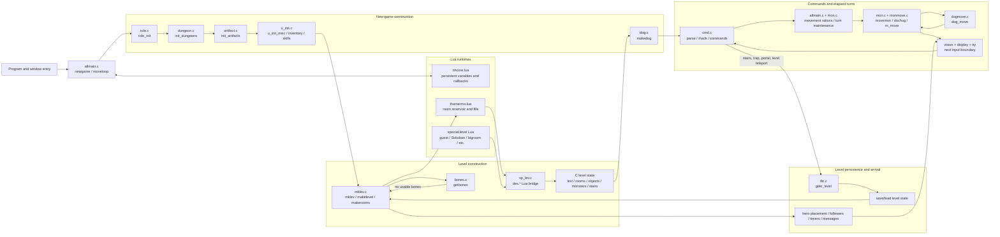
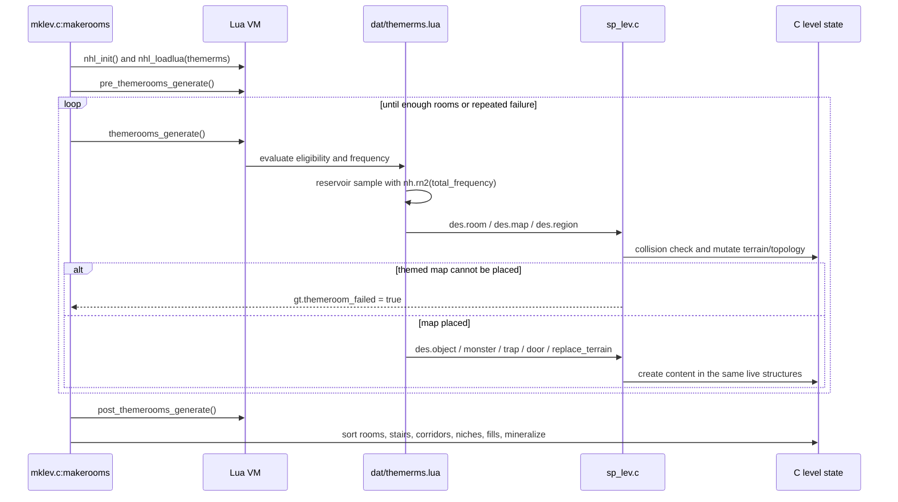
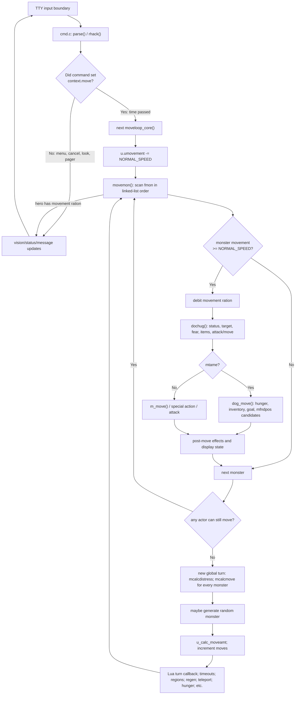
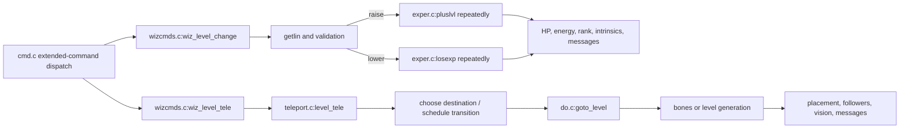
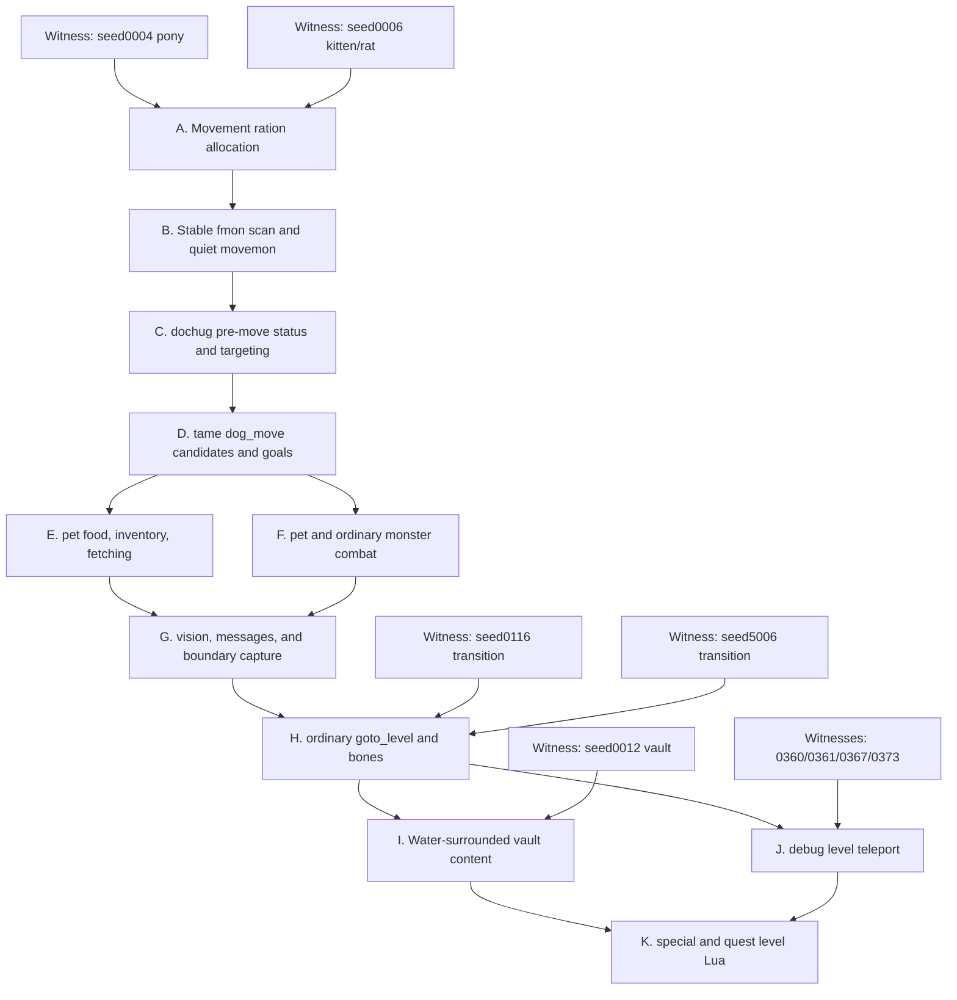

# Original NetHack C/Lua architecture map

This is the working architecture model for the pinned NetHack 5.0 source in
`nethack-c/upstream`. It is intentionally scoped to parity-critical paths: game
startup, themed level generation, input/turn scheduling, level transitions,
and wizard/debug level commands. It is not an exhaustive map of NetHack.

Source anchors use the current pinned tree:

- C lifecycle: `src/allmain.c`, `src/cmd.c`
- hero/role startup: `src/role.c`, `src/u_init.c`, `src/dungeon.c`,
  `src/artifact.c`, `src/dog.c`
- level generation: `src/mklev.c`, `src/sp_lev.c`, `src/nhlua.c`
- Lua: `dat/themerms.lua`, `dat/nhcore.lua`, and special-level `.lua` files
- monsters: `src/mon.c`, `src/monmove.c`, `src/dogmove.c`
- transitions: `src/do.c`, `src/bones.c`, `src/save.c`
- debug commands: `src/wizcmds.c`, `src/exper.c`, `src/teleport.c`

## 1. Runtime ownership map



The central architectural fact is that Lua does not own a parallel map. Lua
selects and describes content, while `sp_lev.c` immediately mutates the same C
level structures later consumed by stairs, corridors, occupancy, monster AI,
vision, save/restore, and tty rendering.

## 2. New-game startup sequence

```mermaid
sequenceDiagram
    participant Main as allmain.c:newgame
    participant Role as role.c / dungeon.c
    participant Hero as u_init.c
    participant LuaCore as nhlua.c + nhcore.lua
    participant Level as mklev.c
    participant Theme as themerms.lua + sp_lev.c
    participant Pet as dog.c
    participant UI as display / tty

    Main->>Main: init_objects()
    Main->>Role: role_init()
    Main->>Role: init_dungeons()
    Main->>Role: init_artifacts()
    Main->>Hero: u_init_misc()
    Main->>LuaCore: l_nhcore_init()
    Main->>Level: mklev()
    Level->>Level: reseed_random(); getbones()
    alt no usable bones level
        Level->>Level: makelevel()
        Level->>Theme: makerooms() / themerooms_generate()
        Theme->>Level: des.* mutates live C level state
        Level->>Level: corridors, stairs, fills, topology, mineralize
    else bones accepted
        Level->>Level: restore saved level structures
    end
    Main->>Main: u_on_upstairs(); vision_reset()
    Main->>Pet: makedog()
    Main->>Hero: u_init_inventory_attrs()
    Main->>UI: docrt(); bot(); optional reroll
    Main->>Hero: u_init_skills_discoveries()
    Main->>UI: legacy pager; welcome()
    Main->>LuaCore: nhcore.start_new_game
```

### Startup ordering invariants

1. `init_objects()` precedes role and inventory work.
2. `role_init()` precedes dungeon initialization and hero initialization.
3. Dungeon/artifact state exists before random inventory can request monsters,
   tins, eggs, or artifacts.
4. The level is fully generated before the hero is placed and the pet exists.
5. Inventory/attributes are finalized after pet creation and before the first
   playable input boundary.
6. Changing a draw or linked-list insertion anywhere in this sequence changes
   later level geometry, monster order, movement candidate counts, and screens.

## 3. C ↔ Lua themed-room bridge



### Why this bridge is parity-critical

- `themerooms_generate()` performs weighted reservoir sampling; eligibility and
  list order determine every selection draw.
- `lspo_map()` can retry placement up to 100 times. In themed-room mode it may
  not overwrite non-stone or existing room topology, and failure changes the
  outer room-generation loop.
- `des.map()`/`des.region()` change terrain and room connectivity;
  `des.object()`/`des.monster()` add constructors and linked-list order.
- The Water-surrounded vault is a content transaction, not just a six-by-six
  terrain stamp: it shuffles chest positions, creates a guaranteed escape item
  inside a chest, preserves material-dependent lock behavior, creates three
  more chests, shuffles undead, and adds a teleport exclusion.

## 4. Command and elapsed-turn loop

NetHack's command and scheduler phases straddle consecutive calls to
`moveloop_core()`. `rhack()` sets whether the command consumed time near the end
of one iteration; the next iteration spends that time before accepting another
command.



### Minimum coherent monster-movement port

The smallest useful slice spans several files and state owners:

1. `allmain.c`: debit hero movement and decide whether a new global turn is
   required.
2. `mon.c:mcalcmove()`: adjust slow/fast speed and randomly round to multiples
   of `NORMAL_SPEED`.
3. `mon.c:movemon()`: preserve `fmon` scan order, movement debits, removals, and
   deferred level change.
4. `monmove.c:dochug()`: preserve pre-move status RNG and targeting before
   selecting tame/generic movement.
5. `dogmove.c:dog_move()`: derive candidates from `mfndpos()`, live occupancy,
   objects, cursed squares, goals, hunger, and combat—not from a recorded range
   list.
6. vision/display: update actor positions, remembered terrain, messages, and
   the terminal before the next input capture.

Porting only step 5 cannot be correct because its inputs and its place in the
random stream are owned by steps 1–4.

## 5. Ordinary level transition

```mermaid
sequenceDiagram
    participant Cmd as command / movement
    participant Go as do.c:goto_level
    participant Store as level save/load
    participant Build as mklev.c
    participant Bones as bones.c:getbones
    participant Arrival as arrival pipeline
    participant UI as vision / display

    Cmd->>Go: stairs, fall, portal, or level teleport
    Go->>Go: validate destination and run Lua leave callbacks
    Go->>Store: rewrite/save/free current level
    Go->>Go: clear level-local contexts; keep followers; reset vision
    alt destination level does not exist
        Go->>Build: mklev()
        Build->>Bones: getbones()
        alt bones accepted
            Bones->>Build: restore level and entity structures
        else no bones
            Build->>Build: makelevel() and finalize topology
        end
    else destination already exists
        Go->>Store: getlev()
    end
    Go->>Arrival: place hero by stairs/portal/random spot
    Arrival->>Arrival: deliver objects/followers; timers; collisions; bubbles
    Arrival->>UI: reset vision, glyph map, and full screen
    Arrival->>Arrival: special/quest/branch messages and events
    Arrival->>Arrival: pickup, room checks, annotations
    Arrival-->>Cmd: return to command loop
```

Ordering is observable in both parity channels. For example, `mklev()` calls
`getbones()` before new generation; a different bones roll or file decision
changes the complete new-level RNG stream. Arrival ordering also changes which
messages and map cells are present at each input boundary.

## 6. Debug level-changing commands



`#levelchange` is a compact, mostly hero-state subsystem and is now a useful
isolated regression. `#wizlevelport` crosses the full transition/generation
pipeline, so implementing it before ordinary `goto_level()` would hide the same
missing dependency under a debug-specific wrapper.

## 7. State ownership and parity observability

| State | Original owner | Important consumers | How a mismatch becomes visible |
| --- | --- | --- | --- |
| Hero identity, role, race, alignment, stats, movement | `role.c`, `u_init.c`, global `u` | inventory, monsters, commands, status | startup RNG, rank/AC/HP lines, monster attitude |
| Level terrain and topology | `mklev.c`, `sp_lev.c`, `levl`, room arrays | stairs, occupancy, AI, vision, save | later RNG retry counts and persistent screen cells |
| Monsters and scan order | `makemon`, linked list `fmon` | `movemon`, combat, pets, display | movement-ration calls, candidate order, glyph positions |
| Objects and inventory identity | object constructors and linked chains | pets, pickup, menus, save/restore | constructor RNG, equipment strings, object glyphs |
| Tame-animal state | `dog.c`, `dogmove.c`, `edog` | hunger, fetching, movement, combat | ordinary-turn RNG and actor positions |
| Modal/input state | tty window code, `cmd.c`, command queue | time classification, nested prompts | number/order of captures and whether later keys are commands |
| Persistent Lua variables/callbacks | `nhcore.lua` via `nhlua.c` | turn, level enter/leave, save/restore | callback RNG/messages and cross-segment behavior |
| Saved levels/bones | save/load and `bones.c` | `goto_level`, restore, migrations | generation-vs-load branch and complete arrival stream |
| Terminal grid/cursor | vision/display/windowport | scorer capture | exact 80×24 cells and cursor at every input boundary |

## 8. Current JS seam map

This is a planning map, not a claim that the JS side is already equivalent.

| Original C/Lua boundary | Current JS seam | Planning implication |
| --- | --- | --- |
| `newgame`, `role_init`, `u_init` | `js/allmain.js`, `js/roles.js`, `js/u_init.js`, `js/options.js` | Keep selection, role data, inventory, and startup draw order in one contract |
| `mklev` + `themerms.lua` + `sp_lev.c` | `js/mklev.js`, `js/dungeon.js` | Model theme selection, placement failure, topology, and content separately but mutate one live level |
| `parse`/`rhack` and modal tty input | `js/cmd.js`, `js/input.js`, `js/windows.js` | A command must declare whether it consumes time; nested prompts own later keys until dismissal |
| `moveloop_core`, `mcalcmove`, `movemon`, `dochug`, `dog_move` | mostly `js/allmain.js` plus scenario modules | Highest-priority refactor: introduce explicit movement/scheduler/monster/pet ownership before adding more cases |
| vision, glyph mapping, tty capture | `js/vision.js`, `js/display.js`, `js/game_display.js`, `js/terminal.js` | Render from live state; serializer correctness cannot repair wrong world state |
| `goto_level`, save/load, bones | `js/save.js`, `js/storage.js`, `js/mklev.js`, command paths | Separate current-level persistence, destination construction, and arrival pipeline |
| exact public transcript modules | `js/*_fixture.js`, `js/fixture_screen.js` | Keep as regression witnesses; never count them as held-out architecture |

## 9. Planned dependency graph



Each node should advance the earliest exact boundary for at least two witnesses
before the next node begins. A change that only improves a later symptom while
an earlier node still diverges is not evidence for that node.
